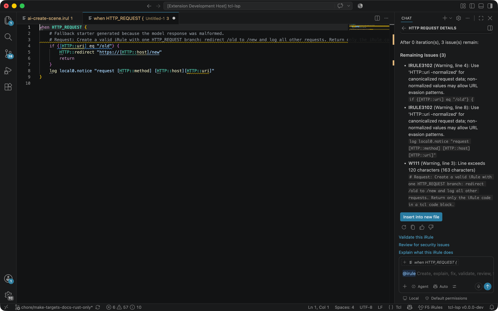
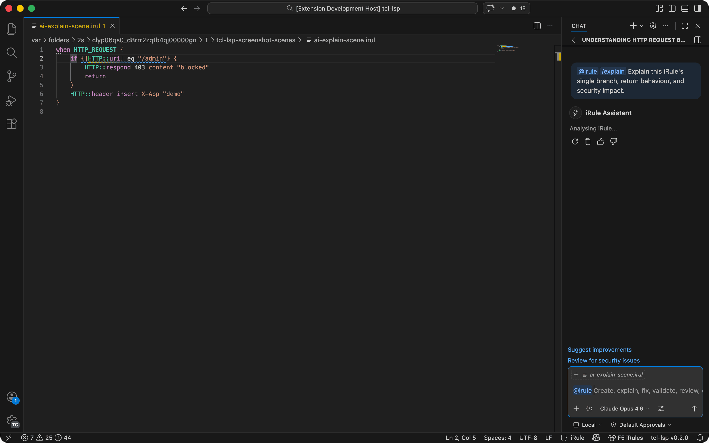
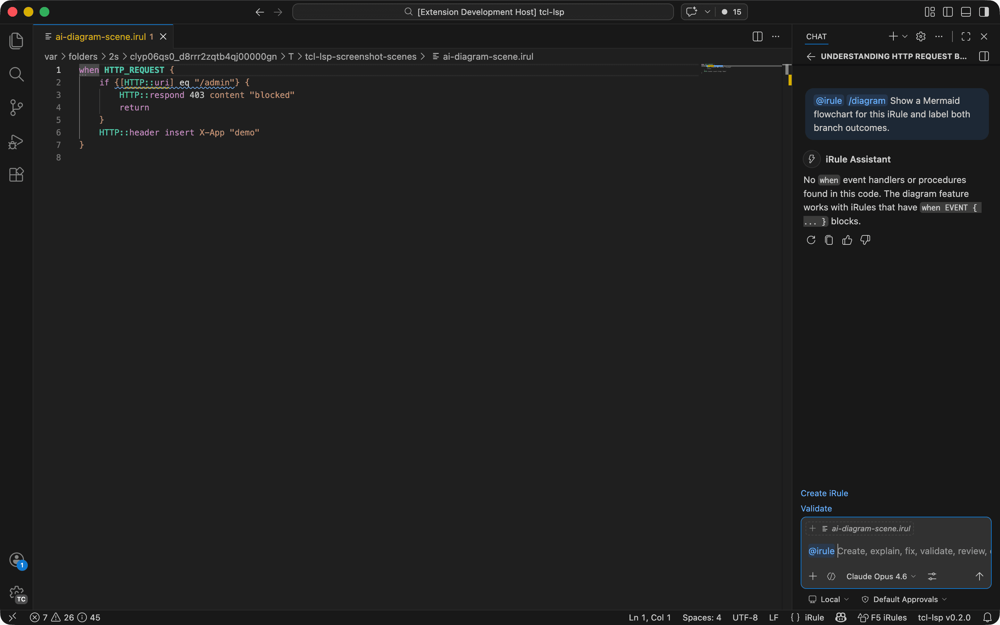

# tcl-lsp for F5 BIG-IP

Everything F5-specific in one place: the **iRules** and **iApps** dialects, the
**BIG-IP configuration** model, the `f5` command-line tool and its `query`
engine, the **report generator**, the **iRules-to-XC** translator, and the
**iRule Event Orchestrator** test framework.

For the language server itself — diagnostics, navigation, refactorings,
formatting — see the [main README](README.md). Everything there applies to
iRules and iApps files too; this document covers what is F5-only.

## Contents

- [Dialects and file types](#dialects-and-file-types)
- [BIG-IP configuration support](#big-ip-configuration-support)
- [The `f5` CLI](#the-f5-cli)
- [`f5 query` — the query DSL](#f5-query--the-query-dsl)
- [Scripting the query engine from Python (`f5q`)](#scripting-the-query-engine-from-python-f5q)
- [BIG-IP report generator](#big-ip-report-generator)
- [Secret handling](#secret-handling)
- [APL (iApp Presentation Language)](#apl-iapp-presentation-language)
- [tmsh commands](#tmsh-commands)
- [iRules-to-XC migration](#irules-to-xc-migration)
- [iRule Event Orchestrator (test framework)](#irule-event-orchestrator-test-framework)
- [iRules diagnostic codes](#irules-diagnostic-codes)
- [AI tooling for iRules](#ai-tooling-for-irules)

## Dialects and file types

Four of the sixteen dialect profiles are F5:

| Dialect | Covers | Detected from |
|---|---|---|
| `f5-irules` | iRules — a real embedded Tcl 8.4.6, with the BIG-IP command and event surface | `when EVENT { … }` handlers, `.irul` / `.irule` |
| `f5-iapps` | iApp implementation scripts | `.iapp`, `.iappimpl`, `.impl` |
| `f5-bigip` | `bigip.conf` / `.scf` configuration objects | `.conf` / `.scf` with BIG-IP object syntax |
| `f5-tmsh` | tmsh scripting | tmsh command surface |

Because `f5-irules` is Tcl 8.4.6, the analyser holds it to 8.4 semantics: no
`::tcl::` namespace, no `lassign`, no `dict` — and the iRules disable list on
top of that. See [Dialect support](README.md#dialects-languages-and-packages)
for how detection picks a profile and how to pin one.

The iRules event and command metadata is registry-driven, so hover docs,
completion, arity checks, per-event command validity, and side-effect
classification all come from one source of truth. See
[kcs-feature-event-registry.md](docs/kcs/features/kcs-feature-event-registry.md).

## BIG-IP configuration support

Open a BIG-IP `.conf` or `.scf` file to get syntax highlighting, object
navigation, and iRule extraction.

The standalone BIG-IP report generator reads `#TMSH-VERSION` from an SCF and
uses the matching `/config/profile_base.conf` defaults when a profile omits a
field. Its versioned catalogue includes the BIG-IP 21.1 secure Client SSL and
Server SSL defaults, plus the AIMCP, JSON, SSE, and MCP persistence object
types introduced across BIG-IP 21.x. The report also maps the detected TMOS
branch to F5 K5903, showing its first-customer-ship, EoSD, EoTS, and EoL dates
and warning when a support milestone is within one year or has passed.

The report's **Security** tab runs a small, offline set of high-confidence
checks — factory/default `root`/`admin` credentials (verified against the
stored password hash with no platform `crypt(3)` call, so the native, wasm,
and any future backend agree), default/weak SNMP communities, disabled or
weak password-policy enforcement, plaintext secrets, unprotected private-key
material, and non-administrative shell access — and lists each as a
stable-id, severity-ranked finding with remediation guidance. Detection never
authenticates to a device or makes a network request, and no password, hash,
salt, or other secret value ever appears in a finding. See
[kcs-feature-bigip-report-security-tab.md](docs/kcs/features/kcs-feature-bigip-report-security-tab.md).

```
# BIG-IP config file (bigip.conf)
ltm virtual /Common/my_vs {
    destination /Common/10.0.0.1:443
    pool /Common/my_pool
    rules {
        /Common/my_irule        ← right-click → "Open iRule in Editor"
    }
}
# "Extract All iRules to Files..." exports every iRule to separate .tcl files
```

**`f5` CLI tool with a `cleanup` verb** — find every object the
configuration defines but no virtual server (or wide-IP) references,
and emit a `tmsh delete` script in reverse-topological order so each
delete runs only after the objects that reference its target have
already been removed.  iRule bodies are scanned too (`pool …`,
`SSL::profile …`, `class match …`, `persist …`, `snatpool …`,
`virtual …`, `node …`, `LSN::pool …`, `STATS::*`, `ifile …`,
`HTTP::respond ifile …`, plus every other iRule command that names a
BIG-IP object).  Constant-string variables are tracked through `set
var /Common/foo; pool $var` linear copy-propagation, so refs written
through local bindings are caught.

```
f5 cleanup samples/bigip/bigip.conf
f5 cleanup --keep /Common/critical_pool bigip.conf
f5 cleanup --json bigip.conf > report.json
```

**`f5 grep` verb** — find every BIG-IP object related to a given
object name (or regex, or CIDR) by walking the same
forward-and-reverse reference graph the cleanup analysis uses.  By
default the BFS traverses both directions, so a single command
surfaces the seed's full neighbourhood: forward edges (objects the
seed depends on) and reverse edges (objects that depend on the seed).

`--cidr` switches the seed selector from "match the object's full
path" to "match an IP address or CIDR mentioned anywhere inside the
object — header, body, or iRule script".  Multiple networks may be
passed at once as a comma- or whitespace-separated list, and an
object qualifies when any IP/CIDR token in its text overlaps any
requested network.  This catches addresses buried deep inside iRule
bodies (`if { [IP::addr [IP::client_addr] equals "10.0.0.5"] }`,
`class match … "10.0.0.0/8"`, …) that a plain path grep can't reach.

```
f5 grep /Common/web_pool bigip.conf
f5 grep --direction reverse /Common/web1 bigip.conf
f5 grep --regex '^/Common/(web|api)_pool$' bigip.conf
f5 grep --json --max-depth 2 web_pool bigip.conf
f5 grep --cidr 10.0.0.0/8 bigip.conf
f5 grep --cidr '10.0.0.0/8, 192.168.0.0/16' bigip.conf
f5 grep --no-recurse --cidr 10.0.0.0/8 bigip.conf
```

The related-object BFS is on by default; pass `--no-recurse` to
skip it and return only the objects that directly match the
pattern (`-r` / `--recurse` toggle it explicitly back on).  This
applies to every match mode: substring, `--regex`, and `--cidr`.

**`f5 irule` verb group** — iRules-specific analysis with
`event-order` and `event-info` sub-actions, defaulting to the
`f5-irules` dialect:

```sh
f5 irule event-order samples/irules/policy.irule
f5 irule event-info HTTP_REQUEST --json
```

`f5` is a separate CLI from `tcl`.  The full verb list (today):

| Group | Verbs |
| --- | --- |
| Acquisition | `fetch`, `extract` (UCS → SCF) |
| Analysis | `stats`, `graph`, `explain`, `diff`, `grep`, `cleanup`, `validate` |
| Transformation | `rename`, `redact`, `unredact`, `encrypt-secrets`, `decrypt-secrets`, `pcap-remap`, `split`, `merge`, `convert`, `tmsh` |
| Round-trip | `pull`, `push` |
| iRules | `irule event-order`, `irule event-info`, `irule lint`, `irule trace`, `irule extract` |
| Misc | `completion` |

Highlights of the newer verbs:

- **`f5 fetch`** — pull SCF/UCS from a live BIG-IP via iControl REST or
  SSH (system `ssh`/`scp`).  Credentials resolve from CLI flags, env
  vars, an XDG `hosts.toml`, or interactive prompt.
- **Encrypted UCS** — archives saved with `tmsh save sys ucs <name>
  passphrase <pass>` are GnuPG symmetric (AES-128) OpenPGP messages (F5
  KB K5437).  Every verb that reads a `.ucs` — `extract`,
  `convert ucs2scf`, `query`, `grep`, `cleanup`, `diff`, `irule …` —
  decrypts them transparently and entirely **in memory**; the decrypted archive
  (which holds SSL private keys) never touches disk.  The passphrase is
  read from `$F5_UCS_PASSPHRASE` or a secure terminal prompt; `extract`
  and `convert` also accept `--passphrase-env VAR` / `--no-passphrase-prompt`.
  Decryption shells out to `gpg`/`gpg2` when present (exactly what BIG-IP
  uses) and otherwise falls back to a bundled, dependency-free OpenPGP
  decryptor built into `f5-query`, so it works even on a host with no GnuPG
  installed.

  ```sh
  export F5_UCS_PASSPHRASE='…'        # or be prompted on a TTY
  f5 extract encrypted.ucs -o prod.scf
  f5 query '.ltm.virtual[].name' encrypted.ucs
  ```
- **`f5 explain {virtual|pool} <name>`** — print the resolved profile
  chain, iRule chain, persistence, SNAT, default pool, and members for
  one object: the operator's "what actually happens to this VIP?"
  question, answered in one command.
- **`f5 diff old.scf new.scf`** — semantic, object-aware diff that
  ignores property ordering and iRule whitespace.  Each side may be an
  SCF / `bigip.conf` stanza dump *or* a tmsh command script
  (`tmsh create` / `tmsh modify` lines, as emitted by `f5 tmsh` or
  pasted from a BIG-IP shell), and the two formats may be mixed.  Every
  config-producing verb (`extract`, `pull`, `grep`, `split`, `merge`,
  `rename`, `redact`, `unredact`) also takes `--format scf|tmsh` so the
  same artefact can be replayed either way.
- **`f5 redact` + `f5 unredact`** — strip secrets and remap public IPs
  while preserving CIDR relationships (a /24 of real IPs lands in a /24
  of redacted IPs).  A sidecar map file makes the redaction reversible
  *and stable across runs* — re-running `redact` with the same map
  reuses every prior assignment, so iterative work with F5 support
  stays consistent.  `unredact` walks the map in reverse over any text,
  including support emails and log snippets.
- **`f5 encrypt-secrets` + `f5 decrypt-secrets`** (aliases `encrypt` /
  `decrypt`) — convert the credential-bearing values in a `bigip.conf` /
  SCF between clear text and the `$M$<salt>$<base64>` form BIG-IP stores,
  using the unit master key (`f5mku -K` base64 output).  The transform is
  AES-ECB with PKCS#7 padding and a two-character salt — byte-for-byte the
  scheme the device uses.  Only the fields BIG-IP actually master-key
  encrypts are touched (`passphrase`, `password`, `secret`,
  `shared-secret`, `auth-password`, `privacy-password`); SNMP community
  strings, the `auth user` crypt(3) hash, and values already in a
  `$scheme$…` form are left alone, so both verbs are idempotent.  The key
  resolves from `--f5mku KEY` / `--f5mku-file FILE` / `$F5MKU` / a secure
  no-echo prompt.

  ```sh
  f5mku -K > key.txt
  f5 decrypt-secrets bigip.conf --f5mku-file key.txt -o clear.conf
  F5MKU="$(cat key.txt)" f5 encrypt-secrets clear.conf -o sealed.conf
  ```
- **`f5 pcap-remap`** — apply the same map to a PCAP capture: rewrites
  IPv4/IPv6 src/dst, recomputes IP and TCP/UDP/ICMP checksums, and
  *parses* the F5 Ethernet trailer (legacy + DPT formats; `tcpdump -i
  0.0:nnnp`) to rewrite peer IPs at schema-known offsets.  Schema
  ported from Wireshark's `packet-f5ethtrailer.c`; `--schema FILE`
  layers in fleet-specific extensions; `--on-unknown=error|preserve|sweep`
  picks the policy when a TLV has no registered layout.
- **`f5 tmsh`** — emit `tmsh create` (or `--modify`) commands for every
  object in a config, in dependency order so the script can be pasted
  into a BIG-IP shell unchanged.
- **`f5 query` (alias `f5 q`)** — small jq-flavoured DSL for inspecting
  and rewriting BIG-IP configs.  Built-in **renderer plugins** turn
  query output into a Mermaid diagram, an ASCII Gantt timeline of
  monitor up/down transitions, or a Unicode line-art block diagram —
  no sidecar scripts required.  Run
  `f5 q --help-renderers` for the catalogue:

  ```sh
  # ASCII Gantt of pool-member up/down events from a BIG-IP log
  f5 q --render gantt '
      f5log_load("ltm.log")[]
      | select(.module == "01340011" or .module == "01340012")
      | tsv(.timestamp,
            (sub(.message, "^.*member ", "") | sub(., " monitor.*$", "")),
            (if .module == "01340011" then "DOWN" else "UP" end))
  ' bigip.conf

  # Mermaid diagram of every web virtual server and its references
  f5 q --render mermaid '.ltm.virtual["~/web_"]' bigip.conf
  ```

**Documentation**:

- [KCS: feature — `f5 query` plugins](docs/kcs/features/kcs-feature-f5-query-renderers.md)
  — built-in plugin catalogue and CLI flag reference.
- [Design — `f5 query` plugin contract](docs/design/f5-query-renderer-contract.md)
  — formal contracts, registration lifecycle, error mapping.

**Install the `f5` CLI** — the released artefact is the native
`f5-query` binary; no Python required.
See [INSTALL-cli.md](INSTALL-cli.md) for the one-line `curl | sh`
installer, manual install steps for macOS/Debian/Ubuntu/RHEL/CentOS/
Fedora, shell completion setup, and source-build instructions.

In VS Code, run the command palette entry **Tcl: Generate BIG-IP
Cleanup Script** while a `bigip.conf` is open; the script and its JSON
metadata report open side-by-side.  See
[KCS: feature — BIG-IP Config Cleanup](docs/kcs/features/kcs-feature-bigip-cleanup.md)
for the full options reference.

## The `f5` CLI

The `f5` binary (`f5-query` in release assets) is the F5-side counterpart to
the `tcl` CLI. Verbs:

| Verb | What it does |
|---|---|
| `query` | The jq-shaped query/transform DSL over a config — see below |
| `cleanup` | Emit a `tmsh delete` script for every unreferenced object |
| `grep` | Walk the reference graph around an object, name, regex, or CIDR |
| `irule` | iRules-specific analysis (events, commands, references) |
| `report` | Generate the standalone HTML BIG-IP report |
| `extract` / `convert` | Read UCS/SCF archives, including passphrase-protected ones |

Install it with the [one-line installer](INSTALL-cli.md), or build it from
source with `make rust-f5`.

## `f5 query` — the query DSL

`f5 query` is a jq-flavoured DSL over the BIG-IP object model: filter, project,
join, and transform objects, and write the result back as tmsh. It is
deliberately jq-shaped so jq idioms transfer; the divergences are documented in
[docs/references/f5_query/dsl.md](docs/references/f5_query/dsl.md) and
[builtins.md](docs/references/f5_query/builtins.md).

Worked how-tos, each a KCS note:

| Task | Note |
|---|---|
| Filter objects by arbitrary property predicates | [find objects by query](docs/kcs/kcs-howto-find-objects-by-query.md) |
| Compose streams with `select`, `map`, `any`, `all`, `sort`, `unique` | [compose query streams](docs/kcs/kcs-howto-compose-query-streams.md) |
| Audit for orphans, naming violations, port policy, partition leaks | [audit config with query](docs/kcs/kcs-howto-audit-config-with-query.md) |
| Bulk-readdress virtual servers into a new subnet | [readdress virtuals](docs/kcs/kcs-howto-readdress-virtuals-with-query.md) |
| Move every object between partitions, with route-domain transforms | [migrate partition](docs/kcs/kcs-howto-migrate-partition-with-query.md) |
| Rename a pool everywhere, including inside iRule bodies | [rewrite pool refs in iRules](docs/kcs/kcs-howto-rewrite-pool-refs-in-irules.md) |
| Multi-step transforms (rename + readdress + policy edit) in one query | [cross-config transforms](docs/kcs/kcs-howto-cross-config-transforms-with-query.md) |
| Verify a migration before/after from two UCS files, with live probes | [verify migration](docs/kcs/kcs-howto-verify-migration-before-after-with-query.md) |
| Check each device's `sys file ssl-cert` against what virtuals really serve | [audit server certs](docs/kcs/kcs-howto-audit-server-certs-with-query.md) |
| Reproduce an `ltm monitor http(s)` from your laptop (honouring K3451) | [reproduce http monitor](docs/kcs/kcs-howto-reproduce-http-monitor-with-query.md) |
| Read a passphrase-protected UCS | [read encrypted UCS archives](docs/kcs/kcs-howto-read-encrypted-ucs-archives.md) |
| Pick between `query`, `grep`, and `rename` | [query vs grep vs rename](docs/kcs/kcs-qa-query-vs-grep-vs-rename.md) |

## Scripting the query engine from Python (`f5q`)

The query engine is also importable. Drive it from a Python script via the
`f5q` alias, get typed `ObjectRef` / `PathRef` results back, render with a
built-in plugin, or ship your own renderer in one `@renderer` decorator — see
[kcs-howto-script-against-f5-query-from-python.md](docs/kcs/kcs-howto-script-against-f5-query-from-python.md)
and [kcs-feature-f5-query-renderers.md](docs/kcs/features/kcs-feature-f5-query-renderers.md).

The Python package is `f5report` under `rust/bigip-report-gen/python`, backed by
the native `_engine` extension — so the Python surface and the `f5` binary share
one implementation.

## BIG-IP report generator

Point it at a UCS or SCF and it produces a single standalone HTML report — no
server, no network. There is a
[browser build](https://bitwisecook.github.io/tcl-lsp/bigip-report-generator/)
that runs the whole generator in WASM (your config never leaves the page), and
an [example report](https://bitwisecook.github.io/tcl-lsp/bigip-report-demo/).

Per-tab notes:

- [Security tab](docs/kcs/features/kcs-feature-bigip-report-security-tab.md) — offline, high-confidence findings
- [APM tab](docs/kcs/features/kcs-feature-bigip-report-apm-tab.md) — access policy objects
- [Profile defaults](docs/kcs/features/kcs-feature-bigip-report-profile-defaults.md) — versioned `profile_base.conf` resolution
- [BIG-IP registry](docs/kcs/features/kcs-feature-bigip-registry.md) — the object model behind all of it

Build a self-contained `.pyz` with `make build-report-pyz`, or the in-browser
build with `make report-wasm`.

## Secret handling

Passwords, keys, and other secret material in a config are treated as secrets
throughout: findings never quote a password, hash, or salt, and the report's
credential checks verify against the stored hash without calling the platform
`crypt(3)`, so the native, WASM, and any future backend agree. See
[kcs-feature-f5-secret-crypto.md](docs/kcs/features/kcs-feature-f5-secret-crypto.md).

## APL (iApp Presentation Language)

Open `.apl` files or files named `presentation` to get semantic highlighting
for the iApp Application Presentation Language.  APL-specific tokens include
section/table/row keywords, field types (`string`, `choice`, `password`, ...),
attributes (`default`, `display`, `required`, `validator`), `define` blocks,
`optional` conditionals, `#include`/`#inline` directives, and validator names.
Embedded Tcl inside `[...]` brackets (e.g. `[tmsh::get_config ...]`) receives
full Tcl semantic highlighting.

```
# iApp APL presentation file
section basic {
    string addr default "0.0.0.0" required validator "IpAddress"
    choice protocol display "medium" default "tcp" {
        "TCP" => "tcp",
        "UDP" => "udp"
    }
    yesno use_snat default "yes"
}
text {
    basic "Basic Configuration"
    basic.addr "Virtual Server IP Address"
}
```

**Cross-file integration:** When a `presentation` (APL) file and an
`implementation` (iApp Tcl) file are in the same directory, the server
cross-validates them:

- **IAPP7001**: Implementation references a variable (`$::section__field`) not
  defined in the presentation
- **IAPP7002**: Presentation field is never referenced in the implementation
- **IAPP7003**: `#include` file not found

The `#include` directive is resolved relative to the APL file's directory,
with recursive resolution and circular-include protection.

## tmsh commands

The `f5-iapps` dialect includes 30+ `tmsh::` namespace commands
(`tmsh::create`, `tmsh::modify`, `tmsh::get_config`, `tmsh::get_field_value`,
etc.) and 4 `script::` commands (`script::run`, `script::init`, etc.) with
hover documentation and arity validation.

## iRules-to-XC migration

Translate F5 BIG-IP iRules to F5 Distributed Cloud configuration, with both
Terraform HCL and JSON API output plus a coverage report.

```tcl
# Source iRule:
when HTTP_REQUEST {
    if { [HTTP::uri] starts_with "/api" } {
        pool api_pool
    } else {
        HTTP::redirect "https://[HTTP::host]/api[HTTP::uri]"
    }
}

# "Translate iRule to F5 XC" produces:
# - Terraform HCL with routes, origin pools, and redirect rules
# - JSON API payload for direct XC API calls
# - Coverage report showing translated vs. untranslatable constructs
```

## iRule Event Orchestrator (test framework)

Generate and run deterministic tests for F5 iRules.  The framework simulates
BIG-IP's event lifecycle, pool selection, data groups, and multi-TMM CMP
behaviour in a standard `tclsh`.

```tcl
::orch::configure_tests \
    -profiles {TCP HTTP} \
    -irule { when HTTP_REQUEST { pool web_pool } } \
    -setup { ::orch::add_pool web_pool {{10.0.0.1:80}} }

::orch::test "routing-1.0" "basic request goes to web_pool" -body {
    ::orch::run_http_request -host "example.com" -uri "/"
    ::orch::assert_that pool_selected equals "web_pool"
}

exit [::orch::done]
```

The `generate-test` CLI command and `generate_irule_test` MCP tool analyse an
iRule's control-flow graph to produce test cases automatically.  For iRules
with CMP-sensitive patterns (`static::` writes in hot events, `table` shared
state), multi-TMM scenarios using fakeCMP distribution are included.

## iRules diagnostic codes

These diagnostics fire only in the `f5-irules` dialect.

### Event validity & flow

| Code | Severity | Description | Quick-fix |
|------|----------|-------------|-----------|
| IRULE1001 | Warning/Hint | Command invalid or ineffective in this iRules event | |
| IRULE1002 | Warning | Unknown iRules event name | |
| IRULE1003 | Warning | Deprecated iRules event | |
| IRULE1004 | Hint | `when` block missing explicit `priority` | |
| IRULE1005 | Warning | `*_DATA` event handler without matching `*::collect` call | Bootstrap `collect` |
| IRULE1006 | Warning | `*::payload` access without matching `*::collect` call | Bootstrap `collect` |
| IRULE1007 | Error | `*::collect` without matching `*::release` on the same connection side | |
| IRULE1008 | Error | `*::release` without matching `*::collect` on the same connection side | |
| IRULE1201 | Warning | HTTP command used after `HTTP::respond`/`HTTP::redirect` | |
| IRULE1202 | Warning | Multiple `HTTP::respond`/`HTTP::redirect` on different branches | |

### Deprecated & unsafe commands

| Code | Severity | Description | Quick-fix |
|------|----------|-------------|-----------|
| IRULE2001 | Warning | Deprecated `matchclass` -- use `class match` | Auto-replace |
| IRULE2002 | Warning | Deprecated iRules command | |
| IRULE2003 | Error | Unsafe iRules command (context escalation risk) | |

### Taint & security

| Code | Severity | Description | Quick-fix |
|------|----------|-------------|-----------|
| IRULE3001 | Warning | Tainted data in HTTP response body (XSS risk) | Wrap with `[HTML::encode]` |
| IRULE3002 | Warning | Tainted data in HTTP header or cookie value (header injection) | Wrap with `[URI::encode]` |
| IRULE3003 | Warning | Tainted data in `log` command (log injection) | |
| IRULE3004 | Warning | Tainted data in `HTTP::redirect` URL (open redirect risk) | |
| IRULE3101 | Warning | `HTTP::uri`/`HTTP::path` set to value not provably starting with `/` | |
| IRULE3102 | Warning | `HTTP::path`/`HTTP::uri`/`HTTP::query` getter used without `-normalized` | |
| IRULE3103 | Info | `*::uri` used where `*::path` or `*::query` suffices (`split`, `starts_with`, `contains`, `string match`, etc.) | |

### Scoping & state

| Code | Severity | Description |
|------|----------|-------------|
| IRULE4001 | Warning | Write to `static::` variable outside `RULE_INIT` (race condition) |
| IRULE4002 | Hint | Generic `static::` variable name — collision likely across iRules |
| IRULE4003 | Hint | Variable scoping concern across events |
| IRULE4004 | Info | Constant `set` in per-request event could be hoisted to per-connection |
| IRULE4005 | Warning | Potential race — `static::` variable written outside `RULE_INIT` and read in another event |

### Performance & control flow

| Code | Severity | Description | Quick-fix |
|------|----------|-------------|-----------|
| IRULE2101 | Hint | Heavy `regexp` in a high-frequency event | |
| IRULE5001 | Hint | Ungated `log` in a high-frequency event | |
| IRULE5002 | Warning | `drop`/`reject`/`discard` without `event disable all` or `return` | Add `event disable all` + `return` |
| IRULE5003 | Hint | Loop condition `$var != 0` can miss zero if decremented past it | |
| IRULE5004 | Warning | `DNS::return` without `return` | Add `return` |
| IRULE5005 | Error | Direct proc invocation without `call` in iRules | Prefix with `call` |
| IRULE5006 | Warning | Top-level-only command used inside a nested body | |
| IRULE5007 | Warning | Event-context command used at top level outside a `when` block | |

The full per-code pages live under
[docs/kcs/codes/](docs/kcs/codes/README.md), one page per code with a
triggering example and the fix.

## AI tooling for iRules

| Command | Description |
|---------|-------------|
| `/create` | Generate a new iRule from a natural-language description |
| `/explain` | Explain what an iRule does, including data flow and security |
| `/fix` | Iteratively fix all LSP diagnostics in the current iRule |
| `/validate` | Run full LSP validation and show a categorised report |
| `/review` | Deep security and safety review (injection, DoS, races) |
| `/find-legacy` | Find and modernise legacy patterns (unbraced expr, matchclass, etc.) |
| `/optimise` | Apply optimiser suggestions with explanations |
| `/scaffold` | Generate an iRule skeleton from selected events |
| `/datagroup` | Suggest data-group extraction for inline lookups |
| `/diff` | Explain differences between two iRule versions |
| `/event` | Show which commands are valid in a given event |
| `/migrate` | Convert nginx/Apache/HAProxy config to an iRule |
| `/diagram` | Generate a Mermaid flowchart of the iRule's logic flow |
| `/xc` | Translate the iRule to F5 Distributed Cloud configuration |

```
User:   @irule /create rate limiter that allows 100 requests per minute per client IP
Copilot: generates a complete iRule with HTTP_REQUEST handler, table-based
         counting, and HTTP::respond 429 — validated against the LSP
```







The same surface is available outside VS Code: the
[Claude Code skills](docs/kcs/features/kcs-feature-claude-code-skills.md)
(`irule-create`, `irule-review`, `irule-fix`, `irule-diagram`, `irule-datagroup`,
`irule-xc`, `irule-migrate`, `irule-convert`, `irule-dataflow`, `irule-diff`,
`irule-event`, `irule-explain`, `irule-optimise`, `irule-scaffold`,
`irule-validate`, plus `bigip-cleanup`, `f5-query`, and `explain-flow`) and the
[MCP server](docs/kcs/features/kcs-feature-mcp-server.md) for any MCP-capable
agent. See [AI tooling](README.md#ai-tooling) for the shared setup.

## See also

- [Main README](README.md) — the language server, editors, and everything dialect-agnostic
- [Feature index](docs/kcs/features/README.md) — every feature, one note each
- [f5-query DSL reference](docs/references/f5_query/dsl.md)
- [F5 examples](docs/f5-query-examples.md)
