<p align="center">
  
</p>

# tcl-lsp

A language server for Tcl with multi-editor support.

<p align="center">
  
</p>

The server is written in Python using [pygls](https://github.com/openlawlibrary/pygls)
and communicates over stdio, making it compatible with any LSP client.

## Editor support

> **[Installation Guide](INSTALL.md)** — step-by-step instructions for
> installing from GitHub Releases on macOS and Windows.

| Editor | Type | Setup | Unique extras |
|--------|------|-------|---------------|
| [VS Code](editors/vscode/) | Full extension (.vsix) | Install `.vsix` from Releases | Compiler explorer panel, Tk preview, `@irule`/`@tcl`/`@tk` Copilot chat, 25+ commands |
| [Neovim](editors/neovim/) | Config snippet (Lua) | Copy `tcl_lsp.lua` to `~/.config/nvim/lsp/` | Zero-plugin on 0.11+; also supports nvim-lspconfig |
| [Zed](editors/zed/) | Full extension (TOML + Rust) | Install from Zed extension registry | 16 built-in snippets, MCP context server, `/tcl-doc` and `/irule-event` slash commands |
| [Emacs](editors/emacs/) | Config snippet (Elisp) | Add to `init.el` for eglot or lsp-mode | Works with built-in eglot (Emacs 29+) |
| [Helix](editors/helix/) | Config snippet (TOML) | Add to `~/.config/helix/languages.toml` | Minimal pure-TOML setup |
| [Sublime Text](editors/sublime-text/) | Full package (.sublime-package) | Package Control or manual install | Works standalone (syntax + snippets) without LSP; enhanced with LSP package |
| [JetBrains](editors/jetbrains/) | Full plugin (.zip) | Settings > Plugins > Install from Disk | Compiler explorer tool window, settings UI panel, IntelliJ IDEA 2024.1+ |

All editors connect to the same Python LSP server over stdio.  The server can
be invoked from source (`uv run python -m server`) or as a standalone zipapp
(`python3 tcl-lsp-server.pyz`).

**File types recognised:** `.tcl`, `.tk`, `.itcl`, `.tm`, `.irul`, `.irule`,
`.iapp`, `.iappimpl`, `.impl`, plus shebang detection for `#!/usr/bin/tclsh`
and `#!/usr/bin/wish`.

### VS Code

The full-featured extension, distributed as a `.vsix`, bundles the LSP server
and provides the richest integration.

**25+ commands** including: Restart Server, Select Dialect, Apply Safe Quick
Fixes, Apply All Optimisations, Open Compiler Explorer, Open Tk Preview,
Format Document, Minify Document, Insert iRule Event Skeleton, Scaffold Tcl
Package Starter, Insert `package require`, Run Runtime Validation, Translate
iRule to F5 XC, Extract iRule from Config, Escape/Unescape Selection, Base64
Encode/Decode Selection.

**Keyboard shortcuts:** Ctrl+Alt+O (optimise), Ctrl+Alt+M (minify),
Ctrl+Alt+E (compiler explorer).

**Status bar:** shows the active dialect (clickable to change) and the
extension version.

```sh
# Install from release
code --install-extension tcl-lsp-0.1.0.vsix
```

### Neovim

Zero-plugin setup on Neovim 0.11+ using the native LSP client.  Also works
with nvim-lspconfig (0.8+) or a manual `FileType` autocommand.

```lua
-- ~/.config/nvim/lsp/tcl_lsp.lua  (Neovim 0.11+)
return {
  cmd = { "python3", "/path/to/tcl-lsp-server.pyz" },
  filetypes = { "tcl" },
  settings = {
    tclLsp = {
      dialect = "tcl8.6",
      formatting = { indentSize = 4, maxLineLength = 120 },
    },
  },
}

-- init.lua
vim.filetype.add({ extension = { tcl = "tcl", irul = "tcl", irule = "tcl" } })
vim.lsp.enable("tcl_lsp")
```

### Zed

A full Zed extension that auto-downloads the server zipapp from GitHub Releases
on first use and auto-discovers Python 3.10+ on your PATH.

Includes 16 built-in snippets (`tcl-proc`, `tcl-namespace`, `tcl-if`,
`irule-http-request`, `irule-collect-release`, etc.), an MCP context server
exposing all 23 analysis tools, and slash commands (`/tcl-doc`, `/irule-event`,
`/tcl-validate`).

```sh
# Install from the Zed extension registry (search "Tcl")
# Or install from a release artifact (no Rust required):
#   1. Download tcl-lsp-zed-*.zip from the GitHub Releases page
#   2. unzip tcl-lsp-zed-*.zip -d /tmp/tcl-lsp-zed
#   3. Command Palette (Cmd+Shift+P) > "zed: install dev extension" > select /tmp/tcl-lsp-zed
# Or build from source (requires Rust via rustup — https://rustup.rs):
#   1. make zed
#   2. Command Palette > "zed: install dev extension" > select editors/zed/
```

### Emacs

Works with the built-in **eglot** client (Emacs 29+) or **lsp-mode**.

```elisp
;; eglot (Emacs 29+)
(with-eval-after-load 'eglot
  (add-to-list 'eglot-server-programs
               '(tcl-mode . ("python3" "/path/to/tcl-lsp-server.pyz"))))
(add-hook 'tcl-mode-hook #'eglot-ensure)

;; Settings
(setq-default eglot-workspace-configuration
              '(:tclLsp (:dialect "tcl8.6"
                         :formatting (:indentSize 4 :maxLineLength 120))))
```

### Helix

Minimal TOML configuration in `~/.config/helix/languages.toml`.

```toml
[language-server.tcl-lsp]
command = "python3"
args = ["/path/to/tcl-lsp-server.pyz"]

[language-server.tcl-lsp.config.tclLsp]
dialect = "tcl8.6"

[[language]]
name = "tcl"
scope = "source.tcl"
file-types = ["tcl", "tk", "itcl", "tm", "irul", "irule", "iapp"]
language-servers = ["tcl-lsp"]
```

### Sublime Text

A full Sublime Text package (`.sublime-package`) that works in two modes:
standalone (syntax highlighting + 16 snippets + static completions) and
enhanced (full LSP features when the LSP package is installed).

Auto-discovers the bundled `.pyz` server from the package archive.

```sh
# Install via Package Control:
#   Command Palette > Package Control: Install Package > Tcl

# Or manual install:
#   Download Tcl.sublime-package from Releases
#   Place in ~/Library/Application Support/Sublime Text/Installed Packages/
```

**Commands:** Select Dialect, Restart Language Server, Format Document, Minify
Document, Apply Safe Quick Fixes, Apply All Optimisations.

### JetBrains

A full IntelliJ Platform plugin (`.zip`) for IntelliJ IDEA 2024.1+ and other
JetBrains IDEs.  Includes a dedicated settings panel (Settings > Tools > Tcl
Language Server) with toggles for every feature, diagnostic code, and
formatting option.

Features a **Compiler Explorer tool window** with JCEF browser for inspecting
IR, CFG, SSA, and optimiser output directly inside the IDE.

```sh
# Install from release:
#   Settings > Plugins > ⚙️ > Install Plugin from Disk > tcl-lsp-jetbrains.zip

# Build from source:
make jetbrains
```

## Features

### Async tiered diagnostics

Fast syntax feedback fires immediately on every keystroke; deeper semantic,
optimiser, and security analysis runs in the background and merges results as
each tier completes.

```tcl
# Tier 1 (instant): syntax errors — missing brace caught on parse
proc broken {x {
    puts $x
}

# Tier 2 (background): semantic — arity mismatch flagged after analysis
string length "a" "b"   ;# E003: too many arguments
```

### Semantic highlighting

Variables, procs, keywords, and strings are classified using SSA-informed type
information, giving richer highlighting than a TextMate grammar alone.  The
server provides 43 token types beyond the standard LSP set, including
sub-token highlighting inside strings.

```tcl
namespace eval app {
    variable count 0            ;# 'count' highlighted as variable
    proc handle {request} {     ;# 'handle' highlighted as function
        incr count              ;# 'incr' highlighted as keyword
        puts "req: $request"    ;# '$request' highlighted as variable inside string
    }
}
```

In addition to standard token types (keyword, function, variable, string,
comment, number, operator, parameter, namespace), the server provides
domain-specific token types:

| Category | Token types | Example |
|----------|-------------|---------|
| **Regexp** | `regexpGroup`, `regexpCharClass`, `regexpQuantifier`, `regexpAnchor`, `regexpEscape`, `regexpBackref`, `regexpAlternation` | `regexp {(\d+)\s+(\w+)} $line` — each part gets distinct highlighting |
| **Format strings** | `formatPercent`, `formatSpec`, `formatFlag`, `formatWidth` | `format "%- 10.2f" $val` — `%`, `-`, `10.2`, and `f` each highlighted |
| **Binary format** | `binarySpec`, `binaryCount`, `binaryFlag` | `binary scan $data su3 x y z` — `s`, `u`, and `3` each highlighted |
| **Clock format** | `clockPercent`, `clockSpec`, `clockModifier` | `clock format $t -format "%Y-%m-%d"` — `%`, `Y`, `m`, `d` each highlighted |
| **Escape sequences** | `escape` | `puts "line1\nline2\t${var}"` — `\n`, `\t` highlighted inside strings |
| **BIG-IP config** | `object`, `ipAddress`, `port`, `partition`, `pool`, `monitor`, `profile`, `vlan`, `fqdn`, `routeDomain`, `encrypted`, `interface` | BIG-IP `.conf` files get object-aware highlighting |

### Diagnostics

Arity errors, unknown subcommands, best-practice violations, and security
issues are reported with precise ranges.  All diagnostics support inline
suppression with `# noqa: CODE` comments.

```tcl
string frobulate $x          ;# W001: unknown subcommand 'frobulate'
set y [expr $a + $b]         ;# W100: unbraced expr (double-substitution risk)
eval $user_input             ;# W101: eval with substituted arguments (injection risk)
catch { error "oops" }       ;# W302: catch without a result variable
```

### Completions

Context-aware completions for commands, subcommands, variables, proc names
(workspace-wide), switch arms, and `package require` names.

```tcl
string len|              ;# offers: length, last, ...
set name "world"
puts $na|                ;# offers: $name
dict |                   ;# offers: create, get, set, exists, ...
```

### Hover

Hovering on a command, proc call, variable, or operator shows its signature,
doc comment, and type information.

```tcl
## Greet a person by name.
proc greet {name} {
    puts "Hello, $name!"
}

greet "Alice"     ;# hover on 'greet' shows: proc greet {name} — "Greet a person by name."
```

### Go to definition

Jump to the definition of a proc or variable — works across files in the
workspace.

```tcl
proc helper {} { return 42 }
set x [helper]       ;# Ctrl+Click on 'helper' → jumps to proc definition above
puts $x              ;# Ctrl+Click on '$x' → jumps to the set statement
```

### Find references

Locate every usage of a proc or variable, including inside nested braced
script bodies such as `if`, `foreach`, and `namespace eval`.

```tcl
proc add {a b} { expr {$a + $b} }
set sum [add 1 2]       ;# ← reference to 'add'
puts [add 3 4]           ;# ← reference to 'add'
# "Find all references" on 'add' highlights all three locations
```

### Call hierarchy

Inspect incoming callers and outgoing callees for any procedure.

```tcl
proc validate {input} { return [string is integer $input] }
proc process {data}   { if {[validate $data]} { store $data } }
proc main {}          { process "42" }

# Incoming calls to 'validate': process
# Outgoing calls from 'process': validate, store
```

### Rename symbol

Safely rename a proc or variable across all scopes in the file.

```tcl
proc greeting {name} {
    puts "Hi, $name"
}
greeting "World"
# Rename 'greeting' → 'salute' updates the proc definition and all call sites
```

### Signature help

As you type arguments, the server shows the expected parameter list with the
active parameter highlighted.

```tcl
proc connect {host port {timeout 30}} { ... }
connect "db.local" |
#                  ↑ signature help shows: connect (host port ?timeout?)
#                    with 'port' highlighted as the active parameter
```

### Inlay hints

Inline annotations show inferred types, format-string specifier meanings, and
parameter names.

```tcl
set count 42                          ;# inlay: ': int'
set msg [format "%s has %d items" $name $count]
#                 ↑ '%s → string'  ↑ '%d → integer'
```

### Document symbols

A structured outline of the current file — procs, namespaces, variables — for
quick navigation (Ctrl+Shift+O / Cmd+Shift+O).

```tcl
namespace eval app {
    variable config {}         ;# symbol: app::config (variable)
    proc init {} { ... }       ;# symbol: app::init (function)
    proc run {} { init }       ;# symbol: app::run (function)
}
# Outline: app (namespace) → config, init, run
```

### Workspace symbols

Search for procs and variables across all open files in the workspace
(Ctrl+T / Cmd+T).

```tcl
# File: utils.tcl
proc ::utils::parse_csv {data} { ... }

# File: main.tcl
# Type "parse_csv" in workspace symbol search → jumps to utils.tcl
```

### Folding ranges

Collapse proc bodies, control-flow blocks, multi-line comments, and namespace
bodies.

```tcl
# ── Header comment ──          ← foldable
# Author: ...
proc calculate {x} {            ← foldable
    if {$x > 0} {               ← foldable
        return [expr {$x * 2}]
    }
}
```

### Selection ranges

Smart expand/shrink selection by syntactic structure
(Alt+Shift+→ / Alt+Shift+←).

```tcl
proc greet {name} {
    puts "Hello $name"
}
# Cursor on 'name' inside puts → expand: "$name" → "Hello $name" → puts command → proc body → proc → file
```

### Document links

`source` paths and `package require` names become clickable links that
navigate to the resolved file or package.

```tcl
package require http        ;# click → opens http package source
source lib/utils.tcl        ;# click → opens lib/utils.tcl
```

### Formatting

Full-document and range formatting with 24 configurable options.  Defaults
follow the F5 iRules Style Guide.  Supports full-document
(`textDocument/formatting`) and range (`textDocument/rangeFormatting`)
requests.

```tcl
# Before:
proc messy { x  }  {
if {$x>0}{return $x }
   set y   [expr $x+1]  ;  puts $y }

# After (formatted):
proc messy {x} {
    if {$x > 0} {
        return $x
    }
    set y [expr $x + 1]
    puts $y
}
```

Capabilities include indentation (spaces or tabs, configurable size),
brace placement (K&R), expression bracing enforcement, variable
bracing (`$var` → `${var}`), line-length wrapping, semicolon splitting,
single-line body expansion, blank-line normalisation between procs and
blocks, comment alignment, trailing whitespace trimming, and line-ending
normalisation (LF/CRLF/CR).

```tcl
# Expression bracing enforcement (enforceBracedExpr = true):
if {$x > 0} { ... }       ;# ✓ braced
if $x>0 { ... }           ;# → rewritten to: if {$x > 0} { ... }

# Variable bracing (enforceBracedVariables = true):
puts $name                 ;# → rewritten to: puts ${name}
```

### Code actions

Quick-fix actions are offered for diagnostics that have automated repairs.
Refactoring actions are available on selected code.

```tcl
expr $a + $b         ;# W100 → quick-fix: wrap in braces → expr {$a + $b}
catch { error "x" }  ;# W302 → quick-fix: add result variable → catch { error "x" } result
set x [expr {$x+1}]  ;# O114 → quick-fix: use incr idiom → incr x
```

**Extract to proc** — select one or more lines, trigger code actions
(`Ctrl+.`), and choose *Extract selection into proc*. The selected code
moves into a new `proc` with detected variable parameters; the original
lines are replaced with a call. The editor places the cursor on the new
proc name so you can rename it immediately.

### Snippets

Bundled code templates for Tcl structures and iRules event skeletons with
secure defaults, collect/release pairs, and common patterns.

```tcl
# Type 'proc' + Tab:
proc name {args} {
    # body
}

# Type 'when' + Tab (iRules):
when HTTP_REQUEST {
    # handler
}
```

### Dialect profiles

Switch between Tcl 8.4/8.5/8.6/9.0, F5 iRules, F5 iApps, and EDA tooling
profiles.  Tk, tcllib, and stdlib commands activate automatically when their
`package require` appears.

```tcl
# With dialect = tcl8.6:
try {
    open $path r         ;# ✓ known in 8.6
} on error {msg} {
    puts $msg
}

# With dialect = tcl8.5:
try { ... }              ;# W002: command disabled in active dialect (try requires 8.6)
```

### Compiler pipeline

The server lowers source to an intermediate representation, builds a
control-flow graph, converts to SSA form, and runs type inference — all used
to power deeper diagnostics and the optimiser.

```tcl
proc fibonacci {n} {
    set a 0; set b 1
    for {set i 0} {$i < $n} {incr i} {
        set t $b
        set b [expr {$a + $b}]
        set a $t
    }
    return $a
}
# IR → CFG → SSA → SCCP → liveness → type inference → bytecode
```

### Static optimiser

Twenty-plus optimisation passes detect constant propagation, dead code,
redundant computations, loop-invariant hoisting, strength reduction, and
idiomatic rewrites — each offered as a quick-fix code action.

```tcl
# O102 — constant expression folding:
set a 1
set b [expr {$a + 2}]   ;# → suggestion: replace with 'set b 3'

# O114 — incr idiom recognition:
set x [expr {$x + 1}]   ;# → suggestion: replace with 'incr x'

# O105 — constant var-ref propagation / redundant computation (GVN/CSE):
set a [expr {$x + $y}]
set b [expr {$x + $y}]  ;# → suggestion: replace with 'set b $a'

# O106 — loop-invariant code motion (LICM):
for {set i 0} {$i < $n} {incr i} {
    set len [string length $fixed]   ;# → suggestion: hoist above the loop
    lappend result $len
}
```

### Shimmer detection

Tracks each variable's Tcl internal representation through the SSA type
lattice.  When a command forces a type conversion ("shimmer"), the
performance cost is reported — especially inside loops.

```tcl
# S100 — single shimmer (info):
set x "hello"
set n [llength $x]       ;# 'x' shimmers from STRING → LIST

# S101 — shimmer inside loop (warning):
set s "42"
for {set i 0} {$i < 1000} {incr i} {
    set v [expr {$s + $i}]   ;# 's' shimmers STRING → INT on every iteration
}

# S102 — type thunking (warning):
for {set i 0} {$i < 100} {incr i} {
    set n [llength $data]     ;# 'data' shimmers STRING → LIST
    set data "updated $n"     ;# 'data' back to STRING — oscillates each iteration
}
```

### Taint analysis

Colour-aware data provenance tracking follows untrusted I/O through
assignments, interpolation, and phi nodes to dangerous sinks.  Commands that
produce fixed-type results (e.g. `string length`) act as sanitisers.

```tcl
# T100 — tainted data in dangerous sink:
set input [gets stdin]
eval $input                  ;# ✗ tainted data flows into eval

# T102 — tainted data in option position:
set pat [HTTP::uri]
regexp $pat $string          ;# ✗ tainted pattern without '--' terminator
regexp -- $pat $string       ;# ✓ safe: '--' prevents option injection

# T200 — collect without release:
when HTTP_REQUEST {
    HTTP::collect 1048576    ;# ✗ missing matching HTTP::release
}
```

### Semantic graph queries

Call graph, symbol graph, and data-flow graph are exposed for AI agent
consumption — enabling automated code review, impact analysis, and
refactoring assistance.

```tcl
proc validate {input} { string is integer $input }
proc store {data}     { puts $data }
proc process {x}      { if {[validate $x]} { store $x } }

# Call graph query: "who calls validate?" → process
# Symbol graph query: "variables in process" → x
# Data-flow query: "trace $x" → parameter → validate → store
```

### Compiler explorer (VS Code panel)

An interactive webview panel (Ctrl+Alt+E / Cmd+Alt+E) that visualises the
compiler's intermediate representation, control-flow graph, SSA form, and
optimiser output for the active editor.

```
┌─────────────────────────────────────────────────┐
│  IR  │  CFG  │  SSA  │  Optimiser  │  Bytecode  │
├─────────────────────────────────────────────────┤
│  proc fibonacci {n}                             │
│    ENTRY:                                       │
│      %0 = param n                               │
│      %1 = const 0        ;  set a 0             │
│      %2 = const 1        ;  set b 1             │
│    LOOP:                                        │
│      %3 = phi [%1, ENTRY] [%6, BODY]            │
│      ...                                        │
└─────────────────────────────────────────────────┘
```

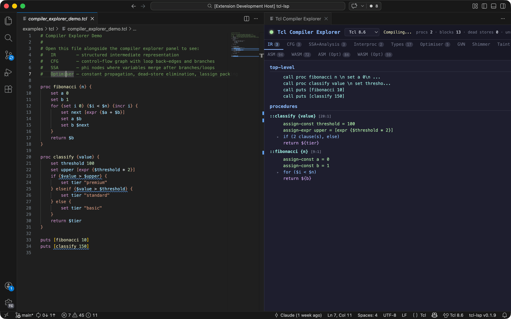

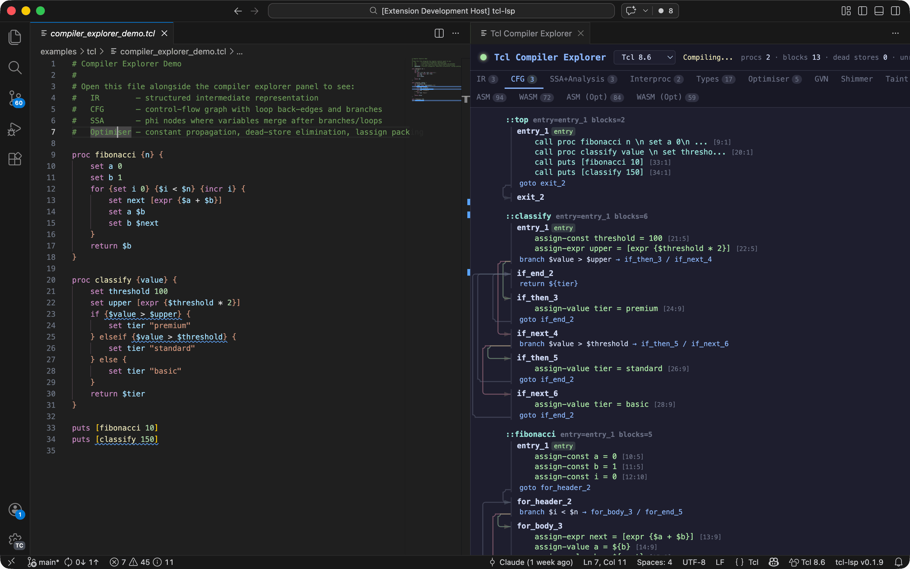

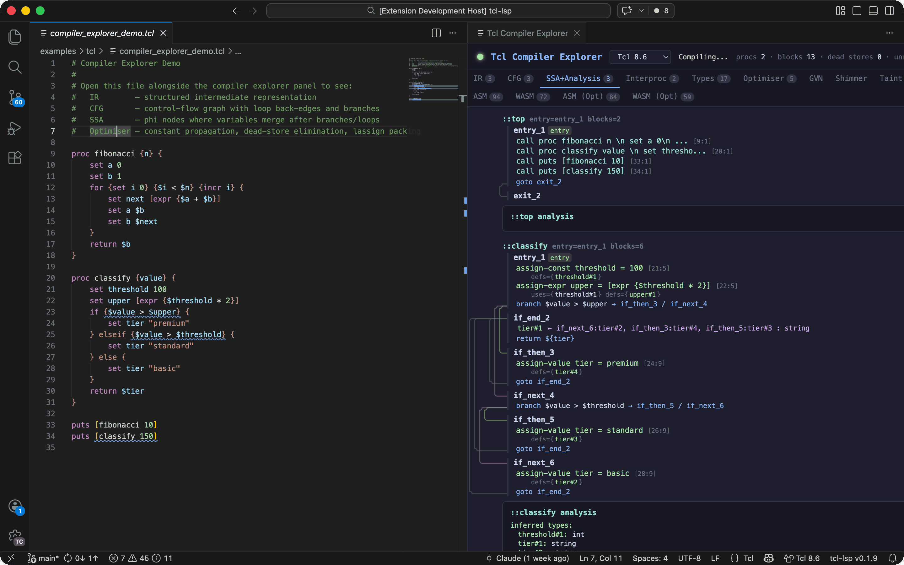

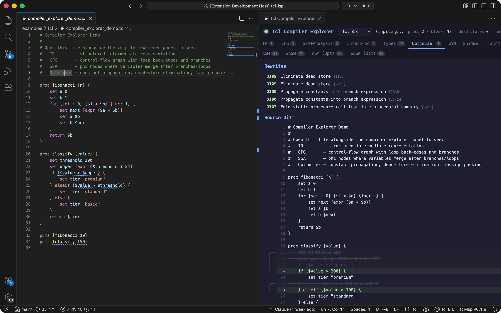

### Tk preview (VS Code panel)

A live preview panel that extracts the widget hierarchy from Tk source and
renders a visual layout — updates in real time as you edit.

```tcl
package require Tk
ttk::frame .f
ttk::label .f.lbl -text "Name:"
ttk::entry .f.ent -textvariable name
ttk::button .f.btn -text "OK" -command { puts $name }
grid .f.lbl .f.ent .f.btn -padx 5 -pady 5
pack .f
# Preview panel shows the grid layout with label, entry, and button
```

### BIG-IP configuration support

Open a BIG-IP `.conf` or `.scf` file to get syntax highlighting, object
navigation, and iRule extraction.

```
# BIG-IP config file (bigip.conf)
ltm virtual /Common/my_vs {
    destination /Common/10.0.0.1:443
    pool /Common/my_pool
    rules {
        /Common/my_irule        ← right-click → "Open iRule in Editor"
    }
}
# "Extract All iRules to Files..." exports every iRule to separate .tcl files
```

### iRules-to-XC migration

Translate F5 BIG-IP iRules to F5 Distributed Cloud configuration, with both
Terraform HCL and JSON API output plus a coverage report.

```tcl
# Source iRule:
when HTTP_REQUEST {
    if { [HTTP::uri] starts_with "/api" } {
        pool api_pool
    } else {
        HTTP::redirect "https://[HTTP::host]/api[HTTP::uri]"
    }
}

# "Translate iRule to F5 XC" produces:
# - Terraform HCL with routes, origin pools, and redirect rules
# - JSON API payload for direct XC API calls
# - Coverage report showing translated vs. untranslatable constructs
```

### iRule Event Orchestrator (test framework)

Generate and run deterministic tests for F5 iRules.  The framework simulates
BIG-IP's event lifecycle, pool selection, data groups, and multi-TMM CMP
behaviour in a standard `tclsh`.

```tcl
::orch::configure_tests \
    -profiles {TCP HTTP} \
    -irule { when HTTP_REQUEST { pool web_pool } } \
    -setup { ::orch::add_pool web_pool {{10.0.0.1:80}} }

::orch::test "routing-1.0" "basic request goes to web_pool" -body {
    ::orch::run_http_request -host "example.com" -uri "/"
    ::orch::assert_that pool_selected equals "web_pool"
}

exit [::orch::done]
```

The `generate-test` CLI command and `generate_irule_test` MCP tool analyse an
iRule's control-flow graph to produce test cases automatically.  For iRules
with CMP-sensitive patterns (`static::` writes in hot events, `table` shared
state), multi-TMM scenarios using fakeCMP distribution are included.

### Runtime validation

Optionally run the active file through a real `tclsh` (or an iRules stub
adapter) on save to catch issues that static analysis alone cannot detect.

```tcl
# With tclLsp.runtimeValidation.enabled = true:
proc test {} {
    package require NoSuchPackage   ;# runtime error: can't find package
}
# The server invokes tclsh in syntax-check mode and merges runtime
# errors into the diagnostics panel alongside static analysis results
```

### Text encoding tools

Editor commands for common encoding operations, available from the right-click
context menu or the command palette.

```
Escape Selection          →  converts special chars to Tcl backslash sequences
Unescape Selection        →  reverses backslash sequences to literal chars
Base64 Encode Selection   →  encodes selected text as base64
Base64 Decode Selection   →  decodes base64 back to text
Copy File as Base64       →  copies entire file content as base64 to clipboard
Copy File as Gzip+Base64  →  compresses then base64-encodes file to clipboard
```

### Package scaffolding

Generate a complete Tcl package project layout with a single command.

```
"Tcl: Scaffold Tcl Package Starter" creates:

  mypackage/
    pkgIndex.tcl          Package index
    mypackage.tcl         Package source with namespace and public API
    tests/
      all.tcl             Test runner
      mypackage.test      tcltest skeleton
    .github/
      workflows/ci.yml    GitHub Actions CI workflow
    README.md             Package README
```

## AI integrations

### Chat participants (VS Code + GitHub Copilot)

Three chat participants integrate with GitHub Copilot to provide
domain-specific AI assistance backed by the LSP's static analysis.

#### `@irule` — iRules assistant

| Command | Description |
|---------|-------------|
| `/create` | Generate a new iRule from a natural-language description |
| `/explain` | Explain what an iRule does, including data flow and security |
| `/fix` | Iteratively fix all LSP diagnostics in the current iRule |
| `/validate` | Run full LSP validation and show a categorised report |
| `/review` | Deep security and safety review (injection, DoS, races) |
| `/convert` | Modernise legacy patterns (unbraced expr, matchclass, etc.) |
| `/optimise` | Apply optimiser suggestions with explanations |
| `/scaffold` | Generate an iRule skeleton from selected events |
| `/datagroup` | Suggest data-group extraction for inline lookups |
| `/diff` | Explain differences between two iRule versions |
| `/event` | Show which commands are valid in a given event |
| `/migrate` | Convert nginx/Apache/HAProxy config to an iRule |
| `/diagram` | Generate a Mermaid flowchart of the iRule's logic flow |
| `/xc` | Translate the iRule to F5 Distributed Cloud configuration |

```
User:   @irule /create rate limiter that allows 100 requests per minute per client IP
Copilot: generates a complete iRule with HTTP_REQUEST handler, table-based
         counting, and HTTP::respond 429 — validated against the LSP
```


#### `@tcl` — Tcl assistant

| Command | Description |
|---------|-------------|
| `/create` | Generate Tcl code from a description |
| `/explain` | Explain what Tcl code does |
| `/fix` | Iteratively fix all LSP diagnostics |
| `/validate` | Run full LSP validation and show a report |
| `/optimise` | Apply optimiser suggestions with explanations |

```
User:   @tcl /explain what does the fibonacci proc do?
Copilot: walks through the loop, variable assignments, and return value
```

#### `@tk` — Tk GUI assistant

| Command | Description |
|---------|-------------|
| `/create` | Generate a Tk GUI from a description |
| `/explain` | Explain the widget hierarchy and layout |
| `/preview` | Open the Tk Preview pane for the current file |

```
User:   @tk /create a simple calculator with number buttons and a display
Copilot: generates Tk code with grid layout, button callbacks, and display label
```

### Claude Code skills

Twenty purpose-built skills for Claude Code (CLI) that combine LSP static
analysis with AI reasoning.  Each skill invokes the `tcl-lsp-ai` analyser,
iterates on diagnostics, and produces clean output.

| Skill | Description |
|-------|-------------|
| `irule-create` | Generate a new iRule from a description, validate until clean |
| `irule-explain` | Explain an iRule's logic, data flow, and security posture |
| `irule-fix` | Iteratively fix all diagnostics (analyse → fix → re-analyse) |
| `irule-validate` | Categorised validation report (errors, security, style, optimiser) |
| `irule-review` | Deep security audit: injection, DoS, races, information leakage |
| `irule-convert` | Modernise legacy patterns to current best practices |
| `irule-optimise` | Apply optimiser suggestions with safety explanations |
| `irule-scaffold` | Generate event skeleton with log gating and placeholders |
| `irule-datagroup` | Suggest data-group extraction for inline lookups |
| `irule-diff` | Explain semantic differences between two iRule versions |
| `irule-event` | Look up event/command validity from the registry |
| `irule-migrate` | Convert nginx/Apache/HAProxy config to an iRule |
| `irule-diagram` | Generate a Mermaid flowchart from compiler IR |
| `irule-xc` | Translate to F5 XC with Terraform and JSON output |
| `tcl-create` | Generate Tcl code from a description, validate until clean |
| `tcl-explain` | Explain Tcl code with analysis context |
| `tcl-fix` | Iteratively fix all Tcl diagnostics |
| `tcl-validate` | Categorised Tcl validation report |
| `tcl-optimise` | Apply Tcl optimiser suggestions |
| `tk-create` | Generate Tk GUI code with proper widget hierarchy |

```sh
# Example: fix all issues in an iRule
claude /irule-fix my_irule.tcl

# Example: security review
claude /irule-review production_rule.tcl

# Example: generate a Mermaid diagram
claude /irule-diagram complex_rule.tcl
```

### MCP server (Claude Desktop / AI agents)

A Model Context Protocol server that exposes tcl-lsp analysis as 27 tools for
any MCP-compatible client (Claude Desktop, custom agents, etc.).

| Tool | Description |
|------|-------------|
| `analyze` | Full analysis: diagnostics, symbols, events, and metadata |
| `validate` | Categorised validation report |
| `review` | Security-focused diagnostic report |
| `convert` | Detect legacy patterns for modernisation |
| `optimize` | Optimisation suggestions with rewritten source |
| `hover` | Hover information at a position |
| `complete` | Completions at a position |
| `goto_definition` | Find definition of a symbol |
| `find_references` | Find all references to a symbol |
| `symbols` | Document symbol hierarchy |
| `code_actions` | Quick fixes for a source range |
| `format_source` | Format Tcl/iRules source code |
| `rename` | Rename a symbol throughout the document |
| `event_info` | iRules event metadata and valid commands |
| `command_info` | Command metadata and valid events |
| `event_order` | Events in canonical firing order |
| `call_graph` | Build proc call graph with roots and leaves |
| `symbol_graph` | Build scope/definition/reference graph |
| `dataflow_graph` | Build taint and side-effect graph |
| `diagram` | Extract control-flow diagram data from IR |
| `xc_translate` | Translate iRule to XC configuration |
| `tk_layout` | Extract Tk widget tree as JSON |
| `generate_irule_test` | Generate iRule test script with CFG paths and multi-TMM detection |
| `irule_cfg_paths` | Extract CFG control-flow paths for test planning |
| `fakecmp_which_tmm` | Look up which TMM a connection tuple maps to |
| `fakecmp_suggest_sources` | Find client addr/port combos that hit each TMM |
| `set_dialect` | Set active Tcl dialect for the session |

```json
// Claude Desktop — claude_desktop_config.json
{
  "mcpServers": {
    "tcl-lsp": {
      "command": "./tcl-lsp-mcp-server.pyz"
    }
  }
}
```

## CLI tools

All CLI tools are distributed as self-contained Python zipapps (`.pyz`) — no
`pip install` required.

### Unified Tcl tool zipapp (`tcl`)

A single verb-based CLI that aggregates common local workflows:

- `opt` / `optimise` — optimise combined input source and emit rewritten Tcl
- `diag` — run diagnostics across files/directories/packages
- `lint` — run lint diagnostics across files/directories/packages
- `validate` — error-level validation checks
- `format` — format source using canonical Tcl style rules
- `symbols` — emit symbol definitions for the resolved source
- `diagram` — extract control-flow diagram data from compiler IR
- `callgraph` — build procedure call graph data
- `symbolgraph` — build symbol relationship graph data
- `dataflow` — build taint/effect data-flow graph data
- `event-order` — show iRules events in canonical firing order
- `event-info` — look up iRules event metadata and valid commands
- `command-info` — look up command registry metadata
- `convert` — detect legacy modernisation patterns
- `dis` — bytecode disassembly
- `compwasm` — compile input to a WASM binary
- `highlight` — emit syntax-highlighted source (`ansi` or `html`)
- `diff` — compare two sources across AST/IR/CFG compiler representations
- `explore` — run compiler-explorer views (`ir`, `cfg`, `ssa`, `opt`, `asm`, `wasm`, ...)
- `help` — search bundled KCS feature docs from the SQLite help index

```sh
# Optimise everything under src/ into one output script
python tcl.pyz opt src/ -o build/optimised.tcl

# Run diagnostics across a directory and a Tcl package
python tcl.pyz diag src/ mypkg --package-path ./vendor/tcl

# Run lint diagnostics (same checks as `diag`)
python tcl.pyz lint src/ mypkg --package-path ./vendor/tcl

# Validate syntax/error diagnostics
python tcl.pyz validate src/

# Validate as JSON
python tcl.pyz validate src/ --json

# Format source text
python tcl.pyz format script.tcl -o formatted.tcl

# Minify source (strip comments, collapse whitespace, join commands)
python tcl.pyz minify script.tcl -o minified.tcl

# Aggressive minify (optimise + static substring folding via SCCP + name compaction)
python tcl.pyz minify --aggressive script.tcl -o minified.tcl --symbol-map map.txt

# Symbol/graph/event/convert analysis verbs
python tcl.pyz symbols script.tcl --json
python tcl.pyz diagram script.tcl --json
python tcl.pyz callgraph script.tcl --json
python tcl.pyz symbolgraph script.tcl --json
python tcl.pyz dataflow script.tcl --json
python tcl.pyz event-order rule.irule --dialect f5-irules --json
python tcl.pyz event-info HTTP_REQUEST --json
python tcl.pyz command-info HTTP::uri --dialect f5-irules --json
python tcl.pyz convert rule.irule --json

# Emit bytecode disassembly
python tcl.pyz dis script.tcl

# Compile to WASM binary (+ optional WAT sidecar)
python tcl.pyz compwasm script.tcl -o out.wasm --wat-output out.wat

# Emit ANSI-highlighted output (or --format html)
python tcl.pyz highlight script.tcl --force-colour

# Diff two iRules using compiler structure layers
python tcl.pyz diff old.irule new.irule --show ast,ir,cfg

# Use compiler explorer views from the same zipapp
python tcl.pyz explore script.tcl --show ir,cfg,opt

# Search KCS help docs (optionally scoped by dialect)
python tcl.pyz help taint analysis --dialect f5-irules

# Show help for the help command itself
python tcl.pyz help --help

# Emit help search results as JSON
python tcl.pyz help taint --json
```

You can symlink the same zipapp as `irule`:

```sh
ln -sf ./tcl.pyz ./irule
./irule lint rules/
```

When invoked as `irule`, the CLI uses `f5-irules` as the default dialect.

For source builds, run `make kcs-db` before packaging zipapps so `tcl.pyz help`
can query the bundled KCS SQLite database.

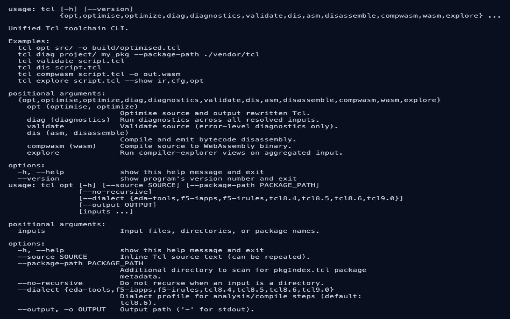

### Compiler explorer (CLI)

Console tool for inspecting the compiler pipeline: IR, CFG, SSA, optimiser
rewrites, shimmer warnings, taint analysis, and bytecode.

```sh
# Full exploration of a Tcl file
uv run python -m explorer script.tcl

# Focus on optimiser rewrites only
uv run python -m explorer script.tcl --show opt

# Inline source with optimised output
uv run python -m explorer --source 'set a 1; set b [expr {$a + 2}]' --show-optimised-source

# Show only IR and CFG
uv run python -m explorer script.tcl --show ir,cfg

# iRules dialect with flow analysis
uv run python -m explorer irule.tcl --dialect bigip --show irules
```

Available views: `ir`, `cfg`, `ssa`, `interproc`, `types`, `opt`, `gvn`,
`shimmer`, `taint`, `irules`, `callouts`, `asm`, `wasm`.  Groups: `all`,
`compiler`, `optimiser`.

### AI analysis tool (CLI)

Standalone static analyser for use with AI agents and CI pipelines.

```sh
# Full context pack (diagnostics + symbols + events) as JSON
uv run python -m ai.claude.tcl_ai context script.tcl

# Categorised validation report
uv run python -m ai.claude.tcl_ai validate script.tcl

# Security-focused review
uv run python -m ai.claude.tcl_ai review irule.tcl

# Optimisation suggestions with rewritten source
uv run python -m ai.claude.tcl_ai optimize script.tcl

# Build call graph
uv run python -m ai.claude.tcl_ai call-graph script.tcl

# Look up iRules event metadata
uv run python -m ai.claude.tcl_ai event-info HTTP_REQUEST

# Extract Tk widget tree
uv run python -m ai.claude.tcl_ai tk-layout gui.tcl

# Generate iRule test script (Event Orchestrator framework)
uv run python -m ai.claude.tcl_ai generate-test irule.tcl

# Extract CFG paths for test planning
uv run python -m ai.claude.tcl_ai cfg-paths irule.tcl
```

### Tcl-to-WASM compiler

Compile Tcl scripts to WebAssembly (WAT text or binary WASM format).

```sh
# Compile to human-readable WAT
uv run python -m explorer.wasm_cli script.tcl --format wat

# Compile to WASM binary with optimisations
uv run python -m explorer.wasm_cli script.tcl -O --format wasm -o out.wasm

# Compare optimised vs. unoptimised output
uv run python -m explorer.wasm_cli --source 'set x [expr {1+2}]' --format both
```

### Compiler explorer (web GUI)

A standalone web UI for the compiler explorer, available in two variants:
offline (bundles Pyodide) and CDN (loads Pyodide from jsDelivr).

```sh
# Standalone (offline, ~100 MB)
./tcl-lsp-explorer-gui.pyz --port 8080

# CDN variant (lightweight, requires internet)
./tcl-lsp-explorer-gui-cdn.pyz --port 8080
```

### Tcl VM

A bytecode interpreter that compiles and executes Tcl scripts using the
compiler pipeline, with an interactive REPL and disassembly mode.

```sh
# Execute a script
uv run python -m vm script.tcl arg1 arg2

# Interactive REPL
uv run python -m vm

# Inline evaluation
uv run python -m vm -e 'puts [expr {6 * 7}]'

# Show bytecode disassembly without executing
uv run python -m vm --disassemble script.tcl
```

## Screenshots

### Diagnostics & quick fixes

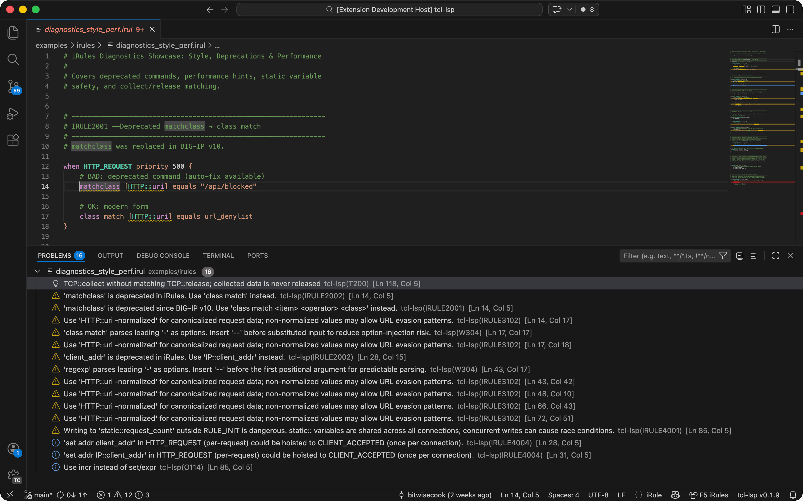

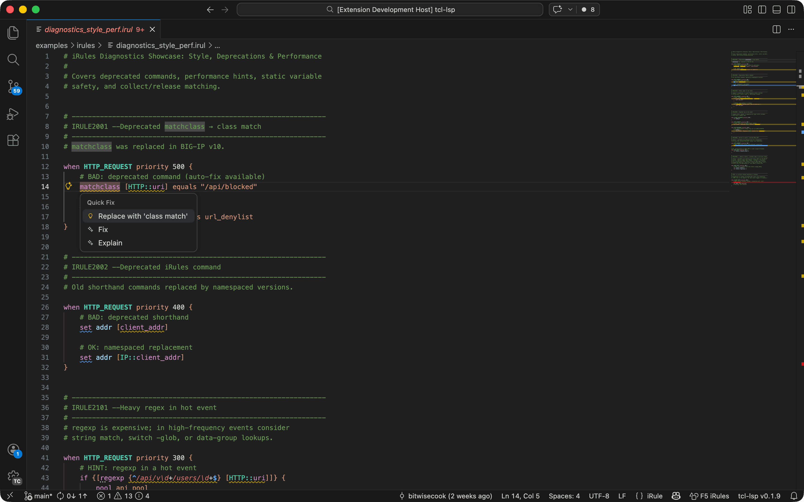

### Hover & completions

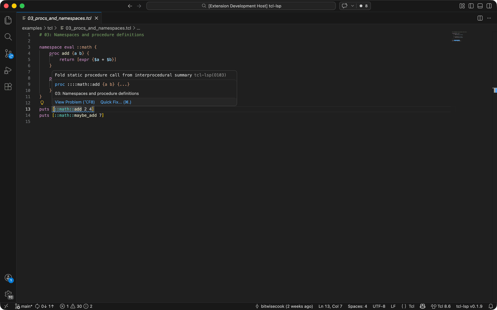

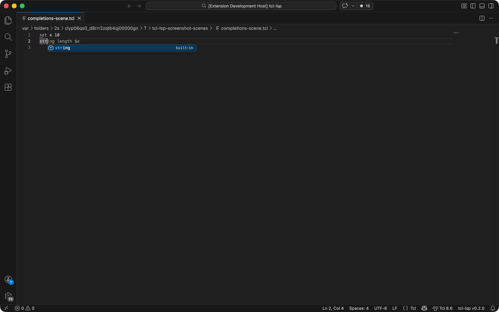

### Security taint analysis

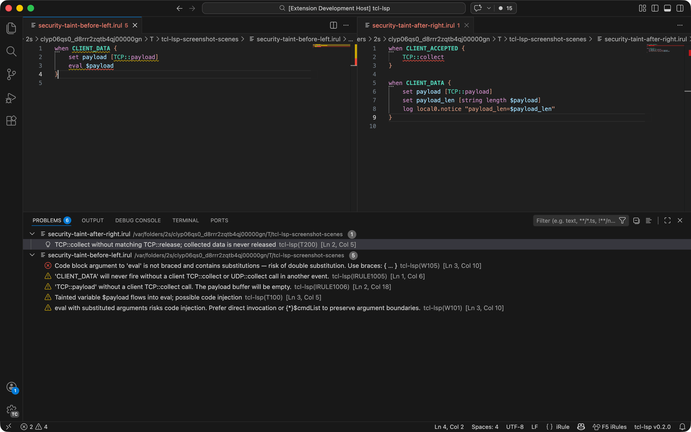

### Semantic highlighting

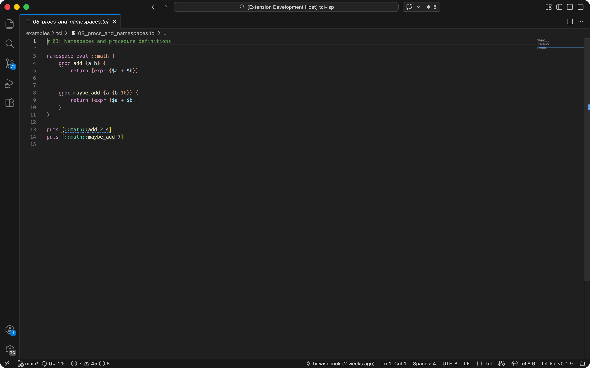

## Dialect support

The server ships a registry of command signatures, argument roles, and
validation rules keyed by dialect.  Switching the dialect profile changes
which commands are known, which are deprecated, and which event/layer
constraints apply.

| Dialect | Description |
|---------|-------------|
| `tcl8.4` | Tcl 8.4 core commands |
| `tcl8.5` | Tcl 8.5 core commands (adds `{*}`, `lassign`, `dict`, etc.) |
| `tcl8.6` | Tcl 8.6 core commands (adds `try`/`finally`, `tailcall`, coroutines) -- **default** |
| `tcl9.0` | Tcl 9.0 core commands (adds `lpop`, zipfs, updated `encoding`) |
| `f5-irules` | F5 BIG-IP iRules: HTTP/SSL/DNS/LB namespaces, event-validity checks, taint analysis, `static::` scoping rules |
| `f5-iapps` | F5 iApps template commands |
| `eda-tools` | EDA/VLSI tooling seed profile (Synopsys, Cadence, Mentor conventions) |

**Tk**, **tcllib**, and **Tcl stdlib** commands are automatically recognised
when the corresponding `package require` appears in the file.  No manual
toggle is needed — the registry activates the relevant command definitions
per-document.

## Authoring workflows (VS Code commands)

- `Tcl: Insert Tcl Template Snippet` -- quick-pick and insert any bundled Tcl/iRules snippet template.
- `Tcl: Insert iRule Event Skeleton` -- scaffold selected iRules events into a new Tcl buffer.
- `Tcl: Scaffold Tcl Package Starter` -- generate package layout, tests, CI workflow, and README.
- `Tcl: Insert package require` -- suggest and insert `package require` lines based on symbol usage.
- `Tcl: Apply Safe Quick Fixes` -- apply all non-overlapping safe quick fixes in one pass.
- `Tcl: Run Runtime Validation` -- run dialect-aware runtime checks on demand.

## Code formatting

The formatter supports full-document and range formatting via the standard LSP
`textDocument/formatting` and `textDocument/rangeFormatting` requests.  Defaults
follow the [F5 iRules Style Guide](https://community.f5.com/kb/technicalarticles/irules-style-guide/305921).

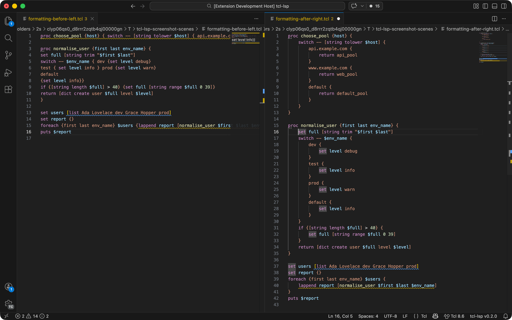

Capabilities include:

- **Indentation** -- configurable size, spaces or tabs, with separate continuation indent
- **Brace placement** -- K&R (end of line) style
- **Expression bracing** -- optionally enforce `expr {$x + 1}` instead of `expr $x + 1`
- **Variable bracing** -- optionally rewrite `$var` as `${var}`
- **Line length** -- hard limit and soft goal; long lines are wrapped at continuation points
- **Semicolons** -- convert `;`-separated commands to individual lines
- **Body expansion** -- optionally expand single-line `if`/`foreach`/etc. bodies to multi-line
- **Blank lines** -- normalise spacing between procs, between control-flow blocks, and cap consecutive blank lines
- **Comments** -- ensure space after `#`, align inline comments to a consistent column
- **Whitespace** -- trim trailing whitespace, ensure final newline, normalise line endings (LF/CRLF/CR)

All options are exposed through `tclLsp.formatting.*` settings (see
[Configuration](#formatter-settings) below).

## Diagnostic codes

All diagnostics support inline suppression with `# noqa: CODE1,CODE2` comments.
Use `# noqa: *` to suppress all diagnostics on a line.

### Errors

| Code | Description | Quick-fix |
|------|-------------|-----------|
| E001 | Missing required subcommand | |
| E002 | Too few arguments | |
| E003 | Too many arguments | |
| E100 | Unmatched `]` -- missing opening `[` | Insert `[` |
| E101 | Missing `{` after `switch` -- body cases follow without braces | |
| E102 | Unmatched `}` -- missing opening `{` | Remove stray `}` |
| E103 | Missing `}` -- a nested body consumed this closing brace | |
| E200 | Parse error -- internal representation cannot be determined | |

### Warnings -- Style & Best Practice

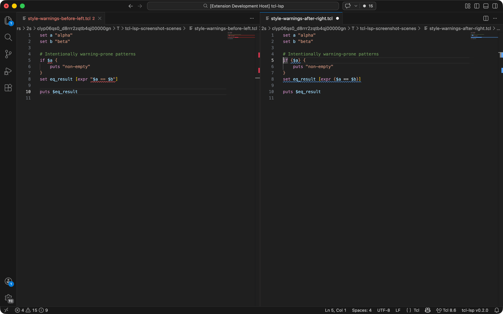

| Code | Description | Quick-fix |
|------|-------------|-----------|
| W001 | Unknown subcommand | |
| W002 | Command is disabled in active dialect profile | |
| W100 | Unbraced `expr`/`if`/`while`/`for` expression (double substitution risk) | Wrap in braces |
| W104 | `append` with space-separated values (use `lappend` for lists) | |
| W105 | Unbraced code block or missing `variable` declaration in `namespace eval` | Wrap in braces |
| W106 | Dangerous unbraced `switch` body | |
| W108 | Non-ASCII characters in token content (smart quotes, non-breaking spaces) | Replace with ASCII |
| W110 | `==`/`!=` on strings in `expr` (use `eq`/`ne`) | Replace operator |
| W111 | Line exceeds configured maximum length | |
| W112 | Trailing whitespace | Remove whitespace |
| W113 | Procedure shadows a built-in command | |
| W114 | Redundant nested `[expr]` -- already in expression context | |
| W115 | Backslash-newline in comment silently swallows the next line | Convert to per-line comments |
| W120 | Package-gated command used without `package require` | Insert `package require` |
| W121 | Subnet mask has non-contiguous bits | Replace with nearest valid mask |
| W122 | Mistyped IPv4 address (octet > 255 or leading zero) | |
| W200 | Binary format modifier requires newer Tcl | |
| W201 | Manual path concatenation (use `file join`) | Rewrite as `[file join]` |

### Warnings -- Variables

| Code | Description | Quick-fix |
|------|-------------|-----------|
| H300 | Possible paste error -- repeated assignment to same variable with same value | |
| W210 | Variable read before set | |
| W211 | Variable set but never used | |
| W212 | Variable substitution where name expected (`set $x`, `incr $x`, `info exists $x`, etc.) | |
| W213 | `unset` on variable that may not exist -- use `unset -nocomplain` | |
| W214 | Unused proc parameter -- argument declared but never read in the body | |
| W220 | Dead store -- variable set but overwritten before use | |

### Warnings -- Security

| Code | Description | Quick-fix |
|------|-------------|-----------|
| W101 | `eval` with substituted arguments (code injection risk) | |
| W102 | `subst` with a variable argument (template injection risk) | |
| W103 | `open` with pipeline or variable argument (command injection risk) | |
| W300 | `source` with a variable path (code execution risk) | |
| W301 | `uplevel` with unbraced or multi-arg script (injection risk) | |
| W303 | `regexp` with nested quantifiers (ReDoS risk) | |
| W304 | Missing `--` on option-bearing commands before positional input | Insert `--` |
| W306 | Substitution in literal-expected argument position | |
| W307 | Non-literal command name (variable or command substitution as command) | |
| W308 | `subst` without `-nocommands` | |
| W309 | `eval`/`uplevel` with `subst` -- double substitution risk | |
| W310 | Hardcoded credentials (API keys, tokens, passwords) | |
| W311 | Unsafe channel encoding mismatch (`-encoding binary` with `-translation`) | |
| W312 | `interp eval`/`interp invokehidden` with dynamic script (injection risk) | |
| W313 | Destructive `file` operations (`delete`/`rename`/`mkdir`) with variable path | |

### Hints

| Code | Description | Quick-fix |
|------|-------------|-----------|
| W302 | `catch` without a result variable (silently swallows errors) | Add result variable |

### Shimmer detection

The shimmer analyser tracks each variable's Tcl internal representation
("intrep") through the SSA type lattice.  When a command expects a different
intrep than the variable currently holds, Tcl must destroy and recreate the
representation -- a "shimmer".  This is normally invisible but can be a
significant performance cost in loops.

| Code | Severity | Description |
|------|----------|-------------|
| S100 | Info | Single shimmer outside a loop |
| S101 | Warning | Shimmer inside a loop body (per-iteration cost) |
| S102 | Warning | Variable oscillates between two types across loop iterations (type thunking) |

### Taint analysis

The taint analyser tracks data provenance through the SSA graph using a
colour-aware lattice.  Values originating from I/O commands (network reads,
file reads, process execution) are tagged as tainted.  Taint propagates
through assignments, string interpolation, and phi nodes.  Commands that
produce fixed-type results (e.g. `string length`, `llength`) act as
sanitisers.

Taint colours carry value properties (e.g. `PATH_PREFIXED` for values
starting with `/`).  At join points, colours are intersected so only
properties shared by all paths survive -- this suppresses false positives.

| Code | Severity | Description | Quick-fix |
|------|----------|-------------|-----------|
| T100 | Warning | Tainted data flows into a dangerous code-execution sink | |
| T101 | Warning | Tainted data flows into an output command | |
| T102 | Warning | Tainted data in option position without `--` terminator | Insert `--` |
| T103 | Warning | Tainted data in `regexp`/`regsub` pattern (regex injection / ReDoS risk) | Wrap with `[regex::quote]` |
| T104 | Warning | Tainted data in network address argument (SSRF risk) | |
| T105 | Warning | Tainted data in `interp eval` script argument (cross-interpreter injection) | |
| T106 | Info | Double-encoding -- value already carries encoding colour | Remove redundant encoder |
| T200 | Error | `*::collect` without a matching `*::release` in the same scope | |
| T201 | Error | `*::release` without a preceding `*::collect` in the same scope | |

### iRules codes

These diagnostics fire only in the `f5-irules` dialect.

#### Event validity & flow

| Code | Severity | Description | Quick-fix |
|------|----------|-------------|-----------|
| IRULE1001 | Warning/Hint | Command invalid or ineffective in this iRules event | |
| IRULE1002 | Warning | Unknown iRules event name | |
| IRULE1003 | Warning | Deprecated iRules event | |
| IRULE1004 | Hint | `when` block missing explicit `priority` | |
| IRULE1005 | Warning | `*_DATA` event handler without matching `*::collect` call | Bootstrap `collect` |
| IRULE1006 | Warning | `*::payload` access without matching `*::collect` call | Bootstrap `collect` |
| IRULE1201 | Warning | HTTP command used after `HTTP::respond`/`HTTP::redirect` | |
| IRULE1202 | Warning | Multiple `HTTP::respond`/`HTTP::redirect` on different branches | |

#### Deprecated & unsafe commands

| Code | Severity | Description | Quick-fix |
|------|----------|-------------|-----------|
| IRULE2001 | Warning | Deprecated `matchclass` -- use `class match` | Auto-replace |
| IRULE2002 | Warning | Deprecated iRules command | |
| IRULE2003 | Error | Unsafe iRules command (context escalation risk) | |

#### Taint & security

| Code | Severity | Description | Quick-fix |
|------|----------|-------------|-----------|
| IRULE3001 | Warning | Tainted data in HTTP response body (XSS risk) | Wrap with `[HTML::encode]` |
| IRULE3002 | Warning | Tainted data in HTTP header or cookie value (header injection) | Wrap with `[URI::encode]` |
| IRULE3003 | Warning | Tainted data in `log` command (log injection) | |
| IRULE3004 | Warning | Tainted data in `HTTP::redirect` URL (open redirect risk) | |
| IRULE3101 | Warning | `HTTP::uri`/`HTTP::path` set to value not provably starting with `/` | |
| IRULE3102 | Warning | `HTTP::path`/`HTTP::uri`/`HTTP::query` getter used without `-normalized` | |
| IRULE3103 | Info | `*::uri` used where `*::path` or `*::query` suffices (`split`, `starts_with`, `contains`, `string match`, etc.) | |

#### Scoping & state

| Code | Severity | Description |
|------|----------|-------------|
| IRULE4001 | Warning | Write to `static::` variable outside `RULE_INIT` (race condition) |
| IRULE4002 | Hint | Generic `static::` variable name — collision likely across iRules |
| IRULE4003 | Hint | Variable scoping concern across events |
| IRULE4004 | Info | Constant `set` in per-request event could be hoisted to per-connection |

#### Performance & control flow

| Code | Severity | Description | Quick-fix |
|------|----------|-------------|-----------|
| IRULE2101 | Hint | Heavy `regexp` in a high-frequency event | |
| IRULE5001 | Hint | Ungated `log` in a high-frequency event | |
| IRULE5002 | Warning | `drop`/`reject`/`discard` without `event disable all` or `return` | Add `event disable all` + `return` |
| IRULE5003 | Hint | Loop condition `$var != 0` can miss zero if decremented past it | |
| IRULE5004 | Warning | `DNS::return` without `return` | Add `return` |
| IRULE5005 | Error | Direct proc invocation without `call` in iRules | Prefix with `call` |

## Optimiser codes

The optimiser operates on the SSA/CFG intermediate representation and suggests
source-level rewrites.  All optimiser diagnostics appear at **Information**
severity and include a quick-fix code action with the suggested replacement.

Each pass can be individually toggled via `tclLsp.optimiser.*` settings.

| Code | Description | Technique |
|------|-------------|-----------|
| O100 | Propagate constant variables into expressions and command arguments | SCCP |
| O101 | Fold constant integer expressions | Constant folding |
| O102 | Fold constant `[expr {...}]` command substitutions | Constant folding |
| O103 | Fold static procedure calls using interprocedural summaries | Interprocedural analysis |
| O104 | Fold static string-build chains into a single assignment | Copy propagation |
| O105 | Propagate constants into variable references; detect redundant computations (GVN/CSE + PRE) | Constant propagation, global value numbering |
| O106 | Hoist loop-invariant computations | LICM |
| O107 | Eliminate unreachable dead code | DCE |
| O108 | Eliminate transitively dead code | ADCE |
| O109 | Eliminate dead stores | DSE |
| O110 | Canonicalise expressions (strength reduction, reassociation) | InstCombine |
| O111 | Brace expression text for bytecode compilation (paired with W100) | Performance hint |
| O112 | Eliminate constant-condition compound statements | Structure elimination |
| O113 | Strength-reduce expressions (`x**2` → `x*x`, `x%8` → `x&7`) | Strength reduction |
| O114 | Recognise `incr` idiom (`set x [expr {$x + N}]` → `incr x N`) | Idiom recognition |
| O115 | Remove redundant nested `[expr {...}]` in expression context | Simplification |
| O116 | Fold constant `[list a b c]` to literal | Constant folding |
| O117 | Simplify `[string length $s] == 0` → `$s eq ""` | Peephole |
| O118 | Fold constant `[lindex {a b c} 1]` to element | Constant folding |
| O119 | Pack consecutive `set` literals into `lassign`/`foreach` | Statement packing |
| O120 | Prefer `eq`/`ne` over `==`/`!=` for string comparisons | Type-aware rewrite |
| O121 | Rewrite self-recursive tail calls to `tailcall` | Tail-call optimisation |
| O122 | Convert fully tail-recursive proc to iterative `while` loop | Recursion elimination |
| O123 | Detect non-tail recursion eligible for accumulator introduction | Recursion analysis |
| O124 | Comment out unused procs in iRules (not called from any event) | Dead proc elimination |
| O125 | Sink assignment into deepest decision block that uses it | Code sinking |

## Prerequisites

- Python 3.10+
- [uv](https://docs.astral.sh/uv/) (Python package manager)
- Node.js 20+ with npm
- VS Code 1.93+

## Quick start

```sh
# Clone and enter the repo
git clone <repo-url>
cd tcl-lsp

# Run tests
make test

# Build the .vsix
make vsix

# Install in VS Code
code --install-extension tcl-lsp-vscode-0.1.0.vsix
```

## Build targets

Run `make help` to see all targets:

| Target | Description |
|--------|-------------|
| `make test-pr` | **Full CI gate** — lint + Python tests + extension tests + smoke tests |
| `make vsix` | Build the .vsix (tests must pass first) |
| `make install` | Build and install the .vsix into VS Code |
| `make package-vsix` | Package VSIX (skip lint/test, for CI) |
| `make test` | Run all tests (Python + VS Code extension) |
| `make test-py` | Run the Python test suite only |
| `make test-ext` | Run VS Code extension integration tests |
| `make lint` | Run all lint and style checks |
| `make lint-py` | Lint Python code with Ruff |
| `make typecheck-py` | Type-check Python code with ty |
| `make lint-ts` | Lint/format-check TypeScript extension code |
| `make format-py` | Format and auto-fix Python code with Ruff |
| `make npm-env` | Install/update npm dependencies |
| `make compile` | Compile the TypeScript extension |
| `make zipapps` | Build all zipapps (Tcl, CLI, GUI, GUI-CDN, LSP, AI, MCP, WASM) |
| `make zipapp-tcl` | Build the unified Tcl tools zipapp |
| `make zipapp-cli` | Build the CLI compiler explorer zipapp |
| `make zipapp-gui` | Build the standalone GUI zipapp (bundles Pyodide) |
| `make zipapp-gui-cdn` | Build the CDN GUI zipapp (loads Pyodide from CDN) |
| `make zipapp-lsp` | Build the LSP server zipapp |
| `make zipapp-ai` | Build the AI analysis zipapp |
| `make zipapp-mcp` | Build the MCP server zipapp |
| `make zipapp-wasm` | Build the WASM compiler zipapp |
| `make claude-skills` | Build Claude Code skills release zip |
| `make jetbrains` | Build the JetBrains plugin (.zip) |
| `make sublime` | Build the Sublime Text package (.sublime-package) |
| `make zed` | Build the Zed extension (.tar.gz WASM artifact) |
| `make screenshot` | Alias of `make screenshots` |
| `make screenshots` | Capture extension screenshots and build demo GIF (macOS) |
| `make release` | Build all release artifacts (parity with tagged CI release jobs) |
| `make release-tag` | Bump version, annotated-tag, and push (`V=x.y.z`) |
| `make clean` | Remove build artifacts |
| `make distclean` | Remove build artifacts and `node_modules` |

Artifact version strings are derived from `git describe` (with `v` stripped).
If Git metadata is unavailable, builds fall back to `dev` (and semver-constrained
manifest fields use `0.0.0-dev`).

`make vsix` is the main entry point.  It runs the test suite first and will
not package a .vsix if any test fails.  Packaging uses an isolated staging
directory under `build/vsix-stage/`, and the output file lands under
`build/` as `tcl-lsp-<version>.vsix`.

On macOS, `make screenshots` prefers a small Swift window-probe helper when
`swiftc` is available, so captures use deterministic
`screencapture -o -l <window-id>`.  If Swift is unavailable, it falls back to
AppleScript-based probing.
By default, `make screenshots` auto-installs missing screenshot tools with
Homebrew (`pngquant`, `oxipng`, `gifsicle`, and `imagemagick` when needed).
To disable auto-install, run:
`TCL_LSP_SCREENSHOT_AUTO_BREW=0 make screenshots`.
By default, screenshot runs are isolated:
- downloaded VS Code `stable` via `@vscode/test-electron`
- isolated user data (`~/.tcl-lsp-screenshots/user-data`)
- isolated extensions dir (`~/.tcl-lsp-screenshots/extensions`)
- allowlisted external extensions only (`github.copilot-chat`)

Useful overrides:
- Reuse your normal VS Code user data: `TCL_LSP_SCREENSHOT_REUSE_CODE_USER_DATA=1 make screenshots`
- Use local app bundle instead of downloaded VS Code:
  `TCL_LSP_SCREENSHOT_USE_SYSTEM_VSCODE=1 TCL_LSP_SCREENSHOT_FORCE_DOWNLOADED_VSCODE=0 make screenshots`
- Change allowed external extensions (comma-separated extension IDs):
  `TCL_LSP_SCREENSHOT_ALLOWED_EXTENSIONS=github.copilot-chat make screenshots`

### Dependency audit policy

- Production dependency audits are enforced with `npm audit --omit=dev`.
- Dev-only audit findings are accepted and do not block releases in this repository.

## Project layout

```
tcl-lsp/
  Makefile                Build system
  pyproject.toml          Python project metadata (hatchling)
  lsp/                    Python LSP server
    __main__.py           Entry point (python -m server)
    server.py             pygls server, handler wiring
    async_diagnostics.py  Background diagnostic scheduler (tiered publishing)
    analysis/
      analyser.py         Single-pass semantic analyser
      checks.py           Best-practice and security checks (W-series)
      irules_checks.py    iRules-specific best-practice checks (IRULE-series)
      semantic_model.py   Data model (scopes, procs, diagnostics)
      semantic_graph.py   Call/symbol/data-flow graph queries
    bigip/
      parser.py           BIG-IP configuration file parser
      model.py            BIG-IP configuration data model
      rule_extract.py     iRule extraction from BIG-IP configs
      validator.py        Configuration validation
      diagnostics.py      BIG-IP-specific diagnostics
    commands/
      registry/
        models.py         CommandSpec dataclass (arity, roles, dialect flags)
        command_registry.py CommandRegistry class (query methods)
        runtime.py        Registry runtime (dialects, roles, body/expr index helpers)
        signatures.py     Argument signature helpers
        namespace_registry.py Namespace registry (event/command metadata facade)
        namespace_data.py    Canonical event/command data tables
        namespace_models.py  Namespace model dataclasses
        operators.py      Operator definitions and hover data
        taint_hints.py    Per-command taint source/sink hints
        type_hints.py     Per-command return type hints
        tcl/              One file per Tcl command (@register decorator)
        irules/           F5 iRules command definitions
        iapps/            F5 iApps template command definitions
        tk/               Tk widget command definitions
        tcllib/           tcllib package command definitions
        stdlib/           Tcl standard library command definitions
    common/
      dialect.py          Active dialect state
      naming.py           Name normalisation helpers
      ranges.py           Range/position utilities
    packages/
      resolver.py         Tcl package require resolution
    compiler/
      lowering.py         Tcl source -> IR lowering
      ir.py               IR node definitions
      cfg.py              Control flow graph construction
      ssa.py              Static single assignment form
      core_analyses.py    SCCP, liveness, type inference, dead store detection
      compilation_unit.py Compile pipeline orchestration and caching
      compiler_checks.py  IR-to-diagnostics (arity, subcommands)
      optimiser.py        Source rewrite passes (O100–O125)
      gvn.py              GVN/CSE/PRE/LICM redundant computation detection (O105–O106)
      interprocedural.py  Call graph, function purity/side-effect summaries
      taint.py            Data taint analysis (T100–T201, IRULE3xxx)
      shimmer.py          Tcl object representation analysis (S100–S102)
      irules_flow.py      iRules control-flow checks (IRULE1xxx/4004/5xxx)
      codegen.py          Tcl VM bytecode assembly backend
      static_loops.py     Conservative static evaluation for for-loops
      tcl_expr_eval.py    Tcl expression evaluator (constant folding)
      expr_ast.py         Expression AST parser
      expr_types.py       Expression type inference
      effects.py          Command side-effect classification
      connection_scope.py iRules connection-scope variable tracking
      types.py            Type lattice definitions
      token_helpers.py    Shared token-stream utilities
      eval_helpers.py     Evaluation helper constants
    diagram/
      extract.py          iRule event-flow diagram extraction
    features/
      code_actions.py     Quick-fix code actions
      completion.py       Completions
      definition.py       Go to definition
      diagnostics.py      Diagnostic aggregation (internal -> LSP)
      formatting.py       LSP formatting handlers
      hover.py            Hover information
      inlay_hints.py      Inlay hint provider (inferred types, format strings)
      references.py       Find references
      rename.py           Rename symbol
      call_hierarchy.py   Call hierarchy (incoming/outgoing calls)
      document_symbols.py Document symbol hierarchy
      document_links.py   Document link provider
      folding.py          Folding range provider
      selection_range.py  Selection range provider
      signature_help.py   Signature help provider
      workspace_symbols.py Workspace symbol search
      semantic_tokens.py  Semantic token provider
      snippet_templates.py Tcl/iRules snippet templates
      symbol_resolution.py Shared word/variable/scope resolution helpers
    parsing/
      lexer.py            Tcl lexer with position tracking
      tokens.py           Token and position types
      command_segmenter.py Command segmentation from token stream
      recovery.py         Centralised error recovery via virtual tokens
      expr_lexer.py       Expression sub-lexer
      expr_parser.py      Expression sub-parser
      substitution.py     Tcl backslash substitution helpers
    tk/
      detection.py        Tk widget auto-detection
      diagnostics.py      Tk-specific diagnostics
      extract.py          Tk widget hierarchy extraction
    workspace/
      document_state.py   Per-file analysis cache (dialect-gated profile scanning)
      workspace_index.py  Cross-file proc index (O(1) tail lookup, usage caching)
      scanner.py          Background workspace file scanner
    xc/
      translator.py       iRules-to-XC migration translator
      mapping.py          iRules → XC command mapping table
      xc_model.py         XC output data model
      terraform.py        Terraform HCL generation
      json_api.py         JSON API for XC translation
      diagnostics.py      Migration diagnostics
  explorer/               Compiler explorer (CLI + web GUI)
    cli.py                CLI interface
    pipeline.py           Compilation pipeline wrapper
    serialise.py          Output serialisation (IR, CFG, SSA, optimiser)
    formatters.py         Display formatters
    static/               Web GUI assets (Pyodide)
  ai/                     AI integrations
    claude/
      skills/             Claude Code skills (20 CLI commands)
    mcp/
      tcl_mcp_server.py   MCP server for Claude Desktop integration
    prompts/              System prompts for Tcl/iRules/Tk
    shared/               Shared diagnostics manifest and utilities
  tests/                  pytest test suite
  editors/
    vscode/               VS Code extension client (.vsix)
      package.json        Extension manifest
      tsconfig.json       TypeScript config
      src/extension.ts    Extension entry point
      language-configuration.json
      syntaxes/tcl.tmLanguage.json
    neovim/               Neovim LSP config (Lua)
    zed/                  Zed extension (TOML + Rust WASM)
    emacs/                Emacs eglot / lsp-mode config
    helix/                Helix languages.toml config
    sublime-text/         Sublime Text package (syntax, LSP, snippets)
    jetbrains/            JetBrains plugin (Gradle/Kotlin)
```

## Development

See `CONTRIBUTING.md` for coding-style and packaging rules.

### Running the server standalone

The server communicates over stdio.  To launch it directly:

```sh
uv run python -m server
```

This is useful for debugging or for use with any LSP client.
See `editors/` for per-editor setup instructions.

### Running tests

```sh
# Via make (sets up the venv automatically)
make test

# Or directly with uv
uv run --extra dev pytest tests/ -v

# Run a specific test file
uv run --extra dev pytest tests/test_checks.py -v

# Run tests matching a pattern
uv run --extra dev pytest tests/ -k "unbraced_expr"

# Lint Python code
make lint-py

# Type-check Python code
make typecheck-py

# Auto-fix and format Python code
make format-py
```

### Compiler and optimiser explorer

Use `tcl_compiler_explorer.py` to inspect how source is lowered and optimised:

```sh
# Full compiler + optimiser exploration
uv run python tcl_compiler_explorer.py samples/for_screenshots/22-optimiser-before.tcl

# Focus on optimiser rewrites only
uv run python tcl_compiler_explorer.py samples/for_screenshots/22-optimiser-before.tcl --focus optimiser

# Inline source with explicit optimised output
uv run python tcl_compiler_explorer.py --source 'set a 1; set b [expr {$a + 2}]' --show-optimised-source
```

The explorer renders:
- lowered IR and per-procedure bodies
- CFG pre-SSA and post-SSA (with use/def and inferred constants)
- interprocedural summaries
- optimiser rewrites
- source callouts with caret markers and `+-->` arrows for salient spans

### Developing the extension client

```sh
# Install npm deps
make npm-env

# Watch mode (recompiles on save)
cd editors/vscode && npm run watch
```

To test the extension in VS Code, open `editors/vscode/` in VS Code and press
**F5** to launch the Extension Development Host.

### Developing the server

During development you can point the extension at your working copy instead
of the bundled server.  Set `tclLsp.serverPath` in your VS Code settings:

```json
{
  "tclLsp.serverPath": "/path/to/tcl-lsp"
}
```

The extension will use `uv run` from that directory, so changes to the Python
source take effect on the next editor reload.

### Adding a new diagnostic check

1. Add a check function to the appropriate submodule in `core/analysis/checks/`
   (e.g. `_security.py`, `_style.py`, `_domain.py`, `_syntax.py`) following
   the existing pattern -- each check receives the command name, argument
   texts, argument tokens, all tokens, and the source string.
2. Register it in the `ALL_CHECKS` list in `core/analysis/checks/_orchestrator.py`.
3. If the check can be auto-fixed, include a `CodeFix` in the diagnostic's
   `fixes` tuple.
4. Add tests to `tests/test_checks.py`.
5. Run `make test` to verify.

### Adding a new formatter option

1. Add the field to `FormatterConfig` in `core/formatting/config.py`.
2. Handle it in `core/formatting/engine.py`.
3. Add `to_dict`/`from_dict` support if the field uses a non-primitive type.
4. Add tests to `tests/test_formatter.py`.
5. Keep consumers on core imports (`core/formatting/*`) and delete legacy
   import paths in the same change.
6. Run `tests/test_core_lift_consumers.py` to verify no downstream consumer is
   importing shim modules.

## Configuration

Server/runtime settings are available through the `tclLsp.*` namespace.

### Dialect settings

| Setting | Default | Description |
|---------|---------|-------------|
| `dialect` | `tcl8.6` | Command/signature profile (`tcl8.4`, `tcl8.5`, `tcl8.6`, `tcl9.0`, `f5-irules`, `f5-iapps`, `eda-tools`) |
| `extraCommands` | `[]` | Extra command names treated as known varargs commands |
| `libraryPaths` | `[]` | Additional directories to scan for Tcl packages and libraries |

### Formatter settings

Formatter options are available through `tclLsp.formatting.*` (defaults based
on the F5 iRules Style Guide):

| Setting | Default | Description |
|---------|---------|-------------|
| `indentSize` | `4` | Spaces per indent level |
| `indentStyle` | `spaces` | `spaces` or `tabs` |
| `continuationIndent` | `4` | Extra indentation for continuation lines |
| `braceStyle` | `k_and_r` | `k_and_r` |
| `spaceBetweenBraces` | `true` | Space between consecutive braces (`} {` vs `}{`) |
| `enforceBracedVariables` | `false` | Rewrite `$var` as `${var}` |
| `enforceBracedExpr` | `false` | Require braced expressions |
| `maxLineLength` | `120` | Hard line length limit |
| `goalLineLength` | `100` | Soft target for line length |
| `expandSingleLineBodies` | `false` | Force multi-line bodies |
| `minBodyCommandsForExpansion` | `2` | Minimum commands in body before expansion |
| `spaceAfterCommentHash` | `true` | Space between `#` and comment text |
| `trimTrailingWhitespace` | `true` | Remove trailing whitespace |
| `alignCommentsToCode` | `true` | Align inline comments to a consistent column |
| `replaceSemicolonsWithNewlines` | `true` | Convert `;` to newlines |
| `blankLinesBetweenProcs` | `1` | Blank lines separating proc definitions |
| `blankLinesBetweenBlocks` | `1` | Blank lines between control flow blocks |
| `maxConsecutiveBlankLines` | `2` | Maximum consecutive blank lines allowed |
| `lineEnding` | `lf` | Line ending style (`lf`, `crlf`, `cr`) |
| `ensureFinalNewline` | `true` | Ensure file ends with a newline |

### Shimmer detection settings

| Setting | Default | Description |
|---------|---------|-------------|
| `shimmer.enabled` | `true` | Enable shimmer detection (S-series diagnostics) |

### Optimiser settings

Optimiser toggles are available through `tclLsp.optimiser.*`:

| Setting | Default | Description |
|---------|---------|-------------|
| `enabled` | `true` | Enable optimiser suggestions as diagnostics |
| `O100` | `true` | Enable constant propagation rewrites |
| `O101` | `true` | Enable constant expression folding rewrites |
| `O102` | `true` | Enable `[expr {...}]` command substitution folding rewrites |
| `O103` | `true` | Enable static procedure-call folding rewrites |
| `O104` | `true` | Enable static string-build folding rewrites |
| `O105` | `true` | Enable constant var-ref propagation and redundant computation detection (GVN/CSE/PRE) |
| `O106` | `true` | Enable loop-invariant computation hoisting (LICM) |
| `O107` | `true` | Enable unreachable dead code elimination (DCE) |
| `O108` | `true` | Enable transitive dead code elimination (ADCE) |
| `O109` | `true` | Enable dead store elimination (DSE) |
| `O110` | `true` | Enable expression canonicalisation (InstCombine) |
| `O111` | `true` | Enable paired performance hints for unbraced expression warnings (`W100`) |
| `O112` | `true` | Enable constant-condition structure elimination |
| `O113` | `true` | Enable strength reduction (`x**2` → `x*x`) |
| `O114` | `true` | Enable `incr` idiom recognition |
| `O115` | `true` | Enable redundant nested `expr` elimination |
| `O116` | `true` | Enable constant `list` folding |
| `O117` | `true` | Enable `string length` zero-check simplification |
| `O118` | `true` | Enable constant `lindex` folding |
| `O119` | `true` | Enable multi-set packing (`lassign`/`foreach`) |
| `O120` | `true` | Enable type-aware `==/!=` to `eq/ne` string comparison rewrite |
| `O121` | `true` | Enable self-recursive tail-call rewriting to `tailcall` |
| `O122` | `true` | Enable tail-recursive proc conversion to iterative loop |
| `O123` | `true` | Enable non-tail recursion accumulator pattern detection |
| `O124` | `true` | Enable unused iRule proc commenting |
| `O125` | `true` | Enable code sinking into decision blocks |

Example:

```json
{
  "tclLsp.dialect": "f5-irules",
  "tclLsp.extraCommands": ["myCompany::command"]
}
```

## Acknowledgements

This project was inspired by:

- [Picol](https://github.com/antirez/picol) by Salvatore Sanfilippo (antirez) -- a minimal Tcl interpreter in C that demonstrates the elegance of the Tcl parsing model
- [iRuleScan](https://github.com/simonkowallik/irulescan) by Simon Kowallik -- a security scanner for F5 iRules
- [tclint-vscode](https://github.com/nmoroze/tclint-vscode) by Noah Moroze -- a Tcl linter with VS Code integration

## AI

This project used AI very heavily.

- The core parser, lexer, IR, CFG were largely hand created with input on AI about
  structure, and lots of AI code review.
- The command registry was seeded by hand then filled out with AI.
- The vscode extension, compiler explorer, editor integrations, CI/CD, build pipelines
  VM, and compiler to Tcl bytecode were all entirely vibe coded.
- The Claude skills, AI integrations were vibe coded with hand work on the prompts
  .. they need more of that.
- The vast bulk of tests were AI written, AI ported from sources like Tcl, but all 
  largely directed by me in their creation. If I'd been doing that by hand you'd
  see 3 tests and they'd all be "make install worked for me, good luck"
- Claude Opus 4.6, Gemini 3.1 Pro and OpenAI GPT-5.3-Codex were all used to review
  the code, critise it, rewrite and reorganise it.

## License

This project is licensed under the [GNU Affero General Public License v3.0](LICENSE)
(AGPL-3.0-or-later).

You are free to use this tool as-is. If you modify the code or incorporate
portions of it into another project, the AGPL requires that the complete
source of the derivative work is made available under the same license.

**Upstream contributions strongly preferred.** If you improve or extend this
project, please submit your changes back as a pull request rather than
maintaining a private fork. See [CONTRIBUTING.md](CONTRIBUTING.md) for details.
