<p align="center">
  <!-- PNG, not SVG: the VS Code Marketplace (vsce) rejects SVG and picky
       <picture>/srcset image sources in READMEs. Rendered from
       docs/tcl-lsp-logo.svg by `make logo`. -->
  
</p>

# tcl-lsp

A language server for Tcl with multi-editor support.

> **New here?** See **[docs/capabilities.md](docs/capabilities.md)** for how to
> leverage the three capabilities — the **f5-query** engine, the **Tcl
> compiler/analyser**, and the **BIG-IP registries** — from the CLI, Python, the
> LSP, MCP, and the browser. Live demos:
> [compiler explorer](https://bitwisecook.github.io/tcl-lsp/compiler-explorer/) ·
> [command registry spec studio](https://bitwisecook.github.io/tcl-lsp/spec-studio/) ·
> [BIG-IP report generator](https://bitwisecook.github.io/tcl-lsp/bigip-report-generator/) ·
> [example report](https://bitwisecook.github.io/tcl-lsp/bigip-report-demo/).

<p align="center">
  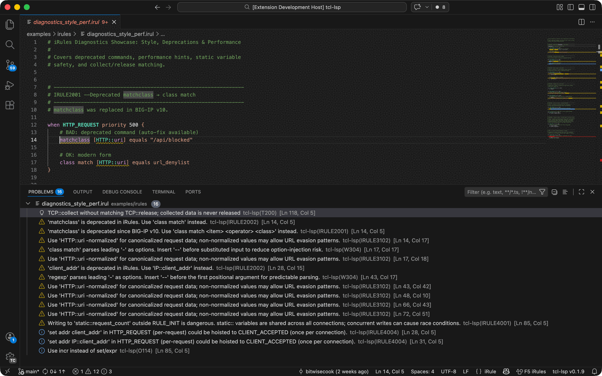
</p>

The server is a native Rust binary (`tcl-lsp-server`). It speaks LSP over
stdio, so it works with any LSP client. (The VS Code extension always launches
the bundled `tcl-lsp-server` binary.)

## Contents

**Start here** — [Install](#install) ·
[The seven you will use most](#the-seven-you-will-use-most) ·
[Full feature index](#full-feature-index)

**The language** — [Dialects, languages, and packages](#dialects-languages-and-packages) ·
[F5 BIG-IP](#f5-big-ip) ·
[Diagnostic and optimiser codes](#diagnostic-and-optimiser-codes)

**Tools** — [Compiler explorer](#compiler-explorer) ·
[Command registry spec studio](#command-registry-spec-studio) ·
[WASM, the bytecode VM, and eBPF](#compiling-tcl-wasm-the-bytecode-vm-and-ebpf) ·
[AI tooling](#ai-tooling) ·
[CLI tools](#cli-tools) ·
[Packaging & environments](#packaging--environments)

**Tuning it** — [Suppressing diagnostics](#suppressing-diagnostics) ·
[Diagnostic prominence](#changing-how-prominent-a-diagnostic-is) ·
[Multi-file projects](#multi-file-projects-and-package-require) ·
[Configuration](#configuration)

**Contributing** — [Building and contributing](#building-and-contributing) ·
[Screenshots](#screenshots) ·
[Licence](#license)

## Install

Grab the artefact for your editor from
[Releases](https://github.com/bitwisecook/tcl-lsp/releases/latest), or install
the VS Code extension from the
[Marketplace](https://marketplace.visualstudio.com/items?itemName=bitwisecook.tcl-lsp).
Nothing needs Python — the server is a self-contained native binary.

While the Rust rewrite is on the pre-release channel, install it from the
`rust` branch and pin the current pre-release:

```sh
curl -fsSL https://raw.githubusercontent.com/bitwisecook/tcl-lsp/rust/scripts/install/install.sh \
  | TCL_LSP_VERSION=v2.1.19 sh
```

### All editors

| Editor | Type | Setup | Unique extras |
|--------|------|-------|---------------|
| [VS Code](editors/vscode/) | Full extension (.vsix) | Install `.vsix` from Releases | Compiler explorer panel, Tk preview, `@irule`/`@tcl`/`@tk` Copilot chat, 25+ commands |
| [Neovim](editors/neovim/) | Config snippet (Lua) | Copy `tcl_lsp.lua` to `~/.config/nvim/server/` | Zero-plugin on 0.11+; also supports nvim-lspconfig |
| [Zed](editors/zed/) | Full extension (TOML + Rust) | Install from Zed extension registry | 16 built-in snippets, MCP context server, `/tcl-doc` and `/irule-event` slash commands |
| [Emacs](editors/emacs/) | Config snippet (Elisp) | Add to `init.el` for eglot or lsp-mode | Works with built-in eglot (Emacs 29+) |
| [Helix](editors/helix/) | Config snippet (TOML) | Add to `~/.config/helix/languages.toml` | Minimal pure-TOML setup |
| [Sublime Text](editors/sublime-text/) | Full package (.sublime-package) | Package Control or manual install | Works standalone (syntax + snippets) without LSP; enhanced with LSP package |
| [JetBrains](editors/jetbrains/) | Full plugin (.zip) | Settings > Plugins > Install from Disk | Compiler explorer tool window, settings UI panel, dynamic file-type registration for pack-claimed extensions, IntelliJ IDEA 2024.1+ |

All editors connect to the native Rust binary `tcl-lsp-server` over stdio
(build it with `make rust-server`, or `cargo build -p tcl-lsp-server`).

**Also documented in [INSTALL-editors.md](INSTALL-editors.md):**

- *VS Code-compatible editors* (load the same `.vsix` unchanged) —
  Cursor, Windsurf, VSCodium, code-server / Coder, GitHub Codespaces,
  Gitpod, and Eclipse Theia.
- *Other LSP-capable editors* (point a generic LSP client at the native
  `tcl-lsp-server` binary) — Vim (vim-lsp or coc.nvim), Kate, Kakoune, Notepad++, Geany,
  Lite XL, micro, CudaText, JupyterLab, Doom Emacs, and Spacemacs.

**File types recognised:** the Tcl family — `.tcl`, `.tk`, `.itcl`, `.tm`,
`.test`, `.exp`, `.expect`, `.apl`, `.tclspec` — the F5 surfaces — `.irul`,
`.irule`, `.irules`, `.iapp`, `.iappimpl`, `.impl`, `.tmsh`, `.scf` — and the
EDA vendors' constraint and script suffixes — `.sdc`, `.upf`, `.xdc`, `.qsf`,
`.qpf`, `.qip`, `.do`, `.globals`. Every editor's registration list is
generated from one catalogue (`cargo xtask gen-editor-extensions`), so they
never disagree.

Two further axes: whole filenames — `bigip.conf` and its siblings are
recognised by *name*, since a bare `.conf` belongs to every unrelated config
file, and a file named `presentation` (no extension) is APL — and shebangs,
`#!/usr/bin/tclsh`, `#!/usr/bin/wish`, and `#!/usr/bin/expect`, where a
versioned shell name (`tclsh8.6`, `wish9.0`) also pins the release.
Per-file `# tcl-dialect:` comment directives pin a specific dialect.
Every `tcl` CLI verb applies the same detection (directive, shebang,
`package require Tcl` guard, content signals such as a `when EVENT {`
handler, then extension) unless `--dialect` is passed — per input file for
`diag` / `lint` / `validate` / `minimize`, and once for the whole
invocation for the verbs that combine their inputs into one source
(`opt`, `format`, `minify`, `explore`, `diagram`, the graph verbs, …).
So the CLI and the editor report the same set, and apply the same
optimisations, for the same file.
Files named `tclpkg.tcl` are analysed as `tcl pkg` package manifests:
their directives resolve against the manifest command set instead of
drawing unknown-command warnings.

Full per-editor instructions, including every VS Code-compatible and generic
LSP editor, live in **[INSTALL-editors.md](INSTALL-editors.md)**. For the `tcl`
and `f5` command-line tools, see **[INSTALL-cli.md](INSTALL-cli.md)**.

### VS Code

Install from the
[Marketplace](https://marketplace.visualstudio.com/items?itemName=bitwisecook.tcl-lsp),
which serves your platform's package automatically, or sideload the
`-universal` `.vsix` from Releases:

```sh
code --install-extension tcl-lsp-vscode-<version>-universal.vsix
```

The extension bundles the native server — nothing else to install. Settings
live under **Settings > Extensions > Tcl**.

The `-universal` package works on **any** architecture, not just the seven with
a prebuilt binary: it also carries the language server as a WebAssembly (WASI)
module and falls back to it when no native binary matches, offering a one-time
prompt to install the WASM runtime it needs. Editors other than VS Code can
take the same module — `tcl-lsp-server-wasi.wasm` — straight from Releases and
run it under `wasmtime`; see
[INSTALL-editors.md](INSTALL-editors.md#no-prebuilt-binary-for-your-platform).

Also published to [Open VSX](https://open-vsx.org/extension/bitwisecook/tcl-lsp)
for code-server, openvscode-server, Gitpod, and Theia — see
[INSTALL-editors.md](INSTALL-editors.md#vs-code-compatible-editors).

#### In the browser — vscode.dev and github.dev

The same extension runs in a browser extension host, with no server binary
and nothing to install locally: press `.` on a GitHub repository, or open
<https://vscode.dev>, and install **Tcl/Tk, iRules, EDA-Tools, Expect
LSP/MCP** from the Extensions panel. There the language server is the same
analyser compiled to WebAssembly, running in a Web Worker in the page.

What is the same: diagnostics, semantic highlighting, hover, completion,
formatting, folding, optimisations, and the LSP-driven commands. What is
not: anything that needs a process or a filesystem — runtime validation
(`tclsh`), the compiler explorer, the spec studio, the Tk preview, and the
Copilot chat participants stay desktop-only, and cross-file analysis is
limited on a virtual workspace (see
[INSTALL-editors.md](INSTALL-editors.md#vs-code-for-the-web)).

### Neovim

Copy [`tcl_lsp.lua`](editors/neovim/) to `~/.config/nvim/server/` and enable it
(`vim.lsp.enable('tcl_lsp')`) — no plugin needed on Neovim 0.11+. Point `cmd`
at your `tcl-lsp-server` binary.

### Zed

Command Palette > **`zed: extensions`** > search **Tcl**. The extension
downloads the matching `tcl-lsp-server` release binary on first use.

### Emacs

Register the server with eglot (Emacs 29+) or lsp-mode, pointing at your
`tcl-lsp-server` binary — snippets for both are in
[editors/emacs/](editors/emacs/).

### Helix

Add a `[language-server.tcl-lsp]` block naming the `tcl-lsp-server` binary to
`~/.config/helix/languages.toml` — see [editors/helix/](editors/helix/).

### Sublime Text

Install **TclLsp** from Package Control, or drop `TclLsp.sublime-package`
into `Installed Packages/`. Install the **LSP** package too for
language-server features — the matching native server is then downloaded
on first use.

### JetBrains

**Settings > Plugins > gear > Install Plugin from Disk…**, select
`tcl-lsp-jetbrains-<version>.zip`, restart. The plugin bundles the native
server for every platform. Requires IDEA Ultimate 2024.1+ (free editions from
2025.3).

## The seven you will use most

Everything below this section is available too — this is what you will actually
touch on a normal day. The [full feature index](#full-feature-index) has the
rest.

### 1. Diagnostics that catch real bugs

Arity errors, unknown subcommands, best-practice violations, and security
issues are reported with precise ranges.  Diagnostics can be suppressed
inline, per-file, per-project, per-editor, or globally — see
[Suppressing diagnostics](#suppressing-diagnostics).

```tcl
string frobulate $x          ;# W001: unknown subcommand 'frobulate'
set y [expr $a + $b]         ;# W100: unbraced expr (double-substitution risk)
eval $user_input             ;# W101: eval with substituted arguments (injection risk)
catch { error "oops" }       ;# W302: catch without a result variable
```

Child interpreters are modelled too: a command hidden in a safe
interpreter (`interp create -safe`) is flagged where it can never run
(W129), and an `interp eval` into an interpreter the file never creates
is flagged before it fails at run time (W140). W129 follows the hidden
command through `[...]` bracket-substitution indirection too — a direct
nested call, `{*}` expansion, the `package ifneeded name ver [list apply
{dir {...}} $dir]` deferred-command idiom, and a `namespace ensemble
create`/`configure -map` redirect to a hidden target — so a hidden
`source` reached only that way is flagged the same as a direct call, in
both a one-shot lint and the live editor session. The hidden set is the
one Tcl itself hides — `source`, `load`, `file`, `exec`, `open`, `socket`,
`cd`, `pwd`, `glob`, `exit`, `fconfigure`, `encoding`, and `unload`;
control-transfer commands such as `break` and `yield` stay visible and are
never flagged.

```tcl
interp create -safe s
interp eval s { source setup.tcl }   ;# W129: 'source' is hidden in this safe interpreter
interp eval ghost { puts hi }        ;# W140: interpreter 'ghost' is never created in this file
```

A direct call into one of the 11 private, undocumented `::tcl::`
implementation namespaces that back a built-in ensemble command
(`::tcl::dict`, `::tcl::string`, `::tcl::array`, `::tcl::file`,
`::tcl::info`, `::tcl::clock`, `::tcl::binary`, `::tcl::namespace`,
`::tcl::encoding`, `::tcl::zlib`, `::tcl::chan`) is flagged with a
concrete suggestion for the public ensemble command instead — the call
works, but the namespace is not a documented or version-stable contract.
Tcl's own public, documented `tcl::`-rooted commands (`tcl::mathop::+`,
`tcl::mathfunc::sin`, `tcl::prefix`) are never flagged.

```tcl
::tcl::dict::create a 1              ;# W143: use 'dict create' instead
```

Analysis is file-aware where Tcl semantics demand it: in a `pkgIndex.tcl` the
`$dir` variable the package loader injects before the index script runs is
treated as already defined, so reading it is not flagged read-before-set
(`W210`) — while the same read in an ordinary file still is.

A proc, class, `rename` target, or `interp alias` that was renamed or
deleted away (`rename NAME {}`, an `interp alias {} NAME {}` deletion) with
no later re-establishment under the same name draws W123 wherever it's
still called — calling it fails `invalid command name` at runtime just
like a name that was never defined. The check is call-site and
conditional-body aware: a call that runs before the deletion, or a
deletion recorded inside a proc/method body that might never execute,
does not draw the warning.

```tcl
proc helper {} { return 1 }
rename helper {}
proc caller {} { helper }      ;# W123: helper was deleted, never re-established
```

Diagnostics see the **whole workspace**, not just the open file. A call to a
proc defined in a sibling file is recognised as the command it really reaches,
and a call with the wrong number of arguments is reported with the same codes
as a same-file one — go-to-definition and the Problems panel answer from one
shared lookup, so they cannot disagree about whether a name exists. Matching is
by fully-qualified name in Tcl's own resolution order, so a `proc
::deep::buried` never silences a bare `buried` call that Tcl would not route
there.

```tcl
# deflib.tcl
proc libtest {a b c} { return [expr {$a + $b + $c}] }

# plaincaller.tcl — no `source`, same workspace
libtest 1 2                    ;# E002: expected at least 3, got 2 (not "unknown command")
```

`source` is followed when its path resolves statically — a literal, or the
common `[file join [file dirname [info script]] …]` form — so the sourced
file's `package require`s and definitions carry into the sourcing file, from
the `source` statement onward exactly as Tcl loads them.

```tcl
# tkFile.tcl
package require Tk

# main.tcl
winfo exists .l                ;# W120: Tk is not loaded yet at this line
source tkFile.tcl
winfo exists .l                ;# no warning — Tk is loaded from here on
```

Where a fact cannot be proven the analyser says nothing rather than guessing: a
`source` path it cannot resolve to a file in the workspace, a `load`, an
`auto_path` mutation, a `namespace unknown` handler, a dynamic `namespace
import`, a dynamic user `proc unknown`, or a `source` that has itself been
`rename`d or aliased away all make the available command and package set
unknowable, and W120 / W123 go quiet for that file. A false warning on working
code is worse than a missing one.

The eval family (`eval`, `uplevel`, `namespace eval`, `interp eval`) is
analysed the way Tcl runs it: the trailing words concatenate into one
script, so a multi-word call is walked as the script it actually
evaluates rather than its first word alone — no invented arity errors,
and the variables it really sets count as written. A brace-quoted word
is static script text even when it contains `$` or `[` (the braces
blocked the substitution; `eval` resolves it when the script runs). A
genuinely dynamic word (`eval $cmd arg`) makes the script unknowable,
so the analyser claims nothing instead of guessing — and `namespace
inscope` is honoured as the one member whose tail appends as list
elements rather than joining. Everything found inside the concatenated
script — definitions, references, diagnostics — is anchored at its real
source bytes, so rename and go-to-definition work inside these calls.

```tcl
eval set l2 hello              ;# runs 'set l2 hello' — no wrong-#-args, l2 is set
eval {set l2} {$value}         ;# same script; $value resolves when it runs
namespace eval ::cfg set port 8080   ;# ::cfg::port is really written
```

Object typing follows commands through `rename` and `interp alias`
chains: a class constructor reached under a renamed or aliased name
still types the object it builds, so method validation (W308) names the
real class instead of degrading into untyped-dispatch noise — while a
constructor called before the rename/alias exists, an alias with bound
extra words, or an alias landing on a vacated name stays untyped, just
as it fails in tclsh.

```tcl
oo::class create Dog { method bark {} { return woof } }
rename Dog Cat
interp alias {} Pup {} Cat
set d [Pup new]
$d fly                         ;# W308: unknown method 'fly' on ::Dog
```

The **named-object** construction form (`ClassName create objName`, as
opposed to `set d [ClassName new]`) resolves identically — hover,
completion, go-to-definition, references, and W308 all treat `ClassName
create obj; obj method` and `set o [ClassName new]; $o method` the same way,
including when `ClassName` is a class factory reached through a `rename`d
metaclass command:

```tcl
oo::class create C { method mrun {} { return 1 } }
C create obj
obj nosuchmethod                ;# W308: unknown method 'nosuchmethod' on class '::C'

oo::class create ::R::M { superclass oo::class }
rename ::R::M ::R::Mk
::R::Mk create ::R::W { method go {} { return went } }  ;# ::R::W is a real class
```

The **grammar** of a command follows its binding too. A statically
visible `namespace import`, `interp alias`, `rename`, or a top-level
`proc` that shadows a built-in re-points every registry-driven feature —
highlighting, format-specifier hints, folding, formatting, minifying,
go-to-declaration, the call graph, parameter-usage inference, and the
iRules object-reference scan — at the command a head really names.
Formatting is the visible one: a body-bearing command reached through a
proven alias is expanded onto its own lines, and one whose name has been
renamed away or taken over by a user `proc` is left exactly as written.
Chains compose (`interp alias {} a {} format; rename a b` leaves `b`
naming `format`), and the explicitly global spelling behaves identically
to the bare one. Anything unprovable — a computed binding, an alias with
pre-bound arguments, another interpreter's command table, a binding
nested inside a body — abstains rather than guessing. See
[the KCS note](docs/kcs/kcs-qa-does-the-server-follow-rename-and-interp-alias.md).

```tcl
rename if maybe
maybe {$x} {puts a}            ;# left as written — `maybe` is not `if`'s grammar
interp alias {} guard {} if
guard {$x} {puts a}            ;# expanded like `if`, because it is `if`
```

W113 ("proc shadows a built-in") only fires for a genuine core
built-in. A proc named after a command that is gated behind `package
require` — a tcllib package, `argparse`, an `itcl`/TclOO helper, … — is
not flagged: that command does not exist until its package is loaded,
and even then a proc of the same name is that package's own
implementation, not a shadow of a core built-in. The one exception is a
package a dialect profile ships **ambiently** (an F5 command pack, an
EDA vendor tool surface) — that command is the profile's genuine,
always-present surface, so redefining it still warns.

```tcl
package require argparse
proc ::argparse {args} { ... }   ;# no W113: argparse is package-gated, not a core built-in
proc ::set {a b} { ... }         ;# W113: 'set' is a genuine core built-in
```

#### What the analyser checks

Seven families of finding, each code with its own page explaining why the check
exists, a triggering example, and the fix:

| Family | Covers |
|---|---|
| **E** | Errors — syntax, arity, unknown subcommands |
| **W** | Warnings — style, variables, security, packages |
| **I** | Hints — constant conditions, unreachable arms |
| **S** | [Shimmer detection](docs/kcs/codes/README.md) — values repeatedly converted between representations in hot paths, including [byte-array corruption](docs/kcs/features/kcs-feature-byte-array-corruption.md) (S110) |
| **T** | [Taint analysis](docs/kcs/codes/README.md) — untrusted data reaching dangerous sinks, option positions, regex patterns, and network addresses |
| **O** | [Optimiser](docs/kcs/features/kcs-feature-optimiser.md) suggestions — constant folding, propagation, dead code, LICM, strength reduction, and repeated stable calls whose [dispatch is provably unobserved](docs/design/compiler/dispatch-stability-proof.md) |
| **IRULE** | iRules-only checks — see [README-f5.md](README-f5.md#irules-diagnostic-codes) |

Full tables: [diagnostic codes](docs/generated/diagnostic_codes.md) ·
[optimiser codes](docs/generated/optimisation_codes.md) ·
[per-code pages](docs/kcs/codes/README.md).

### 2. Dialect-aware semantic highlighting

Variables, procs, keywords, and strings are classified using SSA-informed type
information, giving richer highlighting than a TextMate grammar alone.  The
server provides 44 token types beyond the standard LSP set, including
sub-token highlighting inside strings.  Tokens are cached per top-level chunk
so only dirty regions are recomputed after an edit, and the server supports
`textDocument/semanticTokens/full/delta` for bandwidth-efficient incremental
updates.

Token requests are prioritised over deeper analysis: a large or freshly
opened file serves an immediate baseline response instead of waiting behind
a full analysis pass, then the server pushes a refresh once the fully
analysis-enriched tokens (regex-aware retagging, resolved object-method
dispatch) are ready — so highlighting never stalls waiting on the analyser,
only briefly starts coarser on a cold file.

```tcl
namespace eval app {
    variable count 0            ;# 'count' highlighted as variable
    proc handle {request} {     ;# 'handle' highlighted as function
        incr count              ;# 'incr' highlighted as keyword
        puts "req: $request"    ;# '$request' highlighted as variable inside string
    }
}
```

In addition to standard token types (keyword, function, variable, string,
comment, number, operator, parameter, namespace), the server provides
domain-specific token types:

| Category | Token types | Example |
|----------|-------------|---------|
| **Regexp** | `regexpGroup`, `regexpCharClass`, `regexpQuantifier`, `regexpAnchor`, `regexpEscape`, `regexpBackref`, `regexpAlternation` | `regexp {(\d+)\s+(\w+)} $line` — each part gets distinct highlighting |
| **Format strings** | `formatPercent`, `formatSpec`, `formatFlag`, `formatWidth` | `format "%- 10.2f" $val` — `%`, `-`, `10.2`, and `f` each highlighted |
| **Binary format** | `binarySpec`, `binaryCount`, `binaryFlag` | `binary scan $data su3 x y z` — `s`, `u`, and `3` each highlighted |
| **Clock format** | `clockPercent`, `clockSpec`, `clockModifier` | `clock format $t -format "%Y-%m-%d"` — `%`, `Y`, `m`, `d` each highlighted |
| **Escape sequences** | `escape` | `puts "line1\nline2\t${var}"` — `\n`, `\t` highlighted inside strings |
| **Options** | `decorator`, `optionValue`, `enumMember` | `file delete -force f` and `$chart Xaxis -name x -type value` — switches and their values get their own colours |
| **BIG-IP config** | `object`, `ipAddress`, `port`, `partition`, `pool`, `monitor`, `profile`, `vlan`, `fqdn`, `routeDomain`, `encrypted`, `interface` | BIG-IP `.conf` files get object-aware highlighting |

Command options are highlighted precisely for commands the registry knows,
including object methods on a tracked handle — the standard `TclOO` / Tk
pattern `set chart [ticklecharts::chart new]; $chart Xaxis -name x -type value`
resolves `Xaxis`'s options through the registry.  Any other `-option value`
pair on an unknown command head is highlighted by shape, while negative
numbers (`-5`), special floats (`-inf`), substitutions (`-$var`), and the `--`
end-of-options marker are handled per Tcl's conventions.

A Tk/ttk widget's own *instance* command resolves the same way, keyed on the
widget path rather than an object handle: `ttk::treeview .t` then
`.t instate {selected} { … }` / `.t tag configure hidden -foreground grey`,
or `set lb [listbox .l]; $lb curselection`, get precise subcommand, option,
and arg-value highlighting, hover, and completion, plus unknown-subcommand
(`W001`) and arity (`E002`/`E003`) diagnostics — for both the bareword form
and a variable holding the constructor's return value.

Script-body arguments are highlighted as scripts, not opaque strings. The body
of an `apply {argList body}` lambda literal has its commands, variables, and
strings tokenised like any other body, and the argument list names — a braced
`{a b}` list or a bare single name (`apply {dir { … }}`) — are painted as
parameter declarations. This reaches `apply` reached indirectly through
`[list apply {argList body} $val]` too — the idiomatic way to build a
deferred command around a dynamic value, most commonly a pkgIndex.tcl entry:
`package ifneeded myPackage 1.0 [list apply {dir { source [file join $dir
init.tcl] }} $dir]` highlights `source`/`file`/`join` inside the lambda body
correctly, not as one opaque string. `package ifneeded`'s deferred script
argument is recognised as a script body in its own right too, whether
literal or list-quoted.

### 3. Completions

Context-aware completions for commands, subcommands, variables, proc names
(workspace-wide), switch arms, and `package require` names. When a fragment
of two or more characters matches nothing by prefix, completion falls back
to fuzzy matching, so a typo still finds the intended name (prefix matches
always keep their exact list).

```tcl
string len|              ;# offers: length, last, ...
set name "world"
puts $na|                ;# offers: $name
dict |                   ;# offers: create, get, set, exists, ...
lsaerch|                 ;# fuzzy fallback offers: lsearch
```

#### Signature help

As you type arguments, the server shows the expected parameter list with the
active parameter highlighted.

```tcl
proc connect {host port {timeout 30}} { ... }
connect "db.local" |
#                  ↑ signature help shows: connect (host port ?timeout?)
#                    with 'port' highlighted as the active parameter
```

### 4. Hover documentation

Hovering on a command, proc call, variable, or operator shows its signature,
doc comment, and type information.  Multi-line docstrings are supported, and
`@param`, `@return`, and `@brief` tags are parsed and displayed as structured
markdown.  Docstrings can appear above the proc or inside the proc body.

```tcl
# @brief Greet a person by name.
# @param name - Who to greet
# @return The greeting string
proc greet {name} {
    return "Hello, $name!"
}

greet "Alice"     ;# hover on 'greet' shows signature + formatted @param/@return docs
```

### 5. Navigation: definition, references, call hierarchy

Jump to the definition of a proc or variable — works across files in the
workspace.

```tcl
proc helper {} { return 42 }
set x [helper]       ;# Ctrl+Click on 'helper' → jumps to proc definition above
puts $x              ;# Ctrl+Click on '$x' → jumps to the set statement
```

#### Find references

Locate every usage of a proc or variable, including inside nested braced
script bodies such as `if`, `foreach`, and `namespace eval`.

```tcl
proc add {a b} { expr {$a + $b} }
set sum [add 1 2]       ;# ← reference to 'add'
puts [add 3 4]           ;# ← reference to 'add'
# "Find all references" on 'add' highlights all three locations
```

References follow `TclOO` dispatch, too. A method is found through every
`$obj method` call on a tracked instance, every intra-class `my method`
dispatch, and `next` / `nextto` super-dispatch — including calls nested in a
`[…]` substitution, embedded in a quoted / compound word, or nested inside
`if` / `while` / `foreach` / `switch` / `try` / `catch` / `eval` / `dict for`
(any combination, arbitrarily deep). A `classmethod` dispatches on the
class's own command rather than an instance, so it is found through every
bare `ClassName method` call, including from a subclass's own command when
the subclass inherits (does not override) the classmethod. A `property`
(`oo::configurable`'s `property name -get {...} -set {...}` form) is found
through every `my <property>` dispatch inside the class body — properties
have no `$obj property` dispatch shape or inheritance model, so this is a
class-local scan. Expr math functions resolve to their backing proc, so a
`proc ::tcl::mathfunc::foo` is found (and renamed) from every `foo(...)`
used inside `expr` — symmetrically, whether the query starts at the
declaration or at a call site, and honouring C Tcl's caller-namespace-first
dispatch (a `proc` in `::ns::tcl::mathfunc` wins inside `::ns`, and an
unrelated global `proc foo` never does). Conversely, a proc that lives only in
a `tcl::mathfunc` namespace is *not* reachable as a bare command — real Tcl
raises `invalid command name` — so a bare call to it resolves to nothing.

Hover and completion read the same registry data. Hovering a bare `sin(1.0)`
inside `expr` shows what `::tcl::mathfunc::sin` shows, a user override shows
the overriding proc, and completing inside any expression argument (`expr`,
an `if` / `while` condition, a `for` test — whichever arguments the command
registry marks as expressions) offers the math functions your Tcl version
has, under their bare names.

A `constructor` or `destructor` is invoked positionally
(`ClassName new`/`create`/`destroy`), never dispatched by name, so it has no
general reference story the way a method does — but an overriding
subclass's own constructor/destructor chaining up to it via `next` /
`nextto` is still a name-independent reference, and code lens / find
references surface it, resolved through the full class hierarchy (skipping
an intermediate ancestor that declares no constructor/destructor of its
own).

A class is found through every use of its name, not only `<Class> new`. A
`superclass`, `mixin`, or `[incr Tcl]` `inherit` argument that names the class
is a reference to it — resolved by the referencing class's namespace, so a
fully-qualified `superclass ::ns::Base` in one file is found (and renamed) from
`::ns::Base`'s declaration in another, while a same-named class in an unrelated
namespace is never cross-linked. Renaming a class therefore rewrites every
`superclass` / `mixin` / `inherit` site, keeping the inheritance graph intact.

```tcl
oo::class create Store {
    method get {key} { return [my lookup $key] }   ;# ← 'lookup' reference (my dispatch)
    method lookup {key} { return $key }
}
set s [Store new]
puts "value: [$s get k]"                            ;# ← 'get' reference (in a quoted word)
```

#### Call hierarchy

Inspect incoming callers and outgoing callees for any procedure.

```tcl
proc validate {input} { return [string is integer $input] }
proc process {data}   { if {[validate $data]} { store $data } }
proc main {}          { process "42" }

# Incoming calls to 'validate': process
# Outgoing calls from 'process': validate, store
```

#### `source` links, including computed paths

Every `source` argument the server can place becomes a clickable link, and
the same resolved path drives navigation, cross-file diagnostics and load
order — so a file reached through a computed path behaves exactly like one
named literally.

```tcl
source lib/util.tcl                                    ;# literal
source [file join [file dirname [info script]] x.tcl]  ;# [info script] idiom

set dir [file dirname [info script]]
set src [file join $dir src]
source [file join $src parser.tcl]                     ;# chained constants

namespace eval ::snit:: {
    variable library [file dirname [info script]]
}
source [file join $::snit::library main1.tcl]          ;# namespace variable
```

A variable another file assigns resolves too, when every file that sources
this one agrees on its value before sourcing (the OSVVM
`${::osvvm::OsvvmScriptDirectory}/…` shape). A path the server cannot prove
— built from `$argv`, from a write guarded by `if {![info exists …]}`, or
from routes that disagree — produces no link rather than a guessed one.

The link is offered on the file name itself, never across the surrounding
substitution, so `[file join …]` keeps its normal syntax colouring.

### 6. Quick fixes and refactorings

Quick-fix actions are offered for diagnostics that have automated repairs.
Refactoring actions are available on selected code.

```tcl
expr $a + $b         ;# W100 → quick-fix: wrap in braces → expr {$a + $b}
catch { error "x" }  ;# W302 → quick-fix: add result variable → catch { error "x" } result
set x [expr {$x+1}]  ;# O114 → quick-fix: use incr idiom → incr x
```

**Extract to proc** — select one or more lines, trigger code actions
(`Ctrl+.`), and choose *Extract selection into proc*. The selected code
moves into a new `proc` with detected variable parameters; the original
lines are replaced with a call. The editor places the cursor on the new
proc name so you can rename it immediately.

**Inline proc** — put the cursor on a call to a single-command proc,
trigger code actions (`Ctrl+.`), and choose *Inline proc* to replace the
call with the proc's body. Branchy bodies are declined, as is any call
whose head is *frame-sensitive* — a command that terminates a block,
transfers control, creates a scope alias, or creates a barrier (`return`,
`break`, `continue`, `tailcall`, `yield`, `uplevel`, `upvar`, `global`,
`variable`, `source`, `exit`, …) — because lifting one of those out of its
proc frame changes what it returns from, breaks out of, or binds against.

#### Rename symbol

Safely rename a proc or variable across all scopes in the file.

```tcl
proc greeting {name} {
    puts "Hi, $name"
}
greeting "World"
# Rename 'greeting' → 'salute' updates the proc definition and all call sites
```

A command name held in a variable follows the rename through its
*defining constant* — the literal is rewritten, never the `$cmd` head —
so the dispatch keeps working, and both arms of a conditional assignment
keep their own targets:

```tcl
proc target {} { return hi }
set cmd target
$cmd
# Rename 'target' → 'renamed' also rewrites `set cmd target`, so `$cmd`
# still dispatches; the `$cmd` word itself is never touched.
```

When a contributing constant has no exact source spelling to rewrite,
the rename is refused outright rather than left half-applied, and a file
sourced under several namespaces renames every namespace's call sites
together. TclOO navigation honours the real dispatch: go-to-definition
on `$obj method` lands on the implementation the call actually enters
(mixins ahead of the class, subclass overrides ahead of bases), an
externally unexported method resolves nowhere (as in C Tcl), and
per-object `oo::objdefine` methods resolve per receiver binding, so
same-named locals in different procs never collide.

Namespace variables navigate across files too. `$::tomato::version` jumps
to — and hovers, and finds references for — the `variable version` inside
whichever file's `namespace eval tomato { … }` declares it, in either
direction. Only *qualified* occurrences take part: a bare `$v` names
whatever the surrounding scope supplies, which is a within-file question, so
it is never widened to a same-named variable somewhere else in the
workspace.

Namespace **names** navigate too. The `::tomato` of `namespace children
::tomato`, `namespace exists`, `namespace delete`, `namespace upvar`, or a
second `namespace eval ::tomato { … }` block jumps to — and hovers, and
finds references for — every `namespace eval` block that declares it,
wherever those live, since reopening a namespace extends the same one. A
relative name resolves against the namespace it is written in, exactly as
Tcl does. Words that only look like namespace names are left alone:
`namespace tail` / `qualifiers` take arbitrary strings, `import` / `export`
/ `forget` take glob patterns, and `origin` / `which` name commands. A
namespace whose name also happens to be a command's never resolves to that
command — the two are different kinds of symbol — and renaming a namespace
is refused with a reason rather than quietly renaming the command instead.

### 7. Formatting

Full-document and range formatting with 25 configurable options.  Defaults
follow the F5 iRules Style Guide.  Supports full-document
(`textDocument/formatting`) and range (`textDocument/rangeFormatting`)
requests.

```tcl
# Before:
proc messy { x  }  {
if {$x>0}{return $x }
   set y   [expr $x+1]  ;  puts $y }

# After (formatted):
proc messy {x} {
    if {$x > 0} {
        return $x
    }
    set y [expr $x + 1]
    puts $y
}
```

Capabilities include indentation (spaces or tabs, configurable size),
brace placement (K&R), expression bracing enforcement, variable
bracing (`$var` → `${var}`), keyword-abbreviation expansion, boolean-form
normalisation, line-length wrapping, semicolon splitting,
single-line body expansion, blank-line normalisation between procs and
blocks, comment alignment, trailing whitespace trimming, and line-ending
normalisation (LF/CRLF/CR).

```tcl
# Expression bracing enforcement (enforceBracedExpr = true):
if {$x > 0} { ... }       ;# ✓ braced
if $x>0 { ... }           ;# → rewritten to: if {$x > 0} { ... }

# Variable bracing (enforceBracedVariables = true):
puts $name                 ;# → rewritten to: puts ${name}

# Keyword-abbreviation expansion (expandAbbreviations = true, the default):
string le $s               ;# → rewritten to: string length $s
lsearch -noc $x $p         ;# → rewritten to: lsearch -nocase $x $p
string l $s                ;# ✗ ambiguous — left alone, and reported as W145
```

## Full feature index

Every feature has a KCS note: what it does, how to use it, and its settings.


**Reading and navigating code**

| Feature | Note |
|---|---|
| Completions | [`completions`](docs/kcs/features/kcs-feature-completions.md) |
| Hover | [`hover`](docs/kcs/features/kcs-feature-hover.md) |
| Signature Help | [`signature-help`](docs/kcs/features/kcs-feature-signature-help.md) |
| Go to Definition | [`definition`](docs/kcs/features/kcs-feature-definition.md) |
| Find References | [`references`](docs/kcs/features/kcs-feature-references.md) |
| Call Hierarchy | [`call-hierarchy`](docs/kcs/features/kcs-feature-call-hierarchy.md) |
| Document Symbols | [`document-symbols`](docs/kcs/features/kcs-feature-document-symbols.md) |
| Workspace Symbols | [`workspace-symbols`](docs/kcs/features/kcs-feature-workspace-symbols.md) |
| Document Highlight and Linked Editing | [`document-highlight`](docs/kcs/features/kcs-feature-document-highlight.md) |
| Document Links | [`document-links`](docs/kcs/features/kcs-feature-document-links.md) |
| Folding | [`folding`](docs/kcs/features/kcs-feature-folding.md) |
| Selection Range | [`selection-range`](docs/kcs/features/kcs-feature-selection-range.md) |
| Inlay Hints | [`inlay-hints`](docs/kcs/features/kcs-feature-inlay-hints.md) |
| Code Lens | [`code-lens`](docs/kcs/features/kcs-feature-code-lens.md) |
| Semantic Tokens | [`semantic-tokens`](docs/kcs/features/kcs-feature-semantic-tokens.md) |
| Command option highlighting | [`command-option-highlighting`](docs/kcs/features/kcs-feature-command-option-highlighting.md) |
| Command Info | [`command-info`](docs/kcs/features/kcs-feature-command-info.md) |
| Type Navigation (TclOO) | [`type-navigation`](docs/kcs/features/kcs-feature-type-navigation.md) |
| Special Variable Recognition | [`special-variables`](docs/kcs/features/kcs-feature-special-variables.md) |

**Diagnostics and analysis**

| Feature | Note |
|---|---|
| Diagnostics | [`diagnostics`](docs/kcs/features/kcs-feature-diagnostics.md) |
| Unused Variable Detection | [`unused-variables`](docs/kcs/features/kcs-feature-unused-variables.md) |
| Unknown Command Resolution (W123) | [`unknown-command-resolution`](docs/kcs/features/kcs-feature-unknown-command-resolution.md) |
| Byte-array corruption (S110) | [`byte-array-corruption`](docs/kcs/features/kcs-feature-byte-array-corruption.md) |
| Var-escape analysis | [`var-escape-analysis`](docs/kcs/features/kcs-feature-var-escape-analysis.md) |
| Optimiser | [`optimiser`](docs/kcs/features/kcs-feature-optimiser.md) |
| Semantic Graphs | [`semantic-graphs`](docs/kcs/features/kcs-feature-semantic-graphs.md) |
| Control-Flow Diagrams | [`control-flow-diagrams`](docs/kcs/features/kcs-feature-control-flow-diagrams.md) |
| Runtime Validation | [`runtime-validation`](docs/kcs/features/kcs-feature-runtime-validation.md) |

**Changing code**

| Feature | Note |
|---|---|
| Refactoring Tools | [`refactorings`](docs/kcs/features/kcs-feature-refactorings.md) |
| Extract into proc | [`refactor-extract-proc`](docs/kcs/features/kcs-feature-refactor-extract-proc.md) |
| Refactor: Extract Variable | [`refactor-extract-variable`](docs/kcs/features/kcs-feature-refactor-extract-variable.md) |
| Inline proc | [`refactor-inline-proc`](docs/kcs/features/kcs-feature-refactor-inline-proc.md) |
| Refactor: Inline Variable | [`refactor-inline-variable`](docs/kcs/features/kcs-feature-refactor-inline-variable.md) |
| Refactor: if/elseif to switch | [`refactor-if-to-switch`](docs/kcs/features/kcs-feature-refactor-if-to-switch.md) |
| Refactor: switch to dict lookup | [`refactor-switch-to-dict`](docs/kcs/features/kcs-feature-refactor-switch-to-dict.md) |
| Refactor: Brace expr | [`refactor-brace-expr`](docs/kcs/features/kcs-feature-refactor-brace-expr.md) |
| Refactor: Extract to Data-Group | [`refactor-extract-datagroup`](docs/kcs/features/kcs-feature-refactor-extract-datagroup.md) |
| Rename | [`rename`](docs/kcs/features/kcs-feature-rename.md) |
| Code Actions | [`code-actions`](docs/kcs/features/kcs-feature-code-actions.md) |
| Formatting | [`formatting`](docs/kcs/features/kcs-feature-formatting.md) |
| Minifier | [`minifier`](docs/kcs/features/kcs-feature-minifier.md) |
| Unminify Error | [`unminify-error`](docs/kcs/features/kcs-feature-unminify-error.md) |
| Modernisation Tools | [`modernisation-tools`](docs/kcs/features/kcs-feature-modernisation-tools.md) |
| Text Transforms | [`text-transforms`](docs/kcs/features/kcs-feature-text-transforms.md) |
| Template Snippets | [`template-snippets`](docs/kcs/features/kcs-feature-template-snippets.md) |
| Documentation Generation | [`documentation-generation`](docs/kcs/features/kcs-feature-documentation-generation.md) |
| Test Generation | [`code-generation`](docs/kcs/features/kcs-feature-code-generation.md) |

**Dialects, packages, and environments**

| Feature | Note |
|---|---|
| Dialect Selection | [`dialect-selection`](docs/kcs/features/kcs-feature-dialect-selection.md) |
| tcllib package coverage | [`tcllib-package-coverage`](docs/kcs/features/kcs-feature-tcllib-package-coverage.md) |
| Package Management | [`package-management`](docs/kcs/features/kcs-feature-package-management.md) |
| Package Scaffolding | [`package-scaffolding`](docs/kcs/features/kcs-feature-package-scaffolding.md) |
| tcl pkg | [`tcl-pkg`](docs/kcs/features/kcs-feature-tcl-pkg.md) |
| tcl venv | [`tcl-venv`](docs/kcs/features/kcs-feature-tcl-venv.md) |

**Compiler, VM, and tooling**

| Feature | Note |
|---|---|
| Compiler Explorer | [`compiler-explorer`](docs/kcs/features/kcs-feature-compiler-explorer.md) |
| Command Registry Spec Studio | [`spec-studio`](docs/kcs/features/kcs-feature-spec-studio.md) |
| Compilation Tools | [`compilation-tools`](docs/kcs/features/kcs-feature-compilation-tools.md) |
| Tcl Debugger | [`debugger`](docs/kcs/features/kcs-feature-debugger.md) |
| BPF-Tcl low-level packet language | [`bpf-tcl`](docs/kcs/features/kcs-feature-bpf-tcl.md) |
| Unified Tcl Verb CLI | [`tcl-verb-cli`](docs/kcs/features/kcs-feature-tcl-verb-cli.md) |
| Tk Preview | [`tk-preview`](docs/kcs/features/kcs-feature-tk-preview.md) |
| Extension Settings and Server Control | [`extension-settings`](docs/kcs/features/kcs-feature-extension-settings.md) |

**AI tooling**

| Feature | Note |
|---|---|
| @tcl Chat Participant | [`ai-chat-tcl`](docs/kcs/features/kcs-feature-ai-chat-tcl.md) |
| @tk Chat Participant | [`ai-chat-tk`](docs/kcs/features/kcs-feature-ai-chat-tk.md) |
| AI Help | [`ai-help`](docs/kcs/features/kcs-feature-ai-help.md) |
| Chat Slash Commands | [`chat-slash-commands`](docs/kcs/features/kcs-feature-chat-slash-commands.md) |
| Claude Code Skills | [`claude-code-skills`](docs/kcs/features/kcs-feature-claude-code-skills.md) |
| MCP Server | [`mcp-server`](docs/kcs/features/kcs-feature-mcp-server.md) |

F5-specific features — the BIG-IP object model, `f5 query`, the report
generator, iRules analysis and testing, iApps/APL, XC translation — are
indexed in **[README-f5.md](README-f5.md)**.

The whole set is also browsable in-editor and from the CLI: `tcl help
<feature>`, the MCP `help` tool, and the VS Code `/help` chat command all read
these same notes.

## Dialects, languages, and packages

### Every supported dialect

Eighteen dialect profiles, each gating which commands exist, which are
deprecated, and which options and subcommands are valid. The list below
mirrors the profile catalog (`DialectProfile`) in `rust/tcl-dialect`, the
single source of truth — its `display_name` is the second column.

| Dialect | Language / tooling it models |
|---|---|
| `tcl8.4` | Tcl 8.4 |
| `tcl8.5` | Tcl 8.5 |
| `tcl8.6` | Tcl 8.6 (the default) |
| `tcl9.0` | Tcl 9.0 |
| `tcl9.1` | Tcl 9.1 |
| `expect` | Expect |
| `bpf` | BPF-Tcl, the eBPF packet-matching dialect |
| `spectcl` | SpecTcl command packs (`.tclspec`) |
| `f5-irules` | F5 iRules (embedded Tcl 8.4.6) — see [README-f5.md](README-f5.md) |
| `f5-iapps` | F5 iApps — iApp templates and implementation scripts |
| `f5-bigip` | F5 BIG-IP `bigip.conf` / `.scf` objects |
| `f5-tmsh` | F5 tmsh scripts |
| `cadence-eda-tcl` | Cadence EDA Tcl |
| `intel-quartus-eda-tcl` | Intel Quartus EDA Tcl |
| `mentor-eda-tcl` | Mentor EDA Tcl (ModelSim/Questa) |
| `microchip-libero-eda-tcl` | Microchip Libero EDA Tcl |
| `synopsys-eda-tcl` | Synopsys EDA Tcl (incl. the SDC constraint base) |
| `xilinx-eda-tcl` | Xilinx EDA Tcl (AMD/Xilinx Vivado) |

Pick one per file with a `# tcl-dialect:` comment, per project in
configuration, or let detection choose — see
[Automatic dialect detection](#automatic-dialect-detection) below.

### Every package in the registry

Commands from these 69 packages are modelled with hover docs,
completion, arity checking, argument roles, and side-effect classification.
They activate when their `package require` appears (or ambiently, when a
dialect ships them):

`argparse`, `base32::core`, `base64`, `bibtex`, `cksum`, `cmdline`, `comm`, `control`, `cookiejar`, `crc16`, `crc32`, `csv`, `debug`, `defer`, `dns`, `f5-irules-cmds`, `fileutil`, `generator`, `hook`, `html`, `http`, `inifile`, `ip`, `Itcl`, `json`, `lambda`, `logger`, `math`, `math::constants`, `math::statistics`, `md4`, `md5`, `md5crypt`, `mime`, `msgcat`, `namespacex`, `ooutil`, `opt`, `otp`, `platform`, `platform::shell`, `processman`, `rc4`, `report`, `safe`, `sha1`, `sha2`, `smtp`, `snit`, `soundex`, `stooop`, `stringprep`, `struct::list`, `struct::queue`, `struct::set`, `struct::stack`, `sum`, `tcl::chan::halfpipe`, `tcl::idna`, `tcltest`, `textutil`, `ticklecharts`, `tie`, `Tk`, `unicode`, `uri`, `uuid`, `websocket`, `yaml`

That includes Tk in full, Itcl, and the whole `tcltest` surface with
per-version availability (`test -errorCode` only from tcltest 2.5, `bytestring`
gone under Tcl 9.0). Most of the rest is tcllib — see
[tcllib package coverage](docs/kcs/features/kcs-feature-tcllib-package-coverage.md)
for the module-by-module state, and
[kcs-howto-add-command-registry-package.md](docs/kcs/kcs-howto-add-command-registry-package.md)
to add another.

Third-party and in-house commands that are not in the registry can be declared
with [stub annotations](docs/kcs/kcs-howto-annotate-commands-with-stubs.md).

### Dialect profiles

Switch between Tcl 8.4/8.5/8.6/9.0/9.1, F5 iRules, F5 iApps, F5 tmsh, and EDA
tooling profiles.  Tk, tcllib, and stdlib commands activate automatically when their
`package require` appears — including the full `tcltest` surface (`test`,
`configure`, and the convenience commands) with per-version awareness, so
`test -errorCode` is offered only for tcltest 2.5+ and `bytestring` disappears
under Tcl 9.0. F5 iRules metadata follows BIG-IP command/event
source data, including profile aliases used by newer namespaces and events,
shared TLS helper profiles such as `PERSIST`, and protocol namespace layer
metadata that stays aligned with the enabling profile stack. The configured
BIG-IP target also gates subcommands and their enumerated modes: for example,
`SSL::c3d cert_lifespan`, `SSL::c3d cert_start_date`, and `persist mcp` are
offered only for BIG-IP 21.1+.

```tcl
# With dialect = tcl8.6:
try {
    open $path r         ;# ✓ known in 8.6
} on error {msg} {
    puts $msg
}

# With dialect = tcl8.5:
try { ... }              ;# W002: command disabled in active dialect (try requires 8.6)
```

The `::tcl::` namespace itself is a Tcl 8.5+ addition — plain `tcl8.4` and F5
iRules (a real embedded Tcl 8.4.6) have no such namespace at all, so its
contents are gated to their real introduction release:

```tcl
# With dialect = tcl8.4 (or f5-irules):
::tcl::mathop::+ 1 2               ;# W002: disabled in active dialect (::tcl:: is 8.5+)
tcl::build-info version             ;# W002: disabled in active dialect (available in: tcl9.0, tcl9.1)
tcl::tm::path add /some/dir         ;# W002: disabled in active dialect (available in: tcl8.5, tcl8.6, tcl9.0, tcl9.1)
```

Individual `tcl::mathop` operators can be gated even more precisely than the
namespace itself: `lt`/`le`/`gt`/`ge` (TIP 461) need Tcl 9.0, one release
newer than the `::tcl::` namespace's own 8.5 baseline:

```tcl
# With dialect = tcl8.6:
::tcl::mathop::lt 1 2              ;# W002: disabled in active dialect (available in: tcl9.0, tcl9.1)
```

The server ships a registry of command signatures, argument roles, and
validation rules keyed by dialect.  Switching the dialect profile changes
which commands are known, which are deprecated, and which event/layer
constraints apply.

Version-aware diagnostics reach every gateable level of a call, not just
the command: a subcommand, a second-level operation of a two-level
ensemble (`info object class`), an option, and a literal argument value —
each independently reports "not introduced yet" (`W135`/`W136`),
"deprecated" (`W144`), or "removed" (`W139`) against the resolved version
floor. A `package require Foo A-B` **range** whose upper bound reaches
past a retirement is caught too: the floor alone can be satisfied while
part of the accepted range is not, so `W139` fires with a hedged "not
available in every version satisfying requirement `A-B`" message rather
than staying silent.

### Automatic dialect detection

The dialect is selected automatically using the following priority chain
(highest to lowest):

1. **Editor language ID** -- opening a file as `tcl-irule`, `tcl84`, etc.
   selects the matching dialect immediately.  (The version-pinned VS Code
   language ids are undotted -- `tcl84`, `tcl85`, `tcl86`, `tcl90`, `tcl91` -- because
   VS Code cannot carry a `configurationDefaults` override for a language id
   containing a `.`.  The *dialect* names below keep their dots, and the server
   still accepts the dotted `tcl8.4`-style id other editors send.)
2. **File extension** -- each profile in the catalog owns its extensions:
   `.irul`/`.irule`/`.irules` → `f5-irules`,
   `.iapp`/`.iappimpl`/`.impl` → `f5-iapps`, `.tmsh` → `f5-tmsh`,
   `.scf` → `f5-bigip`, `.exp`/`.expect` → `expect`,
   `.tclspec` → `spectcl`, `.globals` → `cadence-eda-tcl`,
   `.qsf`/`.qpf`/`.qip` → `intel-quartus-eda-tcl`, `.do` → `mentor-eda-tcl`,
   `.sdc`/`.upf` → `synopsys-eda-tcl`, `.xdc` → `xilinx-eda-tcl`.
   A SpecTcl pack can route further extensions to a dialect with a
   `file_extension` row, so a private library's own suffix opens in the
   dialect it is written for.  VS Code and the JetBrains IDEs also register
   those extensions with the editor itself as the pack loads, so the file
   opens as Tcl in the first place — see
   [A file extension my SpecTcl pack claims opens as plain text](docs/kcs/kcs-issue-a-pack-claimed-file-extension-opens-as-plain-text.md).
3. **Comment directive** -- a `# tcl-dialect: <dialect>` comment in the
   first 5 lines of a file pins the dialect for that file:

   ```tcl
   # tcl-dialect: tcl8.4
   set x 1
   ```
4. **Shebang** -- `#!/usr/bin/env tclsh8.5` selects `tcl8.5`;
   `#!/usr/bin/expect` selects `expect`.
5. **User setting** -- the `tclLsp.dialect` configuration value acts as the
   default for files that have no per-file hint.
6. **Hardcoded fallback** -- `tcl8.6` when nothing else matches.

Per-file hints (directive, shebang, extension) always take priority over
the global setting, so different files in the same workspace can target
different Tcl versions without manual switching.

| Dialect | Description |
|---------|-------------|
| `tcl8.4` | Tcl 8.4 core commands |
| `tcl8.5` | Tcl 8.5 core commands (adds `{*}`, `lassign`, `dict`, etc.) |
| `tcl8.6` | Tcl 8.6 core commands (adds `try`/`finally`, `tailcall`, coroutines) -- **default** |
| `tcl9.0` | Tcl 9.0 core commands (adds `lpop`, zipfs, updated `encoding`) |
| `tcl9.1` | Tcl 9.1 core commands (superset of 9.0; adds the `unicode` and `timer` ensembles and `subst`'s positive `-backslashes`/`-commands`/`-variables` options) |
| `f5-irules` | F5 BIG-IP iRules: HTTP/SSL/DNS/LB namespaces, event-validity checks, taint analysis, `static::` scoping rules |
| `f5-iapps` | F5 iApps template commands |
| `f5-bigip` | F5 BIG-IP configuration (`bigip.conf` / `.scf`) commands |
| `f5-tmsh` | F5 tmsh scripts: the `tmsh::` command surface on a Tcl 8.5 base |
| `synopsys-eda-tcl` | Synopsys EDA commands (Design Compiler, PrimeTime, ICC2, Formality) |
| `cadence-eda-tcl` | Cadence EDA commands (Genus, Innovus, Tempus, Xcelium) |
| `xilinx-eda-tcl` | Xilinx/AMD EDA commands (Vivado, Vitis) |
| `intel-quartus-eda-tcl` | Intel Quartus Prime commands |
| `mentor-eda-tcl` | Mentor/Siemens EDA commands (ModelSim, Questa, Calibre) |
| `microchip-libero-eda-tcl` | Microchip Libero SoC EDA commands |
| `expect` | Expect: `spawn`, `expect`, `send`, `interact` and related commands for automating interactive programs |
| `bpf` | BPF-Tcl: the eBPF packet-matching dialect |
| `spectcl` | SpecTcl command packs (`.tclspec`): the declarations that teach the registry a private library |

**Tk**, **tcllib**, and **Tcl stdlib** commands are automatically recognised
when the corresponding `package require` appears in the file.  No manual
toggle is needed — the registry activates the relevant command definitions
per-document.  The tcllib coverage spans the cryptography/hash
(`md4`, `ripemd`, `crc*`, `aes`/`blowfish`/`des`, …), encoding (`base32`,
`ascii85`, `uuencode`, `yencode`), maths (`math`, `math::fuzzy`,
`math::roman`), data/utility (`inifile`, `units`, `counter`, `tie`,
`lambda`), web/protocol/client (`asn`, `ncgi`, `imap4`, `ldap`, `ftp`,
`pop3`, `irc`, `rest`, `SASL`, `websocket`, …), format (`png`, `jpeg`,
`tiff`, `gpx`, `mapproj`, `nmea`), and ensemble (`generator`, `debug`,
`hook`) package families — see
[the tcllib coverage note](docs/kcs/features/kcs-feature-tcllib-package-coverage.md).

### Dialect command stubs

For commands that the LSP does not know about (custom extensions, vendor
tools, internal frameworks), you can declare stubs so the LSP understands
their signatures.  Two mechanisms are supported:

**External stub files** (`<name>.tcl.stubs`):

```
# synopsys.tcl.stubs
stub foreach_in_collection {varName:var collection body:body} -loop
stub get_cells {?-hierarchical? ?-filter? pattern:pattern} -pure
stub sizeof_collection {collection} -pure
stub expr-func sizeof 1
```

**Inline stubs** (in any `.tcl` file, using markers):

```tcl
# tcl-lsp: stubs-begin
# tcl-lsp: stub foreach_in_collection {varName:var collection body:body} -loop
# tcl-lsp: stub get_cells {pattern:pattern} -pure
# tcl-lsp: stub expr-func sizeof 1
# tcl-lsp: stub expr-op contains 2
# tcl-lsp: stubs-end
```

Multiple stubs blocks per file are supported.  Argument roles include
`body`, `expr`, `var`, `var_read`, `name`, `pattern`, `channel`, and
`value` (default).  Flags include `-barrier`, `-loop`, `-pure`,
`-mutator`, `-unsafe`, and `-scope_alias`.

Expression stubs declare custom math functions (`expr-func`) and infix
operators (`expr-op`) with optional arity.

See [KCS: Dialect stubs](docs/kcs/kcs-howto-annotate-commands-with-stubs.md) for full syntax.

### Command alias resolution

When `interp alias {} name {} target ?args?` creates a command alias in the
current interpreter, the LSP automatically inherits the target command's
argument semantics.  This means expression arguments, body arguments, variable
names, and patterns are all correctly analysed through the alias:

```tcl
interp alias {} = {} expr
proc calculate {x y} {
    set result [= {$x + $y}]   ;# $x and $y recognised as reads — no W214
    return $result
}
```

Alias information is also used by LSP features: **hover** shows the target
command's documentation, **completion** offers aliases as candidates,
**go-to-definition** follows aliases to the target proc, and
**signature help** shows the target's parameter hints.

See [KCS: Command alias resolution](docs/kcs/kcs-qa-does-the-server-follow-rename-and-interp-alias.md)
for details.

### Proc argument trait inference

The analyser automatically infers how each proc parameter is used inside
the proc body, producing structured trait annotations:

| Trait | Detected pattern |
|-------|-----------------|
| `EVAL` | `eval $param`, `uplevel 1 $param` |
| `BODY` | `foreach item $list $param` |
| `VAR_WRITE` | `upvar 1 $param local; set local 42` |
| `VAR_READ` | `upvar 1 $param local; return $local` |
| `EXPR` | `if {$param} {...}` |
| `LOOP_LIST` | `foreach item $param {...}` |

Two analysis tiers: a fast shallow pass (synchronous, top-level commands)
and a deep pass (asynchronous, recursive descent into nested bodies).
Traits feed optimisation, shimmer analysis, taint propagation, and
diagnostics.

See [KCS: Proc arg traits](docs/kcs/kcs-qa-when-is-a-proc-parameter-treated-as-a-constant.md) for details.

## F5 BIG-IP

F5 support is a first-class part of tcl-lsp, and large enough to have its own
document: **[README-f5.md](README-f5.md)**.

It covers the `f5-irules`, `f5-iapps`, `f5-bigip`, and `f5-tmsh` dialects; the
BIG-IP configuration model and iRule extraction; the `f5` CLI (`query`,
`cleanup`, `grep`, `irule`, `report`); the jq-shaped
[query DSL](docs/references/f5_query/dsl.md) and its Python (`f5q`) bindings;
the standalone HTML report generator; iRules-to-XC translation; and the iRule
Event Orchestrator test framework with fakeCMP multi-TMM simulation.

## Compiler explorer

### Compiler explorer (VS Code panel)

An interactive webview panel (Ctrl+Alt+E / Cmd+Alt+E) that visualises the
compiler's intermediate representation, control-flow graph, SSA form,
optimiser output, Tcl bytecode, and WebAssembly disassembly for the active
editor.  The **WASM** tab renders each instruction with its originating Tcl
source range (click an instruction to place the source cursor inside the
expression, substituted command, or post-`;` sub-command it compiled from),
resolved call targets (click `call 42 ; ::greet` to jump to both the
callee's disassembly and its definition), resolved branch targets (click
`br 0 ; loop_header foreach` to jump to the matching `loop` open), a
labelled `block` / `loop` / `if` for each Tcl construct (`foreach`,
`while`, `for`, `if`, `catch body`, `switch arm`), a source-line comment
above every instruction group, and orthogonal control-flow arrows in the
left gutter.

The **Interproc** tab opens with a *unit scope* card: which registry-declared
boundaries the file crosses (`package provide`, `source`, `namespace export`,
…), whether the analysis had a cross-file view of the workspace, the
per-argument verdict behind every interprocedural constant fold, and the
`param constants` each procedure was actually analysed under.  That last line
is the direct answer to "why did this condition fold?" — and, by its absence,
to "why didn't it?".  It is the first place to look when a constant fold — or
its absence — is a surprise; the same data is the `unitScope` view in the
`tcl explore` CLI and TUI.

The IR, CFG, SSA, bytecode, and WASM tabs each carry an **optimiser lens**
(`off` / `on` / `diff`).  The `diff` mode compares the relevant node — IR
statement, CFG block, or bytecode instruction — rather than raw text, so
byte offsets, source ranges, sequence indices, and tree-connector glyphs
that merely shift when the optimiser adds or removes a node are ignored.
A single rewrite then shows as a single localised change instead of every
following line being flagged.  The `tcl-explorer` CLI and TUI render the
same offset-free diff via `--opt diff`.

```
┌─────────────────────────────────────────────────┐
│  IR  │  CFG  │  SSA  │  Optimiser  │  Bytecode  │
├─────────────────────────────────────────────────┤
│  proc fibonacci {n}                             │
│    ENTRY:                                       │
│      %0 = param n                               │
│      %1 = const 0        ;  set a 0             │
│      %2 = const 1        ;  set b 1             │
│    LOOP:                                        │
│      %3 = phi [%1, ENTRY] [%6, BODY]            │
│      ...                                        │
└─────────────────────────────────────────────────┘
```

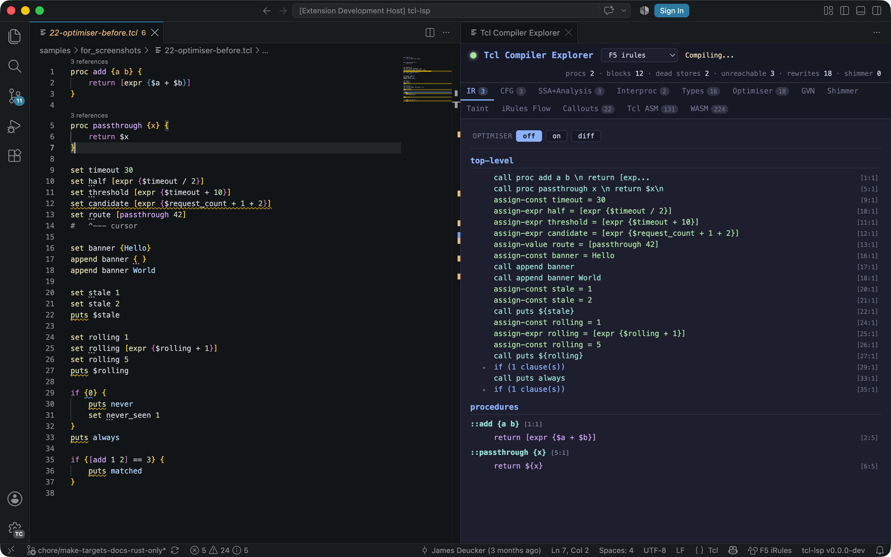

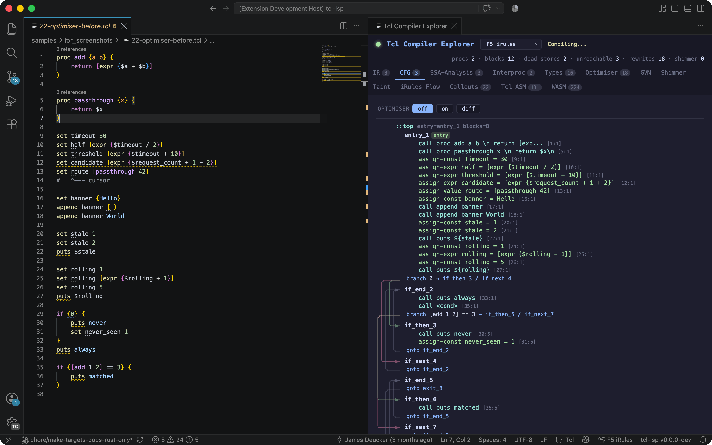

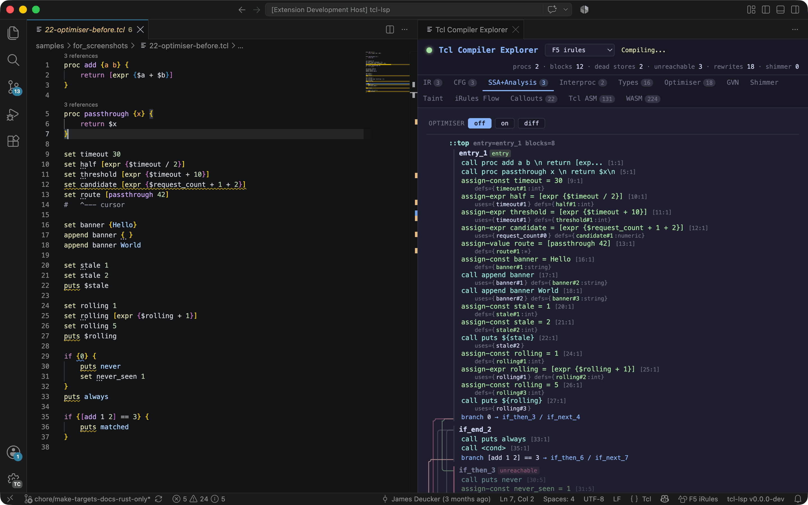

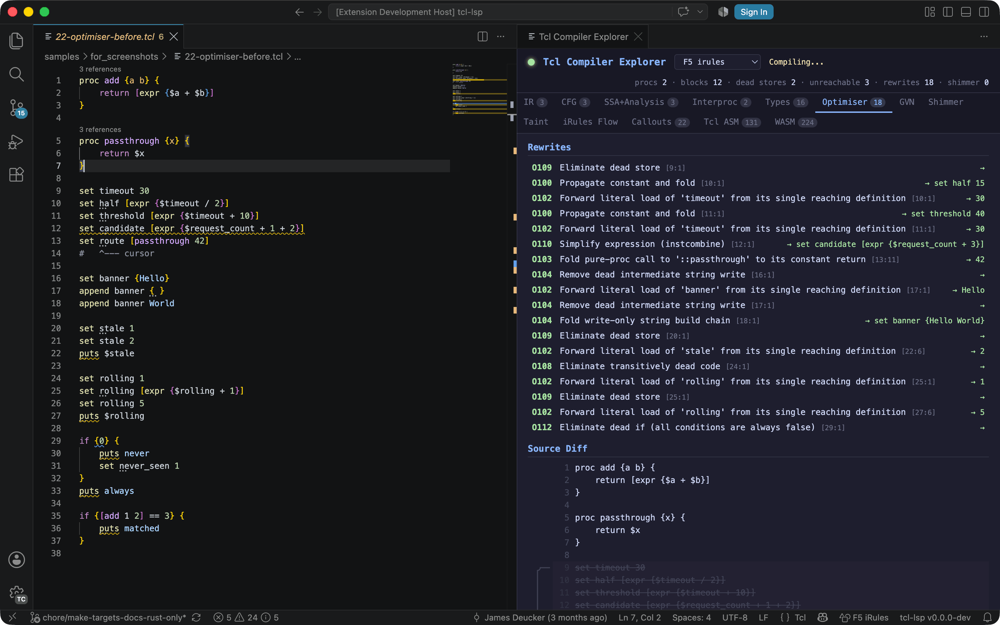

### Compiler explorer (CLI)

Console tool for inspecting the compiler pipeline: IR, CFG, SSA, optimiser
rewrites, shimmer warnings, taint analysis, and bytecode.

```sh
# Full exploration of a Tcl file
tcl explore script.tcl

# Focus on optimiser rewrites only
tcl explore script.tcl --show opt

# Inline source with optimised output
tcl explore --source 'set a 1; set b [expr {$a + 2}]' --show-optimised-source

# Show only IR and CFG
tcl explore script.tcl --show ir,cfg

# iRules dialect with flow analysis
tcl explore irule.tcl --dialect bigip --show irules

# Serve the embedded web GUI
tcl explore --serve
```

Available views: `ir`, `cfg`, `ssa`, `interproc`, `types`, `opt`, `gvn`,
`shimmer`, `taint`, `irules`, `callouts`, `asm`, `wasm`.  Groups: `all`,
`compiler`, `optimiser`.

### Compiler explorer (web GUI)

The embedded web UI for the compiler explorer is served by the native `tcl`
binary via `tcl explore --serve`. The same Rust → WebAssembly module
(`make explorer-wasm`) is bundled into the VS Code and JetBrains panels, which
compile in the webview itself — offline, with no LSP roundtrip.

```sh
# Serve the embedded web GUI
tcl explore --serve

# Choose a port
tcl explore --serve --port 8080
```

## Command registry spec studio

A web page for exploring the command registry: browse every command tcl-lsp
knows for a chosen dialect, edit any field of its `CommandSpec`, and render the
result back out as a drop-in registry `.rs` module (copyright banner included)
or a Tcl dialect stub.  Live at
[bitwisecook.github.io/tcl-lsp/spec-studio](https://bitwisecook.github.io/tcl-lsp/spec-studio/),
or build it locally with `make spec-studio-wasm`.

The form is generated from a schema the registry itself reports, so it covers
every field of `CommandSpec` and `SubCommand` — a field added to the registry
appears in the studio without a front-end change, and a drift test fails if
one is ever missed.

**Import a package** takes a package's own `.tcl` files, runs the real
analyser over them, and infers a starting spec for each `proc` it finds:
arity from the parameter list, argument roles and traits from how each
parameter is *used* in the body (evaluated as a script, `upvar`'d and
written, iterated as a list), hover text from the doc comment, and a
`package require` gate from `package provide`.  Every guess is listed with
the evidence behind it.

Import **several releases** instead of one — a `.zip` per release, uploaded or
fetched from GitHub — and it derives each command's *version range* from what
the releases actually witness: `introduced_version` from the first release the
command appears in, `retired_version` from the first it is gone from, with the
reasoning shown beside every bound.  The same derivation backs `tcl spec
import` on the command line.

Browse the list to pick a command, or type a name you already know and press
**Load** (Enter works too, and the box suggests matching names as you type).

The **Pack DSL** tab holds a [SpecTcl pack](docs/design/spec-packs.md)'s
`.tclspec` source directly as its own authoritative document — edit the
form and the text follows, edit the text and the form follows.  It is a
Monaco editor driven by **the actual Tcl language server**, compiled to
WebAssembly and running in a Web Worker in your browser: the same server
binary your editor talks to, so the semantic colouring, hovers,
completions, diagnostics, and formatting are the ones your editor shows,
not an approximation of them.  The **Test** tab's Tcl sample gets the same
editor, opened under whichever dialect you have selected.  If the server
cannot start the page says so and falls back to a plain text editor with
the pack's own highlighting.

It works on a phone as well as a desktop: the toolbar unwraps to full-width
controls, the tab strip scrolls sideways, and touch targets meet the 44px
minimum.  On a narrow screen the command list moves below the editor, which is
why loading by name matters there.

The registry, the compiler's analyser, both renderers, and the language server
are all compiled to WebAssembly and served from the page's own directory.  Its
content security policy lets the page reach exactly two outside hosts,
`api.github.com` and `codeload.github.com`, and one clearly-labelled opt-in
panel is the only thing that can use them — the release fetcher above, which
acts only when you fill it in and press the button, and which has an offline
`.zip` upload path that does the same job.  Nothing else you type or import can
leave your browser.  Copy the output, download it, or open a pre-filled GitHub
issue proposing the spec.


## Compiling Tcl: WASM, the bytecode VM, and eBPF

The compiler front end is shared by the language server and by three back ends.

#### Tcl-to-WASM compiler

Compile Tcl scripts to WebAssembly (WAT text or binary WASM format) with the
`tcl compwasm` verb.

```sh
# Compile to WASM binary (+ optional WAT sidecar)
tcl compwasm script.tcl -o out.wasm --wat-output out.wat

# Compile inline source
tcl compwasm --source 'set x [expr {1+2}]' -o out.wasm
```

#### Tcl VM

A bytecode interpreter that compiles and executes Tcl scripts using the
compiler pipeline, with an interactive REPL and disassembly mode.  Supports
TclOO classes (constructors, destructors, methods, mixins, filters, private
variables), namespaces, coroutine-free control flow, and 85% conformance
against Tcl 9.0.3 native test suites.

The VM ships as the native `tclvm` binary.

```sh
# Execute a script (trailing args become the script's argv)
tclvm script.tcl arg1 arg2

# Interactive REPL
tclvm

# Inline evaluation
tclvm -c 'puts [expr {6 * 7}]'

# Show bytecode disassembly without executing
tcl dis script.tcl
```

### eBPF (BPF-Tcl)

A low-level packet-matching language that compiles Tcl-shaped source to eBPF —
see [kcs-feature-bpf-tcl.md](docs/kcs/features/kcs-feature-bpf-tcl.md).

#### Tcl debugger

An interactive debugger that can single-step through Tcl scripts with
breakpoints, variable inspection, and call stack visualisation, driven by the
project's own bytecode VM.  It ships as the native `tcl-debug` binary.

```sh
# Debug a script (interactive CLI)
tcl-debug script.tcl

# Speak the Debug Adapter Protocol over stdio (for an editor)
tcl-debug --dap
```

Debugger commands: `run`, `step`/`s`, `next`/`n`, `finish`, `continue`/`c`,
`break <line>`/`b`, `delete <id>`/`d`, `vars`, `print <var>`/`p`, `stack`,
`list`/`l`, `quit`/`q`.

## AI tooling

### Chat participants (VS Code + GitHub Copilot)

Three chat participants integrate with GitHub Copilot to provide
domain-specific AI assistance backed by the LSP's static analysis.

#### `@tcl` — Tcl assistant

| Command | Description |
|---------|-------------|
| `/create` | Generate Tcl code from a description |
| `/explain` | Explain what Tcl code does |
| `/fix` | Iteratively fix all LSP diagnostics |
| `/validate` | Run full LSP validation and show a report |
| `/optimise` | Apply optimiser suggestions with explanations |

```
User:   @tcl /explain what does the fibonacci proc do?
Copilot: walks through the loop, variable assignments, and return value
```

#### `@tk` — Tk GUI assistant

| Command | Description |
|---------|-------------|
| `/create` | Generate a Tk GUI from a description |
| `/explain` | Explain the widget hierarchy and layout |
| `/preview` | Open the Tk Preview pane for the current file |

```
User:   @tk /create a simple calculator with number buttons and a display
Copilot: generates Tk code with grid layout, button callbacks, and display label
```

### Claude Code skills

Twenty purpose-built skills for Claude Code (CLI) that combine LSP static
analysis with AI reasoning.  The skills are native — each calls the
`tcl-mcp` MCP server's tools, iterates on diagnostics, and produces clean
output.

| Skill | Description |
|-------|-------------|
| `irule-create` | Generate a new iRule from a description, validate until clean |
| `irule-explain` | Explain an iRule's logic, data flow, and security posture |
| `irule-fix` | Iteratively fix all diagnostics (analyse → fix → re-analyse) |
| `irule-validate` | Categorised validation report (errors, security, style, optimiser) |
| `irule-review` | Deep security audit: injection, DoS, races, information leakage |
| `irule-convert` | Modernise legacy patterns to current best practices |
| `irule-optimise` | Apply optimiser suggestions with safety explanations |
| `irule-scaffold` | Generate event skeleton with log gating and placeholders |
| `irule-datagroup` | Suggest data-group extraction for inline lookups |
| `irule-diff` | Explain semantic differences between two iRule versions |
| `irule-event` | Look up event/command validity from the registry |
| `irule-migrate` | Convert nginx/Apache/HAProxy config to an iRule |
| `irule-diagram` | Generate a Mermaid flowchart from compiler IR |
| `irule-xc` | Translate to F5 XC with Terraform and JSON output |
| `tcl-create` | Generate Tcl code from a description, validate until clean |
| `tcl-explain` | Explain Tcl code with analysis context |
| `tcl-fix` | Iteratively fix all Tcl diagnostics |
| `tcl-validate` | Categorised Tcl validation report |
| `tcl-optimise` | Apply Tcl optimiser suggestions |
| `tk-create` | Generate Tk GUI code with proper widget hierarchy |
| `spec-author` | Build command specs for a private Tcl library from compiler-inferred evidence |

```sh
# Example: fix all issues in an iRule
claude /irule-fix my_irule.tcl

# Example: security review
claude /irule-review production_rule.tcl

# Example: generate a Mermaid diagram
claude /irule-diagram complex_rule.tcl
```

### MCP server (Claude Desktop / AI agents)

A Model Context Protocol server that exposes tcl-lsp analysis to any
MCP-compatible client (Claude Code, Claude Desktop, Codex, custom agents).

The server is the **native Rust `tcl-mcp`** binary — a single self-contained
executable that calls the Rust analysis crates directly (no Python, no PyO3).
It hosts the full tool surface (46 tools: analysis, LSP features, refactors,
diagnostics, docstrings, iRule/BIG-IP tools, XC translation, Tk layout, test
generation, …). Build it with `make rust-mcp`.

**Install / register.** The installer fetches the prebuilt native binary for
your platform from the GitHub release (`tcl-mcp-<triple>`), verifies its
checksum, detects supported AI harnesses, and asks separately whether to
register each one. If the current project contains that harness's files, the
installer offers project or user scope; otherwise it uses user scope. Claude
Code, Codex, Gemini CLI, GitHub Copilot CLI, OpenCode, Hermes, Goose, and
Bobbit are recognised (Bobbit supports project scope only):

```bash
./scripts/install/install.sh            # fetches + registers the native binary
```

- `TCL_LSP_MCP_BIN=/path/to/tcl-mcp ./scripts/install/install.sh` — register a
  local build instead of downloading.

Working **inside this repo**, compatible harnesses auto-discover the server via
the committed [`.mcp.json`](.mcp.json), which launches
[`scripts/tcl-mcp`](scripts/tcl-mcp): it prefers a local build
(`make rust-mcp`), else a cached binary, else fetches the release asset for the
host platform, else builds from source. Register globally without the installer
with `make rust-mcp && claude mcp add tcl-lsp -- "$(pwd)/target/release/tcl-mcp"`.

| Tool | Description |
|------|-------------|
| `analyze` | Full analysis: diagnostics, symbols, events, and metadata |
| `validate` | Categorised validation report |
| `review` | Security-focused diagnostic report |
| `find-legacy` | Detect legacy patterns eligible for modernisation |
| `optimize` | Optimisation suggestions with rewritten source |
| `hover` | Hover information at a position |
| `complete` | Completions at a position |
| `goto_definition` | Find definition of a symbol |
| `find_references` | Find all references to a symbol |
| `symbols` | Document symbol hierarchy |
| `code_actions` | Quick fixes for a source range |
| `format_source` | Format Tcl/iRules source code |
| `rename` | Rename a symbol throughout the document |
| `event_info` | iRules event metadata and valid commands |
| `command_info` | Command metadata and valid events |
| `event_order` | Events in canonical firing order |
| `call_graph` | Build proc call graph with roots and leaves |
| `symbol_graph` | Build scope/definition/reference graph |
| `dataflow_graph` | Build taint and side-effect graph |
| `diagram` | Extract control-flow diagram data from IR |
| `xc_translate` | Translate iRule to XC configuration |
| `tk_layout` | Extract Tk widget tree as JSON |
| `generate_irule_test` | Generate iRule test script with CFG paths and multi-TMM detection |
| `irule_cfg_paths` | Extract CFG control-flow paths for test planning |
| `fakecmp_which_tmm` | Look up which TMM a connection tuple maps to |
| `fakecmp_suggest_sources` | Find client addr/port combos that hit each TMM |
| `set_dialect` | Set active Tcl dialect for the session |

```json
// Claude Desktop — claude_desktop_config.json (native binary)
{
  "mcpServers": {
    "tcl-lsp": {
      "command": "/absolute/path/to/target/release/tcl-mcp"
    }
  }
}
```

The iRules-specific assistant (`@irule`) and the F5 skills are documented in [README-f5.md](README-f5.md#ai-tooling-for-irules).

## CLI tools

All CLI tools are distributed as native binaries (`tcl`, `f5-query`) — no
runtime required.

### Unified Tcl tool (`tcl`)

A single verb-based CLI that aggregates common local workflows:

- `opt` / `optimise` — optimise combined input source and emit rewritten Tcl
- `diag` — run diagnostics across files/directories/packages
- `lint` — run lint diagnostics across files/directories/packages
- `validate` — error-level validation checks
- `format` — format source using canonical Tcl style rules
- `symbols` — emit symbol definitions for the resolved source
- `diagram` — extract control-flow diagram data from compiler IR
- `callgraph` — build procedure call graph data
- `symbolgraph` — build symbol relationship graph data
- `dataflow` — build taint/effect data-flow graph data
- `command-info` — look up command registry metadata
- `find-legacy` — detect legacy modernisation patterns (detection only)
- `dis` — bytecode disassembly
- `compwasm` — compile input to a WASM binary
- `highlight` — emit syntax-highlighted source (`ansi` or `html`)
- `diff` — compare two sources across AST/IR/CFG compiler representations
- `explore` — run compiler-explorer views (`ir`, `cfg`, `ssa`, `opt`, `asm`, `wasm`, ...)
- `help` — search bundled KCS feature docs from the SQLite help index
- `pkg` — package management: `init`, `add`, `remove`, `install`, `list`, `tree`, `verify`, `info`, `search`, `update`, `sync`, `outdated`, `why`, `vendor`, `run`
- `venv` — virtual environments: `create`, `delete`, `info`, `activate`, `deactivate`, `list`, `update`, `run`
- `spec` — author SpecTcl (`.tclspec`) command packs: `import` derives `introduced_version`/`retired_version` ranges for a package's commands from several labelled release snapshots

```sh
# Optimise everything under src/ into one output script
tcl opt src/ -o build/optimised.tcl

# Run diagnostics across a directory and a Tcl package
tcl diag src/ mypkg --package-path ./vendor/tcl

# Run lint diagnostics (same checks as `diag`)
tcl lint src/ mypkg --package-path ./vendor/tcl

# Validate syntax/error diagnostics
tcl validate src/

# Validate as JSON
tcl validate src/ --json

# Format source text
tcl format script.tcl -o formatted.tcl

# Minify source (strip comments, collapse whitespace, join commands;
# semantics-preserving — never renames symbols or adds variables)
tcl minify script.tcl -o minified.tcl

# Compact minify (also renames proc-local variables; proc names and
# global variables are renamed only with --isolated, since they are
# observable public identities — see docs/kcs/features/kcs-feature-minifier.md)
tcl minify --compact script.tcl -o minified.tcl --symbol-map map.txt

# Aggressive minify (optimise + static substring folding via SCCP + name
# compaction + alias preambles; NOT frame-transparent — it introduces
# helper variables visible to `info vars` and traces)
tcl minify --aggressive script.tcl -o minified.tcl --symbol-map map.txt

# Symbol/graph/find-legacy analysis verbs
tcl symbols script.tcl --json
tcl diagram script.tcl --json
tcl callgraph script.tcl --json
tcl symbolgraph script.tcl --json
tcl dataflow script.tcl --json
tcl command-info HTTP::uri --dialect f5-irules --json
tcl find-legacy rule.irule --json

# iRules-specific lookups live on the f5 CLI:
f5-query irule event-order rule.irule --json
f5-query irule event-info HTTP_REQUEST --json

# Emit bytecode disassembly
tcl dis script.tcl

# Compile to WASM binary (+ optional WAT sidecar)
tcl compwasm script.tcl -o out.wasm --wat-output out.wat

# Emit ANSI-highlighted output (or --format html)
tcl highlight script.tcl --force-colour

# Diff two iRules using compiler structure layers
tcl diff old.irule new.irule --show ast,ir,cfg

# Use compiler explorer views from the same binary
tcl explore script.tcl --show ir,cfg,opt

# Search KCS help docs (optionally scoped by dialect)
tcl help taint analysis --dialect f5-irules

# Show help for the help command itself
tcl help --help

# Emit help search results as JSON
tcl help taint --json

# Derive version ranges for a package's commands from three local release
# snapshots, and validate the result
tcl spec import --snapshot 1.0=rel/1.0 --snapshot 1.2=rel/1.2 --snapshot 2.0=rel/2.0 \
  --dialect tcl8.6 --out mylib.tclspec

# ...or from a GitHub repository's release tags
tcl spec import --github tcltk/tcllib --tag-pattern 'tcllib-*' --limit 8 \
  --complete-history --out tcllib.tclspec
```

For iRules input, pass `--dialect f5-irules` explicitly:

```sh
tcl lint rules/ --dialect f5-irules
```

iRules-specific verbs (`event-order`, `event-info`) live on the separate
`f5` CLI under the `irule` verb group — see the F5 BIG-IP CLI section.

For source builds, run `make kcs-db` first so the `tcl help` command can query
the bundled KCS SQLite database.

**Install the `tcl` CLI** — the released artefact is the native `tcl`
binary; no Python required.
See [INSTALL-cli.md](INSTALL-cli.md) for the one-line `curl | sh`
installer, manual install steps for macOS/Debian/Ubuntu/RHEL/CentOS/
Fedora, source builds, and shell completion (`bash`, `zsh`, `fish`)
that covers every verb, dialect, optimiser profile, and source-path
glob — the same indexed-source extension set the server walks, from the
one catalogue, rather than a list of its own.

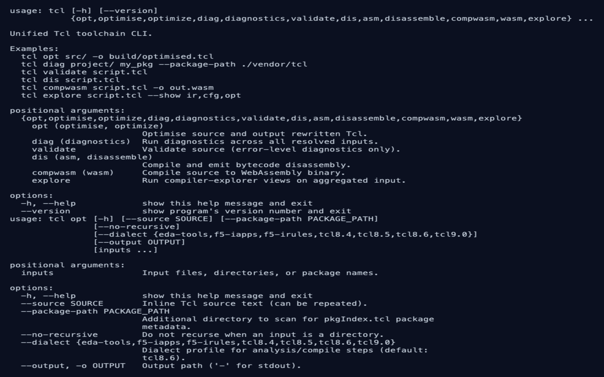

### Differential fuzzer (`tcl-fuzz`)

`tcl-fuzz` compares a generated Tcl program between two engines and saves a
seeded reproducer whenever their behaviour differs. Build it with
`cargo build -p tcl-fuzz`. A release pin is a property of the whole pair, not
just the subject: use a pair whose engines can both honour `--tcl-version`.

```sh
# Both native Rust engines emulate the same selected Tcl release.
tcl-fuzz run --reference runtime-rust --subject tclvm --tcl-version 8.6

# A release-aware finding is found and replayed at its recorded release.
tcl-fuzz replay 12345 --reference runtime-rust --subject tclvm
```

Pinned findings live below a `tclX.Y` directory, so the same pair and seed at
Tcl 8.6 and Tcl 9.0 cannot overwrite one another. `tclsh` is a fixed-release
binary and cannot accept `--tcl-version`; select a matching build with
`--tclsh`, and the fuzzer verifies its reported release before starting. See
[the fuzz-finding triage guide](docs/kcs/kcs-howto-work-on-fuzz-findings.md)
for replay and investigation details.

## Packaging & environments

`tcl pkg` is a deterministic Tcl package manager using Go-style Minimum
Version Selection and a content-addressable SHA-256 cache.  `tcl venv` creates
isolated virtual environments that pin a specific tclsh version.

```sh
# Quick start
tcl venv create .venv            # create a virtual environment
source .venv/bin/activate        # activate it
tcl pkg init                     # create tclpkg.tcl manifest
tcl pkg add json 1.0             # add a dependency
tcl pkg install                  # resolve, fetch, and lock
tcl pkg tree                     # show dependency tree
tcl pkg verify                   # check integrity hashes
```

The manifest is a native Tcl file (`tclpkg.tcl`) evaluated in a sandboxed
interpreter.  The lockfile (`tclpkg.lock`) is canonical JSON — two runs against
the same manifest produce byte-identical output (aside from the
`generated` timestamp, which `--frozen` preserves).

```tcl
# tclpkg.tcl — example manifest
package     myapp
version     1.0.0
license     MIT
tcl         >=8.6

require json    1.3.5
require http    2.9.8
dev-require tcltest 2.5.5
```

The LSP server auto-detects `tclpkg.tcl` projects and venv `lib/` directories,
and offers an "Install via tclpkg" quick-fix on missing-package diagnostics.

See [docs/kcs/features/kcs-feature-tcl-pkg.md](docs/kcs/features/kcs-feature-tcl-pkg.md) for the
full architecture and contracts.

## Suppressing diagnostics

Diagnostics can be suppressed at five different scopes.  Smaller scope is
always better — turning a code off globally hides real problems in future
projects.

| Scope | How |
|-------|-----|
| One command | `# noqa: CODE` on the line before the command |
| One file | `# tcl-lsp: disable=CODE,CODE` near the top of the file |
| One project | `[diagnostics]\ndisabled = CODE` in `.tcl-lsp.ini` at the workspace root |
| One editor | `tclLsp.diagnostics.CODE: false` in editor settings |
| Everywhere | `[diagnostics]\ndisabled = CODE` in the [global config file](#configuration) |

**Inline** — put on the line *before* the command:

```tcl
# noqa: W100
expr $x + 1

# noqa: *
eval $user_input
```

**Top-of-file** — before the first non-comment line:

```tcl
#!/usr/bin/env tclsh
# tcl-lsp: disable=W100,O111
```

**Project config** — `.tcl-lsp.ini` at the workspace root (commit with source):

```ini
[diagnostics]
disabled = W111, IRULE1005

[optimiser]
disabled = O109
```

For the complete reference, see
[`docs/kcs/kcs-howto-suppress-diagnostics.md`](docs/kcs/kcs-howto-suppress-diagnostics.md).

### Excluding files from diagnostics entirely

The scopes above turn individual *codes* off.  To turn **all** diagnostics
off for files matching a glob — for example, `.ruff` documentation files
containing purely virtual procs — use `[diagnostics] exclude` in
`.tcl-lsp.ini` or the global `config.ini`, one pattern per line:

```ini
[diagnostics]
exclude =
    docs/**
    generated/[a-c]*.tcl
    *.ruff
```

A pattern with a `/` matches the file's path relative to its workspace
folder root; a pattern with no `/` matches the file's name at any depth,
gitignore-style.  A matching file publishes no diagnostics at all — every
code, not a subset — while hover, completion, navigation, and formatting
keep working on it.  The server watches `.tcl-lsp.ini`, so saving it
re-applies the exclusion list with no restart.  See
[`docs/kcs/kcs-howto-exclude-files-from-diagnostics.md`](docs/kcs/kcs-howto-exclude-files-from-diagnostics.md)
for the full glob syntax and multi-root behaviour.

### Diff and compare views (VS Code)

The analyser never runs on diff *content* — a diff editor is two real
documents rendered side by side, and the modified side of a Git diff from
**Source Control** (or either side of **Compare With…**) is a real file,
analysed like any open file.  The squiggles a diff shows are therefore that
file's own correct, *whole-file* diagnostics, and they are shown by
default.  Because most of those findings predate the change under review,
you can optionally hide them while a file is shown *only* in a diff
editor:

```json
"tclLsp.suppressDiagnosticsInDiffEditors": true
```

The moment the same file is also open in a normal editor — where you might
be editing it — its diagnostics come back, so analysis of files you are
working on is never affected.  This is a VS Code display choice only: the
server keeps analysing and no diagnostics are lost.  See
[`docs/kcs/kcs-howto-hide-diagnostics-in-diff-views.md`](docs/kcs/kcs-howto-hide-diagnostics-in-diff-views.md).

## Changing how prominent a diagnostic is

Some checks are intentionally quiet — an unused variable
([W211](docs/kcs/codes/kcs-diagnostic-w211-variable-set-not-used.md)), a dead
store, or a style hint render at *hint* severity, a faint underline that is
easy to miss.  Rather than turn a check off, you can re-level it per code so the
editor shows it more (or less) prominently:

```json
{ "tclLsp.diagnosticSeverity.W211": "warning" }
```

Accepted values are `"error"`, `"warning"`, `"information"`, and `"hint"`, plus
`"default"` (keep the analyser's built-in severity).  This changes only how the
diagnostic is displayed — never whether the analysis runs.  Any diagnostic code
can be re-levelled with `tclLsp.diagnosticSeverity.<CODE>`; combine it with the
`tclLsp.diagnostics.<CODE>` on/off toggle above.  In `.tcl-lsp.ini`:

```ini
[diagnosticSeverity]
W211 = warning
```

## Multi-file projects and `package require`

In a project with an "entry" file that runs the `package require`s and then
`source`s the rest, the individual modules use the required commands without a
`package require` of their own.  The missing-`package require` check
([W120](docs/kcs/codes/kcs-diagnostic-w120-missing-package-require.md)) does
**not** flag them:

- **Automatically** — the server builds a workspace `source` graph and each
  module inherits the `package require`s of every file that (transitively)
  `source`s it.  Only literal `source path.tcl` targets are followed.
- **Explicitly** — when the entry file uses a computed `source` path (or you
  prefer to pin it), list the entry files in `.tcl-lsp.ini`; their combined
  requires then apply project-wide and the automatic path is turned off:

  ```ini
  [project]
  entryPoints =
      main.tcl
      src/app.tcl
  ```

## Diagnostic and optimiser codes

Every code has its own page — what it means, why the check exists, a
triggering example, and the fix:

- [Diagnostic codes](docs/generated/diagnostic_codes.md) — the E, W, S, T, and
  IRULE families
- [Optimiser codes](docs/generated/optimisation_codes.md) — the O family
- [Per-code KCS pages](docs/kcs/codes/README.md) — one note per code

iRules-only codes are listed in
[README-f5.md](README-f5.md#irules-diagnostic-codes).

## Configuration

Every setting is available in each editor's own settings UI, and in an INI
file for editor-independent configuration.

- **Which settings exist, and what they do** —
  [`tclLsp.*` reference](docs/kcs/features/kcs-feature-extension-settings.md)
- **Where the server reads configuration from, and which layer wins** —
  [kcs-qa-how-tcl-lsp-loads-configuration.md](docs/kcs/kcs-qa-how-tcl-lsp-loads-configuration.md)
- **Valid INI sections and keys** —
  [kcs-qa-what-config-sections-are-valid.md](docs/kcs/kcs-qa-what-config-sections-are-valid.md)
- **Picking a dialect** —
  [kcs-feature-dialect-selection.md](docs/kcs/features/kcs-feature-dialect-selection.md)
- **Formatter options** —
  [kcs-feature-formatting.md](docs/kcs/features/kcs-feature-formatting.md)

In VS Code, **Tcl: Export Settings** writes your current configuration out as
an INI file you can commit alongside the project.

## Screenshots

### Diagnostics & quick fixes

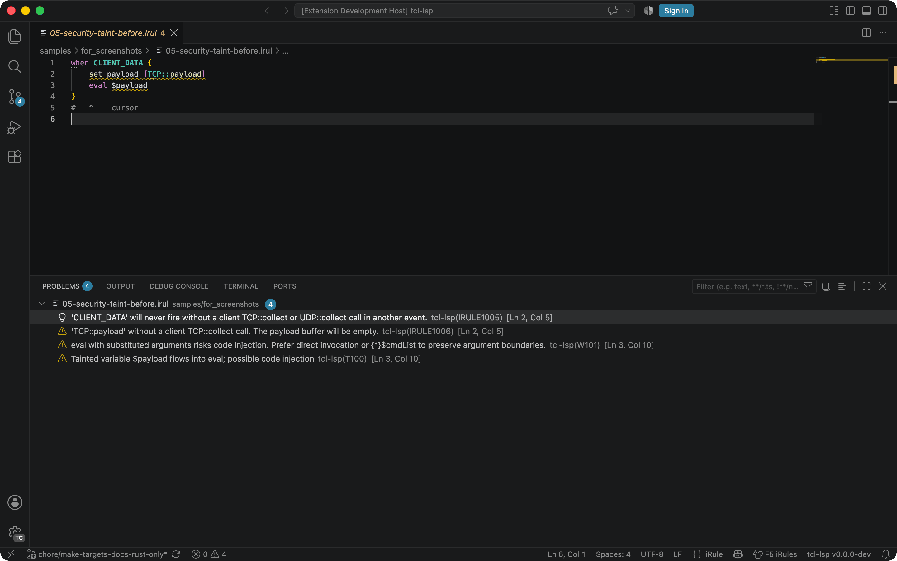

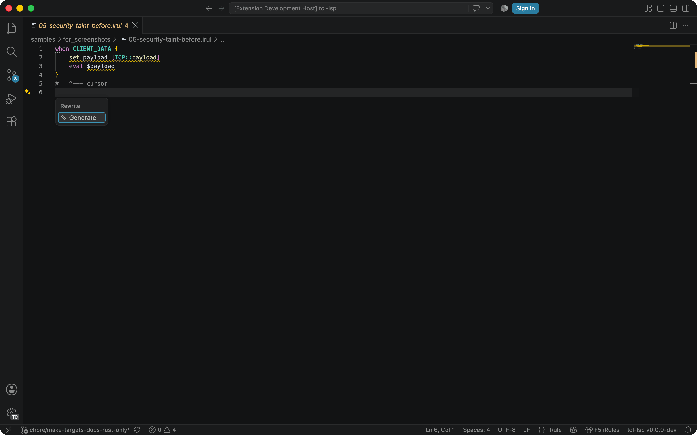

### Hover & completions

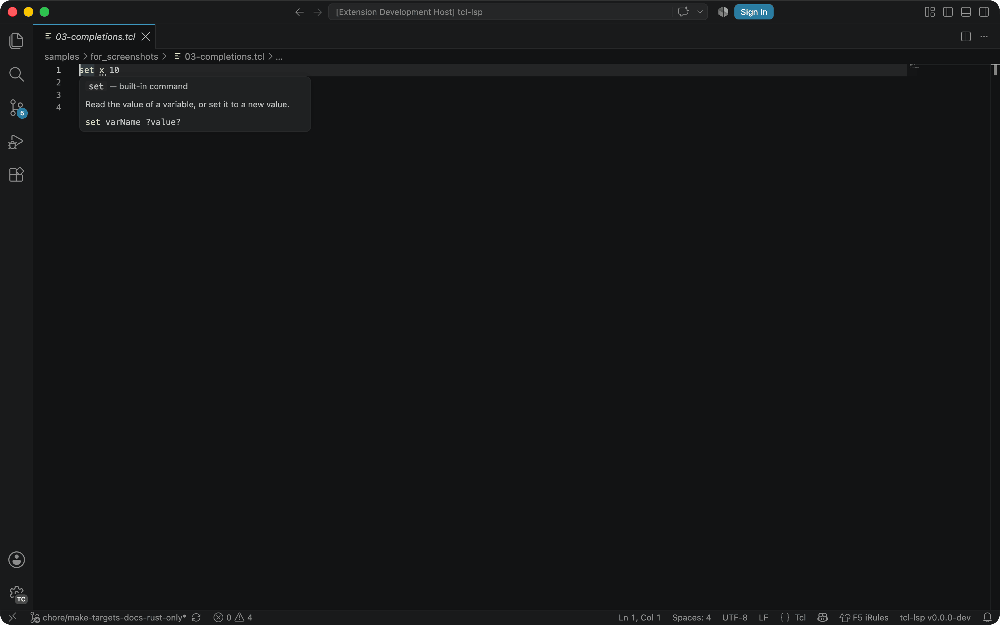

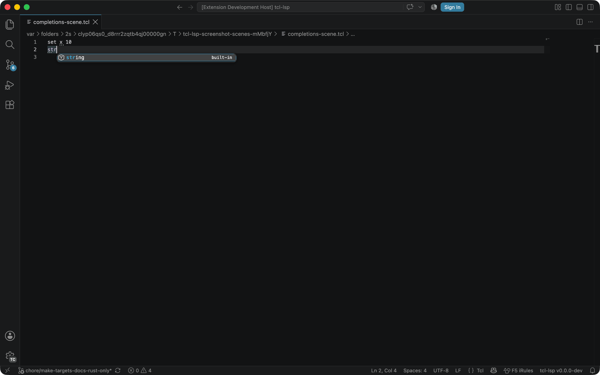

### Security taint analysis

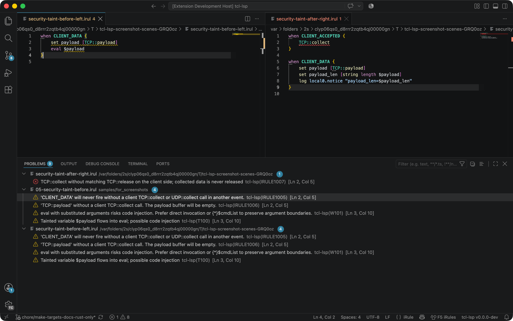

### Semantic highlighting

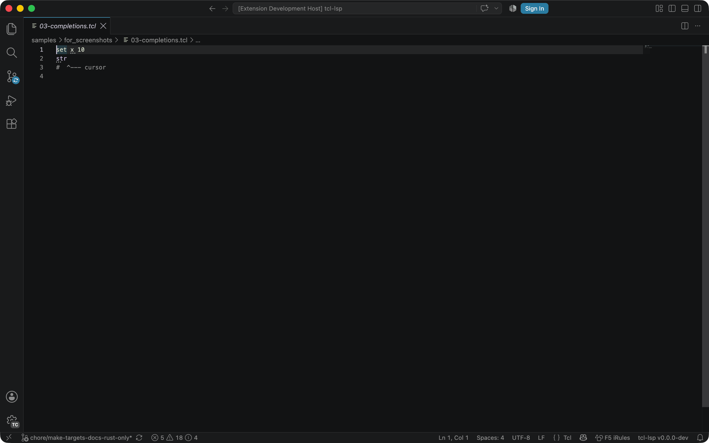

## Building and contributing

- A Rust toolchain (current stable) via [rustup](https://rustup.rs/).  The
  workspace tracks the floating `stable` channel; current stable is 1.98.0,
  released 2026-08-18.
- Node.js 24+ with npm (pinned to v12 via `packageManager`; run `corepack enable npm`)
- VS Code 1.93+

```sh
git clone https://github.com/bitwisecook/tcl-lsp && cd tcl-lsp
make test                  # the whole suite
make build-editor-vsix     # build the VS Code .vsix
```

`make help` lists every target. For the development workflow — the gates to run
before pushing, how to add a diagnostic or a formatter option, the repository
layout, and the code-style rules — see **[AGENTS.md](AGENTS.md)** and
**[CONTRIBUTING.md](CONTRIBUTING.md)**.

Tcl VM conformance work uses the shared C Tcl oracle harness. See
**[How to run the C tcltest suite through the bytecode VM](docs/kcs/kcs-howto-run-tcltest-bundles.md)**;
for example, a narrow Tcl 9 comparison is `cargo xtask tcltest-sweep --backend
both --tcl-root ~/src/tcl9.0.4 --stem parse --match 'parse-18.*'`.

## Acknowledgements

This project was inspired by:

- [Picol](https://github.com/antirez/picol) by Salvatore Sanfilippo (antirez) -- a minimal Tcl interpreter in C that demonstrates the elegance of the Tcl parsing model
- [iRuleScan](https://github.com/simonkowallik/irulescan) by Simon Kowallik -- a security scanner for F5 iRules
- [tclint-vscode](https://github.com/nmoroze/tclint-vscode) by Noah Moroze -- a Tcl linter with VS Code integration

## AI

This project used AI very heavily.

- The core parser, lexer, IR, CFG were largely hand created with input on AI about
  structure, and lots of AI code review.
- The command registry was seeded by hand then filled out with AI.
- The vscode extension, compiler explorer, editor integrations, CI/CD, build pipelines
  VM, and compiler to Tcl bytecode were all entirely vibe coded.
- The Claude skills, AI integrations were vibe coded with hand work on the prompts
  .. they need more of that.
- The vast bulk of tests were AI written, AI ported from sources like Tcl, but all 
  largely directed by me in their creation. If I'd been doing that by hand you'd
  see 3 tests and they'd all be "make install worked for me, good luck"
- Claude Opus 4.6, Gemini 3.1 Pro and OpenAI GPT-5.3-Codex were all used to review
  the code, critise it, rewrite and reorganise it.

## License

This project is licensed under the [GNU Affero General Public License v3.0](LICENSE)
(AGPL-3.0-or-later).

You are free to use this tool as-is. If you modify the code or incorporate
portions of it into another project, the AGPL requires that the complete
source of the derivative work is made available under the same license.

**Upstream contributions strongly preferred.** If you improve or extend this
project, please submit your changes back as a pull request rather than
maintaining a private fork. See [CONTRIBUTING.md](CONTRIBUTING.md) for details.
