# Compiler Glossary

Terms used throughout the Tcl LSP compiler documentation, ordered by
pipeline phase.  See also the [example walkthroughs](example-script-walkthroughs.md)
for worked examples of each concept.

---

## Full pipeline

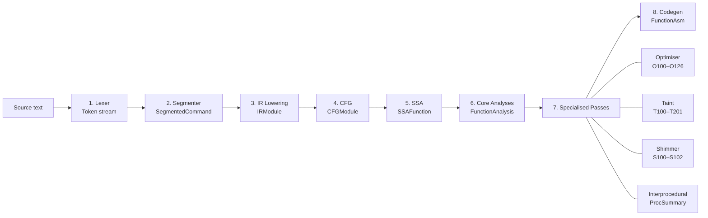

---

## Alphabetic index

[AST](#ast) · [Basic block](#basic-block) · [CFG](#cfg) · [CommandSpec](#commandspec) · [CSE](#cse) · [DCE](#dce) · [Dominator / idom](#dominator--idom) · [Dominance frontier](#dominance-frontier) · [FormSpec](#formspec) · [GVN](#gvn) · [ICIP](#icip) · [InstCombine](#instcombine) · [IR](#ir) · [Lattice](#lattice) · [LCP](#lcp) · [Liveness](#liveness) · [LVT](#lvt) · [Phi node (φ)](#phi-node-φ) · [SCCP](#sccp) · [Shimmer](#shimmer) · [SSA](#ssa) · [SSA value key](#ssa-value-key) · [SubCommand](#subcommand) · [Taint analysis](#taint-analysis) · [Taint colour](#taint-colour) · [Taint sink](#taint-sink) · [Taint source](#taint-source)

---

## Phase 1 — Parsing

### AST

Abstract Syntax Tree — a tree representation of parsed source code
structure.  In this compiler, expression bodies (`expr {…}`) are parsed
into `ExprNode` AST trees
([`expr_ast.py:174`](../core/compiler/expr_ast.py)).

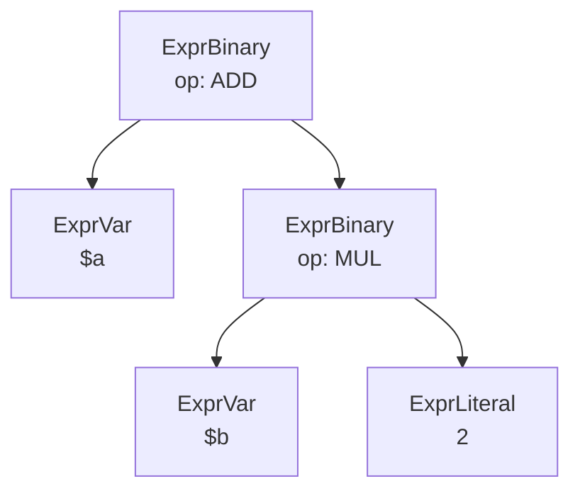

> Example: `expr {$a + $b * 2}` — the AST respects operator precedence
> (`*` binds tighter than `+`).

---

## Phase 2 — Segmentation and error recovery

No new terms — this phase produces `SegmentedCommand` objects and
`VirtualToken` injections (see [Example 20](example-script-walkthroughs.md#example-20-error-recovery--unclosed-bracket)).

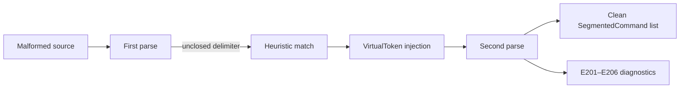

---

## Phase 3 — IR lowering

### IR

Intermediate Representation — a structured, typed representation of Tcl
commands between parsing and code generation.  Defined in
[`ir.py`](../core/compiler/ir.py); the union type `IRStatement`
(`ir.py:265`) covers all statement kinds.

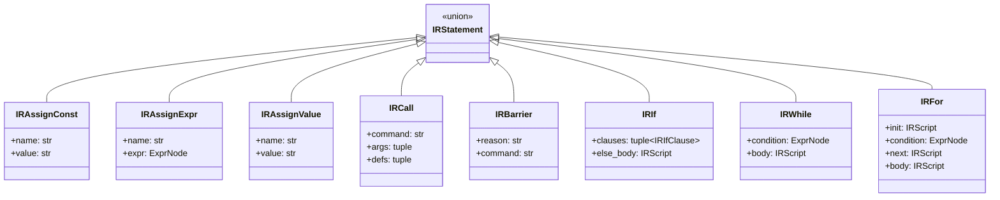

### CommandSpec

The central metadata type for a Tcl command — describes its argument
layout, purity, side effects, taint properties, event validity, and
dialect membership.  See
[`models.py:462`](../core/commands/registry/models.py).

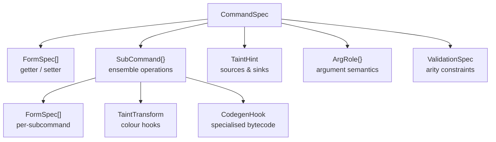

### SubCommand

An ensemble operation selected by the first argument (e.g.
`string length`, `HTTP::header value`).  Each has its own arity, purity,
return type, and taint transform hooks.  See
[`models.py:319`](../core/commands/registry/models.py).

### FormSpec

An invocation form of a command — getter (reads state) or setter (writes
state), each with its own arity and side-effect classification.  See
[`models.py:249`](../core/commands/registry/models.py).

---

## Phase 4 — CFG construction

### Basic block

A straight-line sequence of IR statements with no branches except at the
end.  Represented by
[`CFGBlock`](../core/compiler/cfg.py) (`cfg.py:374`).

### CFG

Control Flow Graph — a directed graph of basic blocks connected by jumps
and branches.  Built by
[`build_cfg()`](../core/compiler/cfg.py) (`cfg.py:1058`).

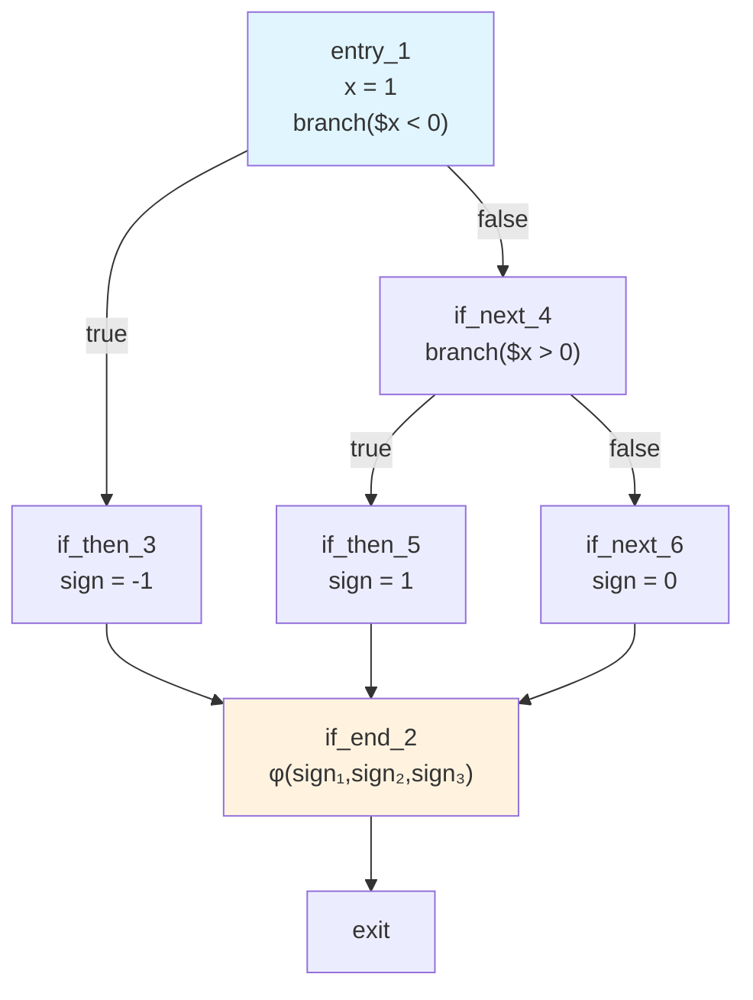

> Example: `if/elseif/else` chain from Example 7.

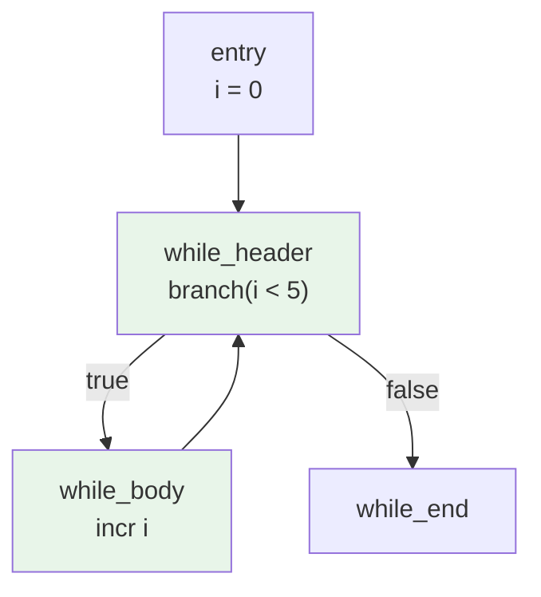

> Example: `while` loop with back-edge from body to header.

---

## Phase 5 — SSA construction

### SSA

Static Single Assignment — a form where every variable is defined exactly
once.  Multiple definitions of the same source variable get unique
*version numbers* (e.g. `x₁`, `x₂`).  Built by
[`build_ssa()`](../core/compiler/ssa.py) (`ssa.py:359`).

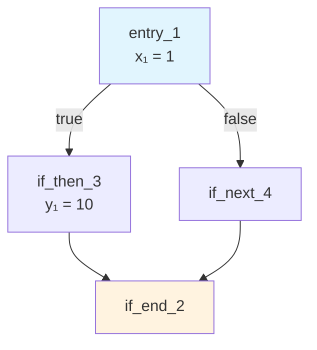

> Unique version per definition: `x₁` in entry, `y₁` in then-branch.

### SSA value key

A `(variable_name, version)` tuple that uniquely identifies one
definition of a variable.  Type alias
[`SSAValueKey`](../core/compiler/ssa.py) (`ssa.py:50`).

### Phi node (φ)

An SSA construct placed at control flow merge points.  `φ(x₁, x₃)` means
"use `x₁` if control arrived from predecessor 1, or `x₃` if from
predecessor 2."  Represented by
[`SSAPhi`](../core/compiler/ssa.py) (`ssa.py:168`).

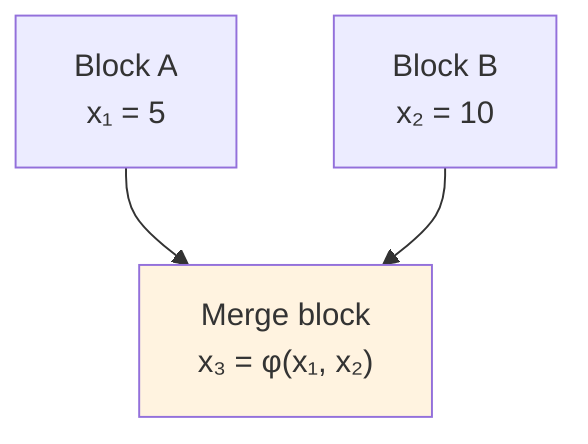

> The phi node selects `x₁` or `x₂` based on which predecessor executed.

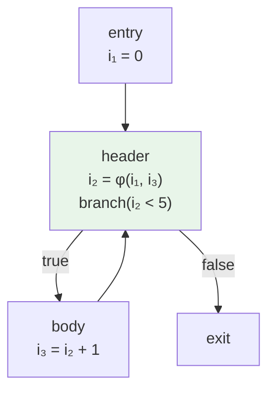

> Loop phi: merges the initial value (`i₁ = 0`) with the loop-carried
> update (`i₃`).

### Dominator / idom

Block A *dominates* block B if every path from the entry to B passes
through A.  The *immediate dominator* (`idom`) is the closest dominator.
Stored in
[`SSAFunction.idom`](../core/compiler/ssa.py) (`ssa.py:210`).

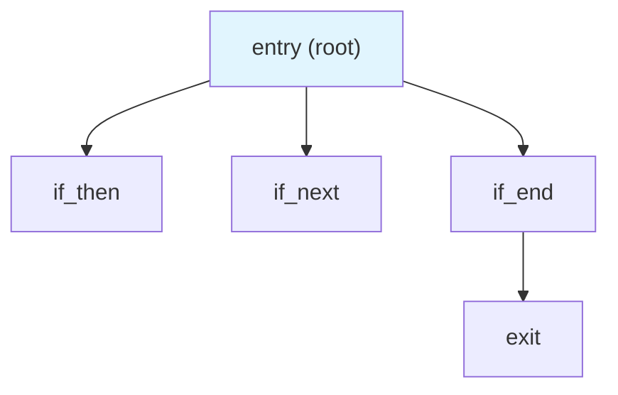

> Dominator tree for an `if/else`: entry dominates all blocks.
> `if_end` dominates `exit`.

### Dominance frontier

The set of blocks where a variable's dominance "ends" — these are where
phi nodes must be inserted.  Stored in
[`SSAFunction.dominance_frontier`](../core/compiler/ssa.py) (`ssa.py:210`).

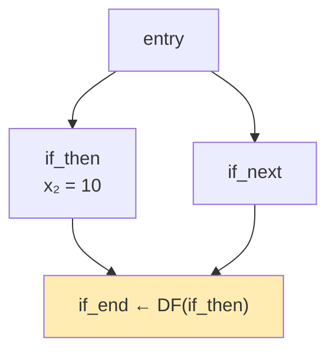

> `if_end` is in the dominance frontier of `if_then` for variable `x` —
> a phi node is placed here.

---

## Phase 6 — Core analyses

### SCCP

Sparse Conditional Constant Propagation — a combined constant propagation
and unreachable-code analysis that runs over the SSA graph.  Implemented
in [`analyse_function()`](../core/compiler/core_analyses.py)
(`core_analyses.py:1210`).

### Lattice

A mathematical structure used in dataflow analysis where values flow from
*bottom* (unknown) toward *top* (overdefined).  The SCCP value lattice is
[`LatticeValue`](../core/compiler/core_analyses.py)
(`core_analyses.py:111`); the type lattice is
[`TypeLattice`](../core/compiler/types.py) (`types.py:53`).

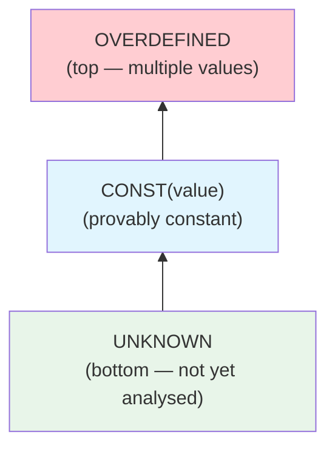

> SCCP value lattice.  Values flow upward — once a value reaches
> OVERDEFINED it never goes back.

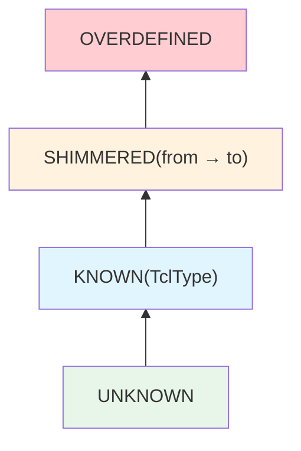

> Type lattice.  SHIMMERED records forced type coercion.

### Liveness

A dataflow analysis that determines which SSA values are "live" (may
still be read) at each program point.  Results are in
[`FunctionAnalysis.live_in / live_out`](../core/compiler/core_analyses.py)
(`core_analyses.py:176`).

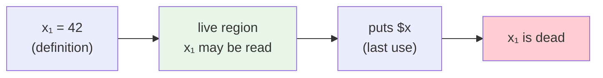

> A value is live from its definition until its last use.  After that,
> it is dead and can be eliminated.

### Shimmer

Tcl's internal type coercion: when a value's string representation is
reinterpreted as a different type (e.g. `"42"` read as an integer).
Tracked by `TypeLattice.SHIMMERED` (`types.py:53`).

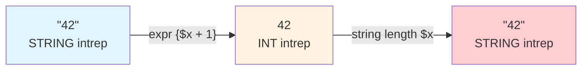

> Each arrow is a shimmer — Tcl silently converts the internal
> representation.  Excessive shimmering degrades performance.

---

## Phase 7 — Interprocedural analysis and specialised passes

### ICIP

Interprocedural Constant/Inline Propagation — evaluates procedure calls
with known constant arguments at compile time and replaces the call with
the result.  Reported as `O103`.  See
[`optimise_static_proc_calls()`](../core/compiler/optimiser/_propagation.py)
(`_propagation.py:271`).

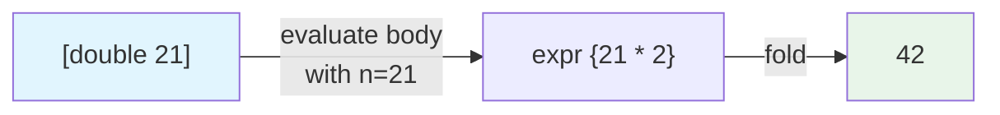

### GVN

Global Value Numbering — an optimisation that detects redundant
computations by assigning a canonical identity to each expression.  See
[`gvn.py:76`](../core/compiler/gvn.py).

### CSE

Common Subexpression Elimination — detects when the same pure computation
is evaluated more than once and suggests extracting it to a variable.
Part of the GVN pass, reported as `O105`.  See
[`gvn.py`](../core/compiler/gvn.py).

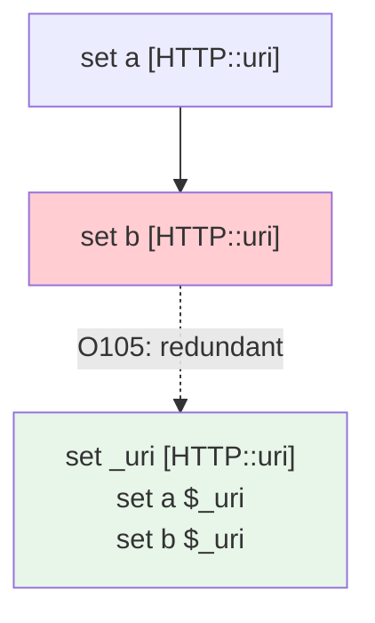

### DCE

Dead Code Elimination — removes code whose result is never used.  `O107`
(basic DCE), `O108` (aggressive DCE tracking statement liveness), `O109`
(dead store elimination).  See
[`_elimination.py`](../core/compiler/optimiser/_elimination.py).

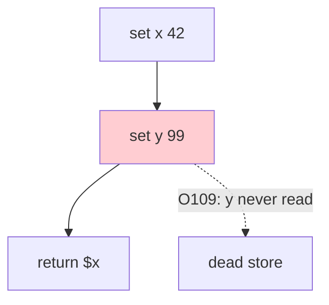

### InstCombine

Instruction Combine — canonicalises and simplifies expressions by
applying algebraic identities (e.g. `$x * 1` → `$x`, DeMorgan's law).
Reported as `O110`.  See
[`_expr_simplify.py`](../core/compiler/optimiser/_expr_simplify.py).

### LCP

Loop Constant Propagation / Code Sinking — moves invariant assignments
out of the hot path into the specific branch that uses them.  Reported
as `O125`.  See
[`_code_sinking.py`](../core/compiler/optimiser/_code_sinking.py).

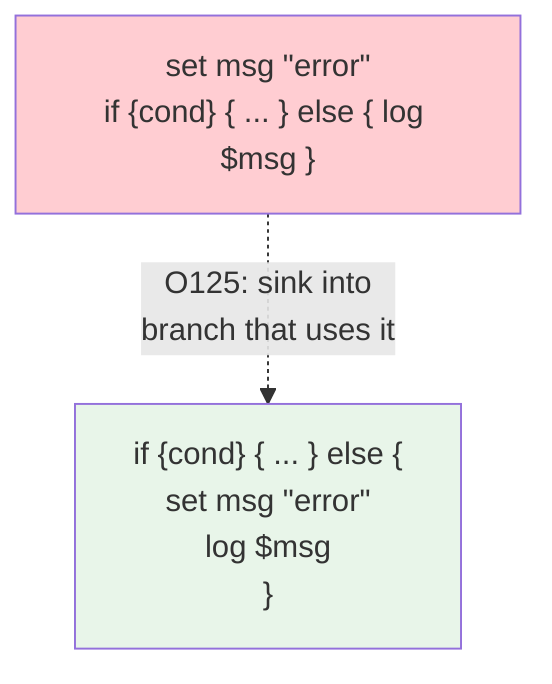

### Taint analysis

Tracks whether values originate from untrusted sources (user input).
Uses [`TaintLattice`](../core/compiler/taint/_lattice.py)
(`taint/_lattice.py:44`).

```mermaid
flowchart LR
    SRC["HTTP::header value Host<br/>(taint source)"]
    SRC -->|"TAINTED"| TOL["string tolower<br/>(passes taint through)"]
    TOL -->|"TAINTED"| SINK["HTTP::respond body<br/>(taint sink)"]
    SINK -->|"IRULE3001"| WARN["⚠ XSS warning"]

    style SRC fill:#ffcdd2
    style SINK fill:#ffcdd2
    style WARN fill:#fff3e0
```

### Taint colour

A `Flag` enum describing safety properties of tainted data (e.g.
`CRLF_FREE`, `URL_ENCODED`, `HTML_ESCAPED`).  Colours compose with `|`
and join by intersection (`&`) — only properties shared by all incoming
paths survive.  Defined in
[`TaintColour`](../core/commands/registry/taint_hints.py)
(`taint_hints.py:17`).

```mermaid
flowchart TD
    T1["Path A:<br/>TAINTED | HTML_ESCAPED"]
    T2["Path B:<br/>TAINTED"]
    T1 --> JOIN["φ join: intersection"]
    T2 --> JOIN
    JOIN --> RESULT["TAINTED<br/>(HTML_ESCAPED lost —<br/>not on all paths)"]

    style T1 fill:#e8f5e9
    style T2 fill:#ffcdd2
    style RESULT fill:#ffcdd2
```

> Colours join by intersection: only properties present on **all** incoming
> paths survive the merge.

### Taint source

A command whose return value introduces tainted data (e.g. `HTTP::host`,
`HTTP::uri`).  Declared via `TaintHint.source` on the command's registry
spec (`taint_hints.py:60`).

### Taint sink

A dangerous argument position where tainted data can cause harm (XSS,
header injection, SSRF).  Classified by
[`_classify_sink()`](../core/compiler/taint/_sinks.py)
(`taint/_sinks.py:99`).

---

## Phase 8 — Bytecode codegen

### LVT

Local Variable Table — maps variable names to integer slot indices for
fast access inside procedures.  See
[`LocalVarTable`](../core/compiler/codegen/_types.py)
(`codegen/_types.py:63`).

```mermaid
flowchart LR
    subgraph "Top level (no LVT)"
        TL1["push &quot;x&quot;"] --> TL2["loadStk"]
    end
    subgraph "Inside proc (LVT)"
        PR1["loadScalar1 %v0"]
    end

    style TL1 fill:#ffcdd2
    style PR1 fill:#e8f5e9
```

> Inside a `proc`, LVT-indexed access (`loadScalar1 %v0`) replaces the
> slower name-based `loadStk`.  Slot 0, 1, … are assigned in parameter
> order.
