# Compiler Glossary

Terms used throughout the Tcl LSP compiler documentation, ordered by
pipeline phase.  See also the [example walkthroughs](design/example-script-walkthroughs.md)
for worked examples of each concept.

---

## Full pipeline

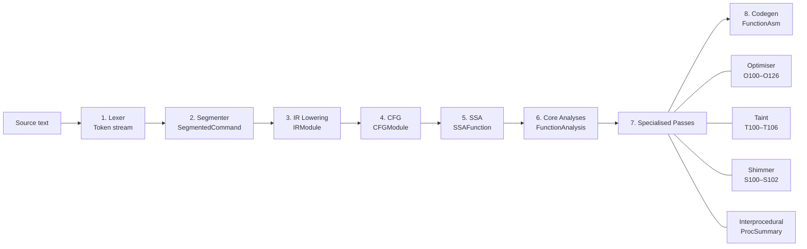
```mermaid
flowchart LR
    SRC["Source text"] --> LEX["1. Lexer<br/>Token stream"]
    LEX --> SEG["2. Segmenter<br/>SegmentedCommand"]
    SEG --> IR["3. IR Lowering<br/>IRModule"]
    IR --> CFG["4. CFG<br/>CFGModule"]
    CFG --> SSA["5. SSA<br/>SSAFunction"]
    SSA --> ANA["6. Core Analyses<br/>FunctionAnalysis"]
    ANA --> SP["7. Specialised Passes"]
    SP --> CG["8. Codegen<br/>FunctionAsm"]

    SP --- OPT["Optimiser<br/>O100–O126"]
    SP --- TAINT["Taint<br/>T100–T106"]
    SP --- SHIM["Shimmer<br/>S100–S102"]
    SP --- INTERP["Interprocedural<br/>ProcSummary"]
```

---

## Alphabetic index

[AST](#ast) · [Basic block](#basic-block) · [CFG](#cfg) · [Codegen](#codegen) · [CommandSpec](#commandspec) · [Constant folding](#constant-folding) · [CSE](#cse) · [Data-flow graph](#data-flow-graph) · [DCE](#dce) · [Def-use chains](#def-use-chains) · [Dominator / idom](#dominator--idom) · [Dominance frontier](#dominance-frontier) · [Escape tag](#escape-tag) · [Execution intent](#execution-intent) · [FormSpec](#formspec) · [Frame-only var](#frame-only-var) · [GVN](#gvn) · [ICIP](#icip) · [InstCombine](#instcombine) · [IPA](#ipa) · [IR](#ir) · [Lattice](#lattice) · [LCP](#lcp) · [Lexing](#lexing) · [LICM](#licm) · [Liveness](#liveness) · [Lowering](#lowering) · [LVT](#lvt) · [Memory-SSA](#memory-ssa) · [Phi node (φ)](#phi-node-φ) · [Rendered-value properties](#rendered-value-properties) · [SCCP](#sccp) · [Shimmer](#shimmer) · [Side-effects](#side-effects) · [SSA](#ssa) · [SSA value key](#ssa-value-key) · [Strength reduction](#strength-reduction) · [SubCommand](#subcommand) · [Tail-call optimisation](#tail-call-optimisation) · [Taint analysis](#taint-analysis) · [Taint colour](#taint-colour) · [Taint sink](#taint-sink) · [Taint source](#taint-source) · [Type inference](#type-inference) · [Unused procs elimination](#unused-procs-elimination) · [Var-escape analysis](#var-escape-analysis)

---

## Phase 1 — Parsing

### Lexing

The first pass of the compiler. Turns source text into a stream of
tokens with exact source ranges, handling Tcl's substitution rules
(word expansion, braces, brackets, quotes, backslash escapes). The
lexer is also responsible for preserving the whitespace and range
information every later pass relies on to point diagnostics at the
right character. Implemented in
[`lexer.py`](../compiler/parsing/lexer.py).

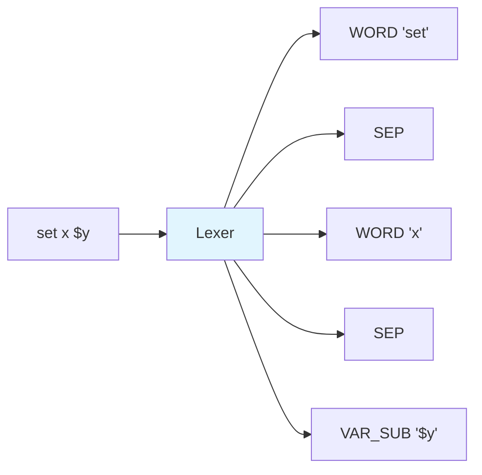
```mermaid
flowchart LR
    SRC["set x $y"] --> L["Lexer"]
    L --> T1["WORD 'set'"]
    L --> T2["SEP"]
    L --> T3["WORD 'x'"]
    L --> T4["SEP"]
    L --> T5["VAR_SUB '$y'"]

    style L fill:#e1f5fe
```

> Every token carries a start and end offset; ranges are the single
> source of truth used by diagnostics, hover, and code actions.

See also: [Lexing and segmentation](design/compiler/lexing-segmentation.md).
KCS tag: `lexing`.

### AST

Abstract Syntax Tree — a tree representation of parsed source code
structure.  In this compiler, expression bodies (`expr {…}`) are parsed
into `ExprNode` AST trees
([`expr_ast.py:174`](../compiler/expr_ast.py)).

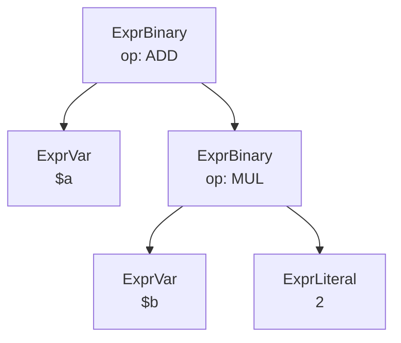
```mermaid
graph TD
    ADD["ExprBinary<br/>op: ADD"] --> VAR_A["ExprVar<br/>$a"]
    ADD --> MUL["ExprBinary<br/>op: MUL"]
    MUL --> VAR_B["ExprVar<br/>$b"]
    MUL --> LIT["ExprLiteral<br/>2"]
```

> Example: `expr {$a + $b * 2}` — the AST respects operator precedence
> (`*` binds tighter than `+`).

See also: [Expression parsing](design/compiler/expression-parsing.md).
KCS tag: `lexing`.

---

## Phase 2 — Segmentation and error recovery

No new terms — this phase produces `SegmentedCommand` objects and
`VirtualToken` injections (see [Example 20](design/example-script-walkthroughs.md#example-20-error-recovery--unclosed-bracket)).

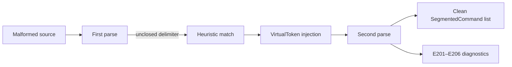
```mermaid
flowchart LR
    SRC["Malformed source"] --> P1["First parse"]
    P1 -->|"unclosed delimiter"| HEUR["Heuristic match"]
    HEUR --> VT["VirtualToken injection"]
    VT --> P2["Second parse"]
    P2 --> CLEAN["Clean SegmentedCommand list"]
    P2 --> DIAG["E201–E206 diagnostics"]
```

---

## Phase 3 — IR lowering

### Lowering

The pass that turns the tokenised command stream into typed IR
statements. Every command known to the registry maps to one or more
`IRStatement` nodes via an `arg_roles` table that says which tokens
are expressions, bodies, variable names, or literal arguments. The
lowering dispatch is what lets the analyser treat `if`, `while`,
`proc`, and user-defined commands uniformly downstream. Implemented
in [`lowering.py`](../compiler/lowering.py).

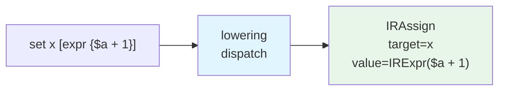
```mermaid
flowchart LR
    TOKENS["set x [expr {$a + 1}]"] --> LOW["lowering<br/>dispatch"]
    LOW --> IR["IRAssign<br/>target=x<br/>value=IRExpr($a + 1)"]

    style LOW fill:#e1f5fe
    style IR fill:#e8f5e9
```

> Lowering is where a token stream stops being a list of words and
> starts being a program the analyser can reason about.

See also: [IR types and lowering](design/compiler/ir-types-lowering.md)
and [Lowering dispatch](design/compiler/lowering-dispatch.md).
KCS tag: `lowering`.

### IR

Intermediate Representation — a structured, typed representation of Tcl
commands between parsing and code generation.  Defined in
[`ir.py`](../compiler/ir.py); the union type `IRStatement`
(`ir.py:265`) covers all statement kinds.

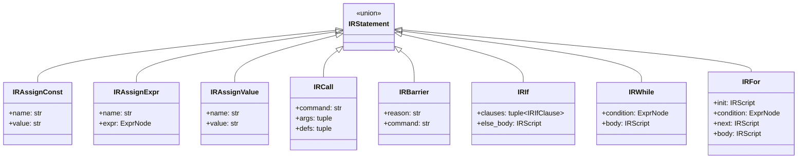
```mermaid
classDiagram
    class IRStatement {
        <<union>>
    }
    class IRAssignConst {
        +name: str
        +value: str
    }
    class IRAssignExpr {
        +name: str
        +expr: ExprNode
    }
    class IRAssignValue {
        +name: str
        +value: str
    }
    class IRCall {
        +command: str
        +args: tuple
        +defs: tuple
    }
    class IRBarrier {
        +reason: str
        +command: str
    }
    class IRIf {
        +clauses: tuple~IRIfClause~
        +else_body: IRScript
    }
    class IRWhile {
        +condition: ExprNode
        +body: IRScript
    }
    class IRFor {
        +init: IRScript
        +condition: ExprNode
        +next: IRScript
        +body: IRScript
    }
    IRStatement <|-- IRAssignConst
    IRStatement <|-- IRAssignExpr
    IRStatement <|-- IRAssignValue
    IRStatement <|-- IRCall
    IRStatement <|-- IRBarrier
    IRStatement <|-- IRIf
    IRStatement <|-- IRWhile
    IRStatement <|-- IRFor
```

See also: [IR types and lowering](design/compiler/ir-types-lowering.md).
KCS tag: `lowering`.

### CommandSpec

The central metadata type for a Tcl command — describes its argument
layout, purity, side effects, taint properties, event validity, and
dialect membership.  See
[`models.py:462`](../core/commands/registry/models.py).

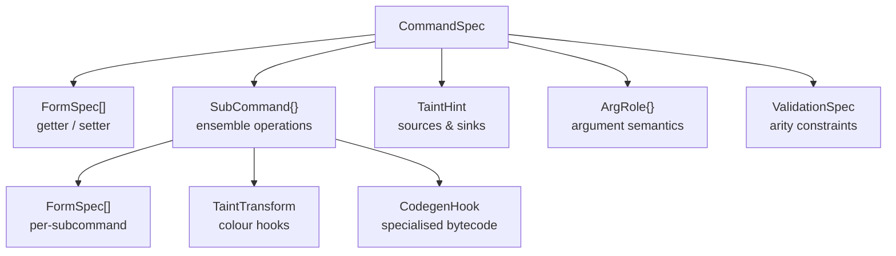
```mermaid
flowchart TD
    CS["CommandSpec"] --> FS["FormSpec[]<br/>getter / setter"]
    CS --> SC["SubCommand{}<br/>ensemble operations"]
    CS --> TH["TaintHint<br/>sources & sinks"]
    CS --> AR["ArgRole{}<br/>argument semantics"]
    CS --> VS["ValidationSpec<br/>arity constraints"]
    SC --> FS2["FormSpec[]<br/>per-subcommand"]
    SC --> TT["TaintTransform<br/>colour hooks"]
    SC --> CG["CodegenHook<br/>specialised bytecode"]
```

See also: [Command registry](design/compiler/command-registry.md)
and [Command registry event model](design/contracts/command-registry-event-model.md).

### SubCommand

An ensemble operation selected by the first argument (e.g.
`string length`, `HTTP::header value`).  Each has its own arity, purity,
return type, and taint transform hooks.  See
[`models.py:319`](../core/commands/registry/models.py).

See also: [Command registry](design/compiler/command-registry.md).

### FormSpec

An invocation form of a command — getter (reads state) or setter (writes
state), each with its own arity and side-effect classification.  See
[`models.py:249`](../core/commands/registry/models.py).

See also: [Command registry](design/compiler/command-registry.md).

---

## Phase 4 — CFG construction

### Basic block

A straight-line sequence of IR statements with no branches except at the
end.  Represented by
[`CFGBlock`](../compiler/cfg.py) (`cfg.py:374`).

See also: [CFG construction](design/compiler/cfg-construction.md).
KCS tag: `cfg`.

### CFG

Control Flow Graph — a directed graph of basic blocks connected by jumps
and branches.  Built by
[`build_cfg()`](../compiler/cfg.py) (`cfg.py:1058`).

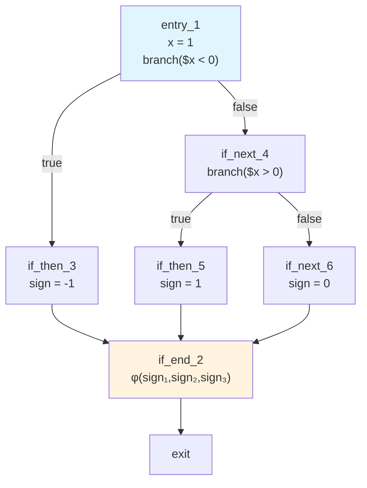
```mermaid
flowchart TD
    E["entry_1<br/>x = 1<br/>branch($x < 0)"]
    E -->|true| THEN["if_then_3<br/>sign = -1"]
    E -->|false| NEXT["if_next_4<br/>branch($x > 0)"]
    NEXT -->|true| THEN2["if_then_5<br/>sign = 1"]
    NEXT -->|false| ELSE["if_next_6<br/>sign = 0"]
    THEN --> END["if_end_2<br/>φ(sign₁,sign₂,sign₃)"]
    THEN2 --> END
    ELSE --> END
    END --> EXIT["exit"]

    style E fill:#e1f5fe
    style END fill:#fff3e0
```

> Example: `if/elseif/else` chain from Example 7.

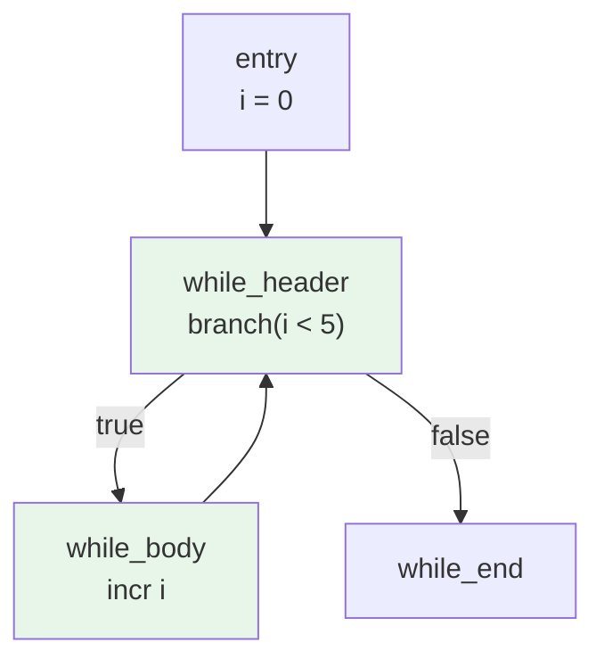
```mermaid
flowchart TD
    E2["entry<br/>i = 0"] --> H["while_header<br/>branch(i < 5)"]
    H -->|true| B["while_body<br/>incr i"]
    H -->|false| END2["while_end"]
    B --> H

    style H fill:#e8f5e9
    style B fill:#e8f5e9
```

> Example: `while` loop with back-edge from body to header.

See also: [CFG construction](design/compiler/cfg-construction.md)
and [Control flow patterns](design/compiler/control-flow-patterns.md).
KCS tag: `cfg`.

---

## Phase 5 — SSA construction

### SSA

Static Single Assignment — a form where every variable is defined exactly
once.  Multiple definitions of the same source variable get unique
*version numbers* (e.g. `x₁`, `x₂`).  Built by
[`build_ssa()`](../compiler/ssa.py) (`ssa.py:359`).

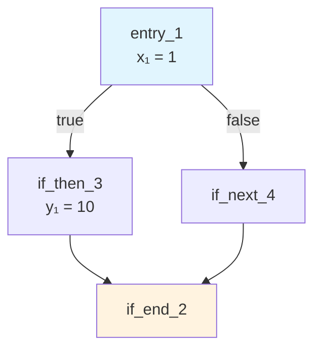
```mermaid
flowchart TD
    E["entry_1<br/>x₁ = 1"]
    E -->|true| T["if_then_3<br/>y₁ = 10"]
    E -->|false| F["if_next_4"]
    T --> M["if_end_2"]
    F --> M

    style E fill:#e1f5fe
    style M fill:#fff3e0
```

> Unique version per definition: `x₁` in entry, `y₁` in then-branch.

See also: [SSA construction](design/compiler/ssa-construction.md)
and [CFG/SSA fact model](design/compiler/cfg-ssa-fact-model.md).
KCS tag: `ssa`.

### SSA value key

A `(variable_name, version)` tuple that uniquely identifies one
definition of a variable.  Type alias
[`SSAValueKey`](../compiler/ssa.py) (`ssa.py:50`).

See also: [SSA construction](design/compiler/ssa-construction.md).
KCS tag: `ssa`.

### Phi node (φ)

An SSA construct placed at control flow merge points.  `φ(x₁, x₃)` means
"use `x₁` if control arrived from predecessor 1, or `x₃` if from
predecessor 2."  Represented by
[`SSAPhi`](../compiler/ssa.py) (`ssa.py:168`).

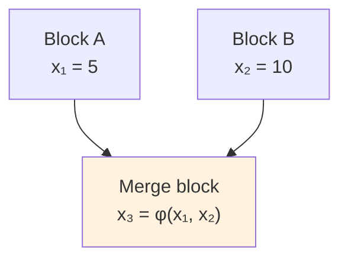
```mermaid
flowchart TD
    A["Block A<br/>x₁ = 5"] --> M["Merge block<br/>x₃ = φ(x₁, x₂)"]
    B["Block B<br/>x₂ = 10"] --> M

    style M fill:#fff3e0
```

> The phi node selects `x₁` or `x₂` based on which predecessor executed.

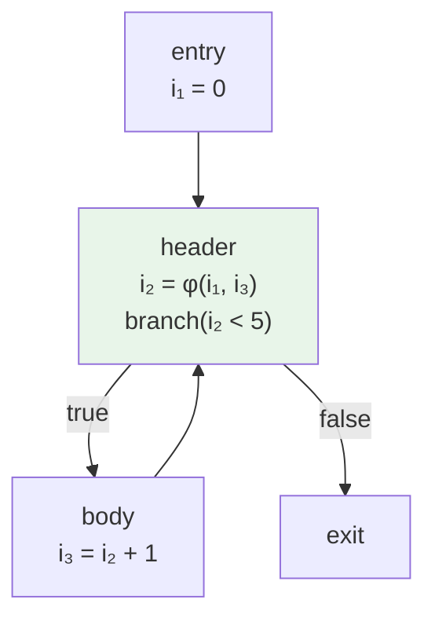
```mermaid
flowchart TD
    INIT["entry<br/>i₁ = 0"] --> HEAD["header<br/>i₂ = φ(i₁, i₃)<br/>branch(i₂ < 5)"]
    HEAD -->|true| BODY["body<br/>i₃ = i₂ + 1"]
    BODY --> HEAD
    HEAD -->|false| EXIT["exit"]

    style HEAD fill:#e8f5e9
```

> Loop phi: merges the initial value (`i₁ = 0`) with the loop-carried
> update (`i₃`).

See also: [SSA construction](design/compiler/ssa-construction.md).
KCS tag: `ssa`.

### Dominator / idom

Block A *dominates* block B if every path from the entry to B passes
through A.  The *immediate dominator* (`idom`) is the closest dominator.
Stored in
[`SSAFunction.idom`](../compiler/ssa.py) (`ssa.py:210`).

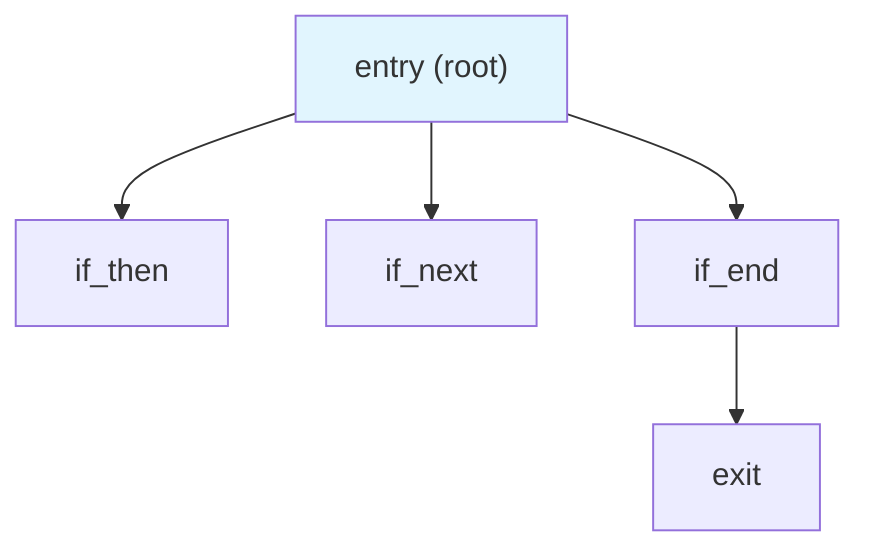
```mermaid
flowchart TD
    E["entry (root)"] --> T["if_then"]
    E --> F["if_next"]
    E --> M["if_end"]
    M --> X["exit"]

    style E fill:#e1f5fe
```

> Dominator tree for an `if/else`: entry dominates all blocks.
> `if_end` dominates `exit`.

See also: [SSA construction](design/compiler/ssa-construction.md).
KCS tag: `ssa`.

### Dominance frontier

The set of blocks where a variable's dominance "ends" — these are where
phi nodes must be inserted.  Stored in
[`SSAFunction.dominance_frontier`](../compiler/ssa.py) (`ssa.py:210`).

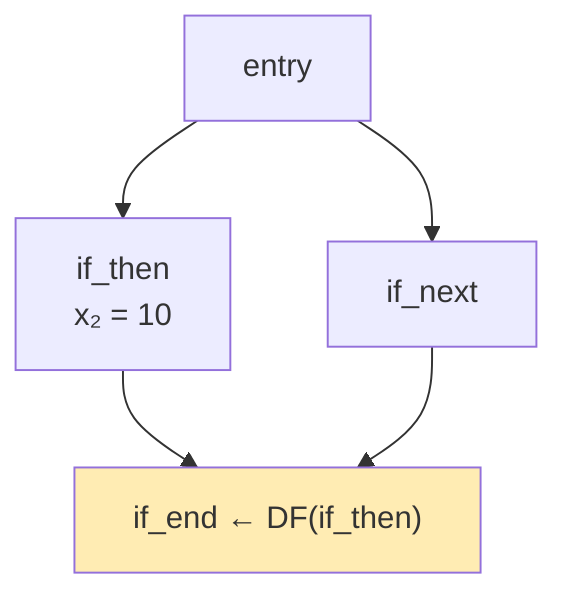
```mermaid
flowchart TD
    E["entry"] --> T["if_then<br/>x₂ = 10"]
    E --> F["if_next"]
    T --> M["if_end ← DF(if_then)"]
    F --> M

    style M fill:#ffecb3
```

> `if_end` is in the dominance frontier of `if_then` for variable `x` —
> a phi node is placed here.

See also: [SSA construction](design/compiler/ssa-construction.md).
KCS tag: `ssa`.

---

## Phase 6 — Core analyses

### SCCP

Sparse Conditional Constant Propagation — a combined constant propagation
and unreachable-code analysis that runs over the SSA graph.  Implemented
in [`analyse_function()`](../compiler/core_analyses.py)
(`core_analyses.py:1210`).

See also: [SCCP and core analyses](design/compiler/sccp-core-analyses.md).
KCS tag: `sccp`.

### Lattice

A mathematical structure used in dataflow analysis where values flow from
*bottom* (unknown) toward *top* (overdefined).  The SCCP value lattice is
[`LatticeValue`](../compiler/core_analyses.py)
(`core_analyses.py:111`); the type lattice is
[`TypeLattice`](../compiler/types.py) (`types.py:53`).

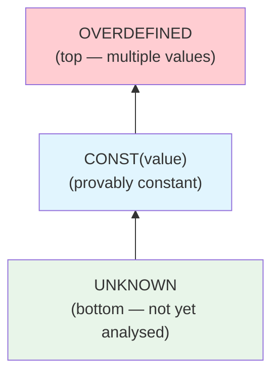
```mermaid
flowchart BT
    UNK["UNKNOWN<br/>(bottom — not yet analysed)"]
    CONST["CONST(value)<br/>(provably constant)"]
    OVER["OVERDEFINED<br/>(top — multiple values)"]
    UNK --> CONST --> OVER

    style UNK fill:#e8f5e9
    style CONST fill:#e1f5fe
    style OVER fill:#ffcdd2
```

> SCCP value lattice.  Values flow upward — once a value reaches
> OVERDEFINED it never goes back.

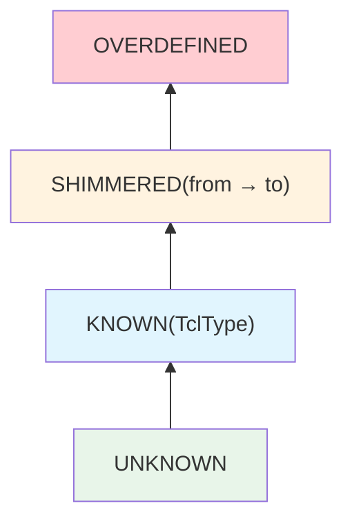
```mermaid
flowchart BT
    U2["UNKNOWN"]
    K["KNOWN(TclType)"]
    S["SHIMMERED(from → to)"]
    O2["OVERDEFINED"]
    U2 --> K --> S --> O2

    style U2 fill:#e8f5e9
    style K fill:#e1f5fe
    style S fill:#fff3e0
    style O2 fill:#ffcdd2
```

> Type lattice.  SHIMMERED records forced type coercion.

See also: [SCCP and core analyses](design/compiler/sccp-core-analyses.md)
and [Constant folding and type inference](design/compiler/constant-folding-type-inference.md).
KCS tag: `sccp`.

### Liveness

A dataflow analysis that determines which SSA values are "live" (may
still be read) at each program point.  Results are in
[`FunctionAnalysis.live_in / live_out`](../compiler/core_analyses.py)
(`core_analyses.py:176`).

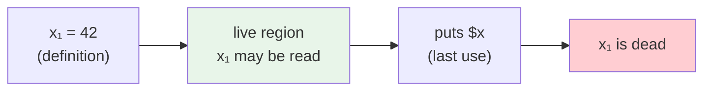
```mermaid
flowchart LR
    DEF["x₁ = 42<br/>(definition)"] --> LIVE["live region<br/>x₁ may be read"]
    LIVE --> USE["puts $x<br/>(last use)"]
    USE --> DEAD["x₁ is dead"]

    style LIVE fill:#e8f5e9
    style DEAD fill:#ffcdd2
```

> A value is live from its definition until its last use.  After that,
> it is dead and can be eliminated.

See also: [SCCP and core analyses](design/compiler/sccp-core-analyses.md).
KCS tag: `liveness`.

### Shimmer

Tcl's internal type coercion: when a value's string representation is
reinterpreted as a different type (e.g. `"42"` read as an integer).
Tracked by `TypeLattice.SHIMMERED` (`types.py:53`).

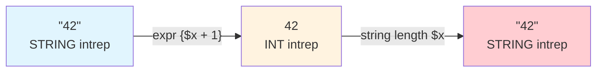
```mermaid
flowchart LR
    STR["&quot;42&quot;<br/>STRING intrep"] -->|"expr {$x + 1}"| INT["42<br/>INT intrep"]
    INT -->|"string length $x"| STR2["&quot;42&quot;<br/>STRING intrep"]

    style STR fill:#e1f5fe
    style INT fill:#fff3e0
    style STR2 fill:#ffcdd2
```

> Each arrow is a shimmer — Tcl silently converts the internal
> representation.  Excessive shimmering degrades performance.

See also: [Shimmer reference behaviour](design/contracts/shimmer-reference-behaviour.md).
KCS tag: `shimmer`.

### Type inference

Flow-sensitive inference of a Tcl value's type over the SSA graph.
The type lattice has `UNKNOWN`, `KNOWN(TclType)`, `SHIMMERED(from → to)`,
and `OVERDEFINED` states; join points use lattice meet and record a
shimmer when two different known types meet.  Implemented in
[`types.py`](../compiler/types.py) (`types.py:53`) and driven from
[`core_analyses.py`](../compiler/core_analyses.py).

See also: [SCCP and core analyses](design/compiler/sccp-core-analyses.md)
and [Constant folding and type inference](design/compiler/constant-folding-type-inference.md).
KCS tag: `type-infer`.

### Def-use chains

Per-SSA-value map of where each value is defined and where it is read.
The compiler builds one entry per SSA version and uses it to drive
liveness, dead-store elimination, inlining, and the data-flow graph.
Implemented in [`def_use.py`](../compiler/def_use.py).

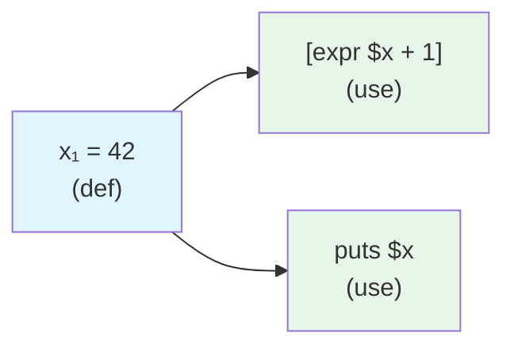
```mermaid
flowchart LR
    DEF["x₁ = 42<br/>(def)"] --> U1["[expr $x + 1]<br/>(use)"]
    DEF --> U2["puts $x<br/>(use)"]

    style DEF fill:#e1f5fe
    style U1 fill:#e8f5e9
    style U2 fill:#e8f5e9
```

> Each SSA definition has exactly one def site and a list of use sites.

See also: [Def-use chains](design/compiler/def-use-chains.md).
KCS tag: `dataflow`.

### Data-flow graph

A directed graph of SSA values and the commands that produce and
consume them, derived from def-use chains. Downstream consumers query
it to answer "where does this value come from?" and "what depends on
this value?" without re-walking the IR.  Implemented in
[`dataflow_graph.py`](../compiler/dataflow_graph.py).

See also: [Data-flow graph](design/compiler/dataflow-graph.md).
KCS tag: `dataflow`.

### Memory-SSA

An extension of SSA that versions memory operations (array writes,
upvar aliases, namespace globals) the same way scalar SSA versions
values. Each memory write creates a new memory version; each memory
read points at the version it sees. Alias sets record which writes may
affect which reads. Implemented in
[`memory_ssa.py`](../compiler/memory_ssa.py).

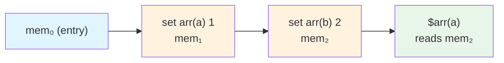
```mermaid
flowchart LR
    M0["mem₀ (entry)"] --> W1["set arr(a) 1<br/>mem₁"]
    W1 --> W2["set arr(b) 2<br/>mem₂"]
    W2 --> R1["$arr(a)<br/>reads mem₂"]

    style M0 fill:#e1f5fe
    style W1 fill:#fff3e0
    style W2 fill:#fff3e0
    style R1 fill:#e8f5e9
```

> Each write produces a new memory version; reads point at the most
> recent version that could have written the cell they read.

See also: [Memory-SSA](design/compiler/memory-ssa.md).
KCS tag: `memssa`.

### Side-effects

Structured classification of what a command does beyond returning a
value: reads variables, writes variables, mutates memory, performs
I/O, raises exceptions, or has unknown effects. Used to decide whether
a call is a barrier for constant propagation, code sinking, and dead-
store elimination. Implemented in
[`side_effects.py`](../compiler/side_effects.py).

See also: [Side-effects system](design/compiler/side-effects-system.md).
KCS tag: `side-effects`.

### Execution intent

A per-argument classification that says whether a command substitution
in argument position is evaluated for its value, for its side-effects,
or both. The optimiser uses this to decide whether a `[cmd]` can be
folded, hoisted, or sunk. Implemented in
[`execution_intent.py`](../compiler/execution_intent.py).

See also: [Execution intent model](design/compiler/execution-intent-model.md).
KCS tag: `exec-intent`.

### Rendered-value properties

A may/must lattice over the possible string contents of an SSA value
at each program point. It answers questions like "does this string
always start with `/`?", "can this ever contain a newline?", and "is
this provably one of a small finite set of values?". Implemented in
[`rendered_properties.py`](../compiler/rendered_properties.py).

See also: [Rendered value properties](design/compiler/rendered-value-properties.md).
KCS tag: `rendered-props`.

---

## Phase 7 — Interprocedural analysis and specialised passes

### IPA

Interprocedural Analysis — walks every proc in the compilation unit
and records a `ProcSummary` for each one. The summary captures the
proc's pure/impure classification, its side-effect set, the taint
colours it propagates, and any constant return value it can prove.
Downstream passes (ICIP, taint, optimiser) query summaries to decide
whether a call site can be folded, inlined, or sunk without re-
walking the callee's body. Implemented in
[`interprocedural.py`](../compiler/interprocedural.py).

```mermaid
flowchart LR
    P1["proc double x"] -->|"summarise"| S1["ProcSummary<br/>pure=true<br/>returns 2*x"]
    P2["proc append_log msg"] -->|"summarise"| S2["ProcSummary<br/>pure=false<br/>writes log"]
    S1 --> ICIP["ICIP: fold [double 21] → 42"]
    S2 --> BARRIER["taint: treat call as barrier"]

    style S1 fill:#e8f5e9
    style S2 fill:#ffcdd2
```

> Each proc becomes a `ProcSummary`; call sites query the summary
> instead of re-analysing the callee.

See also: [Interprocedural analysis](design/compiler/interprocedural-analysis.md).
KCS tag: `ipa`.

### ICIP

Interprocedural Constant/Inline Propagation — evaluates procedure calls
with known constant arguments at compile time and replaces the call with
the result.  Reported as `O103`.  See
[`optimise_static_proc_calls()`](../compiler/optimiser/_propagation.py)
(`_propagation.py:271`).

```mermaid
flowchart LR
    CALL["[double 21]"] -->|"evaluate body<br/>with n=21"| BODY["expr {21 * 2}"]
    BODY -->|"fold"| RESULT["42"]

    style CALL fill:#e1f5fe
    style RESULT fill:#e8f5e9
```

See also: [Optimisation passes](design/compiler/optimisation-passes.md)
and [IPA](#ipa). KCS tag: `ipa`.

### LICM

Loop-Invariant Code Motion — hoists computations that produce the
same value on every iteration out of the loop body. Reported as
`O106`. The safety check uses GVN numbers and memory-SSA to confirm
that the hoisted expression's inputs do not change inside the loop.
See [`gvn.py:776`](../compiler/gvn.py).

```mermaid
flowchart LR
    subgraph before
        B1["set n [llength $xs]"] --> B2["for {} {$i < [llength $xs]}"]
    end
    subgraph after
        A1["set n [llength $xs]"] --> A2["for {} {$i < $n}"]
    end
    before -->|"O106: hoist [llength $xs]"| after

    style B2 fill:#ffcdd2
    style A2 fill:#e8f5e9
```

See also: [Optimisation passes](design/compiler/optimisation-passes.md).
KCS tag: `licm`.

### Tail-call optimisation

A family of rewrites that turn a proc's recursive tail call into a
`tailcall` bytecode (`O121`), or fully iterative code when every call
is a tail call (`O122`). The pass uses CFG dominance to verify that
the call is reached on every exit path and that no work happens after
it. `O123` is an accumulator-introduction hint for procs that are
almost but not quite tail-recursive. Implemented in
[`_tail_call.py`](../compiler/optimiser/_tail_call.py).

```mermaid
flowchart TD
    REC["proc fact {n acc}<br/>  if {$n == 0} {return $acc}<br/>  return [fact [expr {$n-1}] [expr {$n*$acc}]]"]
    REC -->|"O121: tailcall"| TC["replace return-call<br/>with tailcall"]
    REC -->|"O122: while loop"| WL["rewrite as iterative while"]

    style REC fill:#e1f5fe
    style TC fill:#e8f5e9
    style WL fill:#e8f5e9
```

See also: [Tail-call recursion optimisation](design/compiler/tail-call-recursion-optimisation.md).
KCS tag: `tail-call`.

### Constant folding

Compile-time evaluation of expressions whose inputs are all known
constants, so the runtime sees the result directly instead of the
computation. Covers constant propagation (`O100`), integer expression
folding (`O101`), constant command-substitution folding (`O102`),
redundant-nested-`[expr]` removal (`O115`), list folding (`O116`,
`O118`), and string-compare simplification (`O117`). Implemented in
[`_propagation.py`](../compiler/optimiser/_propagation.py).

```mermaid
flowchart LR
    IN["set x [expr {2 + 3}]"] -->|"O101/O102: fold"| OUT["set x 5"]

    style IN fill:#e1f5fe
    style OUT fill:#e8f5e9
```

See also: [Optimisation passes](design/compiler/optimisation-passes.md)
and [Constant folding and type inference](design/compiler/constant-folding-type-inference.md).
KCS tag: `const-fold`.

### Strength reduction

A family of peephole rewrites that replace an expensive operation
with a cheaper one that computes the same value: `$x ** 2` becomes
`$x * $x`, `$x % 8` becomes `$x & 7`, and so on. The pass fires as
part of expression simplification and is reported under `O113`.
Implemented in
[`_propagation.py`](../compiler/optimiser/_propagation.py).

See also: [Optimisation passes](design/compiler/optimisation-passes.md).
KCS tag: `strength-reduce`.

### GVN

Global Value Numbering — an optimisation that detects redundant
computations by assigning a canonical identity to each expression.  See
[`gvn.py:76`](../compiler/gvn.py).

See also: [Optimisation passes](design/compiler/optimisation-passes.md).
KCS tag: `gvn`.

### CSE

Common Subexpression Elimination — detects when the same pure computation
is evaluated more than once and suggests extracting it to a variable.
Part of the GVN pass, reported as `O105`.  See
[`gvn.py`](../compiler/gvn.py).

```mermaid
flowchart TD
    A["set a [HTTP::uri]"] --> B["set b [HTTP::uri]"]
    B -.->|"O105: redundant"| FIX["set _uri [HTTP::uri]<br/>set a $_uri<br/>set b $_uri"]

    style B fill:#ffcdd2
    style FIX fill:#e8f5e9
```

See also: [Optimisation passes](design/compiler/optimisation-passes.md).
KCS tag: `cse`.

### DCE

Dead Code Elimination — removes code whose result is never used.  `O107`
(basic DCE), `O108` (aggressive DCE tracking statement liveness), `O109`
(dead store elimination).  See
[`_elimination.py`](../compiler/optimiser/_elimination.py).

```mermaid
flowchart TD
    S1["set x 42"] --> S2["set y 99"]
    S2 --> S3["return $x"]
    S2 -.->|"O109: y never read"| DEAD["dead store"]

    style S2 fill:#ffcdd2
```

See also: [Optimisation passes](design/compiler/optimisation-passes.md).
KCS tag: `dce`.

### InstCombine

Instruction Combine — canonicalises and simplifies expressions by
applying algebraic identities (e.g. `$x * 1` → `$x`, DeMorgan's law).
Reported as `O110`.  See
[`_expr_simplify.py`](../compiler/optimiser/_expr_simplify.py).

See also: [Optimisation passes](design/compiler/optimisation-passes.md).
KCS tag: `instcombine`.

### LCP

Loop Constant Propagation / Code Sinking — moves invariant assignments
out of the hot path into the specific branch that uses them.  Reported
as `O125`.  See
[`_code_sinking.py`](../compiler/optimiser/_code_sinking.py).

```mermaid
flowchart TD
    BEFORE["set msg &quot;error&quot;<br/>if {cond} { ... } else { log $msg }"]
    BEFORE -.->|"O125: sink into<br/>branch that uses it"| AFTER["if {cond} { ... } else {<br/>  set msg &quot;error&quot;<br/>  log $msg<br/>}"]

    style BEFORE fill:#ffcdd2
    style AFTER fill:#e8f5e9
```

See also: [O125 code sinking](design/compiler/o125-code-sinking.md).
KCS tag: `code-sinking`.

### Unused procs elimination

Comments out procs that are defined but never called from any iRule
event or from another reachable proc. The pass walks the call graph
from every event entry point, marks every reachable proc as live,
and turns anything unreached into a `# ` commented-out block so the
reader can see what the pass did. Reported as `O124`. Implemented in
[`_unused_procs.py`](../compiler/optimiser/_unused_procs.py).

```mermaid
flowchart LR
    EV1["when HTTP_REQUEST"] --> P1["proc handle_req"]
    P1 --> P2["proc parse_uri"]
    P3["proc legacy_helper<br/>(never called)"] -.->|"O124: comment out"| DEAD["# proc legacy_helper ..."]

    style P1 fill:#e8f5e9
    style P2 fill:#e8f5e9
    style P3 fill:#ffcdd2
    style DEAD fill:#ffcdd2
```

See also: [O124 unused iRule procs](design/compiler/optimiser-o124-unused-irule-procs.md).
KCS tag: `unused-procs`.

### Escape tag

One of two values — `LOCAL` or `FRAME` — attached to each Tcl variable
in a procedure by the var-escape analysis. A `LOCAL` variable is kept in
a WASM local slot (fast); a `FRAME` variable is spilled to the runtime
frame so the interpreter, an `upvar` alias, or a dynamic `set $name`
can observe it by name. The top of the lattice is `FRAME`; joins use
the "any FRAME wins" rule. Defined in
[`EscapeTag`](../compiler/var_escape/_types.py).

See also: [Var-escape analysis](design/compiler/var-escape-analysis.md).
KCS tag: `var-escape`.

### Frame-only var

Short-hand for a Tcl variable whose escape tag is `FRAME`. The WASM
codegen bypasses the WASM local slot for frame-only vars: reads go
through `tcl_local_get`, writes through `tcl_local_set`, and existence
checks through `tcl_info_exists`. See
[`_is_frame_only_var`](../compiler/codegen/wasm/__init__.py) in
the emitter.

### Var-escape analysis

Per-proc + interprocedural static analysis that decides which Tcl
variables must live in the runtime frame. Handles `upvar`, `global`,
`variable`, dynamic `set $name` / `incr $name`, literal and dynamic
`eval`, `uplevel`, and the frame-inspecting `info` subcommands. Runs a
worklist fixpoint over `direct_callees` to fold callee `upvar` source
sets back into callers. Implemented in
[`compiler/var_escape/`](../compiler/var_escape/).

### Taint analysis

Tracks whether values originate from untrusted sources (user input).
Uses [`TaintLattice`](../compiler/taint/_lattice.py)
(`taint/_lattice.py:44`).

```mermaid
flowchart LR
    SRC["HTTP::header value Host<br/>(taint source)"]
    SRC -->|"TAINTED"| TOL["string tolower<br/>(passes taint through)"]
    TOL -->|"TAINTED"| SINK["HTTP::respond body<br/>(taint sink)"]
    SINK -->|"IRULE3001"| WARN["⚠ XSS warning"]

    style SRC fill:#ffcdd2
    style SINK fill:#ffcdd2
    style WARN fill:#fff3e0
```

See also: [Taint analysis](design/compiler/taint-analysis.md).
KCS tag: `taint`.

### Taint colour

A `Flag` enum describing safety properties of tainted data (e.g.
`CRLF_FREE`, `URL_ENCODED`, `HTML_ESCAPED`).  Colours compose with `|`
and join by intersection (`&`) — only properties shared by all incoming
paths survive.  Defined in
[`TaintColour`](../core/commands/registry/taint_hints.py)
(`taint_hints.py:17`).

```mermaid
flowchart TD
    T1["Path A:<br/>TAINTED | HTML_ESCAPED"]
    T2["Path B:<br/>TAINTED"]
    T1 --> JOIN["φ join: intersection"]
    T2 --> JOIN
    JOIN --> RESULT["TAINTED<br/>(HTML_ESCAPED lost —<br/>not on all paths)"]

    style T1 fill:#e8f5e9
    style T2 fill:#ffcdd2
    style RESULT fill:#ffcdd2
```

> Colours join by intersection: only properties present on **all** incoming
> paths survive the merge.

See also: [Taint analysis](design/compiler/taint-analysis.md).
KCS tag: `taint`.

### Taint source

A command whose return value introduces tainted data (e.g. `HTTP::host`,
`HTTP::uri`).  Declared via `TaintHint.source` on the command's registry
spec (`taint_hints.py:60`).

See also: [Taint analysis](design/compiler/taint-analysis.md).
KCS tag: `taint`.

### Taint sink

A dangerous argument position where tainted data can cause harm (XSS,
header injection, SSRF).  Classified by
[`_classify_sink()`](../compiler/taint/_sinks.py)
(`taint/_sinks.py:99`).

See also: [Taint analysis](design/compiler/taint-analysis.md).
KCS tag: `taint`.

---

## Phase 8 — Bytecode codegen

### Codegen

The last pass of the compiler. Walks the optimised CFG/SSA function
and emits Tcl bytecode plus a local variable table, a jump table,
and a peephole-optimised instruction stream. Codegen is the point at
which an IR program becomes something the Tcl VM (or `tclsh`) can
run byte-for-byte. Implemented under
[`codegen/`](../compiler/codegen/).

```mermaid
flowchart LR
    SSA["optimised SSA"] --> LIN["linearise"]
    LIN --> EMIT["emit instructions"]
    EMIT --> PEEP["peephole"]
    PEEP --> BC["bytecode + LVT"]

    style BC fill:#e8f5e9
```

See also: [Codegen internals](design/compiler/codegen-internals.md)
and [Codegen module map](design/compiler/codegen-module-map.md).
KCS tag: `codegen`.

### LVT

Local Variable Table — maps variable names to integer slot indices for
fast access inside procedures.  See
[`LocalVarTable`](../compiler/codegen/_types.py)
(`codegen/_types.py:63`).

```mermaid
flowchart LR
    subgraph "Top level (no LVT)"
        TL1["push &quot;x&quot;"] --> TL2["loadStk"]
    end
    subgraph "Inside proc (LVT)"
        PR1["loadScalar1 %v0"]
    end

    style TL1 fill:#ffcdd2
    style PR1 fill:#e8f5e9
```

> Inside a `proc`, LVT-indexed access (`loadScalar1 %v0`) replaces the
> slower name-based `loadStk`.  Slot 0, 1, … are assigned in parameter
> order.

See also: [Codegen internals](design/compiler/codegen-internals.md).
KCS tag: `codegen`.
