# Compiler Architecture

The tcl-lsp compiler is a multi-pass analysis pipeline that transforms Tcl
source text into progressively richer intermediate representations, culminating
in SSA-based dataflow analyses, optimisation suggestions, security diagnostics,
and bytecode assembly.  The primary outputs are fed back to the LSP server as
diagnostics, code actions, and editor hints.  The bytecode backend also
produces Tcl-compatible assembly for identity testing against reference
`tclsh` implementations.

## KCS quick map

For targeted maintenance tasks, prefer these focused KCS notes before editing this file:

- [compiler KCS index](kcs/compiler/README.md)

- [kcs-compiler-pipeline-overview.md](kcs/compiler/kcs-compiler-pipeline-overview.md)
- [kcs-lowering-contracts.md](kcs/compiler/kcs-lowering-contracts.md)
- [kcs-cfg-ssa-fact-model.md](kcs/compiler/kcs-cfg-ssa-fact-model.md)
- [kcs-diagnostics-integration.md](kcs/compiler/kcs-diagnostics-integration.md)
- [kcs-compilation-unit-contracts.md](kcs/compiler/kcs-compilation-unit-contracts.md)
- [kcs-downstream-pass-contracts.md](kcs/compiler/kcs-downstream-pass-contracts.md)
- [kcs-async-diagnostics-tiering.md](kcs/compiler/kcs-async-diagnostics-tiering.md)
- [kcs-bytecode-boundary.md](kcs/compiler/kcs-bytecode-boundary.md)
- [kcs-pass-authoring-checklist.md](kcs/compiler/kcs-pass-authoring-checklist.md)

## Pipeline overview

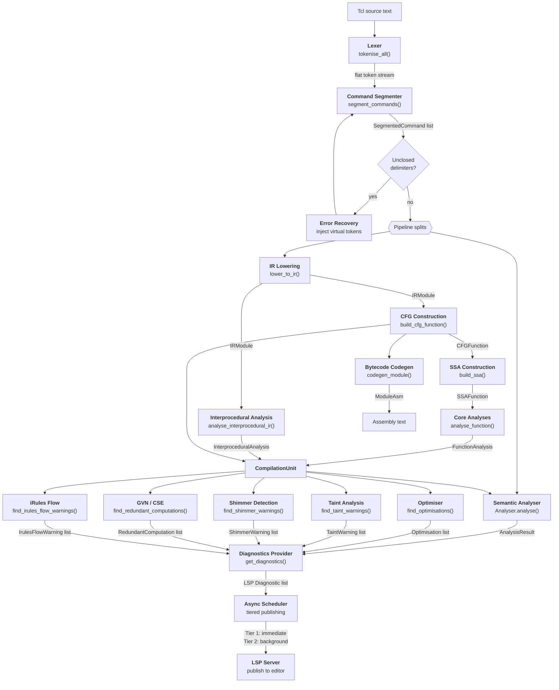

## Stage details

### 1. Lexer

**File:** `core/parsing/lexer.py` — class `TclLexer`

Converts raw source text into a flat stream of `Token` values.  Each token
carries its `TokenType`, text content, and precise `SourcePosition`
(line, column, byte offset).

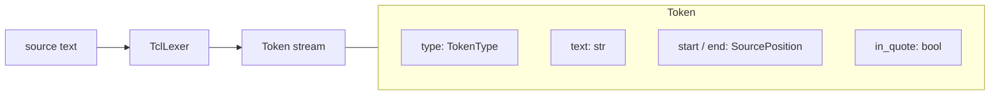

Token types:

| Type | Meaning | Example |
|------|---------|---------|
| `STR` | Braced string | `{hello world}` |
| `VAR` | Variable reference | `$name`, `${arr(idx)}` |
| `CMD` | Command substitution | `[clock seconds]` |
| `ESC` | String / word fragment | `hello` |
| `SEP` | Whitespace separator | spaces, tabs |
| `EOL` | Command terminator | newline, `;` |
| `COMMENT` | Comment text | `# ...` |

The lexer handles Tcl-specific constructs: nested command substitutions,
`$var`, `${name}`, `$arr(idx)`, namespace separators `::`, backslash
escapes, and brace nesting.  Base-offset parameters allow the same lexer to
be re-entered for nested bodies (brace/bracket contents).

### 2. Command Segmenter

**File:** `core/parsing/command_segmenter.py` — function `segment_commands()`

Tcl has no traditional grammar — a "program" is a sequence of commands, each
being a list of whitespace-separated words terminated by a newline or
semicolon.  The segmenter groups the flat token stream into per-command
structures.

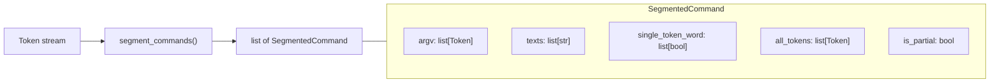

Multi-token words (adjacent tokens with no separator, e.g. `$prefix.txt`) are
concatenated into a single `texts` entry.  The `single_token_word` flags
record which words are atomic — important for downstream constant tracking.

### 3. Error Recovery

**File:** `core/parsing/recovery.py` — function `segment_with_recovery()`

When the segmenter encounters an unclosed delimiter (`{`, `[`, `"`), recovery
kicks in:

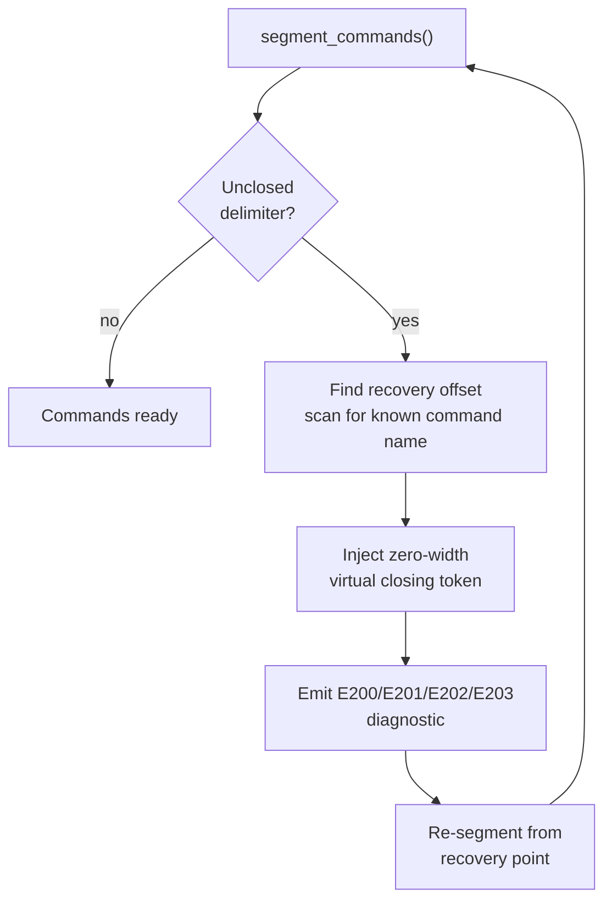

Virtual tokens are zero-width characters inserted at the detected problem
site.  This preserves all position mapping — no source rewriting occurs.
Recovery diagnostics use E-series codes (E200 = generic unclosed, E201 =
unterminated `[`, E202 = unterminated `"`, E203 = unterminated `{`).

### 4. Semantic Analyser

**File:** `core/analysis/analyser.py` — class `Analyser`

A single-pass walk over segmented commands that builds a semantic model:
scopes, procedure definitions, variable definitions, command invocations.
It pattern-matches command names and dispatches to specialised handlers.

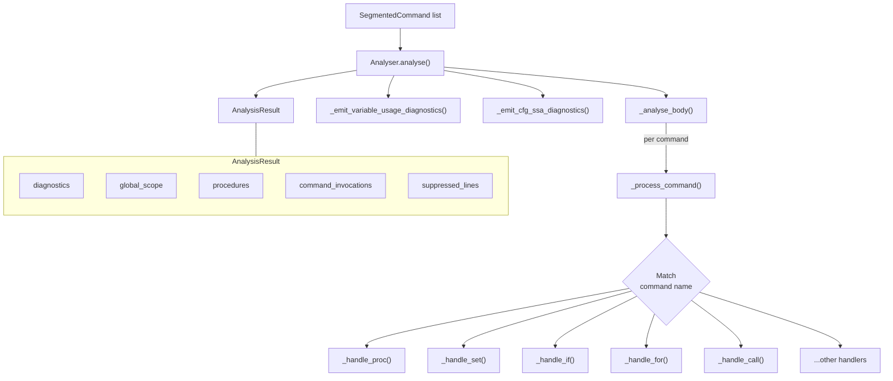

The analyser also receives the `CompilationUnit` (when available) to emit
CFG/SSA-informed diagnostics such as unreachable-code and dead-store warnings.

### 5. IR Lowering

**File:** `core/compiler/lowering.py` — function `lower_to_ir()`

Converts segmented commands into a structured Intermediate Representation.
Each Tcl command maps to a typed IR node.

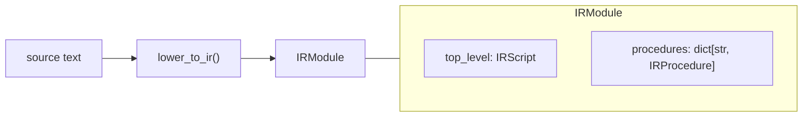

#### IR node hierarchy

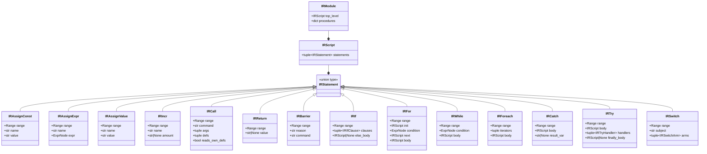

Key design decisions:
- **Barriers** (`IRBarrier`) mark commands like `eval`, `uplevel`, `upvar`
  that defeat static analysis — no constant propagation or dead-store
  reasoning can cross them.
- **Every node carries a `Range`** for precise source mapping back to
  diagnostics.
- **Expression bodies** are parsed into `ExprNode` AST trees at lowering
  time (via `parse_expr()`), not left as opaque strings.

### 6. Control Flow Graph

**File:** `core/compiler/cfg.py` — function `build_cfg_function()`

Flattens structured IR (`IRIf`, `IRFor`, `IRSwitch`, etc.) into basic blocks
with explicit control-flow edges.

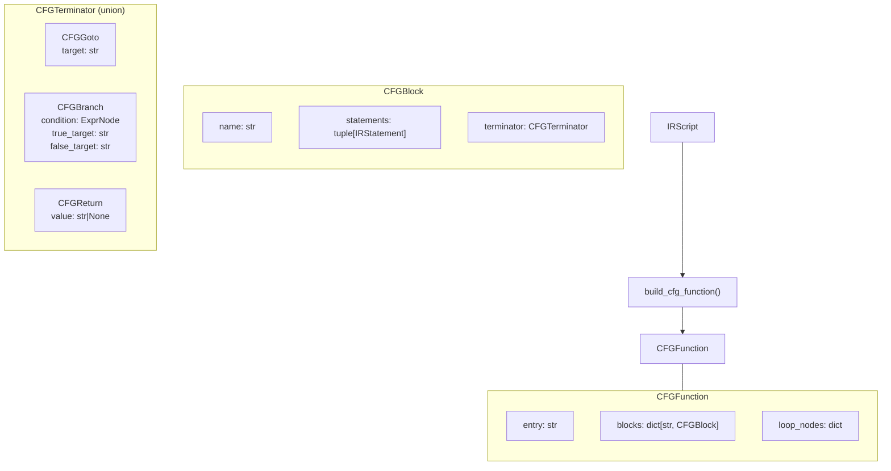

Each basic block is a straight-line sequence of IR statements ending with
exactly one terminator.  Structured constructs decompose as follows:

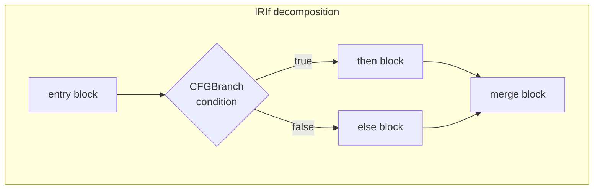

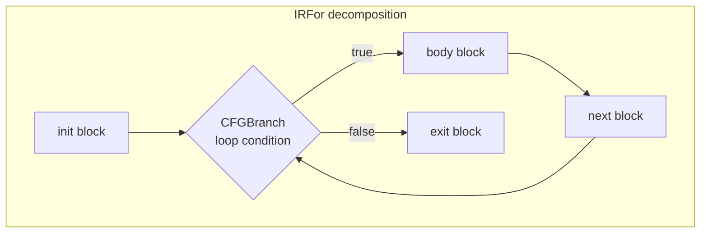

### 7. SSA Construction

**File:** `core/compiler/ssa.py` — function `build_ssa()`

Converts the CFG to Static Single-Assignment form, where every variable is
defined exactly once.  Phi nodes are inserted at control-flow merge points.

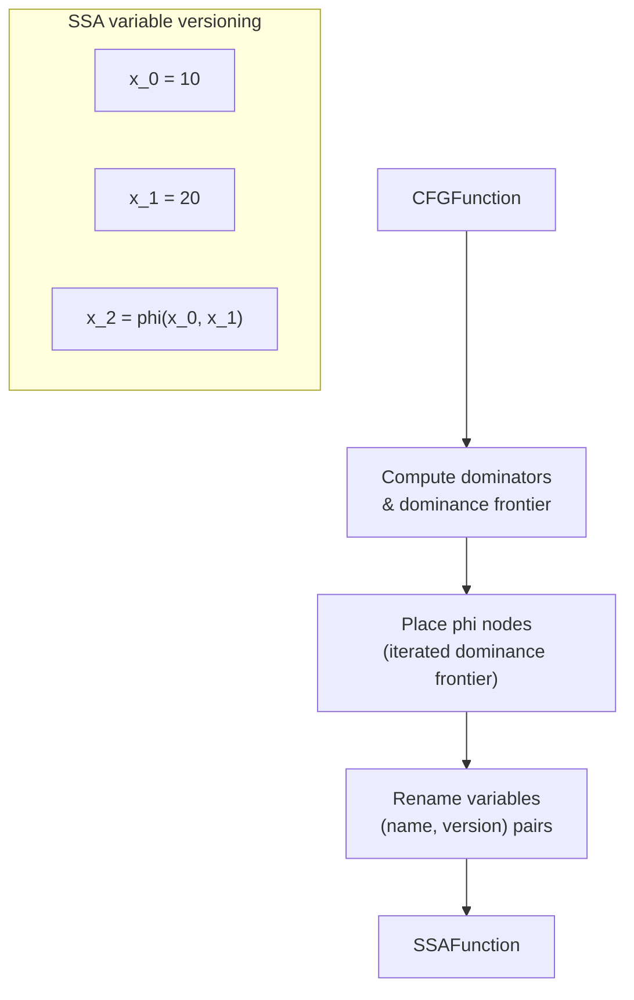

Key types:
- `SSAVersion` (int) — version number for each definition
- `SSAValueKey` — `tuple[str, SSAVersion]` identifying a unique SSA value
- `SSAFunction` — contains per-block phi nodes, variable version maps,
  and dominance information

### 8. Core Analyses

**File:** `core/compiler/core_analyses.py` — function `analyse_function()`

Runs the main dataflow passes over the SSA graph:

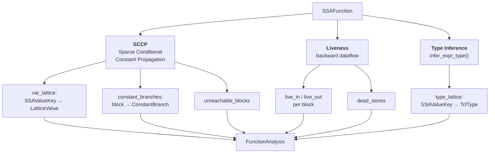

#### SCCP lattice

SCCP uses a three-point lattice per SSA value.  Values flow monotonically
upward and never narrow:

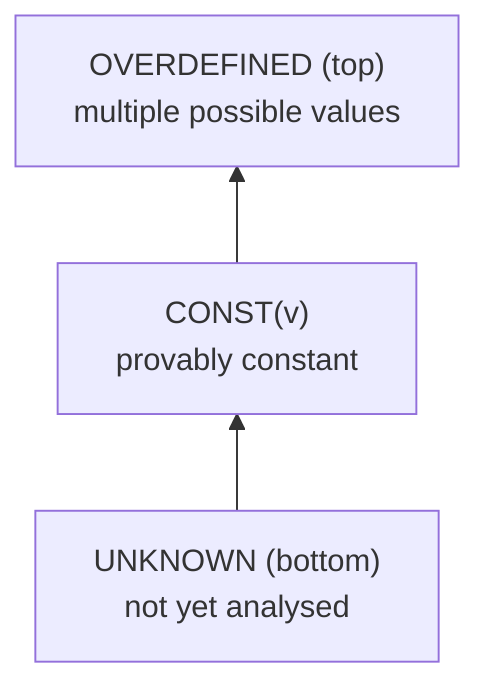

Branch conditions are evaluated against the lattice.  If a branch condition
is `CONST`, only the taken edge is explored — the other side is marked
unreachable, enabling dead-code detection.

### 9. Interprocedural Analysis

**File:** `core/compiler/interprocedural.py` — function `analyse_interprocedural_ir()`

Builds conservative procedure summaries across the entire module:

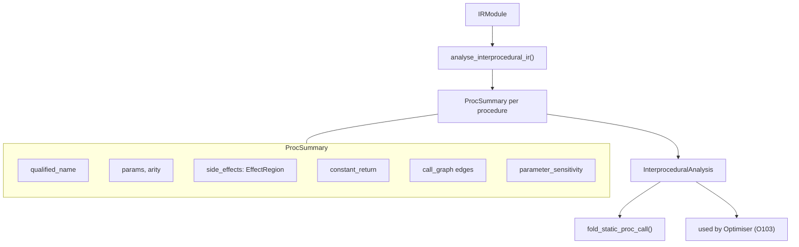

Summaries describe:
- **Side-effect / purity** — whether a proc is pure (no I/O, no globals)
- **Constant return** — whether a proc always returns the same value
- **Parameter sensitivity** — which parameters affect the return value
- **Call graph edges** — for transitive analysis

The optimiser uses these summaries for O103 (fold static procedure calls)
and the taint analysis uses them for cross-procedure taint propagation.

### 10. Compilation Unit

**File:** `core/compiler/compilation_unit.py` — function `compile_source()`

`CompilationUnit` remains the shared artefact boundary for IR/CFG/SSA/interprocedural
facts consumed across diagnostics and downstream passes. For operational contracts,
cache semantics, and regression anchors, use:

- [kcs-compilation-unit-contracts.md](kcs/compiler/kcs-compilation-unit-contracts.md)

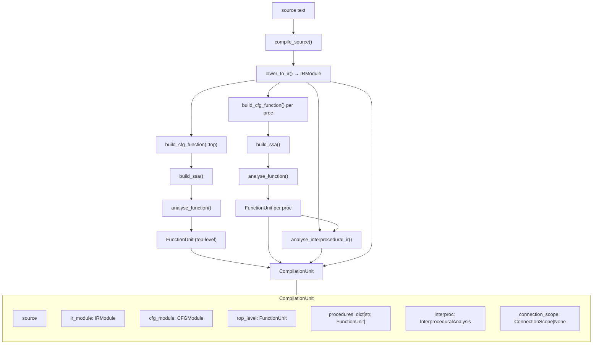

### 11. Downstream Analysis Passes

All downstream passes consume the `CompilationUnit` and produce typed warnings
converted by the diagnostics provider. Contract details, ownership guidance,
and pass/test anchors are tracked in:

- [kcs-downstream-pass-contracts.md](kcs/compiler/kcs-downstream-pass-contracts.md)
- [kcs-pass-authoring-checklist.md](kcs/compiler/kcs-pass-authoring-checklist.md)

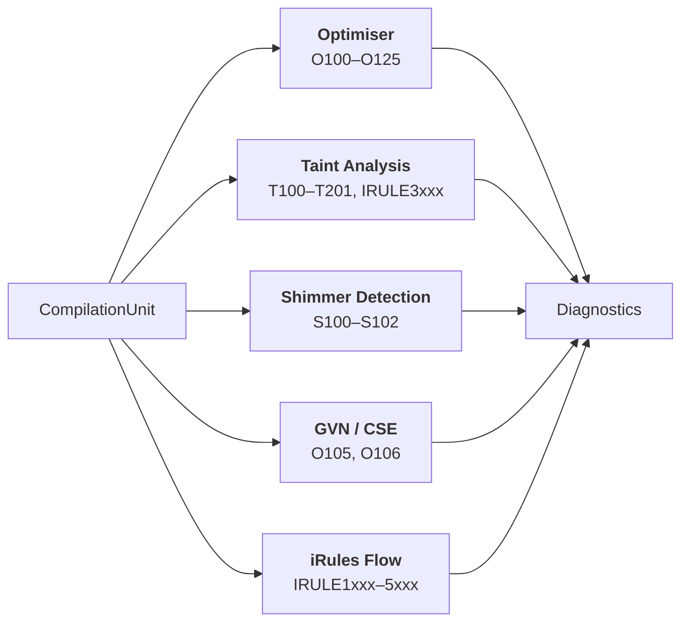

### 12. Diagnostics Provider

**File:** `lsp/features/diagnostics.py` — function `get_diagnostics()`

`get_diagnostics()` is the policy boundary that merges analyser + pass findings,
applies suppression/disable rules, and converts to LSP diagnostics. Integration
contracts now live in:

- [kcs-diagnostics-integration.md](kcs/compiler/kcs-diagnostics-integration.md)
- [kcs-async-diagnostics-tiering.md](kcs/compiler/kcs-async-diagnostics-tiering.md)

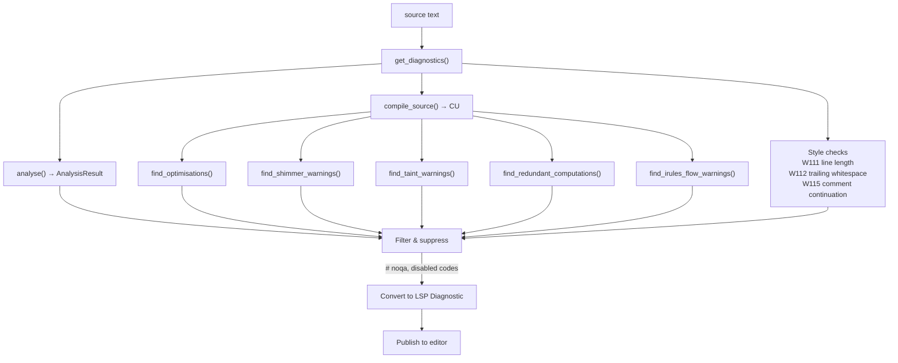

### 13. Bytecode Assembly Backend

**File:** `core/compiler/codegen.py` — functions `codegen_function()`, `codegen_module()`

Takes a pre-SSA `CFGModule` and emits assembly text matching the format
produced by `tcl::unsupported::disassemble` in Tcl 9.0.2.

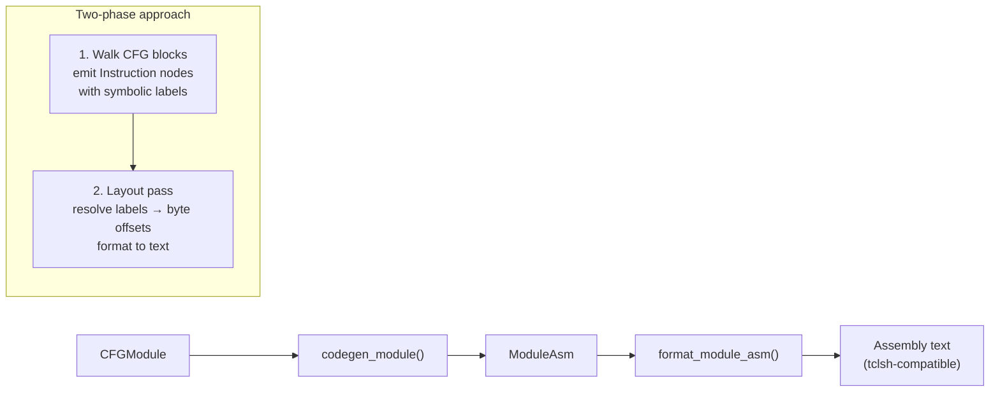

The codegen module produces bytecode assembly that can be compared against
reference output from `tclsh` 8.5, 8.6, and 9.0, enabling bytecode identity
testing to verify that the compiler's output matches the canonical C Tcl
implementation.

### 14. Async Diagnostic Scheduler

**File:** `lsp/async_diagnostics.py` — class `DiagnosticScheduler`

Tiered publishing and cancellation rules are maintained in:

- [kcs-async-diagnostics-tiering.md](kcs/compiler/kcs-async-diagnostics-tiering.md)

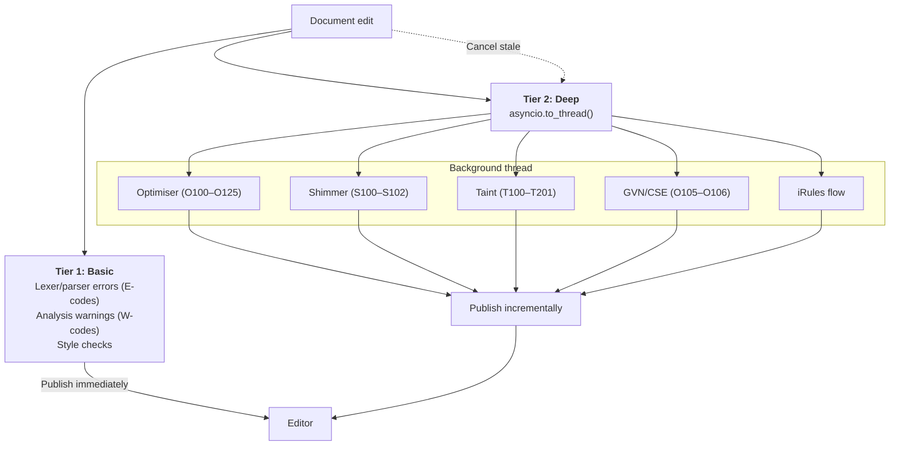

## Expression sub-pipeline

Tcl `expr` bodies are parsed into a separate AST, used by SCCP, type
inference, the optimiser, and shimmer detection.

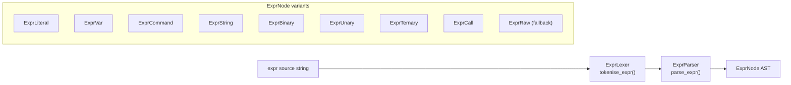

`ExprRaw` is a fallback for expressions the parser cannot handle — every
consumer must treat it as opaque and conservative.

## Diagnostic code taxonomy

| Range | Category | Source |
|-------|----------|--------|
| E001–E003 | Arity/subcommand errors | Analyser |
| E1xx–E2xx | Syntax errors | Lexer / Recovery |
| H300 | Paste-error hints | Analyser |
| W001–W002 | Command warnings | Analyser |
| W100–W120 | Semantic & style warnings | Analyser / Diagnostics |
| W200–W214 | Variable & versioning warnings | Analyser |
| W300–W313 | Security warnings | Analyser |
| O100–O125 | Optimisation suggestions | Optimiser + GVN |
| S100–S102 | Shimmer / type thunking | Shimmer detection |
| T100–T106 | Taint / security | Taint analysis |
| T200–T201 | Collect/release pairing | Taint analysis |
| IRULE1xxx–5xxx | iRules-specific | iRules flow + taint |

## Key source files

| File | Responsibility |
|------|---------------|
| `core/parsing/lexer.py` | Tokenisation with position tracking |
| `core/parsing/tokens.py` | Token, SourcePosition, TokenType definitions |
| `core/parsing/command_segmenter.py` | Command segmentation and chunking |
| `core/parsing/recovery.py` | Virtual token injection for unclosed delimiters |
| `core/parsing/expr_lexer.py` | Expression tokenisation |
| `core/parsing/expr_parser.py` | Expression parsing to ExprNode AST |
| `core/parsing/substitution.py` | Tcl backslash substitution helpers |
| `core/analysis/analyser.py` | Semantic analysis, scope tracking |
| `core/analysis/checks/` | Best-practice and security checks (W-series) |
| `core/analysis/irules_checks.py` | iRules-specific checks (IRULE-series) |
| `core/analysis/semantic_model.py` | AnalysisResult, Diagnostic, Scope, ProcDef |
| `core/compiler/ir.py` | IR node definitions |
| `core/compiler/lowering.py` | IR construction from token stream |
| `core/compiler/cfg.py` | Control flow graph construction |
| `core/compiler/ssa.py` | SSA form construction |
| `core/compiler/core_analyses.py` | SCCP, liveness, type inference |
| `core/compiler/compilation_unit.py` | Pipeline orchestration and caching |
| `core/compiler/interprocedural.py` | Call graph and procedure summaries |
| `core/compiler/optimiser/` | Optimisation passes (O100–O125) |
| `core/compiler/gvn.py` | Global value numbering / CSE / PRE / LICM (O105–O106) |
| `core/compiler/taint/` | Taint analysis for untrusted I/O (T100–T201) |
| `core/compiler/shimmer.py` | Type representation issue detection (S100–S102) |
| `core/compiler/irules_flow.py` | iRules control-flow checks |
| `core/compiler/codegen.py` | Tcl VM bytecode assembly backend |
| `core/compiler/effects.py` | Command side-effect classification |
| `core/compiler/types.py` | Type lattice definitions |
| `lsp/async_diagnostics.py` | Background diagnostic scheduler (tiered publishing) |
| `lsp/features/diagnostics.py` | LSP diagnostic aggregation |
| `core/analysis/semantic_graph.py` | Call/symbol/data-flow graph queries |
