# Compiler Architecture

The tcl-lsp compiler is a multi-pass analysis pipeline that transforms Tcl
source text into progressively richer intermediate representations, culminating
in SSA-based dataflow analyses, optimisation suggestions, security diagnostics,
and bytecode assembly.  The primary outputs are fed back to the LSP server as
diagnostics, code actions, and editor hints.  The bytecode backend also
produces Tcl-compatible assembly for identity testing against reference
`tclsh` implementations.

## KCS quick map

For targeted maintenance tasks, prefer these focused KCS notes before editing this file:

- [compiler design index](compiler/README.md)

- [compiler-pipeline-overview.md](compiler/compiler-pipeline-overview.md)
- [lowering-contracts.md](compiler/lowering-contracts.md)
- [cfg-ssa-fact-model.md](compiler/cfg-ssa-fact-model.md)
- [diagnostics-integration.md](compiler/diagnostics-integration.md)
- [compilation-unit-contracts.md](compiler/compilation-unit-contracts.md)
- [downstream-pass-contracts.md](compiler/downstream-pass-contracts.md)
- [async-diagnostics-tiering.md](compiler/async-diagnostics-tiering.md)
- [bytecode-boundary.md](compiler/bytecode-boundary.md)
- [kcs-howto-add-compiler-pass.md](../kcs/kcs-howto-add-compiler-pass.md)

## Pipeline overview

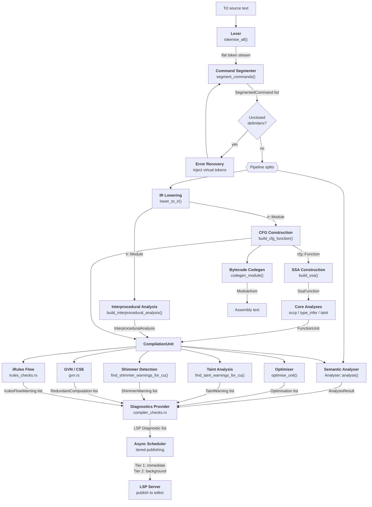

## Stage details

### 1. Lexer

**File:** `rust/tcl-lexer/src/lexer.rs` — `Lexer::tokenise_all()`

Converts raw source text into a flat stream of `Token` values.  A token is
a `TokenType` plus a byte `Span`; the text and line/column position are
resolved on demand through a `SourceMap`, so the token stream itself stays
allocation-free.  `content_offset` records how many leading bytes of the span
are opening delimiters (`$`, `${`, `[`, `{`, `"`), which lets
`SourceMap::token_text` strip them without a second range: `0` for bare
`Esc` / `Sep` / `Eol` / `Comment` tokens whose span *is* the content, `1` for
most wrappers, `2` for `${…}`.  `in_quote` records whether the token was
emitted inside a quoted-string context.

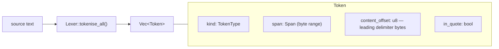

Token types:

| Type | Meaning | Example |
|------|---------|---------|
| `Str` | Braced string | `{hello world}` |
| `Var` | Variable reference | `$name`, `${arr(idx)}` |
| `Cmd` | Command substitution | `[clock seconds]` |
| `Esc` | String / word fragment | `hello` |
| `Sep` | Whitespace separator | spaces, tabs |
| `Eol` | Command terminator | newline, `;` |
| `Eof` | End-of-input sentinel | — |
| `Comment` | Comment text | `# ...` |
| `Expand` | Argument-expansion prefix (8.5+) | `{*}` |

The lexer handles Tcl-specific constructs: nested command substitutions,
`$var`, `${name}`, `$arr(idx)`, namespace separators `::`, backslash
escapes, and brace nesting.  Base-offset parameters allow the same lexer to
be re-entered for nested bodies (brace/bracket contents).

### 2. Command Segmenter

**File:** `rust/tcl-compiler/src/segmenter.rs` — `segment_commands()`

Tcl has no traditional grammar — a "program" is a sequence of commands, each
being a list of whitespace-separated words terminated by a newline or
semicolon.  The segmenter groups the flat token stream into per-command
structures.

Internally `segment_commands()` no longer runs a bespoke token loop: it builds
the canonical lossless [red-green concrete syntax tree](compiler/syntax-tree.md)
for the region and *derives* the `SegmentedCommand` list from it,
byte-identically to the former loop (verified over the real-world corpus and
120k randomised differential cases).  The tree is the single representation the
formatter, minifier, AOT lowering, and per-command tooling are migrating onto.

```mermaid
flowchart LR
    TOKS["Token stream"] --> SEGR["segment_commands()"]
    SEGR --> CMDS["list of SegmentedCommand"]

    subgraph SegmentedCommand
        direction TB
        SP["span: Span"]
        AV["argv: Vec&lt;Token&gt;"]
        TX["texts: Vec&lt;String&gt;"]
        WF["word_fragments: Vec&lt;Vec&lt;WordFragment&gt;&gt;"]
        ST["single_token_word: Vec&lt;bool&gt;"]
        AT["all_tokens: Vec&lt;Token&gt;"]
        IP["is_partial: bool"]
        PD["partial_delimiter: Option&lt;UnclosedDelimiter&gt;"]
        EW["expand_word: Option&lt;Vec&lt;bool&gt;&gt;"]
        PC["preceding_comment: Option&lt;String&gt;"]
    end

    CMDS --- SegmentedCommand
```

Multi-token words (adjacent tokens with no separator, e.g. `$prefix.txt`) are
concatenated into a single `texts` entry.  The `single_token_word` flags
record which words are atomic — important for downstream constant tracking.
`word_fragments` is the lossless companion to the `argv` / `texts` parallel
arrays: it keeps every word's lexical fragments in substitution order, and
is what a new semantic IR consumer should read.  `partial_delimiter` names
which delimiter was left unclosed on an `is_partial` command — it is set by
the recovery segmenter and selects the precise E200 message.
`preceding_comment` carries the comment block immediately above the command,
which is what populates `ProcDef::doc` / `ClassDef::doc`.

### 3. Error Recovery

**File:** `rust/tcl-compiler/src/segmenter.rs` — `segment_with_recovery()`

When the segmenter encounters an unclosed delimiter (`{`, `[`, `"`), recovery
kicks in:

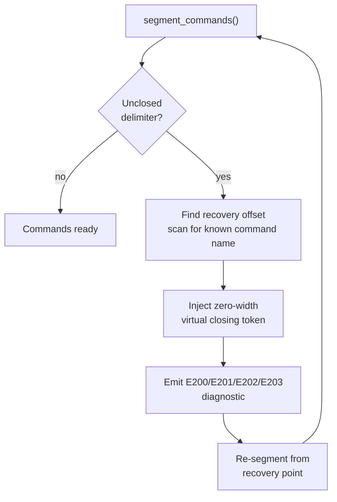

Virtual tokens are zero-width characters inserted at the detected problem
site.  This preserves all position mapping — no source rewriting occurs.
Recovery diagnostics use E-series codes (E200 = generic unclosed, E201 =
unterminated `[`, E202 = unterminated `"`, E203 = unterminated `{`).

### 4. Semantic Analyser

**Module:** `rust/tcl-compiler/src/analyser/` — `Analyser` (state in
`state.rs`, dispatch in `dispatch.rs`, per-command handlers in
`handlers.rs` and `commands.rs`)

A single-pass walk over segmented commands that builds a semantic model:
scopes, procedure definitions, variable definitions, command invocations.
Dispatch is registry-driven — a command's `CommandSpec` selects the
handler — rather than a chain of name comparisons.

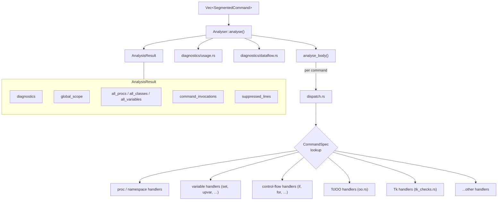

The analyser also receives the `CompilationUnit` (when available) to emit
CFG/SSA-informed diagnostics such as unreachable-code and dead-store warnings.

### 5. IR Lowering

**File:** `rust/tcl-compiler/src/lowering/mod.rs` — `lower_to_ir()`

Converts segmented commands into a structured Intermediate Representation.
Each Tcl command maps to a typed IR node.

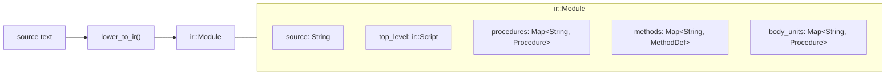

`ir::Module` keeps three separate body maps rather than one.  `procedures`
holds real named `proc`s — the only map codegen emits.  `methods` holds
`TclOO` method bodies keyed `class::method`.  `body_units` holds *synthetic*
frames that run a script argument but are not callable procedures (`apply`
lambdas, `namespace eval` bodies) under synthetic qualified names such as
`::apply#0`; they exist purely so CFG → SSA → SCCP → taint reaches inside the
body, and at runtime each still executes through its own
`Statement::Barrier`, so bytecode is unaffected by whether one was recorded.
`lambda_body_units` names the subset of `body_units` that are closed lambda
frames, which is the only subset read-before-set (`W210`) runs over.

#### IR node hierarchy

`ir::Statement` is a single Rust enum, not a class hierarchy — each construct
below is one variant with its own named fields.  Every variant carries a
`Span` (byte range into `Module::source`), and several also carry a
`*_base: Option<u32>` absolute offset so expression-AST leaf positions can be
mapped back to absolute operand spans.

```mermaid
classDiagram
    class Statement {
        <<enum>>
    }
    class AssignConst {
        +Span span
        +String name
        +bool name_braced
        +String value
        +Option~Span~ value_span
    }
    class AssignExpr {
        +Span span
        +String name
        +bool name_braced
        +ExprNode expr
        +Option~u32~ expr_base
    }
    class AssignValue {
        +Span span
        +String name
        +bool name_braced
        +String value
        +bool value_needs_backsubst
        +Option~CommandTokens~ tokens
    }
    class Incr {
        +Span span
        +String name
        +Option~String~ amount
        +bool safe_on_uninit
    }
    class ExprEval {
        +Span span
        +ExprNode expr
        +Option~u32~ expr_base
    }
    class Call {
        +Span span
        +String command
        +Option~String~ canonical_command
        +Vec~String~ args
        +Vec~String~ defs
        +Vec~String~ reads
        +bool reads_own_defs
    }
    class Return
    class Barrier
    class Block
    class UpFrame
    class If {
        +Vec~IfClause~ clauses
        +Option~Script~ else_body
    }
    class For {
        +Script init
        +ExprNode condition
        +Script next
        +Script body
    }
    class While
    class Foreach {
        +Vec~ForeachIterator~ iterators
        +Script body
    }
    class Catch
    class Try {
        +Script body
        +Vec~TryHandler~ handlers
        +Option~Script~ finally_body
    }
    class Switch {
        +Vec~SwitchArm~ arms
        +SwitchMode mode
    }
    class Script {
        +Vec~Statement~ statements
    }

    Statement <|-- AssignConst
    Statement <|-- AssignExpr
    Statement <|-- AssignValue
    Statement <|-- Incr
    Statement <|-- ExprEval
    Statement <|-- Call
    Statement <|-- Return
    Statement <|-- Barrier
    Statement <|-- Block
    Statement <|-- UpFrame
    Statement <|-- If
    Statement <|-- For
    Statement <|-- While
    Statement <|-- Foreach
    Statement <|-- Catch
    Statement <|-- Try
    Statement <|-- Switch
    Script --* Statement
```

Key design decisions:
- **Barriers** (`Statement::Barrier`) mark commands like `eval`, `uplevel`,
  and dynamically-named dispatch that defeat static analysis — no constant
  propagation or dead-store reasoning can cross them.  A command is lowered
  to a `Call` when the lowerer can name what it defines and reads, and to a
  `Barrier` when it cannot.
- **Two variants exist to *escape* the barrier where the body is static.**
  `Statement::Block` splices an inlined body into the enclosing statement
  stream with no new scope — produced by `inline_uplevel` for a passthrough
  callsite, and by const-propagation when an `eval` / `uplevel` body resolves
  to a brace literal.  `Statement::UpFrame` models `uplevel ?level? {body}`
  with a brace-literal body: the body is lowered inline and codegen brackets
  it with `frame_depth_stash` / `frame_depth_restore`, so the frame shift is
  expressed statically instead of through a runtime `Barrier` dispatch.
- **Every variant carries a `Span`** for precise source mapping back to
  diagnostics, and `Call` carries both the source spelling (`command`) and
  the registry-resolved `canonical_command`, so a diagnostic can quote what
  the author wrote while dispatch uses what it resolves to.
- **Expression bodies** are parsed into `ExprNode` AST trees at lowering
  time (via `parse_expr()`), not left as opaque strings.
- **`Statement::Call` records `defs` / `reads` explicitly** — the variables a
  command writes and reads beyond the `$`-references visible in its argument
  text — so SSA does not have to model each command's behaviour itself.

### 6. Control Flow Graph

**File:** `rust/tcl-compiler/src/cfg_builder/mod.rs` — `build_cfg_function()`

Flattens structured IR (`Statement::If`, `Statement::For`,
`Statement::Switch`, etc.) into basic blocks with explicit control-flow
edges.  The per-function graph is `cfg::Function`; the whole-module pair of
top-level script plus procedures is `cfg::CfgModule`.

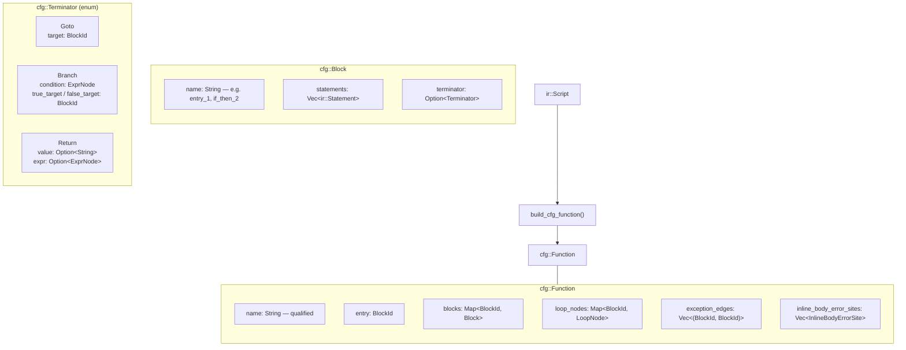

Blocks are keyed by an interned `BlockId`, not by name; `Function::block_name`
resolves an id back to its display name, and `SsaFunction` copies the interner
so an SSA-only consumer can still print block names.

Each basic block is a straight-line sequence of IR statements ending with at
most one terminator — `terminator` is `Option`, and `None` marks an
unreachable or incomplete block rather than an error.  Because a single
successor cannot express a `try` body reaching its handler, those edges are
carried out of band in `Function::exception_edges`; SSA consumes them as
extra phi predecessors so a handler sees the body's versions, and SCCP
consumes them as extra reachability edges so handler bodies are not reported
false-unreachable (O107).

Structured constructs decompose as follows:

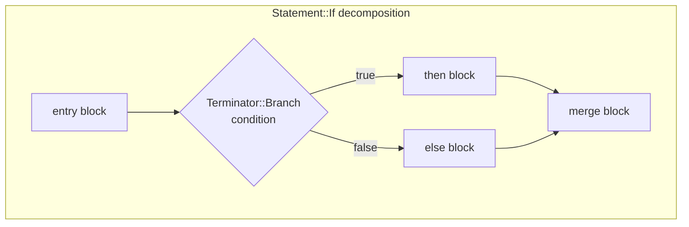

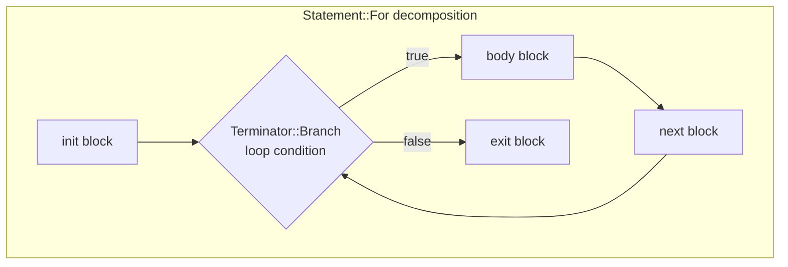

A loop records a `LoopNode` keyed by its **exit** block, holding the header
block id, the `for` statement's span, and the original `Statement::For` — the
last of these is what lets SCCP statically summarise a bounded loop and fold
a branch that reads a loop-carried variable *after* the loop.

### 7. SSA Construction

**File:** `rust/tcl-compiler/src/ssa.rs` — `build_ssa()`

Converts the CFG to Static Single-Assignment form, where every variable is
defined exactly once.  Phi nodes are inserted at control-flow merge points.

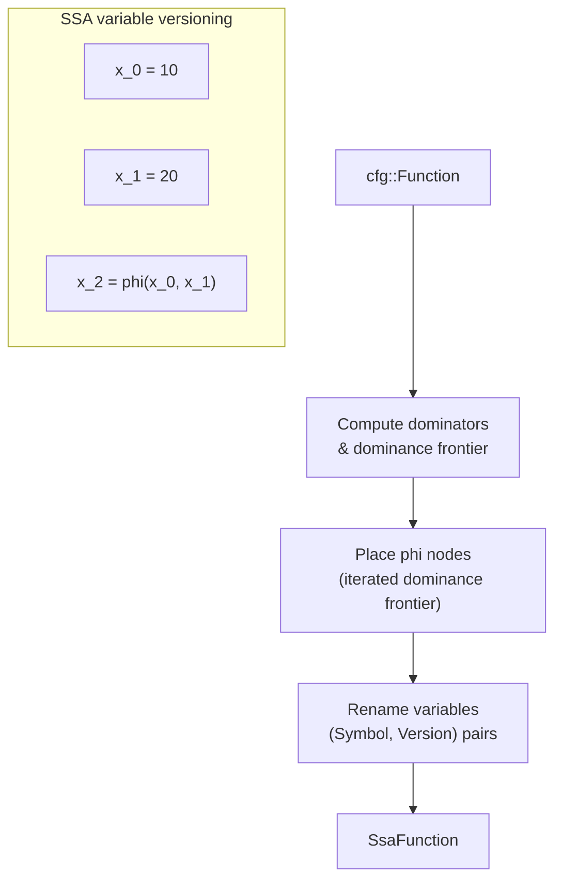

Key types:
- `Version` (`u32`) — version number for each definition
- `Symbol` (`u32` newtype) — a variable name interned per `SsaFunction`, so
  the hot per-statement maps and the SCCP / type / taint lattices key on a
  copyable id instead of hashing and cloning name strings.  Its `Ord` is
  first-seen order during SSA construction — deterministic, but *not*
  lexicographic; resolve to a display name with `SsaFunction::var_name`.
- `ValueKey` — `(Symbol, Version)`, identifying a unique SSA value
- `SsaFunction` — per-block phi nodes (`SsaBlock::phis`), per-block entry and
  exit version maps, the immediate-dominator map, the dominance frontier, and
  the dominator tree, so downstream passes never recompute dominance
- `SsaStatement` — an `ir::Statement` plus its `uses` and `defs` version maps,
  with two refinement sets over them:
  - `may_defs` — the subset of `defs` that are *synthetic* array-element
    writes rather than writes the statement performs itself (the base refresh
    alongside `set arr(k) v`, and the element fan of a dynamic-key write).
    Type inference **joins** across a may-def; write-sensitive passes
    (shimmer oscillation, dead-store) must not count one as a real write.
  - `quoted_uses` — the subset of `uses` classified `UseClass::Quoted`,
    carried only by a brace-quoted word this statement does not substitute.
    The use is real for liveness (the text may be evaluated later) but is not
    a read *here*, so read-before-set (`W210`) must ignore it while
    liveness / dead-store (`W211`, `W220`) must not.  Filtering at either end
    breaks the other — see issues #1142 and #1237.

### 8. Core Analyses

**Modules:** `rust/tcl-compiler/src/sccp.rs`, `type_infer.rs`, `taint.rs`, `dead_stores.rs` — lattice and fact types in `analyses.rs`, carried per function by `FunctionUnit` (`compilation_unit.rs`)

Runs the main dataflow passes over the SSA graph:

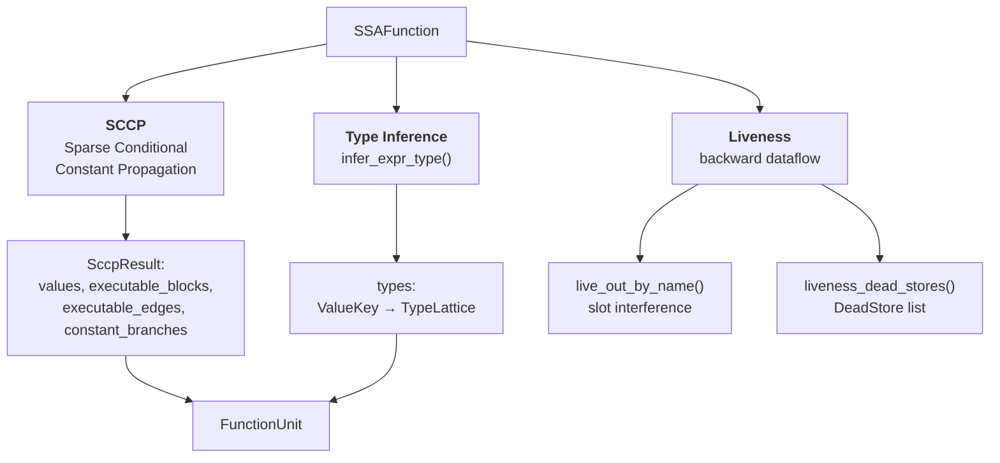

SCCP and type inference land on the per-function `FunctionUnit` that
`CompilationUnit::build_for()` builds; liveness has no stored home and is
recomputed by the two consumers that need it.  `FunctionAnalysis` in
`analyses.rs` names the same facts as one aggregate, but nothing builds,
returns, or reads one — its only construction is `::default()` inside that
module's own tests.  Issue #1406 tracks the gap.

#### SCCP lattice

SCCP uses a four-point lattice per SSA value (`LatticeValue` in
`analyses.rs`, joined by `sccp::join()`).  Values flow monotonically upward
and never narrow:

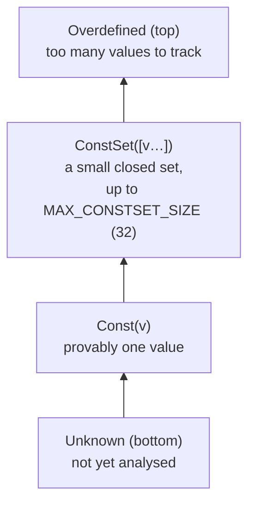

`ConstSet` is the union of two or more distinct `Const`s — the shape a phi at
a merge of `if` / `switch` arms produces.  It stays a set only while the union
has at most `MAX_CONSTSET_SIZE` (32) members; a wider union widens to
`Overdefined`.  A union that collapses back to one member becomes `Const`
again, which is a narrowing of *representation*, not of the value set, so
monotonicity holds.

Branch conditions are evaluated against the lattice.  If a branch condition
is `Const`, only the taken edge is added to `SccpResult::executable_edges` —
the other side stays out of `executable_blocks`, which is what drives
unreachable-code detection.

### 9. Interprocedural Analysis

**File:** `rust/tcl-compiler/src/interprocedural.rs` — `build_interprocedural_analysis()`

Builds conservative procedure summaries across the entire module:

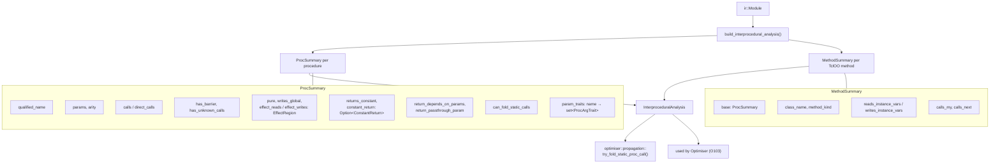

Summaries describe:
- **Side-effect / purity** — `pure` and `writes_global` as booleans, plus the
  finer-grained `effect_reads` / `effect_writes` regions
- **Constant return** — whether a proc always returns the same value, and
  what that value is
- **Parameter sensitivity** — `return_depends_on_params` names the parameters
  that affect the return value, and `return_passthrough_param` the single
  parameter returned verbatim, if any
- **Call graph edges** — `calls` (transitive-ready) and `direct_calls`
- **Opacity** — `has_barrier` and `has_unknown_calls`, the two reasons a
  summary must be read as conservative rather than complete
- **Argument traits** — `param_traits`, the per-parameter `ProcArgTrait` sets
  that [proc-arg-traits.md](contracts/proc-arg-traits.md) specifies

`InterproceduralAnalysis` holds `procedures` and `methods` side by side; a
`MethodSummary` embeds a whole `ProcSummary` as `base` and adds the `TclOO`
facts (owning class, method kind, instance-variable reads and writes, and
whether the body dispatches through `my` or `next`).

The optimiser uses these summaries for O103 (fold static procedure calls)
and the taint analysis uses them for cross-procedure taint propagation.

### 10. Compilation Unit

**File:** `rust/tcl-compiler/src/compilation_unit.rs` — `CompilationUnit::build_for()`

`CompilationUnit` remains the shared artefact boundary for IR/CFG/SSA/interprocedural
facts consumed across diagnostics and downstream passes. For operational contracts,
cache semantics, and regression anchors, use:

- [compilation-unit-contracts.md](compiler/compilation-unit-contracts.md)

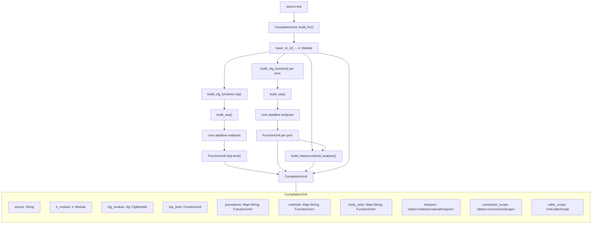

The three body maps of `ir::Module` are mirrored one-for-one as
`FunctionUnit` maps, so a `TclOO` method body and an `apply` lambda body each
get the same CFG → SSA → SCCP → type → taint treatment a `proc` does.
`interproc` is optional because `build_for` can be asked to defer it, so a
consumer must handle `None` rather than assume summaries are present.
`caller_scope` carries what the *workspace* knows about this unit's callers —
the linkage traits, whether cross-file evidence exists, the call-site
evidence, and per-proc constant arguments — which is how a single-file
compilation unit participates in cross-file reasoning.

### 11. Downstream Analysis Passes

All downstream passes consume the `CompilationUnit` and produce typed warnings
converted by the diagnostics provider. Contract details, ownership guidance,
and pass/test anchors are tracked in:

- [downstream-pass-contracts.md](compiler/downstream-pass-contracts.md)
- [kcs-howto-add-compiler-pass.md](../kcs/kcs-howto-add-compiler-pass.md)

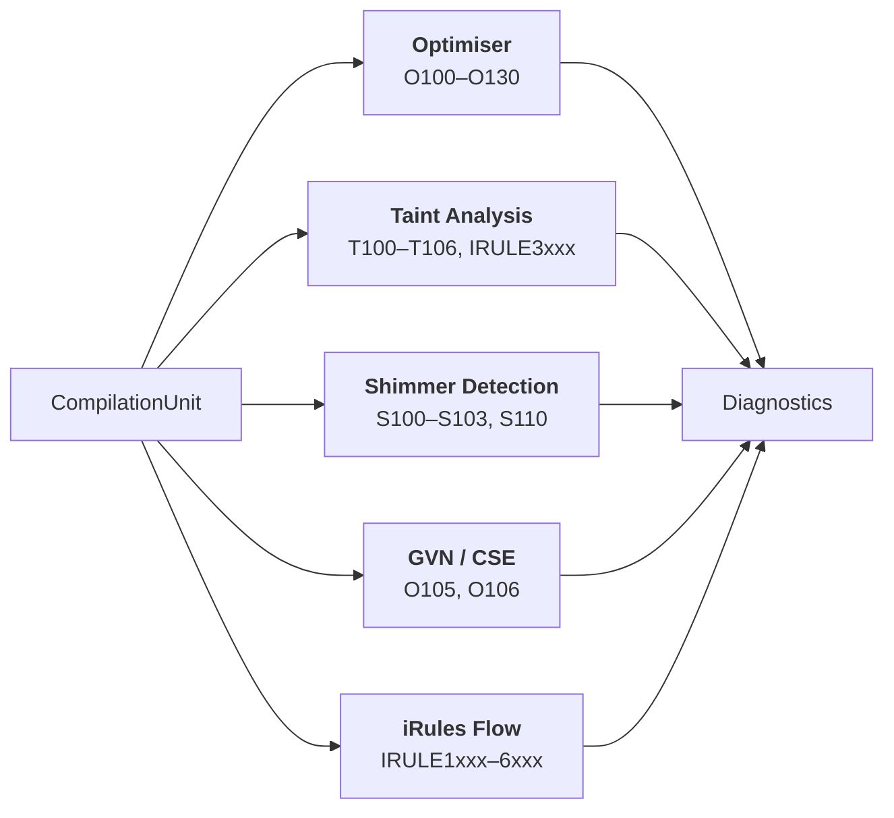

### 12. Diagnostics Provider

**Modules:** `rust/tcl-compiler/src/analyser/diagnostics/` (per-family emitters) and `compiler_checks.rs` (the downstream-pass aggregation)

The aggregation layer is the policy boundary that merges analyser and pass
findings, applies suppression / disable rules, and converts to LSP
diagnostics. Integration contracts live in:

- [diagnostics-integration.md](compiler/diagnostics-integration.md)
- [async-diagnostics-tiering.md](compiler/async-diagnostics-tiering.md)

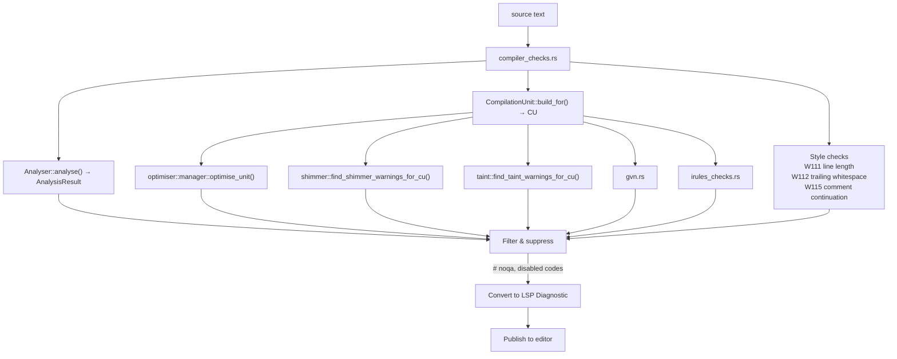

### 13. Bytecode Assembly Backend

**File:** `rust/tcl-compiler/src/codegen/emitter/mod.rs` — `codegen_function()`, `codegen_module()`

Takes a pre-SSA `cfg::CfgModule` and emits assembly text matching the format
produced by `tcl::unsupported::disassemble` in Tcl 9.0.2.

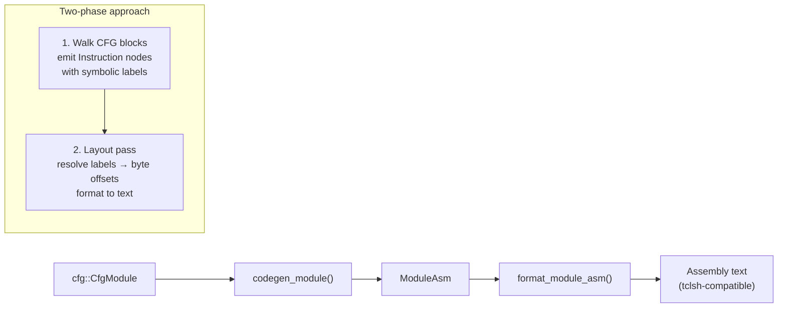

The codegen module produces bytecode assembly that can be compared against
reference output from `tclsh` 8.5, 8.6, and 9.0, enabling bytecode identity
testing to verify that the compiler's output matches the canonical C Tcl
implementation.

### 14. Async Diagnostic Scheduler

**File:** `rust/tcl-lsp-server/src/lib.rs` — the tiered diagnostic scheduler

Tiered publishing and cancellation rules are maintained in:

- [async-diagnostics-tiering.md](compiler/async-diagnostics-tiering.md)

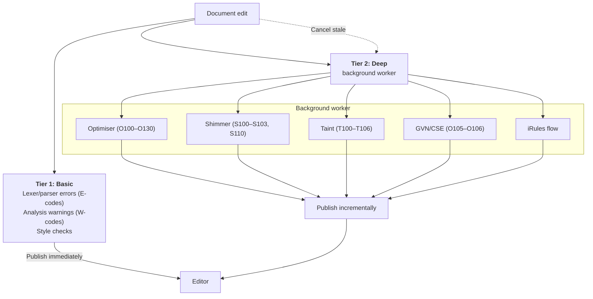

## Expression sub-pipeline

Tcl `expr` bodies are parsed into a separate AST, used by SCCP, type
inference, the optimiser, and shimmer detection.

Both stages are free functions, not types: `tcl_lexer::expr_lexer::
tokenise_expr()` and `tcl_syntax::expr::parser::parse_expr()`.  Each takes an
optional dialect name, because a dialect can widen the operator and function
surface an expression accepts.

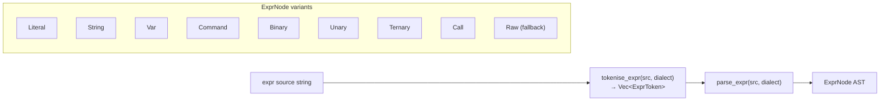

`ExprNode::Raw` is a fallback for expressions the parser cannot handle —
every consumer must treat it as opaque and conservative.

## Diagnostic code taxonomy

Every code is declared exactly once, in the `diagnostic_codes!` table in
`rust/tcl-core-types/src/diag_code.rs`.  Two orthogonal groupings hang off
that table and are easy to confuse:

- **`DiagFamily`** is derived mechanically from the letter prefix
  (`DiagCode::family()`), with two special cases: `IRULE####` is `IRule`, and
  `TK###` is `Warning` rather than `Taint` despite the shared `T`.
- **`DiagSection`** is the finer documentation grouping, declared explicitly
  as the first argument of each row.  `W###` codes deliberately spread across
  several sections — `W101`–`W103` and `W300`–`W313` sit in `Security`,
  `W130`–`W134` in `Tclpkg`, `W123` and `W242` in `Hint` — so a code's
  section cannot be inferred from its number.

Two per-row flags qualify a code's status.  `diag_internal(…)` marks a code
as *internal*: always active and never offered as a user-configurable toggle
(parse and structure errors, host-config validators).  `diag_reserved(…)`
marks a code as *reserved*: a real, documented identity that no analyser or
compiler-checks path emits yet.  Both are excluded from the generated
editor-settings catalogue and both stay in `DiagCode::ALL` and the published
tables.

| Range | Section | Source |
|-------|---------|--------|
| E001–E006 | Arity / subcommand / definition errors | Analyser |
| E100–E103 | Lexical errors | Lexer |
| E200–E207 | Unterminated-construct errors | Segmenter / Recovery |
| H300, I230–I231 | Paste-error and constant-branch hints | Analyser / SCCP |
| W001–W004 | Command warnings | Analyser |
| W100–W147 | Semantic & style warnings | Analyser / Diagnostics |
| W130–W134 | `tclpkg` manifest warnings — **reserved**, not yet emitted | — |
| W200–W250 | Variable & versioning warnings | Analyser |
| W300–W315 | Security warnings | Analyser |
| O100–O130 | Optimisation suggestions | Optimiser + GVN |
| S100–S103, S110 | Shimmer / type thunking | Shimmer detection |
| T100–T106 | Taint / security | Taint analysis |
| TK1001–TK1003 | Tk widget and geometry checks | Analyser (`tk_checks.rs`) |
| IRULE1xxx | iRules flow and lifecycle | `irules_checks.rs` |
| IRULE2xxx | Deprecated / unsafe iRules commands | Analyser |
| IRULE3xxx | iRules security | Taint analysis |
| IRULE4xxx | iRules variable scope | Analyser (`irules_event_checks.rs`) |
| IRULE5xxx–6xxx | iRules event and command-model checks | Analyser (`irules_event_checks.rs`) |

## Key source files

| File | Responsibility |
|------|---------------|
| `rust/tcl-lexer/src/lexer.rs` | Tokenisation |
| `rust/tcl-lexer/src/tokens.rs` | `Token` / `TokenType` definitions |
| `rust/tcl-lexer/src/span.rs`, `source_map.rs`, `line_index.rs` | Byte spans and offset → line/column resolution |
| `rust/tcl-lexer/src/substitution.rs` | Tcl backslash substitution helpers |
| `rust/tcl-lexer/src/expr_lexer.rs` | Expression tokenisation |
| `rust/tcl-compiler/src/segmenter.rs` | Command segmentation, chunking, and recovery |
| `rust/tcl-compiler/src/parsing/syntax/` | The lossless red-green concrete syntax tree |
| `rust/tcl-syntax/src/expr/` | Expression parsing (`parser.rs`), AST (`ast.rs`), operators, and folding |
| `rust/tcl-compiler/src/analyser/` | Semantic analysis, scope tracking, per-command handlers |
| `rust/tcl-compiler/src/analyser/diagnostics/` | Diagnostic emitters by family — `usage.rs`, `security.rs`, `validity.rs`, `dataflow.rs`, `version_gate.rs`, … |
| `rust/tcl-compiler/src/analyser/diagnostics/fp/` | False-positive suppression rules |
| `rust/tcl-compiler/src/irules_checks.rs` | iRules-specific checks (IRULE series) |
| `rust/tcl-compiler/src/ir.rs` | IR node definitions (`Module`, `Script`) |
| `rust/tcl-compiler/src/lowering/` | IR construction from the token stream |
| `rust/tcl-compiler/src/cfg.rs`, `cfg_builder/` | Control-flow graph construction |
| `rust/tcl-compiler/src/ssa.rs`, `memory_ssa.rs`, `state_ssa.rs` | SSA form construction |
| `rust/tcl-compiler/src/sccp.rs`, `type_infer.rs`, `dead_stores.rs` | SCCP, type inference, dead-store detection |
| `rust/tcl-compiler/src/analyses.rs` | Core analysis fact and lattice types (`LatticeValue`, `DeadStore`, …; the `FunctionAnalysis` aggregate here is declared but not on the live path — issue #1406) |
| `rust/tcl-compiler/src/compilation_unit.rs` | Pipeline orchestration and caching |
| `rust/tcl-compiler/src/interprocedural.rs` | Call graph and procedure summaries |
| `rust/tcl-compiler/src/optimiser/` | Optimisation passes (O100–O130) and the pass manager |
| `rust/tcl-compiler/src/gvn.rs` | Global value numbering / CSE / PRE / LICM (O105–O106) |
| `rust/tcl-compiler/src/taint.rs`, `taint_interproc.rs` | Taint analysis for untrusted I/O (T100–T106) |
| `rust/tcl-compiler/src/shimmer/` | Type-representation issue detection (S100–S103, S110) |
| `rust/tcl-compiler/src/codegen/` | Tcl VM bytecode assembly backend |
| `rust/tcl-compiler/src/side_effects.rs` | Command side-effect classification |
| `rust/tcl-compiler/src/types.rs` | Type lattice definitions |
| `rust/tcl-compiler/src/compiler_checks.rs` | Downstream-pass aggregation into diagnostics |
| `rust/tcl-lsp-server/src/lib.rs` | Tiered diagnostic scheduling and LSP publishing |
| `rust/tcl-lsp-core/src/graphs.rs` | Call / symbol / data-flow graph queries |
