# Compiler Architecture

The tcl-lsp compiler is a multi-pass analysis pipeline that transforms Tcl
source text into progressively richer intermediate representations, culminating
in SSA-based dataflow analyses, optimisation suggestions, security diagnostics,
and bytecode assembly.  The primary outputs are fed back to the LSP server as
diagnostics, code actions, and editor hints.  The bytecode backend also
produces Tcl-compatible assembly for identity testing against reference
`tclsh` implementations.

## KCS quick map

For targeted maintenance tasks, prefer these focused KCS notes before editing this file:

- [compiler design index](compiler/README.md)

- [compiler-pipeline-overview.md](compiler/compiler-pipeline-overview.md)
- [lowering-contracts.md](compiler/lowering-contracts.md)
- [cfg-ssa-fact-model.md](compiler/cfg-ssa-fact-model.md)
- [diagnostics-integration.md](compiler/diagnostics-integration.md)
- [compilation-unit-contracts.md](compiler/compilation-unit-contracts.md)
- [downstream-pass-contracts.md](compiler/downstream-pass-contracts.md)
- [async-diagnostics-tiering.md](compiler/async-diagnostics-tiering.md)
- [bytecode-boundary.md](compiler/bytecode-boundary.md)
- [kcs-howto-add-compiler-pass.md](../kcs/kcs-howto-add-compiler-pass.md)

## Pipeline overview

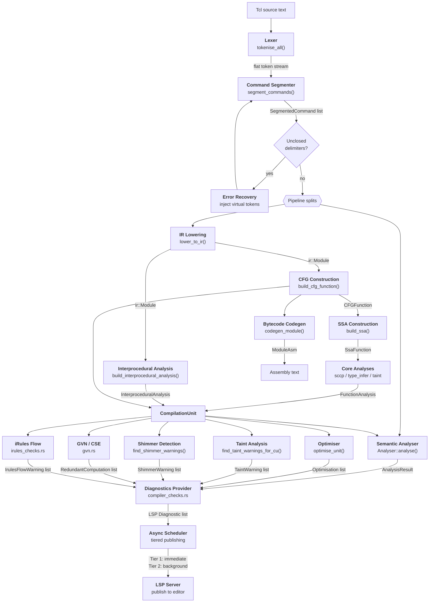

## Stage details

### 1. Lexer

**File:** `rust/tcl-lexer/src/lexer.rs` — `Lexer::tokenise_all()`

Converts raw source text into a flat stream of `Token` values.  A token is
a `TokenType` plus a byte `Span`; the text and line/column position are
resolved on demand through a `SourceMap`, so the token stream itself stays
allocation-free.  `delim_len` records how many leading bytes of the span
are opening delimiters (`$`, `${`, `[`, `{`, `"`), which lets
`SourceMap::token_text` strip them without a second range.

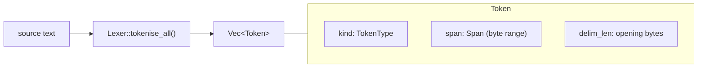

Token types:

| Type | Meaning | Example |
|------|---------|---------|
| `Str` | Braced string | `{hello world}` |
| `Var` | Variable reference | `$name`, `${arr(idx)}` |
| `Cmd` | Command substitution | `[clock seconds]` |
| `Esc` | String / word fragment | `hello` |
| `Sep` | Whitespace separator | spaces, tabs |
| `Eol` | Command terminator | newline, `;` |
| `Eof` | End-of-input sentinel | — |
| `Comment` | Comment text | `# ...` |
| `Expand` | Argument-expansion prefix (8.5+) | `{*}` |

The lexer handles Tcl-specific constructs: nested command substitutions,
`$var`, `${name}`, `$arr(idx)`, namespace separators `::`, backslash
escapes, and brace nesting.  Base-offset parameters allow the same lexer to
be re-entered for nested bodies (brace/bracket contents).

### 2. Command Segmenter

**File:** `rust/tcl-compiler/src/segmenter.rs` — `segment_commands()`

Tcl has no traditional grammar — a "program" is a sequence of commands, each
being a list of whitespace-separated words terminated by a newline or
semicolon.  The segmenter groups the flat token stream into per-command
structures.

Internally `segment_commands()` no longer runs a bespoke token loop: it builds
the canonical lossless [red-green concrete syntax tree](compiler/syntax-tree.md)
for the region and *derives* the `SegmentedCommand` list from it,
byte-identically to the former loop (verified over the real-world corpus and
120k randomised differential cases).  The tree is the single representation the
formatter, minifier, AOT lowering, and per-command tooling are migrating onto.

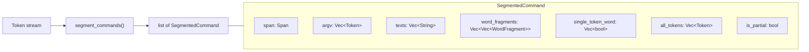

Multi-token words (adjacent tokens with no separator, e.g. `$prefix.txt`) are
concatenated into a single `texts` entry.  The `single_token_word` flags
record which words are atomic — important for downstream constant tracking.
`word_fragments` is the lossless companion to the `argv` / `texts` parallel
arrays: it keeps every word's lexical fragments in substitution order, and
is what a new semantic IR consumer should read.

### 3. Error Recovery

**File:** `rust/tcl-compiler/src/segmenter.rs` — `segment_with_recovery()`

When the segmenter encounters an unclosed delimiter (`{`, `[`, `"`), recovery
kicks in:

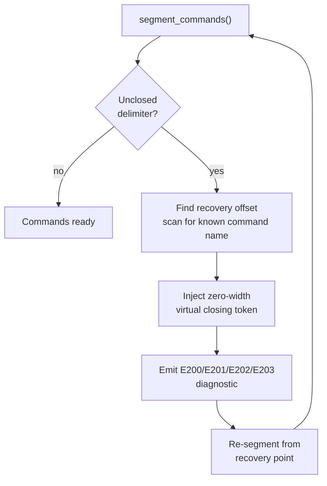

Virtual tokens are zero-width characters inserted at the detected problem
site.  This preserves all position mapping — no source rewriting occurs.
Recovery diagnostics use E-series codes (E200 = generic unclosed, E201 =
unterminated `[`, E202 = unterminated `"`, E203 = unterminated `{`).

### 4. Semantic Analyser

**Module:** `rust/tcl-compiler/src/analyser/` — `Analyser` (state in
`state.rs`, dispatch in `dispatch.rs`, per-command handlers in
`handlers.rs` and `commands.rs`)

A single-pass walk over segmented commands that builds a semantic model:
scopes, procedure definitions, variable definitions, command invocations.
Dispatch is registry-driven — a command's `CommandSpec` selects the
handler — rather than a chain of name comparisons.

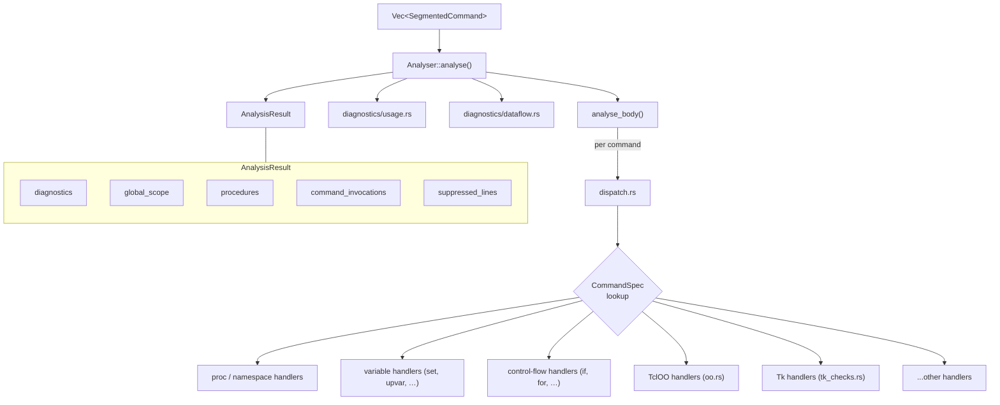

The analyser also receives the `CompilationUnit` (when available) to emit
CFG/SSA-informed diagnostics such as unreachable-code and dead-store warnings.

### 5. IR Lowering

**File:** `rust/tcl-compiler/src/lowering/mod.rs` — `lower_to_ir()`

Converts segmented commands into a structured Intermediate Representation.
Each Tcl command maps to a typed IR node.

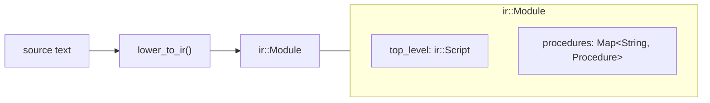

#### IR node hierarchy

```mermaid
classDiagram
    class IRStatement {
        <<union type>>
    }
    class IRAssignConst {
        +Range range
        +str name
        +str value
    }
    class IRAssignExpr {
        +Range range
        +str name
        +ExprNode expr
    }
    class IRAssignValue {
        +Range range
        +str name
        +str value
    }
    class IRIncr {
        +Range range
        +str name
        +str|None amount
    }
    class IRCall {
        +Range range
        +str command
        +tuple args
        +tuple defs
        +bool reads_own_defs
    }
    class IRReturn {
        +Range range
        +str|None value
    }
    class IRBarrier {
        +Range range
        +str reason
        +str command
    }
    class IRIf {
        +Range range
        +tuple~IRIfClause~ clauses
        +ir::Script|None else_body
    }
    class IRFor {
        +Range range
        +ir::Script init
        +ExprNode condition
        +ir::Script next
        +ir::Script body
    }
    class IRWhile {
        +Range range
        +ExprNode condition
        +ir::Script body
    }
    class IRForeach {
        +Range range
        +tuple iterators
        +ir::Script body
    }
    class IRCatch {
        +Range range
        +ir::Script body
        +str|None result_var
    }
    class IRTry {
        +Range range
        +ir::Script body
        +tuple~IRTryHandler~ handlers
        +ir::Script|None finally_body
    }
    class IRSwitch {
        +Range range
        +str subject
        +tuple~IRSwitchArm~ arms
    }
    class ir::Script {
        +tuple~IRStatement~ statements
    }
    class ir::Module {
        +ir::Script top_level
        +dict procedures
    }

    IRStatement <|-- IRAssignConst
    IRStatement <|-- IRAssignExpr
    IRStatement <|-- IRAssignValue
    IRStatement <|-- IRIncr
    IRStatement <|-- IRCall
    IRStatement <|-- IRReturn
    IRStatement <|-- IRBarrier
    IRStatement <|-- IRIf
    IRStatement <|-- IRFor
    IRStatement <|-- IRWhile
    IRStatement <|-- IRForeach
    IRStatement <|-- IRCatch
    IRStatement <|-- IRTry
    IRStatement <|-- IRSwitch
    ir::Script --* IRStatement
    ir::Module --* ir::Script
```

Key design decisions:
- **Barriers** (`IRBarrier`) mark commands like `eval`, `uplevel`, `upvar`
  that defeat static analysis — no constant propagation or dead-store
  reasoning can cross them.
- **Every node carries a `Range`** for precise source mapping back to
  diagnostics.
- **Expression bodies** are parsed into `ExprNode` AST trees at lowering
  time (via `parse_expr()`), not left as opaque strings.

### 6. Control Flow Graph

**File:** `rust/tcl-compiler/src/cfg_builder/mod.rs` — `build_cfg_function()`

Flattens structured IR (`IRIf`, `IRFor`, `IRSwitch`, etc.) into basic blocks
with explicit control-flow edges.

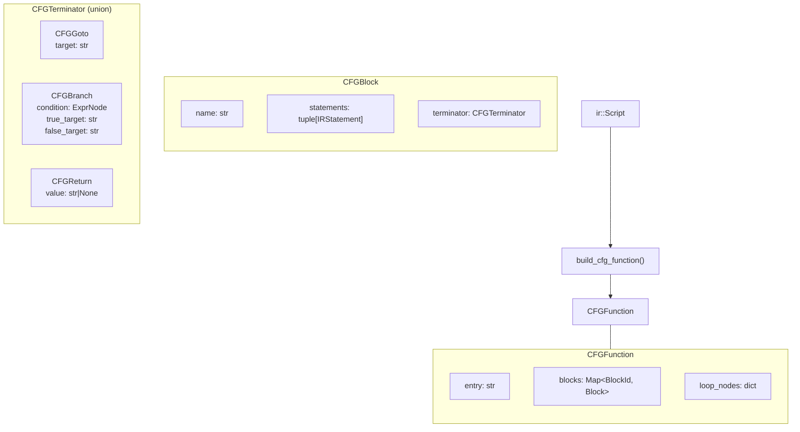

Each basic block is a straight-line sequence of IR statements ending with
exactly one terminator.  Structured constructs decompose as follows:

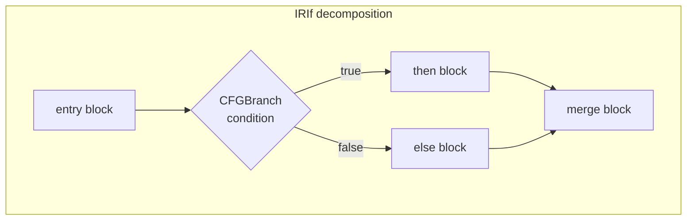

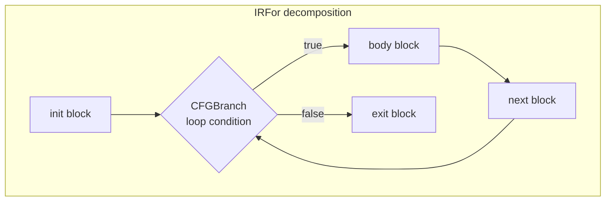

### 7. SSA Construction

**File:** `rust/tcl-compiler/src/ssa.rs` — `build_ssa()`

Converts the CFG to Static Single-Assignment form, where every variable is
defined exactly once.  Phi nodes are inserted at control-flow merge points.

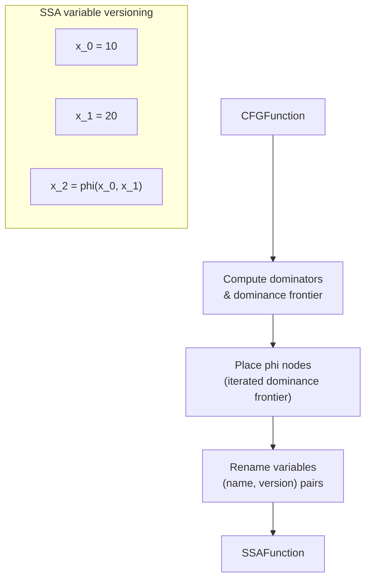

Key types:
- `SSAVersion` (int) — version number for each definition
- `SSAValueKey` — `tuple[str, SSAVersion]` identifying a unique SSA value
- `SSAFunction` — contains per-block phi nodes, variable version maps,
  and dominance information

### 8. Core Analyses

**Modules:** `rust/tcl-compiler/src/sccp.rs`, `type_infer.rs`, `taint.rs`, `dead_stores.rs` — result types in `analyses.rs` (`FunctionAnalysis`)

Runs the main dataflow passes over the SSA graph:

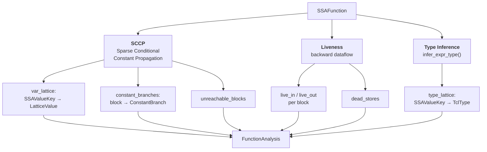

#### SCCP lattice

SCCP uses a three-point lattice per SSA value.  Values flow monotonically
upward and never narrow:

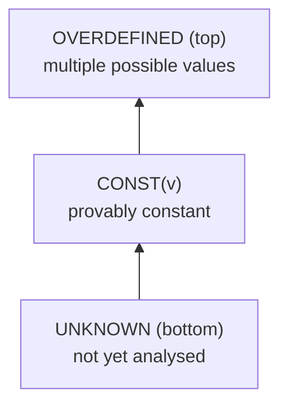

Branch conditions are evaluated against the lattice.  If a branch condition
is `CONST`, only the taken edge is explored — the other side is marked
unreachable, enabling dead-code detection.

### 9. Interprocedural Analysis

**File:** `rust/tcl-compiler/src/interprocedural.rs` — `build_interprocedural_analysis()`

Builds conservative procedure summaries across the entire module:

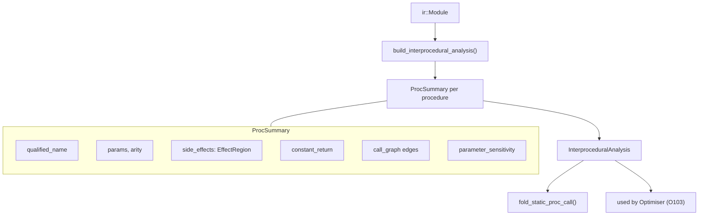

Summaries describe:
- **Side-effect / purity** — whether a proc is pure (no I/O, no globals)
- **Constant return** — whether a proc always returns the same value
- **Parameter sensitivity** — which parameters affect the return value
- **Call graph edges** — for transitive analysis

The optimiser uses these summaries for O103 (fold static procedure calls)
and the taint analysis uses them for cross-procedure taint propagation.

### 10. Compilation Unit

**File:** `rust/tcl-compiler/src/compilation_unit.rs` — `CompilationUnit::build_for()`

`CompilationUnit` remains the shared artefact boundary for IR/CFG/SSA/interprocedural
facts consumed across diagnostics and downstream passes. For operational contracts,
cache semantics, and regression anchors, use:

- [compilation-unit-contracts.md](compiler/compilation-unit-contracts.md)

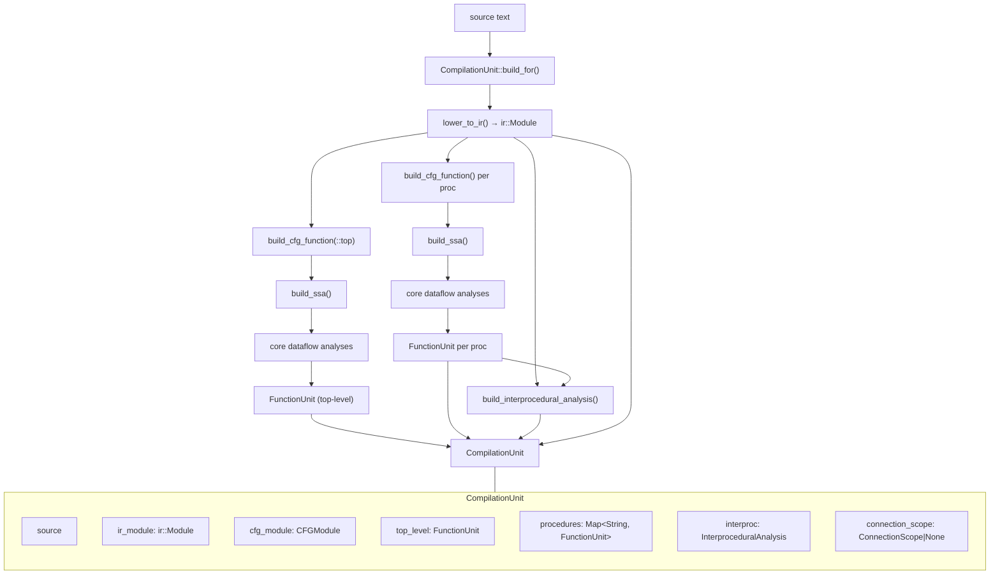

### 11. Downstream Analysis Passes

All downstream passes consume the `CompilationUnit` and produce typed warnings
converted by the diagnostics provider. Contract details, ownership guidance,
and pass/test anchors are tracked in:

- [downstream-pass-contracts.md](compiler/downstream-pass-contracts.md)
- [kcs-howto-add-compiler-pass.md](../kcs/kcs-howto-add-compiler-pass.md)

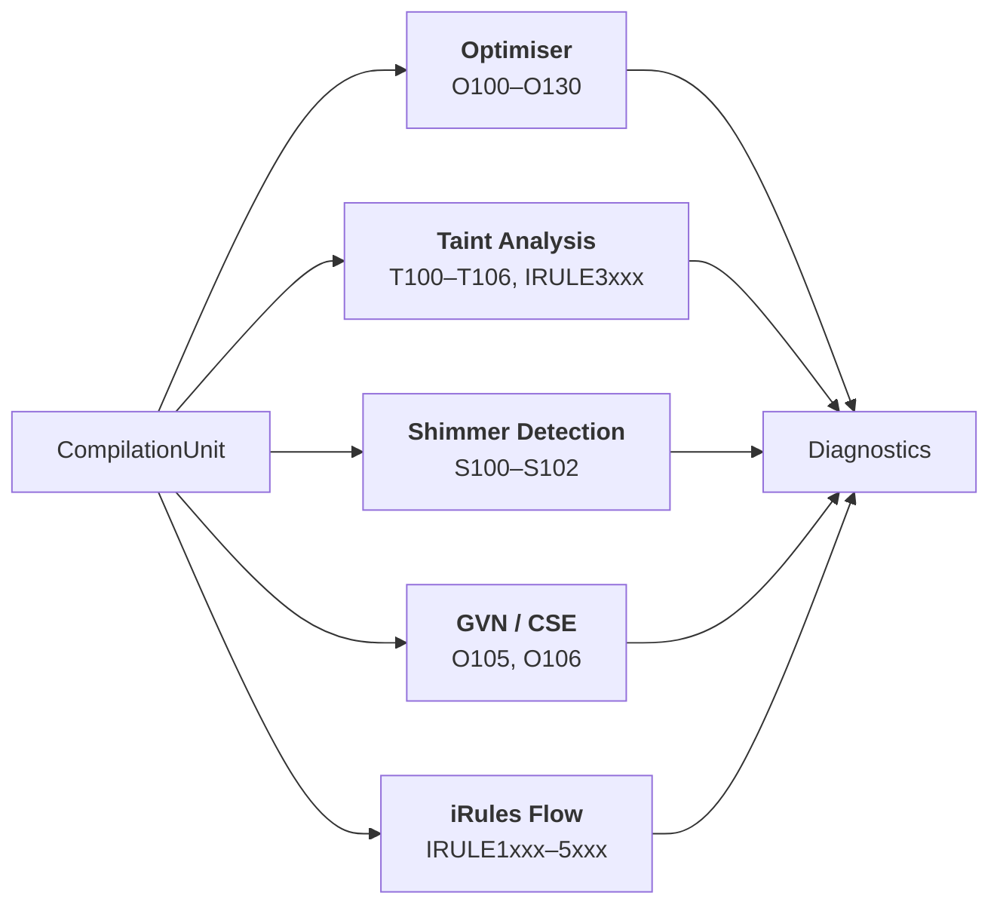

### 12. Diagnostics Provider

**Modules:** `rust/tcl-compiler/src/analyser/diagnostics/` (per-family emitters) and `compiler_checks.rs` (the downstream-pass aggregation)

The aggregation layer is the policy boundary that merges analyser and pass
findings, applies suppression / disable rules, and converts to LSP
diagnostics. Integration contracts live in:

- [diagnostics-integration.md](compiler/diagnostics-integration.md)
- [async-diagnostics-tiering.md](compiler/async-diagnostics-tiering.md)

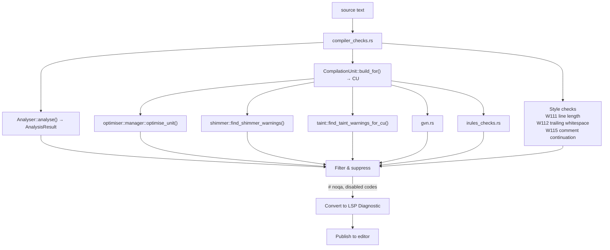

### 13. Bytecode Assembly Backend

**File:** `rust/tcl-compiler/src/codegen/emitter/mod.rs` — `codegen_function()`, `codegen_module()`

Takes a pre-SSA `CFGModule` and emits assembly text matching the format
produced by `tcl::unsupported::disassemble` in Tcl 9.0.2.

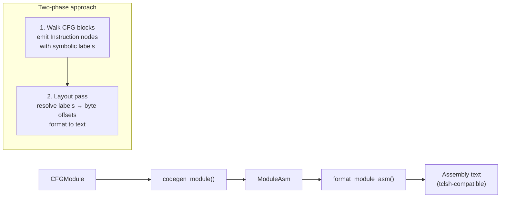

The codegen module produces bytecode assembly that can be compared against
reference output from `tclsh` 8.5, 8.6, and 9.0, enabling bytecode identity
testing to verify that the compiler's output matches the canonical C Tcl
implementation.

### 14. Async Diagnostic Scheduler

**File:** `rust/tcl-lsp-server/src/lib.rs` — the tiered diagnostic scheduler

Tiered publishing and cancellation rules are maintained in:

- [async-diagnostics-tiering.md](compiler/async-diagnostics-tiering.md)

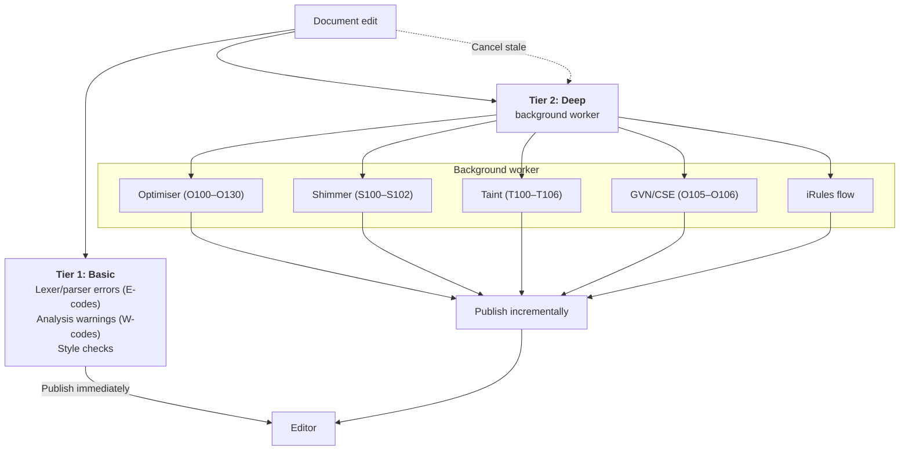

## Expression sub-pipeline

Tcl `expr` bodies are parsed into a separate AST, used by SCCP, type
inference, the optimiser, and shimmer detection.

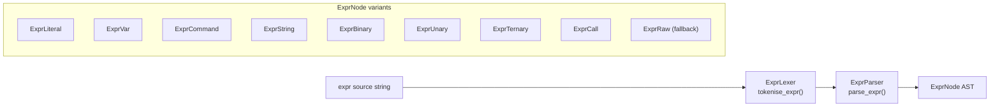

`ExprRaw` is a fallback for expressions the parser cannot handle — every
consumer must treat it as opaque and conservative.

## Diagnostic code taxonomy

| Range | Category | Source |
|-------|----------|--------|
| E001–E003 | Arity/subcommand errors | Analyser |
| E1xx–E2xx | Syntax errors | Lexer / Recovery |
| H300 | Paste-error hints | Analyser |
| W001–W002 | Command warnings | Analyser |
| W100–W120 | Semantic & style warnings | Analyser / Diagnostics |
| W200–W214 | Variable & versioning warnings | Analyser |
| W300–W313 | Security warnings | Analyser |
| O100–O130 | Optimisation suggestions | Optimiser + GVN |
| S100–S102 | Shimmer / type thunking | Shimmer detection |
| T100–T106 | Taint / security | Taint analysis |
| IRULE1007–IRULE1008 | Collect/release pairing (side-aware) | iRules flow analysis |
| IRULE1xxx–5xxx | iRules-specific | iRules flow + taint |

## Key source files

| File | Responsibility |
|------|---------------|
| `rust/tcl-lexer/src/lexer.rs` | Tokenisation |
| `rust/tcl-lexer/src/tokens.rs` | `Token` / `TokenType` definitions |
| `rust/tcl-lexer/src/span.rs`, `source_map.rs`, `line_index.rs` | Byte spans and offset → line/column resolution |
| `rust/tcl-lexer/src/substitution.rs` | Tcl backslash substitution helpers |
| `rust/tcl-lexer/src/expr_lexer.rs` | Expression tokenisation |
| `rust/tcl-compiler/src/segmenter.rs` | Command segmentation, chunking, and recovery |
| `rust/tcl-compiler/src/parsing/syntax/` | The lossless red-green concrete syntax tree |
| `rust/tcl-syntax/src/expr/` | Expression parsing (`parser.rs`), AST (`ast.rs`), operators, and folding |
| `rust/tcl-compiler/src/analyser/` | Semantic analysis, scope tracking, per-command handlers |
| `rust/tcl-compiler/src/analyser/diagnostics/` | Diagnostic emitters by family — `usage.rs`, `security.rs`, `validity.rs`, `dataflow.rs`, `version_gate.rs`, … |
| `rust/tcl-compiler/src/analyser/diagnostics/fp/` | False-positive suppression rules |
| `rust/tcl-compiler/src/irules_checks.rs` | iRules-specific checks (IRULE series) |
| `rust/tcl-compiler/src/ir.rs` | IR node definitions (`Module`, `Script`) |
| `rust/tcl-compiler/src/lowering/` | IR construction from the token stream |
| `rust/tcl-compiler/src/cfg.rs`, `cfg_builder/` | Control-flow graph construction |
| `rust/tcl-compiler/src/ssa.rs`, `memory_ssa.rs`, `state_ssa.rs` | SSA form construction |
| `rust/tcl-compiler/src/sccp.rs`, `type_infer.rs`, `dead_stores.rs` | SCCP, type inference, dead-store detection |
| `rust/tcl-compiler/src/analyses.rs` | Core analysis result types (`FunctionAnalysis`, the lattices) |
| `rust/tcl-compiler/src/compilation_unit.rs` | Pipeline orchestration and caching |
| `rust/tcl-compiler/src/interprocedural.rs` | Call graph and procedure summaries |
| `rust/tcl-compiler/src/optimiser/` | Optimisation passes (O100–O130) and the pass manager |
| `rust/tcl-compiler/src/gvn.rs` | Global value numbering / CSE / PRE / LICM (O105–O106) |
| `rust/tcl-compiler/src/taint.rs`, `taint_interproc.rs` | Taint analysis for untrusted I/O (T100–T106) |
| `rust/tcl-compiler/src/shimmer/` | Type-representation issue detection (S100–S102) |
| `rust/tcl-compiler/src/codegen/` | Tcl VM bytecode assembly backend |
| `rust/tcl-compiler/src/side_effects.rs` | Command side-effect classification |
| `rust/tcl-compiler/src/types.rs` | Type lattice definitions |
| `rust/tcl-compiler/src/compiler_checks.rs` | Downstream-pass aggregation into diagnostics |
| `rust/tcl-lsp-server/src/lib.rs` | Tiered diagnostic scheduling and LSP publishing |
| `rust/tcl-lsp-core/src/graphs.rs` | Call / symbol / data-flow graph queries |
