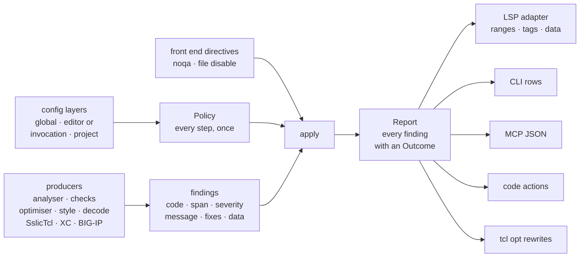

# Diagnostic policy — one owner below every surface

Where a finding's *policy* is applied: suppression directives, codes
disabled across the five documented scopes, default-off seeding, severity
overrides, the optimiser switch and profile, the shimmer switch, overlap
precedence, and encoding abstention. One shared pipeline runs from typed
producers through a single policy step to thin presentation adapters, so
parity between the editor, the CLI, the MCP tools and the code-action
provider is a property of the code rather than a checklist. This is the
design for [issue #2089](https://github.com/bitwisecook/tcl-lsp/issues/2089).
Read it before adding a diagnostic to a surface, before filtering a finding
anywhere but the policy step, and before promising that two surfaces report
the same set.

It is the second half of a pair. Issue #2020 gives the `# noqa` and
`# tcl-lsp: disable=` grammar one parser and one predicate
(`parse_noqa_marker`, `line_suppressed`), which settles what a directive
*means*. This page settles who *applies* it, along with every other policy
step, and what happens to a finding that loses: it stays in the report with
its reason, so "why is this not firing" has one answer that every surface
can read. [diagnostics-integration.md](diagnostics-integration.md) and
[diagnostics-calculation.md](diagnostics-calculation.md) describe the
aggregation and the two tiers inside the server; this page is the layer
below both of them.

> **Status — built.** The vocabulary is `tcl_lsp_core::diagnostic_policy`:
> `Finding`, `Producer`, `Fix`, `FindingData`, `Severity`, `Outcome`,
> `Shown`, `Reason`, `PolicyLayer`, `CodeDecision`, `Overlap`,
> `OverlapOwner`, `OverlapScope`, `OptimiserPolicy`, `DocumentGates`,
> `Directives`, `Policy`, `PolicyBuilder`, `Report`, `ApplicableRewrite`,
> `apply`, `FACT_CODES` and `WHOLE_FILE_CODES`; the report functions of
> `tcl_lsp_core::diagnostic_report` — `document_report`,
> `standalone_findings`, `brace_expr_hints` and `optimise_under_policy`;
> `tcl_lsp_core::config_ini`; the truth table,
> `diagnostic_policy::truth_table`; the `--show-suppressed` flag on
> `tcl diag` and `tcl lint`; and the `suppressed` array on the MCP
> diagnostic payloads. The modules' own docs are the compilable form of the
> shapes below, which are sketches in the tree's names. § Before the policy
> step records the surfaces at `rust` `3b5eba8a`, the base the step was
> built from; every other section describes the built tree.

## Rules

1. **Policy has one owner below every surface.** Directive suppression,
   disabled codes, default-off seeding, severity overrides, the optimiser
   switch and profile, the shimmer switch, overlap precedence and encoding
   abstention are applied once, by one pure function every surface calls.
   No surface holds a second copy of any step.
2. **Producers emit findings and read no policy.** A producer converts its
   own typed finding into one `Finding` shape and filters nothing. A
   producer may skip its own private calculation when its code is disabled
   — the cost saving is real — but the decision is still recorded by the
   policy step, never lost inside the producer.
3. **A suppressed finding stays in the report with its reason.** `apply`
   keeps every finding and pairs it with an `Outcome`; it deletes nothing.
   The explanation of a hidden finding is data, not a re-run under
   different settings.
4. **Directive facts come from the front end once.** `# noqa` and
   `# tcl-lsp: disable=` are source facts, parsed where the source is
   parsed (`tcl_compiler::analyser`), and reach the policy step as inputs.
   No consumer re-scans the text for them.
5. **One precedence order, stated once.** The five scopes resolve in the
   order the KCS documents — inline, file, project, editor or invocation,
   global — and the order lives in one place. A surface's flags occupy the
   editor layer's slot; they do not invent a sixth scope. An optimiser
   profile a request names is not a scope at all but the request's own
   parameter (§ Configuration).
6. **Adapters render the report and decide nothing.** An adapter maps
   spans, names severities in its own vocabulary, and serialises. It never
   filters, never re-derives a severity, and never infers a fact from
   whether another finding survived policy.

## Before the policy step (at `rust` `3b5eba8a`)

Policy was assembled separately by every surface that reported a code.
Each had the subset its author reached for, so the same file yielded a
different finding set on each surface. The table is kept as the record of
what the policy step changed; § Where each step lives describes the tree
now, where each step is applied once, by `apply`, and every surface renders
one report.

| Policy step | Editor publish | `tcl diag` / `lint` / `validate` | `tcl opt`, MCP `optimize`, `optimiseDocument` | MCP `analyze` / `validate` / `review` / `find-legacy` | Server code actions |
|---|---|---|---|---|---|
| Inline `# noqa` | yes | yes | no | no | yes |
| File `# tcl-lsp: disable=` | yes | yes | no | analyser codes only | yes |
| Codes disabled at the surface | editor settings | `--disable` / `--enable` | `--disable` / `--enable` (`tcl opt` only) | none | editor settings |
| Project `.tcl-lsp.ini`, global `config.ini` | yes | no | no | no | yes |
| Default-off seeding (`DEFAULT_OFF_CODES`, W242) | yes | no | n/a | no | yes |
| Severity overrides | yes | no | n/a | no | n/a |
| LSP tags (`DiagCode::lsp_tag`) | yes | n/a | n/a | no | n/a |
| Optimiser master switch | yes | n/a | `optimiseDocument` no; others n/a | n/a | n/a |
| Optimiser profile and per-code set | yes | O-codes dropped whole | profile yes, `optimiseDocument` no | n/a | on the diagnostic's `data` |
| Shimmer switch (`tclLsp.shimmer.enabled`) | yes | no | n/a | no | no |
| Overlap owners (W110 over O120; SslicTcl over W123) | yes | SslicTcl only | n/a | no | SslicTcl only |
| Encoding abstention (byte evidence) | yes | yes | no | n/a | no |
| `diagnostics.exclude`, `features.diagnostics` | yes | no | no | no | no |
| Compiler checks (S1xx, T1xx, IRULE1xxx–5xxx, GVN, SCCP) | yes | yes | n/a | no | yes |
| Source-style pass (W111, W112, W115, W118) | yes | yes | n/a | no | n/a |
| `genericVariablePatterns` (producer input, not policy) | yes | no | n/a | no | yes |

Four cells deserve their exact reading. The MCP tools reported the file
directive for analyser codes because `Analyser::analyse` folds
`parse_file_suppression` into its own `disabled_diagnostics` before it
emits anything, so the effect arrived through the producer rather than
through any policy the tool applied; the inline `# noqa` had no such
back door, and an MCP `analyze` reported a W100 or a W110 that `tcl diag`
suppressed on the same file. The encoding row is `n/a` for the MCP tools
because those tools take a decoded `source` string and have no byte
report to abstain on. `tcl opt` and MCP `optimize` rewrote the source
across a file-wide `# tcl-lsp: disable=*`, because neither built a
suppression map at all. And the server lifted no optimiser code action at
all: an actionable rewrite rode the published diagnostic's `data`
(`replacement`, `startOffset`, `endOffset`), so it inherited that
diagnostic's policy and the code-action provider never saw it — which is
also why an O-code carried no gate of its own on any other surface.

The MCP `code_actions` tool is not in the last column because it shared
none of it: it passed `analysis.diagnostics` straight into
`tcl_lsp_core::code_actions::code_actions`, whose own documentation
described that argument as the *published* set. A fix for a finding an
inline `# noqa` silenced was therefore offered there and nowhere else.

W107, W109 and W118 are never line-suppressed on any surface. That was
deliberate and stays: they are whole-file verdicts, so an inline
directive has no line to attach to, and only the file directive and the
per-code decision gate them (`WHOLE_FILE_CODES` in
`rust/tcl-lsp-core/src/diagnostic_policy.rs`).

### Why the copies existed

[pass-fact-ownership-matrix.md](pass-fact-ownership-matrix.md) assigned
"final LSP diagnostic projection, suppression policy" to `tcl-lsp-db`, and
the configuration parser lived in `tcl-lsp-server`. Neither crate is in
the dependency closure of `tcl-cli`, `tcl-cli-support` or `tcl-mcp`: all
three reach `tcl-lsp-core` and stop there, while `tcl-lsp-db` and
`tcl-lsp-server` sit on the other side of it. Those surfaces could not
reach the policy, so each copied what it could, which is the shape every
"no" in the table above has. "Suppression is uniform" and "every lift
applies it", in [diagnostics-integration.md](diagnostics-integration.md)
and [diagnostics-calculation.md](diagnostics-calculation.md), were true of
the server and of nothing else. Putting the policy in `tcl-lsp-core` is the
whole of the placement argument: it is below all four surfaces and
`tcl-lsp-db`, and it already hosted the style pass, the decode report, the
SslicTcl projection and the code actions.

## Where each step lives

**tcl-lsp-core** — the step itself. `rust/tcl-lsp-core/src/diagnostic_policy.rs`
holds the finding and its conversions, `PolicyBuilder`, `Policy`, `apply`
and `Report`, the overlap table (`dialect_overlaps`), `WHOLE_FILE_CODES`
and `FACT_CODES`. `rust/tcl-lsp-core/src/diagnostic_report.rs` holds the
functions every surface calls: `document_report` joins a surface's
findings with the producers this crate owns — the source-style pass, the
byte-integrity pass and the SslicTcl projection — and applies the policy;
`standalone_findings` runs the analyser, the O111 producer
(`brace_expr_hints`) and the compiler checks over one compilation unit, for
a surface without the database; `optimise_under_policy` is the rewrite loop
that applies only what the policy shows, admitted into the optimiser's own
multipass loop. `rust/tcl-lsp-core/src/config_ini.rs`
holds the INI parse, the three-layer merge, `DEFAULT_OFF_CODES` and the
readers of the global and project files (`global_layer`,
`project_layer_for`). `rust/tcl-lsp-core/src/code_actions.rs` lifts fixes
from the findings a `Report` shows (`code_actions`,
`code_actions_in_program`).

**Server** — `rust/tcl-lsp-server/src/lib.rs`. `PolicyLayers` holds one
scope's three layers unmerged: the session holds a set, applied through
`apply_session_layers`, a configured folder its own, and
`resolved_policy_layers` picks between them by longest-prefix match.
`document_policy` builds a document's policy from its layers, byte
evidence, dialect and directives. The conversions — `analyser_findings`,
`compiler_findings`, `xc_findings`, and `model_findings` under
`bigip_config_findings` and `apl_presentation_findings` — turn each
producer's output into findings, and `published_findings` assembles the
analyser's set, the O111 hints, the checks and the rewrites, and the XC
findings, in the order they publish. `published_report` is the report and
`lift_report` its LSP adapter; `lifted_report` composes the two, and it is
the one call the fast push (`publish_fast_tier`), the deep push
(`refine_and_lift_diagnostics`), the pull (`analysed_diagnostics_for`) and
the F5 model report (`f5_model_report`) each make. The lightbulb reads
`published_report` over the same findings, `tcl-lsp.optimiseDocument` runs
`optimise_under_policy`, and `tcl-lsp.fixAllSafeIssues` applies the fixes of
the findings its report shows.

**tcl-lsp-db** — `rust/tcl-lsp-db/src/lib.rs`: `file_analysis` and
`file_analysis_incremental` hand the analyser its production skip through
`Analyser::with_disabled_diagnostics` — the saving rule 2 permits, which the
report declares — and `compiler_check_diagnostics` computes every check and
rewrite and decides nothing.

**CLI** — `rust/tcl-cli/src/commands/policy.rs`: `ConfigLayers` resolves each
input file's global and project layers, and `invocation_layer` turns
`--disable` / `--enable` into the editor slot's layer.
`rust/tcl-cli/src/commands/diag.rs`: `collect_rows` runs
`standalone_findings` under the production skip and `document_report` under
`diag_policy` (the optimiser off), declares what it did not run, and renders
the report — `rows_of` the shown findings, `--show-suppressed` the hidden
ones and the gaps. `rust/tcl-cli/src/commands/transform.rs`: `run_opt` runs
`optimise_under_policy` over each input as its own program.

**MCP** — `rust/tcl-mcp/src/tools.rs`: `PolicyInputs` resolves the global
layer and the call's `disable` / `enable`, `analyse_under` runs
`standalone_findings` once per call, and `Analysed` renders the diagnostics
tools' report (optimiser off) and `code_actions`'s (with the rewrites);
`optimize` runs `optimise_under_policy`.

**tcl-compiler** — `rust/tcl-compiler/src/analyser/utils.rs`:
`line_suppressed`, `parse_noqa_marker`, `parse_file_suppression`,
`parse_noqa_line_suppressions_for_dialect`, `apply_preceding_noqa` and
`FILE_SUPPRESS_KEY` build `AnalysisResult::suppressed_lines`, the directive
facts every surface's policy reads. Two policy steps stay inside the
producer, and both are open. The analyser folds a top-of-file
`# tcl-lsp: disable=` into its own skip (`apply_disabled_diagnostics`,
`rust/tcl-compiler/src/analyser/diagnostics.rs`), which the report declares
as a gap; and its W305 producer drops a finding under a `# noqa` itself,
with no reason in the report.

## The pipeline



Four stages, in order.

1. **Producers emit typed findings and read no policy.** One `Finding`
   shape with `From` conversions from every diagnostic type in the tree.
2. **Directive facts come from the front end once.** The analyser's
   `suppressed_lines` map is the input; a surface with no analyser run
   scans once through the same helpers.
3. **One policy value and one pure function.** `Policy` holds every step
   in the table; `apply(findings, &policy) -> Report` keeps every finding
   with an outcome.
4. **Adapters render the report.** LSP ranges, tags and `data`; CLI rows;
   MCP JSON; code actions and `tcl opt` act only on shown findings.

### The finding

```rust
/// One producer's finding, before any policy.
pub struct Finding {
    /// The code, as the one catalogue spells it.
    pub code: DiagCode,
    /// Byte offsets in the *analysis form* of the text (lone `\r`
    /// rewritten), which is what every producer reads.
    pub span: Span,
    /// The producer's default severity. Policy may relabel it; the
    /// producer never chooses the displayed one.
    pub severity: Severity,
    pub message: String,
    /// Edits whose range is independent of `span`.
    pub fixes: Vec<Fix>,
    /// The extra payload an adapter may need.
    pub data: Option<FindingData>,
    /// Which producer emitted it — for the report's explanation and for
    /// the overlap table, never for ranking.
    pub producer: Producer,
}

pub enum Producer {
    Analyser,
    CompilerCheck,
    Optimiser,
    SourceStyle,
    SourceDecode,
    SslicTcl,
    Xc,
    BigipModel,
}

pub struct Fix {
    /// Zero-width for an insertion.
    pub span: Span,
    pub new_text: String,
    pub description: String,
    pub safety: FixSafety,
}

pub enum FindingData {
    /// An optimiser rewrite. `group` is the all-or-nothing edit group;
    /// `hint_only` marks a finding whose span covers the consuming
    /// statement, so its replacement must never be advertised as
    /// auto-appliable.
    Rewrite {
        replacement: String,
        group: Option<u32>,
        hint_only: bool,
    },
    /// A style fix already expressed as a document range.
    StyleFix { fix: StyleFix },
}
```

`Severity` is the shared five-value ladder the analyser and the compiler
checks already agree on — `Error`, `Warning`, `Info`, `Hint`, `Suggestion`
— which `tcl_compiler::analyser::Severity` and
`tcl_compiler::compiler_checks::Severity` both re-export from
`tcl_core_types::Severity` and carry over unchanged; the tree's three
narrower severity enums map into it on conversion:
`source_style::StyleSeverity` as `Warning` / `Hint`;
`f5_xc::XcSeverity` as `Hint` / `Info`;
`tcl_bigip::validator::DiagSeverity` as `Warning` / `Hint`. Naming an LSP
`DiagnosticSeverity` is the LSP adapter's job and happens nowhere else;
naming `error` / `warning` / `info` / `hint` for a CLI row is the row
adapter's.

### The conversions

Seven producer *types* exist in the tree, not five: the issue's list omits
the BIG-IP model validator, and the SslicTcl projection already lands on
the analyser's shape rather than carrying one of its own. The
byte-integrity producer is an eighth *producer* sharing the style pass's
type, which is why `Producer` and the type are separate axes.

| Producer type | Where | Conversion |
|---|---|---|
| `tcl_compiler::analyser::Diagnostic` | `rust/tcl-compiler/src/analyser/types.rs` | `From` — `code`, `span`, `severity`, `message`, `fixes` are already one to one |
| `tcl_compiler::compiler_checks::Diagnostic` | `rust/tcl-compiler/src/compiler_checks.rs` | `From` — `category` is dropped, `replacement` becomes a same-span `Fix` |
| `tcl_compiler::optimiser::Optimisation` | `rust/tcl-compiler/src/optimiser/mod.rs` | `From` — `severity` is `Hint`, `replacement` / `group` / `hint_only` become `FindingData::Rewrite` |
| `tcl_lsp_core::source_style::StyleDiagnostic` | `rust/tcl-lsp-core/src/source_style.rs` | conversion, not `From`: its `LspRange` needs the document's line index to become a `Span` |
| `tcl_lsp_core::source_decode` findings | `rust/tcl-lsp-core/src/source_decode.rs` | the same conversion — `encoding_integrity_diagnostics` returns `StyleDiagnostic` with `producer: SourceDecode` |
| `tcl_sslictcl::dsl::DslDiagnostic` | projected by `rust/tcl-lsp-core/src/sslictcl_diagnostics.rs` | the projection keeps its span and gains `producer: SslicTcl`; it filters nothing |
| `f5_xc::XcDiagnostic` | `rust/f5-xc/src/diagnostics.rs` | conversion on the XC side: `tcl-lsp-core` does not depend on `f5-xc`, and must not, so `f5-xc` holds the conversion and the shared crate stays below it |
| `tcl_bigip::validator::ConfigDiagnostic` | `rust/tcl-bigip/src/validator.rs` | conversion in `tcl-lsp-core`, which already depends on `tcl-bigip`; its inclusive range end is normalised here rather than at each lift |

One of those carries a `String` code rather than a `DiagCode`:
`ConfigDiagnostic::code`, whose `TryFrom` conversion fails on a spelling
the catalogue lacks. `XcDiagnostic::code` and `StyleDiagnostic::code` were
strings too; slice 1 typed both as `DiagCode` and gave `XcDiagnostic` the
byte span its range was resolved from, so their conversions are total.
`XC100`–`XC301` joined the `diagnostic_codes!` table in
`rust/tcl-core-types/src/diag_code.rs` in the same slice, with their own
`DiagSection::Xc` — thirteen codes, the set the translator emits rather
than a contiguous range. `Finding::code` is a `DiagCode` because one code
space is what makes the disabled set, the severity overrides, the tag
table and the overlap table one mechanism each, and an unparseable code
is a conversion failure rather than a value that silently skips every
table.

### The outcome

```rust
pub enum Outcome {
    /// The finding shows. `severity` is the producer's default with the
    /// user's override applied; `tag` comes from the code table.
    Shown {
        severity: Severity,
        tag: Option<DiagTag>,
    },
    Suppressed(Reason),
}

pub enum Reason {
    /// The whole document reports nothing: `features.diagnostics` is off.
    ReportingOff,
    /// `diagnostics.exclude` matches this file.
    Excluded,
    /// The bytes are not UTF-8 text, so only the integrity codes stand.
    EncodingAbstention,
    /// An inline `# noqa` on the command, at this 0-based line.
    InlineDirective { line: i32 },
    /// A top-of-file `# tcl-lsp: disable=`.
    FileDirective,
    /// A configuration or flag layer turned the code off.
    Disabled(PolicyLayer),
    /// The code is default-off and nothing turned it on.
    DefaultOff,
    /// The optimiser master switch is off.
    OptimiserOff,
    /// The profile in force (with its per-code overrides) does not enable
    /// the code.
    OptimiserProfile { profile: OptimisationProfile },
    /// `tclLsp.shimmer.enabled` is off.
    ShimmerOff,
    /// Another code, or a whole producer, owns this site.
    Overlap { owner: OverlapOwner },
}

/// Which scope decided a code, lowest first. Distinct from
/// `config_ini::Layer`, which names the *file role* of one INI parse
/// (`[global]` versus `[project]`) and has no editor or invocation
/// spelling to name.
pub enum PolicyLayer {
    Global,
    /// Editor settings.
    Editor,
    /// A surface's own flags, in the editor layer's slot. See
    /// § Configuration.
    Invocation,
    Project,
}

/// Every finding with its outcome, in the producers' order, and the codes
/// a producer declared it left uncomputed, each with the policy's reason.
pub struct Report { /* … */ }
```

`Report::shown()` and `suppressed()` split the pairs; `outcome_for` and
`reason_for(code, span)` answer for one finding, and `reason_for` falls
back to a declared skip when no finding of the code exists. A producer that
leaves codes uncomputed declares them — `declare_skipped(codes, &policy)`,
and its two uses `declare_analyser_skip` and `declare_optimiser_skip` — each
with the reason `Policy::gap_reason` gives, and `gaps()` lists the declared
codes no finding carries, so a gap is explained rather than read as clean.
`applicable_rewrites()` and `applicable_items(items)` are the only doors to
a rewrite: an ungrouped one that shows, or an optimisation group every
member of which shows, never half a group (#2149). The pairs keep the
producers' order, and `apply` is order-stable, so two surfaces given the
same findings and the same policy produce the same report in the same
order. Each reason has one spelling, `Display for Reason`, which every
rendering uses (§ Adapters).

`Reason` beyond the issue's list is the tree's doing: the optimiser
profile is a separate decision from the master switch, the shimmer switch
is a family gate with no other home, and `features.diagnostics` and
`diagnostics.exclude` used to empty the whole report with no record of
why. The server still builds no report for a document whose reporting is
off or which is excluded: it publishes the empty set without analysing a
document nobody sees. `ReportingOff` and `Excluded` are the policy step's
answer for a surface that asks, and the truth table's first two rows pin
them.

### The policy

```rust
pub struct Policy {
    /// The document-wide gates and the byte evidence.
    pub document: DocumentGates,
    /// The resolved per-code decision and the layer that won it.
    /// A code absent from the map is enabled unless it is in `default_off`.
    pub codes: BTreeMap<DiagCode, CodeDecision>,
    /// The default-off seed — the lowest layer, and the reason a code
    /// still off at the bottom reports `DefaultOff` rather than
    /// `Disabled(Global)`.
    pub default_off: &'static [DiagCode],
    /// `tclLsp.diagnosticSeverity.<CODE>`.
    pub severity_overrides: BTreeMap<DiagCode, Severity>,
    pub optimiser: OptimiserPolicy,
    /// `tclLsp.shimmer.enabled`.
    pub shimmer: bool,
    /// Resolved for the document's dialect (`dialect_overlaps`).
    pub overlaps: Vec<Overlap>,
    pub directives: Directives,
}

pub struct DocumentGates {
    /// `features.diagnostics` for this file's folder.
    pub reporting: bool,
    /// Whether `diagnostics.exclude` matches this file.
    pub excluded: bool,
    /// Byte evidence, through `source_decode::should_abstain`. The codes
    /// that survive it are the integrity set, not a guess from whether
    /// W109 is displayed.
    pub abstain: bool,
}

pub struct CodeDecision {
    pub enabled: bool,
    pub layer: PolicyLayer,
}

pub struct OptimiserPolicy {
    /// `tclLsp.optimiser.enabled`.
    pub enabled: bool,
    /// The profile in force: the one the request names, else the
    /// layers' (§ Configuration).
    pub profile: OptimisationProfile,
    /// The profile's disabled set with the per-code overrides applied.
    pub disabled: BTreeSet<DiagCode>,
}

pub struct Overlap {
    pub owner: OverlapOwner,
    pub superseded: DiagCode,
    pub scope: OverlapScope,
}

pub enum OverlapOwner {
    /// One code owns the site: W110 over O120.
    Code(DiagCode),
    /// A whole producer owns it: in a `.sslictcl` document the loader
    /// owns W123 whether or not it emitted a finding of its own.
    Producer(Producer),
}

pub enum OverlapScope {
    /// The owner wins only where the two spans coincide.
    SameSpan,
    /// The owner wins where its span lies inside the superseded
    /// finding's span — W110 over O120.
    WithinSpan,
    /// The owner wins everywhere in the document.
    Document,
}

/// The analyser's `suppressed_lines` — 0-based lines plus the
/// `FILE_SUPPRESS_KEY` bucket — over the text's line model.
/// `Directives::from_analysis` for a surface that ran the analyser,
/// `Directives::scan` for one that did not.
pub struct Directives { /* … */ }

pub fn apply(findings: Vec<Finding>, policy: &Policy) -> Report;
```

`Policy` carries only what decides whether and how loudly a finding shows.
A setting that changes *what a producer computes* — `genericVariablePatterns`,
the non-ASCII mode, the style line length and expected line ending, the
extra commands, the pack overlay — is a producer input and stays on
`AnalyserConfig` and the producers' own arguments. That is rule 1 of
[value-transfers.md § Diagnostics consume facts](value-transfers.md#diagnostics-consume-facts)
read as a type: display policy cannot change semantic truth, so the value
that carries display policy cannot carry a semantic input.

A policy answers a producer's questions too. `code_reason(code)` is steps
4 and 5 below for a code alone; `gap_reason(code)` is why a code with no
finding is absent — the steps that need no line, in order; and
`disabled_codes()` is every code the per-code decision turns off.
`production_skip()` is what a producer may leave uncomputed:
`disabled_codes()` less `FACT_CODES`, the codes another producer reads as a
fact. W100 is one — O111 reads its sites — so a W100 a layer turns off is
computed, then suppressed. `analyser_skip()` adds the codes the file
directive names, which the analyser folds into its own skip.

`apply` decides in one order, and the order is part of the contract because
the recorded reason depends on it. The first reason that fires wins:

1. `reporting`, then `excluded` — the document-wide gates.
2. `abstain` — everything but W107, W109 and W305 becomes
   `EncodingAbstention`. Ahead of the directives on purpose: when the
   positions in the file are decoding artefacts, "nothing here is
   analysed" is the honest explanation, and a directive that happens to
   cover the same code is not.
3. The inline directive, then the file directive, through
   `Directives::reason_for` — whose bucket rule is `line_suppressed`'s,
   restated and pinned equal to it by a test — a code in
   `WHOLE_FILE_CODES` skipping the inline one.
4. The per-code decision: `Disabled(layer)` for the winning
   layer, or `DefaultOff` at the seed.
5. The family gates, for an optimisation code: `OptimiserOff`, then
   `OptimiserProfile`. Then `ShimmerOff` for the shimmer family.
6. The overlap table, entry by entry, over the findings still standing —
   so an owner that policy has already suppressed cannot supersede
   anything.
7. Everything left is `Shown { severity: overrides.get(code).unwrap_or(&
   finding.severity), tag: code.lsp_tag() }`.

**The overlap table** has two entries. W110 owns an O120 whose span holds
its own, in every dialect: the analyser anchors W110 on the `==` operator,
and the optimiser anchors O120 on the whole condition it rewrites. Both
anchors are right, so the entry states their relation — containment,
`WithinSpan` — rather than moving either producer's anchor to suit the
policy. Overlap policy is explicit and separate from fact production (rule 4
of [value-transfers.md § Diagnostics consume facts](value-transfers.md#diagnostics-consume-facts)),
and an anchor moved for presentation's sake would be fact production bending
to it. In a `.sslictcl` document the loader owns W123 everywhere
(`Document`, from `SUPERSEDED_ANALYSER_CODES`). `SameSpan` remains for an
entry whose owner and superseded finding share a span. An owner must stand
in the same report: a rewrite surface's report carries the optimiser's
findings alone, so its O120s stay applicable.

## Configuration

### The five scopes and their order

[`docs/kcs/kcs-howto-suppress-diagnostics.md`](../../kcs/kcs-howto-suppress-diagnostics.md)
documents five places to turn a code off and, under
[Precedence, from highest priority to lowest](../../kcs/kcs-howto-suppress-diagnostics.md#precedence-from-highest-priority-to-lowest),
one order: inline `# noqa`, top-of-file `# tcl-lsp: disable=`, project
`.tcl-lsp.ini`, editor settings, global `config.ini`. The three
configuration layers and their rationale are the
[config precedence contract](../contracts/config-precedence.md), whose
[precedence table](../contracts/config-precedence.md#precedence-lowest-to-highest)
is the same order read upward. Two properties of that contract are load
bearing here: the merge is per key inside each section, and project, editor
and global can each turn a code **back on**, so a layer's contribution is a
per-code tri-state and not a set union. A flat disabled set cannot express
"the project enables what the global file disabled", and cannot name the
layer that decided.

### The layers, resolved per code

The INI parse and the three-layer merge live in `tcl_lsp_core::config_ini`
(slice 2), beside the policy step, so the CLI and the MCP tools resolve the
same layers. The whole module moved down from
`rust/tcl-lsp-server/src/config_ini.rs`: `Layer` with `Layer::top_section`,
`settings_from_ini` and the `insert_*` helpers it delegates to
(`insert_diagnostics`, `insert_diagnostic_severity`, `insert_optimiser`,
`insert_formatting`, `insert_packages`, `insert_workspace_scan`,
`insert_iruleslx`), the private `parse_ini` / `section_value` /
`has_section` / `parse_comma_list` / `parse_path_list` / `parse_bool`
scanners, and `merge_settings`. Splitting the diagnostics sections out of
`settings_from_ini` would leave two parses of one file, which is exactly
the shape this design exists to remove. `rust/tcl-lsp-server/src/lib.rs`
keeps `read_ini_layer` (it holds the `vfs::SourceStore`) and applies a
scope's layers through `apply_session_layers`.

An INI layer holds a per-code tri-state as the editor's does. `[diagnostics]`
and `[optimiser]` read their `disabled` list and then every per-code key
(`W242 = true`, `W111 = false`) in file order, so a per-code key wins over
`disabled` in the same file, and a higher file can turn back on what a lower
one turned off (`insert_code_toggles`).

`PolicyBuilder` takes the configuration **layers one at a time, lowest
first** (`layer(PolicyLayer, &json)`), rather than the merged JSON: only
the unmerged layers can name the layer that decided a code, which is what
`Disabled(PolicyLayer)` and the per-code tri-state need. It resolves the
per-code decision, the severity overrides, the shimmer switch and the
optimiser's switch, profile (over `profile_to_disabled`) and per-code
overrides, with `DEFAULT_OFF_CODES` as the seed and `parse_severity_value`
for a severity. It also takes the resolved dialect, the decode report and
the directives, and produces one `Policy`. A key a higher layer sets to an
unusable value (a non-boolean toggle, an unknown severity) resets the lower
layers' decision, which is what per-key merge-then-parse did. The server's
per-folder resolution stays in the server, because longest-prefix matching
over workspace folders is an LSP concept the CLI has no counterpart for.

**The analyser's skip is the layers'.** The session's skip and every
configured folder's are `PolicyLayers::production_skip` of the same layers
their policy is built from, so the report can explain every gap; a folder
whose resolved analyser inputs equal the session's shares the session's
analyser handle. `getEffectiveConfig` and the INI export report what the
configuration turns off (`Policy::disabled_codes`), a fact code the
analyser still computes included.

**The invocation layer.** A surface's own flags occupy the editor layer's
slot in the precedence order, under the project file and over the global
file, and are recorded as `PolicyLayer::Invocation` so the report can
say which one decided. For `tcl diag` / `lint` / `validate` and `tcl opt`
that is `--disable` and `--enable`; for the MCP tools it is the `disable`
and `enable` arguments. The flags keep their tri-state meaning — `--enable`
turns a code back on, which is what makes `--enable W242` reach a
default-off code.

**The batch surfaces read no whole-document gate.** `tcl diag` / `lint` /
`validate` / `opt`, the MCP tools and `tcl-lsp.optimiseDocument` read
neither `features.diagnostics` nor `diagnostics.exclude` from any layer:
those turn off an editor's published squiggles, not a report or a rewrite
someone asked for.

**A named profile is the request's own.** An optimiser profile the
invocation names — `tcl opt --profile`, the MCP `optimize` tool's
`profile`, the `tcl-lsp.optimiseDocument` command's argument — is the
profile in force, over the project file's `[optimiser] profile` and the
global file's, which apply only when the invocation names none
(`PolicyBuilder::requested_profile`; the owner's ruling of 2026-09-22).
The profile is a request parameter with a project default, not a layered
policy decision: a call that asks for `full` is asking for what `full`
does, and a project file that could overrule the request would leave the
argument no meaning wherever a project exists, while the project file
still decides every call that asks for nothing. The ruling moves that one
key only. The master switch and the per-code `optimiser.<CODE>` keys keep
the layer order above, so a project's `disabled = O101` or `enabled =
false` still stands under `--profile full`; and the editor's
`tclLsp.optimiser.profile` is the editor layer's value, under the project
file like every editor setting, because an editor echoes a setting's
default for a key the user never set
([config-precedence.md](../contracts/config-precedence.md)). Each surface
has its own default for a request that names nothing and a file that
names nothing: `full` for `tcl opt` and `optimize`, the editor's
`readability` for `optimiseDocument`. The profile in force sets the pass
count as well as the category set on all three — `aggressive` runs to a
fixpoint, every other profile once — so one profile means one thing
wherever it is asked for.

**Where the project file is.** Per input document, not per process. The
resolution walks the input file's own directory and its ancestors for
`tcl_lsp_core::tcl_install::PROJECT_CONFIG_FILENAME`, at most twenty
levels (`config_ini::project_root_for`), and takes the first
`.tcl-lsp.ini` that exists: an unreadable one is reported on stderr and
ends the walk rather than letting a grandparent's decide in its stead.
`tcl_install::project_config_path` names the file once the root is known.
`tcl diag a/x.tcl b/y.tcl` can therefore span two projects and resolve
each under its own layer. An `InputDocument` with no `path` — `--source`,
stdin, an MCP `source` string — has no project layer at all, and the
process's working directory is never a substitute. The global layer is
`tcl_install::user_config_path()` on every surface.

**The default-off set.** `DEFAULT_OFF_CODES` lives in `tcl-lsp-core` with
the builder and is the seed of every surface's resolution, which is what
stopped `tcl diag` reporting W242 on a file the editor shows clean. It
remains a code-table concern, not a policy-step constant: the seed is a
list of codes the catalogue declares opt-in.

## Adapters

Each adapter reads one `Report` and renders it. None of them decides
anything, and none of them may.

**LSP** — `rust/tcl-lsp-server/src/lib.rs`, `lift_report`: `Span` to a
UTF-16 `Range` through `lift_span`, `Severity` to `DiagnosticSeverity`
through `lsp_severity`, `Outcome::Shown::tag` to `Diagnostic.tags`, and an
applicable rewrite to the `data` payload — `{replacement, startOffset,
endOffset}` for an ungrouped rewrite and `{group, edits}` on every member of
an intact optimisation group (#2123, #2149); a `hint_only` rewrite and a
group that lost a member carry none. It re-checks no disabled set,
directive, optimiser switch or overlap, and it publishes only `shown()`.
The four report paths are one call each on `lifted_report`. O111 stays in
the deep tier: tier membership is scheduling (`is_fast_tier`), not policy.

**CLI rows** — `rust/tcl-cli/src/commands/diag.rs`. `rows_of` renders
`shown()`: 1-based line and column from the document's line index, the
severity label, and the deterministic `(line, column, code)` sort.
`--show-suppressed` on `tcl diag` and `tcl lint` renders `suppressed()` too,
one `hidden` row per finding with `[reason]`, and `gaps()` as rows with no
position — the CLI's answer to "why is this not firing". A default-off gap
is left out: the seed is the same on every file, and listing it everywhere
buries the answer. `run_validate` filters on `Severity::Error` over the
report's shown set, and takes no such flag.

**MCP JSON** — `rust/tcl-mcp/src/tools.rs`. `analyze`, `validate`,
`review` and `find-legacy` read `shown()`, keeping their own grouping
(`diag_meta::meta` categories, the security / taint / thread split, the
convertible-code table), which is presentation and stays theirs. Each
payload carries a `suppressed` array — `{code, range, reason, message}` for
a hidden finding, `range` and `message` `null` for a gap, a default-off gap
left out — which `review` and `find-legacy` filter to their own code sets,
so an agent can see that a finding exists and was suppressed rather than
concluding the code is clean.

**What a diagnostics surface did not run.** `tcl diag`, `tcl lint` and the
MCP diagnostics tools run the analyser and the compiler checks with the
optimiser off, and never run the optimiser itself. The accurate report says
what did not run: besides the analyser's skip, they declare the optimiser's
catalogued codes (`Report::declare_optimiser_skip`), so `--show-suppressed`
and `suppressed` list a code only the optimiser emits as an `optimiser-off`
gap — or with the earlier reason that decides it, a file directive or a
layer's `false` — without running the optimiser to say so. A code a
compiler check or the O111 producer emitted keeps its finding, hidden
`optimiser-off` at its line (O100, O111). Running the optimiser there would
spend work to produce nothing shown, and leaving its codes out would hide a
true statement.

**The reason spellings.** One lower-case, hyphenated spelling with an
optional `:detail`, from `Display for Reason`, on every rendering:

| `Reason` | Spelling |
|---|---|
| `ReportingOff` | `reporting-off` |
| `Excluded` | `excluded` |
| `EncodingAbstention` | `encoding-abstention` |
| `InlineDirective { .. }` | `inline-directive` |
| `FileDirective` | `file-directive` |
| `Disabled(layer)` | `disabled:global`, `disabled:editor`, `disabled:invocation`, `disabled:project` |
| `DefaultOff` | `default-off` |
| `OptimiserOff` | `optimiser-off` |
| `OptimiserProfile { profile }` | `optimiser-profile:<profile>` |
| `ShimmerOff` | `shimmer-off` |
| `Overlap { owner }` | `overlap:<code>` or `overlap:<producer>` |

**Code actions** — `rust/tcl-lsp-core/src/code_actions.rs`. `code_actions`
and `code_actions_in_program` take the `Report` and lift fixes from what it
shows: a fix is offered for a shown finding and for no other, and a shown
rewrite is an action like any other, through `applicable_rewrites` — a
group whole or not at all. The server's lightbulb reads the report the
document publishes (`published_report` over `published_findings`), and the
MCP `code_actions` tool reads the producers' findings with the optimiser's
rewrites under the layers' switch.

**`tcl opt`** — `rust/tcl-cli/src/commands/transform.rs`. `run_opt`
optimises each input as its own program (#2120) through
`optimise_under_policy`, which admits a pass's rewrites into the
optimiser's own multipass loop (`optimise_source_multipass_admitting`), so
the loop has one owner: every pass reads the analyser's directive map over
that pass's text — the map the squiggles are decided under, so a `# noqa`
before a multi-line command covers every line of it — and admits what the
report shows through `applicable_items`, so a group applies whole or not at
all (#2149). The summary block lists what was applied. The MCP `optimize`
tool and the server's `tcl-lsp.optimiseDocument` command take the same
path, which is what makes a `# noqa` mean the same thing to a rewrite as it
does to a squiggle.

## Producers that change

**O111 is a producer** (slice 8). The server used to create O111 by
searching the already-lifted diagnostics for W100, so O111 fired only where
a W100 survived presentation policy, and it read the optimiser's switch and
disabled set itself. Both rules consume the same unbraced-expression fact.
`brace_expr_hints` now emits one O111 at the span of every W100 the
analyser emitted, reading no policy, and every report of the deep set adds
the hints right after the analyser's findings (the server's fast tier adds
none: tier membership is scheduling). Policy decides both independently: disabling
W100 or a `# noqa: W100` does not silence O111, and the optimiser's gates
reach O111 in the one place they reach every other O-code. W100 is a fact
code (`FACT_CODES`): the analyser computes it whatever the layers say, and
the policy step suppresses it, because O111 reads its sites. A top-of-file
`# tcl-lsp: disable=W100` still removes O111, through the analyser's fold
(§ Where each step lives).

**The style pass stopped applying the map** (slice 3).
`source_style::style_diagnostics` keeps its checks, its line
normalisation and its W118-reads-the-real-terminators rule, and lost its
`disabled` and `suppressed` parameters and the `enabled` /
`push_line_suppressed` closures. The "W107, W109 and W118 are not
line-suppressed" rule is `WHOLE_FILE_CODES` in the policy step, a
property of those codes stated once instead of living in one pass's
control flow.

**The SslicTcl projection stopped applying the map** (slice 3).
`sslictcl_diagnostics::diagnostics` lost its `disabled` and `suppressed`
parameters and returns every loader finding, as `Finding`s.
`SUPERSEDED_ANALYSER_CODES` is read as the dialect's
`Overlap { owner: Producer(SslicTcl), superseded: W123, scope: Document }`
entry by `dialect_overlaps`. The function that superseded W123 by hand went
with the adapters that called it (slices 4 and 5), and the supersession is
visible as `Reason::Overlap` on a W123 rather than as a silently missing
finding.

**The XC and F5 integrity lifts stopped filtering.** `xc_findings` is a
conversion, and the F5 model report's integrity codes come from
`document_report`'s integrity pass under `Directives::scan` — the policy's
directive facts, where the old lift re-scanned the source for a directive
the front end had already parsed.

**The analyser keeps its production-time skip.** `file_analysis` passing
the production skip into `Analyser::with_disabled_diagnostics` is rule 2's
permitted saving, and it stays: the analyser's emitters are the dominant
cost and a disabled expensive rule should not run. What changed is that the
skip is *declared* (`Report::declare_analyser_skip`), with the reason the
policy gives for each code, so a report never shows a gap it cannot
explain. The CLI's and the MCP's analyser runs take the same seeded skip,
and the diagnostics surfaces declare the optimiser they do not run the
same way (§ Adapters).

## The truth table

One table from `(program, policy)` to `Report`, in `tcl-lsp-core` beside
`apply`, is the parity gate: `rust/tcl-lsp-core/src/diagnostic_policy/truth_table.rs`,
compiled for that crate's tests and, through its `truth-table` feature, for
the adapter crates' tests, which enable the feature from their
`[dev-dependencies]`, so no shipped build carries it. Each row is a small
program, the configuration by slot — the global file, the editor slot and
the project file — and what the editor's report holds for the codes the row
names: shown, shown at a severity, suppressed for a reason, or absent with
the report's reason for the gap. The 41 rows cover one case per `Reason`
variant, the precedence pairs that distinguish two reasons for the same
finding (an inline directive over a project enable; a project enable over a
global disable; a directive over the optimiser profile), the `*` wildcard in
both directive spellings, the `FILE_SUPPRESS_KEY` bucket, a default-off
code turned back on at each layer, the overlap scopes the table uses
(`WithinSpan` for W110 over O120, `Document` for the loader over W123), and
an abstaining document. A new `Reason` variant or `PolicyLayer` that no row
covers fails the table's own test.

The expectations are written once, for the editor, and `Row::expected`
derives every other surface's by this page's rules (`Surface`): the LSP
adapter publishes only what shows; a surface's flags occupy the editor
layer's slot, so `Disabled(Editor)` reads `Disabled(Invocation)`; the
diagnostics verbs and tools run with the optimiser off, so an O-code they
have a finding for reads `OptimiserOff` and one only the optimiser emits is
a declared gap; a default-off gap is not rendered; the CLI analyses no
abstaining document; and an action is offered, or a rewrite applied,
exactly when its finding shows. `Row::runs_on` says which surfaces can
realise a row at all.

The table lives once and every adapter runs it: the core report in the
module itself; the LSP adapter, the lightbulb and `optimiseDocument` in
`rust/tcl-lsp-server/src/policy_truth_table.rs`; `tcl diag
--show-suppressed` and `tcl opt` in `rust/tcl-cli/tests/cli.rs`; and the MCP
`analyze`, `code_actions` and `optimize` tools in `rust/tcl-mcp/src/tools.rs`.
A surface that forgets a policy step then fails on the row for that step
rather than on a reviewer noticing. The four server unit tests that once
asserted a lift honoured a step are rows 8, 11 and 12, 27, and 32 and 33. A
row whose wanted outcome does not hold records a `Defect` that pins today's
rendering on the surfaces it names and fails once the wanted outcome holds,
so the fix removes the marker; no row records one.

## Slices

1. **`Finding`, `Outcome`, `Reason`, `Report` in `tcl-lsp-core`**, with the
   conversions from every producer type in § The conversions. New module
   `rust/tcl-lsp-core/src/diagnostic_policy.rs`; `From` impls beside it,
   except the XC one in `rust/f5-xc/src/diagnostics.rs`. `XC100`–`XC301`
   join the `diagnostic_codes!` table in
   `rust/tcl-core-types/src/diag_code.rs` first, with their own
   `DiagSection`. Nothing calls the module yet. *Built.*
2. **Move the INI parse and the three-layer merge**
   `rust/tcl-lsp-server/src/config_ini.rs` →
   `rust/tcl-lsp-core/src/config_ini.rs`, with `DEFAULT_OFF_CODES`, the
   per-code and severity readers and `parse_severity_value` from
   `rust/tcl-lsp-server/src/lib.rs`. Add the `Policy` builder. *Built.*
3. **`apply`.** The step order above, in `tcl-lsp-core`. Producers stop
   applying policy themselves: `source_style::style_diagnostics`,
   `sslictcl_diagnostics::diagnostics`,
   `source_decode::encoding_integrity_diagnostics`'s callers. *Built.*
4. **Server: the LSP adapter.** `publish_fast_tier`,
   `refine_and_lift_diagnostics` and `analysed_diagnostics_for` in
   `rust/tcl-lsp-server/src/lib.rs` each call one function; the lifts,
   `finalise_diagnostics`, `suppress_duplicate_o120` and
   `retain_unsuppressed_diagnostics` become the adapter or disappear.
   `tcl-lsp.optimiseDocument` joins the same path. *Built* — the function
   is `lifted_report`.
5. **CLI.** `collect_rows` in `rust/tcl-cli/src/commands/diag.rs` becomes
   the row adapter; the flags become the invocation layer over the seeded
   set; the project and global layers resolve per input file (closed
   #2063). `run_opt` in `rust/tcl-cli/src/commands/transform.rs` applies
   only shown rewrites, and stops folding several inputs into one
   `combine_sources` text when their policies differ (since #2120, always;
   closed #2062). *Built.*
6. **MCP.** `analyze`, `validate`, `review`, `find-legacy`, `optimize`
   and `code_actions` in `rust/tcl-mcp/src/tools.rs` read the report;
   the diagnostics tools gain a `disable` argument (closed #2061). *Built.*
7. **Code actions.** `code_actions` in `rust/tcl-lsp-core/src/code_actions.rs`
   lifts fixes from shown findings only and lost its filtering parameters;
   a shown finding carrying `FindingData::Rewrite` is an offerable action
   instead of only a diagnostic payload. *Built.*
8. **O111 as a producer** over the unbraced-expression fact;
   `append_brace_expr_perf_hints` in
   `rust/tcl-lsp-server/src/lib.rs` goes away. *Built.*
9. **The truth table**, plus `--show-suppressed` on `tcl diag` / `lint`
   and the `suppressed` array on the MCP payloads. *Built.*
10. **Owner docs.** [diagnostics-integration.md](diagnostics-integration.md)
    and [diagnostics-calculation.md](diagnostics-calculation.md) point at
    the policy step instead of describing the server's lifts;
    [pass-fact-ownership-matrix.md](pass-fact-ownership-matrix.md)'s
    `tcl-lsp-db` row loses "suppression policy";
    [shared-utility-contracts-rust.md](../contracts/shared-utility-contracts-rust.md)'s
    consumer list becomes one consumer;
    [config-precedence.md](../contracts/config-precedence.md) records that
    the layers resolve in `tcl-lsp-core` and that a surface's flags are
    the editor layer; and
    [kcs-howto-suppress-diagnostics.md](../../kcs/kcs-howto-suppress-diagnostics.md)
    can finally promise the five scopes on every surface, and document
    `--show-suppressed`. *Built.*

## Failure modes

- A new surface reads a producer directly and reports findings nobody
  turned on. The truth table cannot catch a caller it does not know
  about; the producers' loss of their own filtering is what makes the
  mistake visible, because a raw read shows suppressed findings.
- A producer that skips its calculation without declaring the skip. The
  report then has a gap with no reason, which reads as "clean" — the one
  outcome this design exists to prevent.
- Two reasons true for one finding and the order changed. The shown set is
  unaffected, so only the explanation regresses, which no assertion about
  visibility catches. The order is contract, and the truth table's
  precedence-pair rows are its gate.
- A flat disabled set reintroduced in the builder, which silently drops
  the layers' ability to turn a code back on and leaves
  `Disabled(PolicyLayer)` naming the wrong layer.
- An adapter that filters "just this once" — an O-code an editor does not
  want, a code family a tool considers noise — which is the shape every
  cell of § Before the policy step started as.
- A rewrite group applied or offered in part — the report's
  `applicable_rewrites` / `applicable_items` are the only doors.
- Policy applied at production for a fact another consumer needs. The
  analyser's production-time skip is safe only because its findings are
  not read as facts, which is why `FACT_CODES` keeps W100 out of it;
  extending the same shortcut to a pass whose output feeds the optimiser
  or a summary breaks rule 1 of
  [value-transfers.md § Diagnostics consume facts](value-transfers.md#diagnostics-consume-facts).

## Anchors

- `rust/tcl-lsp-core/src/diagnostic_policy.rs` — `Finding`, `Producer`,
  `Outcome`, `Reason`, `PolicyLayer`, `Report`, `ApplicableRewrite`,
  `Policy`, `DocumentGates`, `PolicyBuilder`, `OptimiserPolicy`,
  `Overlap`, `OverlapOwner`, `OverlapScope`, `Directives`, `apply`,
  `dialect_overlaps`, `WHOLE_FILE_CODES`, `FACT_CODES`
- `rust/tcl-lsp-core/src/diagnostic_policy/truth_table.rs` — `Row`,
  `ROWS`, `Surface`, `Want`, `Expect`, `Defect`, `check`, `offered`,
  `core_report`
- `rust/tcl-lsp-core/src/diagnostic_report.rs` — `document_report`,
  `DocumentSource`, `SourcePass`, `standalone_findings`,
  `StandaloneDocument`, `brace_expr_hints`, `optimise_under_policy`
- `rust/tcl-lsp-core/src/config_ini.rs` — `Layer`, `settings_from_ini`,
  `insert_diagnostics`, `insert_diagnostic_severity`, `insert_optimiser`,
  `insert_code_toggles`, `merge_settings`, `DEFAULT_OFF_CODES`,
  `parse_severity_value`, `global_layer`, `project_layer_for`,
  `project_root_for`
- `rust/tcl-lsp-core/src/code_actions.rs` — `code_actions`,
  `code_actions_in_program`
- `rust/tcl-lsp-core/src/source_style.rs` — `style_diagnostics`,
  `StyleDiagnostic`, `StyleSeverity`, `StyleFix`, `DEFAULT_LINE_LENGTH`,
  `DEFAULT_LINE_ENDING`
- `rust/tcl-lsp-core/src/source_decode.rs` —
  `encoding_integrity_diagnostics`, `DecodeReport`,
  `requires_abstention`, `should_abstain`
- `rust/tcl-lsp-core/src/sslictcl_diagnostics.rs` — `diagnostics`,
  `applies_to`, `SUPERSEDED_ANALYSER_CODES`
- `rust/tcl-lsp-core/src/tcl_install.rs` — `user_config_path`,
  `project_config_path`, `PROJECT_CONFIG_FILENAME`
- `rust/tcl-lsp-server/src/lib.rs` — `PolicyLayers`, `document_policy`,
  `lifted_report`, `published_report`, `published_findings`, `lift_report`,
  `analyser_findings`, `compiler_findings`, `xc_findings`,
  `model_findings`, `bigip_config_findings`, `apl_presentation_findings`,
  `apply_session_layers`, `resolved_policy_layers`, `publish_fast_tier`,
  `refine_and_lift_diagnostics`, `analysed_diagnostics_for`,
  `f5_model_report`, `published_analyser_diagnostics`,
  `optimise_document_command`, `is_fast_tier`
- `rust/tcl-lsp-server/src/policy_truth_table.rs` — the LSP, code-action
  and `optimiseDocument` passes over the truth table
- `rust/tcl-lsp-db/src/lib.rs` — `file_analysis`,
  `file_analysis_incremental`, `compiler_check_diagnostics`,
  `compiler_check_diagnostics_uncached`, `CompilerDiagnostics`,
  `project_diagnostics`, `apply_project_callback_arity`
- `rust/tcl-cli/src/commands/policy.rs` — `ConfigLayers`,
  `invocation_layer`
- `rust/tcl-cli/src/commands/diag.rs` — `collect_rows`, `rows_of`,
  `diag_policy`
- `rust/tcl-cli/src/commands/transform.rs` — `run_opt`
- `rust/tcl-cli-support/src/input.rs` — `InputDocument`,
  `analysis_source`, `abstains_on_encoding`, `combine_sources`,
  `read_input_documents`
- `rust/tcl-mcp/src/tools.rs` — `PolicyInputs`, `analyse_under`,
  `Analysed`, `analyze`, `validate`, `review`, `find_legacy`, `optimize`,
  `code_actions`
- `rust/tcl-compiler/src/analyser/utils.rs` — `line_suppressed`,
  `parse_noqa_marker`, `parse_file_suppression`,
  `parse_noqa_line_suppressions_for_dialect`, `apply_preceding_noqa`,
  `FILE_SUPPRESS_KEY`
- `rust/tcl-compiler/src/analyser/state.rs` —
  `Analyser::with_disabled_diagnostics`
- `rust/tcl-compiler/src/analyser/diagnostics.rs` —
  `apply_disabled_diagnostics`
- `rust/tcl-compiler/src/analyser/types.rs` — `Diagnostic`, `CodeFix`,
  `FixSafety`, `AnalysisResult::suppressed_lines`
- `rust/tcl-compiler/src/compiler_checks.rs` — `Diagnostic`,
  `run_all_checks`, `run_all_checks_with_generic_patterns`
- `rust/tcl-compiler/src/optimiser/mod.rs` — `Optimisation`
- `rust/tcl-compiler/src/optimiser/manager.rs` — `optimise_with_dialect`,
  `optimise_source_multipass_admitting`
- `rust/tcl-compiler/src/optimiser/profiles.rs` — `OptimisationProfile`,
  `profile_to_disabled`, `DEFAULT_EDITOR_PROFILE`
- `rust/tcl-core-types/src/diag_code.rs` — `DiagCode`, `DiagSection`,
  `DiagTag`, `diagnostic_codes!`, `is_optimisation`, `lsp_tag`,
  `refined_by_workspace`
- `rust/f5-xc/src/diagnostics.rs` — `XcDiagnostic`, `XcSeverity`,
  `get_xc_diagnostics`
- `rust/tcl-bigip/src/validator.rs` — `ConfigDiagnostic`, `DiagSeverity`

## Related

- [diagnostics-integration.md](diagnostics-integration.md) — aggregation
  and the policy boundary inside the server; slice 10 rewrites its rules
  1, 2 and 5 against this page.
- [diagnostics-calculation.md](diagnostics-calculation.md) — the two
  tiers; slice 10 moves its Suppression section here.
- [pass-fact-ownership-matrix.md](pass-fact-ownership-matrix.md) — slice
  10 moves "suppression policy" off its `tcl-lsp-db` row.
- [async-diagnostics-tiering.md](async-diagnostics-tiering.md) — the
  scheduling this design does not touch.
- [downstream-pass-contracts.md](downstream-pass-contracts.md) — pass
  ownership and the overlap rules the overlap table encodes.
- [value-transfers.md](value-transfers.md) — rule 6 of
  [§ Diagnostics consume facts](value-transfers.md#diagnostics-consume-facts)
  is this page's premise; rule 1 is why `Policy` carries no producer
  input.
- [config-precedence.md](../contracts/config-precedence.md) — the three
  configuration layers, their order, and the per-key merge.
- [shared-utility-contracts-rust.md](../contracts/shared-utility-contracts-rust.md)
  — the `tcl-compiler` directive contract, whose consumer list this design
  reduces to one.
- [kcs-howto-suppress-diagnostics.md](../../kcs/kcs-howto-suppress-diagnostics.md)
  — the five scopes as users are promised them.
- [issue #2089](https://github.com/bitwisecook/tcl-lsp/issues/2089) — the
  tracking issue; #2020 (the directive parser and predicate), #2061 (the
  MCP tools), #2062 (`tcl opt` and suppression), #2063 (the CLI's
  configuration layers), and #1943 (the value axis, whose rule 6 this
  page discharges).
