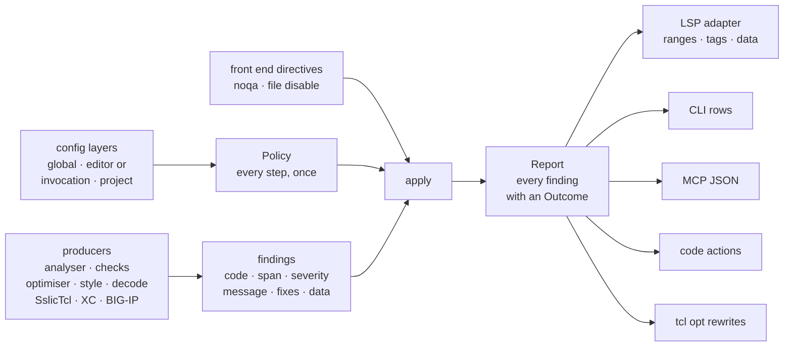

# Diagnostic policy — one owner below every surface

Where a finding's *policy* is applied: suppression directives, codes
disabled across the five documented scopes, default-off seeding, severity
overrides, the optimiser switch and profile, the shimmer switch, overlap
precedence, and encoding abstention. One shared pipeline runs from typed
producers through a single policy step to thin presentation adapters, so
parity between the editor, the CLI, the MCP tools and the code-action
provider is a property of the code rather than a checklist. This is the
design for [issue #2089](https://github.com/bitwisecook/tcl-lsp/issues/2089).
Read it before adding a diagnostic to a surface, before filtering a finding
anywhere but the policy step, and before promising that two surfaces report
the same set.

It is the second half of a pair. Issue #2020 gives the `# noqa` and
`# tcl-lsp: disable=` grammar one parser and one predicate
(`parse_noqa_marker`, `line_suppressed`), which settles what a directive
*means*. This page settles who *applies* it, along with every other policy
step, and what happens to a finding that loses: it stays in the report with
its reason, so "why is this not firing" has one answer that every surface
can read. [diagnostics-integration.md](diagnostics-integration.md) and
[diagnostics-calculation.md](diagnostics-calculation.md) describe the
aggregation and the two tiers inside the server; this page is the layer
below both of them.

> **Status — being built, slice by slice.** The vocabulary is
> `tcl_lsp_core::diagnostic_policy` with `Finding`, `Producer`, `Fix`,
> `FindingData`, `Severity`, `Outcome`, `Reason`, `PolicyLayer`,
> `CodeDecision`, `Overlap`, `OverlapOwner`, `OverlapScope`,
> `OptimiserPolicy`, `Directives`, `Policy`, `Report` and `apply`; the
> relocated `tcl_lsp_core::config_ini`; the `--show-suppressed` CLI flag;
> and the `suppressed` array on an MCP diagnostic payload. A slice marked
> *built* in § Slices exists in the tree, and the module's own docs are the
> compilable form of the shapes it covers; every other Rust shape below is
> a sketch of the data a step needs, not a compilable signature. Until the
> adapter slices land, § Today still describes the observed surface
> behaviour except where a paragraph says otherwise. Every *existing*
> identifier and path cited here was checked against the tree at the head of
> `rust`, and the surface behaviour in § Today was observed with `tcl diag`,
> `tcl opt` and the `tcl-mcp` tools at that revision.

## Rules

1. **Policy has one owner below every surface.** Directive suppression,
   disabled codes, default-off seeding, severity overrides, the optimiser
   switch and profile, the shimmer switch, overlap precedence and encoding
   abstention are applied once, by one pure function every surface calls.
   No surface holds a second copy of any step.
2. **Producers emit findings and read no policy.** A producer converts its
   own typed finding into one `Finding` shape and filters nothing. A
   producer may skip its own private calculation when its code is disabled
   — the cost saving is real — but the decision is still recorded by the
   policy step, never lost inside the producer.
3. **A suppressed finding stays in the report with its reason.** `apply`
   keeps every finding and pairs it with an `Outcome`; it deletes nothing.
   The explanation of a hidden finding is data, not a re-run under
   different settings.
4. **Directive facts come from the front end once.** `# noqa` and
   `# tcl-lsp: disable=` are source facts, parsed where the source is
   parsed (`tcl_compiler::analyser`), and reach the policy step as inputs.
   No consumer re-scans the text for them.
5. **One precedence order, stated once.** The five scopes resolve in the
   order the KCS documents — inline, file, project, editor or invocation,
   global — and the order lives in one place. A surface's flags occupy the
   editor layer's slot; they do not invent a sixth scope. An optimiser
   profile a request names is not a scope at all but the request's own
   parameter (§ Configuration).
6. **Adapters render the report and decide nothing.** An adapter maps
   spans, names severities in its own vocabulary, and serialises. It never
   filters, never re-derives a severity, and never infers a fact from
   whether another finding survived policy.

## Today

Policy is assembled separately by every surface that reports a code. Each
has the subset its author reached for, so the same file yields a different
finding set on each surface.

| Policy step | Editor publish | `tcl diag` / `lint` / `validate` | `tcl opt`, MCP `optimize`, `optimiseDocument` | MCP `analyze` / `validate` / `review` / `find-legacy` | Server code actions |
|---|---|---|---|---|---|
| Inline `# noqa` | yes | yes | no | no | yes |
| File `# tcl-lsp: disable=` | yes | yes | no | analyser codes only | yes |
| Codes disabled at the surface | editor settings | `--disable` / `--enable` | `--disable` / `--enable` (`tcl opt` only) | none | editor settings |
| Project `.tcl-lsp.ini`, global `config.ini` | yes | no | no | no | yes |
| Default-off seeding (`DEFAULT_OFF_CODES`, W242) | yes | no | n/a | no | yes |
| Severity overrides | yes | no | n/a | no | n/a |
| LSP tags (`DiagCode::lsp_tag`) | yes | n/a | n/a | no | n/a |
| Optimiser master switch | yes | n/a | `optimiseDocument` no; others n/a | n/a | n/a |
| Optimiser profile and per-code set | yes | O-codes dropped whole | profile yes, `optimiseDocument` no | n/a | on the diagnostic's `data` |
| Shimmer switch (`tclLsp.shimmer.enabled`) | yes | no | n/a | no | no |
| Overlap owners (W110 over O120; SslicTcl over W123) | yes | SslicTcl only | n/a | no | SslicTcl only |
| Encoding abstention (byte evidence) | yes | yes | no | n/a | no |
| `diagnostics.exclude`, `features.diagnostics` | yes | no | no | no | no |
| Compiler checks (S1xx, T1xx, IRULE1xxx–5xxx, GVN, SCCP) | yes | yes | n/a | no | yes |
| Source-style pass (W111, W112, W115, W118) | yes | yes | n/a | no | n/a |
| `genericVariablePatterns` (producer input, not policy) | yes | no | n/a | no | yes |

Four cells deserve their exact reading. The MCP tools report the file
directive for analyser codes because `Analyser::analyse` folds
`parse_file_suppression` into its own `disabled_diagnostics` before it
emits anything, so the effect arrives through the producer rather than
through any policy the tool applies; the inline `# noqa` has no such
back door, and an MCP `analyze` reports a W100 or a W110 that `tcl diag`
suppresses on the same file. The encoding row is `n/a` for the MCP tools
because those tools take a decoded `source` string and have no byte
report to abstain on. `tcl opt` and MCP `optimize` rewrite the source
across a file-wide `# tcl-lsp: disable=*`, because neither builds a
suppression map at all. And the server lifts no optimiser code action at
all: an actionable rewrite rides the published diagnostic's `data`
(`replacement`, `startOffset`, `endOffset`), so it inherits that
diagnostic's policy and the code-action provider never sees it — which is
also why an O-code carries no gate of its own on any other surface.

The MCP `code_actions` tool is not in the last column because it shares
none of it: it passes `analysis.diagnostics` straight into
`tcl_lsp_core::code_actions::code_actions`, whose own documentation
describes that argument as the *published* set. A fix for a finding an
inline `# noqa` silences is therefore offered there and nowhere else.

W107, W109 and W118 are never line-suppressed on any surface. That is
deliberate and stays: they are whole-file verdicts, so an inline
directive has no line to attach to, and only the file directive and the
disabled set gate them (`WHOLE_FILE_CODES` in
`rust/tcl-lsp-core/src/diagnostic_policy.rs`, since slice 3; the style
pass no longer decides it).

### Where each step lives

**Server** — `rust/tcl-lsp-server/src/lib.rs`: `lift_analyser_diagnostics`,
`lift_compiler_diagnostics` (optimiser gate, disabled set, directives),
`lift_source_style_diagnostics`, `lift_style_diagnostics`,
`lift_f5_source_integrity_diagnostics`, `lift_xc_diagnostics`,
`extend_with_sslictcl_diagnostics`, `append_brace_expr_perf_hints` (O111
synthesised from every W100 that survived the analyser lift),
`suppress_duplicate_o120`, `finalise_diagnostics`
(`apply_encoding_abstention`, `apply_diagnostic_tags`,
`apply_severity_overrides`), `retain_unsuppressed_diagnostics`,
`default_disabled_set` over `DEFAULT_OFF_CODES`,
`settings_disabled_diagnostics`, `resolved_analysis_settings` (which folds
the shimmer switch and the optimiser profile into two sets). The fast tier
(`publish_fast_tier`), the deep push (`refine_and_lift_diagnostics`) and
the pull provider (`analysed_diagnostics_for`) each assemble the list in
their own body; `tcl-lsp.optimiseDocument`
(`optimise_document_command`) assembles none. Since slice 2 the INI parse,
the three-layer merge, `DEFAULT_OFF_CODES`, `default_disabled_set`,
`settings_disabled_diagnostics`, `settings_severity_overrides` and
`parse_severity_value` live in `rust/tcl-lsp-core/src/config_ini.rs`; the
server re-exports the module, keeps `read_ini_layer`, and keeps an
LSP-typed `settings_severity_overrides` over the shared parse.

**tcl-lsp-db** — `rust/tcl-lsp-db/src/lib.rs`: `file_analysis` and
`file_analysis_incremental` bake the disabled set into
`Analyser::with_disabled_diagnostics`, so the analyser applies policy at
production while the compiler checks have it applied at lift;
`compiler_check_diagnostics` reads no disabled set at all;
`project_diagnostics` and `apply_project_callback_arity` take an
`is_disabled` predicate.

**CLI** — `rust/tcl-cli/src/commands/diag.rs`: `collect_rows` (analyser
walk, `run_all_checks` minus O-codes, the SslicTcl projection, the
source-style pass, `abstained_rows`) and `resolve_disabled` (flags only,
no seeding). `rust/tcl-cli/src/commands/transform.rs`: `run_opt` calls
`optimise_source_multipass_filtered` with the profile set and builds no
suppression map.

**MCP** — `rust/tcl-mcp/src/tools.rs`: `analyse` is
`Analyser::new().with_pack_overlay(..).analyse(..)`; `analyze`,
`validate`, `review`, `find_legacy` and `code_actions` read
`analysis.diagnostics` raw; `optimize` holds its own copy of the
profile-to-disabled construction and calls
`optimise_source_multipass_filtered` directly.

**tcl-lsp-core** — since slice 3, `source_style::style_diagnostics` and
`sslictcl_diagnostics::diagnostics` filter nothing, and no caller of
`source_decode::encoding_integrity_diagnostics` filters its output with a
closure of its own: the server's style, SslicTcl and F5-integrity lifts
and the CLI's style, SslicTcl and abstention rows hand those findings to
`diagnostic_policy::apply` under `Policy::from_disabled_set` — their
already-flat disabled set plus the analyser's directive map — and render
what it shows. `code_actions::check_diagnostic_actions` still applies the
disabled set and the directives for the compiler-check family.

**tcl-compiler** — `rust/tcl-compiler/src/analyser/utils.rs`:
`line_suppressed`, `parse_noqa_marker`, `parse_file_suppression`,
`parse_noqa_line_suppressions_for_dialect`, `apply_preceding_noqa` and
`FILE_SUPPRESS_KEY` build and answer `AnalysisResult::suppressed_lines`.

### The five scopes and their order

[`docs/kcs/kcs-howto-suppress-diagnostics.md`](../../kcs/kcs-howto-suppress-diagnostics.md)
documents five places to turn a code off and, under
[Precedence, from highest priority to lowest](../../kcs/kcs-howto-suppress-diagnostics.md#precedence-from-highest-priority-to-lowest),
one order: inline `# noqa`, top-of-file `# tcl-lsp: disable=`, project
`.tcl-lsp.ini`, editor settings, global `config.ini`. The three
configuration layers and their rationale are the
[config precedence contract](../contracts/config-precedence.md), whose
[precedence table](../contracts/config-precedence.md#precedence-lowest-to-highest)
is the same order read upward. Two properties of that contract are load
bearing here: the merge is per key inside each section, and project, editor
and global can each turn a code **back on**, so a layer's contribution is a
per-code tri-state and not a set union. A flat disabled set cannot express
"the project enables what the global file disabled", and cannot name the
layer that decided.

### Why the copies exist

[pass-fact-ownership-matrix.md](pass-fact-ownership-matrix.md) assigns
"final LSP diagnostic projection, suppression policy" to `tcl-lsp-db`, and
the configuration parser lives in `tcl-lsp-server`. Neither crate is in
the dependency closure of `tcl-cli`, `tcl-cli-support` or `tcl-mcp`: all
three reach `tcl-lsp-core` and stop there, while `tcl-lsp-db` and
`tcl-lsp-server` sit on the other side of it. Those surfaces cannot reach
the policy, so each copies what it can, which is the shape every "no" in
the table above has. "Suppression is uniform" and "every lift applies
it", in [diagnostics-integration.md](diagnostics-integration.md) and
[diagnostics-calculation.md](diagnostics-calculation.md), are true of the
server and of nothing else. Putting the policy in `tcl-lsp-core` is the
whole of the placement argument: it is already below all four surfaces
and `tcl-lsp-db`, and already hosts the style pass, the decode report,
the SslicTcl projection and the code actions.

## The pipeline



Four stages, in order.

1. **Producers emit typed findings and read no policy.** One `Finding`
   shape with `From` conversions from every diagnostic type in the tree.
2. **Directive facts come from the front end once.** The analyser's
   `suppressed_lines` map is the input; a surface with no analyser run
   scans once through the same helpers.
3. **One policy value and one pure function.** `Policy` holds every step
   in the table; `apply(findings, &policy) -> Report` keeps every finding
   with an outcome.
4. **Adapters render the report.** LSP ranges, tags and `data`; CLI rows;
   MCP JSON; code actions and `tcl opt` act only on shown findings.

### The finding

```rust
/// One producer's finding, before any policy.
pub struct Finding {
    /// The code, as the one catalogue spells it.
    pub code: DiagCode,
    /// Byte offsets in the *analysis form* of the text (lone `\r`
    /// rewritten), which is what every producer reads.
    pub span: Span,
    /// The producer's default severity. Policy may relabel it; the
    /// producer never chooses the displayed one.
    pub severity: Severity,
    pub message: String,
    /// Edits whose range is independent of `span`.
    pub fixes: Vec<Fix>,
    /// The extra payload an adapter may need.
    pub data: Option<FindingData>,
    /// Which producer emitted it — for the report's explanation and for
    /// the overlap table, never for ranking.
    pub producer: Producer,
}

pub enum Producer {
    Analyser,
    CompilerCheck,
    Optimiser,
    SourceStyle,
    SourceDecode,
    SslicTcl,
    Xc,
    BigipModel,
}

pub struct Fix {
    /// Zero-width for an insertion.
    pub span: Span,
    pub new_text: String,
    pub description: String,
    pub safety: FixSafety,
}

pub enum FindingData {
    /// An optimiser rewrite. `group` is the all-or-nothing edit group;
    /// `hint_only` marks a finding whose span covers the consuming
    /// statement, so its replacement must never be advertised as
    /// auto-appliable.
    Rewrite {
        replacement: String,
        group: Option<u32>,
        hint_only: bool,
    },
    /// A style fix already expressed as a document range.
    StyleFix { fix: StyleFix },
}
```

`Severity` is the shared five-value ladder the analyser and the compiler
checks already agree on — `Error`, `Warning`, `Info`, `Hint`, `Suggestion`
— which `tcl_compiler::analyser::Severity` and
`tcl_compiler::compiler_checks::Severity` both re-export from
`tcl_core_types::Severity` and carry over unchanged; the tree's three
narrower severity enums map into it on conversion:
`source_style::StyleSeverity` as `Warning` / `Hint`;
`f5_xc::XcSeverity` as `Hint` / `Info`;
`tcl_bigip::validator::DiagSeverity` as `Warning` / `Hint`. Naming an LSP
`DiagnosticSeverity` is the LSP adapter's job and happens nowhere else;
naming `error` / `warning` / `info` / `hint` for a CLI row is the row
adapter's.

### The conversions

Seven producer *types* exist in the tree, not five: the issue's list omits
the BIG-IP model validator, and the SslicTcl projection already lands on
the analyser's shape rather than carrying one of its own. The
byte-integrity producer is an eighth *producer* sharing the style pass's
type, which is why `Producer` and the type are separate axes.

| Producer type | Where | Conversion |
|---|---|---|
| `tcl_compiler::analyser::Diagnostic` | `rust/tcl-compiler/src/analyser/types.rs` | `From` — `code`, `span`, `severity`, `message`, `fixes` are already one to one |
| `tcl_compiler::compiler_checks::Diagnostic` | `rust/tcl-compiler/src/compiler_checks.rs` | `From` — `category` is dropped, `replacement` becomes a same-span `Fix` |
| `tcl_compiler::optimiser::Optimisation` | `rust/tcl-compiler/src/optimiser/mod.rs` | `From` — `severity` is `Hint`, `replacement` / `group` / `hint_only` become `FindingData::Rewrite` |
| `tcl_lsp_core::source_style::StyleDiagnostic` | `rust/tcl-lsp-core/src/source_style.rs` | conversion, not `From`: its `LspRange` needs the document's line index to become a `Span` |
| `tcl_lsp_core::source_decode` findings | `rust/tcl-lsp-core/src/source_decode.rs` | the same conversion — `encoding_integrity_diagnostics` returns `StyleDiagnostic` with `producer: SourceDecode` |
| `tcl_sslictcl::dsl::DslDiagnostic` | projected by `rust/tcl-lsp-core/src/sslictcl_diagnostics.rs` | the projection keeps its span and gains `producer: SslicTcl`; it stops filtering |
| `f5_xc::XcDiagnostic` | `rust/f5-xc/src/diagnostics.rs` | conversion on the XC side: `tcl-lsp-core` does not depend on `f5-xc`, and must not, so `f5-xc` gains the conversion and the shared crate stays below it |
| `tcl_bigip::validator::ConfigDiagnostic` | `rust/tcl-bigip/src/validator.rs` | conversion in `tcl-lsp-core`, which already depends on `tcl-bigip`; its inclusive range end is normalised here rather than at each lift |

One of those carries a `String` code rather than a `DiagCode`:
`ConfigDiagnostic::code`, whose `TryFrom` conversion fails on a spelling
the catalogue lacks. `XcDiagnostic::code` and `StyleDiagnostic::code` were
strings too; slice 1 typed both as `DiagCode` and gave `XcDiagnostic` the
byte span its range was resolved from, so their conversions are total.
`XC100`–`XC301` joined the `diagnostic_codes!` table in
`rust/tcl-core-types/src/diag_code.rs` in the same slice, with their own
`DiagSection::Xc` — thirteen codes, the set the translator emits rather
than a contiguous range. `Finding::code` is a `DiagCode` because one code
space is what makes the disabled set, the severity overrides, the tag
table and the overlap table one mechanism each, and an unparseable code
is a conversion failure rather than a value that silently skips every
table.

### The outcome

```rust
pub enum Outcome {
    /// The finding shows. `severity` is the producer's default with the
    /// user's override applied; `tag` comes from the code table.
    Shown {
        severity: Severity,
        tag: Option<DiagTag>,
    },
    Suppressed(Reason),
}

pub enum Reason {
    /// The whole document reports nothing: `features.diagnostics` is off.
    ReportingOff,
    /// `diagnostics.exclude` matches this file.
    Excluded,
    /// The bytes are not UTF-8 text, so only the integrity codes stand.
    EncodingAbstention,
    /// An inline `# noqa` on the command, at this 0-based line.
    InlineDirective { line: i32 },
    /// A top-of-file `# tcl-lsp: disable=`.
    FileDirective,
    /// A configuration or flag layer turned the code off.
    Disabled(PolicyLayer),
    /// The code is default-off and nothing turned it on.
    DefaultOff,
    /// The optimiser master switch is off.
    OptimiserOff,
    /// The active profile does not enable the code's category.
    OptimiserProfile { profile: OptimisationProfile },
    /// `tclLsp.shimmer.enabled` is off.
    ShimmerOff,
    /// Another code owns this site.
    Overlap { owner: DiagCode },
}

/// Which scope decided a code, lowest first. Distinct from
/// `config_ini::Layer`, which names the *file role* of one INI parse
/// (`[global]` versus `[project]`) and has no editor or invocation
/// spelling to name.
pub enum PolicyLayer {
    Global,
    /// Editor settings, or a surface's own flags — one slot, two
    /// spellings. See § Configuration.
    Editor,
    Invocation,
    Project,
}

pub struct Report(pub Vec<(Finding, Outcome)>);
```

`Report` exposes `shown()`, `suppressed()` and `reason_for(code, span)`;
nothing else needs the pairs directly. The vector keeps the producers'
order, and `apply` is order-stable, so two surfaces given the same
findings and the same policy produce the same report in the same order.

`Reason` beyond the issue's list is the tree's doing: the optimiser
profile is a separate decision from the master switch, the shimmer switch
is a family gate with no other home, and `features.diagnostics` and
`diagnostics.exclude` make the whole report empty today with no record of
why. A `ReportingOff` report that still carries every finding is what lets
an editor answer "diagnostics are turned off for this file" instead of
showing a clean document.

### The policy

```rust
pub struct Policy {
    /// `features.diagnostics` for this file's folder.
    pub reporting: bool,
    /// Whether `diagnostics.exclude` matches this file.
    pub excluded: bool,
    /// Byte evidence, through `source_decode::should_abstain` — the
    /// shared predicate over `DecodeReport::requires_abstention` that no
    /// surface calls today. The codes that survive it are the integrity
    /// set, not a guess from whether W109 is displayed.
    pub abstain: bool,
    /// The resolved per-code decision and the layer that won it.
    /// A code absent from the map is enabled.
    pub codes: BTreeMap<DiagCode, CodeDecision>,
    /// The default-off seed — the lowest layer, and the reason a code
    /// still off at the bottom reports `DefaultOff` rather than
    /// `Disabled(Global)`.
    pub default_off: &'static [DiagCode],
    /// `tclLsp.diagnosticSeverity.<CODE>`.
    pub severity_overrides: BTreeMap<DiagCode, Severity>,
    pub optimiser: OptimiserPolicy,
    /// `tclLsp.shimmer.enabled`.
    pub shimmer: bool,
    /// Resolved for the document's dialect.
    pub overlaps: Vec<Overlap>,
    pub directives: Directives,
}

pub struct CodeDecision {
    pub enabled: bool,
    pub layer: PolicyLayer,
}

pub struct OptimiserPolicy {
    /// `tclLsp.optimiser.enabled`.
    pub enabled: bool,
    /// The profile in force: the one the request names, else the
    /// layers' (§ Configuration).
    pub profile: OptimisationProfile,
    /// The profile's disabled set with the per-code overrides applied,
    /// as `resolved_analysis_settings` builds it today.
    pub disabled: BTreeSet<DiagCode>,
}

pub struct Overlap {
    pub owner: OverlapOwner,
    pub superseded: DiagCode,
    pub scope: OverlapScope,
}

pub enum OverlapOwner {
    /// One code owns the site: W110 over O120.
    Code(DiagCode),
    /// A whole producer owns it: in a `.sslictcl` document the loader
    /// owns W123 whether or not it emitted a finding of its own, which
    /// is what `supersede_analyser_diagnostics` does unconditionally
    /// today.
    Producer(Producer),
}

pub enum OverlapScope {
    /// The owner wins only where the two ranges coincide, which is the
    /// W110 / O120 rule `suppress_duplicate_o120` implements.
    SameSpan,
    /// The owner wins everywhere in the document.
    Document,
}

pub struct Directives {
    /// The analyser's `suppressed_lines`: 0-based lines plus the
    /// `FILE_SUPPRESS_KEY` bucket. `Directives::from_analysis` for a
    /// surface that ran the analyser, `Directives::scan` for one that
    /// did not.
    pub lines: HashMap<i32, HashSet<String>>,
}

pub fn apply(findings: Vec<Finding>, policy: &Policy) -> Report;
```

`Policy` carries only what decides whether and how loudly a finding shows.
A setting that changes *what a producer computes* — `genericVariablePatterns`,
the non-ASCII mode, the style line length and expected line ending, the
extra commands, the pack overlay — is a producer input and stays on
`AnalyserConfig` and the producers' own arguments. That is rule 1 of
[value-transfers.md § Diagnostics consume facts](value-transfers.md#diagnostics-consume-facts)
read as a type: display policy cannot change semantic truth, so the value
that carries display policy cannot carry a semantic input.

`apply` decides in one order, and the order is part of the contract because
the recorded reason depends on it. The first reason that fires wins:

1. `reporting`, then `excluded` — the document-wide gates.
2. `abstain` — everything but W107, W109 and W305 becomes
   `EncodingAbstention`. Ahead of the directives on purpose: when the
   positions in the file are decoding artefacts, "nothing here is
   analysed" is the honest explanation, and a directive that happens to
   cover the same code is not.
3. The inline directive, then the file directive, through
   `line_suppressed` against `policy.directives`.
4. The per-code decision: `Disabled(layer)` for the winning
   layer, or `DefaultOff` at the seed.
5. The family gates, for an optimisation code: `OptimiserOff`, then
   `OptimiserProfile`. Then `ShimmerOff` for the shimmer family.
6. The overlap table, over the findings still standing — so an owner that
   policy has already suppressed cannot supersede anything.
7. Everything left is `Shown { severity: overrides.get(code).unwrap_or(&
   finding.severity), tag: code.lsp_tag() }`.

## Configuration

The INI parse and the three-layer merge moved down from
`rust/tcl-lsp-server/src/config_ini.rs` into `tcl_lsp_core::config_ini`
(slice 2), beside the policy step, so the CLI and the MCP tools can resolve
the same layers. The whole module moved: `Layer` with `Layer::top_section`,
`settings_from_ini` and the `insert_*` helpers it delegates to
(`insert_diagnostics`, `insert_diagnostic_severity`, `insert_optimiser`,
`insert_formatting`, `insert_packages`, `insert_workspace_scan`,
`insert_iruleslx`), the private `parse_ini` / `section_value` /
`has_section` / `parse_comma_list` / `parse_path_list` / `parse_bool`
scanners, and `merge_settings`. Splitting the diagnostics sections out of
`settings_from_ini` would leave two parses of one file, which is exactly
the shape this design exists to remove. `rust/tcl-lsp-server/src/lib.rs`
keeps `read_ini_layer` (it holds the `vfs::SourceStore`) and the
`Backend::apply_global_config` path that applies a merged layer.

Four pieces of policy resolution moved with it, from
`rust/tcl-lsp-server/src/lib.rs`: `DEFAULT_OFF_CODES` and
`default_disabled_set`, `settings_disabled_diagnostics` (the nested and
flat-dotted shapes, and the `true` / `false` per-code tri-state),
`settings_severity_overrides` with `parse_severity_value`, and the
optimiser resolution `resolved_analysis_settings` performs over
`profile_to_disabled`. `PolicyBuilder` in `tcl-lsp-core` takes the
configuration **layers one at a time, lowest first** (`layer(PolicyLayer,
&json)`), rather than the merged JSON: only the unmerged layers can name
the layer that decided a code, which is what `Disabled(PolicyLayer)` and
the per-code tri-state need. It also takes the resolved dialect, the decode
report and the directives, and produces one `Policy`. A key a higher layer
sets to an unusable value (a non-boolean toggle, an unknown severity) resets
the lower layers' decision, which is what per-key merge-then-parse did.
The server's per-folder resolution stays in the server, because
longest-prefix matching over workspace folders is an LSP concept the CLI
has no counterpart for.

**The invocation layer.** A surface's own flags occupy the editor layer's
slot in the precedence order, under the project file and over the global
file, and are recorded as `PolicyLayer::Invocation` so the report can
say which one decided. For `tcl diag` / `lint` / `validate` and `tcl opt`
that is `--disable` and `--enable`; for the MCP tools it is the `disable`
and `enable` arguments. The flags
keep their current tri-state meaning — `--enable` turns a code back on,
which is what makes `--enable W242` reach a default-off code.

**A named profile is the request's own.** An optimiser profile the
invocation names — `tcl opt --profile`, the MCP `optimize` tool's
`profile`, the `tcl-lsp.optimiseDocument` command's argument — is the
profile in force, over the project file's `[optimiser] profile` and the
global file's, which apply only when the invocation names none
(`PolicyBuilder::requested_profile`; the owner's ruling of 2026-09-22).
The profile is a request parameter with a project default, not a layered
policy decision: a call that asks for `full` is asking for what `full`
does, and a project file that could overrule the request would leave the
argument no meaning wherever a project exists, while the project file
still decides every call that asks for nothing. The ruling moves that one
key only. The master switch and the per-code `optimiser.<CODE>` keys keep
the layer order above, so a project's `disabled = O101` or `enabled =
false` still stands under `--profile full`; and the editor's
`tclLsp.optimiser.profile` is the editor layer's value, under the project
file like every editor setting, because an editor echoes a setting's
default for a key the user never set
([config-precedence.md](../contracts/config-precedence.md)). Each surface
has its own default for a request that names nothing and a file that
names nothing: `full` for `tcl opt` and `optimize`, the editor's
`readability` for `optimiseDocument`. The profile in force sets the pass
count as well as the category set on all three — `aggressive` runs to a
fixpoint, every other profile once — so one profile means one thing
wherever it is asked for.

**Where the project file is.** Per input document, not per process. The
resolution walks the input file's own directory and its ancestors for
`tcl_lsp_core::tcl_install::PROJECT_CONFIG_FILENAME`, bounded the way
`find_project_root` in `rust/tcl-cli/src/commands/pkg.rs` bounds its walk
for `tclpkg.tcl`, and takes the first hit;
`tcl_install::project_config_path` names the file once the root is known.
`tcl diag a/x.tcl b/y.tcl` can therefore span two projects and resolve
each under its own layer. An
`InputDocument` with no `path` — `--source`, stdin, an MCP `source`
string — has no project layer at all, and the report says so rather than
silently using the process's working directory. The global layer is
`tcl_install::user_config_path()` on every surface.

**The default-off set.** `DEFAULT_OFF_CODES` moves into `tcl-lsp-core`
with the builder and becomes the seed of every surface's resolution, which
is what makes `tcl diag` stop reporting W242 on a file the editor shows
clean. It remains a code-table concern, not a policy-step constant: the
seed is a list of codes the catalogue declares opt-in.

## Adapters

Each adapter reads one `Report` and renders it. None of them decides
anything, and none of them may.

**LSP** — `rust/tcl-lsp-server/src/lib.rs`. What is left of the lifts and
`finalise_diagnostics`: `Span` to a UTF-16 `Range` through `lift_span`,
`Severity` to `DiagnosticSeverity`, `Outcome::Shown::tag` to
`Diagnostic.tags`, and `FindingData::Rewrite` to the `data` payload
(`replacement`, `startOffset`, `endOffset`) for an actionable rewrite and
to nothing for a `hint_only` one. It must not re-check a disabled set, a
directive, the optimiser switch or the overlap table; the three publish
paths become one call each on the same function. It may still choose to
publish only `shown()` — a client sees no suppressed finding unless it
asks.

**CLI rows** — `rust/tcl-cli/src/commands/diag.rs`. `collect_rows`
becomes a row adapter over `Report::shown()`: 1-based line and column from
the document's line index, `severity_label`, and the deterministic
`(line, column, code)` sort. `--show-suppressed` renders `suppressed()`
too, one row per finding with its reason, which is the CLI's answer to
"why is this not firing". `run_validate` filters on `Severity::Error`
over the report's shown set, never over raw producer output.

**MCP JSON** — `rust/tcl-mcp/src/tools.rs`. `analyze`, `validate`,
`review` and `find-legacy` read `shown()` instead of
`analysis.diagnostics`, keeping their own grouping (`diag_meta::meta`
categories, the security / taint / thread split, the convertible-code
table) which is presentation and stays theirs. Each payload gains a
`suppressed` array of `{code, range, reason}`, so an agent can see that a
finding exists and was suppressed rather than concluding the code is
clean.

**Code actions** — `rust/tcl-lsp-core/src/code_actions.rs`. The published
set that `code_actions` and `code_actions_in_program` already take as a
separate argument becomes `Report::shown()`, and
`check_diagnostic_actions` loses its `disabled` and `suppressed`
parameters along with the filtering they drive. The server's
`retain_unsuppressed_diagnostics` and the SslicTcl supersession inside
`published_analyser_diagnostics` go away with them. A fix is offered for a
shown finding and for no other, which closes the two gaps the current
split leaves: the MCP `code_actions` tool passes the analyser's raw set,
and an optimiser rewrite reaches the client only as a diagnostic payload,
so nothing offers it as an action a provider could reason about. An
`Outcome::Shown` finding carrying `FindingData::Rewrite` is a code action
like any other.

**`tcl opt`** — `rust/tcl-cli/src/commands/transform.rs`. `run_opt`
applies the rewrites carried by `shown()` findings only, in the same
multi-pass loop; a rewrite whose finding is suppressed is not applied, and
the stdout summary block lists what was applied rather than what the
optimiser found. The MCP `optimize` tool and the server's
`tcl-lsp.optimiseDocument` command take the same path, which is what makes
a `# noqa` mean the same thing to a rewrite as it does to a squiggle.

## Producers that change

**O111 becomes a producer.** `append_brace_expr_perf_hints` creates O111
by searching the already-lifted diagnostics for W100, so O111 fires only
where a W100 survived presentation policy — and it reads `optimiser_enabled`
and the optimiser disabled set itself to decide whether to run at all.
Both rules consume the same unbraced-expression fact. O111 becomes a
producer over that fact, emitting a `Finding` at the same span for every
unbraced expression, and policy decides both independently: disabling
W100 does not silence O111, and the optimiser gate reaches O111 in the
one place it reaches every other O-code.

**The style pass stopped applying the map** (slice 3).
`source_style::style_diagnostics` keeps its checks, its line
normalisation and its W118-reads-the-real-terminators rule, and lost its
`disabled` and `suppressed` parameters and the `enabled` /
`push_line_suppressed` closures. The "W107, W109 and W118 are not
line-suppressed" rule is `WHOLE_FILE_CODES` in the policy step, a
property of those codes stated once instead of living in one pass's
control flow.

**The SslicTcl projection stopped applying the map** (slice 3).
`sslictcl_diagnostics::diagnostics` lost its `disabled` and `suppressed`
parameters and returns every loader finding, as `Finding`s.
`SUPERSEDED_ANALYSER_CODES` is read as the dialect's
`Overlap { owner: Producer(SslicTcl), superseded: W123, scope: Document }`
entry by `dialect_overlaps`; `supersede_analyser_diagnostics` goes away
with the adapters that still call it (slices 4 and 5), and the
supersession is then visible as `Reason::Overlap` on a W123 rather than
as a silently missing finding.

**The XC lift and the F5 integrity lift stop filtering.**
`lift_xc_diagnostics` and `lift_f5_source_integrity_diagnostics` become
conversions; the second stops calling `parse_file_suppression` for itself,
which is the one place in the tree where a surface re-scans the source for
a directive the front end already parsed.

**The analyser keeps its production-time skip.** `file_analysis` passing
the disabled set into `Analyser::with_disabled_diagnostics` is rule 2's
permitted saving, and it stays: the analyser's emitters are the dominant
cost and a disabled expensive rule should not run. What changes is that
the skip is *declared* — the policy step is told which codes the producer
skipped and records `Disabled(layer)` for them, so a report never shows a
gap it cannot explain. The CLI's `Analyser::new()` and the MCP's
`Analyser::new()` gain the same seeded set for the same reason.

## The truth table

One table from `(program, policy)` to `Report`, in `tcl-lsp-core` beside
`apply`, is the parity gate. Each row is a small Tcl program, a `Policy`
built from a named configuration, and the expected set of
`(code, span, Outcome)` triples — every finding, shown and suppressed,
with its reason. The rows cover one case per `Reason` variant, the
precedence pairs that distinguish two reasons for the same finding (an
inline directive over a project enable; a project enable over a global
disable; a directive over the optimiser profile), the `*` wildcard in
both directive spellings, the `FILE_SUPPRESS_KEY` bucket, a default-off
code turned back on at each layer, both `OverlapScope` kinds, and an
abstaining document.

The table lives once and every adapter runs it. Each adapter test walks
the same rows, renders the report through that adapter, and asserts the
rendering matches the shown set: the LSP adapter's `Diagnostic` vector,
the CLI's rows in both the plain and `--show-suppressed` forms, the MCP
payload's `diagnostics` and `suppressed` arrays, the code-action
provider's offered fixes, and the text `tcl opt` emits. A surface that
forgets a policy step then fails on the row for that step rather than on
a reviewer noticing. The existing server unit tests that assert a lift
honours a step — `lift_compiler_diagnostics_honours_inline_noqa_suppression`,
`lift_compiler_diagnostics_honours_optimiser_master_switch_and_per_code`,
`lift_source_style_diagnostics_honours_file_suppression`,
`apply_severity_overrides_relabels_only_listed_codes` — become rows in the
table, and the LSP adapter's pass over it is what they turn into.

## Slices

1. **`Finding`, `Outcome`, `Reason`, `Report` in `tcl-lsp-core`**, with the
   conversions from every producer type in § The conversions. New module
   `rust/tcl-lsp-core/src/diagnostic_policy.rs`; `From` impls beside it,
   except the XC one in `rust/f5-xc/src/diagnostics.rs`. `XC100`–`XC301`
   join the `diagnostic_codes!` table in
   `rust/tcl-core-types/src/diag_code.rs` first, with their own
   `DiagSection`. Nothing calls the module yet. *Built.*
2. **Move the INI parse and the three-layer merge**
   `rust/tcl-lsp-server/src/config_ini.rs` →
   `rust/tcl-lsp-core/src/config_ini.rs`, with `DEFAULT_OFF_CODES`,
   `default_disabled_set`, `settings_disabled_diagnostics`,
   `settings_severity_overrides` and `parse_severity_value` from
   `rust/tcl-lsp-server/src/lib.rs`. Add the `Policy` builder. *Built.*
3. **`apply`.** The step order above, in `tcl-lsp-core`. Producers stop
   applying policy themselves: `source_style::style_diagnostics`,
   `sslictcl_diagnostics::diagnostics`,
   `source_decode::encoding_integrity_diagnostics`'s callers. *Built* —
   the callers on the server and the CLI hand those findings to `apply`
   under `Policy::from_disabled_set`, which keeps each surface's
   behaviour until its adapter slice replaces it.
4. **Server: the LSP adapter.** `publish_fast_tier`,
   `refine_and_lift_diagnostics` and `analysed_diagnostics_for` in
   `rust/tcl-lsp-server/src/lib.rs` each call one function; the lifts,
   `finalise_diagnostics`, `suppress_duplicate_o120` and
   `retain_unsuppressed_diagnostics` become the adapter or disappear.
   `tcl-lsp.optimiseDocument` joins the same path.
5. **CLI.** `collect_rows` in `rust/tcl-cli/src/commands/diag.rs` becomes
   the row adapter; `resolve_disabled` becomes the invocation layer over
   the seeded set; the project and global layers resolve per input file
   (closes #2063). `run_opt` in
   `rust/tcl-cli/src/commands/transform.rs` applies only shown rewrites,
   and stops folding several inputs into one `combine_sources` text when
   their policies differ (closes #2062).
6. **MCP.** `analyze`, `validate`, `review`, `find-legacy`, `optimize`
   and `code_actions` in `rust/tcl-mcp/src/tools.rs` read the report;
   the diagnostics tools gain a `disable` argument (closes #2061).
7. **Code actions.** `check_diagnostic_actions` and `code_actions` in
   `rust/tcl-lsp-core/src/code_actions.rs` lift fixes from shown findings
   only and lose their filtering parameters; a shown finding carrying
   `FindingData::Rewrite` becomes an offerable action instead of only a
   diagnostic payload.
8. **O111 as a producer** over the unbraced-expression fact;
   `append_brace_expr_perf_hints` in
   `rust/tcl-lsp-server/src/lib.rs` goes away.
9. **The truth table**, plus `--show-suppressed` on `tcl diag` / `lint`
   and the `suppressed` array on the MCP payloads.
10. **Owner docs.** [diagnostics-integration.md](diagnostics-integration.md)
    and [diagnostics-calculation.md](diagnostics-calculation.md) point at
    the policy step instead of describing the server's lifts;
    [pass-fact-ownership-matrix.md](pass-fact-ownership-matrix.md)'s
    `tcl-lsp-db` row loses "suppression policy";
    [shared-utility-contracts-rust.md](../contracts/shared-utility-contracts-rust.md)'s
    consumer list becomes one consumer;
    [config-precedence.md](../contracts/config-precedence.md) records that
    the layers resolve in `tcl-lsp-core` and that a surface's flags are
    the editor layer; and
    [kcs-howto-suppress-diagnostics.md](../../kcs/kcs-howto-suppress-diagnostics.md)
    can finally promise the five scopes on every surface, and document
    `--show-suppressed`.

## Failure modes

- A new surface reads a producer directly and reports findings nobody
  turned on. The truth table cannot catch a caller it does not know
  about; the producers' loss of their own filtering is what makes the
  mistake visible, because a raw read shows suppressed findings.
- A producer that skips its calculation without declaring the skip. The
  report then has a gap with no reason, which reads as "clean" — the one
  outcome this design exists to prevent.
- Two reasons true for one finding and the order changed. The shown set is
  unaffected, so only the explanation regresses, which no assertion about
  visibility catches. The order is contract, and the truth table's
  precedence-pair rows are its gate.
- A flat disabled set reintroduced in the builder, which silently drops
  the layers' ability to turn a code back on and leaves
  `Disabled(PolicyLayer)` naming the wrong layer.
- An adapter that filters "just this once" — an O-code an editor does not
  want, a code family a tool considers noise — which is the shape every
  cell of § Today started as.
- Policy applied at production for a fact another consumer needs. The
  analyser's production-time skip is safe only because its findings are
  not read as facts; extending the same shortcut to a pass whose output
  feeds the optimiser or a summary breaks rule 1 of
  [value-transfers.md § Diagnostics consume facts](value-transfers.md#diagnostics-consume-facts).

## Anchors

- `rust/tcl-lsp-server/src/lib.rs` — `lift_analyser_diagnostics`,
  `lift_compiler_diagnostics`, `lift_source_style_diagnostics`,
  `lift_style_diagnostics`, `lift_f5_source_integrity_diagnostics`,
  `lift_xc_diagnostics`, `extend_with_sslictcl_diagnostics`,
  `append_brace_expr_perf_hints`, `suppress_duplicate_o120`,
  `finalise_diagnostics`, `apply_encoding_abstention`,
  `apply_diagnostic_tags`, `apply_severity_overrides`,
  `retain_unsuppressed_diagnostics`, `DEFAULT_OFF_CODES`,
  `default_disabled_set`, `settings_disabled_diagnostics`,
  `resolved_analysis_settings`, `publish_fast_tier`,
  `refine_and_lift_diagnostics`, `analysed_diagnostics_for`,
  `published_analyser_diagnostics`, `check_actions`,
  `optimise_document_command`
- `rust/tcl-lsp-core/src/config_ini.rs` — `Layer`,
  `settings_from_ini`, `insert_diagnostics`,
  `insert_diagnostic_severity`, `insert_optimiser`, `merge_settings`,
  `DEFAULT_OFF_CODES`, `default_disabled_set`,
  `settings_disabled_diagnostics`, `settings_severity_overrides`,
  `parse_severity_value`
- `rust/tcl-lsp-core/src/diagnostic_policy.rs` — `Finding`, `Report`,
  `Policy`, `PolicyBuilder`, `Directives`, `dialect_overlaps`
- `rust/tcl-lsp-db/src/lib.rs` — `file_analysis`,
  `file_analysis_incremental`, `compiler_check_diagnostics`,
  `compiler_check_diagnostics_uncached`, `CompilerDiagnostics`,
  `project_diagnostics`, `apply_project_callback_arity`
- `rust/tcl-cli/src/commands/diag.rs` — `collect_rows`, `resolve_disabled`,
  `abstained_rows`, `style_rows`, `push_sslictcl_rows`
- `rust/tcl-cli/src/commands/transform.rs` — `run_opt`
- `rust/tcl-cli/src/commands/pkg.rs` — `find_project_root`, the bounded
  ancestor walk the CLI's project layer follows
- `rust/tcl-cli-support/src/input.rs` — `InputDocument`,
  `analysis_source`, `abstains_on_encoding`, `encoding_diagnostics`,
  `combine_sources`, `read_input_documents`
- `rust/tcl-mcp/src/tools.rs` — `analyse`, `analyze`, `validate`,
  `review`, `find_legacy`, `optimize`, `code_actions`
- `rust/tcl-lsp-core/src/code_actions.rs` — `code_actions`,
  `code_actions_in_program`, `check_diagnostic_actions`
- `rust/tcl-lsp-core/src/source_style.rs` — `style_diagnostics`,
  `StyleDiagnostic`, `StyleSeverity`, `StyleFix`, `DEFAULT_LINE_LENGTH`,
  `DEFAULT_LINE_ENDING`
- `rust/tcl-lsp-core/src/source_decode.rs` —
  `encoding_integrity_diagnostics`, `DecodeReport`,
  `requires_abstention`, `should_abstain`
- `rust/tcl-lsp-core/src/sslictcl_diagnostics.rs` — `diagnostics`,
  `applies_to`, `SUPERSEDED_ANALYSER_CODES`,
  `supersede_analyser_diagnostics`
- `rust/tcl-lsp-core/src/tcl_install.rs` — `user_config_path`,
  `project_config_path`, `PROJECT_CONFIG_FILENAME`
- `rust/tcl-compiler/src/analyser/utils.rs` — `line_suppressed`,
  `parse_noqa_marker`, `parse_file_suppression`,
  `parse_noqa_line_suppressions_for_dialect`, `apply_preceding_noqa`,
  `FILE_SUPPRESS_KEY`
- `rust/tcl-compiler/src/analyser/state.rs` —
  `Analyser::with_disabled_diagnostics`, `apply_disabled_diagnostics`
- `rust/tcl-compiler/src/analyser/types.rs` — `Diagnostic`, `CodeFix`,
  `FixSafety`, `AnalysisResult::suppressed_lines`
- `rust/tcl-compiler/src/compiler_checks.rs` — `Diagnostic`,
  `run_all_checks`, `run_all_checks_with_generic_patterns`
- `rust/tcl-compiler/src/optimiser/mod.rs` — `Optimisation`
- `rust/tcl-compiler/src/optimiser/manager.rs` —
  `optimise_source_multipass`, `optimise_source_multipass_filtered`
- `rust/tcl-compiler/src/optimiser/profiles.rs` — `OptimisationProfile`,
  `profile_to_disabled`, `DEFAULT_EDITOR_PROFILE`
- `rust/tcl-core-types/src/diag_code.rs` — `DiagCode`, `DiagSection`,
  `DiagTag`, `diagnostic_codes!`, `is_optimisation`, `lsp_tag`,
  `refined_by_workspace`
- `rust/f5-xc/src/diagnostics.rs` — `XcDiagnostic`, `XcSeverity`,
  `get_xc_diagnostics`
- `rust/tcl-bigip/src/validator.rs` — `ConfigDiagnostic`, `DiagSeverity`

## Related

- [diagnostics-integration.md](diagnostics-integration.md) — aggregation
  and the policy boundary inside the server; slice 10 rewrites its rules
  1, 2 and 5 against this page.
- [diagnostics-calculation.md](diagnostics-calculation.md) — the two
  tiers; slice 10 moves its Suppression section here.
- [pass-fact-ownership-matrix.md](pass-fact-ownership-matrix.md) — slice
  10 moves "suppression policy" off its `tcl-lsp-db` row.
- [async-diagnostics-tiering.md](async-diagnostics-tiering.md) — the
  scheduling this design does not touch.
- [downstream-pass-contracts.md](downstream-pass-contracts.md) — pass
  ownership and the overlap rules the overlap table encodes.
- [value-transfers.md](value-transfers.md) — rule 6 of
  [§ Diagnostics consume facts](value-transfers.md#diagnostics-consume-facts)
  is this page's premise; rule 1 is why `Policy` carries no producer
  input.
- [config-precedence.md](../contracts/config-precedence.md) — the three
  configuration layers, their order, and the per-key merge.
- [shared-utility-contracts-rust.md](../contracts/shared-utility-contracts-rust.md)
  — the `tcl-compiler` directive contract, whose consumer list this design
  reduces to one.
- [kcs-howto-suppress-diagnostics.md](../../kcs/kcs-howto-suppress-diagnostics.md)
  — the five scopes as users are promised them.
- [issue #2089](https://github.com/bitwisecook/tcl-lsp/issues/2089) — the
  tracking issue; #2020 (the directive parser and predicate), #2061 (the
  MCP tools), #2062 (`tcl opt` and suppression), #2063 (the CLI's
  configuration layers), and #1943 (the value axis, whose rule 6 this
  page discharges).
