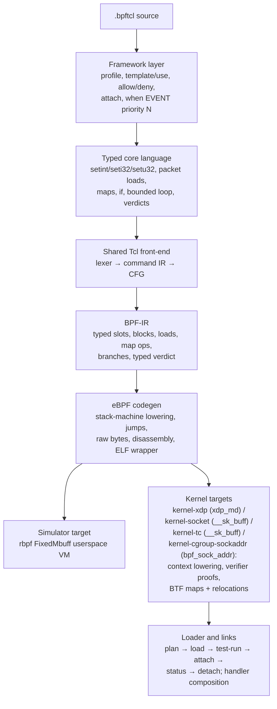

# BPF-Tcl eBPF backend architecture

> Experimental. The default target runs under the bundled `rbpf` harness. The
> `kernel-xdp`, `kernel-socket`, `kernel-tc`, and `kernel-cgroup-sockaddr`
> targets emit Linux-loadable objects, validated rootless with
> `readelf`/`llvm-objdump` and an in-repo verifier model. Genuine `bpf()`
> load, `BPF_PROG_TEST_RUN`, and attach need root and a live kernel, so they
> run only as `#[ignore]`d privileged tests (`rust/bpf-tcl/tests/kernel_load.rs`,
> `rust/bpf-tcl/tests/kernel_attach.rs`).

## Purpose

BPF-Tcl is a small, statically typed packet-programming language with Tcl
syntax. It is not a Tcl interpreter inside the kernel. The front-end accepts a
closed, verifier-friendly command set, lowers it to a dedicated BPF
intermediate representation, and emits eBPF instructions without LLVM.

The framework layer borrows the readable `when EVENT priority N { ... }` shape
from F5 iRules, but its events belong to a separate eBPF namespace: socket
filters, XDP, TC ingress/egress, and cgroup connect4/bind4 handlers.

## Layer map



The important boundary is BPF-IR. Framework conveniences expand into typed
core operations before CFG construction, and code generation depends only on
explicit BPF-IR semantics. A kernel target is a separate ABI flavour below
this boundary, not a collection of kernel special cases in the framework.

## Layer 1: low-level eBPF code generation

`bpf-tcl-codegen/src/ebpf/` implements an instruction encoder, a two-pass block
layout, a disassembler, a hand-written ELF64 relocatable-object writer, a BTF
writer, and an in-repo verifier model.

There are five execution ABIs, selected by
[`TargetAbi`](../../../rust/bpf-tcl-codegen/src/ebpf/emit.rs) and requested
on the CLI with `--target`:

| Target | Context | Packet `data`/`data_end` | Map ABI |
|---|---|---|---|
| `rbpf` (default) | `rbpf` metadata buffer | 64-bit words at ctx+0 / ctx+8 | by-value userspace helper ids 1/2/3 |
| `kernel-xdp` | `struct xdp_md` | 32-bit fields at ctx+0 / ctx+4 | BTF-defined maps + `bpf_map_*` helpers |
| `kernel-socket` | `struct __sk_buff` | 32-bit fields at ctx+76 / ctx+80 | BTF-defined maps + `bpf_map_*` helpers |
| `kernel-tc` | `struct __sk_buff` (SCHED_CLS) | as `kernel-socket` | BTF-defined maps + `bpf_map_*` helpers |
| `kernel-cgroup-sockaddr` | `struct bpf_sock_addr` | none — no packet body; `setbuf` is rejected | BTF-defined maps + `bpf_map_*` helpers |

`kernel-tc` accepts a program compiled for either `TC_INGRESS` or `TC_EGRESS`
(attach direction is a `tc filter add ... ingress|egress` loader concern; both
share one `__sk_buff` context and one `SEC(tc)` convention). Likewise
`kernel-cgroup-sockaddr` accepts either `CGROUP_CONNECT4` or `CGROUP_BIND4`
(the attach point is chosen at `bpftool cgroup attach` time).

All targets share one lowering strategy:

1. A prologue loads `data` into callee-saved `r6` and `data_end` into `r7` (a
   verdict-only kernel program that never touches the packet skips the
   prologue entirely).
2. Every BPF-IR slot owns one eight-byte eBPF stack location.
3. Each instruction reloads operands into scratch registers, computes, and
   writes back to the stack.
4. A second pass resolves block IDs to signed 16-bit relative jumps and records
   map-fd relocations.

**Context and packet access.** Under a kernel target the prologue reads the
32-bit `data`/`data_end` context fields, which the verifier rewrites into a
`PTR_TO_PACKET` / `PTR_TO_PACKET_END`. Every packet load emits a dominating
bounds proof before the dereference:

```text
r2 = r6                 ; r6 holds the packet pointer (data)
r2 += off + width       ; one past the field
if r2 <= r7 goto +2     ; in bounds → skip the OOB return
r0 = <oob verdict>; exit
r2 = *(width *)(r6 + off)
```

Because the compared register (`r2 = r6 + C`) and the load base (`r6`) share a
packet-pointer id, proving `r6 + C <= data_end` teaches the verifier that
`r6 + off` (with `off < C`) is in bounds — the canonical direct-packet-access
idiom. The out-of-bounds verdict is the program type's drop value
(`XDP_DROP` / socket `0` / TC `TC_ACT_SHOT`). Multi-byte fields are converted
with `BPF_END` according to the field's declared byte order. A cgroup
sock-addr program never reaches this path: `bpf_sock_addr` has no packet body,
so `lower.rs` rejects `setbuf` for that program-type family before any
packet-load instruction could be emitted.

**Maps.** A kernel map operation spills its integer key (and, for a store, its
value) into stack scratch cells above the slot region, loads the map file
descriptor with a pseudo `ld_imm64` (`src = BPF_PSEUDO_MAP_FD`, immediate zero),
and calls `bpf_map_lookup_elem` / `bpf_map_update_elem`. Each pseudo map-fd load
is recorded as a relocation the ELF writer emits against the map's symbol, so
libbpf patches in the real fd at load time. A lookup result is null-checked
before its value is read.

**BTF-defined maps and relocations.** The ELF writer emits a BTF-defined `.maps`
section (each map a global object symbol over a zero-filled struct variable), a
`.BTF` section describing each map's type/key-size/value-size/max-entries via the
array-encoded libbpf form, and a `.rel<prog>` section with one `R_BPF_64_64`
entry per map-fd load. `map_flags`, per-CPU map types, and array vs hash all flow
from the typed `MapDef`. `readelf` and `llvm-objdump` parse the object, and the
relocations name the map symbols.

**Verifier model.** `verifier.rs` is a rootless structural checker of the safety
invariants the kernel verifier enforces on our own output: exit reachability,
correct context-field prologue, a dominating `data_end` proof before every
packet dereference, a relocation for every pseudo map-fd load, and in-range
stack accesses. It is *not* the kernel verifier — genuine `bpf()` acceptance is
the separate `#[ignore]`d privileged test — but it catches a codegen regression
that would make the kernel reject a program, without needing root.

The `rbpf` simulator target keeps `data`/`data_end` as 64-bit metadata words
and passes map keys/values by value. `bpf-tcl compile --emit elf` defaults to
the `rbpf` object; kernel objects are requested with `--target kernel-xdp`,
`--target kernel-socket`, `--target kernel-tc`, or
`--target kernel-cgroup-sockaddr`. No target attaches from the `compile`
subcommand — attachment is the loader's job (see *Loader and link lifecycle*).

## Layer 2: typed low-level language and BPF-IR

The low-level language is deliberately closed. Its 26 registered commands,
including `next` (the explicit non-terminal composition outcome), are:

| Group | Commands | Meaning |
|---|---|---|
| Typed scalars | `setint`, `seti32`, `setu32` | Evaluate integer expressions and commit a 64-, signed 32-, or unsigned 32-bit value. |
| Packet context | `setbuf`, `pktlen`, `load8`, `load16`, `load32` | Bind the packet, inspect its length, and read fixed-width fields at constant offsets (with an optional `be`/`le`/`native` byte-order word). |
| State | `map`, `map_get`, `map_has`, `map_set` | Declare and access userspace-emulated integer-to-integer maps; `map_has` distinguishes a missing key from a stored zero. |
| Control flow | `if`, `loop` | Branch, or expand a literal-count loop up to 64 iterations before CFG construction. |
| Socket verdicts | `accept`, `drop` | Return an accepted byte count or zero (`SOCKET_FILTER` only — the one event outside `BpfProgTypeSet::PASS_LIKE`). |
| Pass-like verdicts | `pass`, `drop`, `tx` | `pass`/`drop` are shared by every `BpfProgTypeSet::PASS_LIKE` event (XDP, TC ingress/egress, cgroup connect4/bind4), each returning its own program type's wire value (`XDP_PASS`/`TC_ACT_OK`/allow and `XDP_DROP`/`TC_ACT_SHOT`/deny); `tx` (`XDP_TX`) is XDP-only. |
| Composition | `next` | Explicit non-terminal continuation: end a path without a decision so the next handler in priority order runs. |
| Framework | `when`, `profile`, `field`, `template`, `use`, `allow`, `deny`, `attach` | Declare handlers and expand policy/configuration conveniences. |

Expressions support signed integer arithmetic, bitwise operations, shifts, and
numeric comparisons. Dynamic Tcl values, strings, command substitution,
procedures, namespaces, coroutines, event loops, native `while`/`for`, file or
socket I/O, and arbitrary commands are rejected.

**The registry is the source of truth.** Every command spec in `tcl-registry`
carries a typed `BpfOpSpec` descriptor (`bpf_op` field) describing the core
operation or framework declaration it stands for — scalar width, packet-load
width, map role, verdict family and its compatible program types, and an
effect classification (packet read, map read/write, termination). The BPF-Tcl
front-end (`bpf-tcl-ir`) and its capability policy dispatch on this descriptor,
never on the command name. Adding a verb is a registry edit; a new command
without a descriptor fails the registry drift test rather than being silently
mishandled.

A `when` header must be exactly `when EVENT { body }` or `when EVENT priority
N { body }` — a non-integer or substituted priority, an unknown header
keyword, or a substituted event is a span-anchored error. A user `profile`
body accepts only `field` declarations. A handler path that reaches the end
without an explicit verdict is a `MissingVerdict` error, never a silent drop.

BPF-IR is a typed three-address CFG over mutable slots. It models constants
(including full 64-bit values via `lddw`), copies, integer operations, context
pointer/length acquisition, **checked** packet loads, map access, branches, and
verdict returns. A packet load (`Inst::Load`) carries a constant byte range,
width, byte order (`Native`/`Big`/`Little`), and an explicit out-of-bounds
action, so the failure semantics of a short packet are stated in the IR rather
than implied by a target's runtime. Maps carry a typed schema (kind, key/value
size, capacity, concurrency). After lowering, a liveness-based allocator
(`bpf-tcl-ir/src/alloc.rs`) re-colours the virtual slots so values with disjoint
live ranges share a stack slot, computes the exact zero-init set (only the
slots read before every write), and enforces the 64-slot / 512-byte cap
*after* reuse — reporting stack pressure with the source span of the first
value that no longer fits.

### Integer semantics

BPF-Tcl integers are signed 64-bit, but `/` and `%` follow eBPF's **signed
truncated-toward-zero** division (`BPF_SDIV` / `BPF_SMOD`), *not* Tcl's floor
division. The two agree for same-sign operands and diverge only when exactly
one operand is negative (`-7 / 2` is `-3` here, `-4` in Tcl). This narrower,
verifier-native contract is deliberate; the front-end does not pretend to be
Tcl. `>>` is arithmetic (sign-preserving).

## Layer 3: framework and event model

The framework processes declarations in this order:

1. collect one optional packet profile;
2. collect reusable templates;
3. collect the capability allow/deny policy;
4. find each `when` declaration and resolve its event type;
5. expand `use`, bounded `loop`, and named profile fields;
6. enforce capability policy over the expanded body;
7. build CFG and typed BPF-IR independently for each handler;
8. apply matching `attach` metadata; and
9. sort programs by ascending priority and event name.

### The event schema

Every event is a **typed registry contract** — a `BpfEventSpec` in
`tcl-registry/src/bpf_op.rs`, resolved by `bpf-tcl-ir::event` — not a
string-match arm. Each spec carries: canonical name + aliases; Linux program
type and ELF `SEC(...)` convention; a typed context (`struct` name + readable
fixed-offset fields with byte order); a permitted-capability set (packet read,
map read/write, ring-buffer output, context read); the verdict algebra
(permitted terminal verdicts + a **default verdict** applied when no handler
terminates); the `attach` parameter schema; minimum kernel / BTF / `bpf_link`
requirements; the output kind (packet decision, userspace record, or both); and
a codegen-readiness flag. `check` prints the resolved contract for each handler.

| Event | Alias | Context | Verdicts (+`next`) | Default | Target |
|---|---|---|---|---|---|
| `SOCKET_FILTER` | `SOCKET` | `__sk_buff` | `accept ?N?`, `drop` | `accept` | `kernel-socket` |
| `XDP` | — | `xdp_md` | `pass`, `drop`, `tx` | `pass` | `kernel-xdp` |
| `TC_INGRESS` | `TC` | `__sk_buff` | `pass`, `drop` | `pass` | `kernel-tc` |
| `TC_EGRESS` | — | `__sk_buff` | `pass`, `drop` | `pass` | `kernel-tc` |
| `CGROUP_CONNECT4` | — | `bpf_sock_addr` | `pass`, `drop` | `pass` | `kernel-cgroup-sockaddr` |
| `CGROUP_BIND4` | — | `bpf_sock_addr` | `pass`, `drop` | `pass` | `kernel-cgroup-sockaddr` |

### Handler composition

Multiple `when EVENT priority N { … }` handlers of one event compose into an
ordered **handler chain** (`bpf-tcl-ir::compose`):

- **lower priority numbers run first**, event name as a stable tiebreaker;
- **a terminal verdict stops the chain** — the first `accept`/`drop`/`pass`/`tx`
  decides;
- **continuation is explicit** — a handler continues only by ending a path with
  `next`, which lowers to a reserved continuation sentinel return
  (`CONTINUE_SENTINEL`);
- **each event declares its default** — if every handler yields `next`, the
  event's `default_verdict` applies;
- **ambiguous composition is rejected** — two handlers of one event sharing a
  priority have no deterministic order and are a hard `AmbiguousComposition`
  error.

These are the *source* semantics. The *deployment* semantics are a **verified
program chain**: each handler is compiled independently, and the chain is
evaluated by running the handlers in priority order and classifying each one's
return value with `Outcome::classify` — a dispatcher expressed in the loader
rather than fused into one object. Because the rules are pure over the
per-handler outcomes, composition is deterministic and unit-tested in userspace
(`bpf-tcl/tests/composition.rs` runs a two-handler deny/audit chain under
`rbpf`).

### Userspace event channel

Observability events emit **typed records** to userspace rather than a verdict.
`bpf-tcl-ir::ringbuf` defines a versioned record ABI (a fixed 16-byte
little-endian header carrying magic, ABI version, event type, payload length,
and a sequence number, followed by the schema's fields packed at their declared
widths and byte order), a `RecordSchema` generated from an event's context
fields, a bounded `RingBuffer` transport with explicit **loss accounting**
(records that do not fit are dropped whole and counted — the same
lossy-but-counted contract as the kernel `BPF_MAP_TYPE_RINGBUF` under
back-pressure), and a structured JSON/text consumer. A consumer rejects a record
whose magic or version it does not recognise, so the transport can evolve
without silently misreading old records
(`bpf-tcl/tests/observability.rs` exercises the whole producer → ring buffer →
JSON consumer path).

### Loader and link lifecycle

`bpf-tcl-ir::loader` models the deployment state machine
`plan → load → test-run → attach → status → detach`:

- `DeploymentPlan::from_module` builds a plan from a compiled module, giving each
  program a **unique, ownership-labelled pin path** under
  `/sys/fs/bpf/bpftcl/<deployment>/`;
- `load` verifier-loads every program (atomic: a partial failure unloads
  everything already loaded);
- `test-run` runs a supported program through `BPF_PROG_TEST_RUN` before any live
  attach;
- `attach` creates a pinned link per program (a partial failure rolls back only
  the links created in that call and stays in `Loaded`);
- `detach` removes **only** this deployment's owned resources and **refuses to
  touch a pin owned by anything else**;
- `status` reports the live programs, links, and pins.

Every kernel effect goes through the `KernelOps` trait. The lifecycle is
unit-tested deterministically over a `ModelKernel` (rollback, ownership refusal,
out-of-order rejection, no-leak cleanup) with **no kernel required**; the CLI
`plan` subcommand renders a dry-run plan. Real `bpf()`-syscall attachment is
exercised only by the `#[ignore]`d privileged tests
(`bpf-tcl/tests/kernel_attach.rs`), which run inside a disposable network
namespace that is torn down unconditionally so nothing leaks onto the host.

## Profiles, templates, capabilities, and deployment metadata

- Built-in profiles expose fixed-offset fields for Ethernet, IPv4, TCP, and
  UDP. Combined profiles assume Ethernet + a 20-byte IPv4 header with no VLAN
  tags or IPv4 options.
- User profiles declare their own fixed-offset 8-, 16-, or 32-bit fields.
- Templates are compile-time statement macros with integer bindings.
- `allow` restricts packet/map access verbs; `deny` can also prohibit verdicts.
  Enforcement happens after all macro and profile expansion.
- `attach KIND TARGET` is validated against handler types and printed by
  `check`, but code generation and execution ignore it.

## Current limitations

1. **Scoped configuration is not implemented.** Profiles, capability policy,
   and `attach` are one-per-file globals; a mixed-event file cannot give each
   event its own context and deployment settings. Ambiguous *composition*
   (duplicate priorities) is rejected.
2. **Fixed packet profiles do not parse protocols.** VLAN tags, variable IPv4
   header length, fragments, IPv6 extension headers, and tunnels invalidate
   hard-coded transport offsets.
3. **Tracepoint, kprobe, uprobe, and LSM events are not in the schema**, so
   there is no `when TRACEPOINT_...` surface to accept or reject.
4. **Live load and attach are gated, not automated.** Rootless tests cover the
   verifier model, structural ELF/BTF/relocation validation,
   network-byte-order fixtures, composition, ring-buffer records, and the
   loader state machine over a `ModelKernel`; genuine `bpf()` load,
   `BPF_PROG_TEST_RUN`, and link attachment are `#[ignore]`d. The cgroup
   attach test additionally needs `bpftool` and skips without it.

## What it is useful for

- Teach and inspect how a restricted event DSL becomes BPF-IR and eBPF.
- Unit-test packet decisions against synthetic byte arrays without root.
- Prototype profiles, templates, capability policies, and bounded state logic.
- Emit libbpf-loadable XDP, socket-filter, TC, and cgroup objects with real
  context access, verifier-safe packet bounds proofs, and BTF-defined maps,
  then inspect them with `readelf` / `llvm-objdump` or load them through the
  privileged `bpf()` gate.
- Drop known-bad L2/L3/L4 traffic before the host network stack (XDP), on a
  socket, or at the TC classifier; apply small allow/deny lists, including
  per-connection cgroup policy (`CGROUP_CONNECT4`/`CGROUP_BIND4`); count
  packets, flows, or connection attempts in persistent maps; implement simple
  SYN, UDP, or destination-port rate controls.

## Runnable examples

See [`samples/bpf-tcl/README.md`](../../../samples/bpf-tcl/README.md). The demo
userspace script builds `bpf-tcl`, checks and executes socket-filter and XDP
handlers, shows a stateful map, demonstrates priority/attach metadata, emits
assembly, and inspects a map-free ELF object. The separate kernel script
verifier-loads and test-runs the verdict-only XDP example without attaching it.
