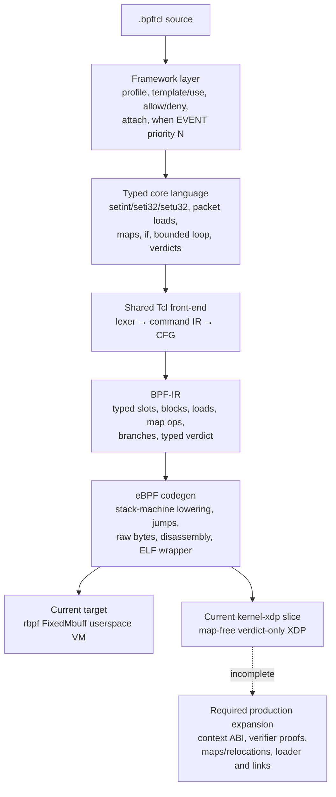

# BPF-Tcl eBPF backend architecture and production roadmap

> **Status:** Experimental dual-target backend, audited 2026-08-01.
> The default target runs under the bundled `rbpf` harness. The explicit
> `kernel-xdp` target now verifier-loads and test-runs map-free, verdict-only
> XDP handlers; packet access, maps, and live attachment remain future work.

## Purpose

BPF-Tcl is a small, statically typed packet-programming language with Tcl
syntax. It is not a Tcl interpreter inside the kernel. The front-end accepts a
closed, verifier-friendly command set, lowers it to a dedicated BPF
intermediate representation, and emits eBPF instructions without LLVM.

The framework layer borrows the readable `when EVENT priority N { ... }` shape
from F5 iRules, but its events belong to a separate eBPF namespace. Today that
namespace contains only socket filters and XDP packet handlers.

## Layer map



The important boundary is BPF-IR. Framework conveniences must expand into
typed core operations before CFG construction, and code generation must depend
only on explicit BPF-IR semantics. A kernel target should be a separate ABI
flavour below this boundary, not a collection of kernel special cases in the
framework.

## Layer 1: low-level eBPF code generation

`bpf-tcl-codegen/src/ebpf/` implements an instruction encoder, a two-pass block
layout, a disassembler, and a hand-written ELF64 relocatable-object writer.

The default `rbpf` emitter uses a simple and predictable strategy:

1. `r1` points to an `rbpf` metadata buffer containing 64-bit `data` and
   `data_end` pointers at offsets 0 and 8.
2. The prologue copies those pointers into callee-saved `r6` and `r7`.
3. Every BPF-IR slot owns one eight-byte eBPF stack location.
4. Each instruction reloads operands into scratch registers, computes the
   result, and writes it back to the stack.
5. A second pass resolves block IDs to signed 16-bit relative jumps.
6. Map operations call userspace helper IDs 1 and 2 with map indexes and
   integer keys and values passed by value.

This is a good reference backend: the mapping from BPF-IR to instructions is
easy to inspect, deterministic, and covered end to end under `rbpf`. Its packet
and map operations are not a Linux-kernel ABI:

- XDP's real context is `struct xdp_md`, whose `data` and `data_end` fields are
  32-bit offsets in the context, not 64-bit pointers at offsets 0 and 8.
- A socket filter receives `struct __sk_buff`; it does not share the XDP direct
  packet-access ABI.
- Packet loads have no emitted `data_end` proof before dereference. The `rbpf`
  VM bounds-checks them at execution time, but the kernel verifier would reject
  them.
- Map helpers need map file descriptors or BTF-defined maps, pointer arguments,
  helper-compatible value lifetimes, and ELF relocations. The current ELF
  writer rejects every object containing a map.
- The ELF writer records a conventional program section and GPL licence, but
  `attach` is metadata only and there is no loader.

The explicit `kernel-xdp` ABI omits the simulator prologue and currently accepts
only map-free XDP programs that do not read packet context. This verdict-only
slice produces kernel-loadable ELF. Default `bpf-tcl compile --emit elf`
remains an `rbpf` object for `readelf` and `llvm-objdump`; kernel objects must
be requested with `--target kernel-xdp`. Neither target performs live
attachment.

### Linux verifier experiment

The audit ran the shipped map-free XDP output through libbpf and the Linux 6.17
verifier on an x86-64 host. `readelf` accepted the object as `ELF64`, `REL`,
`Linux BPF`; LLVM disassembled all seven instructions; and libbpf found the
`xdp` program and GPL licence. Kernel loading then stopped at instruction zero:

```text
0: (79) r6 = *(u64 *)(r1 +0)
invalid bpf_context access off=0 size=8
```

This isolated the first production blocker precisely: ELF structure was not the
problem. The `rbpf` context prologue is invalid for `struct xdp_md`.

The first fix introduced a separate `kernel-xdp` target and made it reject all
context and map operations until their verifier-safe lowering exists. A
five-instruction `pass` handler was then accepted by the Linux 6.17 verifier
with a stack depth of eight bytes. `BPF_PROG_TEST_RUN` over a 64-byte synthetic
frame returned `2` (`XDP_PASS`) in 232 ns. Neither experiment attached to an
interface, and the temporary pins, objects, packets, logs, and copied tool were
removed from the host.

## Layer 2: typed low-level language and BPF-IR

The low-level language is deliberately closed. Its 24 registered commands are:

| Group | Commands | Meaning |
|---|---|---|
| Typed scalars | `setint`, `seti32`, `setu32` | Evaluate integer expressions and commit a 64-, signed 32-, or unsigned 32-bit value. |
| Packet context | `setbuf`, `pktlen`, `load8`, `load16`, `load32` | Bind the packet, inspect its length, and read fixed-width fields at constant offsets. |
| State | `map`, `map_get`, `map_set` | Declare and access userspace-emulated integer-to-integer maps. |
| Control flow | `if`, `loop` | Branch, or expand a literal-count loop up to 64 iterations before CFG construction. |
| Socket verdicts | `accept`, `drop` | Return an accepted byte count or zero. |
| XDP verdicts | `pass`, `drop`, `tx` | Return `XDP_PASS`, `XDP_DROP`, or `XDP_TX`. |
| Framework | `when`, `profile`, `field`, `template`, `use`, `allow`, `deny`, `attach` | Declare handlers and expand policy/configuration conveniences. |

Expressions support signed integer arithmetic, bitwise operations, shifts, and
numeric comparisons. Dynamic Tcl values, strings, command substitution,
procedures, namespaces, coroutines, event loops, native `while`/`for`, file or
socket I/O, and arbitrary commands are rejected.

BPF-IR is a typed three-address CFG over mutable slots. It models constants,
copies, integer operations, context pointer/length acquisition, packet loads,
map access, branches, and verdict returns. Types currently distinguish an
integer from a packet-context pointer; widths are attached to load operations.
This narrow waist is the right place to add target-independent guarantees such
as checked packet ranges, byte order, map schemas, and event-context field
access.

## Layer 3: framework and event model

The framework processes declarations in this order:

1. collect one optional packet profile;
2. collect reusable templates;
3. collect the capability allow/deny policy;
4. find each `when` declaration and resolve its event type;
5. expand `use`, bounded `loop`, and named profile fields;
6. enforce capability policy over the expanded body;
7. build CFG and typed BPF-IR independently for each handler;
8. apply matching `attach` metadata; and
9. sort programs by ascending priority and event name.

### Events handled today

| Event | Alias | Input available to the program | Valid explicit verdicts | Current execution |
|---|---|---|---|---|
| `SOCKET_FILTER` | `SOCKET` | Synthetic packet bytes and length | `accept ?N?`, `drop` | `rbpf` userspace VM; result is an accepted byte count. |
| `XDP` | — | The same synthetic packet model | `pass`, `drop`, `tx` | `rbpf` userspace VM; result is an XDP action number. |

There are no TC, cgroup, tracepoint, kprobe, uprobe, perf-event, LSM, socket-op,
or syscall events. There is no event-specific metadata such as interface index,
queue, process ID, user ID, cgroup, socket tuple, tracepoint fields, or return
value. There is also no ring buffer or perf buffer for sending records to
userspace.

Multiple handlers are separate programs. Priority currently controls only
their order in the `BpfModule` and CLI program indexes; it does not generate a
dispatcher, program array, tail-call chain, or link ordering. An external
loader therefore cannot yet preserve the apparent multi-handler semantics.

## Profiles, templates, capabilities, and deployment metadata

- Built-in profiles expose fixed-offset fields for Ethernet, IPv4, TCP, and
  UDP. Combined profiles assume Ethernet + a 20-byte IPv4 header with no VLAN
  tags or IPv4 options.
- User profiles declare their own fixed-offset 8-, 16-, or 32-bit fields.
- Templates are compile-time statement macros with integer bindings.
- `allow` restricts packet/map access verbs; `deny` can also prohibit verdicts.
  Enforcement happens after all macro and profile expansion.
- `attach KIND TARGET` is validated against handler types and printed by
  `check`, but code generation and execution ignore it.

## Verified design issues

### Production blockers

1. **The kernel target is only a verdict-only vertical slice.** It intentionally
   rejects context access and maps. XDP context lowering and a separate socket-
   filter ABI still need to be implemented.
2. **No verifier-visible packet bounds checks.** Source can guard `pktlen`
   manually, but the emitted pointer arithmetic and load do not express the
   proof required by the kernel verifier.
3. **No kernel maps or relocations.** Map kind, key/value sizes, and capacity
   are metadata in the simulator; capacity is not enforced. ELF rejects maps.
4. **Packet fields are native-endian.** Multi-byte network fields are compared
   in host order. Existing tests deliberately use little-endian synthetic
   bytes, so realistic network-order packets expose the mismatch.
5. **No loader or attachment lifecycle.** `attach xdp eth0` does not create a
   BPF link, configure an interface, pin maps, detach cleanly, or roll back a
   partial deployment.

### Low-layer correctness and maintainability

1. **The registry does not describe lowering.** BPF command specs contain
   names and arities, while `bpf-tcl-ir` matches command names again. Adding a
   verb can make registry, lowering, capability policy, and documentation drift.
   A typed BPF lowering descriptor or hook ID should make the registry the
   command source of truth.
2. **Malformed framework syntax can be accepted.** A non-integer priority
   silently becomes 500, extra `when` header words can be ignored, and
   non-`field` statements inside a user profile are dropped. This is tracked as
   `RUST_ISSUE_063`.
3. **The IR cannot state byte order or checked ranges.** `Load` carries only a
   pointer, width, and constant offset. It cannot distinguish host/network
   order or prove what failure verdict to use when the packet is short.
4. **Integer semantics are only partly Tcl-like.** Signed BPF division
   truncates towards zero, while Tcl integer division is floor division. Large
   constants are rejected because the emitter only creates 32-bit immediates.
5. **Stack allocation is intentionally naive.** Every temporary receives a
   permanent eight-byte slot, all slots are zeroed, and there is no liveness-
   based reuse. Unrolled handlers can hit the 64-slot limit well before the
   instruction limit.
6. **Map absence is conflated with zero.** `map_get` returns zero for a missing
   key, so callers cannot distinguish absence from a stored zero.

### Framework limitations

1. **Priority has no deployment semantics.** It sorts independent artefacts but
   does not define how their verdicts compose or how later handlers run.
2. **One global profile, policy, and attach declaration constrain mixed-event
   files.** Event-specific context and deployment settings need scoped config.
3. **Fixed packet profiles do not parse protocols.** VLAN tags, variable IPv4
   header length, fragments, IPv6 extension headers, and tunnels invalidate
   hard-coded transport offsets.
4. **Events are a two-arm string match.** There is no schema that pairs an event
   with context type, allowed helpers, attachment parameters, fields, return
   convention, and minimum kernel capability.
5. **No userspace event channel exists.** Observability programs need typed
   records and ring-buffer/perf-buffer delivery, not packet verdicts.
6. **Kernel tests cover only the first verdict-only program.** There is no
   automated privileged verifier gate, loader/link-lifecycle,
   network-byte-order, packet-access, map, or live namespace test yet.

## Real-world use cases

### Useful with the current userspace target

- Teach and inspect how a restricted event DSL becomes BPF-IR and eBPF.
- Unit-test packet decisions against synthetic byte arrays without root.
- Prototype profiles, templates, capability policies, and bounded state logic.
- Inspect deterministic assembly and structurally valid ELF sections.

### Useful with the current kernel target

- Verifier-load and test-run map-free, verdict-only XDP policies.
- Exercise the full source-to-kernel-object path without attaching to a live
  interface.
- Establish a fail-closed target boundary: unsupported packet or map semantics
  are diagnosed instead of being emitted with the simulator ABI.

### Enabled by a production XDP/socket-filter target

- Drop known-bad L2/L3/L4 traffic before the host network stack.
- Apply small allow/deny lists for exposed services.
- Sample or pre-filter packet capture traffic on a socket.
- Count packets or flows in persistent maps.
- Implement simple SYN, UDP, or destination-port rate controls, subject to a
  well-defined concurrency model for map updates.

### Enabled by a broader event framework

- TC ingress/egress classification, marking, redirect, and shaping decisions.
- Cgroup connect/bind policy for containers and services.
- Tracepoint and kprobe latency/error telemetry with ring-buffer records.
- Uprobe instrumentation for selected application functions.
- Socket lifecycle and flow telemetry with event-specific context schemas.
- LSM policy only after stronger verification, capability, and deployment
  guarantees are in place.

## Target design and sequencing

The production path is deliberately split into three GitHub work packages:

1. **[Harden the low-level language and BPF-IR contracts](https://github.com/bitwisecook/tcl-lsp/issues/1202).** Make command
   lowering registry-described, reject malformed framework input, add explicit
   endian/checked-load/map semantics, and improve slot allocation.
2. **[Complete the Linux-kernel codegen and ELF ABI](https://github.com/bitwisecook/tcl-lsp/issues/1203).** Keep `rbpf` as a simulator,
   add target-specific contexts and verifier proofs, emit maps/relocations, and
   test with the Linux verifier and `BPF_PROG_TEST_RUN`.
3. **[Build the event framework and loader](https://github.com/bitwisecook/tcl-lsp/issues/1204).** Define event schemas, scoped
   configuration, handler composition, attachment/link lifecycle, typed
   userspace records, and operational introspection.

The low-layer contract work should land first. Kernel codegen can then consume
explicit checked loads, byte order, and maps. The event framework should add
new event families only after the kernel target and loader can verify, load,
attach, observe, and detach one program safely.

## Runnable examples

See [`samples/bpf-tcl/README.md`](../../../samples/bpf-tcl/README.md). The demo
userspace script builds `bpf-tcl`, checks and executes socket-filter and XDP
handlers, shows a stateful map, demonstrates priority/attach metadata, emits
assembly, and inspects a map-free ELF object. The separate kernel script
verifier-loads and test-runs the verdict-only XDP example without attaching it.
