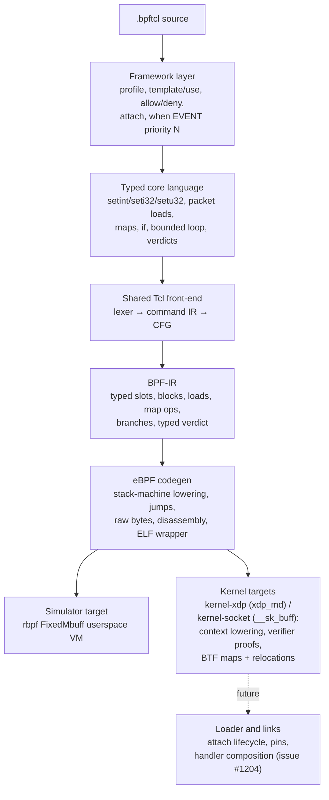

# BPF-Tcl eBPF backend architecture and production roadmap

> **Status:** Experimental multi-target backend, kernel codegen landed
> 2026-08-04 (issue #1203).
> The default target runs under the bundled `rbpf` harness. The explicit
> `kernel-xdp` and `kernel-socket` targets emit Linux-loadable objects with real
> `struct xdp_md` / `struct __sk_buff` context lowering, verifier-safe packet
> bounds proofs, BTF-defined maps, and map relocations. Rootless tests validate
> the objects with `readelf`/`llvm-objdump` and an in-repo verifier model;
> genuine kernel `bpf()` load and `BPF_PROG_TEST_RUN` acceptance is gated behind
> an `#[ignore]`d privileged test (`rust/bpf-tcl/tests/kernel_load.rs`), since
> loading needs root and a live kernel. Live attachment (links/pins) remains
> issue #1204 work.

## Purpose

BPF-Tcl is a small, statically typed packet-programming language with Tcl
syntax. It is not a Tcl interpreter inside the kernel. The front-end accepts a
closed, verifier-friendly command set, lowers it to a dedicated BPF
intermediate representation, and emits eBPF instructions without LLVM.

The framework layer borrows the readable `when EVENT priority N { ... }` shape
from F5 iRules, but its events belong to a separate eBPF namespace. Today that
namespace contains only socket filters and XDP packet handlers.

## Layer map



The important boundary is BPF-IR. Framework conveniences must expand into
typed core operations before CFG construction, and code generation must depend
only on explicit BPF-IR semantics. A kernel target should be a separate ABI
flavour below this boundary, not a collection of kernel special cases in the
framework.

## Layer 1: low-level eBPF code generation

`bpf-tcl-codegen/src/ebpf/` implements an instruction encoder, a two-pass block
layout, a disassembler, a hand-written ELF64 relocatable-object writer, a BTF
writer, and an in-repo verifier model.

There are three execution ABIs, selected by [`TargetAbi`](../../../rust/bpf-tcl-codegen/src/ebpf/emit.rs)
and requested on the CLI with `--target`:

| Target | Context | Packet `data`/`data_end` | Map ABI |
|---|---|---|---|
| `rbpf` (default) | `rbpf` metadata buffer | 64-bit words at ctx+0 / ctx+8 | by-value userspace helper ids 1/2/3 |
| `kernel-xdp` | `struct xdp_md` | 32-bit fields at ctx+0 / ctx+4 | BTF-defined maps + `bpf_map_*` helpers |
| `kernel-socket` | `struct __sk_buff` | 32-bit fields at ctx+76 / ctx+80 | BTF-defined maps + `bpf_map_*` helpers |

All three share one lowering strategy:

1. A prologue loads `data` into callee-saved `r6` and `data_end` into `r7` (a
   verdict-only kernel program that never touches the packet skips the prologue
   entirely).
2. Every BPF-IR slot owns one eight-byte eBPF stack location.
3. Each instruction reloads operands into scratch registers, computes, and
   writes back to the stack.
4. A second pass resolves block IDs to signed 16-bit relative jumps and records
   map-fd relocations.

**Context and packet access.** Under a kernel target the prologue reads the
32-bit `data`/`data_end` context fields, which the verifier rewrites into a
`PTR_TO_PACKET` / `PTR_TO_PACKET_END`. Every packet load emits a dominating
bounds proof before the dereference:

```text
r2 = r6                 ; r6 holds the packet pointer (data)
r2 += off + width       ; one past the field
if r2 <= r7 goto +2     ; in bounds → skip the OOB return
r0 = <oob verdict>; exit
r2 = *(width *)(r6 + off)
```

Because the compared register (`r2 = r6 + C`) and the load base (`r6`) share a
packet-pointer id, proving `r6 + C <= data_end` teaches the verifier that
`r6 + off` (with `off < C`) is in bounds — the canonical direct-packet-access
idiom. The out-of-bounds verdict is the program type's drop value
(`XDP_DROP` / socket `0`). Multi-byte fields are converted with `BPF_END`
according to the field's declared byte order.

**Maps.** A kernel map operation spills its integer key (and, for a store, its
value) into stack scratch cells above the slot region, loads the map file
descriptor with a pseudo `ld_imm64` (`src = BPF_PSEUDO_MAP_FD`, immediate zero),
and calls `bpf_map_lookup_elem` / `bpf_map_update_elem`. Each pseudo map-fd load
is recorded as a relocation the ELF writer emits against the map's symbol, so
libbpf patches in the real fd at load time. A lookup result is null-checked
before its value is read.

**BTF-defined maps and relocations.** The ELF writer emits a BTF-defined `.maps`
section (each map a global object symbol over a zero-filled struct variable), a
`.BTF` section describing each map's type/key-size/value-size/max-entries via the
array-encoded libbpf form, and a `.rel<prog>` section with one `R_BPF_64_64`
entry per map-fd load. `map_flags`, per-CPU map types, and array vs hash all flow
from the typed `MapDef`. `readelf` and `llvm-objdump` parse the object, and the
relocations name the map symbols.

**Verifier model.** `verifier.rs` is a rootless structural checker of the safety
invariants the kernel verifier enforces on our own output: exit reachability,
correct context-field prologue, a dominating `data_end` proof before every
packet dereference, a relocation for every pseudo map-fd load, and in-range stack
accesses. It is *not* the kernel verifier — genuine `bpf()` acceptance is a
separate `#[ignore]`d privileged test — but it catches a codegen regression that
would make the kernel reject a program, without needing root.

The `rbpf` simulator target is unchanged: `data`/`data_end` are 64-bit metadata
words and map helpers pass keys/values by value. `bpf-tcl compile --emit elf`
defaults to the `rbpf` object for inspection; kernel objects are requested with
`--target kernel-xdp` or `--target kernel-socket`. No target performs live
attachment.

### Linux verifier experiment

The audit ran the shipped map-free XDP output through libbpf and the Linux 6.17
verifier on an x86-64 host. `readelf` accepted the object as `ELF64`, `REL`,
`Linux BPF`; LLVM disassembled all seven instructions; and libbpf found the
`xdp` program and GPL licence. Kernel loading then stopped at instruction zero:

```text
0: (79) r6 = *(u64 *)(r1 +0)
invalid bpf_context access off=0 size=8
```

This isolated the first production blocker precisely: ELF structure was not the
problem. The `rbpf` context prologue is invalid for `struct xdp_md`.

The first fix (issue #1205) introduced a separate `kernel-xdp` target as a
map-free, verdict-only vertical slice. A five-instruction `pass` handler was
accepted by the Linux 6.17 verifier with a stack depth of eight bytes, and
`BPF_PROG_TEST_RUN` over a 64-byte synthetic frame returned `2` (`XDP_PASS`) in
232 ns. Neither experiment attached to an interface, and the temporary pins,
objects, packets, logs, and copied tool were removed from the host.

Issue #1203 then made context access, packet loads, and maps real for both a
`kernel-xdp` (`struct xdp_md`) and a `kernel-socket` (`struct __sk_buff`) target,
with dominating verifier bounds proofs, BTF-defined maps, and `R_BPF_64_64`
relocations. That kernel codegen is validated in this repository structurally
(`readelf`/`llvm-objdump`) and against the in-repo verifier model; the privileged
`bpf()` load + `BPF_PROG_TEST_RUN` acceptance for the packet-access and map
programs is written but gated behind `#[ignore]` (it needs root and a live
kernel), so a maintainer re-runs it on a Linux host — see
`rust/bpf-tcl/tests/kernel_load.rs`.

## Layer 2: typed low-level language and BPF-IR

The low-level language is deliberately closed. Its 25 registered commands are:

| Group | Commands | Meaning |
|---|---|---|
| Typed scalars | `setint`, `seti32`, `setu32` | Evaluate integer expressions and commit a 64-, signed 32-, or unsigned 32-bit value. |
| Packet context | `setbuf`, `pktlen`, `load8`, `load16`, `load32` | Bind the packet, inspect its length, and read fixed-width fields at constant offsets (with an optional `be`/`le`/`native` byte-order word). |
| State | `map`, `map_get`, `map_has`, `map_set` | Declare and access userspace-emulated integer-to-integer maps; `map_has` distinguishes a missing key from a stored zero. |
| Control flow | `if`, `loop` | Branch, or expand a literal-count loop up to 64 iterations before CFG construction. |
| Socket verdicts | `accept`, `drop` | Return an accepted byte count or zero. |
| XDP verdicts | `pass`, `drop`, `tx` | Return `XDP_PASS`, `XDP_DROP`, or `XDP_TX`. |
| Framework | `when`, `profile`, `field`, `template`, `use`, `allow`, `deny`, `attach` | Declare handlers and expand policy/configuration conveniences. |

Expressions support signed integer arithmetic, bitwise operations, shifts, and
numeric comparisons. Dynamic Tcl values, strings, command substitution,
procedures, namespaces, coroutines, event loops, native `while`/`for`, file or
socket I/O, and arbitrary commands are rejected.

**The registry is the source of truth.** Every command spec in `tcl-registry`
carries a typed `BpfOpSpec` descriptor (`bpf_op` field) describing the core
operation or framework declaration it stands for — scalar width, packet-load
width, map role, verdict family and its compatible program types, and an
effect classification (packet read, map read/write, termination). The BPF-Tcl
front-end (`bpf-tcl-ir`) and its capability policy dispatch on this descriptor,
never on the command name. Adding a verb is a registry edit; a new command
without a descriptor fails the registry drift test rather than being silently
mishandled.

BPF-IR is a typed three-address CFG over mutable slots. It models constants
(including full 64-bit values via `lddw`), copies, integer operations, context
pointer/length acquisition, **checked** packet loads, map access, branches, and
verdict returns. A packet load (`Inst::Load`) carries a constant byte range,
width, byte order (`Native`/`Big`/`Little`), and an explicit out-of-bounds
action, so the failure semantics of a short packet are stated in the IR rather
than implied by a target's runtime. Maps carry a typed schema (kind, key/value
size, capacity, concurrency). After lowering, a liveness-based allocator
(`bpf-tcl-ir/src/alloc.rs`) re-colours the virtual slots so values with disjoint
live ranges share a stack slot, computes the exact zero-init set (only the
slots read before every write), and enforces the 64-slot / 512-byte cap
*after* reuse — reporting stack pressure with the source span of the first
value that no longer fits.

### Integer semantics

BPF-Tcl integers are signed 64-bit, but `/` and `%` follow eBPF's **signed
truncated-toward-zero** division (`BPF_SDIV` / `BPF_SMOD`), *not* Tcl's floor
division. The two agree for same-sign operands and diverge only when exactly
one operand is negative (`-7 / 2` is `-3` here, `-4` in Tcl). This narrower,
verifier-native contract is deliberate and documented; the front-end does not
silently pretend to be Tcl. `>>` is arithmetic (sign-preserving).

## Layer 3: framework and event model

The framework processes declarations in this order:

1. collect one optional packet profile;
2. collect reusable templates;
3. collect the capability allow/deny policy;
4. find each `when` declaration and resolve its event type;
5. expand `use`, bounded `loop`, and named profile fields;
6. enforce capability policy over the expanded body;
7. build CFG and typed BPF-IR independently for each handler;
8. apply matching `attach` metadata; and
9. sort programs by ascending priority and event name.

### Events handled today

| Event | Alias | Input available to the program | Valid explicit verdicts | Targets |
|---|---|---|---|---|
| `SOCKET_FILTER` | `SOCKET` | Packet bytes and length (`__sk_buff` on the kernel) | `accept ?N?`, `drop` | `rbpf` simulator; `--target kernel-socket` emits a loadable object (accepted byte count / `0`). |
| `XDP` | — | Packet bytes and length (`xdp_md` on the kernel) | `pass`, `drop`, `tx` | `rbpf` simulator; `--target kernel-xdp` emits a loadable object (XDP action number). |

There are no TC, cgroup, tracepoint, kprobe, uprobe, perf-event, LSM, socket-op,
or syscall events. There is no event-specific metadata such as interface index,
queue, process ID, user ID, cgroup, socket tuple, tracepoint fields, or return
value. There is also no ring buffer or perf buffer for sending records to
userspace.

Multiple handlers are separate programs. Priority currently controls only
their order in the `BpfModule` and CLI program indexes; it does not generate a
dispatcher, program array, tail-call chain, or link ordering. An external
loader therefore cannot yet preserve the apparent multi-handler semantics.

## Profiles, templates, capabilities, and deployment metadata

- Built-in profiles expose fixed-offset fields for Ethernet, IPv4, TCP, and
  UDP. Combined profiles assume Ethernet + a 20-byte IPv4 header with no VLAN
  tags or IPv4 options.
- User profiles declare their own fixed-offset 8-, 16-, or 32-bit fields.
- Templates are compile-time statement macros with integer bindings.
- `allow` restricts packet/map access verbs; `deny` can also prohibit verdicts.
  Enforcement happens after all macro and profile expansion.
- `attach KIND TARGET` is validated against handler types and printed by
  `check`, but code generation and execution ignore it.

## Verified design issues

### Kernel codegen (issue #1203) — resolved

These were the subject of [issue #1203](https://github.com/bitwisecook/tcl-lsp/issues/1203)
and are now **implemented**, validated structurally and against the in-repo
verifier model (real `bpf()` acceptance is gated behind an `#[ignore]`d test):

1. **Explicit target ABIs with separate context lowering.** `rbpf`, `kernel-xdp`
   (`struct xdp_md`), and `kernel-socket` (`struct __sk_buff`) each own their
   context field offsets, prologue, and helper ABI. *(Resolved.)*
2. **Verifier-visible packet bounds checks.** Every packet load emits a
   dominating `data + off + width <= data_end` proof against the packet pointer,
   using the shared-id direct-packet-access idiom, and takes the program type's
   drop verdict on a short packet. *(Resolved.)*
3. **Kernel maps and relocations.** Kernel targets emit BTF-defined `.maps`, a
   `.BTF` section, and `R_BPF_64_64` relocations for each pseudo map-fd load;
   map ops lower to `bpf_map_lookup_elem`/`bpf_map_update_elem` with
   stack-resident keys/values and null checks. Map kind, key/value size,
   capacity, and per-CPU concurrency flow from the typed `MapDef`. *(Resolved.)*
4. **Network-byte-order fields.** Multi-byte loads convert with `BPF_END` per the
   declared byte order on both the rbpf and kernel paths (verified against
   Ethernet/IPv4/TCP fixtures under the simulator). *(Resolved.)*

### Remaining production blocker

1. **No loader or attachment lifecycle.** `attach xdp eth0` does not create a
   BPF link, configure an interface, pin maps, detach cleanly, or roll back a
   partial deployment. This — plus handler composition and userspace event
   channels — is [issue #1204](https://github.com/bitwisecook/tcl-lsp/issues/1204).

### Low-layer correctness and maintainability

The items in this section were the subject of
[issue #1202](https://github.com/bitwisecook/tcl-lsp/issues/1202) and are now
**resolved**; they are kept here as a record of the contract each one settled.

1. **The registry describes lowering.** Every BPF command spec carries a typed
   `BpfOpSpec` descriptor; `bpf-tcl-ir` and the capability policy dispatch on
   it, never on the command name. A registry drift test proves the command set,
   lowering dispatch, and capability classification stay complete and
   consistent. *(Resolved.)*
2. **Malformed framework syntax is rejected.** A `when` header must be exactly
   `when EVENT { body }` or `when EVENT priority N { body }` — a non-integer or
   substituted priority, an unknown header keyword, or a substituted event is a
   span-anchored error, never silently normalised. A user `profile` body accepts
   only `field` declarations; anything else is rejected rather than dropped
   (`RUST_ISSUE_063`). A handler path that reaches the end without an explicit
   verdict is a `MissingVerdict` error, never a silent drop. *(Resolved.)*
3. **The IR states byte order and checked ranges.** `Inst::Load` carries a
   constant range, width, byte order (`Native`/`Big`/`Little`), and an explicit
   out-of-bounds action. The rbpf emitter proves `base + off + width <=
   data_end` before every dereference and takes the declared verdict on a short
   packet, and converts multi-byte fields with `BPF_END`. *(Resolved.)*
4. **Integer semantics are documented.** `/` and `%` are eBPF signed
   truncated-toward-zero division, a documented narrower contract than Tcl floor
   division (see *Integer semantics* above). Full 64-bit constants materialise
   with `lddw`. *(Resolved.)*
5. **Stack allocation reuses slots.** A liveness-based allocator re-colours
   virtual slots for disjoint live ranges, zeroes only the slots read before
   every write, and reports stack pressure with source context after reuse.
   *(Resolved.)*
6. **Map absence is distinguishable from zero.** `map_has` reports key presence
   (1/0) independently of the stored value, and maps carry a typed schema (kind,
   key/value size, capacity, concurrency) with capacity and array-range
   enforcement in the simulator. *(Resolved.)*

### Framework limitations

1. **Priority has no deployment semantics.** It sorts independent artefacts but
   does not define how their verdicts compose or how later handlers run.
2. **One global profile, policy, and attach declaration constrain mixed-event
   files.** Event-specific context and deployment settings need scoped config.
3. **Fixed packet profiles do not parse protocols.** VLAN tags, variable IPv4
   header length, fragments, IPv6 extension headers, and tunnels invalidate
   hard-coded transport offsets.
4. **Events are a two-arm string match.** There is no schema that pairs an event
   with context type, allowed helpers, attachment parameters, fields, return
   convention, and minimum kernel capability.
5. **No userspace event channel exists.** Observability programs need typed
   records and ring-buffer/perf-buffer delivery, not packet verdicts.
6. **Privileged kernel-load tests are gated, not automated.** Rootless tests
   cover the verifier model, structural ELF/BTF/relocation validation, and
   network-byte-order fixtures, but genuine `bpf()` load + `BPF_PROG_TEST_RUN`
   acceptance is `#[ignore]`d (needs root and a live kernel) and there is no
   loader/link-lifecycle or live-namespace test yet.

## Real-world use cases

### Useful with the current userspace target

- Teach and inspect how a restricted event DSL becomes BPF-IR and eBPF.
- Unit-test packet decisions against synthetic byte arrays without root.
- Prototype profiles, templates, capability policies, and bounded state logic.
- Inspect deterministic assembly and structurally valid ELF sections.

### Useful with the current kernel targets

- Emit libbpf-loadable XDP and socket-filter objects with real context access,
  verifier-safe packet bounds proofs, and BTF-defined maps.
- Build allow/deny packet filters and map-backed packet/flow counters, then
  inspect them with `readelf` / `llvm-objdump` and load them with a maintainer's
  privileged `bpf()` gate.
- Exercise the full source-to-kernel-object path — context, packet reads, maps,
  relocations — without attaching to a live interface.

### Enabled by a production XDP/socket-filter target

- Drop known-bad L2/L3/L4 traffic before the host network stack.
- Apply small allow/deny lists for exposed services.
- Sample or pre-filter packet capture traffic on a socket.
- Count packets or flows in persistent maps.
- Implement simple SYN, UDP, or destination-port rate controls, subject to a
  well-defined concurrency model for map updates.

### Enabled by a broader event framework

- TC ingress/egress classification, marking, redirect, and shaping decisions.
- Cgroup connect/bind policy for containers and services.
- Tracepoint and kprobe latency/error telemetry with ring-buffer records.
- Uprobe instrumentation for selected application functions.
- Socket lifecycle and flow telemetry with event-specific context schemas.
- LSM policy only after stronger verification, capability, and deployment
  guarantees are in place.

## Target design and sequencing

The production path is deliberately split into three GitHub work packages:

1. **[Harden the low-level language and BPF-IR contracts](https://github.com/bitwisecook/tcl-lsp/issues/1202).** Make command
   lowering registry-described, reject malformed framework input, add explicit
   endian/checked-load/map semantics, and improve slot allocation.
2. **[Complete the Linux-kernel codegen and ELF ABI](https://github.com/bitwisecook/tcl-lsp/issues/1203).** Keep `rbpf` as a simulator,
   add target-specific contexts and verifier proofs, emit maps/relocations, and
   test with the Linux verifier and `BPF_PROG_TEST_RUN`.
3. **[Build the event framework and loader](https://github.com/bitwisecook/tcl-lsp/issues/1204).** Define event schemas, scoped
   configuration, handler composition, attachment/link lifecycle, typed
   userspace records, and operational introspection.

The low-layer contract work should land first. Kernel codegen can then consume
explicit checked loads, byte order, and maps. The event framework should add
new event families only after the kernel target and loader can verify, load,
attach, observe, and detach one program safely.

## Runnable examples

See [`samples/bpf-tcl/README.md`](../../../samples/bpf-tcl/README.md). The demo
userspace script builds `bpf-tcl`, checks and executes socket-filter and XDP
handlers, shows a stateful map, demonstrates priority/attach metadata, emits
assembly, and inspects a map-free ELF object. The separate kernel script
verifier-loads and test-runs the verdict-only XDP example without attaching it.
