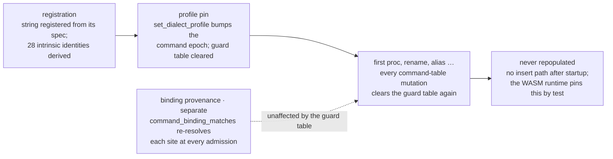
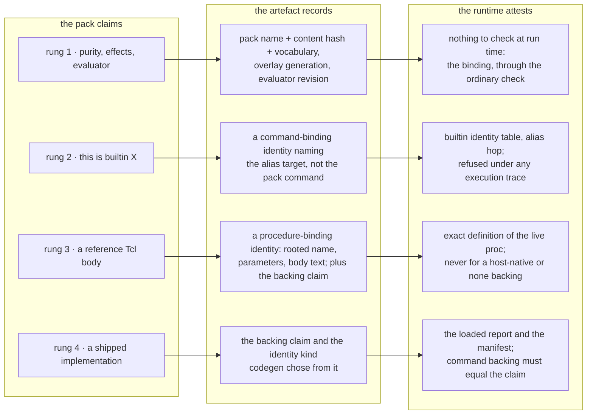
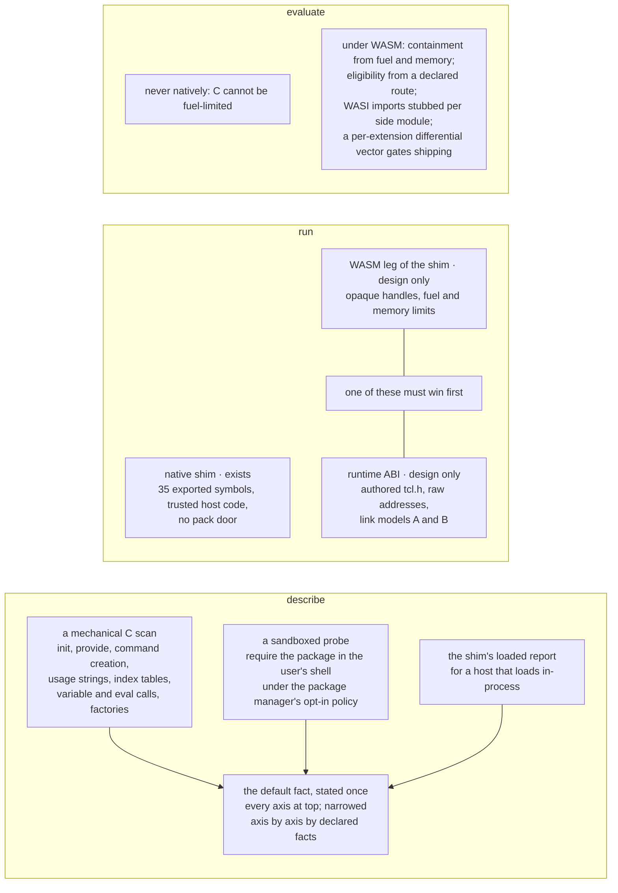

# Registry consumer contracts — description, identity, and backing

How far the command registry, and the `.tclspec` packs that extend it, can
drive the analyser, both code generators, and both runtimes; what that
requires of dialects and packages; and where C Tcl extensions fit. This is
the companion to [value-transfers.md](value-transfers.md), which states
the consumer interface for one axis (values), and to
[value-evaluation.md](value-evaluation.md), which states how an answer on
that axis is computed. This page places the value axis among the others
and holds the follow-ons: the description descriptors the analyser still
lacks, and the identity and backing contracts a code generator or a
runtime needs before a pack claim can change *emitted code*. Analysis
facts wait for none of it — under the rulings recorded in the interface
contract, a loaded pack's facts are authoritative for analysis and
optimisation as soon as they are loaded, and the direct, expression, and
private-pack slices proceed without deciding anything here.

> **Status — a proposal.** Every identifier, count, and file path on this
> page was checked against the tree; the proposed names (`runtime_backing`,
> the member-effect and clause-grammar descriptors, the artefact manifest,
> the dependency tier) name nothing in the workspace. Nothing on this page
> is a prerequisite of the consumer interface, the direct or expression
> routes, or the private-pack slice in
> [value-transfers-migration.md](value-transfers-migration.md).

Read it before extending `CommandSpec` with a fact a code generator or a
runtime would act on, before letting a pack name a compiler catalogue
member, or before designing how a package ships its runtime implementation.

## Three contracts, not one mechanism

The registry already describes nearly every fact the analyser needs, and
the analyser reads a fraction of it. Codegen already keys on registry
identities, but only a shipped builtin can be attested at run time. So the
work is three contracts:

- **Description.** Every axis has a declarative descriptor, a closed native
  catalogue for the algorithmic remainder, and one derived query that every
  consumer asks. Authored fields stay private to the query. A descriptor
  establishes locations and grammar; executable semantics are an explicit
  declaration or a derivation from a descriptor that states the same
  operation, never an inference from weaker metadata.
- **Identity.** Three mechanisms, kept distinct in text and diagrams:
  *command binding provenance* (does the spelling still bind to the
  described command?), *intrinsic guard eligibility* (may compiled code
  take a specialised fast path for it?), and *pack or implementation
  attestation* (is the implementation the pack described the one that is
  loaded?). A pack may claim. Only the runtime may attest. The artefact
  records the claim with the pack's identity. Admission of *emitted code*
  requires the attestation; a missing attestation is plain dispatch when
  the unit carries source and the VM has a compile service, and a refusal
  otherwise.
- **Backing.** A described command's executable behaviour arrives through
  one of four doors — Tcl source, a host-registered native command, a C
  extension recompiled through the shim, or nothing — and a per-command
  fact says which, so codegen can choose the identity kind it emits.

```mermaid
flowchart TB
    subgraph description["description contract"]
        D1["every axis has a declarative descriptor<br/>plus a closed native catalogue for the rest"] --> D2["one derived query per axis<br/>authored fields private; a per-axis lint and ledger"]
        D2 --> D3["consumers ask the query, never a name<br/>analyser · lowering · codegen · editor providers · tools"]
    end
    subgraph identity["identity contract"]
        I1["a pack may claim<br/>a builtin identity, a body, a backing"] --> I2["the artefact records the claim<br/>binding identity + pack hash + overlay generation"]
        I2 --> I3["only the runtime may attest<br/>binding provenance · intrinsic guard · loaded report<br/>missing attestation → plain dispatch, or a refusal"]
    end
    subgraph backing["backing contract"]
        M1["four doors for executable behaviour<br/>Tcl source · host-native · C through the shim · none"] --> M2["a runtime-backing fact per command<br/>codegen chooses procedure binding, command binding, or generic"]
    end
```

The fence around all three is the standing set of rulings, and every
proposal here fits inside it: SpecTcl declares and Rust executes; packs
name closed catalogues and never add to them; `completion` and
`dispatch_dependencies` are never authorable; a static resolution is a
candidate, never proof; no pack word loads native code; extensions are
recompiled, never binary-loaded; semantic AOT transforms are default-off,
and analysis reuse is not authorisation
([semantic-aot-optimisation.md](semantic-aot-optimisation.md),
[../registry/spec-packs.md](../registry/spec-packs.md) § *What a pack still
cannot say*, [../runtime/c-extension-shim.md](../runtime/c-extension-shim.md)
§ *Trust model*); and loaded workspace facts are authoritative for
analysis, with no widen-only tier and no provenance cap (the rulings in
[value-transfers.md](value-transfers.md) § *Rulings*).

## Rulings still open

Standing documents contradict each other on points the sections below
depend on. None of them blocks the analyser slices.

1. **The Rust-emitting build.** The owner's re-ruling of Q1 in
   [../registry/dialect-and-package-registry-redesign.md](../registry/dialect-and-package-registry-redesign.md)
   § *The 2026-08-28 re-ruling* keeps the shipped cores in Rust and withdrew
   `tcl spec build --emit rust`. [../registry/spec-packs.md](../registry/spec-packs.md)
   § *The ambition: one authoring format, two backends* still promises it.
   What survives as a second backend is Jim's surface, authored as SpecTcl
   and compiled in. Every "codegen meets SpecTcl" idea on this page is
   bounded by the re-ruling: the shipped code-generation catalogues are
   generated from the Rust registry, never from SpecTcl sources.
2. **Whether an untrusted workspace's pack executes at all.** Authority is
   ruled: a loaded workspace pack's facts are believed. What remains is an
   editor security question, not a trust-of-facts question — whether a
   pack discovered in a workspace the editor has not marked trusted may
   have its bodies *run* in the sandbox. The redesign's § *Trust and
   provenance* disables hook execution in an untrusted workspace; the
   spec-pack design's § *Workspace trust: the setting is gated, the
   workspace tier is not* loads the workspace tier because the sandbox,
   not trust, is the protection. Discovery maps every workspace pack to
   `Provenance::WorkspaceTrusted` (`rust/tcl-spectcl/src/loader/environment_block.rs`),
   the editor's workspace-trust state is not plumbed, and the two loader
   predicates in `rust/tcl-spectcl/src/loader/eval.rs` disagree about what
   the tier may do. Once ruled, the predicates agree and the answer is the
   same on every entry point.
3. **The stub sidecar's widen-only rule.** [../contracts/dialect-stubs.md](../contracts/dialect-stubs.md)
   says a stub declaration widens and never narrows. A stub is a
   workspace-authored fact like a pack's; under the authority ruling the
   same treatment follows, and the contract needs the same re-ruling or an
   explicit statement that stubs are a different class. Until then the
   stub's purity and mutation flags, parsed and dropped today in
   `rust/tcl-compiler/src/analyser/utils.rs`, are the first candidates.
4. **Two C-hosting designs.** [../runtime/c-extension-shim.md](../runtime/c-extension-shim.md)
   hosts a recompiled command behind the engine interface with opaque
   handles; [../runtime/c-extension-abi.md](../runtime/c-extension-abi.md)
   targets unmodified extensions against an authored header with raw
   addresses in one shared memory. `runtime/rust/src/capi.rs` exports the
   object-lifecycle slice only, with no command-creation export and no
   external command variant, so neither design runs an extension under
   WASM. One must win before the WASM leg is built.

## The analyser: the description contract

The registry surface is far richer than the analyser's dispatch uses.

| Fact | Registry | Analyser |
|---|---|---|
| analyser hook variants | 43 (`AnalyserHookId`, `rust/tcl-registry/src/hooks.rs`) | most exist because a descriptor is missing or unconsumed; the residue is short |
| scope and interpreter transitions | resolvers on `upvar`, `global`, `variable`, `namespace`, `interp` (`rust/tcl-registry/src/state_transition.rs`) | the variable-alias, namespace, and interpreter families have no consumer under `rust/tcl-compiler/src/analyser/`; `frame_effect` is read only for alias-pair layout and level parsing (`param_traits.rs`, `diagnostics/usage.rs`); the command-binding family only by `interp alias` and the static-proc proof |
| loop and bind positions | roles and strided `repeated_args` | hardcoded indices in five handlers (`handlers.rs`: `dict for`, `dict update`, `foreach`, `incr`, `append` / `lappend`) |
| OO member effect | member layout only (`MemberKind`: flat, wrapper, flag-keyed) | an eleven-arm keyword match in `analyser/oo.rs`, plus snit and itcl prefix conventions |
| clause grammar | designed and loader-parsed (`ClauseGrammar::walk` in `rust/tcl-spectcl/src/loader.rs`), no registry type, placeholders installed | `if` and `try` walked by keyword at seven sites in three compiler files, plus the editor and MCP tiers |

Two descriptors are missing.

- **A clause grammar** gives `if`, `try`, `for`, `dict for`, and the loop
  family slot-level shape: expression, body, keyword, variable list, and
  per-body flags for selected, always, and fall-through. It belongs on the
  spec in `tcl-registry`, not as a loader-only derivation, because lowering,
  the analyser, recovery, signature scanning, the formatter, the editor
  refactors, and the MCP tools all need the same slots. The flags record
  conditional depth, never a CFG edge: that keeps the descriptor on the
  data side of the `completion` exclusion. It gives locations and grammar;
  first-match dispatch, list iteration, and any other executable semantics
  are declared beside it through the consumer interface's structural
  plan, never inferred from the slots.
- **A member effect** says what a definer member declares: method,
  constructor, or forward; instance or class receiver; variable declaration;
  superclass or mixin slot; visibility; init script. With it the OO analyser
  folds a member by effect, and snit and itcl stop being string conventions.
  The vocabulary must be closed and family-neutral or it re-encodes TclOO.

The rest is consumer migration, through the generic operations the
interface contract names.

- Scope aliases become one generic application of the
  `VariableCellAliasTransition` the registry already emits; namespace and
  interpreter handlers consume the typed `NamespaceTransition` and
  `InterpreterTransition` families instead of re-scanning flags and words.
- Loop, bind, and read-modify-write handlers bind by role. The
  special-variable table (`rust/tcl-registry/src/special_vars.rs`) gains a
  pack statement. `package require`, `provide`, and `ifneeded` get an
  argument layout instead of fixed indices.
- Most hook variants then become predicates on descriptors and retire, with
  the drift test in `rust/tcl-registry/tests/analyser_hooks.rs` re-baselined.
  What stays is analyser policy over typed facts, documented at its call
  sites as irreducible: dynamic-target synthetic domains, the
  interpreter-domain stack, export tombstone ordering, rename epochs,
  literal-iteration simulation, and value binding of a created interpreter.
  A hook variant whose handler implements one command's binding rules is
  still command-specific and is in the migration ledger, not the residue.
- Two hook bodies remain, both facts-only: an argument-role resolver for a
  grammar the clause descriptor cannot spell, and an authored
  state-transition resolver emitting alias facts only. The second reverses
  the loader's current position that a `state_transitions` resolver is
  reference-only, and needs a ruling.
- The mechanism is a derived-query layer. The interface contract proposes
  one resolved invocation with axis queries over it for the value axis;
  this page generalises that shape to effects, scope effects, clause
  grammar, and member effect, with a per-axis lint whose scope is every
  tier (the hand-written-knowledge inventory in the migration plan counts
  roughly ninety rows in the editor and tooling crates).
- The alias and command-binding resolvers abstain on dynamic words; a
  witness test should pin that before the analyser's isolated per-item pass
  consumes transitions. Each new descriptor is a four-surface change under
  [../contracts/command-spec-studio.md](../contracts/command-spec-studio.md),
  and `semantic_operation` cannot round-trip through the studio today
  (`DraftOpaque` in `rust/tcl-spec-studio/src/render_spectcl.rs`).

## Codegen and the registry today

- The bytecode backend dispatches 33 specialised forms by typed hook — 15
  statement-position `CodegenHookId` variants and 18 value- or
  catch-position `InlineCodegenHookId` variants — with four residual by-name
  sites: the loop-control jumps, the `::tcl::dict::for` / `::tcl::dict::map`
  rewrite barriers, and the `incr` fallback in
  `rust/tcl-compiler/src/codegen/values.rs`. The migration plan's
  hand-written-knowledge ledger has no codegen row.
- **Binding provenance.** The artefact carries a `CommandBindingIdentity`
  per specialised site (`rust/tcl-runtime-api/src/lib.rs`).
  `command_binding_matches` in `rust/tcl-vm/src/interp.rs` re-resolves
  each at admission through `builtin_identity_for_key` and
  `registry_object_roots`, follows a prefix-free alias, and refuses under
  an execution trace; it accepts a `Command::Builtin` whose identity
  matches or a registry TclOO root, and a proc, a host command, an
  ensemble, or a shimmed C command never matches. `run_module` in
  `rust/tcl-vm/src/exec.rs` recompiles plain when the unit carries source
  and the VM has a compile service, and otherwise fails with an admission
  error. This check re-resolves on every admission and survives command
  mutation.
- **Intrinsic guard eligibility.** `guarded_commands` in the same file is
  the specialised intrinsic guard table, and `bump_cmd_epoch` clears it on
  every command-environment mutation, including the profile pin. It is a
  different mechanism from the binding check, and clearing it does not
  break ordinary bytecode binding; it means no intrinsic fast path is
  eligible after the first mutation.
- The WASM runtime derives a guard identity for one command (`string`,
  through `register_spec_builtin` in `runtime/rust/src/cmd_string.rs`) and
  `execute_intrinsic` implements one of the 28 `IntrinsicId` members. Its
  guard resolves through `CommandRegistry::build_default()` with no pack
  overlay. Emitted modules carry no identity: no ABI version, no dialect
  pin, no registry generation, no pack hashes.
- The loader accepts `codegen_hook`, `inline_codegen_hook`, and
  `semantic_operation {Intrinsic …}` stamps on any pack command from any
  tier (`rust/tcl-spectcl/src/loader.rs`). Every production VM embedder
  compiles through the un-overlaid profile generation, so the stamp is inert
  there; on the language server's optimise path the emitter would specialise
  and the VM would recompile plain. Neither outcome is tested.
- The BPF backend is a third closed catalogue (`bpf_op`) with no id table
  for packs to resolve against, and the engine interface excludes it by rule.

Both runtimes clear their *intrinsic guard* table on every
command-environment mutation and never repopulate it: `bump_cmd_epoch` in
`rust/tcl-vm/src/interp.rs` and `invalidate_command_environment` in
`runtime/rust/src/interp.rs`, the latter pinned as intended by the test
`command_mutation_invalidates_guard_and_identity_attestation`. No pinned VM
and no WASM runtime that has defined a proc holds a live intrinsic guard;
the guarded fast path proven by
`guarded_boxed_intrinsic_runs_and_falls_back_against_the_real_runtime` in
`rust/tcl-compiler/tests/wasm_real_link.rs` runs before anything is
defined. Persisting an intrinsic guard identity must still invalidate
eligibility when its dependencies change; attaching one by name after
registration is not proof that a replacement handler implements the
builtin. Admission-time checks and runtime fast-path guards are different
mechanisms, and neither protects the other without a specific dominance
and lifetime argument.

## Four rungs of codegen meeting `.tclspec`

| Rung | The pack states | Attestation at admission | State |
|---|---|---|---|
| 0 | arity and roles | none needed; generic dispatch | exists, sound |
| 1 | purity, effects, types, transfers, evaluators | none possible at run time; the fact is authoritative for analysis by ruling; what emitted code can check is the binding | evaluators exist; the answer protocol does not |
| 2 | this command is a shipped builtin | the live binding is that builtin | `-override` exists; an alias-of declaration is new vocabulary |
| 3 | a reference Tcl body | exact definition match of the live proc | the admission seam exists; no spec field |
| 4 | a runtime implementation ships with the package | the runtime reports what it loaded; the artefact pins it | no vocabulary, no bundler |

- **Rung 1** is where analysis facts live, and the analyser needs nothing
  from this page to use them. For *emitted code* the artefact records which
  pack facts a specialised site rests on — pack name, content hash,
  vocabulary version, overlay generation, evaluator revision — so that a
  changed pack invalidates the artefact rather than silently changing its
  meaning. `rust/tcl-registry/src/security_floor.rs` protects `codegen_hook`
  and `inline_codegen_hook` on overrides and nothing else on the codegen
  axis: an override from any tier may still swap `lowering_hook`,
  `analyser_hook`, `semantic_operation`, and `state_transitions`, and a new
  command may name any of those. The floor is a codegen-axis contract
  about which stamps may change emitted code, not a trust gate on analysis
  facts; extending it to the whole codegen and runtime axis as take-shipped
  is rung 1's remaining work, together with a tier gate on native
  identities for new commands. A spec test command that runs the package's
  own implementation under the real shell is a quality tool for shipped
  packs, not a prerequisite for a workspace author's facts.
- **Rung 2** needs two corrections. `registry_codegen_hook` in
  `rust/tcl-compiler/src/codegen/emitter/bytecoded.rs` records the resolved
  spec's own name as the identity, so for a pack command the VM's alias hop
  can never match; codegen must record the alias target's identity, and the
  loader must reject a stamp whose hook is not the target builtin's own. An
  alias-of declaration does not exist; the realm learns aliases from script
  statements (`rust/tcl-compiler/src/realm.rs`), and that knowledge is a
  candidate, never proof.
- **Rung 3** has the most leverage. As an evaluator, a reference body is
  the declared-implementation route of the evaluation contract: it runs in
  the bounded engine under the target release, which needs the release
  setter the `Engine` trait in `rust/tcl-engine-api/src/lib.rs` lacks, with
  per-evaluation state isolation, and only value-position bodies the
  sandbox can express qualify. As code, `procedure_binding_matches` in
  `rust/tcl-vm/src/interp.rs` already compares creation name, parameters,
  and body text against the live proc; the body must then come from the
  library's own source, in which case the spec field is a pointer, or the
  pack duplicates it and every library upgrade silently turns those sites
  plain. Activation must never define a proc for a command whose backing is
  host-native or none, or the check admits a model of a C command. As a
  derivation source, analysing the body yields purity, effects, return
  type, callback slots, and the transfer — the facts
  `ai/claude/skills/spec-author/SKILL.md` still leaves to the author.
- **Rung 4** is a runtime-backing fact per command: shipped builtin with
  identity, Tcl body with source, host-native with a guard identity, or
  none. Codegen picks the identity kind from it. The iRules test harness is
  an existing miniature: `rust/xtask/src/gen_irule_test_data.rs` generates
  Tcl mocks from the registry that back every iRules command on the VM, and
  its stubs return the empty string for the pure functions — a wrong value
  that shows why backing must be declared and checked rather than assumed.
- **The strong sense is not SpecTcl.** The intrinsic table and the
  command-backing classification should be generated from the Rust registry
  by the build task, which is [wasm-native-lowering-plan.md](wasm-native-lowering-plan.md)
  § *Intrinsic table*'s own proposal; generating the ABI descriptor table in
  `rust/tcl-runtime-api/src/codegen_abi.rs` the same way is this page's
  addition.

## Consequences for the runtimes

This is the runtime programme. Nothing on the analyser side waits for it.

- **Persist intrinsic guard identities**, keyed by command token
  generation, surviving the profile pin and following rename and hide the
  way builtin identities already do, with eligibility invalidated when a
  dependency changes. A design change to a tested contract in both
  runtimes; nothing else on this list works until it lands.
- **Registration stays a runtime-owned handler table** in its documented
  order, since the registry holds no handler pointers and TclOO must
  override `variable`, the event loop must replace `update`, and `string`
  must come last. A sweep after registration and after the pin attaches
  identities from the pinned shipped generation only, never from an
  overlay; `register_spec_builtin` stops reading `build_default()`; the
  `command-backing` gate (`rust/xtask/src/command_backing.rs`) becomes a
  registry query that `tcl-vm` gains too.
- **The intrinsic table splits by family.** About half the 28 are value
  functions over the shared cores. The rest are Family-B operations over
  each runtime's variable-store and channel adapters under the
  variable-trace guard domain, and `info exists` and the array operations
  fire traces. `guard_semantics_key` versions only `StringLength` today and
  must widen first; the VM's interpreter and object-dispatch guard domains
  are permanently poisoned.
- **The runtime pin becomes a context** — environment, release point,
  build, package floors, and overlay generation — resolved through the same
  ingress the compiler uses, with an overlay miss treated as an error rather
  than the silent fallback to overlay zero in
  `rust/tcl-registry/src/model/ingress.rs`. It is the runtime's counterpart
  of the analysis context. The `namespace` and `trace` subcommand gates
  take their profile from the pinned dialect profile, not from the release
  name.
- **Artefacts carry an identity manifest.** For bytecode that is an
  in-process field on `CompiledUnit` beside the existing generations, because
  no serialised bytecode artefact exists; for WASM it is a custom section. It
  records the ABI version, environment and release, pack names with content
  hashes and vocabulary versions, the evaluator revision, the
  intrinsic-table hash, and the embedded-stdlib revision.
- **The WASM runtime implements the engine interface**, so the hook host and
  the shim can target it and a body can be tested on two engines. The VM
  shipped to WASM (`rust/tcl-vm-wasm`) is a second WASM engine with a
  browser host, no filesystem, and the fallback profile, and needs the same
  statements.
- **Pack bodies are in-memory text and need no filesystem.** Real package
  sources reach the VM through a direct `std::fs` read in
  `rust/tcl-vm/src/command.rs` that bypasses the host filesystem seam and
  ignores the encoding option, and no browser host can serve them; the
  pinned provisioning path in the evaluation contract is the replacement.
- **Jim and every non-Tcl point execute as Tcl 9 by decision**
  (`vm_runtime_version` in `rust/tcl-dialect/src/profile.rs`), so a Jim
  attestation key has nothing to compare against.
- **The three-way differential fuzzer** (`rust/tcl-fuzz`) is the exit
  criterion for every change that touches both runtimes.

## Dialects and packages

Every spec fact is scoped as availability rows asked at the point the
environment resolves, with package placements as floors and realms deciding
binding at the call site. A codegen-axis fact should be versioned the way
arity already is: ordered rows, first covering row wins, selected at the
primary, declining to plain dispatch when a declared target range disagrees
until the per-target evaluator exists.

| Plumbing gap | Today | Fix |
|---|---|---|
| release for versioned evaluation | `TclVersion::from_profile` answers only for the five plain Tcl profile names, so every vendor environment evaluates under the invariant subset; a deliberate guardrail until the routes are verified against real shells | feed the environment's point through the evidence gate, per measured row, never by name; the hook context already carries `dialect` and `tcl-version` keys, the gap is the value for vendor profiles |
| package version windows | validated and dropped; nothing gates on a package release | carry name and version in `SurfaceQuery::packages` |
| the shared compilation unit | `compilation_unit` resolves the un-overlaid registry, and an uninstalled overlay falls back silently | close both together, keyed on the analysis context; delivering the overlay to the compile service is a prerequisite for every rung above zero *for emitted code*, and the private-pack slice closes the analysis half |
| implemented in C, Tcl, or built in | no declaration anywhere | a new fact on the package placement row for the registry and on the manifest and lockfile for the package manager; evidence, not proof; consumed by the resolver's load edge, realm binding knowledge, and the container generator |
| packages shipping specs | de facto beside a `tclpkg.tcl` manifest and in library installs, undeclared and unverified; a pack from any tier may name codegen-axis facts with only a notice | a manifest `spec` directive with a lockfile hash, a dependency tier, a per-tier capability matrix enforced at load for the *codegen* axis, native-identity resolution for the body families, and a spec test command that runs the package's implementation under the package manager's sandbox policy, never at editor load |

## C Tcl extensions

The shim and the analyser are unconnected: `rust/tcl-cshim` hosts a
recompiled command as trusted host code with no door from any pack, and
nothing derives a command fact from C source, a binary, or a load-only
package index (the package resolver records the package's existence from
such an index, and no commands). A user today writes a stub sidecar
([../contracts/dialect-stubs.md](../contracts/dialect-stubs.md)), an
extra-commands setting, or a provides directive, and the container skill
handles extensions by hand.

- **State the conservative default once**, as a registry fact for an
  extension command: unknown arity; every argument may be a script or a
  variable name at any level, so it clears the constant environment and
  abstains from interprocedural seeds; it may create, rename, or delete
  commands, including itself; it may establish traces; it may complete with
  any code, expressed through the existing completion and effect domains —
  "any code" retains a possible normal successor and is not "always
  terminates this block"; it is a taint sink and source; it is never pure;
  it is hidden in safe interpreters. The shim's engine interface narrows
  `TCL_BREAK` and `TCL_CONTINUE` to errors and `TCL_RETURN` to `TCL_OK`, so
  hosting under rung 4 needs an interface change before a hosted extension
  can exercise that default.
- **Describe from three sources**, each with its own provenance: a
  mechanical scan of C source, blind to methods registered through the OO C
  API and to ensembles built in C; a sandboxed probe under the package
  manager's opt-in policy; and, for a host that loads an extension
  in-process, a bridge from the shim's `Loaded` report to the declared
  surface. A stub's purity and mutation flags are workspace-authored facts
  and are honoured as declared, pending the stub re-ruling above; a
  declared fact narrows the default axis by axis.
- **Run** natively through the shim under a host opt-in `load` bridge, and
  under WASM only after the ruling, with the syntax-only `wasm32-wasi` check
  the shim document mentions turned into a CI gate that compiles the test
  extension.
- **Evaluate through a C command never natively**, because C code cannot
  be fuel-limited and undefined behaviour is uncontained. Under WASM, fuel
  and memory give containment; eligibility comes from a declared route on
  the command, the same rule the declared-implementation route applies;
  WASI imports for the clock, filesystem, randomness, environment, and
  arguments are stubbed per extension side module, never denied on the
  merged instance, because the runtime itself needs randomness and output;
  the memo key includes the extension artefact hash; and a per-extension
  differential vector against the real shell gates shipping.

## Build order

Each step is independently shippable and lands with its tests, KCS notes,
and design-doc updates. None of them gates the value-axis slices in the
migration plan; steps 2 and 3 are the shortest route to the owner's goal
and come before any runtime guard work.

1. Rule on the open items and repair the documents the work builds on:
   the spec-pack ambition section, [command-registry.md](command-registry.md)
   § *Authoring a spec without Rust*, [../runtime/tclvm-opcode-status.md](../runtime/tclvm-opcode-status.md)'s
   note on `startCommand`, [../runtime/rename-alias.md](../runtime/rename-alias.md)
   § 3.5, [aot-command-priority.md](aot-command-priority.md) § 5, and the
   dialect-stubs widen-only rule.
2. Land the derived-query layer, the two analyser descriptors, the consumer
   migration across every tier onto the generic operations, the per-axis
   ledger, and the studio round-trip for `semantic_operation`.
3. Separate the three identity mechanisms in code and tests: codegen
   records the alias target's identity, the loader rejects a stamp whose
   hook is not the target builtin's own, and the artefact records the pack
   facts a specialised site rests on.
4. Persist intrinsic guard identities in both runtimes across mutations and
   the pin, widen `guard_semantics_key`, and close the Explorer
   observability gap that [semantic-aot-optimisation.md](semantic-aot-optimisation.md)
   requires before native selection widens.
5. Extend the codegen-axis floor to the whole codegen and runtime axis,
   gate native identities by tier, deliver the overlay generation to the
   compile service, and make the overlay miss fail closed.
6. Attach identities from the pinned generation after registration, make
   command backing a registry query in both runtimes, grow the intrinsic
   table by family, and add the manifest and the context pin, with a fuzz
   campaign as the exit.
7. Add runtime backing, reference bodies as declared implementations and as
   code, the engine release setter, the spec test command, and the manifest
   `spec` directive with its dependency tier.
8. Version the codegen axis and feed evaluation points through the
   evidence gate.
9. The extension legs in order: the default fact; the C scan, probe, and
   bridge; the host opt-in `load`; the C-hosting ruling and its CI gate; and
   WASM-hosted evaluation last.

## File-path anchors

- `rust/tcl-registry/src/hooks.rs` — `AnalyserHookId`, `CodegenHookId`, `InlineCodegenHookId`, `LoweringHookId`
- `rust/tcl-registry/src/state_transition.rs`, `frame_effect.rs`, `definer.rs`, `special_vars.rs`, `security_floor.rs`, `intrinsic.rs` — the descriptors the analyser under-consumes, the codegen-axis floor, and the intrinsic catalogue
- `rust/tcl-compiler/src/analyser/handlers.rs`, `oo.rs`, `commands.rs`, `dispatch.rs`, `param_traits.rs`, `utils.rs` — the hook dispatch, the hand-written scope, loop, and member handling, and the dropped stub flags
- `rust/tcl-compiler/src/codegen/emitter/bytecoded.rs`, `codegen/cmd_subst.rs`, `codegen/statements.rs`, `codegen/values.rs` — the typed hook dispatch and the residual by-name sites
- `rust/tcl-compiler/src/realm.rs`, `command_binding.rs` — alias knowledge and binding validity
- `rust/tcl-runtime-api/src/lib.rs`, `guard.rs`, `codegen_abi.rs` — `CommandBindingIdentity`, `ProcedureBindingIdentity`, `GuardIdentity`, the ABI descriptor table
- `rust/tcl-vm/src/interp.rs`, `exec.rs`, `command.rs`, `cmd_string.rs`, `environment.rs` — `command_binding_matches`, `procedure_binding_matches`, `guarded_commands`, `bump_cmd_epoch`, registration, the pin
- `runtime/rust/src/interp.rs`, `codegen_abi.rs`, `cmd_string.rs`, `builtins.rs`, `capi.rs` — the WASM runtime's guard table, `execute_intrinsic`, `register_spec_builtin`, `invalidate_command_environment`, and the C surface
- `rust/tcl-spectcl/src/loader.rs`, `loader/eval.rs`, `loader/environment_block.rs`, `discovery.rs`, `install.rs` — what a pack may write, tier to provenance, discovery, and the floor's application
- `rust/tcl-spec-hooks/src/sandbox.rs`, `pack_eval.rs`, `host.rs` — the hook whitelist, the pack evaluator, and the hook context keys
- `rust/tcl-engine-api/src/lib.rs`, `rust/tcl-engine-tclvm/src/lib.rs`, `rust/tcl-cshim/src/lib.rs` — the engine interface, its one implementation, and the shim
- `rust/tcl-dialect/src/version.rs`, `profile.rs`, `rust/tcl-registry/src/model/ingress.rs`, `rust/tcl-lsp-db/src/lib.rs` — the release, the pin, the overlay ingress, and the salsa registry queries
- `rust/tcl-pkg/src/manifest.rs`, `lockfile.rs`, `docker.rs` — the package manager's data model and the container generator
- `rust/xtask/src/command_backing.rs`, `gen_irule_test_data.rs` — the backing gate and the registry-generated iRules mocks
- `rust/tcl-irule-test/tcl/command_mocks.tcl`, `_mock_stubs.tcl` — the simulator's hand-written and generated command backing

## Test anchors

- `rust/tcl-registry/tests/analyser_hooks.rs` — pins the analyser-hook stamps; re-baselined as variants retire
- `runtime/rust/src/interp.rs` — `command_mutation_invalidates_guard_and_identity_attestation`, the contract the persisted-identity step changes
- `rust/tcl-compiler/tests/wasm_real_link.rs` — `guarded_boxed_intrinsic_runs_and_falls_back_against_the_real_runtime`, the guarded path against the real runtime
- `rust/tcl-cshim/tests/sandbox_isolation.rs` — a pack program and a hook body cannot reach a shimmed command
- `rust/tcl-spectcl/tests/spec_corpus.rs` — every shipped pack loaded, analysed, and run through the hook host at budget; a loading and containment gate, not a value oracle
- `rust/tcl-spectcl/src/loader.rs` — `native_hook_tables_cover_their_catalogues`

## Related docs

- [value-transfers.md](value-transfers.md), [value-evaluation.md](value-evaluation.md), [value-transfers-migration.md](value-transfers-migration.md) — the value axis this page places among the others
- [command-registry.md](command-registry.md) — the registry invariant and the `CommandSpec` field reference
- [lowering-dispatch.md](lowering-dispatch.md), [wasm-native-lowering-plan.md](wasm-native-lowering-plan.md), [semantic-aot-optimisation.md](semantic-aot-optimisation.md) — how codegen consumes the registry and the proofs it must not skip
- [../contracts/vm-compiled-artifact-provenance.md](../contracts/vm-compiled-artifact-provenance.md) — the identities an artefact carries today
- [../contracts/command-spec-studio.md](../contracts/command-spec-studio.md) — the four-surface parity rule every new descriptor must satisfy
- [../contracts/dialect-stubs.md](../contracts/dialect-stubs.md) — the stub contract awaiting the same authority ruling
- [../registry/spec-packs.md](../registry/spec-packs.md), [../registry/dialect-and-package-registry-redesign.md](../registry/dialect-and-package-registry-redesign.md), [../registry/dialect-profile-model.md](../registry/dialect-profile-model.md) — the DSL, the environment model, and the profile
- [../runtime/c-extension-shim.md](../runtime/c-extension-shim.md), [../runtime/c-extension-abi.md](../runtime/c-extension-abi.md), [../runtime/family-b-routing.md](../runtime/family-b-routing.md) — the two C-hosting designs and the shared-core rule
- [../tclpkg/architecture.md](../tclpkg/architecture.md), [../tclpkg/security.md](../tclpkg/security.md) — what a package is to the package manager
- [../contracts/differential-fuzzing.md](../contracts/differential-fuzzing.md) — the engine pairs that gate runtime changes
- [compiler design index](README.md), [design docs index](../README.md)
