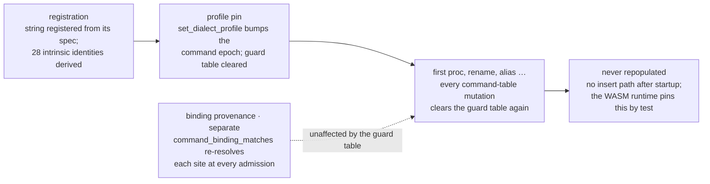
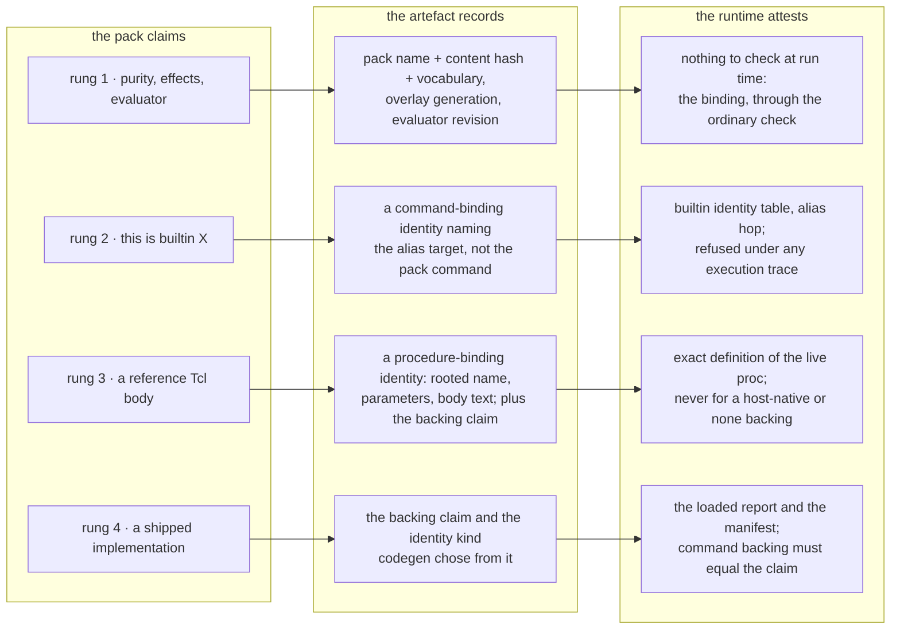
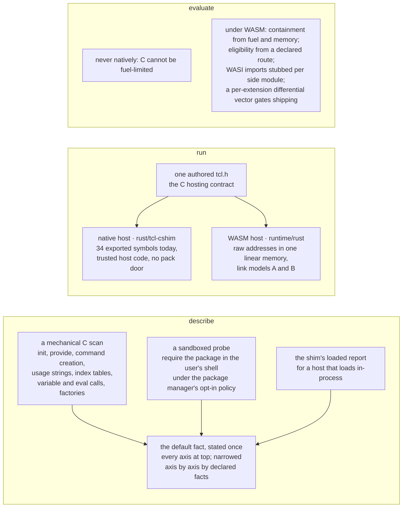

# Registry consumer contracts — description, identity, and backing

How far the command registry, and the `.tclspec` packs that extend it, can
drive the analyser, both code generators, and both runtimes; what that
requires of dialects and packages; and where C Tcl extensions fit. This is
the companion to [value-transfers.md](value-transfers.md), which states
the consumer interface for one axis (values), and to
[value-evaluation.md](value-evaluation.md), which states how an answer on
that axis is computed. This page places the value axis among the others
and holds the rest of the programme: the three descriptors the analyser
lacks — a clause grammar, a member effect, and an option effect that
retires the two native resolvers over a command's own option table — and
the identity and backing contracts a code generator or a runtime needs
before a pack claim can change *emitted code*. Analysis facts wait for
none of it — under the rulings recorded in the interface contract, a
loaded pack's facts are authoritative for analysis and optimisation as
soon as they are loaded, and the direct, expression, and private-pack
slices proceed without deciding anything here.

> **Status — decided rulings, proposed vocabulary.** The five rulings —
> the four in § *Rulings* and the narrower one in § *The two hook bodies
> that remain* — are the owner's decisions, and the build takes them as
> settled. Every identifier, count, and file path on this page was checked
> against the tree. The proposed vocabulary names nothing in the workspace:
>
> - **Clause grammar** — `ClauseGrammarSpec`, `ClauseRow`,
>   `ClauseRowShape`, `ClauseSlot`, `HandlerMatch`, `ClauseTiming`,
>   `LoopPhase`, `ClauseSelection`, `DefaultClause`, and the answer
>   shapes `ClausePlan`, `ResolvedClause`, `ClauseRowId`. A clause slot's
>   role is the registry's own `ArgRole`, not a new one.
> - **Member effect** — `MemberEffect`, `MemberReceiver`, `CallableRole`,
>   `StateScope`, `RelationSlot`, `InitTiming`, and the answer shapes
>   `MemberRow` and `MemberArity`.
> - **Option effects** — `OptionEffect`, `OptionEffectKind`, `EffectAxis`,
>   `SubstitutionKind`, `OptionEffectFamily`, `FamilyBase`,
>   `FamilyCombine`, and the answer shape `OptionEffects`.
> - **The derived-query layer** — `RegistryQueries` with the queries
>   `clause_plan`, `member_rows`, `option_effects`, `template_plan`,
>   `case_invocation`, `frame_effect`, `arg_roles`, `pattern_args`,
>   `return_type`, and `effects`, plus `CallWords` and
>   `ResolvedEffects`.
> - **Identity and backing** — `SiteClaim`, `PackFactStamp`,
>   `RuntimeBacking` with the `runtime_backing` field, `BodySource`,
>   `IdentityKind`, `CodegenCapability`, `ArtefactIdentityManifest`, and
>   the `alias_of` declaration.
> - **Packages and trust** — `SpecDirective`, `DependencyTier`,
>   `WorkspaceTrust`, and the `tcl spec test` verb.
>
> `AnalysisContext`, `AnalysisInputs`, `PlanAnswer`, `OperandId`,
> `TemplateWordPlan`, and `EvalAnswer` are
> [value-transfers.md](value-transfers.md)'s proposed names, used here as
> that page spells them; its `HandlerPlan` carries this page's
> `HandlerMatch` per `try` handler. Nothing on this page is a
> prerequisite of the consumer interface, the direct or expression routes,
> or the private-pack slice in
> [value-transfers-migration.md](value-transfers-migration.md).

Read it before extending `CommandSpec` with a fact a code generator or a
runtime would act on, before letting a pack name a compiler catalogue
member, or before designing how a package ships its runtime implementation.

## Three contracts, not one mechanism

The registry already describes nearly every fact the analyser needs, and
the analyser reads a fraction of it. Codegen already keys on registry
identities, but only a shipped builtin can be attested at run time. So the
work is three contracts:

- **Description.** Every axis has a declarative descriptor, a closed native
  catalogue for the algorithmic remainder, and one derived query that every
  consumer asks. Authored fields stay private to the query. A descriptor
  establishes locations and grammar; executable semantics are an explicit
  declaration or a derivation from a descriptor that states the same
  operation, never an inference from weaker metadata. Three descriptors
  complete the set: `ClauseGrammarSpec`, `MemberEffect`, and
  `OptionEffect`.
- **Identity.** Three mechanisms, kept distinct in text and diagrams:
  *command binding provenance* (does the spelling still bind to the
  described command?), *intrinsic guard eligibility* (may compiled code
  take a specialised fast path for it?), and *pack or implementation
  attestation* (is the implementation the pack described the one that is
  loaded?). A pack may claim. Only the runtime may attest. The artefact
  records the claim with the pack's identity. Admission of *emitted code*
  requires the attestation; a missing attestation is plain dispatch when
  the unit carries source and the VM has a compile service, and a refusal
  otherwise.
- **Backing.** A described command's executable behaviour arrives through
  one of four doors — a shipped builtin, Tcl source, a host-registered
  native command (a recompiled C extension is one), or nothing — and
  `RuntimeBacking`, one fact per command, says which, so codegen chooses
  the identity kind it emits from a declaration rather than a name.

```mermaid
flowchart TB
    subgraph description["description contract"]
        D1["every axis has a declarative descriptor<br/>plus a closed native catalogue for the rest"] --> D2["one derived query per axis<br/>authored fields private; a per-axis lint and ledger"]
        D2 --> D3["consumers ask the query, never a name<br/>analyser · lowering · codegen · editor providers · tools"]
    end
    subgraph identity["identity contract"]
        I1["a pack may claim<br/>a builtin identity, a body, a backing"] --> I2["the artefact records the claim<br/>binding identity + pack hash + overlay generation"]
        I2 --> I3["only the runtime may attest<br/>binding provenance · intrinsic guard · loaded report<br/>missing attestation → plain dispatch, or a refusal"]
    end
    subgraph backing["backing contract"]
        M1["four doors for executable behaviour<br/>shipped builtin · Tcl source · host-native · none"] --> M2["RuntimeBacking, one fact per command<br/>codegen chooses procedure binding, command binding, guard, or generic"]
    end
```



The fence around all three is the standing set of rulings, and every
proposal here fits inside it: SpecTcl declares and Rust executes; packs
name closed catalogues and never add to them; `completion` and
`dispatch_dependencies` are never authorable; a static resolution is a
candidate, never proof; no pack word loads native code; extensions are
recompiled, never binary-loaded; semantic AOT transforms are default-off,
and analysis reuse is not authorisation
([semantic-aot-optimisation.md](semantic-aot-optimisation.md),
[../registry/spec-packs.md](../registry/spec-packs.md) § *What a pack still
cannot say*, [../runtime/c-extension-shim.md](../runtime/c-extension-shim.md)
§ *Trust model*); and loaded workspace facts are authoritative for
analysis, with no widen-only tier and no provenance cap (the rulings in
[value-transfers.md](value-transfers.md) § *Rulings*).

## Rulings

Four questions belong to the owner rather than to the design, and the owner
has decided all four. Each is stated below as a **ruling**: the decision,
the rationale, and the consequences — which documents and which code
predicates change. The build takes them as settled, and step 1 of
§ *Build order* repairs the documents that state the rule a ruling
replaces. None of them blocks the analyser slices, and each is
independently landable. A fifth, narrower one sits with the hook body it
concerns, in § *The two hook bodies that remain*.

### Ruling — the shipped catalogues are generated from Rust

**Ruling.** The shipped code-generation catalogues — the intrinsic
table, the per-command runtime-backing classification, and the ABI
descriptor table in `rust/tcl-runtime-api/src/codegen_abi.rs` — are
generated from the Rust registry by an `xtask` build task. There is no
ahead-of-time `.tclspec` → `.rs` path, and a pack never contributes a
member to a closed code-generation catalogue. The one second backend is
Jim's surface, authored as SpecTcl and compiled in
(`rust/tcl-spectcl/core-surfaces/jim.tclspec`).

**Rationale.** The registry is already the source of truth the drift gate
reads: `rust/xtask/src/command_backing.rs` scans `runtime/rust`'s
`register_builtin` and `register_spec_builtin` calls against
`tcl_registry`'s core specs and writes
`docs/generated/wasm-command-backing.md`, accounting for the residue in
four committed lists (`HANDLER_EXTRA`, `STDLIB`, `NOT_REQUIRED`,
`KNOWN_UNBACKED`). Generating the catalogue instead replaces a scan of
source text with a query, and it is the direction `tcl-runtime-api`'s
shared `CodegenAbiImportId` descriptor table already takes. A SpecTcl
source cannot be the generator's input without making a workspace pack
able to add a catalogue member, which the standing rules forbid.

**Consequences.** No standing document text has to move:
[../registry/spec-packs.md](../registry/spec-packs.md) § *One authoring
format* states "the shipped cores … stay native Rust; there is no
ahead-of-time `.tclspec` → `.rs` path", and
[../registry/dialect-and-package-registry-redesign.md](../registry/dialect-and-package-registry-redesign.md)
§ *11. The open-questions ledger* records the same decision in its
"deliberately **not** in this ledger" paragraph. What lands is the
generator plus one sentence in [command-registry.md](command-registry.md)
§ *Authoring a spec without Rust* separating the Spec Studio's `.rs`
contribution export (`rust/tcl-spec-studio/src/render_rs.rs`, a drafting
aid whose output a human reviews into the tree) from a build-time
backend. Code predicates: `command_backing`'s four classification lists
become rows of the `runtime_backing` fact, and its registration scan
becomes a registry query that `tcl-vm` asks too.

**Decided with the build.** Step 1 of § *Build order* states the
separation in [command-registry.md](command-registry.md) § *Authoring a
spec without Rust*, and step 7 lands the generator.

### Ruling — trust gates execution, not authority

**Ruling.** Two things are separated. *Authority* is settled by the
interface contract's ruling 3: a loaded workspace pack's declarative facts
are believed, with no widen-only tier and no provenance cap, whatever the
editor's trust state. *Execution* is gated: in a workspace the editor has
not marked trusted, no pack hook body runs — `const_fold`,
`arg_role_resolver`, `constraints`, and every other family in
`rust/tcl-registry/src/pack_hooks.rs`'s slot tables abstains exactly as a
declared-but-unbound hook does, and each dormant hook is reported on the
pack file. Pack *evaluation* stays ungated, because its only input is the
pack itself, it runs once per `EvalSnapshotKey` under the budget, and the
frozen snapshot is what carries the declarative facts the authority ruling
protects. The editor's trust state is one input, `WorkspaceTrust`,
plumbed from the LSP client to `rust/tcl-spectcl/src/discovery.rs`; a
client that does not report it is treated as trusted, which is the
behaviour of the workspace tier today.

**Rationale.** The asymmetry between the two executions is the whole
argument. Evaluation is once, with pack-controlled input, under a command
count and wall-clock budget with `catch_unwind` and
quarantine-on-first-crash. A hook body runs per query, per keystroke, on
words taken from the document being analysed, so a hostile pack plus a
hostile document is a repeated execution surface with attacker-chosen
inputs — a different shape from the one
[../registry/spec-packs.md](../registry/spec-packs.md) § *Workspace trust:
the setting is gated, the workspace tier is not* argues is contained by
the sandbox, and the shape that page says forces the tier to become
trust-gated "if a hook family ever gains ambient authority". Gating the
bodies and not the evaluation keeps the pack's facts — which the authority
ruling makes authoritative — while removing the only surface whose inputs
the workspace does not control.

**Consequences.** `PackEnvironmentTier::provenance` in
`rust/tcl-spectcl/src/loader/environment_block.rs` gains the trust input
and maps a workspace pack to `Provenance::WorkspaceTrusted` or
`Provenance::WorkspaceUntrusted`, which makes the latter reachable from
discovery for the first time (the redesign's § *11.1 Owner decisions
pending*, item O9). The two identical `untrusted(…)` predicates —
`rust/tcl-spectcl/src/loader/eval.rs` over a `Tier` and
`rust/tcl-registry/src/model/registration.rs` over a `Provenance` —
collapse into one, exported from `tcl-registry` and called by the loader,
so the answer is the same at every entry point; the `EvalOptions::tier`
doc comment that still calls `Tier::Workspace` an untrusted class is
corrected to name the trust state instead of the discovery location.
`rust/tcl-spec-hooks/src/host.rs` — the hook host that owns the per-pack
engines and the containment — gains the dormant-hook abstention, and
`spectcl_check`'s tier parameter (redesign item O4) reports it. Documents:
[../registry/spec-packs.md](../registry/spec-packs.md) § *Workspace trust:
the setting is gated, the workspace tier is not* records the split, and
[../registry/dialect-and-package-registry-redesign.md](../registry/dialect-and-package-registry-redesign.md)
§ *6.4 Trust and provenance* keeps the security floor as it is — the floor
was never tier-keyed and does not become so.

**Decided with the build.** Step 1 of § *Build order* records the split in
[../registry/spec-packs.md](../registry/spec-packs.md) § *Workspace trust:
the setting is gated, the workspace tier is not*, and step 3 plumbs
`WorkspaceTrust` and gates the hook bodies on it.

### Ruling — a stub sidecar is a workspace-authored fact

**Ruling.** A stub declaration is the same class of fact as a
pack's, so the authority ruling applies to it unchanged: once ingested, a
stub's declarations are inputs to analysis on the same footing as a
shipped spec. [../contracts/dialect-stubs.md](../contracts/dialect-stubs.md)
§ *Stubs are declarations* drops "a declaration widens, never narrows" and
states nearest-wins instead — the document's own declaration answers where
it speaks, the catalogue answers elsewhere — with `security_floor`'s
monotone merge (invariant I6) still in force, because that floor is a
security contract rather than a precision cap. The six `StubFlags` gain
their consumers in the same change.

**Rationale.** The widen-only rule is the untrusted-tier rule read
literally, and the authority ruling withdraws exactly that reading.
Keeping it for stubs would make the narrower declaration — one the author
wrote about their own file, in their own file — weaker than the pack
declaration they could write beside it, which is a distinction no author
can predict. The flags are the visible cost: `parse_stub_flags` in
`rust/tcl-compiler/src/analyser/utils.rs` parses all six and
`StubCommandDef::to_declared_command` deliberately does not carry them,
its doc comment saying the set "has never had a consumer", so a user who
writes `-pure` gets nothing.

**Consequences.** `DeclaredCommand` grows the declared behavioural facts
beside its `arguments`, and each flag lands on the field its catalogue
counterpart uses: `-pure` on `Traits::PURE` (`SubCommand::pure` at
subcommand level), `-mutator` as a declared `SideEffect` write,
`-barrier` on `Traits::CREATES_DYNAMIC_BARRIER`, `-loop` on
`Traits::HAS_LOOP_BODY`, `-scope_alias` on `Traits::CREATES_SCOPE_ALIAS`,
and `-unsafe` on `Traits::UNSAFE` together with
`Traits::SAFE_INTERP_HIDDEN`. `DocumentCommandSurface`'s role lookup stops
unioning and resolves nearest-wins; `memory_ssa.rs`'s `CLOBBER_TRAITS`,
`ssa.rs`'s scope-alias discriminator, and `unit_scope.rs`'s alias walk
then see a stubbed command the way they see a catalogued one. Code
predicates: the union in `DocumentCommandSurface`, the flag drop in
`to_declared_command`, and the `Provenance::WorkspaceUntrusted` class a
sidecar ingests at — which becomes a provenance label for explanation, not
a precision class.

**Decided with the build.** Step 1 of § *Build order* states nearest-wins
in [../contracts/dialect-stubs.md](../contracts/dialect-stubs.md)
§ *Stubs are declarations*, and step 3 consumes the six flags on their
catalogue fields.

### Ruling — one C header, two hosts

**Ruling.** The authored, API-compatible `tcl.h` of
[../runtime/c-extension-abi.md](../runtime/c-extension-abi.md) is *the* C
hosting contract, and `rust/tcl-cshim` stays as its native host: the shim
keeps its role — `Interp<E: Engine>`, the engine interface's second
consumer, trusted host code loaded only through `Interp::load_static` —
and is retargeted from `include/tclshim.h` onto the authored header, so
one extension source compiles for both legs. `tclshim.h`'s opaque
`Tcl_Obj` is withdrawn in favour of the ABI's declared layout (§ 4.2), and
the shim's 34 exported symbols become a documented subset of the authored
header with every unimplemented declaration absent rather than opaque. The
standing rules are unchanged by this: extensions are recompiled, never
binary-loaded; no pack word loads native code; a shimmed command is not a
`-native` hook.

**Rationale, from the two documents and the exports.** Coverage decides
it. The shim's header is honest by rule and therefore small — an extension
needing string building, the dict API, variables, or `Tcl_EvalObjEx` does
not compile against it — while the ABI is held to a measured corpus of
nine `dltest` extensions from the Tcl 9.0.4 source tree plus two synthetic
probes, and its one relocation surprise is bounded: four GOT entries for
the stubs-introspecting `pkgooa` member, and zero for every other one. The
exports agree: `runtime/rust/src/capi.rs` has 17 `#[no_mangle] extern "C"`
functions in the ABI's § 4.3 direct-import style, sized on Tcl 9's
`ptrdiff_t` through `TclSize`, with its own module note recording that the
obj-lifecycle and result/eval-core slice is exported and the remainder of
the 81-function surface is absent — the WASM runtime has begun the ABI,
not the shim. And containment comes out the same either way: the shim's
`catch_unwind` guards Rust panics, not C undefined behaviour, and a
`panic = "abort"` build has no unwinding at all, so under WASM the
containment is the instance's linear memory and fuel in both designs.
What the shim uniquely supplies is engine
neutrality, which rung 4's evaluation needs and which the ABI's own
closing note endorses: "the durable artefact is this ABI plus the headers,
which is reusable whichever language the runtime is written in."

**Consequences.** [../runtime/c-extension-shim.md](../runtime/c-extension-shim.md)
§ *The implemented subset* becomes a subset table against the authored
header, and its § *Out of scope* list becomes the header's own scope list;
[../runtime/c-extension-abi.md](../runtime/c-extension-abi.md) § 7 gains
the native leg beside the WASM one. The shim's `Tcl_Size` switch
(`TCL_SHIM_TCL_MAJOR=8`) moves onto the authored header, which already
needs it. Code predicates: `rust/tcl-cshim/src/obj.rs` publishes the
`Tcl_Obj` layout instead of keeping it opaque; the engine interface gains
the variable door and the in-invocation eval door the shim document names
as missing, which are what `Tcl_ObjSetVar2` and `Tcl_EvalObjEx` need;
`rust/tcl-cshim/tests/pkga_e2e.rs`'s byte-for-byte expectations, captured
against Tcl 9.0.4's own `tcl.h`, become the shared conformance vectors for
both legs.

**What the WASM leg needs first**, in order: `Tcl_CreateObjCommand`
exported from `runtime/rust/src/capi.rs`, and a `Command` variant in
`runtime/rust/src/interp.rs` holding a shared-table function index — the
two halves § 12 of the ABI names as the unproven seam, since
`tcl_invoke_argv` already routes a prebuilt argv through `Interp::dispatch`
and so already reaches any command the table holds. Then the ownership
categories of [../runtime/c-api-ownership-contract.md](../runtime/c-api-ownership-contract.md)
encoded per export and gated, the `GOT.mem` / `GOT.func` list wired for
the address-of-runtime-symbol pattern, and the syntax-only `wasm32-wasi`
check turned into a CI gate that compiles the test extension. The engine
interface's narrowing of `TCL_BREAK` / `TCL_CONTINUE` to errors and
`TCL_RETURN` to `TCL_OK` is corrected before a hosted extension can
exercise the conservative default this page states for it.

**Decided with the build.** Step 1 of § *Build order* states the one
contract in [../runtime/c-extension-shim.md](../runtime/c-extension-shim.md)
§ *The implemented subset* and
[../runtime/c-extension-abi.md](../runtime/c-extension-abi.md) § 7, and
step 10 retargets the shim onto the authored header in the order above.

## The analyser: the description contract

The registry surface is far richer than the analyser's dispatch uses.

| Fact | Registry | Analyser |
|---|---|---|
| analyser hook variants | 43 (`AnalyserHookId`, `rust/tcl-registry/src/hooks.rs`) | most exist because a descriptor is missing or unconsumed; the residue is short |
| scope and interpreter transitions | resolvers on `upvar`, `global`, `variable`, `namespace`, `interp` (`rust/tcl-registry/src/state_transition.rs`) | the variable-alias, namespace, and interpreter families have no consumer under `rust/tcl-compiler/src/analyser/`; `frame_effect` is read only for alias-pair layout and level parsing (`param_traits.rs`, `diagnostics/usage.rs`); the command-binding family only by `interp alias` and the static-proc proof |
| loop and bind positions | roles and strided `repeated_args` | hardcoded indices in five handlers (`handlers.rs`: `dict for`, `dict update`, `foreach`, `incr`, `append` / `lappend`) |
| OO member effect | the member-effect descriptor (`MemberSpec::effect`, `MemberEffect`, in `rust/tcl-registry/src/definer.rs`) since step 2, beside the layout (`MemberKind`: `Flat`, `Wrapper`, `FlagKeyed`) and `arg_roles`, `slot`, `retraction`, `visibility_effect`, `surface`; every TclOO, snit, itcl, `SpecTcl` and `SslicTcl` member states one, and `DefinitionBodyGrammar::member_row` answers a statement's row | an eleven-arm keyword match in `analyser/oo.rs`, plus snit and itcl prefix conventions; the ledger counts about thirty-two rows on this axis |
| clause grammar | the clause-grammar descriptor (`ClauseGrammarSpec`, `rust/tcl-registry/src/clause_grammar.rs`), on `CommandSpec` and `SubCommand` since step 2: ten shipped grammars, one registry walk answering the roles and the clause-shape defect, and the loader reading the same type | three keyword walks (`lower_if` and `lower_try` in `lowering/structured.rs`, `handle_try_command` in `analyser/handlers.rs`), `orphaned_keyword_parent` in `analyser/commands.rs`, and the `on`-`ok` test in `cfg_builder/cfg_lower.rs`, plus `signature_scan/walker.rs`, the editor refactors, and `tcl-mcp`'s `datagroup.rs`; the ledger counts about thirty rows |
| option-selected semantics | the option-effect descriptor (`OptionSpec::effect`, `option_effect_families`, `option_effect.rs`), which replaced the two native resolvers over a command's own option table — `substitution_resolver` and `lsearch_pattern_args` — in step 2; `pattern_arg_resolver` remains an escape hatch no shipped spec sets | three consumers ask `CommandRegistry::substitutions_performed` correctly; the dynamic-name barrier and the `inner_head_performs_substitution` gate read only the trait, and `push_substituted_commands` re-walks a braced template for regions the answer does not carry |

Three descriptors are missing, and all three are specified below. The rest
is consumer migration, through the generic operations the interface
contract names.

- Scope aliases become one generic application of the
  `VariableCellAliasTransition` the registry already emits; namespace and
  interpreter handlers consume the typed `NamespaceTransition` and
  `InterpreterTransition` families instead of re-scanning flags and words.
- Loop, bind, and read-modify-write handlers bind by role. The
  special-variable table (`rust/tcl-registry/src/special_vars.rs`) gains a
  pack statement. `package require`, `provide`, and `ifneeded` get an
  argument layout instead of fixed indices.
- Most hook variants then become predicates on descriptors and retire, with
  the drift test in `rust/tcl-registry/tests/analyser_hooks.rs` re-baselined.
  What stays is analyser policy over typed facts, documented at its call
  sites as irreducible: dynamic-target synthetic domains, the
  interpreter-domain stack, export tombstone ordering, rename epochs,
  literal-iteration simulation, and value binding of a created interpreter.
  A hook variant whose handler implements one command's binding rules is
  still command-specific and is in the migration ledger, not the residue.
- The alias and command-binding resolvers abstain on dynamic words, and a
  witness test pins that before the analyser's isolated per-item pass
  consumes transitions. Each new descriptor is a four-surface change under
  [../contracts/command-spec-studio.md](../contracts/command-spec-studio.md).

### The clause-grammar descriptor

`ClauseGrammarSpec` is the registry type behind the loader's
`clause_grammar { … }` block, on the spec as
`CommandSpec::clause_grammar` (and `SubCommand::clause_grammar`, for `dict
for` and its siblings). It gives locations and grammar and nothing
executable: first-match dispatch, list iteration, and completion belong to
the consumer interface's structural plan, declared beside it and never
inferred from the slots. Step 2 built it in
`rust/tcl-registry/src/clause_grammar.rs` with two adaptations: `head` is a
`ClauseRow` (keyword `None`, `Once`), so the head carries its own timing —
`try`'s protected body, `for`'s init fixture — and `handler` is the
value-transfer interface's own `HandlerMatch`.

```rust,ignore
/// The word grammar of a clause chain: `if` / `elseif` /
/// `else`, `try` / `on` / `trap` / `finally`, `for`, `while`,
/// `foreach` / `lmap` / `dict for` / `dict map` / `array for`, `catch`.
struct ClauseGrammarSpec {
    /// The mandatory leading clause, filled positionally. Its slots are
    /// never keyword-matched, which is what makes `if else {a}` a
    /// well-formed `if` whose condition is the bareword `else`.
    head: &'static [ClauseSlot],
    /// Further clauses in declaration order. The walk compares a word
    /// against a keyword only when asking "does a clause start here?".
    rows: &'static [ClauseRow],
    /// At most one trailing clause, last; anything after it is extra.
    tail: Option<ClauseRow>,
    /// The body word that runs a following clause's body instead of its
    /// own (`try`'s and `switch`'s `-`). `None`: no clause falls through.
    fallthrough_body: Option<&'static str>,
    /// The clause that runs when no earlier clause is selected, and
    /// whether it is legal anywhere but last.
    default_clause: Option<DefaultClause>,
    /// How many clauses one call selects.
    selection: ClauseSelection,
    /// Releases the whole grammar is available at; `None` is every one.
    surface: Option<&'static [SpecSurface]>,
}

struct ClauseRow {
    /// The literal introducing word; `None` for a keywordless group or a
    /// tail whose keyword may be omitted (`if`'s implicit final body).
    keyword: Option<&'static str>,
    /// Whether that keyword is required when the clause is present.
    keyword_required: bool,
    /// What repeats, and how.
    shape: ClauseRowShape,
    /// When the clause's body runs relative to the call. Conditional
    /// depth only — never a CFG edge, which keeps the descriptor on the
    /// data side of the `completion` exclusion.
    timing: ClauseTiming,
    /// Releases this row is available at; `None` inherits the grammar's.
    /// `array for` is Tcl 9.0; a 9.1 clause word narrows the same way.
    surface: Option<&'static [SpecSurface]>,
}

enum ClauseRowShape {
    /// Zero or more clauses, each introduced by `keyword`, whose slots are
    /// filled positionally after it (`elseif`, `on`, `trap`).
    Repeated { slots: &'static [ClauseSlot] },
    /// Exactly one clause (`finally`, `else`).
    Once { slots: &'static [ClauseSlot] },
    /// A keywordless repeating group whose stride and trailing exclusion
    /// are the `CommandSpec::repeated_args` layout at this index — the
    /// binder groups of `foreach` / `lmap` / `dict for`. The stride stays
    /// `RepeatedArgLayout`'s fact; this row cites it and never restates
    /// it.
    Group { layout: u8 },
}

struct ClauseSlot {
    /// The registry's own `ArgRole`, so a clause slot and an `arg` row
    /// are one vocabulary and no consumer learns a second one. The six
    /// a clause uses: `Expr` (`if`'s, `for`'s, and `while`'s condition),
    /// `Body` (a script; which frame it runs in is `body_kind` /
    /// `body_scope`, not this slot), `LoopVarList` (`try`'s `{msg opts}`,
    /// `catch`'s result and options words, `dict for`'s `{k v}`),
    /// `Pattern` (a word that selects its clause), `Keyword` (a `?noise?`
    /// word), and `Value` for anything else.
    role: ArgRole,
    /// The literal word an `ArgRole::Keyword` slot accepts. Such a slot
    /// is optional by construction and is *not* highlighted as a
    /// keyword — the distinction `CLAUSE_NOISE_KEYWORDS` already draws
    /// against `CLAUSE_KEYWORDS_WITHOUT_COMMAND_SPEC`
    /// (`rust/tcl-registry/src/traits.rs`).
    noise: Option<&'static str>,
    /// The match vocabulary of an `ArgRole::Pattern` slot that selects
    /// its clause. At most one slot per row carries it, which is what
    /// lets the `.tclspec` row state it as a row flag.
    handler: Option<HandlerMatch>,
    /// True when the names an `ArgRole::LoopVarList` slot binds are bound
    /// only if a runtime *data* condition holds — `RepeatedArgLayout`'s
    /// `conditional_binding` fact, on a clause slot. Such a slot never
    /// carries `ArgRole::VarWrite`, for the reason
    /// `RepeatedArgLayout` gives: `VarWrite` is read everywhere as an
    /// unconditional SSA def.
    conditional_binding: bool,
    /// Whether the slot may be absent.
    optional: bool,
}

enum HandlerMatch {
    /// A completion code or its name (`on ok`, `on 3`).
    CompletionCode,
    /// An `-errorcode` prefix list (`trap {POSIX ENOENT}`).
    ErrorCodePrefix,
}

enum ClauseTiming {
    /// Runs when its own clause is selected: `if`, `elseif`, `else`,
    /// `on`, `trap`, and a `switch` arm.
    Selected,
    /// Runs whatever the outcome: `finally`.
    Always,
    /// Runs once per iteration: the body of `while`, `for`, `foreach`,
    /// `lmap`, `dict for`, `array for`.
    PerIteration,
    /// A loop fixture: `for`'s init before the first test, `for`'s next
    /// between iterations.
    LoopFixture(LoopPhase),
    /// Runs unconditionally, and its completion is observed rather than
    /// propagated: `catch`'s and `try`'s protected body.
    Protected,
}

enum LoopPhase { Init, Next }

enum ClauseSelection {
    /// The first clause whose condition or pattern matches, and no other.
    FirstMatch,
    /// Every clause present runs, in order.
    All,
}

struct DefaultClause {
    /// Index into `rows`, or `None` when `tail` is the default.
    row: Option<u8>,
    /// Whether the default is legal only as the last clause.
    final_only: bool,
}
```

**The derived query.** One answer per call, and the only clause answer any
consumer asks for:

```rust,ignore
fn clause_plan(&self, inv: &ResolvedInvocation) -> Option<ClausePlan>;

struct ClausePlan {
    /// Every clause the call supplied, in source order.
    clauses: Vec<ResolvedClause>,
    /// The roles the walk assigned, in the `(index, ArgRole)` shape
    /// `CommandRegistry::arg_indices_for_role` already folds.
    roles: Vec<(usize, ArgRole)>,
    /// The first structural defect, or `None` for a shape the grammar
    /// accepts — the existing `ClauseShapeError`, unchanged.
    defect: Option<ClauseShapeError>,
}

struct ResolvedClause {
    /// Index of the introducing keyword word, or `None` when omitted.
    keyword_index: Option<usize>,
    /// Which row matched.
    row: ClauseRowId,
    /// One entry per slot, in declaration order, carrying the operand
    /// index and the slot it filled.
    operands: Vec<(usize, ClauseSlot)>,
    timing: ClauseTiming,
    /// Set when this clause's body word is the fall-through marker: the
    /// index of the clause whose body it runs.
    falls_through_to: Option<usize>,
    /// True for the clause `default_clause` names.
    is_default: bool,
}
```

**How `clause_shape_check` and `case_list` relate to it.**
`clause_shape_check` is the *escape hatch*, not the mechanism: the walk
derives `ClauseShapeError` from the grammar (`ClauseGrammarSpec::walk`, the
loader's former `ClauseGrammar::walk` moved into the registry), so `if_.rs`'s
`if_arg_roles` and `check_if_shape` have retired and
`CommandSpec::clause_shape_check` stays only for a chain no grammar can
spell. `Traits::STRUCTURALLY_CHECKED_ARITY` is the opt-in that makes the
walk's defect a command's arity diagnostic (`if`'s E004, read through
`CommandRegistry::clause_shape_defect`); `try` and the loops keep an
ordinary arity range beside their grammars.
`case_list` stays a separate field for the reason the frozen-syntax memo
gives: a case list is a *value* — `{pattern body …}` inside one word —
rather than a word grammar, so `CaseListSpec`'s own `invocation` and
`inline_clauses` answers stay its own. The two share their vocabulary
where they overlap and nowhere else: `fallthrough_body`, `default_clause`,
and `ClauseSelection::FirstMatch` mean the same thing in both, and
`CaseMatchMode` has no clause-grammar counterpart because a clause is
selected by a condition or a handler pattern, never by a match mode.

**Consumers.** `lower_if` and `lower_try` in
`rust/tcl-compiler/src/lowering/structured.rs` build `Statement::If`'s
`clauses` / `else_body` and `Statement::Try`'s `handlers` / `finally_body`
from the plan; `TryHandler::kind` stops being a `String` re-matched in
`rust/tcl-compiler/src/executable_ir.rs` and becomes the row's
`HandlerMatch`, which the interface contract's `HandlerPlan` carries per
handler; `handle_try_command` in `analyser/handlers.rs` walks the
plan's clauses and reads each one's `timing` instead of asking
`Traits::BRANCH_SELECTED_BODY` and then matching `finally`;
`orphaned_keyword_parent` in `analyser/commands.rs` becomes a lookup of
the keyword in the grammars that declare it; `cfg_builder/cfg_lower.rs`
reads `is_default` and `timing` rather than `handler.kind == "on" &&
handler.match_arg == "ok"`; `signature_scan/walker.rs`, the editor
refactors (`refactor/if_to_switch.rs`, `refactor/datagroup.rs`), and
`tcl-mcp`'s `datagroup.rs` ask the plan. Recovery, the formatter, and the
semantic-token classifier read the slot's `noise` word for the `then`
distinction they draw by hand.

**The `.tclspec` row shape** extends the block the loader already reads
([../spec-dsl-examples/if.tclspec](../spec-dsl-examples/if.tclspec) is
the port that designed it), adding the row flags and the two chain-level
rules:

```tcl
clause_grammar {
    head {Body} -timing protected
    repeated on   {Pattern LoopVarList Body} -timing selected \
                                             -pattern completion-code
    repeated trap {Pattern LoopVarList Body} -timing selected \
                                             -pattern error-code-prefix
    tail finally  {Body} -timing always
    fallthrough_body -
    selection first-match
}
```

**The studio field.** `clause_grammar` has no `GAPS` row: as a
`CommandSpec` field, `ClauseGrammarSpec` is plain data all the way down —
the property that let `object_class` leave that bucket — so the four
surfaces moved together in step 2: the field on the type with its
`rust/tcl-spec-studio/src/coverage.rs` witnesses (the grammar, a row, a
slot, the default clause), the loader spelling above recorded in the
frozen-syntax memo's coverage matrix, the renderer emitting it, and
`schema.rs` / `draft.rs` / `help.rs` surfacing it with an example
(`rust/tcl-spec-studio/src/store.rs` reports the grammar itself, and the
form shows its rows read-only).

**Tests.** `rust/tcl-spec-studio/tests/spectcl_ports.rs`'s
`the_clause_grammar_derivation_agrees_with_the_shipped_walk` widens from
`if` to every grammar-carrying command, walking the derived grammar
against each shipped walk's own test matrix, including the two subtle `if`
rows (`if else {a}` is valid; a bare trailing body needs no `else` but
nothing may follow it) and the `try` fall-through marker;
`derivations_are_recorded_as_derivations` in the same file keeps the rule
that a derivation is an explicit opt-in and never an implicit consequence
of declaring the data it reads;
`rust/tcl-compiler/tests/cfg.rs` and `analyser.rs` keep their `if` / `try`
/ loop cases as the behavioural parity gate;
`rust/tcl-registry/tests/registry_sweep.rs` gains the rule that a
`Group` row's `layout` indexes a real `repeated_args` entry and that a
`conditional_binding` var-list slot never carries `ArgRole::VarWrite` —
the rule the existing
`repeated_arg_layouts_never_pair_conditional_binding_with_an_ssa_def_role`
already states for layouts.

**Build-order step.** Step 2.

### The member-effect descriptor

`MemberEffect` goes on `MemberSpec` beside `kind`. `MemberKind` stays the
*layout* fact — `Flat`, `Wrapper`, `FlagKeyed` — and `MemberEffect` is
what the member declares. The vocabulary is closed and family-neutral: no
variant names TclOO, snit, or itcl, and `DefinerFamily` stays the only
place a family is named. Step 2 built it in
`rust/tcl-registry/src/definer.rs` with three adaptations: what a wrapper
does to the member it wraps is `MemberSpec::wrapper_shift` (a
`WrapperShift` of an optional receiver and an optional
`DeclaredMemberVisibility` — `self` moves the member to the type object,
`private` and itcl's modifiers declare its visibility), since a wrapper's
effect is `Configuration` and `MemberKind::Wrapper` alone does not say which
shift it applies; `member_rows` is `DefinitionBodyGrammar::member_row`,
answering one member statement at a time, since the analyser already
segments the body; and a wrapper's bare block form answers an
`InitScript { body_slot: 0, timing: AtDefinition }` row whose receiver and
visibility are the ones the block's own members take.

```rust,ignore
/// Proposed. What one member word of a definition body declares.
enum MemberEffect {
    /// A callable member: `method`, `classmethod`, `typemethod`,
    /// `constructor`, `destructor`, snit's `onconfigure` / `oncget`,
    /// itcl's access-modified methods.
    Callable {
        /// Which dispatch side the member lands on, before any
        /// `MemberKind::Wrapper` shift is applied.
        receiver: MemberReceiver,
        /// Its place in the object's lifecycle.
        role: CallableRole,
        /// Slot holding the declared name, 0-based after the keyword;
        /// `None` when the keyword *is* the name (`constructor`).
        name_slot: Option<u8>,
        /// Slot holding the formal parameter list.
        params_slot: Option<u8>,
        /// Slot holding the body.
        body_slot: Option<u8>,
    },
    /// A dispatch redirect: `forward NAME PREFIX ?word …?`. The prefix is
    /// an `ArgRole::CommandPrefix`, so the callback-arity check already
    /// applies.
    Forward { name_slot: u8, prefix_slot: u8 },
    /// Declares state: `variable`, `typevariable`, itcl's `common`,
    /// snit's `option`.
    StateDeclaration { scope: StateScope },
    /// Contributes to an ancestry or interposition slot: `superclass`,
    /// `mixin`, `filter`, itcl's `inherit`. The operation and dedup rule
    /// stay `MemberSpec::slot` (`SlotSpec`); this variant says which
    /// graph the slot feeds.
    Relation { slot: RelationSlot },
    /// Changes an existing member's visibility. The value stays
    /// `MemberSpec::visibility_effect` (`MemberVisibility`).
    Visibility,
    /// Removes existing members. Which arguments stays
    /// `MemberSpec::retraction` (`MemberRetraction`).
    Retraction,
    /// A script with no member of its own, run at definition or
    /// construction time: snit's `typeconstructor`, a wrapper's bare
    /// block form (`MemberSpec::wrapper_block_body`).
    InitScript { body_slot: u8, timing: InitTiming },
    /// Configures the definition and declares nothing:
    /// `definitionnamespace`, `reserved_trailing_words`-style keyword-only
    /// rows, `property`'s flag-keyed accessors once their bodies are
    /// `Callable` rows of their own.
    Configuration,
}

enum MemberReceiver {
    /// The instances the definition creates.
    Instance,
    /// The class or type object itself (`self method`, `typemethod`).
    TypeObject,
    /// Both sides, which itcl's `common` and snit's `option` need.
    Both,
}

enum CallableRole { Method, Constructor, Destructor, Accessor, Mutator }

enum StateScope { PerInstance, PerType, Option }

enum RelationSlot { Superclass, Mixin, Filter }

enum InitTiming { AtDefinition, AtConstruction }
```

**What the analyser derives**, and nothing more:

```rust,ignore
fn member_rows(&self, inv: &ResolvedInvocation) -> Option<Vec<MemberRow>>;

struct MemberRow {
    /// Index of the member keyword in the definition body's statement.
    keyword_index: usize,
    effect: MemberEffect,
    /// Side after every wrapper shift is applied.
    receiver: MemberReceiver,
    /// The declared name when the effect names one and the word is
    /// literal. A dynamic word abstains, and the abstention is what
    /// `OoDefinitionEvidence::dynamic_target` already records.
    name: Option<String>,
    /// Derived from the parameter-list slot, when the effect has one.
    arity: Option<MemberArity>,
    /// The family's name-based default, overridden by the member's own
    /// option word (`DeclaredMemberVisibility`, unchanged).
    visibility: DeclaredMemberVisibility,
    /// The body operand, for the generic body-analysis operation.
    body: Option<OperandId>,
    /// The slot operation for a `Relation` row (`SlotOp`, unchanged).
    slot_op: Option<SlotOp>,
    /// Releases this row is available at (`MemberSpec::surface`).
    surface: Option<&'static [SpecSurface]>,
}

struct MemberArity { required: usize, optional: usize, variadic: bool }
```

Three derivations follow generically, one per consumer that hand-rolls it
today:

- **Class hierarchy.** Every `Relation { slot: Superclass }` row, folded
  through `SlotSpec::apply` so `-append` and friends compose, gives the
  ancestry graph; `Mixin` and `Filter` give the interposition order. A
  dynamic class word abstains and sets
  `OoDefinitionEvidence::dynamic_class_relations`.
- **Method arity.** `MemberArity` from the `params_slot`, so the callback
  and wrong-number-of-arguments checks reach a definer member without a
  second parameter-list parser.
- **`my` dispatch.** A row is reachable through `my` when its `receiver`
  and `visibility` say so; `DeclaredMemberVisibility::Private` and
  `Unexported` are already the distinction, and
  `DefinitionBodyGrammar::builtin_object_methods` already carries a
  `BuiltinMethodReceiver` per builtin. The rule that `my variable v` works
  where `$obj variable v` does not becomes a comparison of the row's
  receiver against the dispatch spelling, not a name list.

**The sites this retires.** `apply_oo_subcommand_in` in
`rust/tcl-compiler/src/analyser/oo.rs` has eleven keyword arms —
`superclass`, `mixin`, `method`, `classmethod`, `constructor`,
`destructor`, `variable`, `property`, `forward`, `private`, `self` — and
each becomes one `match` on `MemberEffect`: the two slot arms fold through
the row's `slot_op`, the four callable arms become one `Callable` arm
keyed on `CallableRole` and `MemberReceiver`, `variable` becomes
`StateDeclaration`, `forward` becomes `Forward`, `property` becomes its
flag-keyed `Callable` rows, and `private` / `self` disappear because a
wrapper's shift is already `MemberKind::Wrapper` and its side is the
row's resolved `receiver`. `MethodKind::from_str_lossy` in
`rust/tcl-compiler/src/ir.rs` retires with its call site in
`rust/tcl-compiler/src/lowering/mod.rs`: `MethodKind` stays as the IR's
*shape* fact and is constructed from `CallableRole` and `MemberReceiver`,
the same two-facts-one-operation relationship `LoweringHookId::Incr` has to
`NativeLowering::CellReadModifyWrite`. The `constructor` / `destructor`
literals the ledger counts across ten `tcl-lsp-core` providers read the
row instead.

**The `.tclspec` row shape** is one flag on the `member` row the loader
already reads, so the snit port gains nothing but the word:

```tcl
definition_body {
    family Snit
    member method    -roles {0 Name 1 ParamList 2 Body} \
                     -effect {callable -receiver instance -role method}
    member typemethod -roles {0 Name 1 ParamList 2 Body} \
                     -effect {callable -receiver type-object -role method}
    member constructor -roles {0 ParamList 1 Body} \
                     -effect {callable -receiver instance -role constructor \
                              -params 0 -body 1}
    member superclass -all-refs Class -slot Set -effect {relation superclass}
    member variable   -all-vars -slot Append -dedup \
                     -effect {state-declaration per-instance}
    member option     -effect {state-declaration option}
    member export     -all-refs Method -visibility Exported -effect visibility
    member renamemethod -all-refs Method -retracts FirstArgument \
                     -effect retraction
    member self       -kind Wrapper -block-body -effect configuration
}
```

**The studio field.** `definition_body` was a `DraftOpaque` `GAPS` entry
because the shipped grammars are named `&'static` descriptors a draft
cannot recover — the same reason `case_list` and `body_scope` are there —
and `-effect` rode the change that moved it out: the variant on
`MemberSpec` with its `coverage.rs` witness, the `-effect` flag in the
loader and the memo's coverage matrix, the renderer emitting it, and the
studio's member-row view. The `GAPS` row went the way `object_class`'s
did, because a `member` row with an `-effect` is plain data and a draft
carries the whole thing: seeding writes the shipped grammar's name when the
grammar's data is one of them, and the whole grammar otherwise — every
`SpecTcl` and `SslicTcl` document grammar, which the round trip now
carries row by row. The loader grew the rows the inline form needed:
`member_option` (so `method ?-export?` and `command ?-override?` are
data), `-shift`, and the `SpecTcl` and `SslicTcl` families.

**Tests.** `rust/tcl-registry/tests/registry_sweep.rs` gains the
agreement rules: every `MemberSpec` carries an `effect`; a `Callable`
row's `name_slot`, `params_slot`, and `body_slot` index positions its
`arg_roles` types as `Name`, `ParamList`, and `Body`; a `Relation` row
carries a `slot`; a `Retraction` row carries a `retraction`; a
`Visibility` row carries a `visibility_effect`. As built, the sweep
(`every_member_carries_an_effect_that_agrees_with_its_roles`) holds the
callable's slots to exactly the *first* such positions — the reading the
loader applies to an unwritten slot — reads a `Forward` row's prefix slot
as the target's `CommandName` (the words after it are prepended
arguments, not one list), and accepts itcl's `inherit`, which takes no
slot operation words, as a relation over a plain list of class
references; `no_member_effect_names_a_family` is the negative.
`rust/tcl-registry/tests/analyser_hooks.rs`'s
`analyser_hook_stamps_are_disjoint_from_definer_families` is the existing
separation gate and is re-baselined as the OO hook variants retire.
`rust/tcl-compiler/tests/mro_lattice_adversarial.rs` is the hierarchy
gate; `rust/tcl-compiler/tests/analyser.rs` and
`rust/tcl-lsp-server/tests/preview_tickets_e2e.rs` — whose own comment
records that a new definer spelling needs an `apply_oo_subcommand` arm —
become the proof that it needs none: a new member spelling in a
`.tclspec` pack reaches the analyser, the navigation providers, and the
lowering with no consumer edit.

**Build-order step.** Step 2.

### The derived-query layer

One query per axis over the resolved invocation the interface contract
already extends, and every consumer — analyser, lowering, codegen,
recovery, signature scan, formatter, editor refactors, MCP tools — asks
these and never a name. The answers are the types the registry already
returns where it has one, so the layer is a re-keying rather than a second
set of facts:

```rust,ignore
/// Rust-shaped pseudocode: the axis queries, not compilable signatures.
trait RegistryQueries {
    /// The one resolution every other query projects from —
    /// `ResolvedInvocation`, in `tcl-registry`'s
    /// `resolved_invocation.rs`.
    fn invocation(&self, words: &CallWords, ctx: &AnalysisContext)
        -> ResolvedInvocation;

    /// § The clause-grammar descriptor.
    fn clause_plan(&self, inv: &ResolvedInvocation) -> Option<ClausePlan>;
    /// § The member-effect descriptor.
    fn member_rows(&self, inv: &ResolvedInvocation) -> Option<Vec<MemberRow>>;
    /// § Options with semantic effects.
    fn option_effects(&self, inv: &ResolvedInvocation) -> OptionEffects;
    /// The template-word plan that replaces `substitution_resolver`.
    fn template_plan(&self, inv: &ResolvedInvocation)
        -> Option<TemplateWordPlan>;

    /// Existing answer types, re-keyed off the resolution:
    fn case_invocation(&self, inv: &ResolvedInvocation)
        -> Option<(CaseInvocation, Vec<InlineCaseClause>)>;
    fn frame_effect(&self, inv: &ResolvedInvocation)
        -> Option<(FrameLevel, Vec<OperandId>)>;
    fn state_transitions(&self, inv: &ResolvedInvocation) -> StateTransitions;
    fn arg_roles(&self, inv: &ResolvedInvocation) -> Vec<(usize, ArgRole)>;
    fn pattern_args(&self, inv: &ResolvedInvocation) -> Vec<PatternArg>;
    fn return_type(&self, inv: &ResolvedInvocation) -> Option<TclType>;
    fn effects(&self, inv: &ResolvedInvocation) -> ResolvedEffects;

    /// The value axis is [value-transfers.md](value-transfers.md)'s
    /// `structure` / `transfer` / `evaluate` over the same resolution.
}
```

Three rules hold across every axis. An answer is a value, not a callback
into the analyser. An answer carries the abstention explicitly — a dynamic
word, an unreadable call, a release the profile does not name — rather than
returning a default that reads as a fact. And an answer is keyed on the
analysis context, so a query asked under a different overlay generation,
binding set, or target profile is a different query.

### The per-axis lint and ledger

Each axis gets a lint whose scope is every tier, not the compiler alone.
The lint is a source-level rule with a narrow shape: a crate outside
`tcl-registry` may not compare a word against a command name, subcommand
name, member keyword, clause keyword, or option spelling that the registry
declares. Each site either moves onto the axis query or carries a ledger
entry with its axis, its reason, and its expiry — the same ledger and the
same sanctioned-irreducible test the migration plan applies to the value
axis. The inventory is the starting baseline: the hand-written-knowledge
table in [value-transfers-migration.md](value-transfers-migration.md)
§ *Hand-written command knowledge across the tiers* counts 89 other-axis
rows in the editor and tooling crates, about thirty on the clause axis and
about thirty-two on the member axis, and names four clean tiers
(`tcl-lsp-db`, `tcl-lsp-server`'s `lib.rs`, `tcl-explorer`, `tcl-lexer`)
as the reference the rest matches.

The lint is `cargo xtask registry-axes` (`rust/xtask/src/registry_axes.rs`,
the `xtask-registry-axes` gate in `make xtask-check`), a sibling of the
value-transfer gate over the same ten roots. Its vocabulary is computed,
never listed: every command and subcommand name, option spelling and alias,
definition-body member keyword, clause keyword, and special-variable name
the registry declares across every loadable dialect and the shipped
`.tclspec` packs. A site is such a word as the operand of `==` / `!=`, a
`matches!` pattern, a `match` arm pattern, a `.eq(` argument, an element of
an inline array searched with `.contains(`, or an entry of a `&[&str]` table
the file reads again; the scan runs over the lexer's tokens and skips the
item a `#[cfg(test)]` attribute guards. A reviewed site carries
`// registry-axis-ok: <axis> — <reason>; until <step N | slice N | never>`
on its line or in the comment block above it (above the enclosing `match`
or `matches!` for an arm), or its file carries one
`// registry-axis-ok(file): …`; the axis is one of `command`,
`subcommands`, `clause_grammar`, `definition_body`, `options`,
`special_vars`, or `irreducible` — the migration plan's names, so a site
waived for both gates names one axis — and only `irreducible` may expire
`never`. The ledger is generated as `docs/generated/registry-axes.md`:
every waiver by axis with its expiry, and the ratchet table. `--check`
fails on a count above its pin, a stale pin, an unknown axis, a missing
expiry, or an expiry naming a step or slice that has landed, so a new
hand-written row fails the gate rather than being noticed in review.

### The two hook bodies that remain

Every other native resolver becomes a descriptor. Two hook bodies stay,
and both are facts-only — they return typed facts and never touch the
analyser:

- **An argument-role resolver** for a word grammar `ClauseGrammarSpec`
  cannot spell. Its contract: it receives the call's post-name words and
  the profile-filtered option descriptors, exactly as
  `PatternArgResolverContext` supplies them today; it returns
  `Vec<(u8, ArgRole)>` and nothing else; it is pure over its declared
  inputs; a shape it cannot read returns the empty vector, which means
  "fall back to the `arg` rows" and never "no roles". The existing
  `arg_role_resolver_roles` declaration stays the closed set of roles it
  may emit, so a consumer knows the possible answers without running it,
  and `rust/tcl-spectcl/src/loader.rs`'s
  `native_hook_tables_cover_their_catalogues` keeps the native table
  honest.
- **A state-transition resolver** emitting alias and namespace facts only.
  Its contract: it receives `InvocationArguments` and returns
  `StateTransitions`; it may emit `VariableCellAliasTransition` facts and
  `NamespaceTransition` facts, and no `CommandBindingTransition`,
  `InterpreterTransition`, `ObjectDispatchTransition`, or
  `TraceTransition` fact — those four decide binding and realm identity,
  which is the compiler's own proof; it abstains on a dynamic target word,
  and the abstention widens through `StateTransitionWidening` rather than
  producing a narrower fact.

  That reverses `state_transitions_value` in
  `rust/tcl-spectcl/src/loader.rs`, which reads the `composition` row,
  drops `argument_shape`, `resolver`, `widen`, `covers`, and `commit` with
  a notice, and records in its own comment that "the resolver in
  particular is reference-only by design". So it is a **ruling**, narrower
  than the four in § *Rulings* and decided with them. *The reason*: the
  alias family is the one whose answer is a pure function of literal
  words, its consumer — the generic scope-alias application — is already
  generic, and refusing it leaves a vendor `upvar`-alike unauthorable
  while `frame_effect`, the same fact in descriptor form, is authorable
  already. *Consequences*:
  [../registry/spec-packs.md](../registry/spec-packs.md) § *What a pack
  still cannot say* moves the `state_transitions` resolver from documented
  vocabulary the loader does not read to readable for the alias and
  namespace families; the loader's drop list loses `resolver` and the four
  plain rows beside it, which is what lets the `state_transitions` `GAPS`
  row become the resolver alone; and `rust/tcl-registry/src/pack_hooks.rs`
  gains the family with its slot table, under
  `native_hook_tables_cover_their_catalogues`. Step 1 of § *Build order*
  states it in the pack document.

### The studio round-trip for `semantic_operation`

`semantic_operation` was a `DraftOpaque` entry in
`rust/tcl-spec-studio/src/render_spectcl.rs`'s `GAPS`, so a draft recorded
only that the field was set and the renderer could not write it back. The
gap was one-sided: the loader reads the word in full
(`parse_semantic_operation` in `rust/tcl-spectcl/src/loader.rs`, over
`Invoke` / `{Intrinsic ID}` / `{StructuredLowering ID}`), and
`SemanticOperationId` is a `Copy` enum of three variants whose payloads
are the `IntrinsicId` and `LoweringHookId` catalogues, with `kind_str` and
`detail_str` already returning the two words the spelling needs. It is
neither a function pointer nor a reference to a named `&'static`
descriptor, which are the two reasons `GapKind::DraftOpaque` documents, so
the change was on the draft side only: seeding records the `(kind,
detail)` pair, the renderer writes it in the loader's spelling
(`tcl_spectcl::semantic_operation_spelling`, over the closed
`semantic_operations()` vocabulary), and the row left `GAPS` in step 2 the
way `object_class`'s did. Three details are load-bearing:

- **The catalogue stays closed.** A pack names a member; it never adds
  one. An unknown identifier fails closed through `VocabularyClass`, which
  is invariant I9.
- **A stamp is still gated.** Round-tripping the field through the studio
  does not change who may set it: the tier gate on native identities and
  the codegen-axis floor decide that, and § *Four rungs of codegen meeting
  `.tclspec`* states both.
- **The gate direction is the point.** `spectcl_roundtrip` allows a
  rendered-then-reloaded draft to differ only on `GAPS` keys, so removing
  the row is what proves the round trip; a `TODO(spectcl)` comment in
  rendered output is the visible trace while the row exists.

**Build-order step.** Step 2 — landed, with `definition_body` leaving
`GAPS` in the same change and `clause_grammar` landing as a field that
never needs a row there.

## Options with semantic effects

Two native resolvers in the registry read a command's own option table and
computed a semantic answer about the call: `substitution_resolver`
(`subst_substitutions` in `rust/tcl-registry/src/substitution.rs`, which
kinds of substitution `subst` performs) and `pattern_arg_resolver`
(`lsearch_pattern_args`, which argument carries which pattern language for
`lsearch`). Both were `GapKind::Excluded` in the studio's `GAPS` with the
same reason — "a native resolver over a command's own `OptionSpec` table …
keeping it excluded makes the native-only boundary explicit until a
declarative selector exists". This is that selector, and step 2 built it
(`rust/tcl-registry/src/option_effect.rs`): `substitution_resolver` and
`lsearch_pattern_args` are gone, and `pattern_arg_resolver` remains only as
an escape hatch no shipped spec sets. The two unrelated clients are what
qualify it as a family-neutral operation rather than a command ID in
disguise, and two more follow from the same descriptor: `regexp_arg_roles`
in `rust/tcl-registry/src/commands/tcl/regexp_.rs`, and the five option
fields `CaseListSpec` carried per command instead of per option, now
retired.

**The descriptor.** An option row may declare the semantic effect its
presence has on the call. The effect is an axis and a value, the axis is a
closed catalogue, and a family of options over one axis carries the base
the axis starts from:

```rust,ignore
/// Built (`rust/tcl-registry/src/option_effect.rs`). On `OptionSpec`, beside
/// `value`, `surface`, and `lifecycle`.
struct OptionEffect {
    /// What this option does to its axis.
    kind: OptionEffectKind,
    /// The family it belongs to; options in one family are mutually
    /// overriding or mutually exclusive by the family's own rule.
    family: &'static str,
}

enum OptionEffectKind {
    /// Turn this axis value off (`subst -novariables`, and
    /// `lsearch -exact` over the pattern-language axis).
    Disables(EffectAxis),
    /// Turn this axis value on, and — when the family's base says so —
    /// turn every other value off (`subst -variables`,
    /// `lsearch -regexp`, `switch -glob`).
    Selects(EffectAxis),
    /// Suppress a role the command's own layout would otherwise assign:
    /// `regexp -inline` removes the trailing match-variable writes that
    /// `regexp_arg_roles` assigns unconditionally today, and the
    /// combination of the two is an error the option relation reports.
    SuppressesRole(ArgRole),
    /// Change how many trailing operands the option scan reserves, which
    /// is what moves the subject: `regexp -about` needs only the
    /// expression, so `string` may be omitted and the two-word reservation
    /// becomes one.
    ReservesTrailingWords(u8),
    /// End option parsing; a following hyphenated word is an operand
    /// (`--`, wherever the command's table has it).
    EndsOptions,
}

/// The closed catalogue of axes an option may move. One variant per axis,
/// never one per command.
enum EffectAxis {
    Substitution(SubstitutionKind),
    PatternLanguage(PatternType),
    CaseSensitivity,
    Selection(CaseMatchMode),
}

enum SubstitutionKind { Backslashes, Commands, Variables }

/// Declared once per command, per family.
struct OptionEffectFamily {
    name: &'static str,
    /// Where the axis starts before any option in the family is seen.
    base: FamilyBase,
    /// How two options of the family combine.
    combine: FamilyCombine,
    /// Releases the family exists at; `None` is every release.
    surface: Option<&'static [SpecSurface]>,
}

enum FamilyBase {
    /// Every axis value is on (`subst`'s negated family).
    AllOn,
    /// Every axis value is off (`subst`'s Tcl 9.1 positive family).
    AllOff,
    /// One named value is on (`lsearch`'s default glob).
    Only(EffectAxis),
}

enum FamilyCombine {
    /// Each option applies; the effects accumulate (`subst`'s families).
    Accumulate,
    /// The last option Tcl accepts decides (`lsearch`'s match styles).
    LastWins,
}
```

**What the registry derives, generically.** One answer per call:

```rust,ignore
fn option_effects(&self, inv: &ResolvedInvocation) -> OptionEffects;

struct OptionEffects {
    /// The resolved state of each axis the command's families cover.
    axes: Vec<(EffectAxis, bool)>,
    /// Operand shifts the call's options applied, in option order:
    /// `(role, 0)` for a suppressed role, `(ArgRole::Option, n)` for a
    /// reservation changed to `n` trailing operands.
    shifts: Vec<(ArgRole, i8)>,
    /// False when the call could not be read to its end — the
    /// `OptionFacts::complete` fact, which is the only thing that
    /// licenses proving an option *absent*.
    complete: bool,
    /// The first argument the option scan did not consume — where the
    /// pattern projection places `lsearch`'s pattern operand.
    option_end: usize,
}
```

As built, the walk is `option_effect::option_effects(spec_options, families,
args, reserved_trailing_words, dialect)` over `InvocationArguments`, with
`CommandSpec::option_effects(args, dialect)` passing the command's own table,
families, reservation and prefix policy, and
`ResolvedInvocation::option_effects(dialect)` doing the same for the selected
command or subcommand table (the dialect becomes the resolution's own when the
derived-query layer fixes it). `option_end` is the one field beyond the
shape above: the pattern projection needs the operand position, and a
second walk to find it would be a second rule. A family's base applies to
the axis values its options mention; with no option of any covering family
present, the first declared family's base decides (`subst`'s negated
family), and a `LastWins` option resets its family before it applies.

The derivation is the walk the registry already performs, with three rules
stated once instead of per resolver:

- **The option scan boundary is declared.** It ends at
  `CommandSpec::reserved_trailing_words` before the end of the argument
  list, resolved through `resolve_available_option_prefix_with` (the
  command's prefix policy — `regexp`'s table is exact-only) so a spelling
  the target release does not have is an invalid call rather than an
  invented operand. `lsearch` declares `reserved_trailing_words: 2`,
  `switch` declares `2`, and `subst` declares `1` (#2136 had already named
  the template operand). A literal word that does not begin with `-` ends
  the scan normally — the leading-run placement.
- **An unreadable call answers every value on.** A computed switch word,
  an abbreviation the table cannot resolve, a `{*}` expansion where an
  option could have been — each makes `complete` false and every axis
  value true, because assuming a substitution does not happen is the
  answer that loses a real read. That is
  `CommandRegistry::substitutions_performed`'s documented rule, kept
  verbatim and made generic. The substitution projection adds one rule of
  its own: every word before `subst`'s operand must be an option, so a
  call whose option run stops short of the operand (`subst -nocommands
  $opt $x` read through spellings) answers every kind.
- **Family mixing is a relation, not a resolver branch.** `subst`'s two
  families cannot be combined in one call; that is an option relation
  evaluated by `Relation::evaluate` like every other, reported as W147
  (tclsh 9.1b0's `cannot combine positive and negative options`) beside
  the every-kind answer the mixed call now reads as. `Relation::terms` is
  one flat set, so the built form is three `Forbids` relations — each
  negated switch forbids the positive set — rather than one
  `MutuallyExclusive` over two sets, which would also reject
  `-nocommands -novariables`.

**How a Rust spec declares the same thing.** The descriptor is the *only*
declaration; there is no second Rust-only form to diverge from. `subst_.rs`
keeps its six `OptionSpec` rows and adds `effect` to each plus two
`OptionEffectFamily` rows, `substitution_resolver` is deleted from
`CommandSpec`, and `CommandRegistry::substitutions_performed` becomes a
projection of `option_effects` onto `SubstitutionKinds` so W102
(`analyser/diagnostics/security.rs`), the two template folders, and
extract-proc (`rust/tcl-lsp-core/src/refactor/`) keep their call.
`lsearch_.rs` keeps its options and drops `lsearch_pattern_args`;
`pattern_arg_resolver` stays on `CommandSpec` only for a pattern layout no
axis can express. The Tcl 9.1 positive family carries the release gate its options carry,
so Rust and `.tclspec` declare one thing (the loader's `option -effect` /
`option_effect_family` spelling is the step's next item, CC2.7, and until it
lands the studio draft records only that a spec declares families):

```tcl
command subst {
    arity 1..
    reserved_trailing_words 1
    option_effect_family negated { base all-on  combine accumulate }
    option_effect_family positive { base all-off combine accumulate \
                                    -introduced 9.1 }
    option -nobackslashes -effect {disables substitution backslashes} \
                          -family negated
    option -nocommands    -effect {disables substitution commands} \
                          -family negated
    option -novariables   -effect {disables substitution variables} \
                          -family negated
    option -backslashes   -effect {selects substitution backslashes} \
                          -family positive -introduced 9.1
    option -commands      -effect {selects substitution commands} \
                          -family positive -introduced 9.1
    option -variables     -effect {selects substitution variables} \
                          -family positive -introduced 9.1
    option_conflict {-nobackslashes -nocommands -novariables} \
                    {-backslashes -commands -variables}
    semantics -native subst::semantics
}
```

**Consumers.** `option_effects` for the axis state, and
`template_plan` — the `PlanAnswer::TemplateWord` the interface contract's
examples spell — for the template word itself: which kinds run, the `[…]`
regions inside a braced template that execute in the caller's frame, and
the `$name` reads that remain. `rust/tcl-compiler/src/dynamic_names.rs`'s
barrier and the `inner_head_performs_substitution` gate stop reading the
trait alone, and `push_substituted_commands` stops re-walking a braced
template for the bracket regions, because the plan carries them.
`regexp_arg_roles` reads the answer's shifts — `SuppressesRole(VarWrite)`
from `-inline`, `ReservesTrailingWords(1)` from `-about` — instead of naming
the switches, and a match variable after `-inline` is the relation `-inline`
forbids `{arg 2}` (W147, tclsh's `regexp match variables not allowed when
using -inline`). And `CaseListSpec`'s five option fields — `regex_option`,
`exact_option`, `glob_option`, `nocase_option`, `end_options_option` —
became effects on the command's own option rows, which is the same fact
stated once per option rather than once per command: `CaseListSpec::invocation`
classifies each option by its effect (`Selects(Selection(mode))`,
`Selects(CaseSensitivity)`, `EndsOptions`) in the one walk that also finds
the subject and the clause list, keeping its abstention on a second match
mode (tclsh 8.5+'s `-exact option already found`), and `switch`'s `-integer`
left `special_match_options` for its own `Selects(Selection(Other))`.
`CaseListSpec` keeps the clause-list *value* shape, which is what makes it a
separate field at all.

**The studio field.** Both `substitution_resolver` and
`pattern_arg_resolver` lost their `GapKind::Excluded` rows: the first left
`CommandSpec`, and the second is an escape hatch no shipped spec sets.
`option -effect` / `option_effect_family` join the option-row form with the
loader spelling (`rust/tcl-spec-studio/tests/option_row_editing.rs` is that
form's gate); until then `option_effect_families` is a transient
`DraftOpaque` row and an option row's `effect` is not drafted.

**Tests.** `rust/tcl-registry/src/substitution.rs`'s own unit rows —
including `tp_no_switches_runs_every_substitution` — became rows of the
generic derivation in `option_effect.rs`; `rust/tcl-registry/src/registry.rs`'s
`substitutions_performed_answers_per_call_and_only_for_substituting_commands`
is the projection's gate; `lsearch_pattern_args`'s cases, including
`lsearch -regexp -glob` searching the list `-regexp` for the glob pattern
`-glob`, move to the boundary rule;
`rust/tcl-registry/tests/registry_sweep.rs` gains the rule that every
option with an `effect` names a declared family
and that a family's `base` mentions only axes its options mention;
`rust/tcl-registry/tests/tcl91_dialect.rs` pins the positive family's
availability, and a differential row against `tclsh9.1` pins the mixed-family
error.

**Build-order step.** Step 2, with the other descriptors.

## Codegen and the registry today

- The bytecode backend dispatches 33 specialised forms by typed hook — 15
  statement-position `CodegenHookId` variants and 18 value- or
  catch-position `InlineCodegenHookId` variants — with four residual by-name
  sites: the loop-control jumps, the `::tcl::dict::for` / `::tcl::dict::map`
  rewrite barriers, and the `incr` fallback in
  `rust/tcl-compiler/src/codegen/values.rs`. The migration plan's
  hand-written-knowledge ledger has no codegen row.
- **Binding provenance.** The artefact carries a `CommandBindingIdentity`
  per specialised site (`rust/tcl-runtime-api/src/lib.rs`).
  `command_binding_matches` in `rust/tcl-vm/src/interp.rs` re-resolves
  each at admission through `builtin_identity_for_key` and
  `registry_object_roots`, follows a prefix-free alias, and refuses under
  an execution trace; it accepts a `Command::Builtin` whose identity
  matches or a registry TclOO root, and a proc, a host command, an
  ensemble, or a shimmed C command never matches. `run_module` in
  `rust/tcl-vm/src/exec.rs` recompiles plain when the unit carries source
  and the VM has a compile service, and otherwise fails with an admission
  error. This check re-resolves on every admission and survives command
  mutation.
- **Intrinsic guard eligibility.** `guarded_commands` in the same file is
  the specialised intrinsic guard table, and `bump_cmd_epoch` clears it on
  every command-environment mutation, including the profile pin. It is a
  different mechanism from the binding check, and clearing it does not
  break ordinary bytecode binding; it means no intrinsic fast path is
  eligible after the first mutation.
- The WASM runtime derives a guard identity for one command (`string`,
  through `register_spec_builtin` in `runtime/rust/src/cmd_string.rs`) and
  `execute_intrinsic` implements one of the 28 `IntrinsicId` members. Its
  guard resolves through `CommandRegistry::build_default()` with no pack
  overlay. Emitted modules carry no identity: no ABI version, no dialect
  pin, no registry generation, no pack hashes.
- The loader accepts `codegen_hook`, `inline_codegen_hook`, and
  `semantic_operation {Intrinsic …}` stamps on any pack command from any
  tier (`rust/tcl-spectcl/src/loader.rs`). Every production VM embedder
  compiles through the un-overlaid profile generation, so the stamp is inert
  there; on the language server's optimise path the emitter would specialise
  and the VM would recompile plain. Neither outcome is tested, and both
  become witnesses of § *The loader's stamp rejection rule*: a refused
  stamp under the tier gate, and an accepted one whose recorded identity
  the VM's alias hop resolves.
- The BPF backend is a third closed catalogue (`bpf_op`) with no id table
  for packs to resolve against (the redesign's § *11.2 Deferred model
  items*, D3), and the engine interface excludes it by rule; it joins the
  take-shipped floor on the same footing as the other two catalogues.



Both runtimes clear their *intrinsic guard* table on every
command-environment mutation and never repopulate it: `bump_cmd_epoch` in
`rust/tcl-vm/src/interp.rs` and `invalidate_command_environment` in
`runtime/rust/src/interp.rs`, the latter pinned as intended by the test
`command_mutation_invalidates_guard_and_identity_attestation`. No pinned VM
and no WASM runtime that has defined a proc holds a live intrinsic guard;
the guarded fast path proven by
`guarded_boxed_intrinsic_runs_and_falls_back_against_the_real_runtime` in
`rust/tcl-compiler/tests/wasm_real_link.rs` runs before anything is
defined. Persisting an intrinsic guard identity must still invalidate
eligibility when its dependencies change; attaching one by name after
registration is not proof that a replacement handler implements the
builtin. Admission-time checks and runtime fast-path guards are different
mechanisms, and neither protects the other without a specific dominance
and lifetime argument.

## Four rungs of codegen meeting `.tclspec`

| Rung | The pack states | Attestation at admission | State |
|---|---|---|---|
| 0 | arity and roles | none needed; generic dispatch | exists, sound |
| 1 | purity, effects, types, transfers, evaluators | none possible at run time; the fact is authoritative for analysis by ruling; what emitted code can check is the binding | evaluators exist; the answer protocol does not |
| 2 | this command is a shipped builtin | the live binding is that builtin | `-override` exists; `alias_of` is new vocabulary |
| 3 | a reference Tcl body | exact definition match of the live proc | the admission seam exists; no spec field |
| 4 | a runtime implementation ships with the package | the runtime reports what it loaded; the artefact pins it | no `runtime_backing` field, no bundler |



### What the artefact records per rung

One claim per specialised site, and the rung is the variant. Rung 0
records nothing because there is nothing a generic dispatch can get wrong.

```rust,ignore
/// Proposed. What a specialised site carries in the artefact.
enum SiteClaim {
    /// Rung 0. Generic dispatch; no claim, no admission check.
    Generic,
    /// Rung 1. The pack facts this site's specialisation rests on.
    PackFacts(PackFactStamp),
    /// Rung 2. The command the pack said this is, as the identity the
    /// VM's alias hop resolves — the *target's* identity, never the pack
    /// command's own name.
    BuiltinAlias {
        binding: CommandBindingIdentity,
        facts: PackFactStamp,
    },
    /// Rung 3. A reference Tcl body, plus the backing that says a proc is
    /// the right thing to compare against at all.
    ReferenceBody {
        procedure: ProcedureBindingIdentity,
        backing: RuntimeBacking,
        facts: PackFactStamp,
    },
    /// Rung 4. A shipped implementation, and the identity kind codegen
    /// chose from the backing.
    ShippedImplementation {
        backing: RuntimeBacking,
        identity: IdentityKind,
        facts: PackFactStamp,
    },
}

/// Which pack facts a site rests on, so a changed pack invalidates the
/// artefact rather than silently changing its meaning.
struct PackFactStamp {
    /// The pack's name as `PackSet` holds it.
    pack: String,
    /// The pack's content hash — the same value `EvalSnapshotKey` interns.
    content_hash: [u8; 32],
    /// `speclib`'s version word, so a vocabulary meaning change
    /// invalidates even at an unchanged content hash.
    vocabulary_version: String,
    /// The registry overlay generation the site compiled under.
    overlay_generation: u64,
    /// The evaluator revision behind any declared implementation the site
    /// consumed.
    evaluator_revision: u64,
}

/// Rung 4's per-command fact. `CommandSpec::runtime_backing`.
enum RuntimeBacking {
    /// A shipped builtin, attested by its registry identity.
    ShippedBuiltin { identity: &'static str },
    /// A Tcl body, with where the body text comes from.
    TclBody { source: BodySource },
    /// A command the host registered natively — a shimmed C command, an
    /// embedder's own handler — attested by a guard identity and never by
    /// a procedure definition.
    HostNative,
    /// Nothing executes this command in the target runtime.
    None,
}

enum BodySource {
    /// A path into the package's own installed source, resolved through
    /// the host filesystem seam; the spec field is a pointer, so a library
    /// upgrade moves the body with it.
    PackageSource { relative_path: &'static str },
    /// Text carried in the pack. A library upgrade then diverges
    /// silently, so this variant is reported at load and turns its sites
    /// plain on the first mismatch.
    PackText,
}

/// What codegen emits to hold the site, chosen from the backing and never
/// from the command's name.
enum IdentityKind {
    /// `CommandBindingIdentity` — a shipped builtin at a spelling.
    CommandBinding,
    /// `ProcedureBindingIdentity` — an exact live proc.
    ProcedureBinding,
    /// `GuardIdentity` — an intrinsic fast path.
    Guard,
    /// No identity; plain dispatch.
    Generic,
}
```

### The admission checks, per rung

Each check is the one the rung's claim licenses, and no rung inherits
another's. A failed check is plain dispatch when the unit carries source
and the VM has a compile service (`run_module` in
`rust/tcl-vm/src/exec.rs` recompiles plain), and an admission error
otherwise.

| Rung | Checked at admission | By | Refused when |
|---|---|---|---|
| 0 | nothing | — | never |
| 1 | the stamp's content hash, vocabulary version, and overlay generation equal the loaded pack's; the evaluator revision equals the installed one | the VM's admission path, against the pinned generation | a pack changed, an overlay changed, or a revision moved |
| 2 | `command_binding_matches` re-resolves the recorded identity, follows one prefix-free alias hop, and accepts a `Command::Builtin` whose identity matches or a registry TclOO root | `rust/tcl-vm/src/interp.rs` | a proc, a host command, an ensemble, a shimmed C command, or any execution trace |
| 3 | `procedure_binding_matches` compares creation name, parameters, and body text against the live proc, *and* the backing is `TclBody` | `rust/tcl-vm/src/interp.rs` plus the backing query | the body differs, or the backing is `ShippedBuiltin`, `HostNative`, or `None` — a proc is then a model of a C command, not the command |
| 4 | the runtime's loaded report equals the claimed backing, and the artefact's manifest matches the runtime's own context pin | the runtime's backing query and `ArtefactIdentityManifest` | the report names a different backing, or the manifest disagrees on ABI version, environment, release, packs, or the intrinsic-table hash |

Rung 3's extra conjunct is the one that is easy to lose: an exact body
match is a true statement about a proc and says nothing about whether the
command *is* that proc. Activation therefore never defines a proc for a
command whose backing is `HostNative` or `None`.

### The loader's stamp rejection rule

The loader accepts `codegen_hook`, `inline_codegen_hook`, and
`semantic_operation {Intrinsic …}` on any pack command from any tier
(`rust/tcl-spectcl/src/loader.rs`). One rule replaces that, stated once
and applied at registration:

1. **A codegen-axis stamp must be the target's own.** A stamp is admitted
   only when the command it is declared on resolves — through an
   `alias_of` declaration, not through a name match — to the shipped
   builtin whose spec carries that same hook identity.
   `CodegenHookId::Lassign` on a pack's `vendor::unpack` is refused unless
   that command declares `alias_of lassign`, and the refusal names the
   target it would have had to name.
2. **A tier gate decides who may stamp at all.** The per-tier capability
   matrix admits a codegen-axis stamp from `Provenance::BuiltIn` and
   `Provenance::BundledPack`, and refuses it from `User`,
   `WorkspaceTrusted`, `WorkspaceUntrusted`, `StudioOverride`, and
   `Document` with the provenance named — the shape
   `rust/tcl-spectcl/src/loader/eval.rs`'s E-R2 refusals already have.
3. **Refusal drops the stamp and nothing else.** The command still loads
   with every analysis fact it declared, and the refusal is a notice
   published on the pack file with the provenance and the target named.
   That keeps the authority ruling intact: a refused stamp never costs the
   author an analysis fact.
4. **The floor is take-shipped for the whole axis.**
   `rust/tcl-registry/src/security_floor.rs` protects `codegen_hook` and
   `inline_codegen_hook` on overrides and nothing else, so an override
   from any tier may still swap `lowering_hook`, `analyser_hook`,
   `semantic_operation`, and `state_transitions`. All four join the
   take-shipped list, together with `native_lowering`, `bpf_op`, and
   `runtime_backing`.

- **Rung 1** is where analysis facts live, and the analyser needs nothing
  from this page to use them. For *emitted code* the artefact records
  `PackFactStamp`, so a changed pack invalidates the artefact rather than
  silently changing its meaning. The floor
  (`rust/tcl-registry/src/security_floor.rs`) is a codegen-axis contract
  about which stamps may change emitted code, not a trust gate on analysis
  facts, and § *The loader's stamp rejection rule* above is what widens it.
  The `tcl spec test` verb, which runs the package's own implementation
  under the real shell and diffs it against the pack's declared facts, is
  a quality tool for shipped packs, not a prerequisite for a workspace
  author's facts.
- **Rung 2** needs two corrections. `registry_codegen_hook` in
  `rust/tcl-compiler/src/codegen/emitter/bytecoded.rs` records the resolved
  spec's own name as the identity, so for a pack command the VM's alias hop
  can never match; codegen records the alias target's identity instead, and
  the loader refuses a stamp whose hook is not the target builtin's own.
  The declaration that names the target is `alias_of NAME` on the pack
  command, which is new vocabulary and the only admissible source: the
  realm learns aliases from script statements
  (`rust/tcl-compiler/src/realm.rs`), and that knowledge is a candidate,
  never proof, so it may seed a suggestion in the studio and never admit a
  site.
- **Rung 3** has the most leverage. As an evaluator, a reference body is
  the declared-implementation route of the evaluation contract: it runs in
  the bounded engine under the target release, which needs the release
  setter the `Engine` trait in `rust/tcl-engine-api/src/lib.rs` lacks, with
  per-evaluation state isolation, and only value-position bodies the
  sandbox can express qualify. As code, `procedure_binding_matches` in
  `rust/tcl-vm/src/interp.rs` already compares creation name, parameters,
  and body text against the live proc; the body therefore comes from
  `BodySource::PackageSource`, a pointer into the library's own installed
  source, or from `BodySource::PackText`, which a library upgrade makes
  diverge silently and which is reported at load for exactly that reason.
  Activation never defines a proc for a command whose backing is
  `HostNative` or `None`, or the check admits a model of a C command. As a
  derivation source, analysing the body yields purity, effects, return
  type, callback slots, and the transfer — the facts
  `ai/claude/skills/spec-author/SKILL.md` still leaves to the author.
- **Rung 4** is `RuntimeBacking` per command, and codegen picks the
  `IdentityKind` from it. The iRules test harness is an existing
  miniature: `rust/xtask/src/gen_irule_test_data.rs` generates Tcl mocks
  from the registry that back every iRules command on the VM, and its
  stubs return the empty string for the pure functions — a wrong value
  that shows why backing is declared and checked rather than assumed. The
  generator reads `runtime_backing` and emits a mock only for a `None` or
  `HostNative` command, so a command with a declared Tcl body gets that
  body and a shipped builtin gets none.
- **The strong sense is not SpecTcl.** The intrinsic table, the
  command-backing classification, and the ABI descriptor table in
  `rust/tcl-runtime-api/src/codegen_abi.rs` are generated from the Rust
  registry by the build task — the first ruling above, and the
  direction [wasm-native-lowering-plan.md](wasm-native-lowering-plan.md)
  § *4. Runtime ABI* already takes with its shared `CodegenAbiImportId`
  descriptor table.

## Consequences for the runtimes

This is the runtime programme. Nothing on the analyser side waits for it.

- **Persist intrinsic guard identities**, keyed by command token
  generation, surviving the profile pin and following rename and hide the
  way builtin identities already do, with eligibility invalidated when a
  dependency changes. A design change to a tested contract in both
  runtimes; nothing else on this list works until it lands.
- **Registration stays a runtime-owned handler table** in its documented
  order, since the registry holds no handler pointers and TclOO must
  override `variable`, the event loop must replace `update`, and `string`
  must come last. A sweep after registration and after the pin attaches
  identities from the pinned shipped generation only, never from an
  overlay; `register_spec_builtin` stops reading `build_default()`. The
  `command-backing` gate (`rust/xtask/src/command_backing.rs`) becomes a
  `runtime_backing` query that `tcl-vm` asks too: its `HANDLER_EXTRA`,
  `STDLIB`, `NOT_REQUIRED`, and `KNOWN_UNBACKED` lists become
  `RuntimeBacking` rows on the specs, its registration scan becomes the
  query, and `docs/generated/wasm-command-backing.md` becomes the query's
  rendered report so the drift gate still fails on a changed row.
- **The intrinsic table splits by family.** About half the 28
  `IntrinsicId` members are value functions over the shared cores. The
  rest are Family-B operations over each runtime's variable-store and
  channel adapters under the variable-trace guard domain, and `info exists`
  and the array operations fire traces. `guard_semantics_key` versions only
  `StringLength`, and it widens to one key per member before the table
  grows, so a member whose semantics move invalidates its own guards and
  no others; the VM's interpreter and object-dispatch guard domains stay
  permanently poisoned, which is why no TclOO fast path is guardable.
- **The runtime pin becomes a context** — environment, release point,
  build, package floors, and overlay generation — resolved through the same
  ingress the compiler uses, with an overlay miss treated as an error rather
  than the silent fallback to overlay zero in
  `rust/tcl-registry/src/model/ingress.rs`. It is the runtime's counterpart
  of the analysis context. The `namespace` and `trace` subcommand gates
  take their profile from the pinned dialect profile, not from the release
  name.
- **Artefacts carry an identity manifest.** For bytecode that is an
  in-process field on `CompiledUnit` beside the existing generations, because
  no serialised bytecode artefact exists; for WASM it is a custom section.

```rust,ignore
/// Proposed. What an artefact says about the world it was compiled for.
/// On bytecode it sits on `CompiledUnit` beside `profile_generation`,
/// `command_epoch`, and `compiler: CompilerProvenance`; on a WASM module
/// it is a custom section.
struct ArtefactIdentityManifest {
    /// The runtime ABI the module's imports were emitted against —
    /// `CodegenAbiImportId`'s table version.
    abi_version: u32,
    /// The resolved environment id, as the ingress interns it.
    environment: String,
    /// The release point within that environment, so a per-target
    /// evaluation is re-checkable.
    release: String,
    /// The build profile the environment resolved to.
    build: BuildProfileId,
    /// Package floors in force at compile time, name and version.
    packages: Vec<(String, String)>,
    /// One entry per pack any site rested on — the `SiteClaim` stamps,
    /// deduplicated.
    packs: Vec<PackFactStamp>,
    /// The intrinsic table the emitter keyed against, so a runtime whose
    /// table differs refuses rather than mis-dispatches.
    intrinsic_table_hash: [u8; 32],
    /// The embedded stdlib revision the unit's `source` route assumed.
    embedded_stdlib_revision: String,
}
```

  The manifest is checked as a whole at admission: a field that disagrees
  is a refusal for the rung that rests on it, not a global refusal, so a
  unit with rung-0 sites only is admitted under a changed pack set.
- **The WASM runtime implements the engine interface**, so the hook host and
  the shim can target it and a body can be tested on two engines. The VM
  shipped to WASM (`rust/tcl-vm-wasm`) is a second WASM engine with a
  browser host, no filesystem, and the fallback profile, and needs the same
  statements.
- **Pack bodies are in-memory text and need no filesystem.** Real package
  sources reach the VM through a direct `std::fs` read in
  `rust/tcl-vm/src/command.rs` that bypasses the host filesystem seam and
  ignores the encoding option, and no browser host can serve them; the
  pinned provisioning path in the evaluation contract is the replacement.
- **Jim and every non-Tcl point execute as Tcl 9 by decision**
  (`vm_runtime_version` in `rust/tcl-dialect/src/profile.rs`), so a Jim
  attestation key has nothing to compare against.
- **The three-way differential fuzzer** (`rust/tcl-fuzz`) is the exit
  criterion for every change that touches both runtimes.

## Dialects and packages

Every spec fact is scoped as availability rows asked at the point the
environment resolves, with package placements as floors and realms deciding
binding at the call site. A codegen-axis fact is versioned the way arity
already is: ordered rows, first covering row wins, selected at the primary,
and declining to plain dispatch whenever a declared target range disagrees
with the primary — a decline the per-target evaluator narrows once it
exists, and never a silent choice of one row.

| Plumbing gap | Today | Fix |
|---|---|---|
| release for versioned evaluation | `TclVersion::from_profile` still answers only for the five plain Tcl profile names — untouched by the value-transfer lane's slice 4 (`docs/design/compiler/value-evaluation.md` § *Target semantics*, decision D72) — so every *other* vendor-profile consumer of it evaluates under the invariant subset; a deliberate guardrail until the routes are verified against real shells. The value-transfer route's own base-release rule no longer waits on this row: `TargetSemantics::of` reads `DialectProfile::runtime_version` directly, so iRules already evaluates under its declared 8.4 base and a vendor pack that diverges on an axis blocks the fold by declaring the axis (ruling 8, D72) | feed the environment's point through the evidence gate, per measured row, never by name; the hook context already carries `dialect` and `tcl-version` keys, the gap is the value for vendor profiles |
| package version windows | validated and dropped; nothing gates on a package release | carry name and version in `SurfaceQuery::packages` |
| the shared compilation unit | `compilation_unit` resolves the un-overlaid registry, and an uninstalled overlay falls back silently | close both together, keyed on the analysis context; delivering the overlay to the compile service is a prerequisite for every rung above zero *for emitted code*, and the private-pack slice closes the analysis half |
| implemented in C, Tcl, or built in | no declaration anywhere | `RuntimeBacking` on the package placement row for the registry and on the manifest and lockfile for the package manager; evidence, not proof; consumed by the resolver's load edge, realm binding knowledge, and the container generator |
| packages shipping specs | de facto beside a `tclpkg.tcl` manifest and in library installs, undeclared and unverified; a pack from any tier may name codegen-axis facts with only a notice | the `spec` directive below, with its lockfile hash, its dependency tier, and the per-tier capability matrix enforced at load for the *codegen* axis; native-identity resolution for the body families; and `tcl spec test`, which runs the package's implementation under the package manager's sandbox policy, never at editor load |

The manifest side of that last row, in the shapes `rust/tcl-pkg` already
uses — `ManifestAst` for the directive, `LockedPackage` for the hash:

```rust,ignore
/// Proposed. `ManifestAst::spec`, a data-only directive: declaring it
/// never causes execution, the same rule `BuildDecl` follows.
struct SpecDirective {
    /// `.tclspec` paths relative to the manifest, in load order.
    packs: Vec<String>,
    /// The tier the packs install at when this package is a dependency.
    /// Declared, and clamped at resolution to no more than the tier the
    /// package's own position licenses.
    requested_tier: DependencyTier,
}

/// How far the package sits from the workspace root. Resolution computes
/// it; the manifest cannot claim a nearer one.
enum DependencyTier {
    /// The workspace's own package — the pack the author is editing.
    Root,
    /// Named in the root manifest's `requires`.
    Direct,
    /// Reached only through another package's `requires`.
    Transitive,
    /// Named in `dev_requires` only.
    Development,
}

/// What each tier may name. Enforced at load, per axis, with the
/// provenance in the notice.
struct CodegenCapability {
    tier: DependencyTier,
    /// May name a member of a closed code-generation catalogue
    /// (`codegen_hook`, `inline_codegen_hook`, `semantic_operation`,
    /// `native_lowering`, `bpf_op`).
    codegen_stamps: bool,
    /// May declare `runtime_backing` other than `None`.
    runtime_backing: bool,
    /// May declare `alias_of`, which is what rung 2 rests on.
    builtin_alias: bool,
    /// May supply a reference body, and from which `BodySource`.
    reference_body: Option<BodySource>,
}
```

`LockedPackage` gains the packs' integrity hash beside its existing
`integrity`, so a changed pack in an unchanged package release is a
lockfile change; `PackFactStamp::content_hash` is the same value, which is
what lets an artefact's rung-1 check and the package manager's install
check agree without a second hashing rule. `Root` is the only tier with
every capability; `Direct` may declare `runtime_backing` and `alias_of`
but no codegen stamp; `Transitive` and `Development` may declare neither,
so a package deep in a dependency graph cannot change what the workspace
emits. The container generator (`rust/tcl-pkg/src/docker.rs`) reads
`runtime_backing` for the same reason the resolver's load edge does: a
`HostNative` command needs its extension in the image.

The two gates compose and do not overlap. The `Provenance` gate in
§ *The loader's stamp rejection rule* decides whether a pack from a
discovery tier may stamp the codegen axis at all; `CodegenCapability`
narrows that further for a pack a *package* ships, because a dependency's
distance from the root is a fact the discovery tier cannot express. A
declaration must pass both.

## C Tcl extensions

The shim and the analyser are unconnected: `rust/tcl-cshim` hosts a
recompiled command as trusted host code with no door from any pack, and
nothing derives a command fact from C source, a binary, or a load-only
package index (the package resolver records the package's existence from
such an index, and no commands). A user today writes a stub sidecar
([../contracts/dialect-stubs.md](../contracts/dialect-stubs.md)), an
extra-commands setting, or a provides directive, and the container skill
handles extensions by hand.



- **State the conservative default once**, as a registry fact for an
  extension command: unknown arity; every argument may be a script or a
  variable name at any level, so it clears the constant environment and
  abstains from interprocedural seeds; it may create, rename, or delete
  commands, including itself; it may establish traces; it may complete with
  any code, expressed through the existing completion and effect domains —
  "any code" retains a possible normal successor and is not "always
  terminates this block"; it is a taint sink and source; it is never pure;
  it is hidden in safe interpreters. Its `runtime_backing` is
  `HostNative`, so no rung-3 procedure check can be emitted for it. The
  engine interface narrows `TCL_BREAK` and `TCL_CONTINUE` to errors and
  `TCL_RETURN` to `TCL_OK`; that narrowing is corrected — the interface
  carries the completion code the host command returned — before a hosted
  extension can exercise the default, and the correction is part of the
  fourth ruling's WASM-leg order.
- **Describe from three sources**, each with its own provenance: a
  mechanical scan of C source, blind to methods registered through the OO C
  API and to ensembles built in C; a sandboxed probe under the package
  manager's opt-in policy; and, for a host that loads an extension
  in-process, a bridge from the shim's `Loaded` report to the declared
  surface. A stub's purity and mutation flags are workspace-authored facts
  honoured as declared under the third ruling, and a declared
  fact narrows the default axis by axis.
- **Run** natively through `rust/tcl-cshim` under a host opt-in `load`
  bridge, and under WASM through the same authored header once the seam in
  the fourth ruling's order is closed, with the syntax-only
  `wasm32-wasi` check the shim document mentions turned into a CI gate that
  compiles the test extension.
- **Evaluate through a C command never natively**, because C code cannot
  be fuel-limited and undefined behaviour is uncontained. Under WASM, fuel
  and memory give containment; eligibility comes from a declared route on
  the command, the same rule the declared-implementation route applies;
  WASI imports for the clock, filesystem, randomness, environment, and
  arguments are stubbed per extension side module, never denied on the
  merged instance, because the runtime itself needs randomness and output;
  the memo key includes the extension artefact hash; and a per-extension
  differential vector against the real shell gates shipping.

## Build order

Each step is independently shippable and lands with its tests, KCS notes,
and design-doc updates. None of them gates the value-axis slices in the
migration plan; steps 2 and 4 are the shortest route to the owner's goal
and come before any runtime guard work.

1. Take the four rulings, and repair the documents the work
   builds on: [command-registry.md](command-registry.md) § *Authoring a
   spec without Rust* (the studio's `.rs` export is a contribution aid,
   not a backend), [../contracts/dialect-stubs.md](../contracts/dialect-stubs.md)
   § *Stubs are declarations* (nearest-wins in place of widen-only),
   [../registry/spec-packs.md](../registry/spec-packs.md) § *Workspace
   trust: the setting is gated, the workspace tier is not* (execution
   gated, authority not) and § *What a pack still cannot say* (the
   alias-only state-transition resolver),
   [../runtime/c-extension-shim.md](../runtime/c-extension-shim.md)
   § *The implemented subset* and
   [../runtime/c-extension-abi.md](../runtime/c-extension-abi.md) § 7 (one
   header, two hosts), [../runtime/tclvm-opcode-status.md](../runtime/tclvm-opcode-status.md)'s
   note on `startCommand`, [../runtime/rename-alias.md](../runtime/rename-alias.md)
   § 3.5, and [aot-command-priority.md](aot-command-priority.md) § 5.
2. Land the derived-query layer, the clause-grammar and member-effect
   descriptors, the option-effect descriptor with its four clients, the
   consumer migration across every tier onto the generic operations, the
   per-axis lint and generated ledger, and the studio round-trip for
   `semantic_operation` and `definition_body`.
3. Plumb `WorkspaceTrust` to discovery, collapse the two `untrusted`
   predicates into one, and gate hook-body execution on it, with the
   dormant-hook abstention reported on the pack file. Consume the six
   `StubFlags` on their catalogue fields.
4. Separate the three identity mechanisms in code and tests: `alias_of`
   and codegen recording the alias target's identity, the loader's stamp
   rejection rule, and `SiteClaim` recording the pack facts a specialised
   site rests on.
5. Persist intrinsic guard identities in both runtimes across mutations and
   the pin, widen `guard_semantics_key` to one key per `IntrinsicId`
   member, and close the Explorer observability gap that
   [semantic-aot-optimisation.md](semantic-aot-optimisation.md) requires
   before native selection widens.
6. Extend the take-shipped floor to the whole codegen and runtime axis,
   apply the `CodegenCapability` matrix by tier, deliver the overlay
   generation to the compile service, and make the overlay miss fail
   closed.
7. Attach identities from the pinned generation after registration, make
   `runtime_backing` a registry query in both runtimes with
   `command_backing`'s lists as its rows, grow the intrinsic table by
   family, and add `ArtefactIdentityManifest` and the runtime context pin,
   with a fuzz campaign as the exit.
8. Add reference bodies as declared implementations and as code, the engine
   release setter, `tcl spec test`, and the manifest `spec` directive with
   its `DependencyTier`.
9. Version the codegen axis and feed evaluation points through the
   evidence gate.
10. The extension legs in order: the conservative default fact; the C
    scan, probe, and bridge; the host opt-in `load`; the authored header
    retargeting with its CI gate, the `Tcl_CreateObjCommand` export, and
    the shared-table `Command` variant; the engine interface's completion
    and variable doors; and WASM-hosted evaluation last.

## File-path anchors

- `rust/tcl-registry/src/hooks.rs` — `AnalyserHookId`, `CodegenHookId`, `InlineCodegenHookId`, `LoweringHookId`
- `rust/tcl-registry/src/state_transition.rs`, `frame_effect.rs`, `definer.rs`, `special_vars.rs`, `security_floor.rs`, `intrinsic.rs` — the descriptors the analyser under-consumes, the codegen-axis floor, and the intrinsic catalogue
- `rust/tcl-registry/src/clause_shape.rs`, `spec.rs`, `repeated.rs`, `relation.rs` — `ClauseShapeError`, `CaseListSpec`, `OptionSpec`, `option_relations`, `reserved_trailing_words`, `RepeatedArgLayout`, `Relation::evaluate`
- `rust/tcl-registry/src/substitution.rs`, `patterns.rs` — `subst_substitutions` and `lsearch_pattern_args`, the two native resolvers over a command's own option table
- `rust/tcl-registry/src/definer.rs` — `DefinitionBodyGrammar`, `MemberSpec`, `MemberKind`, `SlotSpec`, `MemberRetraction`, `MemberVisibility`, `DeclaredMemberVisibility`, `member_body_indices_in`
- `rust/tcl-registry/src/model/declaration.rs`, `registration.rs` — `DeclaredCommand`, `DocumentCommandSurface`, and the second `untrusted(…)` predicate
- `rust/tcl-registry/src/traits.rs` — `Traits::PURE`, `CREATES_SCOPE_ALIAS`, `CREATES_DYNAMIC_BARRIER`, `HAS_LOOP_BODY`, `UNSAFE`, `SAFE_INTERP_HIDDEN`, `CLAUSE_KEYWORDS_WITHOUT_COMMAND_SPEC`, `CLAUSE_NOISE_KEYWORDS`
- `rust/tcl-compiler/src/analyser/handlers.rs`, `oo.rs`, `commands.rs`, `dispatch.rs`, `param_traits.rs`, `utils.rs`, `types.rs` — the hook dispatch, `apply_oo_subcommand_in`'s eleven arms, `handle_try_command`, `orphaned_keyword_parent`, `parse_stub_flags`, and `StubCommandDef::to_declared_command`
- `rust/tcl-compiler/src/lowering/structured.rs`, `lowering/mod.rs`, `ir.rs`, `executable_ir.rs`, `cfg_builder/cfg_lower.rs`, `signature_scan/walker.rs` — `lower_if`, `lower_try`, `MethodKind::from_str_lossy`, `TryHandler`, `IfClause`, and the remaining clause-keyword walks
- `rust/tcl-compiler/src/dynamic_names.rs`, `analyser/diagnostics/security.rs` — the substitution barrier and W102
- `rust/tcl-compiler/src/codegen/emitter/bytecoded.rs`, `codegen/cmd_subst.rs`, `codegen/statements.rs`, `codegen/values.rs` — the typed hook dispatch and the residual by-name sites
- `rust/tcl-compiler/src/realm.rs`, `command_binding.rs` — alias knowledge and binding validity
- `rust/tcl-runtime-api/src/lib.rs`, `guard.rs`, `codegen_abi.rs` — `CommandBindingIdentity`, `ProcedureBindingIdentity`, `GuardIdentity`, the ABI descriptor table
- `rust/tcl-vm/src/interp.rs`, `exec.rs`, `command.rs`, `cmd_string.rs`, `environment.rs` — `command_binding_matches`, `procedure_binding_matches`, `guarded_commands`, `bump_cmd_epoch`, registration, the pin
- `runtime/rust/src/interp.rs`, `codegen_abi.rs`, `cmd_string.rs`, `builtins.rs`, `capi.rs` — the WASM runtime's guard table, `execute_intrinsic`, `register_spec_builtin`, `invalidate_command_environment`, and the C surface
- `rust/tcl-spectcl/src/loader.rs`, `loader/eval.rs`, `loader/environment_block.rs`, `discovery.rs`, `install.rs` — what a pack may write, tier to provenance, discovery, and the floor's application
- `rust/tcl-spec-hooks/src/sandbox.rs`, `pack_eval.rs`, `host.rs` — the hook whitelist, the pack evaluator, and the hook host with its per-pack engines, budgets, and context keys
- `rust/tcl-spec-studio/src/render_spectcl.rs`, `render_rs.rs`, `coverage.rs`, `schema.rs`, `draft.rs`, `help.rs` — `GAPS`, `GapKind`, the `.rs` contribution export, and the four studio surfaces
- `rust/tcl-vm/src/compiled.rs` — `CompiledUnit`, `CompilerProvenance`, and the generations an identity manifest joins
- `rust/tcl-engine-api/src/lib.rs`, `rust/tcl-engine-tclvm/src/lib.rs`, `rust/tcl-cshim/src/lib.rs`, `rust/tcl-cshim/src/ffi.rs`, `rust/tcl-cshim/src/obj.rs`, `rust/tcl-cshim/include/tclshim.h` — the engine interface, its one implementation, `Interp::load_static` and its `Loaded` report, the 34 exported symbols, and the header
- `rust/tcl-dialect/src/version.rs`, `profile.rs`, `rust/tcl-registry/src/model/ingress.rs`, `rust/tcl-lsp-db/src/lib.rs` — the release, the pin, the overlay ingress, and the salsa registry queries
- `rust/tcl-pkg/src/manifest.rs`, `lockfile.rs`, `docker.rs` — the package manager's data model and the container generator
- `rust/xtask/src/command_backing.rs`, `gen_irule_test_data.rs`, `docs/generated/wasm-command-backing.md` — the backing gate, its four classification lists, the registry-generated iRules mocks, and the rendered report
- `rust/tcl-irule-test/tcl/command_mocks.tcl`, `_mock_stubs.tcl` — the simulator's hand-written and generated command backing

## Test anchors

- `rust/tcl-registry/tests/analyser_hooks.rs` — pins the analyser-hook stamps and, through `analyser_hook_stamps_are_disjoint_from_definer_families`, the member-axis separation; re-baselined as variants retire
- `runtime/rust/src/interp.rs` — `command_mutation_invalidates_guard_and_identity_attestation`, the contract the persisted-identity step changes
- `rust/tcl-compiler/tests/wasm_real_link.rs` — `guarded_boxed_intrinsic_runs_and_falls_back_against_the_real_runtime`, the guarded path against the real runtime
- `rust/tcl-cshim/tests/sandbox_isolation.rs` — a pack program and a hook body cannot reach a shimmed command
- `rust/tcl-spectcl/tests/spec_corpus.rs` — every shipped pack loaded, analysed, and run through the hook host at budget; a loading and containment gate, not a value oracle
- `rust/tcl-spectcl/src/loader.rs` — `native_hook_tables_cover_their_catalogues`, the gate the argument-role hook body keeps
- `rust/tcl-spec-studio/tests/spectcl_ports.rs` — `the_clause_grammar_derivation_agrees_with_the_shipped_walk`, widened to every grammar-carrying command
- `rust/tcl-spec-studio/tests/spectcl_roundtrip.rs` — the round trip that loses the `semantic_operation` and `definition_body` `GAPS` rows
- `rust/tcl-spec-studio/tests/option_row_editing.rs` — the option-row form that gains `-effect` and `option_effect_family`
- `rust/tcl-registry/tests/registry_sweep.rs` — the descriptor agreement rules, beside `repeated_arg_layouts_never_pair_conditional_binding_with_an_ssa_def_role`
- `rust/tcl-registry/tests/tcl91_dialect.rs` — the availability of `subst`'s positive option family
- `rust/tcl-compiler/tests/mro_lattice_adversarial.rs`, `analyser.rs`, `cfg.rs` — the hierarchy, member, and clause behavioural parity gates
- `rust/tcl-lsp-server/tests/preview_tickets_e2e.rs` — the definer spelling that reaches every provider with no consumer edit
- `rust/tcl-cshim/tests/pkga_e2e.rs` — the byte-for-byte expectations captured against Tcl 9.0.4's own `tcl.h`, the shared conformance vectors for both C legs
- `rust/tcl-spectcl/tests/i6_security_floor.rs` — the floor the take-shipped extension widens

## Related docs

- [value-transfers.md](value-transfers.md), [value-evaluation.md](value-evaluation.md), [value-transfers-migration.md](value-transfers-migration.md) — the value axis this page places among the others
- [command-registry.md](command-registry.md) — the registry invariant and the `CommandSpec` field reference
- [lowering-dispatch.md](lowering-dispatch.md), [wasm-native-lowering-plan.md](wasm-native-lowering-plan.md), [semantic-aot-optimisation.md](semantic-aot-optimisation.md) — how codegen consumes the registry and the proofs it must not skip
- [../contracts/vm-compiled-artifact-provenance.md](../contracts/vm-compiled-artifact-provenance.md) — the identities an artefact carries today
- [../contracts/command-spec-studio.md](../contracts/command-spec-studio.md) — the four-surface parity rule every new descriptor must satisfy
- [../contracts/dialect-stubs.md](../contracts/dialect-stubs.md) — the stub contract the third ruling changes
- [../registry/spec-packs.md](../registry/spec-packs.md), [../registry/dialect-and-package-registry-redesign.md](../registry/dialect-and-package-registry-redesign.md), [../registry/dialect-profile-model.md](../registry/dialect-profile-model.md) — the DSL, the environment model, and the profile
- [../runtime/c-extension-shim.md](../runtime/c-extension-shim.md), [../runtime/c-extension-abi.md](../runtime/c-extension-abi.md), [../runtime/c-api-ownership-contract.md](../runtime/c-api-ownership-contract.md), [../runtime/family-b-routing.md](../runtime/family-b-routing.md) — the two C hosts, the per-export ownership categories, and the shared-core rule
- [../tclpkg/architecture.md](../tclpkg/architecture.md), [../tclpkg/security.md](../tclpkg/security.md) — what a package is to the package manager
- [../contracts/differential-fuzzing.md](../contracts/differential-fuzzing.md) — the engine pairs that gate runtime changes
- [compiler design index](README.md), [design docs index](../README.md)
