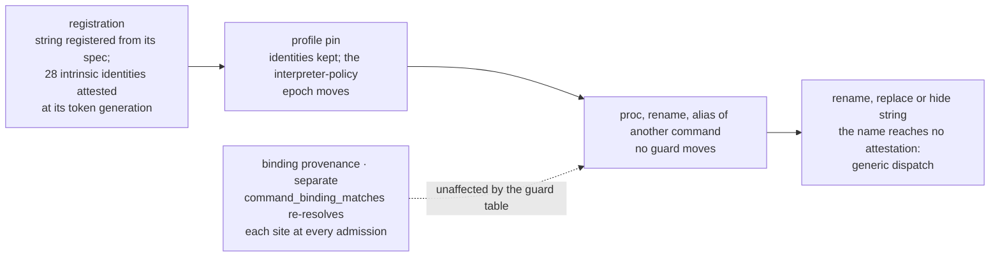
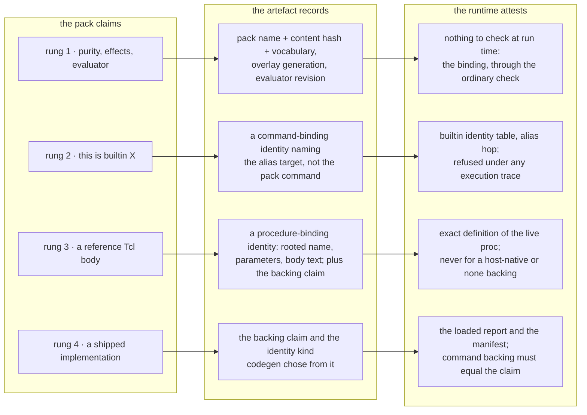
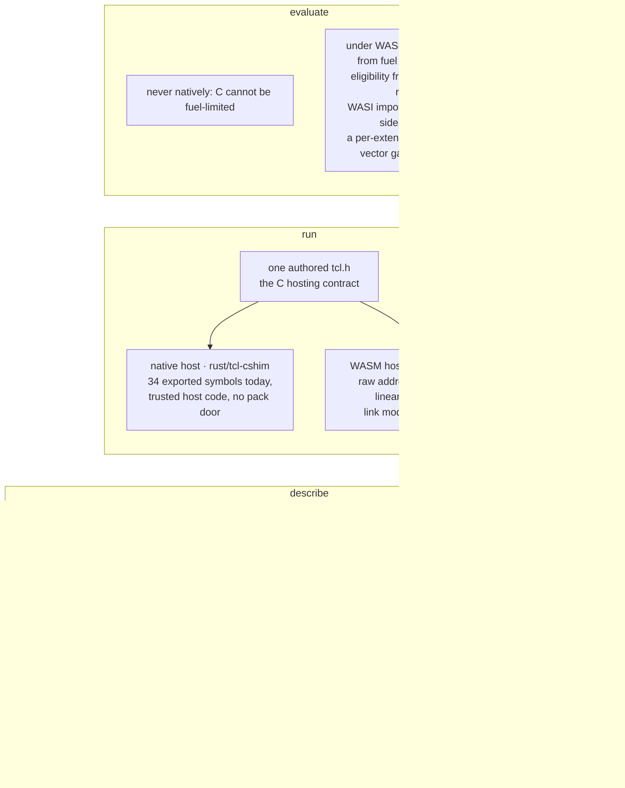

# Registry consumer contracts — description, identity, and backing

How far the command registry, and the `.tclspec` packs that extend it, can
drive the analyser, both code generators, and both runtimes; what that
requires of dialects and packages; and where C Tcl extensions fit. This is
the companion to [value-transfers.md](value-transfers.md), which states
the consumer interface for one axis (values), and to
[value-evaluation.md](value-evaluation.md), which states how an answer on
that axis is computed. This page places the value axis among the others
and holds the rest of the programme: the three descriptors the analyser
reads — a clause grammar, a member effect, and
an option effect that retired the two native resolvers over a command's
own option table — and the identity and backing contracts a code
generator or a runtime needs before a pack claim can change *emitted
code*. Analysis facts wait for
none of it — under the rulings recorded in the interface contract, a
loaded pack's facts are authoritative for analysis and optimisation as
soon as they are loaded, and the direct, expression, and declared-implementation
routes proceed without deciding anything here.

> **What is built.** The five rulings — the four in § *Rulings* and the
> narrower one in § *The two hook bodies that remain* — are the owner's
> decisions, and the build takes them as settled. Every identifier, count,
> and file path on this page was checked against the tree. The
> description contract's vocabulary is built, under these names:
>
> - **Clause grammar** — `ClauseGrammarSpec`, `ClauseRow`,
>   `ClauseRowShape`, `ClauseSlot`, `HandlerMatch`, `ClauseTiming`,
>   `LoopPhase`, `ClauseSelection`, `DefaultClause`, and the answer
>   shapes `ClausePlan`, `ResolvedClause`, `ClauseRowId`. A clause slot's
>   role is the registry's own `ArgRole`, not a new one.
> - **Member effect** — `MemberEffect`, `MemberReceiver`, `CallableRole`,
>   `StateScope`, `RelationSlot`, `InitTiming`, and the answer shapes
>   `MemberRow` and `MemberArity`.
> - **Option effects** — `OptionEffect`, `OptionEffectKind`, `EffectAxis`,
>   `SubstitutionKind`, `OptionEffectFamily`, `FamilyBase`,
>   `FamilyCombine`, and the answer shape `OptionEffects`.
> - **The derived-query layer** — the queries `clause_plan`,
>   `option_effects`, `case_invocation`, `frame_effect`, `arg_roles`,
>   `pattern_args`, `return_type`, and `effects` on `ResolvedInvocation`,
>   with `member_rows` as `DefinitionBodyGrammar::member_row`; the page's
>   `RegistryQueries`, `CallWords` and `ResolvedEffects` are
>   `ResolvedInvocation`, `InvocationWords` and `EffectFootprint`, and
>   `template_plan` is the value axis's.
>
> The trust ruling and the stub ruling are built. `WorkspaceTrust`
> (`tcl_dialect::model`) is the trust ruling's one input, carried on
> `DiscoveryOptions::workspace_trust`, and it gates hook-body execution:
> `tcl_spectcl::hooks::hook_bodies_run` decides it, `hooks::plan_for` gives
> an untrusted workspace pack's bodies no slot, and the load reports each
> as a `hooks::DormantHook` on the pack file. A `# tcl-lsp: stub`
> declaration's six flags reach `DeclaredCommand::traits` and
> `DeclaredCommand::side_effects`, and `DocumentCommandSurface` answers
> nearest-wins — `traits`, `invocation_traits` and `side_effects` beside
> the role queries, under the security floor.
>
> The first half of the identity contract is built.
> `CommandSpec::alias_of`, the `alias_of NAME` declaration naming the
> shipped builtin a pack command is, is the target the loader's stamp
> rejection rule reads (`tcl_spectcl::stamps`) — a codegen-axis stamp
> survives only on a bundled pack's command whose `alias_of` names the
> shipped builtin carrying it, and every other is dropped with a warning
> on its row — and the identity codegen records at such a site: the
> target's (`ResolvedCall::stamp_identity`), which the VM admits through
> its alias hop. A site whose emitted code rests on a pack's facts
> records them — `SiteClaim::PackFacts` for a constant a pack's
> `const_fold` computed, `SiteClaim::BuiltinAlias` for a binding reached
> through `alias_of`, each carrying the pack's `PackFactStamp`
> (`tcl_runtime_api`) in `FunctionAsm::site_claims` — and the VM admits
> the unit only while it holds that stamp (`Vm::set_pack_facts`). On the
> runtime side, `IntrinsicId::guard_semantics_key` is one key per member —
> the member's own `stable_id`, its row of `SEMANTICS_REVISION`, and a
> release variant — so a member whose guarded contract moves invalidates
> its own guards and no other's, and both runtimes keep a guard's
> identities under the command's token generation and read them through
> the guarded name's current binding: a guard survives the definition,
> rename or alias of another command and the profile pin, follows its
> command through `rename` and `interp hide`, and is dropped when its
> command is replaced, shadowed from the calling namespace, deleted or
> hidden.
>
> The take-shipped floor is built: `SecurityFloor::apply` keeps a shipped
> command's `lowering_hook`, `analyser_hook`, `semantic_operation`,
> `state_transitions`, `native_lowering`, `bpf_op` and `runtime_backing`
> through any override, from any tier, beside the two codegen hooks it
> already kept (rule 4 of § *The loader's stamp rejection rule*).
>
> The capability gate is built. `tcl_dialect::model::DependencyTier` says how
> far the package that ships a pack sits from the workspace root — the
> workspace's own package, a direct dependency, a transitive one, or a
> development one — and discovery reads it from the `tclpkg.lock` beside the
> project's manifest, never from what a package's own manifest claims
> (`PackFile::dependency_tier`, through `tcl-pkg-model`, the crate the
> manifest and lockfile live in). `tcl_registry::model::CodegenCapability`
> is the matrix over it, and `tcl_spectcl::stamps` applies it beside the
> provenance gate: a codegen-axis stamp must pass both, and `alias_of` and a
> `runtime_backing` other than `none` are dropped, with a warning naming the
> tier, from a transitive or development dependency's pack.
>
> The workspace overlay reaches the compile service, and a miss fails closed.
> An overlay is the key a pack set's registry generation was installed under;
> `DocumentEnvironment::context_registry` answers a key nothing installed
> with an `OverlayMiss`, never the plain generation under another name.
> `BytecodeCompileService::for_profile_with_overlay` looks the generation up
> for every compile and declines with a `CompileError` once it is gone;
> `tcl_lsp_db::compilation_unit` builds no unit, so the compiler checks and
> the optimiser's rewrites that read one are absent until the packs install;
> the analyser and the semantic tokens, which only advise and run again when
> the packs arrive, read the plain registry meanwhile. No shipped host builds
> a service through the overlay door: the `tclvm` engine takes an owned
> registry, and the language server's optimise path reads the registry the
> workspace's packs were installed into.
>
> The backing fact is built. `CommandSpec::runtime_backing`
> (`tcl_registry::RuntimeBacking`, with `BodySource`) is declared on every
> core Tcl command as the row of `docs/generated/wasm-command-backing.md` that
> names it, `tcl_spectcl::BackingSyntax` reads and spells the `runtime_backing`
> statement, and the iRule-test stub generator emits a mock only for a command
> whose backing is `None` or `HostNative`.
>
> The intrinsic table is split by family. `IntrinsicId::family`
> (`tcl_registry::IntrinsicFamily`) classifies each of the 28 members as a
> `Value` function over the shared cores or a `FamilyB` operation over a
> runtime's variable-store or channel adapter, which takes the
> variable-trace guard domain and, for `info exists` and the array queries,
> runs the variable's traces while observing it. A guard request for a
> member covers its family's domains, or a runtime refuses it.
>
> The runtimes answer what they back. `tcl_runtime_api::RegisteredBacking` and
> `BackingReport` are the vocabulary: `runtime/rust`'s `Interp::backing_report`
> and `tcl-vm`'s `Vm::backing_report` say whether a name is a handler, a `TclOO`
> object, defined by the Tcl library the runtime embeds, registered only to
> refuse, or absent, and `cargo xtask command-backing` holds every core
> command's declared `runtime_backing` to the WASM runtime's answer, with one
> waiver list for the commands it does not yet back. Each runtime attaches its
> intrinsic guard identities by a sweep after registration, from the
> generation it is pinned to and never from an overlay.
>
> Artefacts state the world they were compiled for, and runtimes are pinned to
> one. `ArtefactIdentityManifest` (`tcl_runtime_api::manifest`) — the ABI
> version, the environment, release and build, the package floors, the pack
> facts any site claims, the intrinsic-table hash, and the embedded library
> revision — rides on `ModuleAsm::manifest` and on the `CompiledUnit` made
> from it, and is the `tcl.manifest` custom section of a WASM module. A
> runtime states the same fields of itself from a `RuntimeContext` resolved
> through the ingress the compiler uses (`Vm::pin_context`,
> `Interp::pin_context`), where an overlay nothing has installed is an error.
> The VM refuses, per rung, the sites resting on a field that disagrees, and
> the WASM link harness refuses a module whose ABI version or intrinsic table
> disagrees with what the linked runtime's `tcl_runtime_identity` states.
>
> A package declares the packs it ships. `ManifestAst::spec`
> (`tcl_pkg_model::manifest::SpecDirective`) is a data-only manifest
> directive naming the `.tclspec` files the package ships and the tier it
> asks for them at; discovery loads those beside the manifest and no others,
> holds the requested tier no nearer the root than the package's position in
> the lockfile's graph (`tier::clamp_requested`), and `LockedPackage` records
> a hash of each pack that is the content hash a compiled unit's claim on it
> carries. `tcl docker create` lists the Tcl package behind each command the
> project's packs declare `HostNative`.
>
> A command a pack backs with a Tcl body has its definition inlined into the
> code that calls it. `inline_reference_bodies`
> (`rust/tcl-compiler/src/inlining/`) brings the definition the backing names
> into a module, the procedures that call the command are rewritten, and
> codegen records a `SiteClaim::ReferenceBody` beside the procedure binding
> that holds the live command to the definition (`BackingKind`,
> `rust/tcl-runtime-api/src/site_claim.rs`). The capability matrix's
> `reference_body` row decides at load whether a pack may declare one, a
> `PackageSource` body is read at load, through the store that read the pack
> (`tcl_spectcl::package_sources`), and the VM's `source` command reads through
> the host's filesystem and honours `-encoding` for the four names `encoding
> system` accepts (`utf-8`, `iso8859-1`, `ascii` and `unicode`), refusing any
> other as Tcl's `unknown encoding`.
>
> A pack's declared facts are held to the package they describe. `tcl spec
> test` (`rust/tcl-cli/src/commands/spec.rs`, the probe in
> `commands/spec_test.rs`) requires the package in a real shell, under the
> package manager's opt-in policy because that runs its code, and asks each
> command the pack declares whether the package defines it, what its arity
> refuses, what its examples answer and whether the answers have the declared
> type, whether a Tcl-body reference body agrees with it, and whether a command
> declared `pure` writes a variable of any namespace but the shell's own `::tcl`.
> The policy is the operator's: the outermost project at or above the working
> directory, never the tree the pack was found in, so a dependency vendored into
> the project cannot opt itself in, from the project or from inside the
> dependency. It prints one row per divergence and the
> number of commands the shell actually asked, and exits 1 on any divergence and
> on a shell that stopped before it had asked them all, whatever status it
> stopped with; the probe ends with a line that counts the commands asked, which a
> package that calls `exit` cannot print. It exits 2 when the verb could not run:
> no shell, or one that outlives the policy's timeout. It is a CLI verb, and
> nothing the editor runs executes a package.
>
> A reference body is also the command's declared implementation when its author
> asks with `-evaluate` beside the backing and the sandbox can express it.
> `reference_body::derive`
> (`rust/tcl-registry/src/value_transfer/reference_body.rs`) reads the `proc`
> against the hook host's command whitelist and admits only a body that is a
> function of its parameters; the loader
> (`rust/tcl-spectcl/src/loader/reference.rs`) gives the command the declaration
> and the hook body that run it, and the analyser's answer to a call whose
> arguments it knows is the body's, run in an engine pinned to the target
> release. The assertion is the author's because that engine emulates an older
> release imperfectly and only the author can vouch that the body does not meet
> the difference; the scan is the precondition and never the licence.
> `infer_from_body` (`rust/tcl-spec-studio/src/infer.rs`) reads a body's purity,
> effects, return type and callbacks for an import's drafts.
>
> The codegen axis is versioned, and the release a versioned fold evaluates
> under comes through an evidence gate. A codegen-axis stamp —
> `codegen_hook`, `inline_codegen_hook`, `semantic_operation` and, on the
> compiled catalogue, `native_lowering` — can carry ordered windows beside its
> plain field (`StampWindow`, `rust/tcl-registry/src/stamp_window.rs`).
> `StampSelection` selects one at the release a call is resolved at and
> declines, to plain dispatch, where the point does not settle a release, and a
> pack writes a window as `-introduced`, `-deprecated` and `-retired` on the
> stamp's statement. A profile's evaluation point
> (`DialectProfile::evaluation_point`) is its runtime base only where something
> measured it — a Tcl release's pinned toolchain, or the note a measured fork
> carries — so a versioned fold answers as Tcl 8.4 under iRules, iApps and tmsh
> and keeps to the answer every release gives under a profile nothing measured.
> `SurfaceQuery::packages` carries the floor each package's context guarantees
> (`PackageFloor`), and a package row windowed on the package's own axis is
> admitted only where that floor lies in a window.
>
> A command a native extension registers has one conservative default, stated
> once: `CommandSpec::extension_default` is the top of every axis the registry
> has a fact for (a dynamic barrier, unknown reads and writes, a taint sink and
> source, hidden in a safe interpreter, never pure, any completion code,
> host-native, no stamp), and a stub's `-extension` flag declares it for a
> command a document names, the other flags narrowing it one axis each
> (`DeclaredCommand::extension` and `DeclaredCommand::narrowed_by`). An
> extension is described from a scan of its C source, from a sandboxed
> `package require` and from the shim's loaded report — `tcl spec import
> --c-source` and `--probe`, and `Loaded::declared_surface` — each command a
> row at that default carrying its provenance, `c-scan` or `probe`, and none of
> the sources narrowing it. A host that lets its scripts `load` an extension
> registers `StaticExtensions`, a `load` over the entry points it has linked in
> (`Interp::enable_static_extensions`); `tclvm --static-extensions` does so
> for the shim's test extension.
>
> One authored header serves both hosts. `runtime/rust/include/tcl.h` has a
> native leg, which the shim (`rust/tcl-cshim`) exports, and a WASM leg, which
> the runtime's `capi.rs` exports, and `make check-c-extension-wasm` holds each
> leg to its host. The engine interface carries the completion a host command
> answers (`HostOutcome`, `CompletionCode`, and a `Return`'s options) and opens
> doors onto the frame that called it (`CommandRegistrar::variable`,
> `set_variable`, `unset_variable`, `eval_in_invocation`), through which the
> shim's `Tcl_GetVar2Ex`, `Tcl_ObjSetVar2`, `Tcl_UnsetVar2` and `Tcl_EvalObjEx`
> act. The runtime is an engine of that interface
> (`tcl_runtime::engine::RuntimeEngine`, its `engine` feature) and, compiled to
> `wasm32`, under wasmtime (`tcl_engine_wasm::WasmEngine`), where a C extension
> built for it as a side module is evaluated under fuel, the epoch and a cap on
> the memory's growth, every WASI import stubbed. The registry's extension seam
> (`tcl_registry::extension_host`: `ExtensionHost`, `LoadedExtension`,
> `artefact_hash`) is what an extension's evaluation calls, and it declines as
> `Transient` on a thread with no host. The declared-implementation route
> binds to it: a pack declares `evaluate -implementation ID -host
> wasm_extension { extension FILE PREFIX … }` (`HostKind::WasmExtension`), the
> load reads the artefact beside the pack, and the implementation's identity
> carries the artefact's content hash, so the memo key does
> ([value-evaluation.md](value-evaluation.md) § *The extension host*).
>
> The rest of the vocabulary is not built, and names nothing in the
> workspace: the `ShippedImplementation` claim and `IdentityKind`.
>
> `AnalysisContext`, `AnalysisInputs`, `PlanAnswer`, `OperandId`,
> `TemplateWordPlan`, and `EvalAnswer` are the types
> [value-transfers.md](value-transfers.md) defines, held in
> `tcl_registry::value_transfer` and used here as that page spells them; its
> `HandlerPlan` carries this page's `HandlerMatch` per `try` handler. Nothing
> on this page is a prerequisite of the consumer interface, the direct or
> expression routes, or a workspace pack's declared implementation
> ([value-evaluation.md](value-evaluation.md)).

Read it before extending `CommandSpec` with a fact a code generator or a
runtime would act on, before letting a pack name a compiler catalogue
member, or before designing how a package ships its runtime implementation.

## Three contracts, not one mechanism

The registry already describes nearly every fact the analyser needs, and
the analyser reads a fraction of it. Codegen already keys on registry
identities, but only a shipped builtin can be attested at run time. So the
work is three contracts:

- **Description.** Every axis has a declarative descriptor, a closed native
  catalogue for the algorithmic remainder, and one derived query that every
  consumer asks. Authored fields stay private to the query. A descriptor
  establishes locations and grammar; executable semantics are an explicit
  declaration or a derivation from a descriptor that states the same
  operation, never an inference from weaker metadata. Three descriptors
  complete the set: `ClauseGrammarSpec`, `MemberEffect`, and
  `OptionEffect`.
- **Identity.** Three mechanisms, kept distinct in text and diagrams:
  *command binding provenance* (does the spelling still bind to the
  described command?), *intrinsic guard eligibility* (may compiled code
  take a specialised fast path for it?), and *pack or implementation
  attestation* (is the implementation the pack described the one that is
  loaded?). A pack may claim. Only the runtime may attest. The artefact
  records the claim with the pack's identity. Admission of *emitted code*
  requires the attestation; a missing attestation is plain dispatch when
  the unit carries source and the VM has a compile service, and a refusal
  otherwise.
- **Backing.** A described command's executable behaviour arrives through
  one of four doors — a shipped builtin, Tcl source, a host-registered
  native command (a recompiled C extension is one), or nothing — and
  `RuntimeBacking`, one fact per command, says which, so codegen chooses
  the identity kind it emits from a declaration rather than a name.


```mermaid
flowchart TB
    subgraph description["description contract"]
        D1["every axis has a declarative descriptor<br/>plus a closed native catalogue for the rest"] --> D2["one derived query per axis<br/>authored fields private; a per-axis lint and ledger"]
        D2 --> D3["consumers ask the query, never a name<br/>analyser · lowering · codegen · editor providers · tools"]
    end
    subgraph identity["identity contract"]
        I1["a pack may claim<br/>a builtin identity, a body, a backing"] --> I2["the artefact records the claim<br/>binding identity + pack hash + overlay generation"]
        I2 --> I3["only the runtime may attest<br/>binding provenance · intrinsic guard · loaded report<br/>missing attestation → plain dispatch, or a refusal"]
    end
    subgraph backing["backing contract"]
        M1["four doors for executable behaviour<br/>shipped builtin · Tcl source · host-native · none"] --> M2["RuntimeBacking, one fact per command<br/>codegen chooses procedure binding, command binding, guard, or generic"]
    end
```

The fence around all three is the standing set of rulings, and every
proposal here fits inside it: SpecTcl declares and Rust executes; packs
name closed catalogues and never add to them; `completion` and
`dispatch_dependencies` are never authorable; a static resolution is a
candidate, never proof; no pack word loads native code; extensions are
recompiled, never binary-loaded; semantic AOT transforms are default-off,
and analysis reuse is not authorisation
([semantic-aot-optimisation.md](semantic-aot-optimisation.md),
[../registry/spec-packs.md](../registry/spec-packs.md) § *What a pack still
cannot say*, [../runtime/c-extension-shim.md](../runtime/c-extension-shim.md)
§ *Trust model*); and loaded workspace facts are authoritative for
analysis, with no widen-only tier and no provenance cap (the rulings in
[value-transfers.md](value-transfers.md) § *Rulings*).

## Rulings

Four questions belong to the owner rather than to the design, and the owner
has decided all four. Each is stated below as a **ruling**: the decision,
the rationale, and the consequences — which documents and which code
predicates change. The build takes them as settled, and the documents
that stated the rule a ruling replaces are repaired. A fifth, narrower one sits with the hook body it
concerns, in § *The two hook bodies that remain*.

### Ruling — the shipped catalogues are generated from Rust

**Ruling.** The shipped code-generation catalogues — the intrinsic
table, the per-command runtime-backing classification, and the ABI
descriptor table in `rust/tcl-runtime-api/src/codegen_abi.rs` — are
generated from the Rust registry by an `xtask` build task. There is no
ahead-of-time `.tclspec` → `.rs` path, and a pack never contributes a
member to a closed code-generation catalogue. The one second backend is
Jim's surface, authored as SpecTcl and compiled in
(`rust/tcl-spectcl/core-surfaces/jim.tclspec`).

**Rationale.** The registry is already the source of truth the drift gate
reads: `rust/xtask/src/command_backing.rs` holds each core spec's declared
`runtime_backing` to what `runtime/rust` and `tcl-vm` report registering and
writes `docs/generated/wasm-command-backing.md`, accounting for the residue in
one committed list (`KNOWN_UNBACKED`). Generating the catalogue from the
registry is that same move, from a scan of source text to a query, and it is
the direction `tcl-runtime-api`'s shared `CodegenAbiImportId` descriptor table
already takes. A SpecTcl source cannot be the generator's input without making
a workspace pack able to add a catalogue member, which the standing rules
forbid.

**Consequences.** No standing document text has to move:
[../registry/spec-packs.md](../registry/spec-packs.md) § *One authoring
format* states "the shipped cores … stay native Rust; there is no
ahead-of-time `.tclspec` → `.rs` path", and
[../registry/dialect-and-package-registry-redesign.md](../registry/dialect-and-package-registry-redesign.md)
§ *11. The open-questions ledger* records the same decision in its
"deliberately **not** in this ledger" paragraph. What lands is the
generator plus one sentence in [command-registry.md](command-registry.md)
§ *Authoring a spec without Rust* separating the Spec Studio's `.rs`
contribution export (`rust/tcl-spec-studio/src/render_rs.rs`, a drafting
aid whose output a human reviews into the tree) from a build-time
backend. Code predicates: `command_backing`'s classification lists are rows
of the `runtime_backing` fact, and its registration scan is a query that
`tcl-vm` answers too.

**Decided with the build.** [command-registry.md](command-registry.md)
§ *Authoring a spec without Rust* states the separation, and the generator
is built.

### Ruling — trust gates execution, not authority

**Ruling.** Two things are separated. *Authority* is settled by the
interface contract's ruling 3: a loaded workspace pack's declarative facts
are believed, with no widen-only tier and no provenance cap, whatever the
editor's trust state. *Execution* is gated: in a workspace the editor has
not marked trusted, no pack hook body runs — `const_fold`,
`arg_role_resolver`, `constraints`, and every other family in
`rust/tcl-registry/src/pack_hooks.rs`'s slot tables abstains exactly as a
declared-but-unbound hook does, and each dormant hook is reported on the
pack file. Pack *evaluation* stays ungated, because its only input is the
pack itself, it runs once per `EvalSnapshotKey` under the budget, and the
frozen snapshot is what carries the declarative facts the authority ruling
protects. The editor's trust state is one input, `WorkspaceTrust`,
plumbed from the LSP client to `rust/tcl-spectcl/src/discovery.rs`; a
client that does not report it is treated as trusted, which is the
behaviour of the workspace tier today.

**Rationale.** The asymmetry between the two executions is the whole
argument. Evaluation is once, with pack-controlled input, under a command
count and wall-clock budget with `catch_unwind` and
quarantine-on-first-crash. A hook body runs per query, per keystroke, on
words taken from the document being analysed, so a hostile pack plus a
hostile document is a repeated execution surface with attacker-chosen
inputs — a different shape from the one
[../registry/spec-packs.md](../registry/spec-packs.md) § *Workspace trust:
the setting is gated, the workspace tier is not* argues is contained by
the sandbox, and the shape that page says forces the tier to become
trust-gated "if a hook family ever gains ambient authority". Gating the
bodies and not the evaluation keeps the pack's facts — which the authority
ruling makes authoritative — while removing the only surface whose inputs
the workspace does not control.

**Consequences.** `PackEnvironmentTier::provenance` in
`rust/tcl-spectcl/src/loader/environment_block.rs` gains the trust input
and maps a workspace pack to `Provenance::WorkspaceTrusted` or
`Provenance::WorkspaceUntrusted`, which makes the latter reachable from
discovery for the first time (the redesign's § *11.1 Owner decisions
pending* carried it as item O9 until `WorkspaceTrust` closed it). The two identical
`untrusted(…)` predicates —
`rust/tcl-spectcl/src/loader/eval.rs` over a `Tier` and
`rust/tcl-registry/src/model/registration.rs` over a `Provenance` —
collapse into one, exported from `tcl-registry` and called by the loader,
so the answer is the same at every entry point; the `EvalOptions::tier`
doc comment that still calls `Tier::Workspace` an untrusted class is
corrected to name the trust state instead of the discovery location.
The dormant-hook abstention sits where slots are assigned:
`tcl_spectcl::hooks::plan_for` gives an untrusted workspace pack's bodies
no slot, so each field keeps the loader's abstaining placeholder and
`rust/tcl-spec-hooks/src/host.rs` — the hook host that owns the per-pack
engines and the containment — never learns the trust state or sees the
text; `spectcl_check`'s tier parameter (redesign item O4) reports it.
Documents:
[../registry/spec-packs.md](../registry/spec-packs.md) § *Workspace trust:
the setting is gated, the workspace tier is not* records the split, and
[../registry/dialect-and-package-registry-redesign.md](../registry/dialect-and-package-registry-redesign.md)
§ *6.4 Trust and provenance* keeps the security floor as it is — the floor
was never tier-keyed and does not become so.

**Decided with the build.** [../registry/spec-packs.md](../registry/spec-packs.md)
§ *Workspace trust: the setting is gated, the workspace tier is not* records
the split; the server plumbs `WorkspaceTrust` and gates the hook bodies on it.

### Ruling — a stub sidecar is a workspace-authored fact

**Ruling.** A stub declaration is the same class of fact as a
pack's, so the authority ruling applies to it unchanged: once ingested, a
stub's declarations are inputs to analysis on the same footing as a
shipped spec. [../contracts/dialect-stubs.md](../contracts/dialect-stubs.md)
§ *Stubs are declarations* drops "a declaration widens, never narrows" and
states nearest-wins instead — the document's own declaration answers where
it speaks, the catalogue answers elsewhere — with `security_floor`'s
monotone merge (invariant I6) still in force, because that floor is a
security contract rather than a precision cap. The six `StubFlags` gain
their consumers in the same change.

**Rationale.** The widen-only rule is the untrusted-tier rule read
literally, and the authority ruling withdraws exactly that reading.
Keeping it for stubs would make the narrower declaration — one the author
wrote about their own file, in their own file — weaker than the pack
declaration they could write beside it, which is a distinction no author
can predict. The flags were the visible cost: `parse_stub_flags` in
`rust/tcl-compiler/src/analyser/utils.rs` parsed all six and
`StubCommandDef::to_declared_command` deliberately did not carry them,
its doc comment saying the set "has never had a consumer", so a user who
wrote `-pure` got nothing.

**Consequences.** `DeclaredCommand` grows the declared behavioural facts
beside its `arguments`, and each flag lands on the field its catalogue
counterpart uses: `-pure` on `Traits::PURE` (`SubCommand::pure` at
subcommand level), `-mutator` as a declared `SideEffect` write,
`-barrier` on `Traits::CREATES_DYNAMIC_BARRIER`, `-loop` on
`Traits::HAS_LOOP_BODY`, `-scope_alias` on `Traits::CREATES_SCOPE_ALIAS`,
and `-unsafe` on `Traits::UNSAFE` together with
`Traits::SAFE_INTERP_HIDDEN`. `DocumentCommandSurface`'s role lookup stops
unioning and resolves nearest-wins, and the consumers of those fields ask
it: `unit_scope.rs`'s alias walk, the loop-termination checks, lowering's
read-before-write, side-effect classification in the interprocedural
summary, the safe-interpreter gate, and the minifier's rename barriers see
a stubbed command the way they see a catalogued one. `-mutator` lands as
the read-modify-write shape `lset` states — `Traits::READS_BEFORE_WRITE`
beside a `SideEffect` that reads and writes the variable — because a write
alone would kill the store the command reads. Three readers are
deferred residue, not design: `ssa.rs`'s barrier-def walk
(`registry_barrier_defs`) and scope-alias discriminator, and
`memory_ssa.rs`'s clobber verdict (`is_clobber` over `CLOBBER_TRAITS`),
still ask the catalogue alone, because reaching them means threading the
document's surface through `compilation_unit.rs`. Until then a stub's
declared roles miss the barrier-def walk —
a call the lowering keeps as a barrier because its stub declares a `body`
word writes no def for its `var` word, and a later read of that variable
draws a false `W210` — and a redeclared catalogued name is walked with the
catalogue's roles. Once the file is free, the walk takes a declared name's
roles from the surface, and memory SSA clobbers for a declared name unless
its declaration states `PURE`, the same conservative reading side-effect
classification gives a declaration that states nothing. Code predicates: the union in `DocumentCommandSurface`, the flag drop in
`to_declared_command`, and the `Provenance::WorkspaceUntrusted` class a
sidecar ingests at — which becomes a provenance label for explanation, not
a precision class.

**Decided with the build.** [../contracts/dialect-stubs.md](../contracts/dialect-stubs.md)
§ *Stubs are declarations* states nearest-wins, and the analyser consumes
the six flags on their catalogue fields.

### Ruling — one C header, two hosts

**Ruling.** The authored, API-compatible `tcl.h` of
[../runtime/c-extension-abi.md](../runtime/c-extension-abi.md)
(`runtime/rust/include/tcl.h`) is *the* C hosting contract, and
`rust/tcl-cshim` stays as its native host: the shim keeps its role —
`Interp<E: Engine>`, the engine interface's second consumer, trusted host
code loaded only through `Interp::load_static` or a host's `load` — and
compiles against the authored header, so one extension source compiles for
both legs. The shim has no header of its own: `Tcl_Obj` has the ABI's
declared layout (§ 4.2) and is never opaque, and the shim's 36 exported
symbols are the subset of the authored header its native leg declares, with
every unimplemented declaration absent. The standing rules are unchanged by
this: extensions are recompiled, never binary-loaded; no pack word loads
native code; a shimmed command is not a `-native` hook.

**Rationale, from the two documents and the exports.** Coverage decides
it. The shim's header is honest by rule and therefore small — an extension
needing string building, the dict API, or a variable or evaluation call beyond
`Tcl_GetVar2Ex`, `Tcl_ObjSetVar2`, `Tcl_UnsetVar2` and `Tcl_EvalObjEx` does
not compile against it — while the ABI is held to a measured corpus of
nine `dltest` extensions from the Tcl 9.0.4 source tree plus two synthetic
probes, and its one relocation surprise is bounded: four GOT entries for
the stubs-introspecting `pkgooa` member, and zero for every other one. The
exports agree: `runtime/rust/src/capi.rs` has 20 `#[no_mangle] extern "C"`
functions in the ABI's § 4.3 direct-import style, sized on Tcl 9's
`ptrdiff_t` through `TclSize`, with its own module note recording that the
obj-lifecycle and result/eval-core subset is exported and the remainder of
the 81-function surface is absent — the WASM runtime has begun the ABI,
not the shim. And containment comes out the same either way: the shim's
`catch_unwind` guards Rust panics, not C undefined behaviour, and a
`panic = "abort"` build has no unwinding at all, so under WASM the
containment is the instance's linear memory and fuel in both designs.
What the shim uniquely supplies is engine
neutrality, which rung 4's evaluation needs and which the ABI's own
closing note endorses: "the durable artefact is this ABI plus the headers,
which is reusable whichever language the runtime is written in."

**Consequences.** [../runtime/c-extension-shim.md](../runtime/c-extension-shim.md)
§ *The implemented subset* is a subset table against the authored
header, and its § *Out of scope* list is the header's own scope list;
[../runtime/c-extension-abi.md](../runtime/c-extension-abi.md) § 7 has
the native leg beside the WASM one. The shim's `Tcl_Size` switch is the
authored header's (`TCL_MAJOR_VERSION=8`). Code predicates:
`rust/tcl-cshim/src/obj.rs` publishes the `Tcl_Obj` layout instead of
keeping it opaque; `rust/tcl-cshim/src/doors.rs` implements `Tcl_GetVar2Ex`,
`Tcl_ObjSetVar2`, `Tcl_UnsetVar2` and `Tcl_EvalObjEx` over the engine interface's
variable door and in-invocation eval door;
`rust/tcl-cshim/tests/pkga_e2e.rs`'s byte-for-byte expectations, captured
against Tcl 9.0.4's own `tcl.h`, are the shared conformance vectors for
both legs.

**The WASM leg's registration seam** is built: `Tcl_CreateObjCommand` and
`Tcl_DeleteCommand` are exported from `runtime/rust/src/capi.rs`, and a
`Command::ObjCmd` in `runtime/rust/src/interp.rs` holds the extension's
procedure (a shared-table function index under `wasm32`), so `tcl_invoke_argv`,
which routes a prebuilt argv through `Interp::dispatch`, reaches an extension's
command like any other the table holds — § 12 of the ABI, run by
`a_compiled_script_calls_an_extension_registered_command` against the real
runtime. `TclFreeObj` is exported beside them, which is where the header's
`Tcl_DecrRefCount` macro frees, and `obj.rs` asserts the `Tcl_Obj` layout the
header declares when it compiles. `make check-c-extension-wasm`
(`scripts/check_c_extension_wasm.py`, in `xtask-check`, and required in the CI
job that has wasi-sdk) holds the header to both legs: every function the WASM
leg declares is a runtime export and every C-API export is declared or a header
macro, the same for the shim and the native leg, and `layout.c` and the test
extension compile for `wasm32-wasip1`, the test extension against the WASM leg
alone, which declares every function it calls, and against both legs at once.
The runtime's own test loads the test extension, compiled for the host against
the WASM leg, through those exports, and holds it to the shared vectors, and
`rust/tcl-engine-wasm` loads it compiled for `wasm32`, as a side module, into the
runtime under wasmtime and holds it to the same vectors. What the
leg does not have: the ownership categories of
[../runtime/c-api-ownership-contract.md](../runtime/c-api-ownership-contract.md)
encoded per export (the gate asks for each export's row), the `GOT.mem` /
`GOT.func` list wired for the address-of-runtime-symbol pattern, and the calls
into the caller's frame the native leg has. The engine
interface carries the completion code a host command answers (`HostOutcome`),
so a hosted extension exercises the conservative default this page states for
it.

**Decided with the build.** The one contract is stated in [../runtime/c-extension-shim.md](../runtime/c-extension-shim.md)
§ *The implemented subset* and
[../runtime/c-extension-abi.md](../runtime/c-extension-abi.md) § 7, and the
shim compiles against the authored header.

## The analyser: the description contract

The registry surface is far richer than the analyser's dispatch uses.

| Fact | Registry | Analyser |
|---|---|---|
| analyser hook variants | 32 (`AnalyserHookId`, `rust/tcl-registry/src/hooks.rs`), down from 43: the eleven whose handler knew only a position or a keyword a descriptor states are retired (`Try`, `For`, `DictFor`, `DictUpdate`, `Incr`, `Append`, `Lappend`, `Upvar`, `NamespaceUpvar`, `Global`, `Variable`) | the residue is analyser policy over typed facts — procedure definition, the dynamic-target and namespace domains, the interpreter-domain stack, rename epochs, member routing, literal-iteration simulation, the case-list walk and the completion protocol, package-index bookkeeping, `source` and `load` — plus three on the migration ledger (`Set`, `DictWith`, `RegexPatternCapture`), command-specific and left for the value axis to retire; a retired command falls to the dispatch tail's generic reads |
| scope and interpreter transitions | resolvers on `upvar`, `global`, `variable`, `namespace`, `interp` (`rust/tcl-registry/src/state_transition.rs`), and a pack's `state_transitions` resolver | the dispatch tail applies every `VariableCellAliasTransition` an invocation states (`apply_state_transitions`, over the call's source words: `global`, `variable`, `upvar`, `namespace upvar`, a pack command's alias facts) and `interp create` — direct, or the nested `[interp create …]` a `set` binds — reads its `InterpreterTransition::Create`; the namespace family still has no consumer there; `frame_effect` is read only for alias-pair layout and level parsing (`param_traits.rs`, `diagnostics/usage.rs`); the command-binding family only by `interp alias` and the static-proc proof |
| loop and bind positions | roles and strided `repeated_args` | one binder (`handle_var_binding_command`) binds every `LoopVarList` and `VarWrite` position the roles name — `foreach` (which keeps its literal-iteration simulation), `lmap`, `dict for` / `map` / `update`, `array for`, `incr`, `append`, `lappend`, `lassign`, … — and `package require` / `provide` / `ifneeded` read the roles their subcommands declare |
| OO member effect | the member-effect descriptor (`MemberSpec::effect`, `MemberEffect`, in `rust/tcl-registry/src/definer.rs`), beside the layout (`MemberKind`: `Flat`, `Wrapper`, `FlagKeyed`) and `arg_roles`, `slot`, `retraction`, `visibility_effect`, `surface`; every TclOO, snit, itcl, `SpecTcl` and `SslicTcl` member states one, and `DefinitionBodyGrammar::member_row` answers a statement's row | one `match` on the row's effect (`member_landing`) routes the `TclOO` fold and the snit and itcl walkers, `MethodKind::from_effect` names the lowering's frames, and the providers read the recorded member; `property`'s flag words and snit's type-body implicit variable are the axis's residue in `analyser/oo.rs` |
| clause grammar | the clause-grammar descriptor (`ClauseGrammarSpec`, `rust/tcl-registry/src/clause_grammar.rs`), on `CommandSpec` and `SubCommand`: ten shipped grammars, one registry walk answering the roles and the clause-shape defect, and the loader reading the same type | the lowering (`lower_if`, `lower_try`), the generic body walk (each body's depths by its clause's timing, and a clause's variable list — `try`'s handlers, whose `handle_try_command` is retired), the stray-keyword report, the CFG's `on ok` edge, `signature_scan/walker.rs`, the editor refactors (`if_to_switch.rs`, `refactor/datagroup.rs`) and `tcl-mcp`'s `datagroup.rs` read the plan |
| option-selected semantics | the option-effect descriptor (`OptionSpec::effect`, `option_effect_families`, `option_effect.rs`), which replaced the two native resolvers over a command's own option table — `substitution_resolver` and `lsearch_pattern_args`; `pattern_arg_resolver` remains an escape hatch no shipped spec sets | three consumers ask `CommandRegistry::substitutions_performed` correctly; the dynamic-name barrier and the `inner_head_performs_substitution` gate read only the trait, and `push_substituted_commands` re-walks a braced template for regions the answer does not carry |

The three descriptors are built, and each is
specified below. The rest is consumer migration, through the generic
operations the interface contract names.

- Scope aliases become one generic application of the
  `VariableCellAliasTransition` the registry already emits; namespace and
  interpreter handlers consume the typed `NamespaceTransition` and
  `InterpreterTransition` families instead of re-scanning flags and words.
- Loop, bind, and read-modify-write handlers bind by role. The
  special-variable table (`rust/tcl-registry/src/special_vars.rs`) gains a
  pack statement. `package require`, `provide`, and `ifneeded` get an
  argument layout instead of fixed indices.
- Most hook variants then become predicates on descriptors and retire, with
  the drift test in `rust/tcl-registry/tests/analyser_hooks.rs` re-baselined.
  What stays is analyser policy over typed facts, documented at its call
  sites as irreducible: dynamic-target synthetic domains, the
  interpreter-domain stack, export tombstone ordering, rename epochs,
  literal-iteration simulation, and value binding of a created interpreter.
  A hook variant whose handler implements one command's binding rules is
  still command-specific and is in the migration ledger, not the residue.
- The alias and command-binding resolvers abstain on dynamic words, and a
  witness test pins that before the analyser's isolated per-item pass
  consumes transitions. Each new descriptor is a four-surface change under
  [../contracts/command-spec-studio.md](../contracts/command-spec-studio.md).

### The clause-grammar descriptor

`ClauseGrammarSpec` is the registry type behind the loader's
`clause_grammar { … }` block, on the spec as
`CommandSpec::clause_grammar` (and `SubCommand::clause_grammar`, for `dict
for` and its siblings). It gives locations and grammar and nothing
executable: first-match dispatch, list iteration, and completion belong to
the consumer interface's structural plan, declared beside it and never
inferred from the slots. Step 2 built it in
`rust/tcl-registry/src/clause_grammar.rs` with two adaptations: `head` is a
`ClauseRow` (keyword `None`, `Once`), so the head carries its own timing —
`try`'s protected body, `for`'s init fixture — and `handler` is the
value-transfer interface's own `HandlerMatch`.

```rust,ignore
/// The word grammar of a clause chain: `if` / `elseif` /
/// `else`, `try` / `on` / `trap` / `finally`, `for`, `while`,
/// `foreach` / `lmap` / `dict for` / `dict map` / `array for`, `catch`.
struct ClauseGrammarSpec {
    /// The mandatory leading clause, filled positionally. Its slots are
    /// never keyword-matched, which is what makes `if else {a}` a
    /// well-formed `if` whose condition is the bareword `else`.
    head: &'static [ClauseSlot],
    /// Further clauses in declaration order. The walk compares a word
    /// against a keyword only when asking "does a clause start here?".
    rows: &'static [ClauseRow],
    /// At most one trailing clause, last; anything after it is extra.
    tail: Option<ClauseRow>,
    /// The body word that runs a following clause's body instead of its
    /// own (`try`'s and `switch`'s `-`). `None`: no clause falls through.
    fallthrough_body: Option<&'static str>,
    /// The clause that runs when no earlier clause is selected, and
    /// whether it is legal anywhere but last.
    default_clause: Option<DefaultClause>,
    /// How many clauses one call selects.
    selection: ClauseSelection,
    /// Releases the whole grammar is available at; `None` is every one.
    surface: Option<&'static [SpecSurface]>,
}

struct ClauseRow {
    /// The literal introducing word; `None` for a keywordless group or a
    /// tail whose keyword may be omitted (`if`'s implicit final body).
    keyword: Option<&'static str>,
    /// Whether that keyword is required when the clause is present.
    keyword_required: bool,
    /// What repeats, and how.
    shape: ClauseRowShape,
    /// When the clause's body runs relative to the call. Conditional
    /// depth only — never a CFG edge, which keeps the descriptor on the
    /// data side of the `completion` exclusion.
    timing: ClauseTiming,
    /// Releases this row is available at; `None` inherits the grammar's.
    /// `array for` is Tcl 9.0; a 9.1 clause word narrows the same way.
    surface: Option<&'static [SpecSurface]>,
}

enum ClauseRowShape {
    /// Zero or more clauses, each introduced by `keyword`, whose slots are
    /// filled positionally after it (`elseif`, `on`, `trap`).
    Repeated { slots: &'static [ClauseSlot] },
    /// Exactly one clause (`finally`, `else`).
    Once { slots: &'static [ClauseSlot] },
    /// A keywordless repeating group whose stride and trailing exclusion
    /// are the `CommandSpec::repeated_args` layout at this index — the
    /// binder groups of `foreach` / `lmap` / `dict for`. The stride stays
    /// `RepeatedArgLayout`'s fact; this row cites it and never restates
    /// it.
    Group { layout: u8 },
}

struct ClauseSlot {
    /// The registry's own `ArgRole`, so a clause slot and an `arg` row
    /// are one vocabulary and no consumer learns a second one. The six
    /// a clause uses: `Expr` (`if`'s, `for`'s, and `while`'s condition),
    /// `Body` (a script; which frame it runs in is `body_kind` /
    /// `body_scope`, not this slot), `LoopVarList` (`try`'s `{msg opts}`,
    /// `catch`'s result and options words, `dict for`'s `{k v}`),
    /// `Pattern` (a word that selects its clause), `Keyword` (a `?noise?`
    /// word), and `Value` for anything else.
    role: ArgRole,
    /// The literal word an `ArgRole::Keyword` slot accepts. Such a slot
    /// is optional by construction and is *not* highlighted as a
    /// keyword — the distinction `CLAUSE_NOISE_KEYWORDS` already draws
    /// against `CLAUSE_KEYWORDS_WITHOUT_COMMAND_SPEC`
    /// (`rust/tcl-registry/src/traits.rs`).
    noise: Option<&'static str>,
    /// The match vocabulary of an `ArgRole::Pattern` slot that selects
    /// its clause. At most one slot per row carries it, which is what
    /// lets the `.tclspec` row state it as a row flag.
    handler: Option<HandlerMatch>,
    /// True when the names an `ArgRole::LoopVarList` slot binds are bound
    /// only if a runtime *data* condition holds — `RepeatedArgLayout`'s
    /// `conditional_binding` fact, on a clause slot. Such a slot never
    /// carries `ArgRole::VarWrite`, for the reason
    /// `RepeatedArgLayout` gives: `VarWrite` is read everywhere as an
    /// unconditional SSA def.
    conditional_binding: bool,
    /// Whether the slot may be absent.
    optional: bool,
}

enum HandlerMatch {
    /// A completion code or its name (`on ok`, `on 3`).
    CompletionCode,
    /// An `-errorcode` prefix list (`trap {POSIX ENOENT}`).
    ErrorCodePrefix,
}

enum ClauseTiming {
    /// Runs when its own clause is selected: `if`, `elseif`, `else`,
    /// `on`, `trap`, and a `switch` arm.
    Selected,
    /// Runs whatever the outcome: `finally`.
    Always,
    /// Runs once per iteration: the body of `while`, `for`, `foreach`,
    /// `lmap`, `dict for`, `array for`.
    PerIteration,
    /// A loop fixture: `for`'s init before the first test, `for`'s next
    /// between iterations.
    LoopFixture(LoopPhase),
    /// Runs unconditionally, and its completion is observed rather than
    /// propagated: `catch`'s and `try`'s protected body.
    Protected,
}

enum LoopPhase { Init, Next }

enum ClauseSelection {
    /// The first clause whose condition or pattern matches, and no other.
    FirstMatch,
    /// Every clause present runs, in order.
    All,
}

struct DefaultClause {
    /// Index into `rows`, or `None` when `tail` is the default.
    row: Option<u8>,
    /// Whether the default is legal only as the last clause.
    final_only: bool,
}
```

**The derived query.** One answer per call, and the only clause answer any
consumer asks for:

```rust,ignore
fn clause_plan(&self, inv: &ResolvedInvocation) -> Option<ClausePlan>;

struct ClausePlan {
    /// Every clause the call supplied, in source order.
    clauses: Vec<ResolvedClause>,
    /// The roles the walk assigned, in the `(index, ArgRole)` shape
    /// `CommandRegistry::arg_indices_for_role` already folds.
    roles: Vec<(usize, ArgRole)>,
    /// The first structural defect, or `None` for a shape the grammar
    /// accepts — the existing `ClauseShapeError`, unchanged.
    defect: Option<ClauseShapeError>,
}

struct ResolvedClause {
    /// Index of the introducing keyword word, or `None` when omitted.
    keyword_index: Option<usize>,
    /// Which row matched.
    row: ClauseRowId,
    /// One entry per slot, in declaration order, carrying the operand
    /// index and the slot it filled.
    operands: Vec<(usize, ClauseSlot)>,
    timing: ClauseTiming,
    /// Set when this clause's body word is the fall-through marker: the
    /// index of the clause whose body it runs.
    falls_through_to: Option<usize>,
    /// True for the clause `default_clause` names.
    is_default: bool,
}
```

**How `clause_shape_check` and `case_list` relate to it.**
`clause_shape_check` is the *escape hatch*, not the mechanism: the walk
derives `ClauseShapeError` from the grammar (`ClauseGrammarSpec::walk`, the
loader's former `ClauseGrammar::walk` moved into the registry), so `if_.rs`'s
`if_arg_roles` and `check_if_shape` have retired and
`CommandSpec::clause_shape_check` stays only for a chain no grammar can
spell. `Traits::STRUCTURALLY_CHECKED_ARITY` is the opt-in that makes the
walk's defect a command's arity diagnostic (`if`'s E004, read through
`CommandRegistry::clause_shape_defect`); `try` and the loops keep an
ordinary arity range beside their grammars.
`case_list` stays a separate field for the reason the frozen-syntax memo
gives: a case list is a *value* — `{pattern body …}` inside one word —
rather than a word grammar, so `CaseListSpec`'s own `invocation` and
`inline_clauses` answers stay its own. The two share their vocabulary
where they overlap and nowhere else: `fallthrough_body`, `default_clause`,
and `ClauseSelection::FirstMatch` mean the same thing in both, and
`CaseMatchMode` has no clause-grammar counterpart because a clause is
selected by a condition or a handler pattern, never by a match mode.

**Consumers.** `lower_if` and `lower_try` in
`rust/tcl-compiler/src/lowering/structured.rs` build `Statement::If`'s
`clauses` / `else_body` and `Statement::Try`'s `handlers` / `finally_body`
from the plan; `TryHandler::kind` stops being a `String` re-matched in
`rust/tcl-compiler/src/executable_ir.rs` and becomes the row's
`HandlerMatch`, which the interface contract's `HandlerPlan` carries per
handler; `handle_try_command` in `analyser/handlers.rs` walks the
plan's clauses and reads each one's `timing` instead of asking
`Traits::BRANCH_SELECTED_BODY` and then matching `finally`;
`orphaned_keyword_parent` in `analyser/commands.rs` becomes a lookup of
the keyword in the grammars that declare it; `cfg_builder/cfg_lower.rs`
reads `is_default` and `timing` rather than `handler.kind == "on" &&
handler.match_arg == "ok"`; `signature_scan/walker.rs`, the editor
refactors (`refactor/if_to_switch.rs`, `refactor/datagroup.rs`), and
`tcl-mcp`'s `datagroup.rs` ask the plan. Recovery, the formatter, and the
semantic-token classifier read the slot's `noise` word for the `then`
distinction they draw by hand.

*As built.* The compiler consumers read
the plan: `lower_if` and `lower_try` through
`ResolvedInvocation::clause_walk`, whose walk compares the words' *values*
(so the fall-through marker is exact) and, where a computed word stands
where it compares one, abstains with the inert reading the lowering needs
to defer the construct as the retired keyword walk did; `TryHandler::kind`
is the row's `HandlerMatch`; `cfg_lower.rs`'s `on ok` edge reads
`HandlerMatch::CompletionCode` and the registry's completion-code parse
(`try` declares no default clause, so `is_default` never applies); the
generic body walk sets each body's depth from its clause's timing and binds
every variable-list operand a clause fills — `for`'s handler retired onto it
first, and `handle_try_command` after it, so a `try` handler body is
`Selected`, conditional and control flow alike; the stray-keyword report
asks `clause_grammar::owner_of_keyword`; `signature_scan/walker.rs` reads
each clause's script word; and the registry's own `try_control_invocation`
parses the plan rather than the keywords. A marker falls through to the next
*selected* clause only — never to `finally` — and `ClausePlan::falls_through`
names a marker with no clause to fall to. The editor tiers read it too:
`if_to_switch.rs` takes `lower_if`'s shape, `refactor/datagroup.rs` and
`tcl-mcp`'s `datagroup.rs` read the plan and `CaseListSpec`, and recovery,
the minifier and the semantic-token classifier read the option effects,
subcommand tables and member kinds where they matched spellings.

**The `.tclspec` row shape** extends the block the loader already reads
([../spec-dsl-examples/if.tclspec](../spec-dsl-examples/if.tclspec) is
the port that designed it), adding the row flags and the two chain-level
rules:

```tcl
clause_grammar {
    head {Body} -timing protected
    repeated on   {Pattern LoopVarList Body} -timing selected \
                                             -pattern completion-code
    repeated trap {Pattern LoopVarList Body} -timing selected \
                                             -pattern error-code-prefix
    tail finally  {Body} -timing always
    fallthrough_body -
    selection first-match
}
```

**The studio field.** `clause_grammar` has no `GAPS` row: as a
`CommandSpec` field, `ClauseGrammarSpec` is plain data all the way down —
the property that let `object_class` leave that bucket — so the four
surfaces move together: the field on the type with its
`rust/tcl-spec-studio/src/coverage.rs` witnesses (the grammar, a row, a
slot, the default clause), the loader spelling above recorded in the
frozen-syntax memo's coverage matrix, the renderer emitting it, and
`schema.rs` / `draft.rs` / `help.rs` surfacing it with an example
(`rust/tcl-spec-studio/src/store.rs` reports the grammar itself, and the
form shows its rows read-only).

**Tests.** `rust/tcl-spec-studio/tests/spectcl_ports.rs`'s
`the_clause_grammar_derivation_agrees_with_the_shipped_walk` widens from
`if` to every grammar-carrying command, walking the derived grammar
against each shipped walk's own test matrix, including the two subtle `if`
rows (`if else {a}` is valid; a bare trailing body needs no `else` but
nothing may follow it) and the `try` fall-through marker;
`derivations_are_recorded_as_derivations` in the same file keeps the rule
that a derivation is an explicit opt-in and never an implicit consequence
of declaring the data it reads;
`rust/tcl-compiler/tests/cfg.rs` and `analyser.rs` keep their `if` / `try`
/ loop cases as the behavioural parity gate;
`rust/tcl-registry/tests/registry_sweep.rs` gains the rule that a
`Group` row's `layout` indexes a real `repeated_args` entry and that a
`conditional_binding` var-list slot never carries `ArgRole::VarWrite` —
the rule the existing
`repeated_arg_layouts_never_pair_conditional_binding_with_an_ssa_def_role`
already states for layouts.

**Build-order step.** Step 2.

### The member-effect descriptor

`MemberEffect` goes on `MemberSpec` beside `kind`. `MemberKind` stays the
*layout* fact — `Flat`, `Wrapper`, `FlagKeyed` — and `MemberEffect` is
what the member declares. The vocabulary is closed and family-neutral: no
variant names TclOO, snit, or itcl, and `DefinerFamily` stays the only
place a family is named. Step 2 built it in
`rust/tcl-registry/src/definer.rs` with three adaptations: what a wrapper
does to the member it wraps is `MemberSpec::wrapper_shift` (a
`WrapperShift` of an optional receiver and an optional
`DeclaredMemberVisibility` — `self` moves the member to the type object,
`private` and itcl's modifiers declare its visibility), since a wrapper's
effect is `Configuration` and `MemberKind::Wrapper` alone does not say which
shift it applies; `member_rows` is `DefinitionBodyGrammar::member_row`,
answering one member statement at a time, since the analyser already
segments the body; and a wrapper's bare block form answers an
`InitScript { body_slot: 0, timing: AtDefinition }` row whose receiver and
visibility are the ones the block's own members take.

```rust,ignore
/// Proposed. What one member word of a definition body declares.
enum MemberEffect {
    /// A callable member: `method`, `classmethod`, `typemethod`,
    /// `constructor`, `destructor`, snit's `onconfigure` / `oncget`,
    /// itcl's access-modified methods.
    Callable {
        /// Which dispatch side the member lands on, before any
        /// `MemberKind::Wrapper` shift is applied.
        receiver: MemberReceiver,
        /// Its place in the object's lifecycle.
        role: CallableRole,
        /// Slot holding the declared name, 0-based after the keyword;
        /// `None` when the keyword *is* the name (`constructor`).
        name_slot: Option<u8>,
        /// Slot holding the formal parameter list.
        params_slot: Option<u8>,
        /// Slot holding the body.
        body_slot: Option<u8>,
    },
    /// A dispatch redirect: `forward NAME PREFIX ?word …?`. The prefix is
    /// an `ArgRole::CommandPrefix`, so the callback-arity check already
    /// applies.
    Forward { name_slot: u8, prefix_slot: u8 },
    /// Declares state: `variable`, `typevariable`, itcl's `common`,
    /// snit's `option`.
    StateDeclaration { scope: StateScope },
    /// Contributes to an ancestry or interposition slot: `superclass`,
    /// `mixin`, `filter`, itcl's `inherit`. The operation and dedup rule
    /// stay `MemberSpec::slot` (`SlotSpec`); this variant says which
    /// graph the slot feeds.
    Relation { slot: RelationSlot },
    /// Changes an existing member's visibility. The value stays
    /// `MemberSpec::visibility_effect` (`MemberVisibility`).
    Visibility,
    /// Removes existing members. Which arguments stays
    /// `MemberSpec::retraction` (`MemberRetraction`).
    Retraction,
    /// A script with no member of its own, run at definition or
    /// construction time: snit's `typeconstructor`, a wrapper's bare
    /// block form (`MemberSpec::wrapper_block_body`).
    InitScript { body_slot: u8, timing: InitTiming },
    /// Configures the definition and declares nothing:
    /// `definitionnamespace`, `reserved_trailing_words`-style keyword-only
    /// rows, `property`'s flag-keyed accessors once their bodies are
    /// `Callable` rows of their own.
    Configuration,
}

enum MemberReceiver {
    /// The instances the definition creates.
    Instance,
    /// The class or type object itself (`self method`, `typemethod`).
    TypeObject,
    /// Both sides, which itcl's `common` and snit's `option` need.
    Both,
}

enum CallableRole { Method, Constructor, Destructor, Accessor, Mutator, Procedure }

enum StateScope { PerInstance, PerType, Option }

enum RelationSlot { Superclass, Mixin, Filter }

enum InitTiming { AtDefinition, AtConstruction }
```

**What the analyser derives**, and nothing more:

```rust,ignore
fn member_rows(&self, inv: &ResolvedInvocation) -> Option<Vec<MemberRow>>;

struct MemberRow {
    /// Index of the member keyword in the definition body's statement.
    keyword_index: usize,
    effect: MemberEffect,
    /// Side after every wrapper shift is applied.
    receiver: MemberReceiver,
    /// The declared name when the effect names one and the word is
    /// literal. A dynamic word abstains, and the abstention is what
    /// `OoDefinitionEvidence::dynamic_target` already records.
    name: Option<String>,
    /// Derived from the parameter-list slot, when the effect has one.
    arity: Option<MemberArity>,
    /// The family's name-based default, overridden by the member's own
    /// option word (`DeclaredMemberVisibility`, unchanged).
    visibility: DeclaredMemberVisibility,
    /// The body operand, for the generic body-analysis operation.
    body: Option<OperandId>,
    /// The slot operation for a `Relation` row (`SlotOp`, unchanged).
    slot_op: Option<SlotOp>,
    /// Releases this row is available at (`MemberSpec::surface`).
    surface: Option<&'static [SpecSurface]>,
}

struct MemberArity { required: usize, optional: usize, variadic: bool }
```

Three derivations follow generically, one per consumer that hand-rolls it
today:

- **Class hierarchy.** Every `Relation { slot: Superclass }` row, folded
  through `SlotSpec::apply` so `-append` and friends compose, gives the
  ancestry graph; `Mixin` and `Filter` give the interposition order. A
  dynamic class word abstains and sets
  `OoDefinitionEvidence::dynamic_class_relations`.
- **Method arity.** `MemberArity` from the `params_slot`, so the callback
  and wrong-number-of-arguments checks reach a definer member without a
  second parameter-list parser.
- **`my` dispatch.** A row is reachable through `my` when its `receiver`
  and `visibility` say so; `DeclaredMemberVisibility::Private` and
  `Unexported` are already the distinction, and
  `DefinitionBodyGrammar::builtin_object_methods` already carries a
  `BuiltinMethodReceiver` per builtin. The rule that `my variable v` works
  where `$obj variable v` does not becomes a comparison of the row's
  receiver against the dispatch spelling, not a name list.

`Procedure`: snit's `proc` defines a procedure in the
type's namespace that sees the type's state and is reached by name, never
dispatched (snit 2.3.4 on tclsh 8.6.18 and 9.0.4: `::app::Dog::helper 10`
runs it, `::app::Dog helper 1` is a construction), which no other role
says.

**The sites this retires.** `apply_oo_subcommand_in` in
`rust/tcl-compiler/src/analyser/oo.rs` had eleven keyword arms —
`superclass`, `mixin`, `method`, `classmethod`, `constructor`,
`destructor`, `variable`, `property`, `forward`, `private`, `self` — and
each becomes one `match` on `MemberEffect`: the two slot arms fold through
the row's `slot_op`, the four callable arms become one `Callable` arm
keyed on `CallableRole` and `MemberReceiver`, `variable` becomes
`StateDeclaration`, `forward` becomes `Forward`, `property` becomes its
flag-keyed `Callable` rows, and `private` / `self` disappear because a
wrapper's shift is already `MemberKind::Wrapper` and its side is the
row's resolved `receiver`. `MethodKind::from_str_lossy` in
`rust/tcl-compiler/src/ir.rs` retires with its call site in
`rust/tcl-compiler/src/lowering/mod.rs`: `MethodKind` stays as the IR's
*shape* fact and is constructed from `CallableRole` and `MemberReceiver`
(`MethodKind::from_effect`), the same two-facts-one-operation relationship
`LoweringHookId::Incr` has to `NativeLowering::CellReadModifyWrite`. The
`constructor` / `destructor` literals the ledger counts across the
`tcl-lsp-core` providers read the recorded member instead. The one match
is `member_landing`, shared by the snit and itcl
walkers, and `property` stays its flag-keyed extraction until its 9.0
accessors are `Callable` rows of their own.

**The `.tclspec` row shape** is one flag on the `member` row the loader
already reads, so the snit port gains nothing but the word:

```tcl
definition_body {
    family Snit
    member method    -roles {0 Name 1 ParamList 2 Body} \
                     -effect {callable -receiver instance -role method}
    member typemethod -roles {0 Name 1 ParamList 2 Body} \
                     -effect {callable -receiver type-object -role method}
    member constructor -roles {0 ParamList 1 Body} \
                     -effect {callable -receiver instance -role constructor \
                              -params 0 -body 1}
    member superclass -all-refs Class -slot Set -effect {relation superclass}
    member variable   -all-vars -slot Append -dedup \
                     -effect {state-declaration per-instance}
    member option     -effect {state-declaration option}
    member export     -all-refs Method -visibility Exported -effect visibility
    member renamemethod -all-refs Method -retracts FirstArgument \
                     -effect retraction
    member self       -kind Wrapper -block-body -effect configuration
}
```

**The studio field.** `definition_body` was a `DraftOpaque` `GAPS` entry
because the shipped grammars are named `&'static` descriptors a draft
cannot recover — the same reason `case_list` and `body_scope` are there —
and `-effect` rode the change that moved it out: the variant on
`MemberSpec` with its `coverage.rs` witness, the `-effect` flag in the
loader and the memo's coverage matrix, the renderer emitting it, and the
studio's member-row view. The `GAPS` row went the way `object_class`'s
did, because a `member` row with an `-effect` is plain data and a draft
carries the whole thing: seeding writes the shipped grammar's name when the
grammar's data is one of them, and the whole grammar otherwise — every
`SpecTcl` and `SslicTcl` document grammar, which the round trip now
carries row by row. The loader grew the rows the inline form needed:
`member_option` (so `method ?-export?` and `command ?-override?` are
data), `-shift`, and the `SpecTcl` and `SslicTcl` families.

**Tests.** `rust/tcl-registry/tests/registry_sweep.rs` gains the
agreement rules: every `MemberSpec` carries an `effect`; a `Callable`
row's `name_slot`, `params_slot`, and `body_slot` index positions its
`arg_roles` types as `Name`, `ParamList`, and `Body`; a `Relation` row
carries a `slot`; a `Retraction` row carries a `retraction`; a
`Visibility` row carries a `visibility_effect`. As built, the sweep
(`every_member_carries_an_effect_that_agrees_with_its_roles`) holds the
callable's slots to exactly the *first* such positions — the reading the
loader applies to an unwritten slot — reads a `Forward` row's prefix slot
as the target's `CommandName` (the words after it are prepended
arguments, not one list), and accepts itcl's `inherit`, which takes no
slot operation words, as a relation over a plain list of class
references; `no_member_effect_names_a_family` is the negative.
`rust/tcl-registry/tests/analyser_hooks.rs`'s
`analyser_hook_stamps_are_disjoint_from_definer_families` is the existing
separation gate and is re-baselined as the OO hook variants retire.
`rust/tcl-compiler/tests/mro_lattice_adversarial.rs` is the hierarchy
gate; `rust/tcl-compiler/tests/analyser.rs` and
`rust/tcl-lsp-server/tests/preview_tickets_e2e.rs` — whose own comment
records that a new definer spelling needs an `apply_oo_subcommand` arm —
become the proof that it needs none: a new member spelling in a
`.tclspec` pack reaches the analyser, the navigation providers, and the
lowering with no consumer edit.

**Build-order step.** Step 2.

### The derived-query layer

One query per axis over the resolved invocation the interface contract
already extends, and every consumer — analyser, lowering, codegen,
recovery, signature scan, formatter, editor refactors, MCP tools — asks
these and never a name. The answers are the types the registry already
returns where it has one, so the layer is a re-keying rather than a second
set of facts:

```rust,ignore
/// Rust-shaped pseudocode: the axis queries, not compilable signatures.
trait RegistryQueries {
    /// The one resolution every other query projects from —
    /// `ResolvedInvocation`, in `tcl-registry`'s
    /// `resolved_invocation.rs`.
    fn invocation(&self, words: &CallWords, ctx: &AnalysisContext)
        -> ResolvedInvocation;

    /// § The clause-grammar descriptor.
    fn clause_plan(&self, inv: &ResolvedInvocation) -> Option<ClausePlan>;
    /// § The member-effect descriptor.
    fn member_rows(&self, inv: &ResolvedInvocation) -> Option<Vec<MemberRow>>;
    /// § Options with semantic effects.
    fn option_effects(&self, inv: &ResolvedInvocation) -> OptionEffects;
    /// The template-word plan that replaces `substitution_resolver`.
    fn template_plan(&self, inv: &ResolvedInvocation)
        -> Option<TemplateWordPlan>;

    /// Existing answer types, re-keyed off the resolution:
    fn case_invocation(&self, inv: &ResolvedInvocation)
        -> Option<(CaseInvocation, Vec<InlineCaseClause>)>;
    fn frame_effect(&self, inv: &ResolvedInvocation)
        -> Option<(FrameLevel, Vec<OperandId>)>;
    fn state_transitions(&self, inv: &ResolvedInvocation) -> StateTransitions;
    fn arg_roles(&self, inv: &ResolvedInvocation) -> Vec<(usize, ArgRole)>;
    fn pattern_args(&self, inv: &ResolvedInvocation) -> Vec<PatternArg>;
    fn return_type(&self, inv: &ResolvedInvocation) -> Option<TclType>;
    fn effects(&self, inv: &ResolvedInvocation) -> ResolvedEffects;

    /// The value axis is [value-transfers.md](value-transfers.md)'s
    /// `structure` / `transfer` / `evaluate` over the same resolution.
}
```

Three rules hold across every axis. An answer is a value, not a callback
into the analyser. An answer carries the abstention explicitly — a dynamic
word, an unreadable call, a release the profile does not name — rather than
returning a default that reads as a fact. And an answer is keyed on the
analysis context, so a query asked under a different overlay generation,
binding set, or target profile is a different query.

The layer is inherent methods on `ResolvedInvocation`
(`rust/tcl-registry/src/resolved_invocation.rs`), and `invocation(words,
ctx)` is `CommandRegistry::invocation` — `resolve_structured_invocation(words,
ctx.surface_query())`, the surface query `AnalysisContext` fixes. The
resolution carries that query (`ResolvedInvocation::dialect`) and the
descriptors it selected, so every query answers under one release:
`clause_plan`, `option_effects` and its `substitutions_performed`
projection, `arg_roles`, `pattern_args`, `case_invocation`,
`frame_effect`, `return_type`, and `effects` (the former
`effect_footprint`), beside the `state_transitions` and `facts` it
answered already. `arg_roles` answers `Option<Vec<(usize, ArgRole)>>` —
`None` is the abstention an expansion, a computed subcommand word, or a
computed word where a resolver reads an option carries — and
`case_invocation` abstains when its reading depends on whether a computed
word begins with `-`. `member_rows` is `DefinitionBodyGrammar::member_row`,
one member statement at a time, since the analyser already segments a
definition body; `template_plan` is the value axis's ([value-transfers.md](value-transfers.md)
§ *The template-word plan*). The re-keyed
by-name functions (`arg_indices_for_role_words`, `pattern_args_words`,
`command_prefixes`, `CommandSpec::return_type_for_call`) share each
query's rule rather than restating it, and
`rust/tcl-registry/tests/registry_sweep.rs`'s
`derived_queries_agree_with_the_by_name_answers` holds every query to the
by-name answer on every shipped command of every loadable dialect; they
differ only where the resolution's subcommand, selected under the release,
is not the one a release-blind lookup finds.

### The per-axis lint and ledger

Each axis gets a lint whose scope is every tier, not the compiler alone.
The lint is a source-level rule with a narrow shape: a crate outside
`tcl-registry` may not compare a word against a command name, subcommand
name, member keyword, clause keyword, or option spelling that the registry
declares. Each site either moves onto the axis query or carries a ledger
entry with its axis, its reason, and its expiry — the same ledger and the
same sanctioned-irreducible test the migration plan applies to the value
axis. The inventory is the starting baseline: the hand-written-knowledge
table in [value-transfers-migration.md](value-transfers-migration.md)
§ *Hand-written command knowledge across the tiers* counts 89 other-axis
rows in the editor and tooling crates, about thirty on the clause axis and
about thirty-two on the member axis, and names four clean tiers
(`tcl-lsp-db`, `tcl-lsp-server`'s `lib.rs`, `tcl-explorer`, `tcl-lexer`)
as the reference the rest matches.

The lint is `cargo xtask registry-axes` (`rust/xtask/src/registry_axes.rs`,
the `xtask-registry-axes` gate in `make xtask-check`), a sibling of the
value-transfer gate over the same ten roots. Its vocabulary is computed,
never listed: every command and subcommand name, option spelling and alias,
definition-body member keyword, clause keyword, and special-variable name
the registry declares across every loadable dialect and the shipped
`.tclspec` packs. A site is such a word as the operand of `==` / `!=`, a
`matches!` pattern, a `match` arm pattern, a `.eq(` argument, an element of
an inline array searched with `.contains(`, or an entry of a `&[&str]` table
the file reads again; the scan runs over the lexer's tokens and skips the
item a `#[cfg(test)]` attribute guards. A reviewed site carries
`// registry-axis-ok: <axis> — <reason>; until <step N | slice N | never>`
on its line or in the comment block above it (above the enclosing `match`
or `matches!` for an arm), or its file carries one
`// registry-axis-ok(file): …`; the axis is one of `command`,
`subcommands`, `clause_grammar`, `definition_body`, `options`,
`special_vars`, or `irreducible` — the migration plan's names, so a site
waived for both gates names one axis — and only `irreducible` may expire
`never`. The ledger is generated as `docs/generated/registry-axes.md`:
every waiver by axis with its expiry, and the ratchet table. `--check`
fails on a count above its pin, a stale pin, an unknown axis, a missing
expiry, or an expiry naming a step or slice that has landed, so a new
hand-written row fails the gate rather than being noticed in review.

### The two hook bodies that remain

Every other native resolver becomes a descriptor. Two hook bodies stay,
and both are facts-only — they return typed facts and never touch the
analyser:

- **An argument-role resolver** for a word grammar `ClauseGrammarSpec`
  cannot spell. Its contract: it receives the call's post-name words and
  the profile-filtered option descriptors, exactly as
  `PatternArgResolverContext` supplies them today; it returns
  `Vec<(u8, ArgRole)>` and nothing else; it is pure over its declared
  inputs; a shape it cannot read returns the empty vector, which means
  "fall back to the `arg` rows" and never "no roles". The existing
  `arg_role_resolver_roles` declaration stays the closed set of roles it
  may emit, so a consumer knows the possible answers without running it,
  and `rust/tcl-spectcl/src/loader.rs`'s
  `native_hook_tables_cover_their_catalogues` keeps the native table
  honest.
- **A state-transition resolver** emitting alias and namespace facts only.
  Its contract: it receives `InvocationArguments` and returns
  `StateTransitions`; it may emit `VariableCellAliasTransition` facts and
  `NamespaceTransition` facts, and no `CommandBindingTransition`,
  `InterpreterTransition`, `ObjectDispatchTransition`, or
  `TraceTransition` fact — those four decide binding and realm identity,
  which is the compiler's own proof; it abstains on a dynamic target word,
  and the abstention widens through `StateTransitionWidening` rather than
  producing a narrower fact.

  That reversed `state_transitions_value` in
  `rust/tcl-spectcl/src/loader.rs`, which read the `composition` row,
  dropped `argument_shape`, `resolver`, `widen`, `covers`, and `commit`
  with a notice, and recorded in its own comment that "the resolver in
  particular is reference-only by design". So it is a **ruling**, narrower
  than the four in § *Rulings* and decided with them. Step 2 built it:
  the loader reads every row, and a `resolver {words ctx} { … }` body is
  `HookFamily::StateTransitionResolver`, whose two verbs — `alias LOCAL
  TARGET ?-level LEVEL?` and `namespace-variable NAME` — name words by
  index; the thunk reads each against the call's own words, so a computed
  word's fact widens `VariableCells` and `VariableTraces` instead, and the
  family has no verb for any other fact. A namespace variable a call
  declares is the alias `variable` states to the current namespace's cell,
  so no verb builds a `NamespaceTransition` yet; `from-frame-effect`
  derives the alias pairs a command's `frame_effect` lays out, with the
  same abstentions. *The reason*: the
  alias family is the one whose answer is a pure function of literal
  words, its consumer — the generic scope-alias application — is already
  generic, and refusing it leaves a vendor `upvar`-alike unauthorable
  while `frame_effect`, the same fact in descriptor form, is authorable
  already. *Consequences*:
  [../registry/spec-packs.md](../registry/spec-packs.md) § *What a pack
  still cannot say* moves the `state_transitions` resolver from documented
  vocabulary the loader does not read to readable for the alias and
  namespace families; the loader's drop list loses `resolver` and the four
  plain rows beside it, which is what lets the `state_transitions` `GAPS`
  row become the resolver alone; and `rust/tcl-registry/src/pack_hooks.rs`
  gains the family with its slot table, under
  `native_hook_tables_cover_their_catalogues`. The pack document states it.

### The studio round-trip for `semantic_operation`

`semantic_operation` was a `DraftOpaque` entry in
`rust/tcl-spec-studio/src/render_spectcl.rs`'s `GAPS`, so a draft recorded
only that the field was set and the renderer could not write it back. The
gap was one-sided: the loader reads the word in full
(`parse_semantic_operation` in `rust/tcl-spectcl/src/loader.rs`, over
`Invoke` / `{Intrinsic ID}` / `{StructuredLowering ID}`), and
`SemanticOperationId` is a `Copy` enum of three variants whose payloads
are the `IntrinsicId` and `LoweringHookId` catalogues, with `kind_str` and
`detail_str` already returning the two words the spelling needs. It is
neither a function pointer nor a reference to a named `&'static`
descriptor, which are the two reasons `GapKind::DraftOpaque` documents, so
the change was on the draft side only: seeding records the `(kind,
detail)` pair, the renderer writes it in the loader's spelling
(`tcl_spectcl::semantic_operation_spelling`, over the closed
`semantic_operations()` vocabulary), and the row left `GAPS` the way
`object_class`'s did. Three details are load-bearing:

- **The catalogue stays closed.** A pack names a member; it never adds
  one. An unknown identifier fails closed through `VocabularyClass`, which
  is invariant I9.
- **A stamp is still gated.** Round-tripping the field through the studio
  does not change who may set it: the tier gate on native identities and
  the codegen-axis floor decide that, and § *Four rungs of codegen meeting
  `.tclspec`* states both.
- **The gate direction is the point.** `spectcl_roundtrip` allows a
  rendered-then-reloaded draft to differ only on `GAPS` keys, so removing
  the row is what proves the round trip; a `TODO(spectcl)` comment in
  rendered output is the visible trace while the row exists.

## Options with semantic effects

Two native resolvers in the registry read a command's own option table and
computed a semantic answer about the call: `substitution_resolver`
(`subst_substitutions` in `rust/tcl-registry/src/substitution.rs`, which
kinds of substitution `subst` performs) and `pattern_arg_resolver`
(`lsearch_pattern_args`, which argument carries which pattern language for
`lsearch`). Both were `GapKind::Excluded` in the studio's `GAPS` with the
same reason — "a native resolver over a command's own `OptionSpec` table …
keeping it excluded makes the native-only boundary explicit until a
declarative selector exists". This is that selector
(`rust/tcl-registry/src/option_effect.rs`): `substitution_resolver` and
`lsearch_pattern_args` are gone, and `pattern_arg_resolver` remains only as
an escape hatch no shipped spec sets. The two unrelated clients are what
qualify it as a family-neutral operation rather than a command ID in
disguise, and two more follow from the same descriptor: `regexp_arg_roles`
in `rust/tcl-registry/src/commands/tcl/regexp_.rs`, and the five option
fields `CaseListSpec` carried per command instead of per option, now
retired.

**The descriptor.** An option row may declare the semantic effect its
presence has on the call. The effect is an axis and a value, the axis is a
closed catalogue, and a family of options over one axis carries the base
the axis starts from:

```rust,ignore
/// Built (`rust/tcl-registry/src/option_effect.rs`). On `OptionSpec`, beside
/// `value`, `surface`, and `lifecycle`.
struct OptionEffect {
    /// What this option does to its axis.
    kind: OptionEffectKind,
    /// The family it belongs to; options in one family are mutually
    /// overriding or mutually exclusive by the family's own rule.
    family: &'static str,
}

enum OptionEffectKind {
    /// Turn this axis value off (`subst -novariables`, and
    /// `lsearch -exact` over the pattern-language axis).
    Disables(EffectAxis),
    /// Turn this axis value on, and — when the family's base says so —
    /// turn every other value off (`subst -variables`,
    /// `lsearch -regexp`, `switch -glob`).
    Selects(EffectAxis),
    /// Suppress a role the command's own layout would otherwise assign:
    /// `regexp -inline` removes the trailing match-variable writes that
    /// `regexp_arg_roles` assigns unconditionally today, and the
    /// combination of the two is an error the option relation reports.
    SuppressesRole(ArgRole),
    /// Change how many trailing operands the option scan reserves, which
    /// is what moves the subject: `regexp -about` needs only the
    /// expression, so `string` may be omitted and the two-word reservation
    /// becomes one.
    ReservesTrailingWords(u8),
    /// End option parsing; a following hyphenated word is an operand
    /// (`--`, wherever the command's table has it).
    EndsOptions,
}

/// The closed catalogue of axes an option may move. One variant per axis,
/// never one per command.
enum EffectAxis {
    Substitution(SubstitutionKind),
    PatternLanguage(PatternType),
    CaseSensitivity,
    Selection(CaseMatchMode),
}

enum SubstitutionKind { Backslashes, Commands, Variables }

/// Declared once per command, per family.
struct OptionEffectFamily {
    name: &'static str,
    /// Where the axis starts before any option in the family is seen.
    base: FamilyBase,
    /// How two options of the family combine.
    combine: FamilyCombine,
    /// Releases the family exists at; `None` is every release.
    surface: Option<&'static [SpecSurface]>,
}

enum FamilyBase {
    /// Every axis value is on (`subst`'s negated family).
    AllOn,
    /// Every axis value is off (`subst`'s Tcl 9.1 positive family).
    AllOff,
    /// One named value is on (`lsearch`'s default glob).
    Only(EffectAxis),
}

enum FamilyCombine {
    /// Each option applies; the effects accumulate (`subst`'s families).
    Accumulate,
    /// The last option Tcl accepts decides (`lsearch`'s match styles).
    LastWins,
}
```

**What the registry derives, generically.** One answer per call:

```rust,ignore
fn option_effects(&self, inv: &ResolvedInvocation) -> OptionEffects;

struct OptionEffects {
    /// The resolved state of each axis the command's families cover.
    axes: Vec<(EffectAxis, bool)>,
    /// Operand shifts the call's options applied, in option order:
    /// `(role, 0)` for a suppressed role, `(ArgRole::Option, n)` for a
    /// reservation changed to `n` trailing operands.
    shifts: Vec<(ArgRole, i8)>,
    /// False when the call could not be read to its end — the
    /// `OptionFacts::complete` fact, which is the only thing that
    /// licenses proving an option *absent*.
    complete: bool,
    /// The first argument the option scan did not consume — where the
    /// pattern projection places `lsearch`'s pattern operand.
    option_end: usize,
}
```

As built, the walk is `option_effect::option_effects(spec_options, families,
args, reserved_trailing_words, dialect)` over `InvocationArguments`, with
`CommandSpec::option_effects(args, dialect)` passing the command's own table,
families, reservation and prefix policy, and
`ResolvedInvocation::option_effects(dialect)` doing the same for the selected
command or subcommand table (the dialect becomes the resolution's own when the
derived-query layer fixes it). `option_end` is the one field beyond the
shape above: the pattern projection needs the operand position, and a
second walk to find it would be a second rule. A family's base applies to
the axis values its options mention; with no option of any covering family
present, the first declared family's base decides (`subst`'s negated
family), and a `LastWins` option resets its family before it applies.

The derivation is the walk the registry already performs, with three rules
stated once instead of per resolver:

- **The option scan boundary is declared.** It ends at
  `CommandSpec::reserved_trailing_words` before the end of the argument
  list, resolved through `resolve_available_option_prefix_with` (the
  command's prefix policy — `regexp`'s table is exact-only) so a spelling
  the target release does not have is an invalid call rather than an
  invented operand. `lsearch` declares `reserved_trailing_words: 2`,
  `switch` declares `2`, and `subst` declares `1` (#2136 had already named
  the template operand). A literal word that does not begin with `-` ends
  the scan normally — the leading-run placement.
- **An unreadable call answers every value on.** A computed switch word,
  an abbreviation the table cannot resolve, a `{*}` expansion where an
  option could have been — each makes `complete` false and every axis
  value true, because assuming a substitution does not happen is the
  answer that loses a real read. That is
  `CommandRegistry::substitutions_performed`'s documented rule, kept
  verbatim and made generic. The substitution projection adds one rule of
  its own: every word before `subst`'s operand must be an option, so a
  call whose option run stops short of the operand (`subst -nocommands
  $opt $x` read through spellings) answers every kind.
- **Family mixing is a relation, not a resolver branch.** `subst`'s two
  families cannot be combined in one call; that is an option relation
  evaluated by `Relation::evaluate` like every other, reported as W147
  (tclsh 9.1b0's `cannot combine positive and negative options`) beside
  the every-kind answer the mixed call now reads as. `Relation::terms` is
  one flat set, so the built form is three `Forbids` relations — each
  negated switch forbids the positive set — rather than one
  `MutuallyExclusive` over two sets, which would also reject
  `-nocommands -novariables`.

**How a Rust spec declares the same thing.** The descriptor is the *only*
declaration; there is no second Rust-only form to diverge from. `subst_.rs`
keeps its six `OptionSpec` rows and adds `effect` to each plus two
`OptionEffectFamily` rows, `substitution_resolver` is deleted from
`CommandSpec`, and `CommandRegistry::substitutions_performed` becomes a
projection of `option_effects` onto `SubstitutionKinds` so W102
(`analyser/diagnostics/security.rs`), the two template folders, and
extract-proc (`rust/tcl-lsp-core/src/refactor/`) keep their call.
`lsearch_.rs` keeps its options and drops `lsearch_pattern_args`;
`pattern_arg_resolver` stays on `CommandSpec` only for a pattern layout no
axis can express. The Tcl 9.1 positive family carries the release gate its options carry,
so Rust and `.tclspec` declare one thing (the loader reads the same
descriptor as `option -effect` and `option_effect_family`, and the studio
drafts, renders and round-trips both):

```tcl
command subst {
    arity 1..
    reserved_trailing_words 1
    option_effect_family negated { base all-on  combine accumulate }
    option_effect_family positive { base all-off combine accumulate \
                                    -introduced 9.1 }
    option -nobackslashes -effect {disables substitution backslashes} \
                          -family negated
    option -nocommands    -effect {disables substitution commands} \
                          -family negated
    option -novariables   -effect {disables substitution variables} \
                          -family negated
    option -backslashes   -effect {selects substitution backslashes} \
                          -family positive -introduced 9.1
    option -commands      -effect {selects substitution commands} \
                          -family positive -introduced 9.1
    option -variables     -effect {selects substitution variables} \
                          -family positive -introduced 9.1
    option_conflict {-nobackslashes -nocommands -novariables} \
                    {-backslashes -commands -variables}
    semantics -native subst::semantics
}
```

**Consumers.** `option_effects` for the axis state, and
`template_plan` — the `PlanAnswer::TemplateWord` the interface contract's
examples spell — for the template word itself: which kinds run, the `[…]`
regions inside a braced template that execute in the caller's frame, and
the `$name` reads that remain. `rust/tcl-compiler/src/dynamic_names.rs`'s
barrier and the `inner_head_performs_substitution` gate stop reading the
trait alone, and `push_substituted_commands` stops re-walking a braced
template for the bracket regions, because the plan carries them.
`regexp_arg_roles` reads the answer's shifts — `SuppressesRole(VarWrite)`
from `-inline`, `ReservesTrailingWords(1)` from `-about` — instead of naming
the switches, and a match variable after `-inline` is the relation `-inline`
forbids `{arg 2}` (W147, tclsh's `regexp match variables not allowed when
using -inline`). And `CaseListSpec`'s five option fields — `regex_option`,
`exact_option`, `glob_option`, `nocase_option`, `end_options_option` —
became effects on the command's own option rows, which is the same fact
stated once per option rather than once per command: `CaseListSpec::invocation`
classifies each option by its effect (`Selects(Selection(mode))`,
`Selects(CaseSensitivity)`, `EndsOptions`) in the one walk that also finds
the subject and the clause list, keeping its abstention on a second match
mode (tclsh 8.5+'s `-exact option already found`), and `switch`'s `-integer`
left `special_match_options` for its own `Selects(Selection(Other))`.
`CaseListSpec` keeps the clause-list *value* shape, which is what makes it a
separate field at all.

**The studio field.** Both `substitution_resolver` and
`pattern_arg_resolver` lost their `GapKind::Excluded` rows: the first left
`CommandSpec`, and the second is an escape hatch no shipped spec sets.
`option -effect` / `option_effect_family` join the option-row form with
the loader spelling (`rust/tcl-spec-studio/tests/option_row_editing.rs`
is that form's gate): an option row's `effect` is drafted and written back,
and `option_effect_families` has its generator and reverse parser, so
neither carries a `GAPS` row.

**Tests.** `rust/tcl-registry/src/substitution.rs`'s own unit rows —
including `tp_no_switches_runs_every_substitution` — became rows of the
generic derivation in `option_effect.rs`; `rust/tcl-registry/src/registry.rs`'s
`substitutions_performed_answers_per_call_and_only_for_substituting_commands`
is the projection's gate; `lsearch_pattern_args`'s cases, including
`lsearch -regexp -glob` searching the list `-regexp` for the glob pattern
`-glob`, move to the boundary rule;
`rust/tcl-registry/tests/registry_sweep.rs` gains the rule that every
option with an `effect` names a declared family
and that a family's `base` mentions only axes its options mention;
`rust/tcl-registry/tests/tcl91_dialect.rs` pins the positive family's
availability, and a differential row against `tclsh9.1` pins the mixed-family
error.

**Build-order step.** Step 2, with the other descriptors.

## Codegen and the registry today

- The bytecode backend dispatches 33 specialised forms by typed hook — 15
  statement-position `CodegenHookId` variants and 18 value- or
  catch-position `InlineCodegenHookId` variants — with four residual by-name
  sites: the loop-control jumps, the `::tcl::dict::for` / `::tcl::dict::map`
  rewrite barriers, and the `incr` fallback in
  `rust/tcl-compiler/src/codegen/values.rs`. The migration plan's
  hand-written-knowledge ledger has no codegen row.
- **Binding provenance.** The artefact carries a `CommandBindingIdentity`
  per specialised site (`rust/tcl-runtime-api/src/lib.rs`).
  `command_binding_matches` in `rust/tcl-vm/src/interp.rs` re-resolves
  each at admission through `builtin_identity_for_key` and
  `registry_object_roots`, follows a prefix-free alias, and refuses under
  an execution trace; it accepts a `Command::Builtin` whose identity
  matches or a registry TclOO root, and a proc, a host command, an
  ensemble, or a shimmed C command never matches. `run_module` in
  `rust/tcl-vm/src/exec.rs` recompiles plain when the unit carries source
  and the VM has a compile service, and otherwise fails with an admission
  error. This check re-resolves on every admission and survives command
  mutation. The same admission compares the module's
  `ArtefactIdentityManifest` with the identity the VM states of itself, and
  refuses, per rung, the functions whose sites rest on a field that
  disagrees.
- **Intrinsic guard eligibility.** `guarded_commands` in the same file is
  the intrinsic guard table: the identities a builtin is attested for, by
  the generation of the command token it was registered under. The table
  survives every command-environment mutation, the profile pin included,
  and is read live. A guard's check resolves the guarded name from the
  current namespace, through the command surface the VM is pinned to, to a
  token generation, and finds an attestation there or does not. Defining,
  renaming or aliasing another command changes nothing for it; replacing,
  deleting, renaming away or hiding the guarded command leaves the name
  without an attestation, and renaming it back or exposing it restores one,
  since a generation follows its command. `bump_cmd_epoch` clears the
  command-resolution memo only; the guard domains a command-table mutation
  cannot express (`namespace path`, safe and trusted interpreters, the
  child-interpreter lifecycle) move through `invalidate_lookup_guards`. It
  is a different mechanism from the binding check, and neither depends on
  the other.
- The WASM runtime attaches guard identities by a sweep after registration
  (`attach_identities` in `runtime/rust/src/interp.rs`), to every builtin
  whose spec declares an intrinsic, from the generation it is pinned to and
  never from a pack overlay, and `execute_intrinsic` implements one of the 28
  `IntrinsicId` members. Each emitted module carries the `tcl.manifest`
  custom section, written last by `WasmModule::to_bytes` and read by
  `ArtefactIdentityManifest::from_wasm`: the ABI version, the environment,
  release and build the unit's dialect resolves to, the package floors, the
  intrinsic-table hash and the embedded library's revision. Its pack list is
  empty, because a WASM site records no claim — a guarded fast path is
  checked against the live command on every call. The runtime exports
  `tcl_runtime_identity`, and the link harness
  (`rust/tcl-compiler/tests/common/wasm_link.rs`) refuses a module whose ABI
  version or intrinsic-table hash disagrees with it, or that states no
  manifest, before anything is composed; the other fields are the VM's to
  check.
- A pack's `codegen_hook`, `inline_codegen_hook`, and `semantic_operation
  {Intrinsic …}` stamps survive the load only as a bundled pack's
  `alias_of` target's own, and are dropped with a warning naming the
  provenance and the target everywhere else (§ *The loader's stamp
  rejection rule*, `rust/tcl-spectcl/src/stamps.rs`); the refused stamp
  under the tier gate is that section's first witness. No production VM
  runs code compiled against a pack: the `tclvm` engine compiles through
  `build_default` and the debugger through the profile's shared
  generation, `tcl compile` and the Explorer compile against the
  discovered set and run nothing, and the language server compiles no
  bytecode — its optimise path is the source-to-source optimiser. So an
  admitted stamp is inert in production, and the second witness compiles
  one directly: the emitter specialises it and records the alias target's
  identity and the pack facts behind it, which the VM's alias hop and its
  held facts admit (`rust/tcl-spectcl/tests/codegen_stamps.rs`; rungs 1
  and 2 below).
- **The workspace overlay reaches a compile by its key, and a miss stops
  the compile.** A non-zero overlay is the key a pack set's registry
  generation was installed under, and only the pack loader can build one, so
  every consumer looks it up. `DocumentEnvironment::context_registry`
  (`rust/tcl-registry/src/model/ingress.rs`) answers a generation nothing
  installed with an `OverlayMiss`, not the plain generation under another
  name, and each consumer answers it for itself.
  `BytecodeCompileService::for_profile_with_overlay`
  (`rust/tcl-compiler/src/compile_service.rs`) looks the generation up for
  every compile, and returns a `CompileError` naming the overlay once it is
  gone, or for a profile the packs are not installed for.
  `tcl_lsp_db::compilation_unit` answers `None` — no unit, and with it no
  checks and no rewrites — records the miss once for the host to log
  (`take_overlay_misses`), and reads an overlay epoch
  (`tcl_registry::overlay_epoch`, mirrored as the input
  `tcl_lsp_db::OverlayEpoch`) that the host moves when it installs the packs,
  so an overlay installed a moment later is found, by the unit and by
  everything that read it, when the epoch moves; the database holds the
  generations it has resolved, so a per-procedure query keeps the registry its
  unit started with when the process cache retires the key.
  The analyser and the token queries only advise and run again once the
  packs arrive, so they read the plain registry meanwhile
  (`analysis_registry`, `token_registry`). No shipped host builds a service
  through the overlay door: the `tclvm` engine takes an owned registry, and
  the language server's optimise path reads the registry the workspace's
  packs were installed into (`Backend::registry_for_dialect`), which cannot
  miss.
- The BPF backend is a third closed catalogue (`bpf_op`) with no id table
  for packs to resolve against (the redesign's § *11.2 Deferred model
  items*, D3), and the engine interface excludes it by rule; it is on the
  take-shipped floor on the same footing as the other two catalogues
  (rule 4 of § *The loader's stamp rejection rule*).


```mermaid
flowchart LR
    R["registration<br/>string registered from its spec;<br/>28 intrinsic identities attested<br/>at its token generation"]
    P["profile pin<br/>identities kept; the interpreter-policy<br/>epoch moves"]
    M["proc, rename, alias of another command<br/>no guard moves"]
    N["rename, replace or hide string<br/>the name reaches no attestation:<br/>generic dispatch"]
    R --> P --> M --> N
    B["binding provenance · separate<br/>command_binding_matches re-resolves<br/>each site at every admission"]
    B -. unaffected by the guard table .-> M
```

Both runtimes key their *intrinsic guard* table by command token
generation and keep it across command-environment mutations:
`bump_cmd_epoch` in `rust/tcl-vm/src/interp.rs` and
`invalidate_command_environment` in `runtime/rust/src/interp.rs` no longer
touch it. A guard over `CommandEnvironment` depends on its own command's
token, on no other command's, and on the lookup events named below: every
check resolves the guarded name afresh and requires an attestation at the
generation it reaches, so mutating one command invalidates that command's
guards and no other's, as
`an_unrelated_mutation_keeps_the_guard_and_a_rebinding_drops_it` pins in
each runtime. The WASM runtime's `string length` guard over the registry's
base domains survives an unrelated `proc`, `rename` and `interp alias`, and
falls back once `string` is rebound
(`guarded_intrinsic_guards_survive_unrelated_command_mutation`,
`guarded_boxed_intrinsic_runs_and_falls_back_against_the_real_runtime` in
`rust/tcl-compiler/tests/wasm_real_link.rs`). The three domains that
describe the lookup environment itself — `CommandEnvironment`, `Namespace` and
`UnknownHandling` — move together, on namespace and interpreter events only,
and never on a command's definition, rename, alias, import, hide or expose.
The WASM runtime moves them on `namespace path`, `namespace export`,
`namespace unknown`, `namespace delete`, a `namespace forget` that removes an
imported command, the creation of a `TclOO` class or object, `oo::copy`'s copy
of an object's namespace, `interp invokehidden` with `-namespace` or `-global`
(whether or not the namespace it names exists yet), and the creation and
deletion of a child interpreter; it leaves them alone when `namespace eval`
creates a namespace,
on `namespace import`, and when the `unknown` command is bound, renamed or
deleted. The VM moves them on `namespace path`,
on making an interpreter safe, on `interp marktrusted` and on deleting a child
interpreter, and on nothing else, so a `namespace delete`, `namespace export`
or `namespace unknown` leaves a VM token over them valid (issue #2292). A
trace registration moves its trace domain; the VM's interpreter and
object-dispatch domains stay permanently poisoned. A profile pin keeps the
attestations, and the identity's semantics key decides whether a token
survives it. Attaching an identity by name after registration is not proof
that a replacement handler implements the builtin: an attestation belongs
to the token registered with it, and a replacement is a new token with
none. Admission-time checks and runtime fast-path guards are different
mechanisms, and neither protects the other without a specific dominance
and lifetime argument.

## Four rungs of codegen meeting `.tclspec`

| Rung | The pack states | Attestation at admission | State |
|---|---|---|---|
| 0 | arity and roles | none needed; generic dispatch | exists, sound |
| 1 | purity, effects, types, transfers, evaluators | none possible at run time; the fact is authoritative for analysis by ruling; what emitted code can check is the binding, and the pack facts it was compiled under | evaluators exist; the answer protocol does not; a constant a pack's `const_fold` computed claims the pack's facts, checked at admission |
| 2 | this command is a shipped builtin | the live binding is that builtin | `alias_of` decides which codegen stamps a bundled pack keeps, and codegen records the target's identity and claims the pack's facts, checked at admission |
| 3 | a reference Tcl body | exact definition match of the live proc | a `TclBody` backing's definition is inlined into the procedures that call the command and claims the pack's facts, checked at admission; the backing is the spec field |
| 4 | a runtime implementation ships with the package | the runtime reports what it loaded; the artefact pins it | the `runtime_backing` field exists and every core command declares it; both runtimes report what they back and the gate holds the declaration to the WASM runtime's answer; no bundler |


```mermaid
flowchart LR
    subgraph claims["the pack claims"]
        C1["rung 1 · purity, effects, evaluator"]
        C2["rung 2 · this is builtin X"]
        C3["rung 3 · a reference Tcl body"]
        C4["rung 4 · a shipped implementation"]
    end
    subgraph records["the artefact records"]
        A1["pack name + content hash + vocabulary,<br/>overlay generation, evaluator revision"]
        A2["a command-binding identity naming<br/>the alias target, not the pack command"]
        A3["a procedure-binding identity: rooted name,<br/>parameters, body text; plus the backing claim"]
        A4["the backing claim and the identity kind<br/>codegen chose from it"]
    end
    subgraph attests["the runtime attests"]
        T1["nothing to check at run time:<br/>the binding, through the ordinary check"]
        T2["builtin identity table, alias hop;<br/>refused under any execution trace"]
        T3["exact definition of the live proc;<br/>never for a host-native or none backing"]
        T4["the loaded report and the manifest;<br/>command backing must equal the claim"]
    end
    C1 --> A1 --> T1
    C2 --> A2 --> T2
    C3 --> A3 --> T3
    C4 --> A4 --> T4
```

### What the artefact records per rung

One claim per specialised site, and the rung is the variant. Rung 0
records nothing because there is nothing a generic dispatch can get wrong:
a unit with no claims is the rung-0 case, and no variant stands for it.

Rungs 1, 2 and 3 are built. `SiteClaim` and `PackFactStamp` live in
`rust/tcl-runtime-api/src/site_claim.rs`, and `FunctionAsm::site_claims`
carries a function's claims beside its `command_bindings` and
`procedure_bindings`. Codegen records `PackFacts` where a spec an installed
pack supplied answered a constant fold (`rust/tcl-compiler/src/const_subst.rs`),
`BuiltinAlias` where a binding's identity came through `alias_of`
(`ResolvedCall::stamp_identity` answered the target), and `ReferenceBody` for
each procedure binding of a function that names a definition the inliner copied
from a pack (`claim_reference_bodies`, `rust/tcl-compiler/src/codegen/emitter/mod.rs`;
a procedure the module defines for itself has a binding and no claim).
`rust/tcl-compiler/src/site_claims.rs` builds the stamps from the origin the
installer records beside each spec it inserts (`CommandRegistry::pack_origin`,
`rust/tcl-registry/src/pack_origin.rs`), the registry's overlay generation, and
the compiling thread's evaluator revision. The claim variant of rung 4 is not
built. `RuntimeBacking` and `BodySource` are built and ride on the spec rather
than in the artefact; the claim states only the kind of backing (`BackingKind`),
because the definition it rests on is in the procedure binding beside it.

```rust,ignore
/// What a specialised site carries in the artefact. Rungs 1, 2 and 3 are
/// built; rung 4 is proposed.
enum SiteClaim {
    /// Rung 1. The pack facts this site's specialisation rests on — a
    /// constant a pack's `const_fold` computed at compile time.
    PackFacts(PackFactStamp),
    /// Rung 2. The command the pack said this is, as the identity the
    /// VM's alias hop resolves — the *target's* identity, never the pack
    /// command's own name.
    BuiltinAlias {
        binding: CommandBindingIdentity,
        facts: PackFactStamp,
    },
    /// Rung 3. A reference Tcl body inlined at this site, plus the kind of
    /// backing that says a proc is the right thing to compare against at all.
    /// The procedure binding is also one of the function's procedure bindings,
    /// checked as any other is.
    ReferenceBody {
        procedure: ProcedureBindingIdentity,
        backing: BackingKind,
        facts: PackFactStamp,
    },
    /// Proposed. Rung 4. A shipped implementation, and the identity kind
    /// codegen chose from the backing.
    ShippedImplementation {
        backing: RuntimeBacking,
        identity: IdentityKind,
        facts: PackFactStamp,
    },
}

/// Which pack facts a site rests on, so a changed pack invalidates the
/// artefact rather than silently changing its meaning. Built.
struct PackFactStamp {
    /// The pack's name as `PackSet` holds it.
    pack: String,
    /// The content hash of the pack file that declared the command — the
    /// `u64` xxh3 its `EvalSnapshotKey` interns, folded with the hash of
    /// every file an `include` row brought in.
    content_hash: u64,
    /// The loader's vocabulary version (`VOCABULARY_VERSION`, which the
    /// snapshot key interns too), so a change in what a word means
    /// invalidates even at an unchanged content hash.
    vocabulary_version: String,
    /// The registry overlay generation the site compiled under.
    overlay_generation: u64,
    /// The evaluator revision behind any declared implementation the site
    /// consumed.
    evaluator_revision: u64,
}

/// Rung 4's per-command fact. `CommandSpec::runtime_backing`. Built
/// (`rust/tcl-registry/src/runtime_backing.rs`); `None` is the default.
enum RuntimeBacking {
    /// A shipped builtin, attested by its registry identity.
    ShippedBuiltin { identity: &'static str },
    /// A Tcl body, with where the body text comes from and whether its
    /// author asserts it may be run to fold a call (`-evaluate`).
    TclBody { source: BodySource, evaluate: bool },
    /// A command the host registered natively — a shimmed C command, an
    /// embedder's own handler — attested by a guard identity and never by
    /// a procedure definition.
    HostNative,
    /// Nothing executes this command in the target runtime.
    None,
}

/// What a `ReferenceBody` claim states of the backing it was inlined under:
/// the variant of `RuntimeBacking`, without where a body or a builtin is
/// named. Built (`tcl_runtime_api::BackingKind`, `RuntimeBacking::kind`).
enum BackingKind {
    ShippedBuiltin,
    TclBody,
    HostNative,
    None,
}

enum BodySource {
    /// A path into the package's own installed source, resolved through
    /// the host filesystem seam; the spec field is a pointer, so a library
    /// upgrade moves the body with it.
    PackageSource { relative_path: &'static str },
    /// Text carried in the pack — the body itself, so the variant holds it
    /// (the loader's `tcl-body {-pack-text {TEXT}}` has nowhere else to put
    /// it). A library upgrade then diverges silently, so this variant is
    /// reported at load and turns its sites plain on the first mismatch.
    PackText { text: &'static str },
}

/// What codegen emits to hold the site, chosen from the backing and never
/// from the command's name.
enum IdentityKind {
    /// `CommandBindingIdentity` — a shipped builtin at a spelling.
    CommandBinding,
    /// `ProcedureBindingIdentity` — an exact live proc.
    ProcedureBinding,
    /// `GuardIdentity` — an intrinsic fast path.
    Guard,
    /// No identity; plain dispatch.
    Generic,
}
```

### The admission checks, per rung

Each check is the one the rung's claim licenses, and no rung inherits
another's. A failed check is plain dispatch when the unit carries source
and the VM has a compile service (`run_module` in
`rust/tcl-vm/src/exec.rs` recompiles plain), and an admission error
otherwise.

| Rung | Checked at admission | By | Refused when |
|---|---|---|---|
| 0 | nothing | — | never |
| 1 | every claim's `PackFactStamp` is one the VM holds, compared whole: pack, content hash, vocabulary version, overlay generation, and evaluator revision | the admission check in `rust/tcl-vm/src/interp.rs` (`function_command_bindings_match`), against the facts the embedder set with `Vm::set_pack_facts` — `PackSet::fact_stamps` for the set its registry installs | a pack changed, an overlay changed, a revision moved, or the VM holds no facts for the pack |
| 2 | `command_binding_matches` re-resolves the recorded identity, follows one prefix-free alias hop, and accepts a `Command::Builtin` whose identity matches or a registry TclOO root; the claim's stamp is held, as for rung 1 | `rust/tcl-vm/src/interp.rs` | a proc, a host command, an ensemble, a shimmed C command, any execution trace, or a changed pack |
| 3 | `procedure_binding_matches` compares creation name, parameters, and body text against the live proc, *and* every reference-body claim of the function states a `TclBody` backing and names a procedure binding the function carries, with the claim's stamp held as for rung 1 | `rust/tcl-vm/src/interp.rs` (`function_command_bindings_match`: the procedure bindings and `site_claims_hold`) | the body differs, or the claim states `ShippedBuiltin`, `HostNative`, or `None` — a proc is then a model of a C command, not the command |
| 4 | the runtime's loaded report equals the claimed backing, and the artefact's manifest matches the runtime's own context pin | the runtime's backing query and `ArtefactIdentityManifest` | the report names a different backing, or the manifest disagrees on ABI version, environment, release, packs, or the intrinsic-table hash |

Rungs 1, 2 and 3's checks are built. `Vm::set_pack_facts` replaces
the facts a VM holds and advances its compilation-deopt epoch, so a unit
admitted under the old facts is checked again at its next entry or
source-command boundary. A VM that holds none admits exactly the units that
claim nothing, which is every unit compiled without a pack.

The manifest's check is built for every rung a unit has sites at. A module's
manifest is compared with the identity the VM states of itself, and the fields
that disagree refuse the rungs that rest on them: the packs and the package
floors refuse rungs 1 and 2, the intrinsic table refuses rung 4 — every
function with a command binding — the embedded library refuses rungs 3 and 4,
since a reference body may be resolved from it, and the ABI version, the
environment, the release and the build refuse the module. Rung 4's claim
variant and its comparison of the runtime's loaded report with the claimed
backing are not built, so the manifest conjunct is the only one the
specialisations that rest on a shipped builtin are admitted by today.

Rung 3's extra conjunct is the one that is easy to lose: an exact body
match is a true statement about a proc and says nothing about whether the
command *is* that proc. A reference-body claim whose backing is not `TclBody`
is therefore refused even where the live procedure's text matches, and no path
in the VM defines a procedure from a claim: the live procedure is whatever the
library defined, and a command whose backing is `HostNative` or `None` is never
compared against one.

### The loader's stamp rejection rule

One rule decides whether a pack's *codegen-axis stamp* — `codegen_hook`,
`inline_codegen_hook`, or `semantic_operation {Intrinsic …}`, on the
command, one of its subcommands, or one of its invocation forms — reaches
a registry. `rust/tcl-spectcl/src/stamps.rs` states it once; the load
applies it to every merged command (`pack::load_sources`), the Spec Studio
to the world it installs, and the install asserts that no stamp the gate
refuses survives:

1. **A codegen-axis stamp must be the target's own.** A stamp is admitted
   only when the command it is declared on resolves — through an
   `alias_of` declaration, not through a name match — to the shipped
   builtin whose spec carries that same hook identity at the same site:
   the command itself, its subcommand of the same name, or its form of the
   same name. `CodegenHookId::Lassign` on a pack's `vendor::unpack` is
   refused unless that command declares `alias_of lassign`, and the
   refusal names the target it would have had to name. A stamp in a window
   (`codegen_hook -native ID -introduced V`) is the same stamp: a level's
   stamps are its plain fields and every window's value, so the rule holds a
   windowed stamp to the same target and the same gates, lists one that
   several windows hold once, and drops it from the windows when it refuses.
   The rule compares the stamp's identity with the target's and not the
   window it sits in, so a bundled pack's window is reviewed against its
   target's and not compared by the loader.
2. **A tier gate decides who may stamp at all.** A codegen-axis stamp is
   admitted from `Provenance::BuiltIn` and `Provenance::BundledPack`
   (`stamps_admitted_from`) and refused from `User`, `WorkspaceTrusted`,
   `WorkspaceUntrusted`, `StudioOverride`, and `Document` with the
   provenance named — the shape `rust/tcl-spectcl/src/loader/eval.rs`'s
   E-R2 refusals have. For a pack a package ships, the capability matrix in
   § *Dialects and packages* narrows it further, and a stamp must pass both:
   `stamp_refusals` names the provenance when both refuse, and the tier when
   only the capability does.
3. **Refusal drops the stamp and nothing else.** The command still loads
   with every analysis fact it declared, and the refusal is a warning
   published on the command's row of the pack file with the provenance and
   the target named. That keeps the authority ruling intact: a refused
   stamp never costs the author an analysis fact. The authoring tools
   preview the same refusals — `spectcl_check`'s `stamp_refusals` for the
   install it describes, and the Spec Studio's store report for the
   workspace tier — while the document keeps the rows as written.
4. **The floor is take-shipped for the whole axis.**
   `SecurityFloor::apply` (`rust/tcl-registry/src/security_floor.rs`) keeps
   a shipped command's `codegen_hook`, `inline_codegen_hook`,
   `lowering_hook`, `analyser_hook`, `semantic_operation`,
   `state_transitions`, `native_lowering`, `bpf_op`, and `runtime_backing`
   through any override, from any tier: an override keeps the shipped
   command's value for each whenever the shipped command has one. The
   windows beside the four stamps follow them: a command that ships a stamp,
   plain or in a window, takes the shipped windows over the override's, which
   would select a different stamp at some release. The floor reads
   command-level values; the same fields on a subcommand or a form are not
   restored, and the stamp rule above covers only the stamps among them.

Rules 1 to 4 are built.

- **Rung 1** is where analysis facts live, and the analyser needs nothing
  from this page to use them. For *emitted code* the artefact records
  `PackFactStamp` (`SiteClaim::PackFacts`, built), so a changed pack
  invalidates the artefact rather than silently changing its meaning. The floor
  (`rust/tcl-registry/src/security_floor.rs`) is a codegen-axis contract
  about which stamps may change emitted code, not a trust gate on analysis
  facts, and § *The loader's stamp rejection rule* above is what widens it.
  `tcl spec test` runs the package's own implementation under a real shell
  and diffs it against the pack's declared facts; it is a quality tool, not a
  prerequisite for a workspace author's facts.
- **Rung 2** needed two corrections, and both are built. The loader
  refuses a stamp whose hook is not the target builtin's own (rule 1
  above). And codegen records the alias target's identity where it used to
  record the pack command's own name, which the VM's alias hop could never
  match: `ResolvedCall::stamp_identity` (`rust/tcl-registry/src/codegen_stamp.rs`)
  answers the target exactly where the target's own spec carries the stamp
  at the same site, and `registry_codegen_hook`
  (`rust/tcl-compiler/src/codegen/emitter/bytecoded.rs`) and the inline path
  (`codegen/cmd_subst.rs`) record it, claiming beside it the pack facts
  that made the target admissible (`SiteClaim::BuiltinAlias`). Only there: an `-override` keeps a
  shipped command's codegen hook through the floor whatever `alias_of` it
  declares, and recording an unrelated target would let a runtime alias of
  the builtin's name to that target admit the builtin's code for another
  command, so such a site records its own name. The declaration that names
  the target is `alias_of NAME` on the pack command, the only admissible
  source: the
  realm learns aliases from script statements
  (`rust/tcl-compiler/src/realm.rs`), and that knowledge is a candidate,
  never proof, so it may seed a suggestion in the studio and never admit a
  site.
- **Rung 3** has the most leverage. As an evaluator, a reference body is
  the declared-implementation route of the evaluation contract: it runs in
  the bounded engine under the target release, with per-evaluation state
  isolation, and only value-position bodies the sandbox can express
  qualify. The registry decides which: its scan admits one `proc` with
  required parameters whose body is a script of commands the hook host's
  whitelist names, followed through every nested script and expression, and
  declines whatever it cannot read to the end — a command off the list, a name
  or script argument the body computes, a callback, a namespace-qualified
  variable, an expression function off its list, a `return` that is not the
  last statement (`rust/tcl-registry/src/value_transfer/reference_body.rs`).
  The loader gives an admitted body's command the declaration and the hook
  body that runs it (`rust/tcl-spectcl/src/loader/reference.rs`) where the
  author wrote `-evaluate` beside the backing, after the capability gate and the
  read of the package's files, so it derives from the bodies in force. The
  author's word is required because the engine under the host emulates an older
  release imperfectly (`string is integer`'s width, `tcl_precision` under 8.4,
  `incr` of an unset local, the bounds and index forms of `lreplace` and
  `lindex`, `1.0/0`, `int(1e20)` and `1<<64` under 8.4, `format %c`): the rows on
  which the analysis answers as each release's own shell does — `string cat`, a
  leading zero, a digit separator, `format %x -1`, the length of an astral
  character, `int(1e20)` from 9.0 — are held to those shells by a test
  (`rust/tcl-spectcl/tests/pack_source_e2e.rs`). A command whose author stated
  its evaluation keeps it, and the assertion beside it is a contradiction the
  warning says; a command with subcommands or forms, with arity windows, or whose
  arity is not exactly the body's parameters has none, as has a body the scan
  refuses, each with one warning on its row that says why. A body whose author
  did not assert it is not derived from and draws no notice. As code, a reference body
  is built. `procedure_binding_matches` in `rust/tcl-vm/src/interp.rs`
  compares creation name, parameters, and body text against the live proc, and
  the definition the compiler inlines comes from the spec's backing: from
  `BodySource::PackageSource`, a pointer into the package's own installed
  source that the loader reads at load, through the store that read the pack,
  so no compile reads a file (`rust/tcl-spectcl/src/package_sources.rs`), or
  from `BodySource::PackText`, which a library upgrade makes diverge silently
  and which is reported at load for exactly that reason and turns the site
  plain on the first mismatch. The compiler brings a definition into a module
  by lowering it on its own, shifting its spans past the module's source and
  appending its text there (`ReferenceBodies`, `rust/tcl-compiler/src/ir.rs`),
  and inlines only where the caller has a local variable table — a procedure
  body — never at a script's global level. The splice is the call it replaces
  and nothing else: where a command around the call reads its value — a
  `catch`, a `try`, an `lmap` — only a body with no `return` stands in it, and in
  an `lmap` only while the body stays one block; an `if` or a `switch` is not
  made the last command of an arm; a braced word stays literal; a body that
  reads a variable its own frame did not bind, or hands a command a variable's
  name through a substitution (`[set y]`), stays a call; and a definition in a
  namespace of its own is spliced into a caller in that namespace, and into
  another only if it names no command by an unqualified word and substitutes
  none. The VM defines no procedure from a claim, and refuses a claim whose
  backing is not `TclBody`; otherwise the check would admit a model of a C
  command. Only a pack's commands are inlined: a
  `TclBody` command the shipped registry declares has no pack facts for a claim
  to carry. As a derivation source, analysing the body yields purity, effects,
  return type, callback slots, and the transfer: the transfer is the declared
  implementation above, and the rest are `infer_from_body`'s proposals for an
  import's drafts (`rust/tcl-spec-studio/src/infer.rs`), each with its line of
  evidence. What `ai/claude/skills/spec-author/SKILL.md` still leaves to the
  author is taint, version history, and a proposal the body cannot settle.
- **Rung 4** is `RuntimeBacking` per command, and codegen picks the
  `IdentityKind` from it. The iRules test harness is an existing
  miniature: `rust/xtask/src/gen_irule_test_data.rs` generates Tcl mocks
  from the registry that back every iRules command on the VM, and its
  stubs return the empty string for the pure functions — a wrong value
  that shows why backing is declared and checked rather than assumed. The
  generator reads `runtime_backing` and emits a mock only for a `None` or
  `HostNative` command, so a command with a declared Tcl body gets that
  body and a shipped builtin gets none. That is built: the table drops the
  46 entries it held for shared Tcl core commands (`append`, `set`,
  `string`, …) and `pkg::create`, which the harness never dispatched —
  real Tcl runs them — and keeps every iRules command.
- **The strong sense is not SpecTcl.** The intrinsic table, the
  command-backing classification, and the ABI descriptor table in
  `rust/tcl-runtime-api/src/codegen_abi.rs` are generated from the Rust
  registry by the build task — the first ruling above, and the
  direction [wasm-native-lowering-plan.md](wasm-native-lowering-plan.md)
  § *4. Runtime ABI* already takes with its shared `CodegenAbiImportId`
  descriptor table.

## Consequences for the runtimes

This is the runtime programme. Nothing on the analyser side waits for it.

- **Intrinsic guard identities persist**, keyed by command token
  generation: they survive command-table mutation and the profile pin,
  follow rename and hide with the token, as builtin identities do, and a
  command's guards are invalidated exactly when its token is replaced,
  deleted, or moved off the name the guard resolves. Both runtimes hold this
  contract and test it.
- **Registration stays a runtime-owned handler table** in its documented
  order, since the registry holds no handler pointers and TclOO must
  override `variable`, the event loop must replace `update`, and `string`
  must come last. A sweep after registration attaches identities from the
  pinned shipped generation only, never from an overlay: each runtime walks the
  specs of the generation it is pinned to and attests a spec's intrinsics to the
  builtin registered at its name, only while the command bound there is still
  that builtin. It runs once, at the end of registration, and the table
  survives the profile pin. The
  `command-backing` gate (`rust/xtask/src/command_backing.rs`) asks each
  runtime what it registered — `runtime/rust`'s `Interp::backing_report` and
  `tcl-vm`'s `Vm::backing_report` answer with a `RegisteredBacking` per name:
  a handler, a `TclOO` object, a definition from the embedded Tcl library, a
  handler that only refuses, or nothing — and holds every core spec's declared
  `runtime_backing` to the WASM runtime's answer, with `KNOWN_UNBACKED` the
  only list left. `docs/generated/wasm-command-backing.md` is the rendering of
  the declarations and both answers, so the drift gate fails on a changed row.
- **The intrinsic table splits by family.** Half the 28 `IntrinsicId`
  members are value functions over the shared cores
  (`IntrinsicFamily::Value`). The other fourteen are Family-B operations
  over each runtime's variable-store and channel adapters
  (`IntrinsicFamily::FamilyB { domain, fires_traces }`), under the
  variable-trace guard domain, and `info exists` and the array queries fire
  traces. The family is the widest reach of a member under any invocation
  form, so `string is` (whose `-failindex` stores) and `regexp` (whose match
  variables store) are Family B. The compiler adds a member's family domain
  to a guarded plan's dispatch domains (`guard_domains_for_intrinsic`), and
  each runtime's `prepare_command_guard` refuses a request that omits it
  (`GuardError::DomainsInsufficient`), so the domain never depends on the
  caller. `guard_semantics_key` is one key per member, so a member whose
  semantics move invalidates its own guards and no others: it packs the
  member's own stable identity, its row of `SEMANTICS_REVISION`, and a
  release variant, which only `StringLength` — the one member the releases
  count differently — has more than one of. The VM's interpreter and
  object-dispatch guard domains stay permanently poisoned, which is why no
  TclOO fast path is guardable.
- **The runtime pin is a context** — environment, release point, build,
  package floors, and overlay generation — resolved through the same ingress
  the compiler uses, at which an overlay miss is an error (`OverlayMiss`) and
  never a fallback to overlay zero. It is the runtime's counterpart of the
  analysis context. `tcl_runtime_api::RuntimeContext` is the value and
  `tcl_registry::model::pin` resolves it to the profile the runtime installs,
  the generation it holds for as long as the pin stands, and the identity the
  pin states. `Vm::pin_context` and `Interp::pin_context` install it, and
  `set_dialect_profile` is the profile form of the same pin. A release that is
  not the environment's point, a build that is not its build, and an
  environment nothing answers to are refused too, and a refused context leaves
  the pin as it was. The `namespace` and `trace` subcommand gates take their
  profile from the profile the runtime exposes commands under — the pinned
  dialect profile, which the VM's command surface may broaden — and from the
  release the runtime emulates only when that is the permissive fallback,
  which states none.
- **Artefacts carry an identity manifest.** For bytecode that is an
  in-process field on `ModuleAsm` and on the `CompiledUnit` made from it,
  beside the existing generations, because no serialised bytecode artefact
  exists; for WASM it is the custom section `tcl.manifest`, a length-prefixed
  field list in declaration order that `ArtefactIdentityManifest::from_wasm`
  reads.

```rust,ignore
/// What an artefact says about the world it was compiled for. A runtime
/// states the same fields of itself, from a `RuntimeContext` and the pack
/// facts it holds (`RuntimeContext::identity`).
struct ArtefactIdentityManifest {
    /// The runtime ABI the module's imports were emitted against:
    /// `CODEGEN_ABI_VERSION`, a fingerprint of `CodegenAbiImportId`'s table
    /// and the wasm32 layout constants, so an import that changes cannot
    /// leave it where it was.
    abi_version: u32,
    /// The resolved environment id, as the ingress interns it.
    environment: String,
    /// The release point within that environment, so a per-target
    /// evaluation is re-checkable.
    release: String,
    /// The build profile the environment resolved to
    /// (`tcl_dialect::model::BuildProfileId`).
    build: BuildProfileId,
    /// Package floors in force at compile time, name and version, by name.
    packages: Vec<(String, String)>,
    /// One entry per pack any site rested on — the `SiteClaim` stamps,
    /// deduplicated. A WASM site records no claim, so a module's is empty.
    packs: Vec<PackFactStamp>,
    /// The intrinsic table the emitter keyed against
    /// (`tcl_registry::intrinsic_table_hash`: every member's stable identity,
    /// family and guarded-semantics keys), so a runtime whose table differs
    /// refuses rather than mis-dispatches.
    intrinsic_table_hash: [u8; 32],
    /// The embedded stdlib revision the unit's `source` route assumed
    /// (`EMBEDDED_STDLIB_REVISION`, which `cargo xtask runtime-stdlib` holds
    /// equal to the vendored library's manifest).
    embedded_stdlib_revision: String,
}
```

  The manifest is checked as a whole at admission: a field that disagrees
  is a refusal for the rungs that rest on it, not a global refusal, so a
  unit with rung-0 sites only is admitted under a changed pack set. The
  ABI version, the environment, the release and the build decide what every
  word of a unit decoded to, so they refuse every rung; the package floors
  and the packs are what rungs 1 and 2 rest on; the intrinsic table is what a
  specialisation resting on a shipped implementation's identity assumes, and
  the embedded library is that as well as where a reference body may be
  resolved from, so it refuses rungs 3 and 4. A pack the artefact states must be one
  the runtime holds, and a runtime may hold more; every other field must be
  equal. The VM reads a function's rungs off what it records
  (`FunctionAsm::rungs`). A WASM host reads the runtime's own statement
  through `tcl_runtime_identity`, which every linked runtime exports, and the
  link harness refuses a module whose ABI version or intrinsic-table hash
  disagrees with it before anything is composed.
- **The runtime implements the engine interface**, natively
  (`runtime/rust/src/engine.rs`, behind its `engine` feature) and compiled to
  `wasm32` under wasmtime (`rust/tcl-engine-wasm`), so the hook host runs on it
  and a body is tested on two engines: every family in
  `rust/tcl-spec-hooks/tests/families_e2e.rs` runs on the VM's engine and the
  runtime's, and the runtime's two forms are held to the same cases from one
  copy (`runtime/rust/tests/common/engine_cases.rs`). The VM shipped to WASM
  (`rust/tcl-vm-wasm`) is not an engine of its own: its browser host evaluates
  through its one `eval` entry, and the VM is an engine natively
  (`tcl-engine-tclvm`).
- **Pack bodies are in-memory text and need no filesystem.** A package source
  reaches the compiler as text the loader read at load, so no compile reads a
  file. The VM's `source`, which loads the library that defines the command at
  run time, reads through the host filesystem seam
  (`rust/tcl-vm/src/command.rs`), so a host with no filesystem, such as a
  browser, reads nothing, and decodes the file as the encoding `-encoding`
  names — UTF-8 from Tcl 9, the system encoding before — where the names are the
  four `encoding system` accepts (`utf-8`, `iso8859-1`, `ascii` and `unicode`) and
  any other is Tcl's `unknown encoding`. `runtime/rust`'s
  `source` reads through its host too and still ignores the option.
- **Jim and every non-Tcl point execute as Tcl 9 by decision**
  (`vm_runtime_version` in `rust/tcl-dialect/src/profile.rs`), so a Jim
  attestation key has nothing to compare against.
- **The three-way differential fuzzer** (`rust/tcl-fuzz`) is the exit
  criterion for every change that touches both runtimes.

## Dialects and packages

Every spec fact is scoped as availability rows asked at the point the
environment resolves, with package placements as floors and realms deciding
binding at the call site. A codegen-axis fact is versioned the way arity
already is: ordered windows beside the plain field, first covering window
wins, selected at the primary release the call is resolved at. It differs from
arity in what a doubt costs, because a stamp applied at a release that does not
have it emits wrong code. A point that does not settle the release — a query
with none pinned, or one over the whole ladder across a window's edge — selects
nothing and the call is dispatched plain, and a subcommand whose windows decline
is not answered by its command's stamp: a decline is never a silent choice of
one row. A target range a document or project declares has no reader here,
because no host that compiles takes one; a per-target evaluator would narrow
the decline once it exists.

| Plumbing gap | Today | Fix |
|---|---|---|
| release for versioned evaluation | `TclVersion::from_profile` answers the profile's `DialectProfile::evaluation_point`: a Tcl release's own, the base of a vendor fork whose release was measured (iRules, iApps and tmsh answer 8.4), and none for a profile nothing measured, whose folds keep to the answer every modelled release gives. The value-transfer routes' own base-release rule reads `DialectProfile::runtime_version` directly (`TargetSemantics::of`, `docs/design/compiler/value-evaluation.md` § *Target semantics*), so a vendor base nothing measured (`expect`, the EDA shells) is held back for the versioned folds and not for the routes | the routes' unmeasured bases reach the same gate, or the catalogue records their measurement; the hook context already carries `dialect` and `tcl-version` keys |
| package version windows | `SurfaceQuery::packages` holds each package with the floor the context guarantees of it (`PackageFloor`), from a pack's `ambient_package` row and the profile's library pin, and a package row windowed on the package's own axis is admitted only where the floor lies in a window; a package with no stated floor admits every window. A pack's own `available {package NAME RANGE}` still validates the range and drops it, and the assembled registry's declaration lowering still covers a package's whole axis | the loader projects the range onto the row it builds, and `declarations_for_spec` answers the same windows against the package axis's primary |
| codegen stamp windows | `StampWindow<T>` slices beside `codegen_hook`, `inline_codegen_hook`, `semantic_operation` and `native_lowering` on a command and the first three on a subcommand, read through `StampSelection` at the point `resolve_call` and `resolve_invocation` are asked at. A pack states a window as `-introduced` / `-deprecated` / `-retired` on the three statements, overlapping ones are noticed and an impossible one is dropped, and the stamp rule and the security floor see windows as they see the plain stamps. The value-transfer derivation reads the plain `native_lowering` only | a declared target range that disagrees with the primary; a stamp rule that compares a window with its target's; a spelling for a native lowering window |
| the shared compilation unit | `compilation_unit` resolves the overlay's registry, keyed on the analysis context, and abstains with no unit when the overlay is not installed; `BytecodeCompileService::for_profile_with_overlay` gives the compile service the same generation and declines to compile without it. No shipped host builds that service: the `tclvm` engine takes an owned registry and the language server compiles no bytecode | a host that runs code compiled against a workspace's packs takes the overlay by key through that door; delivering it is a prerequisite for every rung above zero *for emitted code* |
| implemented in C, Tcl, or built in | no declaration anywhere | `RuntimeBacking` on the package placement row for the registry and on the manifest and lockfile for the package manager; evidence, not proof; consumed by the resolver's load edge, realm binding knowledge, and the container generator |
| packages shipping specs | beside a `tclpkg.tcl` manifest and in library installs. A manifest's `spec` directive names the packs it ships and the tier it asks for them at, and the lockfile records a hash of each; a manifest without one keeps the scan of every pack beside it. Discovery places a pack beside a manifest by the lockfile's graph (`PackFile::dependency_tier`), held to the tier the package's position gives it when the directive asks for a nearer one, and the load applies the capability matrix to its codegen-axis stamps, `alias_of` and `runtime_backing` | the matrix extended to reference bodies; native-identity resolution for the body families; and `tcl spec test`, which runs the package's implementation under the package manager's sandbox policy, never at editor load |

The manifest side of that last row, in the shapes `rust/tcl-pkg-model` holds
— `ManifestAst` for the directive, `LockedPackage` for the hash:

```rust,ignore
/// `ManifestAst::spec`, a data-only directive —
/// `spec { packs {a.tclspec b.tclspec} tier direct }` — built in
/// `rust/tcl-pkg-model/src/manifest.rs`: declaring it never causes
/// execution, the same rule `BuildDecl` follows.
struct SpecDirective {
    /// `.tclspec` paths relative to the manifest, each inside the package
    /// directory, in the order the manifest names them. Discovery loads
    /// the packs in path order, as it loads every other scan's.
    packs: Vec<String>,
    /// The tier the packs ask to install at when this package is a
    /// dependency (`direct` when the directive says nothing). Clamped to be
    /// no nearer the root than the tier the package's own position gives it
    /// (`tier::clamp_requested`); the workspace's own package takes no
    /// request.
    requested_tier: DependencyTier,
}

/// How far the package sits from the workspace root. Resolution computes
/// it; the manifest cannot claim a nearer one. Built
/// (`tcl_dialect::model::DependencyTier`, beside `Provenance` and
/// `WorkspaceTrust`, the lowest crate the package manager, the registry and
/// the pack loader all reach).
enum DependencyTier {
    /// The workspace's own package — the pack the author is editing.
    Root,
    /// Named in the root manifest's `requires`.
    Direct,
    /// Reached only through another package's `requires`.
    Transitive,
    /// Named in `dev_requires` only, or reached only through such a package.
    Development,
}

/// What each tier may name. Built (`tcl_registry::model::CodegenCapability`,
/// `CodegenCapability::for_tier`); enforced at load, with the tier in the
/// notice.
struct CodegenCapability {
    tier: DependencyTier,
    /// May name a member of a closed code-generation catalogue
    /// (`codegen_hook`, `inline_codegen_hook`, `semantic_operation`).
    codegen_stamps: bool,
    /// May declare `runtime_backing` other than `None`.
    runtime_backing: bool,
    /// May declare `alias_of`, which is what rung 2 rests on.
    builtin_alias: bool,
    /// Which reference bodies it may supply: whether a `runtime_backing` that
    /// is a Tcl body survives the load from a pack at this tier.
    reference_body: ReferenceBodies,
}

/// Which reference bodies a tier's packs may supply. The design's question
/// is "from which `BodySource`", and no tier is allowed one source and not
/// the other, so the two answers the matrix gives are these; a tier that
/// gains one source without the other adds its variant.
enum ReferenceBodies {
    Forbidden,
    /// The package's own installed source, or text carried in the pack.
    AnySource,
}
```

`LockedPackage::spec_integrity` holds the packs' hash beside the existing
`integrity`: the content hash of each pack the directive names, as `xxh3-`
and sixteen hex digits, joined by commas in the manifest's order, written
for a package that ships packs and for no other. A changed pack in an
unchanged package release is a lockfile change, and the value is
`PackFactStamp::content_hash` — one function,
`tcl_spectcl::package_specs::pack_file_hash`, folds a pack's fragments in
for both — which is what lets an artefact's rung-1 check and the package
manager's install check agree without a second hashing rule. `Root` is the
only tier with every capability; `Direct` may declare `runtime_backing` and
`alias_of` but no codegen stamp and no reference body — a `runtime_backing` that
is a Tcl body is a reference body, which the compiler inlines into the code
that calls the command, and the load drops it with a warning naming the tier;
`Transitive` and `Development` may declare neither, so a package deep in a
dependency graph cannot change what the workspace emits. The container generator reads `runtime_backing` for the
same reason the resolver's load edge does: a `HostNative` command needs its
extension in the image, so `tcl docker create` lists the Tcl package behind
each one the project's packs declare and the Dockerfile checks that it
loads (`DockerfileSpec::native_extensions`, in `rust/tcl-pkg/src/docker.rs`,
which knows no registry type and receives package names).

The two gates compose and do not overlap. The `Provenance` gate in
§ *The loader's stamp rejection rule* decides whether a pack from a
discovery tier may stamp the codegen axis at all; `CodegenCapability`
narrows that further for a pack a *package* ships, because a dependency's
distance from the root is a fact the discovery tier cannot express. A
declaration must pass both. A pack found beside a `tclpkg.tcl` carries the
tier of the package that ships it (`PackFile::dependency_tier`), which
discovery reads through the same closed-file store as the packs: the tier
the project's `tclpkg.lock` gives the package named by the manifest beside
the file, where the project is the *outermost* directory inside the
workspace folder holding both a manifest and a lockfile. The outermost, not
the nearest: an installed dependency's directory can hold a manifest and a
lockfile of its own, and the nearest pair would let it name itself a root. A
file found any other way, and a file in a workspace whose project has no
lockfile, leave the pack with no tier, and a pack with no tier is not
narrowed. Below a project that has a lockfile no pack is without one: a
package the lockfile does not list, a manifest that does not read and a
lockfile that does not read all leave it transitive, the least a package
gets, so a dependency cannot lift itself by writing `package anything`. The
outermost-pair rule holds only where the project has a lockfile: a
dependency that ships its own manifest and lockfile under a root that has a
manifest and no lockfile is itself the outermost pair, becomes a root, and
is not narrowed, which is what a pack with no tier is today. The gate does
not bind a pack file to the package the lockfile lists: a manifest names its
own package, so a dependency that names itself a package the lockfile does
list takes that package's tier. The lockfile records the hash of each pack,
which is what would bind the two, and nothing compares a loaded pack with it
yet.

## C Tcl extensions

The shim and the analyser are unconnected: `rust/tcl-cshim` hosts a
recompiled command as trusted host code with no door from any pack, and
nothing derives a command fact from C source, a binary, or a load-only
package index (the package resolver records the package's existence from
such an index, and no commands). A user today writes a stub sidecar
([../contracts/dialect-stubs.md](../contracts/dialect-stubs.md)), an
extra-commands setting, or a provides directive, and the container skill
handles extensions by hand.


```mermaid
flowchart LR
    subgraph describe["describe"]
        S1["a mechanical C scan<br/>init, provide, command creation,<br/>usage strings, index tables,<br/>variable and eval calls, factories"]
        S2["a sandboxed probe<br/>require the package in the user's shell<br/>under the package manager's opt-in policy"]
        S3["the shim's loaded report<br/>for a host that loads in-process"]
        DF["the default fact, stated once<br/>every axis at top; narrowed<br/>axis by axis by declared facts"]
        S1 --> DF
        S2 --> DF
        S3 --> DF
    end
    subgraph run["run"]
        HDR["one authored tcl.h<br/>the C hosting contract"]
        NS["native host · rust/tcl-cshim<br/>34 exported symbols today,<br/>trusted host code, no pack door"]
        AB["WASM host · runtime/rust<br/>raw addresses in one linear memory,<br/>link models A and B"]
        HDR --> NS
        HDR --> AB
    end
    subgraph evaluate["evaluate"]
        FN["never natively: C cannot be fuel-limited"]
        FW["under WASM: containment from fuel and memory;<br/>eligibility from a declared route;<br/>WASI imports stubbed per side module;<br/>a per-extension differential vector gates shipping"]
    end
```

- **The conservative default is stated once**, as a registry fact for an
  extension command (`CommandSpec::extension_default`, its traits and effect
  in `rust/tcl-registry/src/extension_default.rs`): unknown arity; every
  argument may be a script or a variable name at any level, so it clears the
  constant environment and abstains from interprocedural seeds; it may
  establish traces; it may complete with any code, expressed through the
  existing completion and effect domains — "any code" retains a possible
  normal successor and is not "always terminates this block"; it is a taint
  sink and source; it is never pure; it is hidden in safe interpreters. It
  may create, rename, or delete commands, including itself, which the default
  states by declaring no transition descriptor: a command with none resolves
  to the wildcard over every state domain, and a closed statement of an
  unknown rebinding could only narrow it. Its `runtime_backing` is
  `HostNative`, so no rung-3 procedure check can be emitted for it, and it
  names no stamp and no window, so a call is dispatched plain at every
  release. A stub declares the same default with `-extension`
  (`DeclaredCommand::extension`), and the facts the other stub flags state
  narrow it axis by axis, a stated effect replacing the effect axes and none
  of the others ([../contracts/dialect-stubs.md](../contracts/dialect-stubs.md)
  § *Extension commands*). The engine interface carries the completion
  code the host command returned (`HostOutcome`, `CompletionCode`), and for a
  `TCL_RETURN` the options of the `return` behind it, so a hosted extension
  exercises the default.
- **Describe from three sources**, each with its own provenance, none of them
  narrowing the default: a mechanical scan of C source
  (`rust/tcl-spec-studio/src/infer/c_scan.rs`; `tcl spec import --c-source`),
  which reads each registration's name when it is a literal, the package a
  `Tcl_PkgProvide` provides, the usage messages and option tables of the
  registered procedure, and what that procedure's own body calls, marks a
  registration with a computed name as dynamic rather than name it, and is blind,
  by declaration, to methods registered through the `TclOO` C API and to ensembles
  built in C; a sandboxed probe under the package manager's opt-in policy
  (`tcl spec import --probe`), which requires the package in a real shell and lists
  the commands it added; and, for a host that loads an extension in-process, a
  bridge from the shim's `Loaded` report to the declared surface
  (`Loaded::declared_surface`). A row carries `c-scan`, `probe` or both, and a
  note naming the line each proposal was read at. A stub's purity and mutation
  flags are workspace-authored facts honoured as declared under the third ruling,
  and a declared fact narrows the default axis by axis. One description is one
  extension: sources that define several entry points (`PREFIX_Init`) are
  described one at a time, by naming the entry point (`--entry PREFIX`), each
  with the registrations in the functions its entry point reaches by name, across
  files, and with none named they are refused with the list of entry points.
- **Run** natively through `rust/tcl-cshim` under a host opt-in `load`
  (`StaticExtensions`): Tcl 9's `load` for static libraries, over a table of
  the entry points the host has linked in and vouched for, registered on an
  engine only by the host, so no pack word reaches it and a hook engine has
  none; the file name is a label, the prefix names the entry, and a prefix
  loads once. A package an entry point provides reaches the engine's package
  database, as `package provide` puts it there, and the library is listed for
  `info loaded`, so an unchanged `package ifneeded … {load …}` is satisfied and a
  second `package require` runs nothing. Under WASM the same authored header
  serves: the registration seam is built, `make check-c-extension-wasm`
  compiles the test extensions for `wasm32` against it, and
  `rust/tcl-engine-wasm` loads an extension built against it into the runtime
  as a side module (link model B) under wasmtime.
- **Evaluate through a C command never natively**, because C code cannot
  be fuel-limited and undefined behaviour is uncontained. Under WASM, fuel
  and memory give containment; eligibility comes from a declared route on
  the command, the same rule the declared-implementation route applies;
  WASI imports for the clock, filesystem, randomness, environment, and
  arguments are stubbed per extension side module, never denied on the
  merged instance, because the runtime itself needs randomness and output;
  the memo key includes the extension artefact hash; and a per-extension
  differential vector against the real shell gates shipping. The host side is
  built: `rust/tcl-engine-wasm` evaluates one command of an extension on a fresh
  instance with the extension loaded, under fuel, the epoch and a cap on the
  memory's growth, its WASI imports stubbed per module, behind the registry's
  seam (`tcl_registry::extension_host`), which names an extension by its
  artefact's content hash, takes exact words and an `ImplementationBudget`, and
  declines every evaluation as `Transient` on a thread with no host installed,
  so the language server, which never links wasmtime, declines. The
  declared-implementation route binds the seam: `-host wasm_extension` and its `extension FILE PREFIX` row name the
  artefact, whose content hash the implementation's identity, and so the memo
  key, carries; eligibility from a declared route on the command and the
  vector's gate stay the route's.

## File-path anchors

- `rust/tcl-registry/src/hooks.rs` — `AnalyserHookId`, `CodegenHookId`, `InlineCodegenHookId`, `LoweringHookId`
- `rust/tcl-registry/src/state_transition.rs`, `frame_effect.rs`, `definer.rs`, `special_vars.rs`, `security_floor.rs`, `intrinsic.rs` — the descriptors the analyser under-consumes, the codegen-axis floor, and the intrinsic catalogue
- `rust/tcl-registry/src/clause_shape.rs`, `spec.rs`, `repeated.rs`, `relation.rs` — `ClauseShapeError`, `CaseListSpec`, `OptionSpec`, `option_relations`, `reserved_trailing_words`, `RepeatedArgLayout`, `Relation::evaluate`
- `rust/tcl-registry/src/substitution.rs`, `patterns.rs` — the substitution kinds and `option_selected_pattern_args`, which replaced `subst_substitutions` and `lsearch_pattern_args`, the two native resolvers over a command's own option table, with projections of the option-effect walk
- `rust/tcl-registry/src/definer.rs` — `DefinitionBodyGrammar`, `MemberSpec`, `MemberKind`, `SlotSpec`, `MemberRetraction`, `MemberVisibility`, `DeclaredMemberVisibility`, `member_body_indices_in`
- `rust/tcl-registry/src/model/declaration.rs`, `registration.rs`, `capability.rs` — `DeclaredCommand`, `DocumentCommandSurface`, the one `untrusted(…)` predicate, and `CodegenCapability` with its `for_tier` matrix
- `rust/tcl-registry/src/traits.rs` — `Traits::PURE`, `CREATES_SCOPE_ALIAS`, `CREATES_DYNAMIC_BARRIER`, `HAS_LOOP_BODY`, `UNSAFE`, `SAFE_INTERP_HIDDEN`, `CLAUSE_KEYWORDS_WITHOUT_COMMAND_SPEC`, `CLAUSE_NOISE_KEYWORDS`
- `rust/tcl-compiler/src/analyser/handlers.rs`, `oo.rs`, `commands.rs`, `dispatch.rs`, `param_traits.rs`, `utils.rs`, `types.rs` — the hook dispatch and its generic tail (`apply_state_transitions`, `handle_var_binding_command`, `dispatch_body_arguments`), `member_landing` and `apply_oo_subcommand_in`, `parse_stub_flags`, and `StubCommandDef::to_declared_command`
- `rust/tcl-compiler/src/lowering/structured.rs`, `lowering/mod.rs`, `ir.rs`, `executable_ir.rs`, `cfg_builder/cfg_lower.rs`, `signature_scan/walker.rs` — `lower_if`, `lower_try`, `MethodKind::from_str_lossy`, `TryHandler`, `IfClause`, and the remaining clause-keyword walks
- `rust/tcl-compiler/src/dynamic_names.rs`, `analyser/diagnostics/security.rs` — the substitution barrier and W102
- `rust/tcl-compiler/src/codegen/emitter/bytecoded.rs`, `codegen/cmd_subst.rs`, `codegen/statements.rs`, `codegen/values.rs` — the typed hook dispatch and the residual by-name sites
- `rust/tcl-compiler/src/realm.rs`, `command_binding.rs` — alias knowledge and binding validity
- `rust/tcl-runtime-api/src/lib.rs`, `guard.rs`, `codegen_abi.rs`, `site_claim.rs`, `backing.rs`, `manifest.rs` — `CommandBindingIdentity`, `ProcedureBindingIdentity`, `GuardIdentity`, the ABI descriptor table and its derived version, `SiteClaim` and `PackFactStamp`, `RegisteredBacking` with `BackingReport`, and `ArtefactIdentityManifest` with `RuntimeContext`, the rung sets and the WASM section reader
- `rust/tcl-compiler/src/site_claims.rs`, `rust/tcl-registry/src/pack_origin.rs`, `codegen_stamp.rs` — the claims codegen records, the pack origin they are built from, and the one "same stamp, same site" predicate
- `rust/tcl-compiler/src/codegen/emitter/mod.rs`, `codegen/wasm/backend.rs`, `ir.rs`, `rust/tcl-bytecode/src/lib.rs` — where each emitter states the manifest, the `tcl.manifest` section's encoding, and `ModuleAsm::manifest` with `FunctionAsm::rungs`
- `rust/tcl-vm/src/interp.rs`, `exec.rs`, `command.rs`, `cmd_string.rs`, `environment.rs` — `command_binding_matches`, `procedure_binding_matches`, `guarded_commands`, `attach_identities`, `backing_report`, `bump_cmd_epoch`, registration, the pin
- `runtime/rust/src/interp.rs`, `codegen_abi.rs`, `builtins.rs`, `embedded_stdlib.rs`, `capi.rs`, `obj.rs` — the WASM runtime's guard table, `attach_identities`, `backing_report`, `execute_intrinsic`, `invalidate_command_environment`, the commands the embedded Tcl library defines, the C surface, and the `Tcl_Obj` layout it asserts
- `rust/tcl-spectcl/src/loader.rs`, `loader/eval.rs`, `loader/environment_block.rs`, `discovery.rs`, `install.rs`, `stamps.rs` — what a pack may write, tier to provenance, discovery and the dependency tier it reads beside a manifest, the floor's application, and the two gates a stamp or a declaration must pass
- `rust/tcl-registry/src/runtime_backing.rs`, `rust/tcl-spectcl/src/backing.rs` — `RuntimeBacking` and `BodySource`, and `BackingSyntax`, the one spelling of the `runtime_backing` statement for the loader and the Spec Studio
- `rust/tcl-spec-hooks/src/sandbox.rs`, `pack_eval.rs`, `host.rs` — the hook whitelist, the pack evaluator, and the hook host with its per-pack engines, budgets, and context keys
- `rust/tcl-registry/src/extension_default.rs`, `rust/tcl-registry/src/model/declaration.rs` — the conservative default for an extension command and the declared form that narrows it
- `rust/tcl-spec-studio/src/infer/c_scan.rs`, `rust/tcl-spec-studio/src/infer/extension.rs`, `rust/tcl-cli/src/commands/spec_probe.rs`, `rust/tcl-cli-support/src/spec_import.rs` — the C scan, the rows it and the probe describe an extension with, the probe's script and report, and the pack they render as
- `rust/tcl-compiler/src/inlining/reference.rs`, `rust/tcl-spectcl/src/package_sources.rs` — `inline_reference_bodies` and `ReferenceBodies`, and `provision`, which reads a `-package-source` body at load
- `rust/tcl-registry/src/value_transfer/reference_body.rs`, `rust/tcl-spectcl/src/loader/reference.rs`, `rust/tcl-spec-studio/src/infer.rs` — the scan of a reference body, the loader pass that derives its declared implementation, and `infer_from_body`
- `rust/tcl-cli/src/commands/spec.rs`, `spec_test.rs` — `tcl spec test` and the probe it sends to the shell
- `rust/tcl-spec-studio/src/render_spectcl.rs`, `render_rs.rs`, `coverage.rs`, `schema.rs`, `draft.rs`, `help.rs` — `GAPS`, `GapKind`, the `.rs` contribution export, and the four studio surfaces
- `rust/tcl-vm/src/compiled.rs` — `CompiledUnit`, `CompilerProvenance`, and the generations and manifest a unit carries
- `rust/tcl-engine-api/src/lib.rs`, `rust/tcl-engine-tclvm/src/lib.rs`, `rust/tcl-cshim/src/lib.rs`, `rust/tcl-cshim/src/load.rs`, `rust/tcl-cshim/src/ffi.rs`, `rust/tcl-cshim/src/obj.rs`, `runtime/rust/include/tcl.h`, `rust/tcl-cshim/tests/c/layout.c`, `rust/tcl-vm-cli/src/main.rs` — the engine interface, its one implementation and `register_host_command`, `Interp::load_static` and its `Loaded` report, `StaticExtensions` (the host's `load`), the 32 exported symbols, the authored header, the layout it declares and the probe that reports it, and `tclvm --static-extensions`
- `scripts/check_c_extension_wasm.py`, `scripts/check_c_api_ownership.py`, `Makefile` (`check-c-extension-wasm`, `check-c-api-ownership`) — the header's legs held to the runtime's and the shim's exports and to the wasm32 compiles, and the runtime's exports held to their ownership rows
- `rust/tcl-dialect/src/version.rs`, `profile.rs`, `rust/tcl-registry/src/model/ingress.rs`, `assembly.rs`, `runtime_context.rs`, `rust/tcl-compiler/src/compile_service.rs`, `rust/tcl-lsp-db/src/lib.rs` — the release, the pin and the `RuntimeContext` it resolves, the overlay ingress and its `OverlayMiss`, the compile service's overlay door, and the salsa registry queries
- `rust/tcl-pkg-model/src/manifest.rs`, `lockfile.rs`, `tier.rs`, `rust/tcl-pkg/src/docker.rs` — the package manager's data model and the derivation of a package's dependency tier, which the pack loader reads too, and the container generator
- `rust/xtask/src/command_backing.rs`, `gen_irule_test_data.rs`, `docs/generated/wasm-command-backing.md` — the backing gate and its one waiver list, the registry-generated iRules mocks, and the rendered report
- `rust/tcl-irule-test/tcl/command_mocks.tcl`, `_mock_stubs.tcl` — the simulator's hand-written and generated command backing

## Test anchors

- `rust/tcl-registry/tests/analyser_hooks.rs` — pins the analyser-hook stamps and, through `analyser_hook_stamps_are_disjoint_from_definer_families`, the member-axis separation; re-baselined as variants retire
- `runtime/rust/src/interp.rs`, `rust/tcl-vm/src/interp.rs` — `an_unrelated_mutation_keeps_the_guard_and_a_rebinding_drops_it`, the per-token guard contract in each runtime
- `rust/tcl-compiler/tests/wasm_real_link.rs` — `guarded_boxed_intrinsic_runs_and_falls_back_against_the_real_runtime`, the guarded path against the real runtime, and `a_module_with_a_foreign_intrinsic_table_is_refused`, the link check against the runtime's own `tcl_runtime_identity`
- `rust/tcl-cshim/tests/sandbox_isolation.rs` — a pack program and a hook body cannot reach a shimmed command or `load`
- `rust/tcl-spectcl/tests/spec_corpus.rs` — every shipped pack loaded, analysed, and run through the hook host at budget; a loading and containment gate, not a value oracle
- `rust/tcl-spectcl/src/loader.rs` — `native_hook_tables_cover_their_catalogues`, the gate the argument-role hook body keeps
- `rust/tcl-spec-studio/tests/spectcl_ports.rs` — `the_clause_grammar_derivation_agrees_with_the_shipped_walk`, widened to every grammar-carrying command
- `rust/tcl-spec-studio/tests/spectcl_roundtrip.rs` — the round trip that loses the `semantic_operation` and `definition_body` `GAPS` rows, and carries `alias_of` (`alias_of_survives_the_round_trip`)
- `rust/tcl-spec-studio/tests/option_row_editing.rs` — the option-row form that gains `-effect` and `option_effect_family`
- `rust/tcl-registry/tests/registry_sweep.rs` — the descriptor agreement rules, beside `repeated_arg_layouts_never_pair_conditional_binding_with_an_ssa_def_role`, and `the_extension_default_is_at_the_top_of_every_axis`
- `rust/tcl-registry/tests/tcl91_dialect.rs` — the availability of `subst`'s positive option family
- `rust/tcl-compiler/tests/mro_lattice_adversarial.rs`, `analyser.rs`, `cfg.rs` — the hierarchy, member, and clause behavioural parity gates
- `rust/tcl-lsp-server/tests/preview_tickets_e2e.rs` — the definer spelling that reaches every provider with no consumer edit
- `rust/tcl-cshim/tests/pkga_e2e.rs` — the byte-for-byte expectations captured against Tcl 9.0.4's own `tcl.h`, the shared conformance vectors for both C legs, `the_loaded_report_bridges_to_the_default_fact`, the shim's report declared at the extension default, and `load_through_the_host_bridge_defines_the_commands` with `the_same_vectors_run_through_the_host_load_bridge`, the host's `load`
- `rust/tcl-spectcl/tests/i6_security_floor.rs` — the floor and its take-shipped extension
- `rust/tcl-spectcl/tests/codegen_stamps.rs` — rung 3: `a_tcl_body_backed_command_is_inlined_and_admitted`, `a_host_native_backing_never_defines_a_proc` and `a_pack_text_body_that_diverges_turns_the_site_plain`; `rust/tcl-cli/tests/spec_verbs.rs` — `spec_test_reports_an_arity_divergence` and the verb's other rows
- `rust/tcl-spectcl/tests/workspace_packs.rs`, `codegen_stamps.rs` — the stamp rejection rule's two witnesses: a refused stamp under the tier gate, and a bundled `alias_of` stamp whose recorded target identity the VM admits through its alias hop (refused for a proc at the pack name); the claims' admission: a changed pack refuses the site, and a pack's fold is admitted only under its facts; and, in `workspace_packs.rs`, the capability gate: `a_transitive_dependencys_alias_of_is_dropped` and `a_direct_dependency_keeps_alias_of_but_not_a_stamp`
- `rust/tcl-vm/tests/command_mutation_deopt_e2e.rs` — `a_rung_zero_module_is_admitted_under_a_changed_pack_set`, the claims check's rung-0 floor, and the manifest's per-rung check: `a_manifest_disagreeing_on_packs_refuses_only_rung_one_sites`, `a_rung_zero_unit_is_admitted_under_a_changed_pack_set`, `a_manifest_for_another_world_refuses_the_whole_module`, `a_manifest_for_another_intrinsic_table_refuses_only_shipped_backing_sites`, `a_pin_to_other_package_floors_refuses_the_units_that_rest_on_packs` and `a_running_function_is_checked_against_its_manifest_when_the_pin_changes`
- `rust/tcl-vm/tests/cross_version_command_surface_e2e.rs` — the pin: `the_profile_form_of_a_pin_is_the_context_the_profile_names`, `a_context_the_ingress_refuses_leaves_the_pin_unchanged`, and `the_trace_gate_reads_the_pinned_profile_not_the_release_name`
- `runtime/rust/src/interp.rs`, `rust/tcl-vm/src/interp.rs`, `rust/xtask/src/command_backing.rs` — the backing query and its gate: `identities_come_from_the_pinned_generation_never_an_overlay` and `the_sweep_attests_only_the_builtin_it_registered` in each runtime, `a_declared_builtin_the_runtime_lacks_is_drift_unless_waived` and `a_declared_none_the_runtime_registers_is_drift` in the gate
- `rust/tcl-registry/src/model/ingress.rs`, `rust/tcl-compiler/src/compile_service.rs`, `rust/tcl-lsp-db/tests/overlay_generations.rs`, `dialect_seam.rs`, `rust/tcl-spectcl/tests/codegen_stamps.rs` — the overlay miss: `an_uninstalled_overlay_is_an_error_not_the_plain_generation`, the service's `a_service_whose_overlay_is_gone_declines_every_compile` and `a_service_for_the_packs_overlay_compiles_against_the_generation_they_installed`, the database's abstention, retry and retired-generation tests, and `the_compilation_unit_sees_the_packs_commands`

## Related docs

- [value-transfers.md](value-transfers.md), [value-evaluation.md](value-evaluation.md), [value-transfers-migration.md](value-transfers-migration.md) — the value axis this page places among the others
- [command-registry.md](command-registry.md) — the registry invariant and the `CommandSpec` field reference
- [lowering-dispatch.md](lowering-dispatch.md), [wasm-native-lowering-plan.md](wasm-native-lowering-plan.md), [semantic-aot-optimisation.md](semantic-aot-optimisation.md) — how codegen consumes the registry and the proofs it must not skip
- [../contracts/vm-compiled-artifact-provenance.md](../contracts/vm-compiled-artifact-provenance.md) — the identities an artefact carries today
- [../contracts/command-spec-studio.md](../contracts/command-spec-studio.md) — the four-surface parity rule every new descriptor must satisfy
- [../contracts/dialect-stubs.md](../contracts/dialect-stubs.md) — the stub contract the third ruling changes
- [../registry/spec-packs.md](../registry/spec-packs.md), [../registry/dialect-and-package-registry-redesign.md](../registry/dialect-and-package-registry-redesign.md), [../registry/dialect-profile-model.md](../registry/dialect-profile-model.md) — the DSL, the environment model, and the profile
- [../runtime/c-extension-shim.md](../runtime/c-extension-shim.md), [../runtime/c-extension-abi.md](../runtime/c-extension-abi.md), [../runtime/c-api-ownership-contract.md](../runtime/c-api-ownership-contract.md), [../runtime/family-b-routing.md](../runtime/family-b-routing.md) — the two C hosts, the per-export ownership categories, and the shared-core rule
- [../tclpkg/architecture.md](../tclpkg/architecture.md), [../tclpkg/security.md](../tclpkg/security.md) — what a package is to the package manager
- [../contracts/differential-fuzzing.md](../contracts/differential-fuzzing.md) — the engine pairs that gate runtime changes
- [compiler design index](README.md), [design docs index](../README.md)
