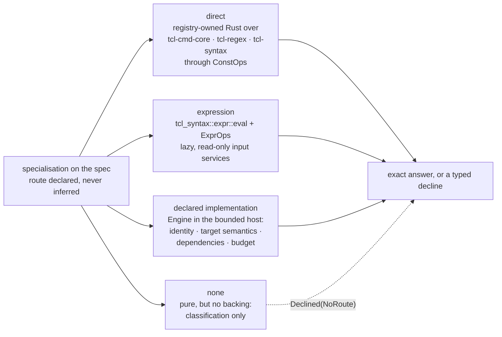
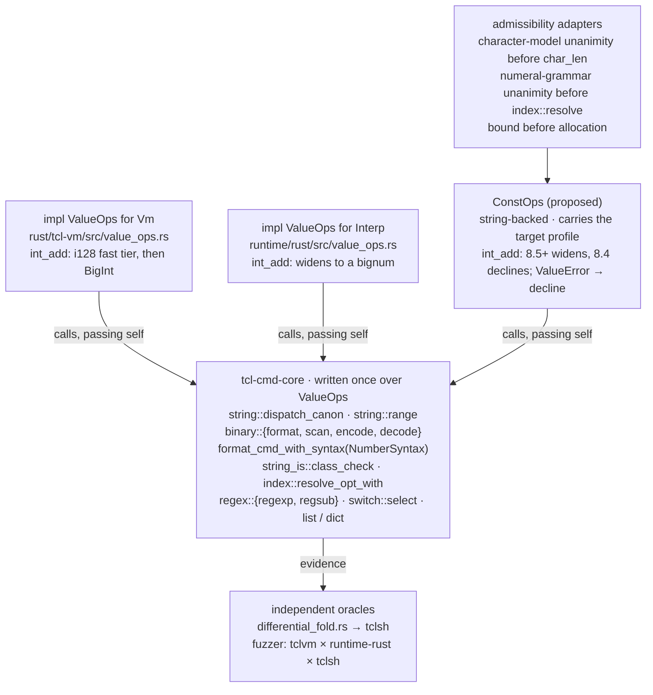
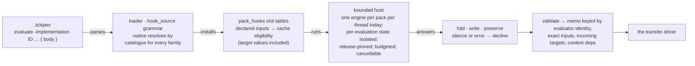

# Value evaluation — the routes, the cores, and the engine

How an exact answer is computed once the consumer interface in
[value-transfers.md](value-transfers.md) has asked for one. A
specialisation names its evaluator route on the spec; the route is a
declared capability with an identity, supported target semantics, declared
dependencies, and a budget; and every route ends in the same validated
answer. This page is the evaluation contract: the three routes, the shared
cores and adapters behind the direct route, the shared expression engine,
the regexp owner, the bounded engine for declared implementations, the one
analysis context every evaluation runs under, budgets and cancellation,
target semantics, and what a pack author writes. Read it before adding an
evaluator to a command, before touching the hook host or the fold engine,
and before promising that two implementations agree.

> **Status — a proposal.** `ConstOps`, the route declarations, the typed
> regexp result, `Engine::set_release`, the request budget, and every
> SpecTcl spelling shown as *proposed* name nothing in the workspace. The
> existing identifiers cited here were checked against the tree at the
> revision named in [value-transfers-migration.md](value-transfers-migration.md).

## Three routes, declared on the spec



- **Direct.** A registry-owned Rust function over the shared cores
  (`tcl-cmd-core`, `tcl-regex`, `tcl-syntax`), reached through one live
  string-backed `ValueOps` implementation that carries the target profile.
  The route for `string`, list and dict value operations, `binary`,
  `format`, `scan`, the numeric updates behind `incr`, `append`, and
  `lappend`, and `regexp` / `regsub`.
- **Expression.** The shared expression engine, `tcl_syntax::expr::eval`
  with its `ExprOps`, driven by the registry-owned `expr` specialisation and
  fed by lazy, read-only analysis services. The route for `expr`, for
  conditions, and for any dialect operation with expression semantics under
  its own language profile.
- **Declared implementation.** An implementation the spec names explicitly
  — a Tcl body authored in the pack, or a pinned package implementation —
  executed in the bounded engine behind `tcl_engine_api::Engine`. The route
  for a private command whose algorithm is not worth writing twice, and
  for an explicitly supported Tcl implementation where bounded execution
  avoids duplicating it.
- **None.** Representable, and the state of most pure commands today: a
  command declared pure with no route classifies as pure for CSE and
  effect reasoning and evaluates nothing. Purity never selects a route.

The route, its implementation identity, and its revision are part of the
specialisation's identity and of every memo key. A route that cannot
support the requested target semantics declines; it never answers under a
default it was not asked for.

## The direct route

### What exists

- **One value seam, two runtimes.** `tcl_syntax::value::ValueOps` is the
  generic value interface; `tcl-cmd-core` is written once over it; the
  bytecode VM (`impl ValueOps for Vm`, `rust/tcl-vm/src/value_ops.rs`) and
  the WASM runtime (`impl ValueOps for Interp`, `runtime/rust/src/value_ops.rs`)
  both implement it. Both route the `string` ensemble through
  `tcl_cmd_core::string::dispatch_canon`, `binary format` / `scan` through
  `tcl_cmd_core::binary`, and `format`, `scan`, `regsub`, list, dict, and
  the value half of `incr` / `append` / `lappend` through the cores; each
  runtime's adapter keeps the store, the write trace, and the
  const-variable check.
- **Release axes reach the cores three ways.** Through the implementation:
  `char_len` is `string_char_len(s, runtime_version)`, and `int_add` widens
  past the wide boundary in both runtimes — the VM through an `i128` fast
  tier into a `BigInt`, the WASM runtime into its bignum — as C Tcl does
  from 8.5. Through explicit arguments: `format_cmd_with_syntax(…, NumberSyntax)`,
  `string_is::class_check(…, NumberSyntax)`, `index::resolve_opt_with`,
  `binary::signedness_available(profile)`. And in one place not at all:
  `index::resolve` reads an index numeral under the default grammar, and
  `string::range` calls it, so both runtimes read `string range $s 010 end`
  the same way for every release. Both engines are release-pinnable
  (`Vm::set_runtime_version` / `set_dialect_profile`, `Interp::set_runtime_version`).
- **The registry's folders are a second implementation.** `fold_range` in
  `rust/tcl-registry/src/commands/tcl/string_.rs` is an ASCII-only
  re-implementation beside `tcl_cmd_core::string::range`; `fold_format` is
  a hand-written subset beside `format_cmd_with_syntax`; `fold_is`
  classifies with its own code beside `string_is::class_check`; the list
  folds split through a deliberately conservative `split_list` that bails
  on any backslash. Two folders already *are* core calls — `fold_regsub`
  (`tcl_cmd_core::regex::regsub::<AreEngine>`) and `parse_index`
  (`index::resolve_opt_with`) — so the precedent runs in both directions.
  There are three test-only string-backed `ValueOps` implementations
  (`rust/tcl-syntax/src/value.rs`, `tcl-cmd-core`, the registry's test
  module) and no live one.
- **A third family lives in codegen.** `rust/tcl-compiler/src/codegen/helpers.rs`
  carries `try_format_fold` (`%s` and `%d` only) and `fold_list_cmd`,
  reached from codegen and from `sccp.rs`'s name-keyed arms; `format`
  therefore has four implementations.
- **Codegen already emits folded values, guarded.** `try_emit_constant_fold`
  in `rust/tcl-compiler/src/codegen/values.rs` folds a literal-only
  `[cmd …]` through `ConstSubstCtx::fold_cmd_subst_resolved`, pushes the
  literal, and calls `require_command_binding` for every
  `CommandBindingIdentity` the fold consumed; the VM revalidates those
  identities on a command or trace epoch change
  ([vm-compiled-artifact-provenance.md](../contracts/vm-compiled-artifact-provenance.md)
  § *Invalidation*). The guard protects against rebinding; nothing protects
  against the fold and the runtime disagreeing, which a second
  implementation permits.
- **The oracle.** `rust/tcl-registry/tests/differential_fold.rs` runs every
  fold against a real `tclsh`; the fuzzer pairs `tclvm`, `runtime-rust`,
  and `tclsh`, with the rule that a two-way native pair has no oracle
  ([differential-fuzzing.md](../contracts/differential-fuzzing.md)).



### `ConstOps`, and why the adapters matter

One live, string-backed `ValueOps` implementation, `ConstOps`, carrying the
target profile — the release when the profile names one, and the
`FoldPolicy` axes otherwise — with every `ValueError` mapped to a decline.
Every shipped evaluator then *is* a core call: `fold_range` becomes
`string::range(&mut ops, s, first, last)`; the whole `string` ensemble
evaluates through `dispatch_canon`, whose `None` is a decline; `format` is
`format_cmd_with_syntax` under the profile's `NumberSyntax`; `string is` is
`class_check`; `binary format` / `scan` / `encode` / `decode` are
`tcl_cmd_core::binary`; the increment, append, and list-append updates are
the same value computations the runtime adapters call, with the lattice
write as the compile-time store. The registry's ASCII folders, the two
codegen helpers, and the five name-keyed SCCP arms retire; the conservative
list splitter becomes a precondition on the input (a backslash-free list)
rather than a divergent parser; the registry's cross-check tests become
tautologies and are replaced by the `tclsh` differential.

Introducing `ConstOps` alone does not deliver the release rules, because
the cores' signatures were written for a runtime that has already chosen
its release:

- `ValueOps::char_len` returns `usize`, not a fallible result, so it
  cannot express "the releases disagree, abstain". The admissibility check
  — `StringCharacterModel` unanimity for a profile that names no release —
  runs in a thin explicit adapter before the core is called, or in the
  semantic owner; it is not smuggled into an override of `char_len`.
- `string::range` and `string::index` use Unicode scalar vectors and call
  `index::resolve` directly; overriding `char_len` changes neither their
  indexing model nor their numeral grammar. The numeral-grammar precondition
  (`NumberSyntax::unanimous`) is likewise an adapter check.
- The runtime adapters still own coercions, byte access, and result
  construction. Calling the same generic function does not prove that
  different adapters produce the same observable result; adapter-level
  tests remain.
- For a release *range*, the adapter compares all relevant semantic cases
  or relies on an established invariance proof; one run at a default
  release does not establish unanimity.
- Resource limits apply to direct evaluators too. Checking output size
  after allocating a giant `string repeat`, an exponentiation result, or a
  binary buffer does not bound memory: bound before allocation, and charge
  significant native work to the request budget.

Release-sensitive checks live in the semantic owner or in one explicit
admissibility adapter, and conservative preconditions stay until a core
supports the target axis it lacks.

## The expression route

The compiler already shares the expression tree walk: `FoldOps` in
`rust/tcl-compiler/src/tcl_expr_eval.rs` implements `tcl_syntax::expr::ExprOps`,
supplies an environment, rejects command substitutions, and calls the
shared math-function dispatcher. This is the seam the `expr`
specialisation drives; nothing new parses or walks an expression. Three
changes make it an evaluator for the interface:

- **The full value comes back.** `eval_with_config` ends in `to_number`,
  and the adapter's `TclValue` has numeric variants only, so a
  string-valued expression cannot fold today. The analysis boundary
  carries the engine's own value; numeric classification is added as a
  fact.
- **Inputs are lazy and read-only.** The `var`, `command`, and `call`
  services read the analysis inputs at this program point: a variable when
  it is reached, a supported nested invocation through its registry
  semantics when it is reached, a math function only when reached and only
  with binding evidence. `expr {0 && [expensive]}` never asks whether
  `expensive` is calculable. The nested-substitution policy is the
  interface contract's: in the first delivery only effect-free nested
  operations are accepted and stateful ones decline, and no callback
  evaluates against stale inputs.
- **Bindings are evidence.** The math-function dispatcher in
  `tcl_syntax::expr::mathfunc` is the one owner of the function table, and
  `type_infer.rs`'s duplicate return-type table retires onto it; each
  function and nested command used becomes a dependency in the answer's
  evidence and in the memo key. `rand` and `srand` are the one
  non-determinism check the evaluator keeps by name, because
  non-determinism is an expression fact.

A dialect that gives Tcl syntax different arithmetic gets its own
language-semantic adapter for the same engine. BPF-Tcl's signed division
truncates towards zero where Tcl's floors, and its widths, overflow,
signedness, remainder, and shift rules differ; that profile is a route
dependency, and a Tcl engine result is never used as a BPF constant.

Partial simplification and algebraic regrouping are separate operations
with their own proofs, specified in the interface contract; they extend
`optimiser/helpers/expr_simplify.rs` and `optimiser/propagation.rs` and do
not live in this route.

## The regexp route

Concrete matching goes through our own engine: `tcl_regex::cmd_core::AreEngine`
implements `tcl_cmd_core::regex::RegexEngine`, and
`tcl_cmd_core::regex::{regexp, regsub}` own the command algorithms over it.
The registry already depends on `tcl-regex` with its `cmd-core` feature and
its `regsub` folder already takes this route, so this is an existing seam.
It serves `regexp` and `regsub` values, regexp-mode `switch` selection
through `tcl_cmd_core::switch::select`, `lsearch -regexp`, and any
expression or dialect operation that needs a concrete match. The
specialisation describes the command and form and maps results onto the
answer protocol; the shared plumbing owns the command algorithms; the
engine owns ARE syntax and matching; the analyser gains no second matcher,
and no engine invocation is needed to match two known values.

**The prerequisite: typed precision.** `Regex::exec` in
`rust/tcl-regex/src/lib.rs` returns an `Option` of captures, and so does
`RegexEngine::exec`. In `rust/tcl-regex/src/exec.rs`, `Bt::m` returns false
when fuel or recursion depth runs out and the search then reports no match;
`Matcher::dissect_repeat` documents a depth-limit fallback that approximates
a subgroup's capture span. The adapter therefore cannot tell a completed
no-match from an incomplete search, and an approximate capture from an
exact one. Neither can become a compile-time fact: an incomplete search
does not prove a branch false, and an approximate capture cannot become a
constant variable value or a replacement string. Putting the same matcher
behind an engine does not recover the lost information.

The regexp owner gains a fallible, precision-aware result: exact match,
completed no-match, or decline with a typed reason (fuel or depth
exhaustion, approximate capture recovery, pattern error), carried through
the shared command plumbing. A consumer that needs only match existence may
later use a separately certified exact-existence result; capture consumers
need exact captures; the first delivery declines the whole result on any
approximation. This is a contract change for existing regexp consumers,
with focused compatibility tests, and it precedes any widening of
regexp-derived constants or branch pruning. Two fixed witnesses pin it:
`^a*(b)\1$` against three hundred `a` characters followed by `bb` is a
match with whole range 0..302 and group 1 at 300..301, never a no-match;
`(x)*` against three hundred `x` characters has group 1 at 299..300
exactly.

**Options and target semantics travel explicitly.** `-inline` returns a
list and writes nothing; an ordinary no-match preserves the match
variables; unmatched subgroups on a successful match have their own
empty-string or `-1 -1` index result; `-all` and zero-length matches follow
the core's progress rules; a regexp-based branch fact and a regexp
output-variable transfer derive from one evaluated match outcome; `regsub
-command` executes a callback and therefore needs a declared route or
declines. Index units follow the target release's character model, and
copied substrings keep their exact spelling.

**Bounds.** Compiled patterns are cached by exact pattern, flags, and the
relevant profile and engine identity, in a bounded cache. Pattern
compilation, matching, and returned captures are bounded, and cancellation
reaches the match loop: a command-level deadline does not interrupt one
long native match by itself. Resource exhaustion is a decline, never "no
match".

**Compatibility is evidence.** Capture indices, Unicode, flags, malformed
patterns, substitutions, no-match writes, and target-release differences
are validated against C Tcl with deterministic witnesses; fuzz campaigns
stay in the manual tier. Static pattern diagnostics such as the ReDoS
checks ask a different question from matching one concrete subject: they
consume the shared pattern structure where available, and a successful
bounded example match proves nothing about all subjects, just as a timeout
proves no vulnerability.

## The declared-implementation route

### What exists

`tcl-spec-hooks` builds one `tcl-vm` engine per pack per thread
(`rust/tcl-spec-hooks/src/host.rs`), compiles each hook body once to a
proc, whitelists about thirty commands (`rust/tcl-spec-hooks/src/sandbox.rs`
— among them `set`, `incr`, `lappend`, `foreach`, `while`), and enforces a
budget of 100,000 commands and 250 ms of wall clock per invocation with a
16 MiB cap on any value; an error is
an abstention, a budget overrun quarantines the hook, a caught panic
poisons the pack ([spec-dsl-examples/README.md](../spec-dsl-examples/README.md)
§ *Purity and the sandbox*). The sandbox excludes `source` and `package`,
and the hook setup loads no package implementation. `tcl_engine_api::Engine`
(`rust/tcl-engine-api/src/lib.rs`) compiles a unit once, invokes it with
values, restricts the command surface, and enforces a budget;
`TclVmEngine` (`rust/tcl-engine-tclvm/src/lib.rs`) is its only
implementation, builds a `Vm` with the default registry at the default
release, and exposes no release setter although the VM has one. The host
reaches the compiler through the per-thread `pack_hooks` installer, which is
how the crate cycle is broken.

### Per-evaluation state, not per-pack containment

Removing clock, I/O, `rand`, and `srand` from a whitelist does not make a
body deterministic. The host keeps one engine per pack, the sandbox permits
`incr` and `set`, and a qualified global needs no `global`, so a body
`fold [incr ::counter]` answers `1` on its first call and `2` on its second
through the actual slot and folder thunk. A content cache can hide that;
it cannot make the computation pure. The route contract:

- **State isolation per evaluation.** A body runs in a resettable
  snapshot, or with writes outside its local activation denied, or in an
  execution context whose mutable state is discarded afterwards, and the
  rule covers several bodies in one pack and several analysis threads.
- **Two policies, not one whitelist.** The commands available to
  *implement* an evaluator — local `set`, loops, `lappend` are necessary
  facilities although none is pure — are distinct from the subject
  invocations *eligible* for evaluation, which are chosen by declared
  route. Whitelisting an ensemble by one form's purity exposes every
  subcommand unless dispatch is constrained; an apparently pure subject
  form may invoke a callback or a replaceable math function.
- **The capability is declared.** A declared implementation names its
  implementation identity, the target semantics it supports (release,
  character model, numeral grammar, regexp features, binary representation,
  platform behaviour, completion), the inputs it reads (which operands
  exactly, which target values), its context dependencies (`tcl_profile`,
  the implementation identity), and its budget. A resolver that cannot
  represent "pure, but no evaluator" is corrected by the fourth route
  state, not by making purity double as executable backing.
- **The engine is release-pinned.** `Engine::set_release`, or a
  profile-taking constructor, since the VM already supports both.
- **Provisioning is a pinned path.** A real package implementation
  reaches the engine because it was embedded with the pack or installed
  under the established package policy, never because a workspace file was
  opened. The iRules test simulator's registry-generated stubs return the
  empty string for the pure functions and are not evaluators.
- **Unknown inputs stay unknown.** If a required operand is not exact the
  body is not invoked with a placeholder, the engine does not read a host
  environment, and one sampled run is never a proof; partial abstract
  reasoning stays with the analyser.
- **The execution realm is not the subject program.** The engine's own
  builtins are not evidence about the analysed program's bindings. Binding
  validity comes from the analysis context, transitively over every
  implementation the answer used, and a later redefinition of the analysed
  command cannot reuse an old answer because the spelling is unchanged.

The route is never used for BPF-Tcl and never for vendor filter strings.



## One context, one memo

Every evaluation runs under the immutable analysis context the interface
contract defines, carried unchanged through lowering, unit construction,
per-function queries, optimiser consumers, and evaluator calls. At the
invocation memo the key is the resolved evaluator (route, implementation
identity, revision), the exact input values, the incoming target values and
existence, and every declared context dependency. Today's hook cache in
`rust/tcl-registry/src/pack_hooks.rs` has no target-value input or hash
component; declared input exposure and cache eligibility move together,
and a new spelling in the DSL is not enough on its own. A content hash is
an index, not evidence that two inputs are equal; a proof-bearing cache
verifies equality on a hit, or documents its collision policy.

The engine host is thread-local, mutable, and can quarantine a hook. Its
availability and health must not silently change the answer to an
otherwise identical memoised query: either a stable evaluator snapshot is
supplied to a query, or a capability generation is part of the context, or
optional execution results stay outside canonical proof facts until
validated. Tests cover host-present and host-absent workers, pack reload,
and quarantine.

A stale memo is an invalidation defect, not something an optimiser re-run
repairs. A second run is justified only by additional explicit assumptions
— a proven `TclOO` frame (`defining_class`), which the shared lattice never
has — and is keyed as that different context.

The salsa side of the same rule: `compilation_unit` and `function_lattice`
in `rust/tcl-lsp-db/src/lib.rs` resolve `db.registry`, the un-overlaid
registry, while `Analyser::with_pack_overlay` and the semantic-token
queries read the pack-specialised one; `FnLatticeKey` cannot carry
`ModuleCommandMutations` today, although `CommandTrustSnapshot` exists as
the hashable form of that binding fact and the key already carries two
whole-module facts of the same kind (`traced_variables`,
`has_dynamic_variable_trace`). The context enters the key once; a `rename`
anywhere in the file then invalidates every per-procedure lattice in it,
which is the correct sensitivity and the one the analyser's deferred-body
memo already has.

Dynamic dependencies must stay acyclic even when the crate graph is: SCCP
invokes an expression, whose `command` service asks for the same canonical
function lattice, whose computation requires the same expression; or a
host compiles a hook body using the pack evaluators it is still installing.
A callback reads the supplied current analysis state or follows a
separately specified nested evaluation protocol, and never demands the
completed query being computed; installation has a bootstrap mode
independent of the uninstalled evaluator; the host's execution realm stays
distinct from the subject program's proven bindings; an unsupported cycle
is a typed decline, not a depth cap that makes the answer meaningful.

## Budgets and cancellation

The existing per-invocation limits are containment, not an interactive
performance contract: ten thousand cache misses at twenty milliseconds
each cost two hundred seconds while every one stays far below the 250 ms
cap. The budget is per request and per solver iteration as well as per
evaluation, and direct cores, regexp compilation, nested expression
callbacks, engine calls, result construction, and cache growth are all
charged to it. Cancellation reaches expensive native operations: the VM's
command counter does not count every inlined bytecode operation, its own
documentation relies on wall-clock polling for that case, and a long core
call is not interrupted at a Tcl command boundary. Aggregate retained
memory is limited, not only the largest individual value.

On cancellation or exhaustion the analysis is sound and incomplete, never
an exact negative answer. Caches distinguish a deterministic unsupported
case from a transient scheduler or host failure: a transient failure never
permanently disables future precision, and a retry never mutates an
already published snapshot's meaning. Tests cover warm and cold caches,
deliberate churn, many packs, and worker migration, not only a fast
repeated hook. The 28 µs uncached and 24.5 ns cached figures measured for
existing hook workloads describe those workloads; they are not measurements
of this service or of arbitrary command implementations, and performance
acceptance compares the unchanged tree, direct-core evaluation, expression
evaluation, and declared execution on the same workloads — cold host setup,
warm evaluation, cache hits, changed inputs, solver iterations, cancellation
latency, memory, and incremental editor latency.

## Target semantics

Passing a `TclVersion` does not make an engine implement that release. For
each route the contract states the numeric syntax, character and index
model, regexp features and limits, binary representation, platform
behaviour, and completion semantics it supports; an unsupported combination
declines. `TclVersion::from_profile` in `rust/tcl-dialect/src/version.rs`
answers only for the five plain Tcl profile names, so every vendor
environment evaluates under the invariant subset today; the fix feeds the
environment's point through the evidence gate per measured row, never by
name — the hook context already carries `dialect` and `tcl-version` keys,
and the gap is the value for vendor profiles.

What "consistent" can mean depends on the pair:

- **Among the direct route, the VM, and the WASM runtime** — achievable by
  construction: one function over one seam, with the adapter caveats above.
- **With C Tcl** — an evidence question. The cores are a port; the
  `tclsh` differential and the fuzzer's `tclsh` pair are the oracle, and a
  shared bug is invisible to a two-way native pair, so agreement between
  our compiler and our runtimes can mean both share a defect. One
  divergence is known today: `index::resolve` reads index numerals under
  one grammar for every release. Independent target oracles and
  adapter-level tests stay; a missing target fact never falls back to the
  build machine's platform or the installed engine's default profile.
- **Across releases** — the profile decides; a profile that names no
  release gets the unanimous answer or a decline, the rule the cores'
  explicit `NumberSyntax` arguments already enforce. Each test run records
  the oracle release and platform, and the oldest relevant release is
  tested for each supported behaviour, not whichever `tclsh` is on `PATH`.

## Authoring on the routes

Today's `const_fold {words ctx} {…}` and `const_fold -native ID`, the
`hook_source` grammar (`FIELD ?-inputs {…}? {params} {body}` or
`FIELD -native ID`), and the native `CommandSpec` fields are the
compatibility baseline. The spellings below are *proposed*: `semantics`,
`evaluate`, `facts`, and the route flags are not loader syntax, and adopting
them means the registry field, loader, exporter, renderer, studio form,
documentation, and parity tests move together under
[command-spec-studio.md](../contracts/command-spec-studio.md).

### `incr`: direct arithmetic, independent result and write

```rust,ignore
CommandSpec {
    name: "incr",
    semantics: registry_semantics!(incr::SEMANTICS),
    // Existing arity, roles, version, and documentation fields retained.
    ..CommandSpec::DEFAULT
}

// Registry-owned specialisation over the shared numeric owner.
fn evaluate(input: &dyn AnalysisInputs, budget: &mut Budget) -> EvalAnswer {
    let form = incr_form(input.invocation())?;
    let target = form.declared_target();
    let old = input.prior_store(target.place(), FactDomain::ExactValue);
    let step = form.increment_or_exact_default("1");
    let outcome = numeric_core::tcl_incr(old, step, input.context(), budget)?;
    exact_outcome(outcome.completion, outcome.result, outcome.ordered_stores)
}
```

```tcl
# Proposed equivalent declaration; the native binding owns the algorithm.
command incr {
    semantics -native core.incr
    evaluate -direct core.incr
    facts -native core.incr
}
```

The structural plan declares a variable read-modify-write and its possible
failure. A missing scalar is created from 8.5 and an error under 8.4; an
unknown scalar is not silently zero; an array, traced, or aliased cell
carries its effects. The shared numeric operation implements the selected
release's parsing and bignum behaviour. `incr x` can produce both
`result = 4` and `x = 4`, and knowing the result does not permit deleting
the write or its traces. "Direct" never means an unchecked Rust `+` or a
Unicode scalar count.

### `expr`: the shared engine, not a miniature interpreter

```rust,ignore
CommandSpec {
    name: "expr",
    semantics: registry_semantics!(expr::SEMANTICS),
    ..CommandSpec::DEFAULT
}

fn evaluate(input: &dyn AnalysisInputs, budget: &mut Budget) -> EvalAnswer {
    let expression = expr_arguments::prepare(input.invocation())?;
    let ops = ProvenTclExprOps::new(input, budget);
    shared_expr_engine::evaluate(expression, ops)
}
```

```tcl
# Proposed: names the shared expression route, never an engine fallback.
command expr {
    semantics -native core.expr_arguments
    evaluate -expression tcl.expr
    facts -native core.expr_facts
}
```

`ProvenTclExprOps` adapts the existing `ExprOps` contract: resolve a
variable when reached; evaluate a supported command or math function only
when reached; retain ordering and completion. The result is a Tcl value,
not necessarily a number. Braced and concatenated or unbraced arguments have
different evaluation stages. Math-function and nested-command binding
dependencies go into the evidence and the cache key.

### `regexp`: our engine, typed precision, per-target outcomes

```tcl
# Proposed declaration; no diagnostic codes, no compiler callback IDs.
command regexp {
    semantics -native core.regexp_forms
    evaluate -direct core.regexp
    facts -native core.regexp_facts
}
```

The native specialisation delegates to the shared regexp command plumbing
over `tcl-regex`, resolves flags once from the canonical invocation, and
returns a typed exact match, exact no-match, Tcl pattern error, or decline.
For `regexp {a(b)} $subject whole capture`, an exact match yields the
integer result and ordered writes to `whole` and `capture`; no match
preserves their previous values and existence; an unknown subject yields
bounded conditional writes and a known numeric result type without inventing
captures. `-inline`, `-indices`, `-all`, and `-about` select different
forms, and the existing dynamic return-type hook is an adapter into those
same form semantics.

### A private command, without granting the pack analyser mutation

A pack command `tenant::label NAME` whose runtime implementation returns
`string cat "tenant:" $NAME` exposes a declared route and a partial-value
relationship without extending SCCP:

```tcl
# The entire block is proposed API, including capability names and fact syntax.
command tenant::label {
    arity 1
    semantics {
        effects {no_store_writes no_external_io}
        result -semantic string
    }
    evaluate -implementation tenant.label.v1 -host bounded_tcl {
        inputs {arg 0 exact}
        depends {tcl_profile implementation_identity}
        body {name} {
            return [string cat "tenant:" $name]
        }
    }
    facts {
        result -string_segments {{constant "tenant:"} {operand 0}}
        taint -result_from {arg 0}
    }
}
```

If the argument is unknown the body is not invoked with a placeholder: the
answer is an unknown exact value plus the proven prefix segment and the
taint relationship, and the prefix does not sanitise the unknown suffix.
The author declares which implementation the evaluator models, and under
the rulings no independent certification of that claim is required; the
resolved binding and the implementation revision still decide when the
model applies. The bounded host denies ambient files, network, clock,
randomness, and undeclared globals, accounts for aggregate request cost,
and isolates or resets mutable state — execution and correctness
contracts, not an author-trust gate.

### Verbs, silence, and `-native`

Inside an authored body the verbs are `fold VALUE` for the result,
`write TARGET VALUE`, and `preserve TARGET`; silence is a decline, a
`write` to an operand the structural plan did not validate as a target
raises, and raising is a decline. Whether the DSL spells this as one
`evaluate` statement with declared inputs, as above, or as per-shape
families beside `const_fold`, is a loader decision for the pack slice; the
answer protocol is the same either way, and `answer_of` in
`rust/tcl-spec-hooks/src/emit.rs` remains the exhaustive match that forces
the verb and silence decisions for every family.

`-native ID` must mean one thing. Today it resolves for the closed
catalogues (`lowering_hook -native Switch` reaches `LoweringHookId::Switch`)
but not for the body families: `const_fold_versioned -native string::is`
in `docs/design/spec-dsl-examples/string.tclspec` installs the family's
abstention and nothing else, because no name-to-function table exists for
folders and `HookSource::Native` is consumed nowhere but reports. The
routes fix this rather than inherit it: `-direct`, `-expression`, and every
`-native` reference resolve through a catalogue pinned by
`native_hook_tables_cover_their_catalogues`, an unknown name is dropped
with a load notice, and the renderer's synthesised
`FIELD -native <command>::<field>` spelling is a `GAPS` entry until the
draft can recover the real name.

### The four surfaces, and inference

Registry, loader, renderer and export, and studio move together or carry a
`GAPS` entry: `rust/tcl-spec-studio/src/coverage.rs`'s exhaustive
destructuring witness fails to compile until each new field is surfaced or
`Surface::Excluded`; `export.rs` round-trips bodies verbatim as it does for
`const_fold`; the studio gains a route picker and a body box in the
"Purity and folding" cluster, closes its top-level-only carry-forward of
hook bodies so a subcommand's body survives a form edit, and could offer a
"try it" box over `HookHost::install_pack_hooks` plus a synthetic
`HookCall`. `tcl-mcp`'s `spectcl_check` already reports each hook's family,
cacheability, and the context keys its body reads beyond its declared
inputs; the routes join that report so an author sees an evaluator that
reads a target value without declaring it.

`ai/claude/skills/spec-author/SKILL.md` infers arity, roles, traits, hover,
and packages from a library's sources. For a private command implemented
in loop-free Tcl over whitelisted commands, the skill can propose the body
as a declared implementation, but purity inferred from a summary is
classification only: the route, its dependencies, and its budget are still
authored, and the pack's differential corpus proves the implementation
against the library's real behaviour.

## File-path anchors

- `rust/tcl-syntax/src/value.rs` — `ValueOps`, `string_char_len`, the seam `ConstOps` implements
- `rust/tcl-cmd-core/src/string.rs`, `binary.rs`, `format.rs`, `string_is.rs`, `index.rs`, `switch.rs`, `regex.rs` — the cores the direct route calls
- `rust/tcl-vm/src/value_ops.rs`, `runtime/rust/src/value_ops.rs` — the two runtime implementations of the seam
- `rust/tcl-registry/src/const_fold.rs`, `commands/tcl/string_.rs`, `commands/tcl/regsub_.rs` — the shipped folders, the ASCII re-implementations, and the two that are already core calls
- `rust/tcl-compiler/src/codegen/helpers.rs`, `codegen/values.rs` — the two codegen folders to retire; `try_emit_constant_fold`
- `rust/tcl-compiler/src/tcl_expr_eval.rs`, `rust/tcl-syntax/src/expr/eval.rs`, `rust/tcl-syntax/src/expr/` — `FoldOps`, `eval_with_config`, `ExprOps`, the math-function dispatcher
- `rust/tcl-regex/src/lib.rs`, `exec.rs`, `cmd_core.rs` — `Regex::exec`, the fuel and depth fallbacks, `AreEngine`
- `rust/tcl-spec-hooks/src/host.rs`, `sandbox.rs`, `emit.rs`, `pack_eval.rs`, `program.rs` — the per-pack host, the whitelist, `answer_of`, `HookProgram`
- `rust/tcl-registry/src/pack_hooks.rs` — `HookFamily`, `CacheMode`, `install_host`, `const_fold_fn`, the slot tables and the cache
- `rust/tcl-engine-api/src/lib.rs`, `rust/tcl-engine-tclvm/src/lib.rs` — the engine seam and its one implementation
- `rust/tcl-spectcl/src/hooks.rs`, `loader.rs`, `export.rs` — the pack seam, `hook_source`, the native-ID tables
- `rust/tcl-spec-studio/src/coverage.rs`, `render_spectcl.rs`, `schema.rs` — the four-surface gates
- `rust/tcl-lsp-db/src/lib.rs` — `FnLatticeKey`, `compilation_unit`, `function_lattice`
- `rust/tcl-compiler/src/command_binding.rs` — `CommandTrustSnapshot`
- `rust/tcl-dialect/src/version.rs`, `profile.rs` — `TclVersion::from_profile`, `const_fold_version`
- `ai/claude/skills/spec-author/SKILL.md` — the inference surface

## Test anchors

- `rust/tcl-registry/tests/differential_fold.rs` — every fold against a real `tclsh`; gains the storage-outcome witnesses per release found on `PATH`
- `rust/tcl-spec-hooks/tests/const_fold_e2e.rs` — O129 driven by a `.tclspec` body
- `rust/tcl-spectcl/tests/spec_corpus.rs` — every shipped pack's hooks through the sandboxed host at budget: a loading and containment gate, not a value oracle
- `rust/tcl-spectcl/src/loader.rs` — `native_hook_tables_cover_their_catalogues`
- `rust/tcl-spec-studio/tests/spectcl_roundtrip.rs` — the four-surface round trip
- `rust/tcl-vm/tests/dict_canonicalisation_parity.rs` — the list-rendering parity the folders depend on
- fixed witnesses to add: the `fold [incr ::counter]` isolation test (same answer on every call), the two regexp precision witnesses, `string repeat` and `**` bounded before allocation, host-absent and quarantined workers answering identically, an `Engine::set_release` witness per release axis

## Related docs

- [value-transfers.md](value-transfers.md) — the interface this contract evaluates for
- [value-transfers-migration.md](value-transfers-migration.md) — the slices that land each route
- [registry-consumer-contracts.md](registry-consumer-contracts.md) — runtime backing, the engine's WASM sibling, and C hosting, none of which this contract waits for
- [../runtime/family-b-routing.md](../runtime/family-b-routing.md) — the shared-core rule the direct route follows
- [../contracts/differential-fuzzing.md](../contracts/differential-fuzzing.md), [../contracts/registry-contract-tests.md](../contracts/registry-contract-tests.md) — the oracles
- [../contracts/vm-compiled-artifact-provenance.md](../contracts/vm-compiled-artifact-provenance.md) — how a folded value in bytecode is admitted and invalidated
- [../registry/spec-packs.md](../registry/spec-packs.md), [../spec-dsl-examples/README.md](../spec-dsl-examples/README.md) — the DSL and its hook contract
- [../contracts/command-spec-studio.md](../contracts/command-spec-studio.md) — the four-surface parity rule
- [../contracts/shared-utility-contracts-rust.md](../contracts/shared-utility-contracts-rust.md) — the owner manifest
- [compiler design index](README.md), [design docs index](../README.md)
