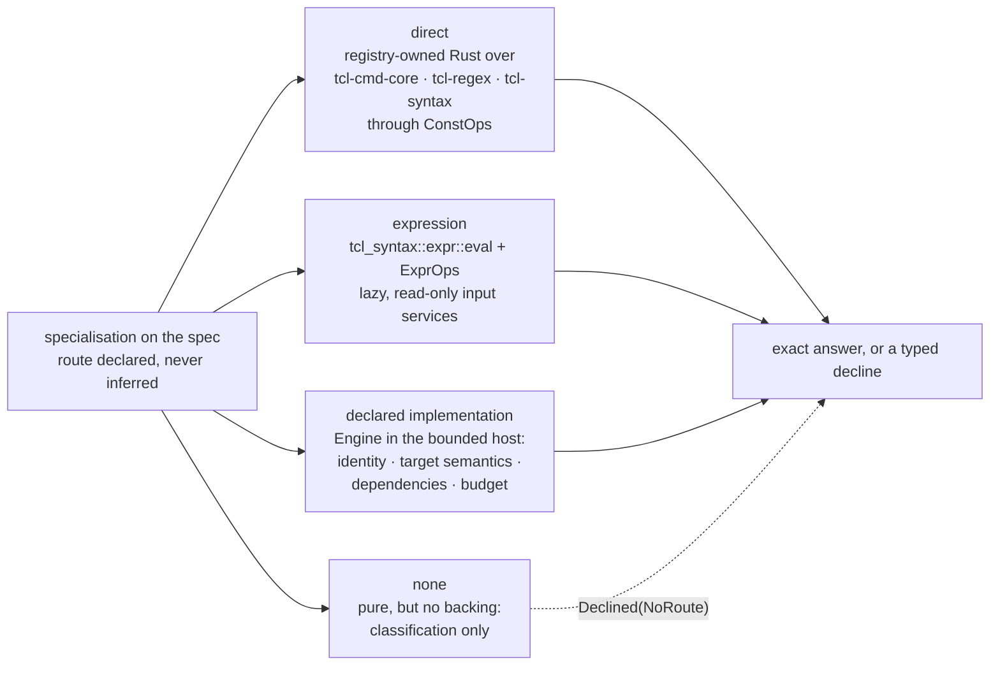
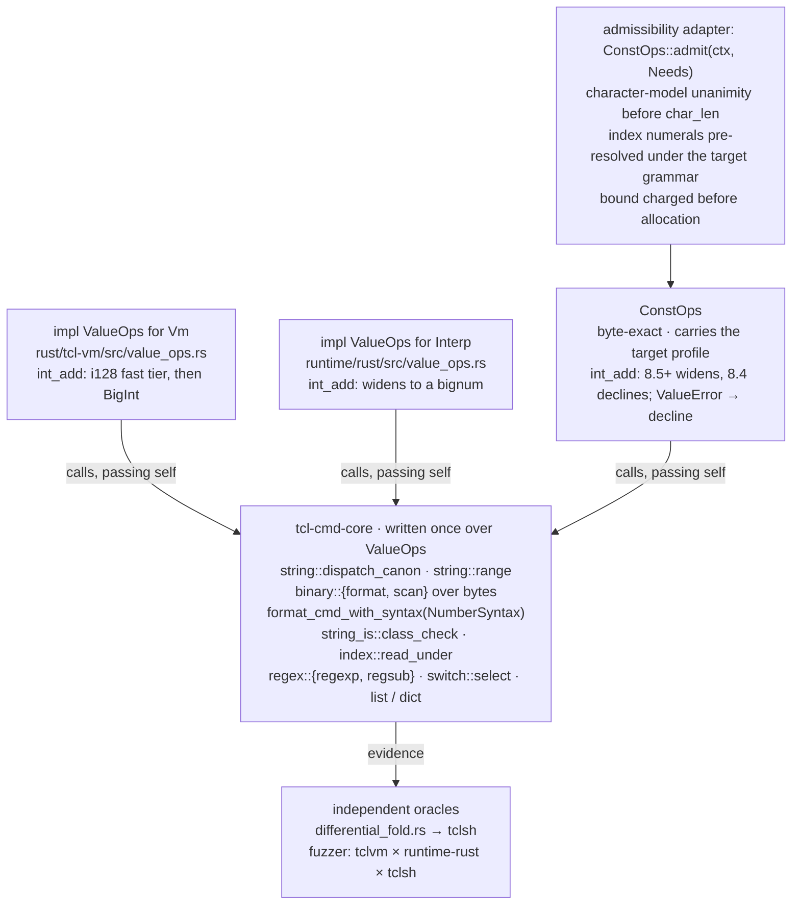
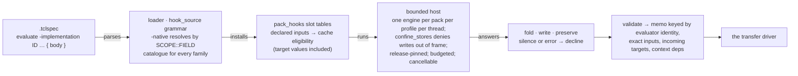

# Value evaluation — the routes, the cores, and the engine

How an exact answer is computed once the consumer interface in
[value-transfers.md](value-transfers.md) has asked for one. A
specialisation names its evaluator route on the spec; the route is a
declared capability with an identity, supported target semantics, declared
dependencies, and a budget; and every route ends in the same validated
answer. This page is the evaluation contract: the three routes, the shared
cores and adapters behind the direct route, the shared expression engine,
the regexp owner, the bounded engine for declared implementations, the one
analysis context every evaluation runs under, budgets and cancellation,
target semantics, and what a pack author writes. Read it before adding an
evaluator to a command, before touching the hook host or the fold engine,
and before promising that two implementations agree.

> **The types.** `EvalRoute`, `NativeEvalId`,
> `LanguageProfileId`, `NoRouteReason`, `SpecialisationId`; `ConstOps`,
> `ConstValue`, `Representation`, `Needs`, `TargetSemantics`, `Axis`,
> `SourceEncoding`, `WorkUnits`; `EvaluatorCapability`,
> `ImplementationIdentity`, `HostKind`, `DeclaredInput`, `Exactness`,
> `ContextDependency`, `CompletionSupport`, `EvaluatorGeneration`,
> `Engine::set_release`, `Engine::confine_stores`; and every `.tclspec`
> spelling shown below — the `semantics` / `evaluate` / `facts`
> statements, the route flags `-direct` / `-expression` /
> `-implementation` / `-native` / `-host`, the `inputs` / `depends` /
> `budget` / `body` rows, the option flags `-evaluate` /
> `-evaluate-reason`, the body verbs `fold` / `write` / `preserve`, and
> DSL vocabulary 2.2 — is loader syntax
> ([spec-dsl-examples/README.md](../spec-dsl-examples/README.md)
> § *Vocabulary changelog*), proven by the fixture behind
> [value-transfers-examples.md](value-transfers-examples.md) § *A private
> command in a workspace pack*; the
> `-host wasm_extension` host and its `extension FILE PREFIX` row are
> § *The declared-implementation route* › *The extension host*. Every
> shipped route is Rust construction in
> `rust/tcl-registry/src/value_transfer/`, and no shipped builtin is
> declared in the DSL, so the declarations of `incr`, `expr`, and `regexp`
> below are illustrative.
>
> The regexp owner's `RegexpPrecision`, `PrecisionDecline`,
> `PatternCacheKey`, and `EngineIdentity` are `tcl_cmd_core::regex`'s;
> `binary::format_size_bound` and the field `MathFuncSpec::result_class`
> are the cores'. The memo is `pack_hooks::ShapeKey` plus `CallContent`,
> compared on every hit, never a digest alone; the budget is one `Budget`
> type at three call sites — `Budget::request()`, `.iteration()`,
> `.evaluation_within()`; the per-family native tables are fourteen
> separate `pub const *_NATIVE` tables in `pack_hooks.rs`, two populated;
> and per-evaluation state is confined by `Engine::confine_stores`. The
> Rust blocks below are sketches in the contract's names — `EvalMemoKey`,
> `TargetState`, `TargetDigest`, `CancelToken`, and `CancelPoint` among
> them — and the text beside each names the tree's type.
>
> `DeclineReason` and every variant of it — `NoRoute`, `ReleaseAmbiguous`,
> and `NotText` included — are the interface contract's; this page defines
> the payloads `NoRouteReason` and `Axis` that two of them carry.
> Every Tcl behaviour quoted was run on `tclsh8.4` (8.4.20), `tclsh8.5`
> (8.5.19), `tclsh8.6` (8.6.18), `tclsh9.0` (9.0.4), and `tclsh9.1`
> (9.1b0).

## Three routes, declared on the spec


```mermaid
flowchart LR
    S["specialisation on the spec<br/>route declared, never inferred"] --> D["direct<br/>registry-owned Rust over<br/>tcl-cmd-core · tcl-regex · tcl-syntax<br/>through ConstOps"]
    S --> X["expression<br/>tcl_syntax::expr::eval + ExprOps<br/>lazy, read-only input services"]
    S --> I["declared implementation<br/>Engine in the bounded host:<br/>identity · target semantics ·<br/>dependencies · budget"]
    S --> N["none<br/>pure, but no backing:<br/>classification only"]
    D --> A["exact answer, or a typed decline"]
    X --> A
    I --> A
    N -. Declined(NoRoute) .-> A
```

- **Direct.** A registry-owned Rust function over the shared cores
  (`tcl-cmd-core`, `tcl-regex`, `tcl-syntax`), reached through one live
  string-backed `ValueOps` implementation that carries the target profile.
  The route for `string`, list and dict value operations, `binary`,
  `format`, `scan`, the numeric updates behind `incr`, `append`, and
  `lappend`, and `regexp` / `regsub`.
- **Expression.** The shared expression engine, `tcl_syntax::expr::eval`
  with its `ExprOps`, driven by the registry-owned `expr` specialisation and
  fed by lazy, read-only analysis services. The route for `expr`, for
  conditions, and for any dialect operation with expression semantics under
  its own language profile.
- **Declared implementation.** An implementation the spec names explicitly
  — a Tcl body authored in the pack, or a pinned package implementation —
  executed in the bounded engine behind `tcl_engine_api::Engine`. The route
  for a private command whose algorithm is not worth writing twice, and
  for an explicitly supported Tcl implementation where bounded execution
  avoids duplicating it.
- **None.** Representable, and the state of most pure commands: a
  command declared pure with no route classifies as pure for CSE and
  effect reasoning and evaluates nothing. Purity never selects a route.

The four states are one closed enumeration, resolved with the binding and
the selected form:

```rust,ignore
/// The declared way an exact answer is computed. Resolved once per
/// invocation, from the spec's three declaration states (inherited,
/// declared, declined) at command, subcommand, and form scope.
enum EvalRoute {
    /// A registry-owned Rust function over the shared cores, named by
    /// its catalogue id.
    Direct { id: NativeEvalId },
    /// The shared expression engine under a named language profile
    /// (`tcl.expr`, `bpf.expr`).
    Expression { language: LanguageProfileId },
    /// An implementation the spec names, run in the bounded host.
    Implementation(EvaluatorCapability),
    /// Declared absence: classification only. The driver answers
    /// `Declined(NoRoute)` without consulting purity.
    None { reason: NoRouteReason },
}

/// Why a specialisation has no route: the payload of the interface
/// contract's `DeclineReason::NoRoute`, and the `none` route of the
/// generated inventory (`docs/generated/value-transfers.md`).
enum NoRouteReason {
    /// `evaluate none`: the author abstained at this scope.
    Declared,
    /// No evaluator is authored for the form — the state of most pure
    /// commands.
    Unauthored,
    /// The form or option is outside what the route models
    /// (`regexp -about`).
    FormUnsupported,
    /// The form runs a callback (`regsub -command`, a `-command`
    /// comparison), which needs a declared route of its own.
    Callback,
}
```

The route, its implementation identity, and its revision are part of the
specialisation's identity and of every memo key. A route that cannot
support the requested target semantics declines; it never answers under a
default it was not asked for.

## The direct route

### What exists

- **One value seam, two runtimes.** `tcl_syntax::value::ValueOps` is the
  generic value interface; `tcl-cmd-core` is written once over it; the
  bytecode VM (`impl ValueOps for Vm`, `rust/tcl-vm/src/value_ops.rs`) and
  the WASM runtime (`impl ValueOps for Interp`, `runtime/rust/src/value_ops.rs`)
  both implement it. Both route the `string` ensemble through
  `tcl_cmd_core::string::dispatch_canon`, `binary format` / `scan` through
  `tcl_cmd_core::binary`, and `format`, `scan`, `regsub`, list, dict, the
  value half of `incr` / `append` / `lappend`, and the new list `lset`,
  `ledit` and `lpop` write back (`tcl_cmd_core::list`, under the release the
  engine emulates) through the cores; each runtime's adapter keeps the
  store, the write trace, and the const-variable check.
- **Not every core takes the seam.** `tcl_cmd_core::binary::{format, scan}`
  take `&[u8]` and `&[&[u8]]`, `tcl_cmd_core::regex::regsub` takes
  `&[&[u8]]`, and `tcl_cmd_core::string_is::class_check` takes `&str` —
  they are byte and string functions with no `ValueOps` parameter, so the
  direct route reaches them by materialising operands through
  `ValueOps::as_bytes` and returns through `ValueOps::new_bytes`. A value
  model whose `as_bytes` falls back to the UTF-8 string rep corrupts a
  `binary format` result
  ([byte-array-corruption.md](byte-array-corruption.md)), so overriding
  both is a precondition of the route, not an optimisation.
- **Release axes reach the cores three ways.** Through the implementation:
  `char_len` is `string_char_len(s, runtime_version)`, and `int_add` widens
  past the wide boundary in both runtimes — the VM through an `i128` fast
  tier into a `BigInt`, the WASM runtime into its bignum — as C Tcl does
  from 8.5. Through explicit arguments: `format_cmd_with_syntax(…, NumberSyntax)`,
  `string_is::class_check(…, NumberSyntax)`, `index::read_with` and `read_under`,
  `binary::signedness_available(profile)`, `binary::specifier_min_version`,
  `format::is_available`, `list::lset` / `ledit` / `lpop` (a `TclVersion`).
  And in one place not at all:
  `index::resolve` reads an index numeral under the ambient grammar
  `tcl_syntax::number::runtime_syntax()` installed by `set_runtime_syntax`,
  and `string::range`, `string::index`, and `string::word_bound` call it,
  so both runtimes read `string range $s 010 end` under whatever release
  the process was pinned to. Both engines are release-pinnable
  (`Vm::set_runtime_version` / `set_dialect_profile`, `Interp::set_runtime_version`).
- **Some of the registry's folders are a second implementation.**
  `fold_range` in `rust/tcl-registry/src/commands/tcl/string_.rs` runs the
  `string range` route over its literal words
  (`evaluate_literal(&STRING_RANGE, …)`), and `fold_regsub`
  (`tcl_cmd_core::regex::regsub::<AreEngine>`) and `parse_index`
  (`index::read_with` under `NumberSyntax::unanimous`) are core calls;
  `fold_format` in `commands/tcl/format_.rs` is a hand-written subset beside
  `format_cmd_with_syntax`, `fold_is` classifies with its own code beside
  `string_is::class_check`, and the list folds split through a
  deliberately conservative `split_list` that bails on any backslash.
  `ConstOps` (`rust/tcl-registry/src/value_transfer/const_ops.rs`) is the
  live string-backed `ValueOps` implementation; the others
  (`rust/tcl-syntax/src/value.rs`, `tcl-cmd-core`'s test modules) are
  test-only.
- **Codegen carries no folder of its own.** `rust/tcl-compiler/src/codegen/helpers.rs`
  holds no command fold: the engine runs every fold, and `format` folds on
  its registry-owned route over the shared format core.
- **Codegen already emits folded values, guarded.** `try_emit_constant_fold`
  in `rust/tcl-compiler/src/codegen/values.rs` folds a literal-only
  `[cmd …]` through `ConstSubstCtx::fold_cmd_subst_resolved`, pushes the
  literal, and calls `require_command_binding` for every
  `CommandBindingIdentity` the fold consumed; the VM revalidates those
  identities on a command or trace epoch change
  ([vm-compiled-artifact-provenance.md](../contracts/vm-compiled-artifact-provenance.md)
  § *Invalidation*). The guard protects against rebinding; nothing protects
  against the fold and the runtime disagreeing, which a second
  implementation permits. The engine runs the registry-owned
  route a call declares over its literal words (`evaluate_literal`) — the
  evaluator the lattice runs, over the core the runtimes run — and its
  answer, a decline included, is the fold, a byte array or an answer beyond
  ASCII declining because the engine writes it back into a script, where a
  byte array has no lossless spelling and 8.x reads text in the system
  encoding; a command that declares no route keeps its `const_fold`
  callback.
- **The oracle.** `rust/tcl-registry/tests/differential_fold.rs` runs every
  fold against a real `tclsh`; the fuzzer pairs `tclvm`, `runtime-rust`,
  and `tclsh`, with the rule that a two-way native pair has no oracle
  ([differential-fuzzing.md](../contracts/differential-fuzzing.md)).


```mermaid
flowchart TB
    VM["impl ValueOps for Vm<br/>rust/tcl-vm/src/value_ops.rs<br/>int_add: i128 fast tier, then BigInt"]
    RT["impl ValueOps for Interp<br/>runtime/rust/src/value_ops.rs<br/>int_add: widens to a bignum"]
    CO["ConstOps<br/>byte-exact · carries the target profile<br/>int_add: 8.5+ widens, 8.4 declines; ValueError → decline"]
    CORE["tcl-cmd-core · written once over ValueOps<br/>string::dispatch_canon · string::range<br/>binary::{format, scan} over bytes<br/>format_cmd_with_syntax(NumberSyntax)<br/>string_is::class_check · index::read_under<br/>regex::{regexp, regsub} · switch::select · list / dict"]
    VM -->|calls, passing self| CORE
    RT -->|calls, passing self| CORE
    CO -->|calls, passing self| CORE
    AD["admissibility adapter: ConstOps::admit(ctx, Needs)<br/>character-model unanimity before char_len<br/>index numerals pre-resolved under the target grammar<br/>bound charged before allocation"] --> CO
    CORE -->|evidence| OR["independent oracles<br/>differential_fold.rs → tclsh<br/>fuzzer: tclvm × runtime-rust × tclsh"]
```

### `ConstOps`, and why the adapters matter

One live `ValueOps` implementation, `ConstOps`, carries the target
profile — the release when the profile names one or its dialect declares
a base release, and otherwise the unanimity rule, under which an
operation's answer stands only where every release the profile can denote
gives it — with every `ValueError` mapped to a decline. Every shipped
direct evaluator is a core call over it: `string range` is
`string::range(&mut ops, s, first, last)`; `format` is
`format_cmd_with_syntax` under the profile's `NumberSyntax`; `binary
format` / `scan` are `tcl_cmd_core::binary`; the increment, append, and
list-append updates are the value computations the runtime adapters call —
`ValueOps::int_add`, `var::append_bytes`, `var::lappend_value` — with the
lattice write as the compile-time store. The `const_fold` callbacks that
are not core calls run only where a call's route declines or none is
declared, and the `tclsh` differential holds them and the routes alike.

`ConstOps` alone does not deliver the release rules, because
the cores' signatures were written for a runtime that has already chosen
its release:

- `ValueOps::char_len` returns `usize`, not a fallible result, so it
  cannot express "the releases disagree, abstain". The admissibility check
  — `StringCharacterModel` unanimity for a profile that names no release —
  runs in a thin explicit adapter before the core is called, or in the
  semantic owner; it is not smuggled into an override of `char_len`.
- `string::range` and `string::index` use Unicode scalar vectors and call
  `index::resolve` directly; overriding `char_len` changes neither their
  indexing model nor their numeral grammar. The numeral-grammar
  precondition is likewise an adapter obligation, and the adapter
  discharges it by *resolving the index itself* rather than by wishing for
  a `*_with` variant of every core that reads one.
- The runtime adapters still own coercions, byte access, and result
  construction. Calling the same generic function does not prove that
  different adapters produce the same observable result; adapter-level
  tests remain.
- For a release *range*, the adapter compares all relevant semantic cases
  or relies on an established invariance proof; one run at a default
  release does not establish unanimity.
- Resource limits apply to direct evaluators too. Checking output size
  after allocating a giant `string repeat`, an exponentiation result, or a
  binary buffer does not bound memory: bound before allocation, and charge
  significant native work to the request budget. `string::repeat` is
  `src.repeat(n)` with no bound of its own, and C Tcl refuses the same
  call before allocating — `string repeat ab 100000000000` raises
  `integer value too large to represent` on 8.4, 8.5, and 8.6 and
  `string size overflow: unable to alloc 200000000000 bytes` on 9.0 and
  9.1 — so the charge, not the core, is what keeps the analyser alive.

Release-sensitive checks live in the semantic owner or in one explicit
admissibility adapter, and conservative preconditions stay until a core
supports the target axis it lacks.

The answer shapes this page hands back — `EvalAnswer`,
`InvocationOutcome`, `StoreOutcome`, `CompletionOutcome`, `TypeFacts`,
`DependencyEvidence`, `TargetId`, `OperandId`, `AnalysisInputs`,
`AnalysisContext`, and `DeclineReason` — are the interface contract's and
are defined in [value-transfers.md](value-transfers.md) § *The interface*.
What this page contributes to them is the payloads two reasons carry —
`NoRouteReason` behind `NoRoute` and `Axis` behind `ReleaseAmbiguous` —
and the mapping of the regexp owner's `PrecisionDecline` onto reasons the
interface contract already names: `FuelExhausted`, `DepthExhausted`, and
`ApproximateCapture` are `Approximate`; `FormUnsupported` is
`Unsupported`; `Cancelled` is `Budget`; and `PatternError` is the call's
error completion, never a value. None of them is a second answer kind.
The `Budget` an evaluator is handed is that page's handle, the route's
view of one `EvaluationBudget` (§ *The three nested budgets*);
`tcl_engine_api::Budget` is the engine's own caps, and the two are named
apart wherever both appear.

### The `ConstOps` type

```rust,ignore
/// The one live compile-time value model. Byte-exact, release-bound,
/// budget-charging, and poisoned by the first fault so no partial answer
/// escapes.
struct ConstOps<'ctx> {
    /// The admitted target semantics: the release when the profile names
    /// one or its dialect declares a base release, and the unanimity rule,
    /// applied per operation, otherwise.
    target: TargetSemantics,
    /// What `admit` was asked for. Every core call is checked against it.
    admitted: Needs,
    /// The evaluation's slice of the request budget: the interface
    /// contract's `Budget` handle, which is one `EvaluationBudget` as a
    /// route sees it (§ *The three nested budgets*).
    budget: &'ctx mut Budget,
    /// The first fault any core or seam method recorded. Once set, `take`
    /// declines whatever value it is handed.
    fault: Option<DeclineReason>,
    /// The cancellation token every `CancelPoint` reads.
    cancel: &'ctx CancelToken,
}

/// A compile-time value: byte-exact, with the string rep derived on
/// demand and the representation kept as separate evidence.
#[derive(Clone)]
struct ConstValue {
    bytes: Rc<[u8]>,
    /// Representation evidence for the answer, never a coercion:
    /// `String`, `ByteArray`, `List`, `Dict`, `Int`, `Double`.
    repr: Representation,
}

/// The target semantics one evaluation runs under. Every field is the
/// answer of the release in force — the named one, or the dialect's
/// declared base — or `None` when no single release answers the axis: an
/// operation that reads that axis then answers with the value every
/// release the profile can denote gives for its own operands, and declines
/// with `ReleaseAmbiguous(axis)` where they differ.
struct TargetSemantics {
    release: Option<TclVersion>,
    numerals: Option<NumberSyntax>,
    character_model: Option<StringCharacterModel>,
    byte_strings: Option<ByteStringEncoding>,
    source_encoding: Option<SourceEncoding>,
    profile: Option<&'static DialectProfile>,
}
```

The `ValueOps` implementation surface — every method `ConstOps` must
override, and why the default is wrong for a compile-time model:

| `ValueOps` member | `ConstOps` behaviour |
|---|---|
| `type Value` | `ConstValue`, byte-exact; `Rc<str>` cannot hold a `binary format` result |
| `as_bytes` / `new_bytes` | the real bytes, both ways; the defaults round-trip through UTF-8 and are lossy |
| `as_str` | the bytes decoded as UTF-8; invalid bytes record `DeclineReason::NotText` and poison, rather than substituting U+FFFD |
| `char_len` | `StringCharacterModel::count` under the named release, else `count_for(None, s)`, whose `None` poisons with `ReleaseAmbiguous(Axis::CharacterModel)` |
| `as_int` / `as_double` / `as_bool` | `tcl_syntax::number::parse` under `target.numerals`; a `ValueError` is a decline, never a zero |
| `string_compare_length` | the `-length` argument read as a character count under the same model as `char_len` |
| `int_add` | widens into a `BigInt` from release 8.5 onward; on 8.4 an overflow is `ValueError::IntegerOverflow`, which is a decline; on an unnamed release the two answers differ, so the operation needs `Needs::INT_TOWER` and declines at `admit` |
| `list_elements` / `list_len` / `list_index` / `list_append` | `tcl_syntax::list::split_list`; `ValueError::BadList` is a decline carrying the canonical message |
| `dict_pairs` / `new_dict` | the seam's own canonical ordering, first-occurrence position with the last value winning |
| `dict_hash_bucket_count` | `None`, the string-model answer; `dict::info` therefore declines rather than inventing a bucket history |
| `new_int` / `new_double` / `new_bool` / `new_list` / `new_str` | the canonical spellings, with every construction charged to the budget before it allocates |
| `pin_value` / `unpin_value` | the owning-model defaults; there is no refcounted runtime object to hold |
| `try_append_bytes_in_place` / `try_list_append_in_place` | `true` when the `Rc` is unshared, so a building loop stays amortised rather than quadratic |

### The admissibility set

`Needs` is the complete set of release axes a core can read. One bit per
axis, and the axis's owner in the tree decides each bit:

| bit | axis | owner in the tree |
|---|---|---|
| `NUMERAL_GRAMMAR` | how a numeral operand is read | `NumberSyntax`, `tcl_syntax::number::parse` |
| `INDEX_GRAMMAR` | how an *index* numeral is read | `index::read_under`, `index::read_with` |
| `CHAR_MODEL` | the character-counting rule | `StringCharacterModel::count_for` |
| `CHAR_INDEXING` | the addressing unit for a character index | `string::range`'s scalar vector, invariant in both runtimes for every release |
| `INT_TOWER` | whether an integer operation widens or raises | `ValueOps::int_add`, `ValueError::IntegerOverflow` |
| `BINARY_FIELDS` | the field-letter set and the `u` suffix | `binary::specifier_min_version`, `binary::signedness_available` |
| `FORMAT_VERBS` | the `format` conversion set | `format::is_available`, `format::is_verb` |
| `STRING_CLASSES` | the `string is` class set and its bounds | `string_is::resolve_class`, `NumberSyntax::is_tcl9_or_later` |
| `REGEXP_FEATURES` | ARE syntax, flags, and engine limits | `tcl_regex::cmd_core::AreEngine`, `regex::RegexFlags` |
| `LIST_RENDERING` | the canonical quoting of a list result | `tcl_syntax::list`, `rust/tcl-vm/tests/dict_canonicalisation_parity.rs` |
| `DICT_ORDER` | canonical key order and the duplicate rule | `ValueOps::dict_pairs` |
| `COLLATION` | case folding and ordering in a comparison | `string::simple_upper` / `simple_lower` / `simple_title`, `switch::select` |
| `BYTE_STRINGS` | how a code point above `U+00FF` crosses to bytes | `TclVersion::byte_string_encoding`, whose two answers are `ByteStringEncoding::LegacyTruncate` up to 8.6 and `CheckedLatin1` from 9.0 |
| `SOURCE_ENCODING` | how a non-ASCII source literal was decoded | the release's script reader; measured below |
| `PLATFORM` | host facts a platform-backed core reads | `tcl_cmd_core::platform`, `tcl_cmd_core::channel` |
| `WALL_CLOCK` | a clock, locale, or timezone read | `tcl_cmd_core::clock` |

```rust,ignore
/// The axis two answers differed on: the payload of the interface
/// contract's `DeclineReason::ReleaseAmbiguous`. One variant per `Needs`
/// bit, in CamelCase (`CharacterModel` for `CHAR_MODEL`, and so on), plus
/// the availability of a command, form, or option that the profile's
/// releases do not all have.
enum Axis {
    NumeralGrammar, IndexGrammar, CharacterModel, CharIndexing, IntTower,
    BinaryFields, FormatVerbs, StringClasses, RegexpFeatures, ListRendering,
    DictOrder, Collation, ByteStrings, SourceEncoding, Platform, WallClock,
    Availability(SpecSurface),
}
```

`SOURCE_ENCODING` is an axis because the same bytes are a different value
by release. A file whose bytes are `set s "<C3 89>"` followed by
`puts [string length $s]` prints **2** on `tclsh8.4`, `tclsh8.5`, and
`tclsh8.6` where `encoding system` is `iso8859-1`, **1** on the same three
under `LC_ALL=C.UTF-8`, and **1** on `tclsh9.0` and `tclsh9.1` under
either locale: the script encoding follows `encoding system` up to 8.6 and
is UTF-8 from 9.0. Our front end decodes every source file as UTF-8, which
is the 9.x answer, so an operand whose source spelling carries a non-ASCII
byte is admissible only when the target names 9.0 or newer, or the
workspace declares the source encoding; otherwise the releases disagree on
that operand and the operation declines with
`ReleaseAmbiguous(SourceEncoding)`.

`PLATFORM` and `WALL_CLOCK` are never satisfiable on the direct route,
under any profile. That is how a clock-reading or host-reading core is
kept off the route by construction rather than by a whitelist someone has
to remember to update: `tcl_cmd_core::clock::dispatch` and
`tcl_cmd_core::platform::{exec, pwd}` request them, so they decline before
they run.

### `admit`, and `take`

```rust,ignore
impl<'ctx> ConstOps<'ctx> {
    /// Open a value model for this evaluation, proving the target answers
    /// every axis in `needs`. The `Err` is the interface contract's
    /// `DeclineReason`, so a route's admissibility failure and a core's
    /// runtime failure are one kind of answer.
    fn admit(
        ctx: &'ctx AnalysisContext,
        budget: &'ctx mut Budget,
        needs: Needs,
    ) -> Result<Self, DeclineReason>;

    /// Resolve an index operand under the admitted grammar, returning the
    /// canonical decimal spelling the cores' own `index::resolve` reads
    /// identically in every release.
    fn index(&mut self, spec: &ConstValue, len: usize) -> Result<ConstValue, DeclineReason>;

    /// Charge `bytes` before the allocation that would produce them.
    fn charge_bytes(&mut self, bytes: u64) -> Result<(), DeclineReason>;

    /// Close the evaluation: the value, or the first recorded fault.
    fn take(self, value: ConstValue) -> Result<ExactValue, DeclineReason>;
}
```

The protocol, in order, and every step is mandatory:

1. **Resolve the target once.** `TargetSemantics` comes from the
   context's profile. A profile that names a release — `tcl8.4` to
   `tcl9.1` — fills every field through that release's own accessors:
   `number_syntax`, `string_character_model`, `byte_string_encoding`. A dialect that
   declares a base release evaluates under that release the same way —
   iRules on its 8.4-derived engine — except on an axis its pack declares
   divergent, which the base does not answer. A profile that names no
   release and declares none leaves every field open: the operation that
   reads an axis resolves it through that axis's unanimity rule
   (`NumberSyntax::unanimous`, `StringCharacterModel::count_for(None, …)`).
2. **Admit by unanimity, per operation.** A route folds when its answer
   is proven identical under every release the profile can denote.
   `PLATFORM` and `WALL_CLOCK` decline here, because no release answers
   them; every other requested bit is admitted, and the operation that
   reads it compares the releases' answers for its own operands. `incr x
   5` folds under a profile that names no release, because every release
   adds 5. `incr x` over `010` does not: 8.x reads 8 and 9.x reads 10, so
   it declines with `DeclineReason::ReleaseAmbiguous(Axis::NumeralGrammar)`,
   and any other per-axis disagreement declines the same way, naming its
   axis. A vendor pack that diverges from its base on an axis blocks the
   fold by declaring the axis: a declared axis is a disagreement. Declining
   a release-less profile outright would lose precision without adding
   soundness, since the unanimous answer is the answer under whichever
   release runs ([value-transfers.md](value-transfers.md) § *Rulings*,
   rules 7 and 8).
3. **Charge admission.** A fixed charge per admission, so a solver
   iteration that declines ten thousand times is still bounded, and the
   decline is recorded once per invocation rather than once per retry.
4. **Pre-resolve index operands.** An evaluator whose core reads an index
   calls `ops.index(spec, len)` and passes the canonical decimal spelling
   on. This is what keeps the `010` answer honest: a 12-element list reads
   `lindex $l 010` as `i` on 8.4, 8.5, and 8.6 and as `k` on 9.0 and 9.1,
   and `string range abcdefghijkl 010 end` is `ijkl` on the first three and
   `kl` on the last two. The route reads the index under the target's
   grammar, and `parse_index` declines the release-less case through
   `NumberSyntax::unanimous`: `tcl opt` folds
   `string range abcdefghijkl 010 end` to `ijkl` under `tcl8.4` to
   `tcl8.6` and to `kl` under `tcl9.0` and `tcl9.1`, leaves it under the
   release-less `tcl` profile, and folds `string range abcdefghijkl 3 6`
   to `defg` under every one. Calling `string::range` directly would
   *lose* that decline, because the core's `index::resolve` reads the
   ambient grammar. The
   adapter's `index` step is the whole of the fix, and `index::bad_index`
   supplies the canonical message when the spec is malformed.
5. **Charge before allocating.** Every core whose output size is a
   function of its input charges the bound first.
6. **Read the cancellation token** at each `CancelPoint` (§ *Budgets and
   cancellation*).
7. **Close through `take`.** A poisoned run declines whatever value the
   core returned, so a `char_len` that could not decide cannot leak a zero
   into the lattice.

A `ConstValue` converts to an `ExactValue` without loss — the bytes and
the representation evidence carry over, and the numeric classification is
derived — so once `take` has closed the run over the result, the values
of the ordered stores convert directly; a poisoned run never reaches that
conversion, because `take` has already declined.

A core call outside `admitted` is a programming error, not a decline:
`debug_assert` catches it in development, and
`direct_route_needs_match_their_cores` calls every catalogued direct
evaluator with an empty `Needs` and requires each to decline.

### The cores the direct route calls

Every function below exists in `rust/tcl-cmd-core/src` at HEAD unless the
row says otherwise. "Declines on" lists what the *route* answers as a
decline, in addition to the universal ones the interface contract states
once. "Charge" is in `WorkUnits` (§ *Budgets and cancellation*).

| Core function | `Needs` | Release axes involved | Declines on | Charge |
|---|---|---|---|---|
| `string::dispatch_canon` | the union of the row it dispatches to | as dispatched | `None` — an unhandled subcommand, `is` among them | the dispatched row plus 1 |
| `string::length` | `CHAR_MODEL` | 8.x counts UTF-16 units, 9.x counts scalars; measured: `string length [encoding convertfrom utf-8 <F0 9F 98 80>]` is 4 on 8.4 and 8.5, 2 on 8.6, 1 on 9.0 and 9.1 | a supplementary character with no named release; a non-UTF-8 value | 1 per input byte |
| `string::index`, `string::range` | `INDEX_GRAMMAR`, `CHAR_INDEXING`, `SOURCE_ENCODING` | the index numeral grammar; the scalar addressing both runtimes use for every release | a malformed index; a non-ASCII operand with no named release | 1 per input byte, 1 per output byte |
| `string::word_bound` | `INDEX_GRAMMAR`, `CHAR_INDEXING` | as above | as above | 1 per input byte |
| `string::reverse` | `CHAR_INDEXING` | scalar reversal against code-unit reversal | a value the character models disagree on | 1 per byte both ways |
| `string::repeat` | none | none | a negative or non-integer count (`string repeat ab -1` is the empty string on every release, and is not a decline); an output past the charge | `len × count`, charged first |
| `string::compare` (`CompareMode::{Equal, Compare}`) | `COLLATION`, `CHAR_MODEL` | the `-length` argument is a character count; `-nocase` folding | a `-length` the models disagree on | 1 per compared byte |
| `string::string_match` | `COLLATION` | `-nocase` folding | — | 1 per pattern × subject step |
| `string::map` | `COLLATION` | `-nocase` folding | — | 1 per input byte × map size |
| `string::case_convert` (`CaseMode`, `simple_upper` / `simple_lower` / `simple_title` / `simple_title_rest`) | `COLLATION`, `CHAR_MODEL` | the optional `first` / `last` are character indices; the case tables | a first/last pair the models disagree on | 1 per byte |
| `string::replace`, `string::insert` | `INDEX_GRAMMAR`, `CHAR_INDEXING` | index grammar | a malformed index | 1 per byte both ways |
| `string::first`, `string::last` | `INDEX_GRAMMAR`, `CHAR_INDEXING` | the optional start index | a malformed index | 1 per compared byte |
| `string::trim`, whose `left` and `right` flags are `trimleft` and `trimright` | none | none | — | 1 per trimmed byte |
| `string::cat` | none | none | an output past the charge | 1 per output byte, charged first |
| `index::resolve`, `resolve_opt`, `resolve_opt_with`, `read_with`, `read_under`, `compiles_apart`, `encodable`, `bad_index` | `INDEX_GRAMMAR` | measured on a 12-element list `a`…`l`: `lindex $l 010` is `i` up to 8.6 and `k` from 9.0, `lindex $l end-010` is `d` up to 8.6 and `b` from 9.0, `lindex $l 1_0` and `lindex $l 0d1` are `bad index` up to 8.6 and `k` and `b` from 9.0, while `lindex $l 0x2` is `c` on every release. Each integer is read in its release's range: 8.4 to 8.6 wrap a value within ±4294967295 to the 32-bit `int` on every platform — `string range abcdefghijkl 0 2147483648` is empty, `lset x -4294967295 Z` writes element 1 — the sums and `end` offsets wrapping alike, and raise `bad index` past it, but for a magnitude from 2^64 − 2^32 + 1 to 2^64 − 1, which 8.4 and 8.5 read where `long` is 64 bits and raise on where it is 32 (8.6 raises everywhere); 9.0 and 9.1 read a wide, a bignum alone as the nearest wide, and a sum that reaches the widest wide or a bignum offset after `end` as `end+1` (`lset` appends there). This is the 64-bit `Tcl_Size` build every oracle is: a 32-bit one bounds an index at 2^31 − 1. 8.6 also compiles a literal `end` offset whose 32-bit sum with `end` passes `INT_MAX` as after the end, where the same word read at run time wraps before the first element (`compiles_apart`) | disagreement with no named release; a reading the host's `long` decides (`ReleaseAmbiguous(Platform)`; the runtimes take their host's); an `end` offset 8.6 reads apart as a literal and as a value, under a target that may be 8.6 | 1 |
| `index::drill` | `INDEX_GRAMMAR`, `LIST_RENDERING` | as above | a non-list step, an out-of-range step | 1 per path step |
| `binary::format` (`BinaryFormatSemantics` in `value_transfer/builtins.rs`, the result `Constructed(ByteArray)`) | `BINARY_FIELDS`, `BYTE_STRINGS`, `SOURCE_ENCODING` | `t n m r R q Q` arrive in 8.5 (`specifier_min_version`); the `u` suffix is 8.5+ (`signedness_available`); `c 010` packs 8 up to 8.6 and 10 from 9.0, `0b`, `0o` and `1_0` spellings arrive in 8.5 and 9.0, and past 64 bits 8.x raises where 9.x wraps; `d 010` is 10.0 on 8.4 and 9.x and 8.0 on 8.5 and 8.6, `d -0` is -0.0 on 8.4 and 0.0 after, 8.4 raises past the double range and below its normal range, and a single-precision value past `FLT_MAX` is clamped by 8.x and packed as an infinity by 9.x | a field the target lacks; a numeral other than a plain decimal, or a value past those ranges; a character above `U+00FF`; `x*` and a countless `@`, which C Tcl refuses; an output past the charge | `binary::format_size_bound`, charged first as allocation, then 1 per output byte |
| `binary::scan` (`BinaryScanSemantics` in `value_transfer/destructure.rs`) | `BINARY_FIELDS`, `BYTE_STRINGS`, `SOURCE_ENCODING` | as above; a float field's value is spelt `%.12g` on 8.4 | a field the target lacks; a float field under 8.4; a character above `U+00FF`; a format with more value fields than variables (the command raises once it reaches one with data left, and the route does not follow where the data runs out) | 1 per scanned byte, plus 1 per published byte |
| `binary::specifiers`, `is_specifier`, `specifier_min_version`, `signedness_available` | `BINARY_FIELDS` | as above | — | 1 per format byte |
| `binary::hex_encode` / `base64_encode` / `uu_encode` / `hex_decode` / `base64_decode` / `uu_decode` (and `DecodeError`) | `BYTE_STRINGS` | the Tcl 9 checked conversion against the 8.x low-byte truncation | a `DecodeError`; an output past the charge | 1 per byte both ways, charged first |
| `format::format_cmd_with_syntax` (and `format_cmd`, `is_verb`, `is_available`) | `NUMERAL_GRAMMAR`, `FORMAT_VERBS`, `CHAR_MODEL` | `%b` is `bad field specifier "b"` on 8.4 and 8.5 and valid from 8.6; `%lld` is an error on 8.4 and valid from 8.5; `format %d 010` is 8 up to 8.6 and 10 from 9.0 | a verb the target lacks; a width past the charge | 1 per output byte, charged first |
| `string_is::class_check`, `resolve_class` | `STRING_CLASSES`, `NUMERAL_GRAMMAR`, `CHAR_MODEL` | `wideinteger` raises on 8.4 and exists from 8.5; `entier` raises up to 8.5 and exists from 8.6; `dict` raises up to 8.6 and exists from 9.0; `string is integer 4294967296` is 0 up to 8.6 and 1 from 9.0 | a class the target lacks; a bound the releases disagree on | 1 per input byte |
| `regex::regexp_analysis` over `tcl_regex::cmd_core::AreEngine` (`RegexpSemantics` in `value_transfer/regex.rs`) | `REGEXP_FEATURES`, `CHAR_INDEXING`, `SOURCE_ENCODING`, `LIST_RENDERING` | index units follow the character model; ARE syntax is release-stable; `-start` is an integer on 8.4 (`010` is 8, `end` an error), an index with octal numerals on 8.5 and 8.6, a decimal index from 9.0; an `-inline` list's leading `#` is brace-quoted from 8.5 | every `PrecisionDecline`; a `-start` index that is not a plain decimal integer; `-about` evaluates through the core (`regexp -about {(?:a)}` is `0 REG_UNONPOSIX` on 8.4 to 9.1) | the pattern's length squared on a cache miss, the fuel the engine spent — every search of one call drawing on one allowance — plus 1 per capture byte |
| `regex::regsub_analysis` (`RegsubSemantics`) | as `regexp` | `-command` is `bad switch` up to 8.6 and works from 9.0 | the `-command` form, `NoRoute(Callback)`; every `PrecisionDecline`; a `-start` index as for `regexp` | as `regexp`, the output's bound charged first, plus 1 per output byte |
| `switch::parse_options`, `switch::select` (`Mode`, `Options`, `Selection`, `extra_pattern_error`, `no_body_error`) | `REGEXP_FEATURES`, `COLLATION` | `-nocase` is `bad option` on 8.4 and exists from 8.5; before 8.5 every leading word that starts with `-` is an option however many words follow, and from 8.5 every one but the last two is, so a subject spelled that way is one unless `--` ended the run — on every release with the arms as pattern and body words, and before 8.5 with one list word too — and the selection declines it; exact `-nocase` matching in the core is `eq_ignore_ascii_case`, which is ASCII-only, while C Tcl folds the full range | a non-ASCII `-nocase` pattern; a pattern compile error | 1 per pattern, plus the regexp row per regexp pattern |
| `case::select`, `case::splits_as_list` (`CaseSemantics` in `value_transfer/selection.rs`) | `SOURCE_ENCODING`, `LIST_RENDERING` | `case` exists on 8.4 to 8.6, and on the iRules 8.4 base, and not from 9.0; `Tcl_CaseObjCmd` is the same loop in 8.4.20, 8.5.19 and 8.6.18, so every release that has it selects alike | a pattern word that splits as a list and is not one; an odd clause list, which `case` raises on only once its scan reaches the missing body, and an empty one, which selects nothing; a non-ASCII word with no named release | 1 per pattern word per member, plus 1 per list element split |
| `list::list`, `llength`, `lreverse`, `lrepeat`, `linsert`, `lreplace`, `concat` (with `trim_concat_element`), `join`, `split` | `LIST_RENDERING` | canonical quoting | `ValueError::BadList`; an output past the charge | 1 per element, charged first for `lrepeat` |
| `list::lindex`, `lindex_flat`, `lrange` | `LIST_RENDERING`, `INDEX_GRAMMAR` | index grammar and quoting | as above, plus a malformed index | 1 per element |
| `list::split`, `string::first`, `string::string_match` (`SplitSemantics`, `StringFirstSemantics` and `StringMatchSemantics` in `value_transfer/builtins.rs`) | `LIST_RENDERING` (`split`), `INDEX_GRAMMAR` and `CHAR_INDEXING` (`string first`), `COLLATION` (`string match`), `SOURCE_ENCODING` | `split` splits on `" \n\t\r"` by default and brace-quotes a leading `#` element from 8.5; `string first`'s start index is read as each release reads it (`010` is 8 up to 8.6 and 10 from 9.0, `1+1` raises on 8.4); the glob is the same on every release | a non-ASCII operand where the target does not decode source as UTF-8; a start index the grammars read apart with no named release; `string match -nocase` over a non-ASCII operand, each release folding case by its own tables | `split`: its list's rendering; `string first`: the needle's length times the haystack's; `string match`: the pattern's length times the subject's, charged first |
| `path::join`, `dirname`, `tail`, `extension`, `rootname`, `split` (`PathSemantics` in `value_transfer/path.rs`) | `SOURCE_ENCODING`, `LIST_RENDERING` (`split`) | none over a name every platform reads alike: tclsh 8.4.20 to 9.1.0 agree, and so do the Unix and Windows readings (the test shell's `testsetplatform windows`) | a name with a backslash, a colon, a leading `//` or a `~` (`ReleaseAmbiguous(Platform)`); `file normalize` declares `none (platform)` | 1 per input byte, charged first |
| `list::lset`, `ledit`, `lpop` (`ListUpdateSemantics` in `value_transfer/list_update.rs`) | `INDEX_GRAMMAR`, `LIST_RENDERING` | the index grammar; an index equal to a level's length appends from 8.6 (`lset x 3 D` over `a {b1 b2} c` raises `list index out of range` on 8.4 and 8.5 and gives `a {b1 b2} c D` from 8.6), the error worded `index "4" out of range` with `TCL VALUE INDEX OUTOFRANGE` from 9.0 and carrying `TCL OPERATION LSET BADINDEX` on 8.6; `ledit` and `lpop` exist from 9.0 | a variable the analysis cannot prove holds a value; a level that is not a list, which is the program's error under a named release; a bad or out-of-range index; disagreement with no named release | 1 per element, charged by each construction |
| `irules::call` and the functions it names (`IrulesFunctionSemantics` in `value_transfer/irules.rs`) | none | none: TMM's own commands, the same under every release | an input outside F5's published reference (`irules::Unmodelled`: a `b64decode` of text that is not canonical base64, a `substr` count of 0, a `URI::port` scheme with no default the reference lists, …); a byte function's word that is not ASCII | 1 per input byte, charged first |
| `base32::encode`, `base32::decode` over `Alphabet::{Standard, ExtendedHex}` (`Base32Semantics` in `value_transfer/tcllib.rs`: tcllib 2.0's `base32::encode`, `base32::decode`, `base32::hex::encode` and `base32::hex::decode`, on the Rust spec modules) | `SOURCE_ENCODING` | none: the package's pure-Tcl and `tcllibc` implementations encode alike, and decode a canonical encoding alike, under tclsh 8.5.19 to 9.1.0 | an encoded character past `U+00FF`, which the package encodes as its UTF-8 bytes under every release from 8.5 alike (`base32::encode "€"` is `4KBKY===`) and the core does not model; a decoding that is not canonical — a length off a multiple of eight, a character outside the alphabet, padding inside the text or of a length no encoding ends in, each of which the package raises for, or a set trailing bit, which its Tcl implementation raises for and `tcllibc` reads as data; a non-ASCII word where the target does not decode source as UTF-8 | 1 per input byte, charged first |
| `dict::create`, `get`, `getdef`, `exists`, `keys`, `values`, `size`, `filter`, `merge`, `replace`, `remove`, `lookup`, `upsert`, `dispatch_canon` (and `worded_parse_error`) | `DICT_ORDER`, `LIST_RENDERING` | canonical key order, last value winning on a duplicate | an odd-length list; a missing key where the form raises | 1 per pair |
| `dict::info` | `DICT_ORDER` | the retained bucket-array history | always. The core answers: it calls `dict_hash_bucket_count` and falls back to a fresh table when the answer is `None`, which `ConstOps` always returns. A bucket history is not derivable from a string, so the route declines rather than publish a statistic the analysed program's runtime may not have | 1 |
| `scan::validate_format`, `scan::scan_match` (`Scanned`, `ScanOutcome`; `ScanSemantics` in `value_transfer/destructure.rs`) | `NUMERAL_GRAMMAR`, `CHAR_INDEXING`, `SOURCE_ENCODING`, `LIST_RENDERING` | conversion numeral grammar; `%b` from 8.6; a float is spelt `%.12g` on 8.4; past 32 bits `scan 2147483648 %d` is `-2147483648` on 8.4, 9.0 and 9.1 and `2147483648` on 8.5 and 8.6; from 8.5 an infinity spelling converts (`scan -inf %f` is `-Inf`) and an integer spelling converts as an integer (`scan -0 %f` is `0.0`) | a format `validate_format` rejects; a positional or size-modified conversion; `%u`, which the matcher reads signed (`scan -1 %u` is `18446744073709551615` on every release); an integer past 32 bits; an infinity spelling or a negative zero under a float conversion; a `0x` input to a radix conversion under 8.4 | 1 per subject byte, plus 1 per published byte |
| `var::append_bytes` | none | none | an output past the charge | 1 per appended byte, charged first |
| `var::lappend_value` | `LIST_RENDERING` | canonical quoting | `ValueError::BadList` — which is why `lappend unused value` on a value of `{` is not removable | 1 per element |
| `ValueOps::int_add` (the `incr` arithmetic owner) | `NUMERAL_GRAMMAR`, `INT_TOWER` | 8.4 raises past the wide boundary and 8.5 onward widens; `incr` of `010` is 9 up to 8.6 and 11 from 9.0; `incr` of an absent variable raises on 8.4 and creates it from 8.5 | `ValueError::IntegerOverflow` with no named release; an unbound place with no existence proof | 1, plus 1 per digit of a bignum result |
| `lsearch::lsearch` | `LIST_RENDERING`, `INDEX_GRAMMAR`, `REGEXP_FEATURES`, `COLLATION` | `-nocase` is `bad option` on 8.4 and exists from 8.5; the sorted-list comparison folds with `to_ascii_lowercase` | an `LsearchError`; a non-ASCII `-nocase` operand; every `PrecisionDecline` under `-regexp` | 1 per element, plus the regexp row |
| `mathop::eval` | as the expression route | the operator set by release | — | the expression route's charge |
| `lsort`, `sort`, `prefix`, `lseq`, `ensemble`, `error` | `LIST_RENDERING`, `COLLATION` where each applies | `lsort -nocase` is `bad option` on 8.4 and exists from 8.5; `sort`'s `-nocase` and `-dictionary` orders fold with `to_ascii_lowercase` | a comparison command operand, which is a callback and needs a declared route; a non-ASCII `-nocase` or `-dictionary` element | 1 per element, `n log n` for a sort |
| `array`, `var` (beyond the two value helpers), `namespace`, `info`, `trace`, `channel` | — | — | always: they read the interpreter, not a value. Their invocations are structural plans, never direct evaluators | — |
| `platform::exec`, `platform::pwd` | `PLATFORM` | the host | always: `PLATFORM` is never satisfiable | — |
| `clock::dispatch` (and `clock::is_specifier`, `clock::specifiers`) | `WALL_CLOCK` | the clock, locale, and timezone | always: `WALL_CLOCK` is never satisfiable. The format-specifier helpers are pattern inspection, not evaluation, and stay available to diagnostics | — |

The two exclusions are recorded on the commands themselves: a
command whose answer the host platform or the clock decides — `clock`, `pid`,
`info hostname` and `nameofexecutable`, `file nativename`, `pathtype` and
`separator`, `encoding names`, `platform::identify`, `zlib compress`, the
`tcl_wordBreak*` family, `htonl` and its kin — declares `none (platform)`
(`PLATFORM_DECIDED`, `NoRouteReason::Platform`), and the inventory names the
reason. Every other command that declares purity has a route or an explicit
`none` with its reason: `none (declared)` (`STATE_DECIDED`) for a value the
program's run decides — the interpreter's own state, a widget's, a channel's,
an event queue's, the traffic an iRule sees; `none (callback)`
(`RUNS_A_CALLBACK`) for a command that runs a script or command prefix its
caller passes; and `none (unauthored)` (`ROUTE_UNAUTHORED`) for a value its
words decide with no route authored, a shared core the runtimes already
run among them (`string toupper`, `lindex`, `join`, the `::tcl::mathop` and
`::tcl::mathfunc` commands, most of tcllib).

The cores behind the `scan`, `binary format`, and `incr` routes:

| Core | Where | What it is |
|---|---|---|
| `scan::validate_format` | `rust/tcl-cmd-core/src/scan.rs` | the format check the `scan` route runs first (`value_transfer/destructure.rs`): the conversion count or a message; there is no separate parsed-format core |
| `scan::scan_match` → `ScanOutcome` | `rust/tcl-cmd-core/src/scan.rs` | the match, whose outcome carries the per-target `Scanned` values; there is no separate conversion core |
| `binary::format_size_bound` | `rust/tcl-cmd-core/src/binary.rs` | the `binary format` route's output bound, charged before it runs: the widest write of every field plus the furthest `@`, saturating — `binary::specifiers` alone cannot give it, because `a`, `A`, and `x` take explicit counts |
| `ValueOps::int_add` | `rust/tcl-syntax/src/value.rs` | the increment the cell update runs (`value_transfer/cell_update.rs`), the absent-value-as-zero case folded in; the release's parse and the existence check are the route's, and there is no separate increment core |

No core has a `*_with` variant for this contract: the axes the cores read
implicitly are discharged by the adapter, either by pre-resolving the
operand (`INDEX_GRAMMAR`) or by proving unanimity before the call
(`CHAR_MODEL`).

## The expression route

The compiler shares the expression tree walk: `tcl_syntax::expr::ExprOps`
is implemented once for constant folding (`FoldOps` in
`rust/tcl-compiler/src/tcl_expr_eval.rs`) and once for the interface
(`ExprServices`, beside it), and both call the shared math-function
dispatcher. The route is `ExprServices` driven by `evaluate_expression`;
the two, and its answer `ExprAnswer`, are `pub(crate)` to `tcl-compiler`,
because the registry assembles the expression (`ExpressionRoute::assemble`)
and the compiler's driver runs it, so no crate outside the compiler calls
the engine. Nothing else parses or walks an expression. Three properties
make the walk an evaluator for the interface:

- **The full value comes back.** `ExprServices` answers the engine's own
  value, with its numeric classification as a fact beside the bytes, so a
  string-valued expression folds: `expr {"x"}` is the string `x` on every
  release from 8.4 to 9.1, and the lattice holds `x`. The numeric entry,
  `eval_with_config`, ends in `to_number` (its `TclValue` has only `Int`,
  `Float` and `Big`) and serves the callers that want a number: code generation's constant operands and the static loop
  simulator. It keeps the route's tower (a beyond-wide integer or an
  infinity folds nothing under an 8.4 runtime or a profile naming no
  release) and a math function's availability and case, but reads no
  binding evidence; the bounded-loop enumeration, which runs the
  registry's routes, takes a head under the run's trust stance instead.
  Every rewrite that replaces an expression with its
  value or decides a condition — O101, O112, a branch condition's fold,
  and the propagation folds of a return value, a call site and an
  assigned expression — asks the route instead, under the rewrite's
  whole-module trust (`value_transfer::evaluate_expression_detached` and
  `decide_condition_detached`), so it rewrites only what the lattice
  proves.
- **Inputs are lazy and read-only.** The `var`, `command`, and `call`
  services read the analysis inputs at this program point: a variable when
  it is reached, a supported nested invocation through its registry
  semantics when it is reached, a math function only when reached and only
  with binding evidence. `expr {0 && [expensive]}` never asks whether
  `expensive` is calculable. The nested-substitution policy is the
  interface contract's, stated in
  [value-transfers.md](value-transfers.md) § *`expr`: the first demanding
  client*: only nested operations whose effects cannot invalidate the
  observed inputs are accepted, the rest decline, and the generic ordered
  evaluation state that would lift the restriction is specified there, not
  here. The three measured cases the policy exists for are unanimous on
  8.4, 8.5, 8.6, 9.0, and 9.1: with `x` set to 1, `expr {$x + [incr x] + $x}`
  is 5 and leaves `x` at 2; `expr {0 && [incr x]}` is 0 and leaves `x` at
  1; `expr {$x + [set x 10] + $x}` is 21 and leaves `x` at 10.
- **Bindings are evidence.** The math-function dispatcher in
  `tcl_syntax::expr::mathfunc` is the one owner of the function table,
  return types included: `MathFuncSpec::result_class` (a `MathResultClass`)
  is a field of the
  existing struct beside `name`, `since`, `arity`,
  `accepts_boolean_operand`, and `summary`, and `expr_call_type` reads it.
  Each function and nested command used is a dependency in the answer's
  evidence, and one in the memo key. `rand` and `srand` are the one non-determinism check the
  evaluator keeps by name, because non-determinism is an expression fact,
  and `tcl_syntax::expr::rand`'s `seed_from_wide` / `step` / `scale` /
  `next_draw` / `seed_and_draw` are a faithful model of the generator, not
  a licence to publish a draw as a constant. Rebinding is a real hazard
  and it is release-gated: `rename ::tcl::mathfunc::abs …` then
  `proc ::tcl::mathfunc::abs {x} {return 99}` makes `expr {abs(-2)}` answer
  99 on 8.5, 8.6, 9.0, and 9.1, while on 8.4 the `proc` itself fails with
  `can't create procedure "::tcl::mathfunc::abs": unknown namespace`
  because TIP 232 is 8.5 — so on 8.4 the builtin table is the binding, and
  from 8.5 it is evidence.

`MathFuncSince` already gates availability per release
(`Tcl84`, `Tcl85`, `Tcl90`, `Tcl91`), so a function the target lacks is a
decline from data the tree already has, not a new check. A profile that
names no release folds only the functions 8.4 has (`fold_math_ceiling`,
in the route's `math_function` service and in the old folder alike),
since only those answer on every release; the availability diagnostic
keeps `math_func_ceiling_for_dialect`'s unbounded ceiling, so it never
flags a function one of the profile's releases has.

A dialect that gives Tcl syntax different arithmetic gets its own
language-semantic adapter for the same engine, named by the route's
`LanguageProfileId`. BPF-Tcl's signed division truncates towards zero
where Tcl's floors — `expr {-7 / 2}` is −4 and `expr {-7 % 2}` is 1 on
every Tcl release from 8.4 to 9.1 — and its widths, overflow, signedness,
remainder, and shift rules differ; that profile is a route dependency, and
a Tcl engine result is never used as a BPF constant. The tower is
release-gated in plain Tcl too: `expr {1 << 70}` is 0 on 8.4 and
1180591620717411303424 from 8.5, and `expr {2**70}` is
`syntax error in expression "2**70": unexpected operator *` on 8.4 and
1180591620717411303424 from 8.5, so both the operator set and the tower
belong to `INT_TOWER` and `NUMERAL_GRAMMAR` in the target-semantics
matrix rather than to an invariant subset.

Partial simplification and algebraic regrouping are separate operations
with their own proofs, specified in the interface contract; they extend
`optimiser/helpers/expr_simplify.rs` and `optimiser/propagation.rs` and do
not live in this route.

## The regexp route

Concrete matching goes through our own engine: `tcl_regex::cmd_core::AreEngine`
implements `tcl_cmd_core::regex::RegexEngine`, and
`tcl_cmd_core::regex::{regexp, regsub}` own the command algorithms over it.
The registry already depends on `tcl-regex` with its `cmd-core` feature and
its `regsub` folder already takes this route, so this is an existing seam.
It serves `regexp` and `regsub` values, regexp-mode `switch` selection
through `tcl_cmd_core::switch::select`, `lsearch -regexp` through
`tcl_cmd_core::lsearch::lsearch`, and any expression or dialect operation
that needs a concrete match. The specialisation describes the command and
form and maps results onto the answer protocol; the shared plumbing owns
the command algorithms; the engine owns ARE syntax and matching; the
analyser gains no second matcher, and no engine invocation is needed to
match two known values.

### The typed precision result

`Regex::exec` in `rust/tcl-regex/src/lib.rs` returns an `Option` of
captures, and so does `RegexEngine::exec`. In
`rust/tcl-regex/src/exec.rs`, `Bt::m` returns false when the shared
`MATCH_FUEL` budget of 4,000,000 units or the `MAX_BT_DEPTH` recursion
limit of 256 runs out, and the search then reports no match;
`Matcher::dissect_repeat` documents a `MAX_DISSECT_DEPTH` fallback, also
256, that approximates a subgroup's capture span. The adapter therefore
cannot tell a completed no-match from an incomplete search, and an
approximate capture from an exact one. Neither can become a compile-time
fact: an incomplete search does not prove a branch false, and an
approximate capture cannot become a constant variable value or a
replacement string. Putting the same matcher behind an engine does not
recover the lost information.

The regexp owner's result is fallible and precision-aware, and the same
three-way answer travels the whole way out (`tcl_cmd_core::regex`):

```rust,ignore
/// What a bounded match establishes. The only variant a compile-time
/// fact may be built from is `Exact`.
enum RegexpPrecision<V> {
    /// The search ran to completion and matched. Spans are half-open
    /// `[so, eo)` character offsets, exactly as `RegMatch` carries them;
    /// a non-participating subexpression is `None`.
    Exact {
        whole: Span,
        groups: Vec<Option<Span>>,
        /// Every span was produced by the exact path, never by
        /// `dissect_repeat`'s depth fallback.
        captures_exact: bool,
    },
    /// The search ran to completion and did not match. This is the only
    /// answer that proves a negative.
    NoMatch,
    /// The search did not establish either, for a recorded reason.
    Declined(PrecisionDecline),
}

enum PrecisionDecline {
    /// `MATCH_FUEL` ran out in `Matcher::reach` or `Bt::m`.
    FuelExhausted { spent: u64 },
    /// `MAX_BT_DEPTH` or `MAX_DISSECT_DEPTH` was reached.
    DepthExhausted { limit: u32 },
    /// A span came from `dissect_repeat`'s approximation.
    ApproximateCapture { group: usize },
    /// The pattern did not compile; carries the engine's detail bytes as
    /// `RegexError` already does.
    PatternError(RegexError),
    /// The option or form is outside what the core implements:
    /// `regsub -command`, which C Tcl answers from 9.0.
    FormUnsupported { option: &'static str },
    /// The request budget or the cancellation token stopped the match.
    Cancelled,
}
```

How it travels, one layer at a time:

1. The engine answers three ways, because only the engine knows whether
   the fuel counter or a depth limit ended the search; `Matcher` holds
   `fuel` (a `u64` in the set-simulation path, a `Cell<u64>` in the
   backtracking one), so the distinction costs the engine one field on its
   result, not a second traversal.
2. `RegexEngine::exec` in `tcl_cmd_core::regex` carries the same answer, so
   every provider states it. The trait's `notbol` contract and its
   `NO_MATCH` sentinel for a non-participating subexpression hold as
   before.
3. `tcl_cmd_core::regex::regexp` and `regsub` map it onto their result
   types: `RegexpResult::Count { assign: None }` is a completed no-match,
   match variables untouched, and a `PrecisionDecline` is a `RegexError`
   on the runtime path (`PrecisionDecline::into_error`) and a typed decline
   on the analysis path. `RegsubResult` makes the same discrimination, so a
   `regsub` whose match was cut short does not return the unsubstituted
   text as if nothing had matched.
4. `tcl_regex::cmd_core::AreEngine` is the one provider; it maps the
   engine's spans onto `RegMatch` and a decline onto `Declined`.
5. The direct route's `ConstOps` poisons on any `Declined`, so
   `ConstOps::take` reports the reason and the analyser widens.

A consumer that needs only match existence uses a separately certified
exact-existence result, which is a different claim with its own
certification and is not derivable from this enum; capture consumers need
exact captures. The route declines the whole result on any
approximation, and every regexp-derived constant or branch decision rests
on an `Exact` or `NoMatch` answer.

### The witnesses

Three fixed witnesses pin the distinction, all run on 8.4.20, 8.5.19,
8.6.18, 9.0.4, and 9.1b0, and unanimous on all five. Spans below are
`RegMatch`'s half-open `[so, eo)`; the `-indices` column is Tcl's own
inclusive spelling.

| Program | `-indices` on every release | `RegexpPrecision` |
|---|---|---|
| `regexp -indices {^a*(b)\1$} <300×a>bb whole g1` | result 1, `whole` = `0 301`, `g1` = `300 300` | `Exact { whole: 0..302, groups: [Some(300..301)], captures_exact: true }`, never `NoMatch` |
| `regexp -indices {(x)*} <300×x> whole g1` | result 1, `whole` = `0 299`, `g1` = `299 299` | `Exact { groups: [Some(299..300)] }` exactly, never an approximated span |
| `regexp {^(a+)+\1$} <300×a>` and `regexp {^(a+)+b$} <300×a>` | 1 and 0 respectively, both under 2 ms | `Exact` and `NoMatch`; a fuel-exhausted engine would answer the *opposite* of the second, which is why `FuelExhausted` cannot be spelled `NoMatch` |

The third pair is the one that makes the enum load-bearing rather than
tidy: the oracle answers definitively and quickly on all five releases,
and the failure mode of collapsing exhaustion into no-match is a wrong
constant, not a lost one. The pair holds for a subject of 301 `a`
characters as well, so the witness is not an artefact of an even-length
run.

### Options, target semantics, and the forms

`-inline` returns a list and writes nothing; an ordinary no-match
preserves the match variables — `set a before; set b before;
regexp {(x)(y)} zz a b` is 0 with both variables still `before` on every
release — and unmatched subgroups on a successful match have their own
empty-string or `-1 -1` index result:
`regexp -inline -indices {(a)(b)?} ac` is `{0 0} {0 0} {-1 -1}` on 8.4,
8.5, 8.6, 9.0, and 9.1. `-all` and zero-length matches follow the core's
progress rules — `regexp -all {a*} xaax` is 3 and
`regsub -all {} abc -` is `-a-b-c` on every release. A regexp-based branch
fact and a regexp output-variable transfer derive from one evaluated match
outcome. `regexp -about` answers `1 {}` for `regexp -about {a(b)c}` on
every release from 8.4 to 9.1, and the core and the route answer it the
same way. `regsub -command` is release-gated and the core refuses it: it
is `bad switch "-command"` on 8.4 and 8.5, `bad option "-command"` on
8.6, and answers `Abc` for `regsub -command {a} abc {string toupper}` on
9.0 and 9.1. It is `FormUnsupported` on the analysis path; a callback
form needs a declared route on the callback before it can be anything
else. Index units follow the target release's
character model, and copied substrings keep their exact spelling.

### The pattern cache, its bound, and the cancellation point

Compiled patterns are cached in one bounded, thread-local cache keyed by
everything that can change a compiled pattern or its meaning:

```rust,ignore
/// The compiled-pattern cache key. Every field is part of the identity a
/// compiled `Regex` is only valid under.
struct PatternCacheKey {
    /// The pattern's exact bytes, never a normalised or trimmed form.
    pattern: Rc<[u8]>,
    /// `RegexFlags`' four booleans, packed: nocase, expanded, linestop,
    /// lineanchor.
    flags: u8,
    /// The engine's identity and revision, so a change to `tcl-regex`
    /// cannot serve a stale compilation.
    engine: EngineIdentity,
    /// The target's character model and byte-string encoding, the two
    /// axes that change what a pattern matches.
    target: (Option<StringCharacterModel>, Option<ByteStringEncoding>),
}
```

The bound is on retained bytes, not entry count: the cache holds at most
4 MiB of compiled patterns and evicts the coldest entry first, because one
pathological pattern compiles to far more than an average one and an
entry-count bound does not limit memory. Pattern compilation is charged
before it runs, as the pattern's length squared — the parser's worst case
— and a compile past the charge is `Cancelled`, not a partial entry.
Matching is charged as the fuel the engine spends, and returned captures
as their bytes.

Cancellation reaches the match loop at exactly one place, and it is the
place the fuel counter already is: `Matcher::spend_fuel` and
`spend_fuel_n` in `rust/tcl-regex/src/exec.rs`, called from the frontier
expansion in `reach` and from every backtracking node visit in `Bt::m`.
The token is read there, and exhaustion and cancellation produce different
variants so a transient stop never becomes a permanent imprecision. A
command-level deadline does not interrupt one long native match by itself;
this point is why it does not have to. Resource exhaustion is a decline,
never "no match".

### Compatibility is evidence

Capture indices, Unicode, flags, malformed patterns, substitutions,
no-match writes, and target-release differences are validated against C
Tcl with deterministic witnesses; fuzz campaigns stay in the manual tier.
Static pattern diagnostics such as the ReDoS checks ask a different
question from matching one concrete subject: they consume the shared
pattern structure where available, and a successful bounded example match
proves nothing about all subjects, just as a timeout proves no
vulnerability.

## The declared-implementation route

### What exists

`tcl-spec-hooks` builds one `tcl-vm` engine per pack per thread
(`rust/tcl-spec-hooks/src/host.rs`), compiles each hook body once to a
proc, whitelists twenty-nine commands (`SANDBOX_COMMANDS` in
`rust/tcl-spec-hooks/src/sandbox.rs` — among them `set`, `incr`,
`lappend`, `foreach`, `while`; an ensemble among them, `string` or `dict`,
keeps its subcommands) plus the `foldlist` host builtin, and
enforces a budget of 100,000 commands and 250 ms of wall clock per
invocation with a 16 MiB cap on any value (`HostConfig::default`); an
error is an abstention, a budget overrun quarantines the hook, and a
caught panic poisons the pack — `PackRuntime::poisoned` is that blast
radius ([spec-dsl-examples/README.md](../spec-dsl-examples/README.md)
§ *Purity and the sandbox*). The sandbox excludes `source` and `package`,
and the hook setup loads no package implementation. `tcl_engine_api::Engine`
(`rust/tcl-engine-api/src/lib.rs`) compiles a unit once, invokes it with
values, restricts the command surface through `restrict_commands`, and
enforces a `Budget` of `commands` / `wall_clock` / `max_value_bytes` whose
overrun it reports as `EngineError::BudgetExceeded(BudgetKind)`. Three
engines implement it, each with `set_release`: `TclVmEngine`
(`rust/tcl-engine-tclvm/src/lib.rs`) over a `Vm` with the default
registry, `RuntimeEngine` (`runtime/rust/src/engine.rs`) over the native
runtime's `Interp`, and `WasmEngine` (`rust/tcl-engine-wasm`) over the
runtime built for WASM. The host
reaches the compiler through the per-thread `pack_hooks` installer
(`set_installer`, `install_host`), which is how the crate cycle is broken.

A command a pack backs with a Tcl body is one more source of a declared
implementation when its author says so, and the pack writes nothing beside the
body but `-evaluate`. The flag is an assertion the scan cannot make: the engine
under the host emulates an older release imperfectly, so a body that meets a
difference folds a value the release's own shell does not give, and only the
author can vouch that it does not. Nothing is derived from a body whose author
did not say so, as a `const_fold` hook exists only where one was written. The
registry's scan (`rust/tcl-registry/src/value_transfer/reference_body.rs`) stays
the precondition and never the licence; it reads the body:
exactly one `proc` that defines the command, with required parameters and a body
of commands on the hook host's whitelist, none reaching for the frame, a
channel, a process or the world, no namespace-qualified variable, `return` only
as the last statement. The list is a whitelist the host's own list is held equal
to, so a command the host gains is a decision made in both places; a body the
scan cannot read to the end derives nothing, and says why where the author
asked. A callback is found under any spelling the command accepts: `dict fo` is
`for` and `lsort -comm` is `-command`, read through the commands' own
subcommand and option tables. The loader
(`rust/tcl-spectcl/src/loader/reference.rs`) gives the command a declaration —
identity `COMMAND.reference` with the body's content hash, one exact operand
input per parameter, `depends {tcl_profile implementation_identity}`, normal
completion — and the `evaluate` hook body `fold [ BODY ]`, a final `return V`
standing as a `set` of `V`, so the host plan, the driver and the dormant-hook
notice for an untrusted workspace treat it as one the pack wrote. A command
whose author stated its `semantics` or `evaluate` keeps them, and the flag beside
either is a contradiction the loader's warning says; the derivation needs the
command's `arity` to be exactly the body's parameters. The body runs in an engine
pinned to the release the call is analysed under, and the rows on which that
engine answers as each release's own `tclsh` does — `string cat`, a leading
zero, a digit separator, `format %x -1`, the length of an astral character,
`int(1e20)` from 9.0 — are held to those shells by a test that runs them.

### Per-evaluation state: writes outside the activation are denied

Removing clock, I/O, `rand`, and `srand` from a whitelist does not make a
body deterministic. The host keeps one engine per pack, the sandbox permits
`incr` and `set`, and a qualified global needs no `global`, so a body
`fold [incr ::counter]` answers `1` on its first call and `2` on its second
through the actual slot and folder thunk. A content cache can hide that;
it cannot make the computation pure.

Of the three isolation mechanisms — a resettable snapshot, denying writes
outside the local activation, or discarding an execution context after
each evaluation — the route takes the second, for these reasons:

- **A resettable snapshot** needs an `Engine` capability whose
  correctness is the engine's own completeness. A slot the reset forgets is
  a silent leak, and its failure mode is a wrong constant rather than an
  error. Nothing in the answer says the reset was incomplete.
- **Discarding the execution context** means a fresh engine per
  evaluation, and `install_pack_hooks` compiles every body at install. A
  fresh engine recompiles the pack's bodies per evaluation, which turns a
  cached answer into a compile and puts the cost in the wrong place
  entirely.
- **Denying writes outside the activation** closes a door that is already
  nearly shut — `upvar`, `global`, `variable`, `namespace`, `trace`,
  `uplevel`, and `info` are all off `SANDBOX_COMMANDS`, so the only
  remaining way out is a qualified name in an ordinary store write — but a
  host command cannot read or write the calling frame
  (`tcl_engine_api::HostCommand::invoke(&self, &[Value])` has no access to
  it), so the door is closed inside the engine itself, not by a host
  command layered over it.

The mechanism:

- `Engine::confine_stores(&mut self) -> Result<(), EngineError>` is a
  trait method on `tcl_engine_api::Engine`, defaulting to
  `Err(EngineError::Unsupported("confining stores to the activation"))`,
  so an engine that cannot confine its stores says so and the host builds
  no sandbox on it — the same contract `set_budget` has for a budget it
  cannot enforce. `TclVmEngine::confine_stores` sets one
  `confined_stores: bool` on the `Vm`; `Vm::set_var` and
  `write_array_raw_from` — the VM's two name-resolving store entries, which
  every store path reaches (the bytecode store and increment ops,
  `lappend`, `foreach`, `lassign`, `scan`, `regexp`, `regsub`, and `dict`)
  — check it and refuse a name that resolves anywhere but the running
  procedure's own frame with an ordinary Tcl error,
  `can't set "NAME": stores are confined to the activation` (`TCL WRITE
  VARNAME`). An array's creation and every removal answer to the same
  check (`Vm::store_confined`): `array set NAME {}` and its bytecode
  op refuse before the array is made, and `unset` and its ops, `array
  unset` (through `VarStore::unset_confined`, which the shared `array`
  core asks) and a `dict update` over a missing key refuse before
  anything is removed, with `can't unset "NAME": stores are confined to
  the activation` (`TCL UNSET VARNAME`). The native runtime's
  `Interp::confine_stores` holds the same rule. The host calls it once
  per engine, after `restrict_commands`.
- A refusal is an ordinary Tcl error, which is already an abstention, so
  silence stays the conservative answer and no new answer kind appears at
  the emitter protocol.
- **Two VM-internal writes have their own rule, because they do not pass
  through a body's store entry.** A caught error publishes
  `::errorInfo` / `::errorCode`; confined, the VM publishes neither
  (`catch` and `try` are off `SANDBOX_COMMANDS`, so the rule is the engine
  contract's, not the whitelisted host's). The embedder's
  own bookkeeping — `set_host`'s rebootstrap of `::tcl_platform` and
  `::env` — lifts the confinement while it runs, so a host swapped in
  after `confine_stores` still gets its globals.
- **The `rand()` generator is interpreter state too.** Its seed outlives
  every invocation: `srand` writes it and `rand()` reads and advances what
  an earlier call left, so a `srand` in one hook and a `rand()` in another
  would fold a draw that depends on the order the analysis called them in.
  From 8.5 both are commands (`tcl::mathfunc::rand`), which
  `restrict_commands` drops while keeping every other math function an
  allowed `expr` calls (`abs(-1)` answers under every pinned release);
  under an engine pinned to 8.4 or a release derived from it (iRules,
  iApps, tmsh, Cadence) they are `expr` builtins no command restriction
  removes, so a confined VM refuses both itself —
  `Vm::confine_generator`, beside `confine_store` — with an ordinary Tcl
  error, `can't call "rand": stores are confined to the activation and the
  generator's seed is not`.
- Nothing outside the activation is writable, so nothing has to be reset
  between evaluations. The rule therefore covers several bodies in one
  pack — they cannot see each other's writes — and several analysis
  threads, which already have one engine each because `Engine` is
  `&mut self` and `Rc`-based and so thread-confined.
- **The read side does not close with the same list.** Nothing a body
  writes outside its activation survives, but the VM's bootstrap seeds
  `::env` with the analysing machine's environment, `::tcl_platform` with
  its platform facts, and `::tcl_library` / `::auto_path` with its paths,
  so an unconfined body could fold `$::env(USER)` into an answer about a
  program that runs elsewhere. Confining stores also removes every
  global the host bootstrap wrote
  (`tcl_platform::bootstrap::HOST_ARRAYS` and `HOST_PATH_GLOBALS`), and
  again after a host swap; a read of one of them raises, which is a
  decline. Where the answer genuinely depends on a name outside the
  activation, the capability's `depends` list is what makes that
  dependency declared; `spectcl_check`'s `ctx_keys` and `unknown_ctx_keys`
  report is the author-facing half.
- The witnesses are the ones the test anchors name:
  `confine_stores_refuses_every_store_outside_the_activation`
  (`tcl-engine-tclvm`: nineteen escapes, each probed for the name it would
  have written, a caught error publishing neither global, and `rand()` and
  `srand()` refused under the default release, 8.4 and iRules);
  `confine_stores_refuses_creation_and_unset_outside_the_activation`
  (`tcl-engine-tclvm` and the runtime's engine cases: an array made and
  ten removals of a seeded global refused, the same forms on locals
  run);
  `a_restricted_engine_keeps_the_math_functions_but_the_generator`
  (`tcl-engine-tclvm`, every pinned release);
  `the_generator_is_refused_under_every_pinned_release` (`containment_e2e`:
  a `srand` hook and two `rand()` draws abstain, `abs(-1)` folds);
  `a_body_with_a_global_counter_answers_identically_on_every_call` — the
  body `fold [incr ::counter]` raises, the evaluator declines, and the
  first and the thousandth answers are the same decline;
  `a_local_accumulator_is_unaffected` (`set acc {}; foreach x {a b}
  {lappend acc $x}; fold $acc` still answers `a b`); and
  `a_confined_engine_reads_no_host_environment` (`tcl-engine-tclvm`) for
  the host-environment scrub.

### Two policies, not one whitelist

The commands available to *implement* an evaluator are distinct from the
subject invocations *eligible* for evaluation. Whitelisting an ensemble by
one form's purity exposes every subcommand unless dispatch is constrained;
an apparently pure subject form may invoke a callback or a replaceable
math function.

**The implementation surface is a list.** Exactly `SANDBOX_COMMANDS` —
`set`, `expr`, `if`, `while`, `for`, `foreach`, `switch`, `return`,
`break`, `continue`, `incr`, `lappend`, `lassign`, `list`, `lindex`,
`llength`, `lrange`, `lreplace`, `lsearch`, `lsort`, `join`, `split`,
`string`, `format`, `scan`, `regexp`, `regsub`, `dict`, `binary` —
unchanged as a whitelist; `set`, `incr`, `lappend`, and `lassign` keep
their exact semantics on the activation's locals, and `Engine::confine_stores`
is what stops one of the four from reaching outside it; plus
the `builtins()` host command `foldlist`; plus the family's emitter
verbs. None of the four store writers is pure, and all four are necessary
facilities: that is the point of separating the two policies. `regexp` and
`regsub` inside a body reach the same `AreEngine` and therefore the same
`RegexpPrecision`, and a body that consumes a declined match declines.

**The eligible-subject set is a rule, not a list.** An analysed invocation
is eligible for evaluation when, and only when, all four hold:

1. Its resolved specialisation — `ResolvedInvocation`'s
   `(command, subcommand, form)` identity, not its command name — declares
   a route at the selected scope, under the interface contract's three
   declaration states.
2. Its head's binding is valid, as the interface contract's decline table
   states.
3. Every entry in the capability's `inputs` list resolves to an exact
   value at this program point.
4. Every axis in the capability's `target` set is satisfiable for the
   analysis context, by the same `admit` rule the direct route uses.

Because eligibility is keyed on the resolved form, declaring `string`
eligible on the strength of `string length` cannot expose `string is` or
`string cat`: those are different resolved identities with their own
declaration states, and the default state is inherited-from-declined.

### The capability declaration

```rust,ignore
/// Everything a declared implementation states about itself. Part of the
/// specialisation's identity, and therefore of every memo key.
struct EvaluatorCapability {
    /// Which implementation this evaluator models, and at what revision:
    /// the pack name, the declared id, and the content hash of the body
    /// or of the provisioned file. `PackRuntime` already carries the
    /// pack's `content_hash`, `dsl_version`, and name.
    identity: ImplementationIdentity,
    /// Where it runs: `BoundedTcl` (`-host bounded_tcl`), the body in the
    /// bounded engine, or `WasmExtension` (`-host wasm_extension`), a
    /// compiled C extension's command on the thread's extension host.
    host: HostKind,
    /// The target semantics it supports, as the same `Needs` bits the
    /// direct route admits. An axis absent here is an axis the evaluator
    /// declines, and `PLATFORM` and `WALL_CLOCK` are unsatisfiable here
    /// too — the host denies both.
    target: Needs,
    /// Exactly which inputs it reads: operand indices that must be
    /// exact, target places whose incoming value it reads, and options
    /// whose value it reads. Nothing outside this list is supplied, and
    /// a body that reads a target it did not list is a `spectcl_check`
    /// finding.
    inputs: Vec<DeclaredInput>,
    /// The context dependencies the answer carries and the memo key
    /// holds: the target profile, the implementation identity, the
    /// registry and overlay generation, the evaluator generation.
    depends: Vec<ContextDependency>,
    /// Its own budget, capped by the host's and charged to the request.
    /// This is `tcl_engine_api::Budget`, the engine's caps — not the
    /// interface contract's `Budget` handle the evaluator is passed.
    budget: tcl_engine_api::Budget,
    /// Which completion kinds it models. Normal only: an implementation
    /// that raises is a decline, never a completion fact, under the DSL's
    /// `Error means abstain` rule.
    completion: CompletionSupport,
}

enum DeclaredInput {
    /// Operand `index` must be an exact value.
    Operand { index: usize, exactness: Exactness },
    /// The incoming value and existence of target `index`.
    IncomingTarget { index: usize },
    /// The value of option `name`, when present.
    OptionValue { name: &'static str },
}

enum ContextDependency {
    TclProfile,
    ImplementationIdentity,
    RegistryGeneration,
    EvaluatorGeneration,
    /// One named math function or nested command binding.
    Binding(CommandBindingIdentity),
}
```

A resolver that cannot represent "pure, but no evaluator" is corrected by
`EvalRoute::None`, not by making purity double as executable backing.

#### The extension host

A pack whose command is a compiled C extension's declares the
implementation on the extension host, binding the registry's extension
seam:

```text
evaluate -implementation pkga.calc.v1 -host wasm_extension {
    extension pkga.wasm Pkga
    inputs {arg 0 exact arg 1 exact}
}
```

`extension FILE PREFIX` takes the place of `body`: `FILE` is the artefact, a
side module built for the WASM runtime and named beside the pack (a plain file
name, no separators, no `..`), and `PREFIX` the name its entry point
`PREFIX_Init` is spelt with. The pack load reads the artefact through the
store that read the pack (`tcl-spectcl`'s `extension_artefacts.rs`): the
implementation carries its bytes (`ExtensionArtefact`), and its identity the
pack and the artefact's content hash (`extension_host::artefact_hash`), so
the memo key carries the artefact and an edited one is another
implementation. An evaluation runs the command — the invocation's command and
subcommand, then the declared inputs — on the thread's `ExtensionHost`, which
loads the artefact on its first evaluation and answers the command's result
under the declaration's budget; a declaration that writes stores has no
answer, an extension command's effect on a frame being no value the host
returns. A thread with no host installed — the language server's, which
never links wasmtime: the registry holds the seam, not an engine — declines
every evaluation `Transient`, a state of the worker that is never cached as
a negative, as it does an artefact the load could not read.

The WASM host (`WasmExtensionHost`) loads under a budget of its own — a
hundred thousand commands, two seconds, 16 MiB — and evaluates under it
narrowed by the evaluation's, each evaluation on a fresh instance, so no
evaluation sees what another left. An outrun budget declines `Budget(Fuel)`
for the command count and the fuel that stands in for it, `Budget(Request)`
for the wall clock, `Budget(AllocationBytes)` for the value size and the
memory cap, and `Budget(ResultBytes)` for a result over the value size; an
error, any completion but a normal one, an extension it cannot link and a
fault are `Unsupported`, since the same words meet them again; an artefact
it has not loaded, or an instance it cannot build, is `Transient`.

### `Engine::set_release`

```rust,ignore
trait Engine {
    /// Pin every later compilation and invocation to the named dialect
    /// profile. Called once per (pack, profile), after the engine is
    /// built and before `compile`.
    ///
    /// The argument is the profile's canonical name, not a profile value:
    /// `tcl-engine-api` is dependency-free by design (its `Cargo.toml`), so
    /// the engine resolves the name itself. Default:
    /// `Err(EngineError::Unsupported("pinning a release"))`, so an engine
    /// that cannot pin says so rather than running at its own default
    /// while the caller believes otherwise — the same contract
    /// `set_budget` already has for an unenforceable budget.
    fn set_release(&mut self, profile: &str) -> Result<(), EngineError> {
        let _ = profile;
        Err(EngineError::Unsupported("pinning a release"))
    }
}
```

The argument is the profile's name rather than a
`&'static DialectProfile`: a dependency on `tcl-dialect` would break the
crate's stated "no dependencies at all" design. `TclVmEngine`
resolves the name through the registry's one dialect ingress,
`resolve_known_environment(name).catalogue_profile()`, so the lenient
`tcl` sink, `tk`, `jim`, and an unknown name — none of which names a
release the VM can run — are `Unsupported`; the same pin twice is a
no-op, and pinning a different profile after a unit was compiled is
`Unsupported`, because the VM does not switch release mid-execution.
Resolution then calls `Interp::set_dialect_profile` in
`rust/tcl-vm/src/interp.rs`, which already pins the interpreter to one
`DialectProfile`; the wrapper adds only the release identity the memo key
carries. What `set_dialect_profile` does decides the wrapper's contract:
it bumps the command epoch, and on an actual profile change it increments
`profile_generation`, clears `eval_cache`, `eval_cache_plain`, and
`module_procs`, resets the root interpreter's standard-channel configs, and
installs the release's numeral grammar through
`tcl_syntax::number::set_runtime_syntax`.

- **Pinning is per program and opt-in, not per engine.**
  `HookProgram::release_pinned` runs a body on the pack's engine pinned to
  the call's profile (`HookCall::dialect`), one per (pack, profile,
  thread), each hook compiled on it at first use; a call naming no
  profile abstains rather than run at a default. Every family runs on the
  unpinned engine except `evaluate`, which sets the flag. The hook cache's `ShapeKey` carries the profile,
  so a pinned answer is never served under another.
- A pinned profile is part of the pack's engine identity. Analysing the
  same pack against a second profile builds a second engine and recompiles
  its bodies; it is a pack reload, not a per-call setter.
- Because the grammar install is process-wide per thread, the host holds
  one engine per (pack, profile, thread), the profile is part of the key
  that finds it, and an analysis thread that owns the engine also reads
  numerals for its own work — `GrammarGuard` claims the pinned release's
  grammar for each compile and invoke and restores the caller's on every
  exit, including building a fresh VM.
- **A pack whose capability names a release the engine cannot pin has no
  load-time notice, because a capability names axes, not a release — the
  release is each call's profile.** The host logs one error-log
  line the first time a profile cannot be pinned, and the answer under
  that profile is a decline — never a silent run at the engine's default.

### Provisioning is a pinned path

An implementation body reaches the engine three ways and no others:

1. **Embedded in the pack source.** The `body` block in the `.tclspec`,
   carried verbatim by the loader as `HookSource::Body`, and
   hashed into the pack's `content_hash`.
2. **A file the pack names, inside the pack's own discovery tier.** The
   loader resolves it at load against `rust/tcl-spectcl/src/discovery.rs`'s
   `Tier` and `Origin` — `StudioOverride`, `Workspace`, `User`, `Shipped`,
   and the host-supplied `VIRTUAL_PACK_MOUNT` — and hashes its content into
   the same identity. A path that resolves outside the pack's own tier is a
   load notice and no route.
3. **A package implementation embedded with the pack at build time**,
   under the established package policy.

`source` and `package` stay off `SANDBOX_COMMANDS`, so no body can widen
this at query time; every path is resolved at load, never because a
workspace file was opened during analysis. The iRules test simulator's
registry-generated stubs in `rust/tcl-irule-test/tcl/_mock_stubs.tcl`
dispatch through one `_stub` proc that logs a decision and returns the
empty string; they are a simulator's fallbacks and are not evaluators.

### The rest of the route contract

- **Unknown inputs stay unknown.** If a required operand is not exact the
  body is not invoked with a placeholder — its fact's own stand-in
  (`Pending`, `NotExact`, `CorrelatedSets`) is the decline, never a
  placeholder value — the engine reads no host environment
  (`Engine::confine_stores` strips it), and one sampled run is never
  a proof; partial abstract reasoning stays with the analyser. The places
  and the inputs are read before the release, the admission and the host,
  so a call whose input is not exact declines with that input's own reason
  under any profile, and one whose input has not settled stays pending
  rather than declining at once.
- **The execution realm is not the subject program.** The engine's own
  builtins are not evidence about the analysed program's bindings. Binding
  validity comes from the analysis context, transitively over every
  implementation the answer used, and redefining the analysed command
  afterwards cannot reuse an old answer because the spelling is unchanged.

The route is never used for BPF-Tcl and never for vendor filter strings.


```mermaid
flowchart LR
    T[".tclspec<br/>evaluate -implementation ID … { body }"]
    T -->|parses| L["loader · hook_source grammar<br/>-native resolves by SCOPE::FIELD<br/>catalogue for every family"]
    L -->|installs| P["pack_hooks slot tables<br/>declared inputs → cache eligibility<br/>(target values included)"]
    P -->|runs| H["bounded host<br/>one engine per pack per profile per thread;<br/>confine_stores denies writes out of frame;<br/>release-pinned; budgeted; cancellable"]
    H -->|answers| E["fold · write · preserve<br/>silence or error → decline"]
    E --> V["validate → memo keyed by evaluator identity,<br/>exact inputs, incoming targets, context deps"]
    V --> S["the transfer driver"]
```

## One context, one memo

Every evaluation runs under the immutable analysis context the interface
contract defines, carried unchanged through lowering, unit construction,
per-function queries, optimiser consumers, and evaluator calls.

### The memo key

The key's contract, as a sketch in the contract's names:

```rust,ignore
/// One invocation's evaluation memo key. Every field is something that
/// can change the answer; nothing that cannot is in it.
struct EvalMemoKey {
    /// The resolved specialisation: which command, subcommand, and form,
    /// and which declaration state supplied the route.
    specialisation: SpecialisationId,
    /// The route, its implementation identity, and its revision.
    route: EvalRouteId,
    /// Every declared input's exact value, byte for byte, in operand
    /// order. An absent optional input is distinguishable from an empty
    /// one.
    inputs: Rc<[Option<ExactValue>]>,
    /// Each declared target's incoming value *and* existence, because
    /// `incr` on an absent variable raises on 8.4 and creates it from
    /// 8.5, and `preserve` needs the prior state.
    incoming_targets: Rc<[TargetState]>,
    /// The admitted target semantics, as a hash of `TargetSemantics`.
    target: TargetDigest,
    /// Every declared context dependency, in a canonical order.
    depends: Rc<[ContextDependency]>,
    /// The evaluator-capability generation, below.
    evaluators: EvaluatorGeneration,
}
```

The hook cache in `rust/tcl-registry/src/pack_hooks.rs` holds that
contract in its own shape. `ShapeKey` carries `slot`, `nwords`, two bits
of `kinds` per word for up to 64 words, a `version` discriminant,
`in_event_body`, and a `dialect` — the profile the call is analysed under,
which fixes the target semantics because `TargetSemantics::of` is a
function of the profile alone — plus a `content` field that is `0` for a shape-cacheable slot and
a hash of the call's literal content for a content-keyed one. A hash is
an index, not evidence that two inputs are equal, so a `ShapeKey` hit does
not answer from the hash alone: a separate `CallContent` — the words, the
`constraints` family's invocation view, and, for the `evaluate` family,
the declared targets, budget and dependency list
(`HookCall::depends`) — is kept beside the cached answer and compared on
every hit; a colliding bucket holds the latest content's answer. Declared
input exposure and cache eligibility move together
(`CacheMode::of(inputs)`, over `HookInputs::shape_only` and
`content_cacheable`), and an incoming target reaches a declared body only
bound with an exact value, so its word in `CallContent` is at once
its value and its existence, the two the sketch's `TargetState` carries.

### Invalidation

| What changes | What it invalidates | Mechanism |
|---|---|---|
| a declared input's value | that one entry | it is part of the key |
| a target's incoming value or existence | that one entry | it is part of the key |
| the target profile | every entry under the old profile | the call's profile in `ShapeKey` |
| a pack reload | every entry of that pack's evaluators | `EvaluatorGeneration`, and the `clear_cache` that `allocate_stable` already performs when it rebinds a slot |
| a hook quarantine | every entry of that pack's evaluators | `EvaluatorGeneration` |
| host install or removal | every entry | `EvaluatorGeneration`, at `install_host` / `clear_host` |
| a `rename`, `proc` redefinition, or namespace opacity change | every entry whose `depends` names the affected binding, and every per-procedure lattice in the file | `ModuleCommandMutations` in the context; `CommandTrustSnapshot` is its hashable form |
| a registry or overlay generation change | every entry | `RegistryGeneration` in `depends` |
| a trace or escape fact | the affected place's transfers, through the solver | the existing observability owners |
| a plan publish or a quarantine, made visible to every worker sharing the database | every per-procedure lattice memoised in `tcl-lsp-db`, on the next analysis | `tcl_lsp_db::EvaluatorEpoch`, a salsa singleton the server bumps |

A stale memo is an invalidation defect, not something an optimiser re-run
repairs. A second run is justified only by additional explicit assumptions
— a proven `TclOO` frame (`oo_defining_class`), which the shared lattice never
has — and is keyed as that different context.

### The evaluator generation

The engine host is thread-local, mutable, and can quarantine a hook. Its
availability and health must not silently change the answer to an
otherwise identical memoised query. Of the three ways to close that — a
stable evaluator snapshot supplied to each query, a capability generation
in the context, or keeping optional execution results outside canonical
proof facts — the route takes the second:

```rust,ignore
/// Bumped whenever the set or health of this thread's evaluators
/// changes. Part of the analysis context, so it enters every key once.
#[derive(Copy, Clone, PartialEq, Eq, Hash)]
struct EvaluatorGeneration(u32);
```

The reasons are concrete. The context is already one interned value
carried through every query, so one `u32` costs nothing and makes host
presence, pack reload, and quarantine visible in the key by construction. A
snapshot supplied per query needs a second carrier and a rule for what
happens when the two disagree. Keeping execution results outside canonical
facts contradicts ruling 3, which puts workspace-authored facts on the same
footing as a shipped spec.

The generation is bumped at exactly the three places that already call
`clear_cache()` in `rust/tcl-registry/src/pack_hooks.rs`: `install_host`,
`clear_host`, and the host's quarantine path. A worker with no host has a
distinct generation, so its honest declines are keyed as such and a
host-present worker and a host-absent worker never share an entry. Tests
cover host-present and host-absent workers, pack reload, and quarantine.

The salsa side of the same rule: `compilation_unit`
and `proc_taint_solve` take the overlay (`AnalyserConfig::spec_pack_key`)
as an argument, resolved by `unit_registry` — the shared registry for `0`,
so a workspace without packs resolves exactly as before —
and `function_lattice`, `function_checks`, `function_optimisations`,
`taint_cascade`, and `proc_summary_cascade` resolve by the overlay their
key's context carries (`lattice_registry`); `ProcBodyKey` carries the
overlay too, so a procedure body lowers against the unit's own surface.
`CommandRegistry::generation` (drawn from a process-wide counter at
construction and at every mutation) and `overlay_generation` (stamped by
`registry_for_profile_with_overlay`) both reach `AnalysisContextKey::for_module`
from the registry the unit resolved against, so a unit built against an
overlay keys every lattice by exactly that registry; an overlay not installed
yet builds no unit at all. Left open by this alone: a
worker's thread-local `EvaluatorGeneration` is deliberately *not*
a salsa input — `compilation_unit` is memoised on its inputs, and a
generation is not one, so a unit built on one worker is served to another
whatever that worker's generation, and the lattice keys inside still carry
the builder's own. What closes that a level up is the separate,
coarser `EvaluatorEpoch` above — the invalidation table's last row.
`FnLatticeKey` still cannot carry `ModuleCommandMutations` directly,
although `CommandTrustSnapshot` exists as the hashable form of that
binding fact and the key already carries two whole-module facts of the
same kind (`traced_variables`, `has_dynamic_variable_trace`); the context
enters the key once, and a `rename` anywhere in the file then invalidates
every per-procedure lattice in it, which is the correct sensitivity and
the one the analyser's deferred-body memo already has.

Dynamic dependencies must stay acyclic even when the crate graph is: SCCP
invokes an expression, whose `command` service asks for the same canonical
function lattice, whose computation requires the same expression; or a
host compiles a hook body using the pack evaluators it is still installing.
A callback reads the supplied current analysis state or follows a
separately specified nested evaluation protocol, and never demands the
completed query being computed; installation has a bootstrap mode
independent of the uninstalled evaluator; the host's execution realm stays
distinct from the subject program's proven bindings; an unsupported cycle
is a typed decline, not a depth cap that makes the answer meaningful.

## Budgets and cancellation

The existing per-invocation limits are containment, not an interactive
performance contract: ten thousand cache misses at twenty milliseconds
each cost two hundred seconds while every one stays far below the 250 ms
cap.

### Units and charges

The unit is one `WorkUnits` — one elementary step, defined so that a
million units is a few milliseconds of native work on the machines the
acceptance suite runs on. Each route converts its own work into the same
unit, so one request budget bounds all three:

| Route | What is charged | Conversion |
|---|---|---|
| direct core | input bytes examined, output bytes produced, list and dict elements, sort comparisons | the "Charge" column of the core table; output charged *before* the allocation |
| direct core admission | one `ConstOps::admit` | a fixed charge, so a decline loop is bounded |
| regexp compile | one `RegexEngine::compile` | the pattern's length squared, the parser's worst case, charged first |
| regexp match | the engine's own fuel | one unit per `MATCH_FUEL` unit spent, plus one per returned capture byte |
| expression | `tcl_syntax::expr::eval` node visits | one per `ExprNode` visited, plus the nested callback's own charge, plus the math function's |
| declared implementation | `Engine::commands_spent()` and the value-size cap | one per dispatched command; allocation through `Budget::max_value_bytes` |
| result construction | bytes published into a fact | one per byte |
| cache growth | one memo insertion | one per inserted entry plus one per retained byte |

Aggregate retained memory is limited, not only the largest individual
value: the request budget carries a retained-bytes ceiling alongside its
work ceiling, and the pattern cache's 4 MiB and the memo's retained bytes
both count against it.

### The three nested budgets

The budgets are **one `Budget` type, at three call sites**, each value
charging through every enclosing one it was built from.

```rust,ignore
/// Nested by construction, never by three types: `Budget::request()` is
/// the outermost, `.iteration()` narrows it for one solver pass,
/// `.evaluation_within()` narrows that for one evaluation — and
/// `.evaluation()` stands alone, with no enclosing level, for a route run
/// outside the driver.
pub struct Budget {
    pub fuel: u64,               // work remaining, this level
    pub depth: u32,
    pub result_bytes: usize,
    pub allocation_bytes: usize,
    pub request_remaining: Duration,
    pub cancelled: AtomicBool,
    enclosing: Vec<Arc<Level>>,  // the levels this charge also spends
}

impl Budget {
    pub fn request() -> Self { /* Self::REQUEST_WORK, REQUEST_RETAINED_BYTES */ }
    pub fn iteration(&mut self) -> Self { /* a tenth of what `self` has left */ }
    pub fn evaluation_within(&self) -> Self { /* the evaluation defaults, charging through `self` */ }
    pub fn evaluation() -> Self { /* the evaluation defaults, standalone */ }
    pub fn charge_work(&mut self, units: u64) -> Result<(), DeclineReason> { /* … */ }
}
```

The per-evaluation defaults for the bounded host specifically are
`HostConfig::default`'s: 100,000 commands, 250 ms, 16 MiB per value; the
compiler's own `Budget::evaluation()` — the level every route runs
under, declared implementation included — has its own defaults in the
same units the table above charges (`Budget::EVALUATION_WORK`: 1,000,000
`WorkUnits`, a few milliseconds of native work;
`Budget::EVALUATION_BYTES`: 16 MiB, matching the host's per-value cap;
`Budget::EVALUATION_DEPTH`: 64). The per-iteration default is one tenth
of the request's *remaining* work (`Budget::ITERATION_SHARE`), so the
first pass of a fixed point cannot starve the last. The per-request
defaults are `Budget::REQUEST_WORK` (50,000,000 units) and
`Budget::REQUEST_RETAINED_BYTES` (64 MiB), set by the acceptance
measurement below. What the work bound means depends on the route that
spends it. A native route's unit is calibrated at about four
milliseconds per million, so the native work one request pays for stays
near the interactive target of 200 ms. A declared implementation charges
one unit per engine command its body dispatched, and a command is not
calibrated to time: there the request bounds commands, not time — about
500 calls that each spend the bounded host's whole per-call allowance of
100,000 — and each call's time is bounded by the host's own clock (250
ms), not by the request. A request whose bodies each spend their whole
allowance can therefore run for up to 500 × 250 ms, and a body that
dispatches few commands but runs long is bounded only by that clock,
which quarantines it the first time the clock is reached. A declared
implementation's `budget` row narrows the host's, never widens it, and
the rule lives in the host alone: the host caps each field the row names
at its own configuration when it runs the call, so a value above the
host's runs under the host's. The loader records the row as
written, since only the host knows how it is configured. `charge_work`
propagates to every enclosing level: an evaluation's own exhaustion is
`Budget(Fuel)`, an iteration's or the request's is `Budget(Request)`, so
an exhausted request declines every route-evaluated statement a later
sweep re-evaluates, not only those past the point of exhaustion — sound,
because a re-decline publishes `Overdefined` and never a stale constant,
but costly per function: once one run's evaluations spend its request,
the function keeps none of its route folds from that run, the ones
earlier sweeps folded included.

### Cancellation points

Cancellation reaches expensive native operations, because the VM's command
counter does not count every inlined bytecode operation, its own
documentation relies on wall-clock polling for that case, and a long core
call is not interrupted at a Tcl command boundary. There are five points,
and every route passes through at least one:

| Point | Where | Reached by |
|---|---|---|
| between evaluations | the generic transfer driver, before it resolves a route | every route |
| each expression callback | `ExprOps::{var, command, call}` in the `expr` adapter | expression |
| each regexp fuel charge | `Matcher::spend_fuel` / `spend_fuel_n` in `rust/tcl-regex/src/exec.rs` | regexp, and `switch -regexp`, `lsearch -regexp` |
| before each allocation | `ConstOps::charge_bytes`, and each list or dict element step | direct |
| each engine command and wall-clock poll | `Engine::commands_spent` and the host's clock check | declared implementation |

On cancellation or exhaustion the analysis is sound and incomplete, never
an exact negative answer. Caches distinguish a deterministic unsupported
case from a transient scheduler or host failure: `PrecisionDecline::Cancelled`
and `FuelExhausted` are different variants for exactly this reason, a
transient failure never permanently disables future precision, and a retry
never mutates an already published snapshot's meaning. Tests cover warm
and cold caches, deliberate churn, many packs, and worker migration, not
only a fast repeated hook. Performance is measured on the same workloads
for direct-core evaluation, expression evaluation, and declared execution
— cold host setup, warm evaluation, cache hits, changed inputs, solver
iterations, cancellation latency, memory, and incremental editor latency
— and a figure for one hook workload is a measurement of that workload,
not of the service or of an arbitrary command implementation.

That comparison is `rust/tcl-compiler/benches/value_transfers.rs`:
`cargo bench -p tcl-compiler --bench value_transfers` prints it, the route
entries counted with `RouteTally`, and `cargo test` runs it at smoke sizes.
Its first workload is a literal command substitution of thousands of words
(`array set m [list 0 1 …]`, the shape of tcllib's `stringprep_data.tcl`),
timing the analysis and the optimiser against the constant-substitution
engine's fold and the `list` route over the same words: measured in the
debug profile, the route takes 0.07 to 0.24 % of the optimiser's
time from 500 to 4,000 words and the engine's fold under 1.5 %; the rest is
the analysis, which grows with the square of the word count: the
deferred-write scan asks `CommandRegistry::callback_script_indices` of the
command, which asks `script_timing` of every word, and each answer assigns
the roles of every word again (`arg_indices_for_role`).

## Target semantics

Passing a `TclVersion` does not make an engine implement that release. For
each route the contract states the numeric syntax, character and index
model, regexp features and limits, binary representation, platform
behaviour, and completion semantics it supports; an unsupported
combination declines. A profile with no release of its own is decided by
unanimity: a route folds where its answer is proven identical under every
release the profile can denote, and declines `ReleaseAmbiguous(axis)`
where two of them differ. A dialect that declares a base release
evaluates under that release — iRules on its 8.4-derived engine — and an
axis its pack declares divergent is a disagreement, which blocks the fold
(§ *Rulings* 7 and 8 of the interface contract). `TargetSemantics::of` takes the
release a profile declares, `DialectProfile::runtime_version` (its
`runtime_base`): each plain Tcl profile's own, iRules, iApps and tmsh on
8.4, `expect` on 8.6, each EDA shell on its vendor's. An axis on which the
profile declares an answer of its own that its release does not give — the
F5 dialects' `character_model`, which no TMOS measurement settles yet —
answers by unanimity instead, so the declaration blocks the base's answer.
A profile declaring no release (`tk`, the version-less `tcl` profile,
`f5-bigip`) answers every axis by unanimity. `TclVersion::from_profile` in
`rust/tcl-dialect/src/version.rs` still answers only for the five plain
Tcl profile names; routing a vendor profile's point through the evidence
gate per measured row is `EvaluationEvidence` on the profile, and it
feeds the same field. `HookCall` carries `dialect` (the profile name,
deliberately not derived from `version`) and `version` (the `TclVersion`,
`None` when the profile names no release).

### The matrix

*Supported* means the route answers under the named axis. *Declines* means
the route answers `Declined` whenever the axis is requested. *Evidence*
means the route answers only for rows an independent oracle has measured,
and declines the rest.

| Axis | Direct | Expression | Declared implementation | None |
|---|---|---|---|---|
| numeric syntax (`NumberSyntax`, the integer tower, the operator set) | supported: `NUMERAL_GRAMMAR` and `INT_TOWER` are explicit arguments through `format_cmd_with_syntax`, `class_check`, and `tcl_syntax::number::parse`; under a profile that names no release, answers where every release it can denote agrees on the operand and declines `ReleaseAmbiguous(NumeralGrammar)` or `(IntTower)` where they differ | supported: `FoldOps` already carries a `NumberSyntax`, and the `Big` rung models the bignum tower | evidence: the engine's own release, pinned by `Engine::set_release`; declines when the engine returns `Unsupported` | declines |
| character and index model (`CHAR_MODEL`, `CHAR_INDEXING`, `INDEX_GRAMMAR`, `SOURCE_ENCODING`) | supported for counting through `StringCharacterModel::count_for` and for indices through the adapter's pre-resolution; under a profile that names no release, answers where every release it can denote agrees and declines where they differ — a supplementary character, a non-ASCII source literal, a leading-zero index | supported: an expression reads no character index; a string operand's ingress is the direct route's admission | evidence: the pinned release decides, and the host's 16 MiB value cap bounds the result | declines |
| regexp features and limits | supported through `AreEngine` with `RegexpPrecision`, `-about` included; declines `regsub -command`, every `PrecisionDecline`, and a non-ASCII `-nocase` exact pattern (the core folds with `eq_ignore_ascii_case`) | supported only where an operand is already an exact value; the engine itself has no regexp operator | evidence: a body's `regexp` reaches the same engine and the same precision result | declines |
| binary representation (`BINARY_FIELDS`, `BYTE_STRINGS`) | supported: `specifier_min_version` and `signedness_available` gate the field grammar, and `ConstValue` is byte-exact with `Representation` as separate evidence | declines: the expression engine has no byte-array rung | evidence: the engine's own value model; a `binary` result crosses the boundary as bytes or declines | declines |
| platform behaviour (`PLATFORM`) | declines always: `PLATFORM` is never satisfiable, so `platform::exec` and `platform::pwd` are unreachable by construction | declines | declines: the host denies ambient files, network, clock, and randomness | declines |
| completion semantics | supported: the normal path, and the interface contract's `CompletionOutcome::Error` under the prefix rule | supported: the normal path, a short circuit being a normal path, and the exact error completion (`expr {1/0}`) | supported for the normal path only, through `CompletionSupport`; `EngineError::Script` is a decline and `BudgetExceeded` is a distinct one | declines |
| wall clock and locale (`WALL_CLOCK`) | declines always: `clock::dispatch` requests it and it is never satisfiable | declines | declines: `after` and `clock` are off the whitelist | declines |

### What "consistent" can mean

- **Among the direct route, the VM, and the WASM runtime** — achievable by
  construction: one function over one seam, with the adapter caveats above.
- **With C Tcl** — an evidence question. The cores are a port; the
  `tclsh` differential and the fuzzer's `tclsh` pair are the oracle, and a
  shared bug is invisible to a two-way native pair, so agreement between
  our compiler and our runtimes can mean both share a defect. Three kinds
  of divergence are known. `index::resolve` reads index numerals
  under the ambient grammar for every release. Three `-nocase` folds are
  ASCII-only — `switch::select`'s exact mode, `lsearch`'s sorted-list
  comparison, and `sort`'s `-nocase` and `-dictionary` orders — while C
  Tcl folds the full range on every release: `string equal -nocase` of
  U+00C9 and U+00E9 is 1 on 8.4, 8.5, 8.6, 9.0, and 9.1, and
  `switch -nocase -- <U+00E9> {<U+00C9> …}` selects the arm on 8.5
  through 9.1, where an ASCII-only fold answers no match. And
  `regsub -command` is refused although C Tcl answers it —
  `regsub -command {a} abc {string toupper}` is `Abc` from 9.0.
  Independent target oracles and adapter-level tests stay; a missing
  target fact never falls back to the build machine's platform or the
  installed engine's default profile.
- **Across releases** — the profile decides; a dialect that declares a
  base release gets that release's answer, and a profile that names no
  release gets the unanimous answer or a decline, the rule the cores'
  explicit `NumberSyntax` arguments already enforce. Each test run records
  the oracle release and platform, and the oldest relevant release is
  tested for each supported behaviour, not whichever `tclsh` is on `PATH`.
  The character-model axis needs all five releases and not two, because
  the answers are not two-valued: `string length` of a supplementary
  character reached through `encoding convertfrom utf-8` is 4 on 8.4 and
  8.5, 2 on 8.6, and 1 on 9.0 and 9.1, so a rule written from an 8.6/9.0
  pair is wrong for 8.4 and 8.5.

## Authoring on the routes

`const_fold {words ctx} {…}` and `const_fold -native ID`, the
`hook_source` grammar (`FIELD ?-inputs {…}? {params} {body}`,
`FIELD -native ID`, or `FIELD KEYWORD` for a derivation), and the native
`CommandSpec` fields are the compatibility baseline the DSL keeps.
`semantics`, `evaluate`, `facts`, and the route flags below are **built**:
the registry field, loader (`loader/semantics.rs`), exporter, renderer,
and studio form hold them alike, under
[command-spec-studio.md](../contracts/command-spec-studio.md), and they are
DSL vocabulary **2.2**. All of it is additive: an older loader meeting a
2.2 pack keeps loading and loses only the three statements, which leaves
the command known and its evaluation `Unknown` — the "shape or value word"
degradation the load policy defines. No shipped command is declared this
way: `incr`, `expr`, and `regexp` below are illustrative, showing what a
pack author would write for a command shaped like them, as a pack author
writing a private command does (the `tenant::label` worked example, built
and tested verbatim as
[the completion-test fixture](value-transfers-examples.md#a-private-command-in-a-workspace-pack)).

### `incr`: direct arithmetic, independent result and write

```rust,ignore
CommandSpec {
    name: "incr",
    semantics: registry_semantics!(incr::SEMANTICS),
    // Existing arity, roles, version, and documentation fields retained.
    ..CommandSpec::DEFAULT
}

// Registry-owned specialisation over the shared numeric owner.
fn evaluate(input: &dyn AnalysisInputs, budget: &mut Budget) -> EvalAnswer {
    let form = incr_form(input.invocation())?;
    let target = form.declared_target();
    let old = input.prior_store(target.place(), FactDomain::ExactValue);
    let step = form.increment_or_exact_default("1");
    let out = numeric_core::tcl_incr(old, step, input.context(), budget)?;
    EvalAnswer::Evaluated(InvocationOutcome {
        completion: CompletionOutcome::Normal,
        result: ExactValueOrUnavailable::Exact(out.value.clone()),
        ordered_stores: vec![StoreOutcome::Write { target, value: out.value }],
        types: TypeFacts { result: Some(TclType::Int), per_target: vec![(target, TclType::Int)], shapes: vec![] },
        evidence: input.context().binding_evidence(),
    })
}
```

```tcl
# Illustrative: the `semantics` / `evaluate` / `facts` statements are real
# loader syntax (2.2), but `incr` itself is not declared this way — it
# still gets its route from the Rust construction shown above.
# `incr::semantics`, `incr::evaluate` and `incr::facts` name nothing built.
command incr {
    semantics -native incr::semantics
    evaluate -direct incr::evaluate
    facts -native incr::facts
}
```

The structural plan declares a variable read-modify-write and its possible
failure. A missing scalar is created from 8.5 and an error under 8.4 —
`unset -nocomplain q; incr q` raises `can't read "q": no such variable` on
8.4.20 and answers 1 on 8.5.19, 8.6.18, 9.0.4, and 9.1b0; an unknown
scalar is not silently zero; an array, traced, or aliased cell carries its
effects. The shared numeric operation implements the selected release's
parsing and bignum behaviour: `set x 010; incr x` is 9 on 8.4, 8.5, and
8.6 and 11 on 9.0 and 9.1, so a profile naming no release declines.
`incr x` can produce both `result = 4` and `x = 4`, and knowing the result
does not permit deleting the write or its traces. "Direct" never means an
unchecked Rust `+` or a Unicode scalar count.

### `expr`: the shared engine, not a miniature interpreter

```rust,ignore
CommandSpec {
    name: "expr",
    semantics: registry_semantics!(expr::SEMANTICS),
    ..CommandSpec::DEFAULT
}

fn evaluate(input: &dyn AnalysisInputs, budget: &mut Budget) -> EvalAnswer {
    let expression = expr_arguments::prepare(input.invocation())?;
    let ops = ProvenTclExprOps::new(input, budget, NestedPolicy::EffectFreeOnly);
    shared_expr_engine::evaluate(expression, ops)
}
```

```tcl
# Illustrative, as above: `evaluate -expression tcl.expr` is a real,
# loader-recognised form (`LanguageProfileId::ALL`-matched), but `expr`
# itself is not declared this way — never an engine fallback either
# way. `expr::semantics` and `expr::facts` name nothing built.
command expr {
    semantics -native expr::semantics
    evaluate -expression tcl.expr
    facts -native expr::facts
}
```

`ProvenTclExprOps` adapts the existing `ExprOps` contract: resolve a
variable when reached; evaluate a supported command or math function only
when reached; retain ordering and completion. Its `NestedPolicy` is
`EffectFreeOnly` for a branch condition and for a statement the solver does
not evaluate with its writes, and `LocalWrites` for an assignment of an
expression, an `expr` on its own and an assignment of one command
substitution on the engine's or a registry-owned route, the two states of
the interface contract's ordered evaluation state. The result
is a Tcl value, not necessarily a number. Braced and concatenated or unbraced arguments
have different evaluation stages — with `a` set to `alpha` and `b` to
`beta`, `expr {$a == $b}` is 0 on every release while `expr "$a == $b"`
raises `syntax error in expression "alpha == beta": variable references
require preceding $` on 8.4 and `invalid bareword "alpha"` on 8.5, 8.6,
9.0, and 9.1. Math-function and nested-command binding dependencies go
into the evidence and the cache key.

### `regexp`: our engine, typed precision, per-target outcomes

```tcl
# Illustrative, as above; no diagnostic codes, no compiler callback IDs.
# Neither command is declared this way, but the option-level flags on the
# last line are real: they are the whole of the option-level vocabulary,
# and `regsub -command` is the form the core refuses.
command regexp {
    semantics -native regexp::semantics
    evaluate  -direct regexp::evaluate
    facts     -native regexp::facts
}
command regsub {
    option -command -evaluate none -evaluate-reason callback   ;# the core refuses it
}
```

The native specialisation delegates to the shared regexp command plumbing
over `tcl-regex`, resolves flags once from the canonical invocation, and
returns a typed exact match, exact no-match, Tcl pattern error, or decline.
For `regexp {a(b)} $subject whole capture`, an exact match yields the
integer result and ordered writes to `whole` and `capture`; no match
preserves their previous values and existence; an unknown subject yields
bounded conditional writes and a known numeric result type without inventing
captures. `-inline`, `-indices`, `-all`, and `-about` select different
forms, and the dynamic return-type hook is an adapter into those same form
semantics.

### A private command, without granting the pack analyser mutation

A pack command `tenant::label NAME` whose runtime implementation returns
`string cat "tenant:" $NAME` exposes a declared route and a partial-value
relationship without extending SCCP:

```tcl
# Built, verbatim: rust/tcl-compiler/tests/fixtures/value_transfers/tenant.tclspec
# the completion-test fixture, under `speclib tenant 2.2`.
# `tenant::label acme` folds to `tenant:acme` through this route from 8.6
# onward (the body's `string cat` is unavailable in 8.4 and 8.5, so the
# evaluator declines `unsupported` there rather than answer for a release
# it cannot run in); an unknown argument declines `not-exact`.
command tenant::label {
    arity 1
    semantics {
        effects {no_store_writes no_external_io}
        result -semantic string
    }
    evaluate -implementation tenant.label.v1 -host bounded_tcl {
        inputs {arg 0 exact}
        depends {tcl_profile implementation_identity}
        budget {-commands 2000 -wall-clock 20 -value-bytes 65536}
        body {name} { fold [string cat "tenant:" $name] }
    }
    facts {
        result -string_segments {{constant "tenant:"} {operand 0}}
        taint  -result_from {arg 0}
    }
}
```

If the argument is unknown the body is not invoked with a placeholder: the
answer is an unknown exact value plus the proven prefix segment and the
taint relationship, and the prefix does not sanitise the unknown suffix.
The author declares which implementation the evaluator models, and under
the rulings no independent certification of that claim is required; the
resolved binding and the implementation revision still decide when the
model applies. The bounded host denies ambient files, network, clock,
randomness, and undeclared globals, accounts for aggregate request cost,
and denies every write outside the evaluation's own activation —
execution and correctness contracts, not an author-trust gate.

A declaration that writes the variables it names — `stores -targets {N …}`
with the body's `write` and `preserve` — lands those stores only where the
lowering gave the call the variable as a definition, and reads a target's
incoming value (`target N incoming`) only where it recorded a use. So the
target's word carries `arg N -role VarWrite`, which gives the call a
definition of the variable, and a body that reads the incoming value also
declares `traits {READS_BEFORE_WRITE}`, which records the read; without the
trait the prior value is never exact at the call and the evaluator declines
`not-exact`. A writing call answers only in statement position: nested in
`[…]` its stores have no definition to land on, so an outcome with stores
is never substituted ("not substituted: the outcome writes storage"), and
a nested call's read of its target sits on its host's word effects, the
definition point paired with the host, as a nested `[incr x]`'s does, so an
incoming target is not exact
there either. `a_pack_write_through_an_incoming_target_reaches_the_driver`
(compiler witnesses) runs the three shapes through the real driver and the
tclvm host from a loaded pack.

### The `semantics`, `evaluate`, and `facts` rows

Three property statements, in the `hook_source` shape the loader already
parses, each with a `-native` form, a block form, and the explicit
abstention that makes the interface contract's third declaration state
writable. All are legal at `command`, `subcommand`, and `refine` scope, and
the innermost declaration wins.

| keyword | operands | meaning | from |
|---|---|---|---|
| `semantics -native ID` | one id | the shipped structural plan, by name | 2.2 |
| `semantics { … }` | one block | inline plan rows: `effects {…}`, `result -semantic T`, `stores -targets {…} -outcome O`, `iterate {…}` | 2.2 |
| `semantics none` | — | explicit abstention at this scope; the enclosing scope's plan does not apply | 2.2 |
| `evaluate -direct ID` | one id | a registry-owned Rust evaluator over the shared cores that reads only the call's arguments, from the selected form's first argument on (`PACK_DIRECT_EVALUATORS`): `ListOfArgs`, `ListLength`, `ListSplit`, `FormatTemplate`, `BinaryFormat`, `Base32Encode`, `Base32Decode`, `Base32HexEncode`, `Base32HexDecode`, `Base64Encode`, `Base64Decode`, `Crc32Checksum`, `Md5Digest`, `Sha1Digest`, `Sha256Digest`, `Sha384Digest`, `Sha512Digest`, `FindString`, `StringField`, `Substring`, `DomainLabels`, `UriBasename`, `UriPath`, `UriQuery`, `UriHost`, `UriPort`, `UriProtocol`, `UriDecode`, `UriEncode`, `UriCompare`, `IpAddrEquals`; any other id in `NativeEvalId::ALL` needs its own command's specialisation and is a load notice that installs no route | 2.2 |
| `evaluate -expression ID` | one id | the shared expression engine under the named language profile (`tcl.expr`, `bpf.expr`) | 2.2 |
| `evaluate -implementation ID -host HOST { … }` | an id, a host word, one block | a declared implementation; the host word is `bounded_tcl` or `wasm_extension` (§ *The extension host*) | 2.2 |
| `evaluate -native ID` | one id | a shipped evaluator whose route the catalogue entry itself names | 2.2 |
| `evaluate none` | — | `EvalRoute::None`: declared "no evaluator for this form" | 2.2 |
| `facts -native ID` | one id | the shipped abstract transfer, by name | 2.2 |
| `facts { … }` | one block | inline fact rows: `result -representation R`, `result -string_segments {…}`, `taint -result_from {…}`, `range -integer_add` | 2.2 |
| `facts none` | — | explicit abstention; the generic transfer applies | 2.2 |

Inside an `evaluate -implementation` block, these rows and no others;
under `-host wasm_extension`, `extension` takes `body`'s place:

| keyword | operands | meaning | from |
|---|---|---|---|
| `inputs { … }` | repeated `arg N exact`, `target N incoming`, `option -NAME exact` | exactly what the body reads; anything unlisted is not supplied, and an evaluator that reads a target value without listing it is a `spectcl_check` finding. `arg N` counts from the resolved form's first argument (one past a subcommand word), so a subcommand form and a renamed spelling read one declaration. `option -NAME exact` is read positionally too: it binds `{}` when no argument word is `-NAME` and the one-element list of the next word's value when exactly one is, rendered under the target's list rule, and `-NAME` twice, or as the last word, is `Unsupported` | 2.2 |
| `depends { … }` | words from the closed set `tcl_profile`, `implementation_identity`, `registry_generation`, `evaluator_generation`, `binding NAME` | the context dependencies the answer carries and the memo key holds | 2.2 |
| `budget { … }` | `-commands N`, `-wall-clock MS`, `-value-bytes N` | the per-evaluation budget; narrows the host's, never widens it | 2.2 |
| `body {params} { … }` | a parameter list and a body | the implementation, carried verbatim as `HookSource::Body` is | 2.2 |
| `extension FILE PREFIX` | an artefact and its command prefix | the WASM extension a `-host wasm_extension` implementation runs | 2.2 |

The option-level forms are two flags on an option row, and only two,
because a route belongs to a *form* and not to a flag:

| flag | operands | meaning | from |
|---|---|---|---|
| `-evaluate none` | — | when this option is present the selected form has no evaluator, and the route declines | 2.2 |
| `-evaluate-reason WORD` | one word from the decline vocabulary | which decline the driver records: `form_unsupported` and `callback` are `NoRoute` with that `NoRouteReason`; `release_ambiguous` is `ReleaseAmbiguous` on the option's availability axis | 2.2 |

Those two flags are what `regsub -command` needs, and they are the whole
of the option-level vocabulary. Anything richer — an
option that selects a *different* evaluator rather than removing one — is
written as a `refine NAME { evaluate … }` block, the per-form overlay
vocabulary 2.0 already provides, because a route belongs to a resolved
form and `refine` is the statement that names one.

### The body verbs

Inside an authored body the verbs are the family's emitter protocol, as
every other family's are, with silence meaning the conservative answer:

| verb | operands | meaning | silence |
|---|---|---|---|
| `fold VALUE` | one value | the invocation's result. Already shipped for `const_fold` | a decline, never an empty result |
| `write TARGET VALUE` | a validated target index and a value | one ordered write outcome, in call order | the target is unstated, which declines the whole answer by rule 3 |
| `preserve TARGET` | a validated target index | the target keeps its prior value and existence | as above |

Three rules make the protocol total:

1. **Silence is a decline.** A body that calls no verb has established
   nothing, exactly as `HookAnswer::Abstain` means.
2. **A `write` to a non-target raises.** The target index must be one the
   structural plan validated as a place-bearing target; anything else is an
   error, and raising is a decline — the `Error means abstain` rule the DSL
   already states.
3. **A declared target with no verb is a decline, not a preserve.** A body
   that writes two of three targets and says nothing about the third has
   not stated what happens to it, so the whole answer declines. The
   `kv::split3` example in
   [value-transfers-examples.md](value-transfers-examples.md) writes
   `preserve 1; preserve 2; preserve 3` on its no-match path for exactly
   this reason.

`answer_of` in `rust/tcl-spec-hooks/src/emit.rs` remains the exhaustive
match that forces the verb and silence decisions for every family, and
`verbs_for` remains the one place a family's verbs are registered as host
commands, so the three body verbs are three `Emission` variants and three
arms rather than a protocol of their own.

### `-native ID`, and the per-family catalogues

`-native ID` must mean one thing. It resolves for the closed compiler
catalogues — `lowering_hook -native Switch` reaches
`LoweringHookId::Switch`, and `native_hook_tables_cover_their_catalogues`
in `rust/tcl-spectcl/src/loader.rs` pins the five tables
(`LOWERING_HOOKS`, `CODEGEN_HOOKS`, `INLINE_CODEGEN_HOOKS`,
`ANALYSER_HOOKS`, `RETURN_TYPE_HOOKS`) against `catalogue`'s own variant
lists. For the body families it resolves only where a family's table holds
shipped entries: `const_fold -native ID` and
`const_fold_versioned -native ID` install the named folder (the loader's
`native_fold`, at command and subcommand scope;
`a_native_fold_id_installs_the_shipped_folder`). The other nine hook
families' `-native ID` still installs that family's abstention and nothing
else, with no notice, and a `semantics`, `evaluate` or `facts` statement's
is a notice that nothing this build ships holds it: their tables are
empty, so nothing this build ships is reachable by name there.
`docs/design/spec-dsl-examples/string.tclspec` spells
`string::is::const_fold_versioned`, the `<command>::<field>` form the
renderer synthesises.

The rule, stated once:

- **An id is `SCOPE::FIELD`.** `SCOPE` is the spec scope the field hangs
  off — the command name, `command::subcommand` for a subcommand-scoped
  field, `command::subcommand::-option` for an option-scoped one — and
  `FIELD` is the field's own DSL keyword. So `string`'s `is` subcommand's
  versioned folder is `string::is::const_fold_versioned`, and the
  renderer's `probe::const_fold` is the command-scoped case of the same
  rule rather than a second convention.
- **A short form is a load notice naming the full spelling**, and the
  field installs nothing; so is a full id its family's table does not
  hold ("names nothing this build ships"). Both are checked for the
  `semantics`, `evaluate` and `facts` statements and for the two
  `const_fold` families; the other body families' tables are empty and
  their `-native` statements are not looked up.
- **Every family has a table — fourteen separate
  `pub const *_NATIVE: &[(&str, FnPtr)]` constants in
  `rust/tcl-registry/src/pack_hooks.rs`.** One per family, keyed by the
  full id: the eleven pre-existing `HookFamily` variants —
  `ArgRoleResolver`, `CommandPrefixResolver`, `ScriptTimingResolver`,
  `ConstFold`, `ConstFoldVersioned`, `TaintSinkGate`, `ContextGate`,
  `LiteralArgumentValidator`, `ClauseShapeCheck`, `OptionArity`,
  `Constraints` — plus `SEMANTICS_NATIVE`, `EVALUATE_NATIVE`, and
  `FACTS_NATIVE` for the three route fields. `CONST_FOLD_NATIVE` (47 rows)
  and `CONST_FOLD_VERSIONED_NATIVE` (4 rows) are real and hold every
  folder a shipped spec carries, under the scope each hangs off (the
  `::tcl::dict::` commands included), so a rendered shipped spec reloads
  with the folder it came from; the other twelve are empty tables —
  nothing else ships a named native implementation. The empty ones
  are ARG_ROLE_RESOLVER, COMMAND_PREFIX_RESOLVER, SCRIPT_TIMING_RESOLVER,
  TAINT_SINK_GATE, CONTEXT_GATE, LITERAL_ARGUMENT_VALIDATOR,
  CLAUSE_SHAPE_CHECK, OPTION_ARITY, CONSTRAINTS, SEMANTICS, EVALUATE and
  FACTS.
  `HOOK_FAMILIES` holds twelve families in total: the eleven above, and
  `HookFamily::Evaluate` last, whose native table is `EVALUATE_NATIVE`.
- **`native_hook_tables_cover_their_catalogues` has a row per family**,
  so a table that omits a shipped implementation fails the test rather
  than dropping an id at load. An id in the table but absent from the
  catalogue fails the same assertion from the other side.
- **`-direct` and `-native` are two different resolutions, not one.**
  `evaluate -direct ID` resolves against `NativeEvalId::ALL`
  (`enum_by_name`, Rust-spelled), the closed direct-route catalogue, and
  binds only the ids `PACK_DIRECT_EVALUATORS` lists; `evaluate -native ID`
  resolves against `EVALUATE_NATIVE`, the `SCOPE::FIELD`-spelled table
  above; `evaluate -expression ID` resolves against
  `LanguageProfileId::ALL`. All three fail closed on an id their own
  catalogue does not hold, and the catalogue each flag checks is its own,
  so a route flag can never resolve through a sibling flag's vocabulary.

The `const_fold` family's table, as the shipped folders name it, is the
worked example:

| id | function | file |
|---|---|---|
| `string::range::const_fold` | `fold_range` | `rust/tcl-registry/src/commands/tcl/string_.rs` |
| `string::replace::const_fold` | `fold_replace` | the same file |
| `string::is::const_fold_versioned` | `fold_is` | the same file |
| `format::const_fold_versioned` | `fold_format` | `commands/tcl/format_.rs` |
| `regsub::const_fold` | `fold_regsub` | `commands/tcl/regsub_.rs` |
| `scan::const_fold` | `fold_scan` | `commands/tcl/scan_.rs` |
| `list::const_fold` | `const_fold::fold_list` | `rust/tcl-registry/src/const_fold.rs` |
| `lindex::const_fold` | `const_fold::fold_lindex` | the same file |
| `dict::get::const_fold` | `const_fold::fold_dict_get` | the same file |

The remaining shipped folders — the `const_fold::fold_*` list and dict
functions (`fold_concat`, `fold_llength`, `fold_lreverse`, `fold_join`,
`fold_split`, `fold_lrepeat`, `fold_lrange`, `fold_dict_exists`,
`fold_dict_size`, `fold_dict_keys`, `fold_dict_values`,
`fold_dict_create`, `fold_dict_merge`, each also under its
`::tcl::dict::` command), the other `string` subcommands' folders, `string
range`'s versioned one, `namespace qualifiers` and `tail`, and `subst` —
take the same `SCOPE::FIELD` spelling under their own scopes, and each is
one row.
The `evaluate` table's entries are the direct evaluators, one per resolved
form, and its catalogue is what
`evaluate -direct` resolves against.

An unknown name is dropped with a load notice, and the renderer's
synthesised `FIELD -native <scope>::<field>` spelling is a `GAPS` entry,
because the draft does not recover the real name — the same `DraftOpaque`
kind `bpf_op` and `data_collection` carry in
`rust/tcl-spec-studio/src/render_spectcl.rs`.

### The four surfaces, the parity tests, and `spectcl_check`

Registry, loader, renderer and export, and studio agree or carry a `GAPS`
entry, and five gates hold them together:

| Gate | What it forces |
|---|---|
| `rust/tcl-spec-studio/src/coverage.rs`'s exhaustive destructuring witness | fails to compile until `semantics`, `evaluate`, and `facts` are surfaced or marked `Surface::Excluded` with a reason |
| `native_hook_tables_cover_their_catalogues` | one row per family, including the three route fields |
| `value_tables_cover_their_catalogues` | one row per closed vocabulary: the route kinds, the `-outcome` words, the `depends` words, and the `-evaluate-reason` words |
| `rust/tcl-spec-studio/tests/spectcl_roundtrip.rs` | a rendered-then-reloaded draft differs from its source only on `GAPS` keys; `export.rs` round-trips bodies verbatim as it does for `const_fold` |
| `rust/tcl-spec-studio/tests/reference_doc.rs` | `docs/references/command-spec/fields.md` is regenerated from the studio schema, so the three fields' help text is one string in `rust/tcl-spec-studio/src/help.rs` and not two |

The studio has a route picker and a body box —
`schema.rs`'s `route` and `body` `NestedFieldSchema` rows under
`semantics` — in the "Effects and purity" cluster (`relations.rs`,
alongside `const_fold`), and carries hook bodies forward at every scope
(`store.rs`'s `find_subcommand` / `reclaim`), so a subcommand's body
survives a form edit, with one recorded exception:
`oo-class.tclspec`'s per-subcommand `world_effects` / `state_transitions`
blocks name a pack-level construct `PackStore::accepts`'s isolated
per-block check cannot see, so that one example still falls back to the
re-render floor, reporting the same fields through `Write::dropped` a
splice would have. Nothing in `tcl-spec-studio` runs a synthetic
`HookCall` from the form.

`tcl-mcp`'s `spectcl_check` (`rust/tcl-mcp/src/spectcl.rs`) reports each
hook's family, `shape_cacheable` with its reason, the
`ctx_keys` its body reads, `unknown_ctx_keys`, `declaration_conflict`, and
the family's `verbs`, `silence_means`, and `requires_all_literal`. The
routes join that report with three findings, each of which the existing
`CtxScan` and declaration machinery reach:

| Finding | How it is detected | Why it matters |
|---|---|---|
| an evaluator reads a target value it did not declare | the body reads a target the `inputs` list omits, the same textual scan `CtxScan::of` runs over `ctx` reads, reported pessimistically | an undeclared input is outside the memo key, so the answer is cached against inputs it did not depend on and served when they change |
| an evaluator is silent on a declared target | a body with a `write` or `fold` verb and no verb for some declared target, found by comparing the plan's targets with the body's emissions over the corpus | silence is a decline for the whole answer, so a body that meant "preserve" and wrote nothing loses every fact it did establish |
| a `write` names a non-target | the target index is outside the structural plan's validated targets | the write raises at query time, which is a decline; reported at load, it is a typo the author can fix |

Each is a report, not an enforcement: the rule is the runtime's, stated
once, and `spectcl_check` is where an author sees it before a user does.

### Inference

`ai/claude/skills/spec-author/SKILL.md` infers arity, roles, traits, hover,
and packages from a library's sources, and `infer::infer_from_body` reads what a
body states — whether it is side-effect free, the state it touches outside its
frame, the type it answers and the parameters it calls — as inferred candidates
with their evidence. For a command implemented in value-position Tcl over whitelisted
commands, a pack need not author the declared implementation: a `runtime_backing
tcl-body` that carries the body and says `-evaluate` derives one (§ *The
declared-implementation route*), keyed by the target release and its own
identity. Purity inferred from
a summary is classification only, and the pack's differential corpus proves an
implementation against the library's real behaviour.

## File-path anchors

- `rust/tcl-syntax/src/value.rs` — `ValueOps`, `ValueError`, `string_char_len`, the seam `ConstOps` implements
- `rust/tcl-cmd-core/src/string.rs`, `binary.rs`, `format.rs`, `string_is.rs`, `index.rs`, `switch.rs`, `regex.rs`, `list.rs`, `dict.rs`, `scan.rs`, `var.rs`, `lsearch.rs`, `mathop.rs` — the cores the direct route calls
- `rust/tcl-cmd-core/src/clock.rs`, `platform.rs`, `channel.rs`, `trace.rs`, `array.rs`, `namespace.rs`, `info.rs` — the cores the direct route never calls, and the `Needs` bits that keep it that way
- `rust/tcl-dialect/src/version.rs`, `grammar.rs`, `profile.rs` — `TclVersion::from_profile`, `string_character_model`, `number_syntax`, `byte_string_encoding`, `StringCharacterModel`, `ByteStringEncoding`, `NumberSyntax`, `const_fold_version`
- `rust/tcl-vm/src/value_ops.rs`, `runtime/rust/src/value_ops.rs` — the two runtime implementations of the seam
- `rust/tcl-registry/src/const_fold.rs`, `commands/tcl/string_.rs`, `commands/tcl/format_.rs`, `commands/tcl/regsub_.rs` — the shipped folders: the core calls and the hand-written ones
- `rust/tcl-compiler/src/codegen/values.rs` — `try_emit_constant_fold`, codegen's guarded fold over the engine
- `rust/tcl-compiler/src/tcl_expr_eval.rs`, `rust/tcl-syntax/src/expr/eval.rs`, `rust/tcl-syntax/src/expr/mathfunc.rs`, `rust/tcl-syntax/src/expr/rand.rs` — `FoldOps`, `eval_with_config`, `ExprOps`, `MathFuncSpec`, `MathFuncSince`, the generator model
- `rust/tcl-compiler/src/type_infer.rs` — `expr_call_type`, which reads `MathFuncSpec::result_class`
- `rust/tcl-regex/src/lib.rs`, `exec.rs`, `cmd_core.rs` — `Regex::exec`, `MATCH_FUEL`, `MAX_BT_DEPTH`, `MAX_DISSECT_DEPTH`, `Matcher::spend_fuel`, `AreEngine`
- `rust/tcl-spec-hooks/src/host.rs`, `sandbox.rs`, `emit.rs`, `pack_eval.rs`, `program.rs` — `HookHost`, `HostConfig`, `SANDBOX_COMMANDS`, `builtins`, `answer_of`, `verbs_for`, `HookProgram`
- `rust/tcl-registry/src/value_transfer/reference_body.rs`, `rust/tcl-spectcl/src/loader/reference.rs` — the scan of a reference body (`SANDBOX_WORDS`, `derive`, `Inexpressible`, `is_derived`) and the loader pass that installs what it derives
- `rust/tcl-registry/src/pack_hooks.rs` — `HookFamily`, `HookInputs`, `CacheMode`, `ShapeKey`, `content_hash`, `install_host`, `clear_host`, `clear_cache`, `const_fold_fn`, `DialectScope`
- `rust/tcl-engine-api/src/lib.rs`, `rust/tcl-engine-tclvm/src/lib.rs`, `runtime/rust/src/engine.rs`, `rust/tcl-engine-wasm/src/lib.rs` — `Engine`, `Budget`, `BudgetKind`, `EngineError`, and the three implementations
- `rust/tcl-vm/src/interp.rs` — `Interp::set_dialect_profile`, what `Engine::set_release` wraps
- `rust/tcl-spectcl/src/hooks.rs`, `loader.rs`, `export.rs`, `discovery.rs` — the pack seam, `hook_source`, `HookSource`, the native-ID tables, `Tier` and `Origin`
- `rust/tcl-spec-studio/src/coverage.rs`, `render_spectcl.rs`, `schema.rs`, `draft.rs`, `help.rs` — the four-surface gates, `Surface::Excluded`, `GAPS`
- `rust/tcl-mcp/src/spectcl.rs` — `spectcl_check`, `CtxScan`, `shape_cacheability`, `declaration_conflict`
- `rust/tcl-lsp-db/src/lib.rs` — `FnLatticeKey`, `compilation_unit`, `function_lattice`
- `rust/tcl-compiler/src/command_binding.rs` — `CommandTrustSnapshot`
- `rust/tcl-irule-test/tcl/_mock_stubs.tcl` — the generated simulator stubs, which are not evaluators
- `docs/references/command-spec/fields.md` — the generated field reference, the three route statements included
- `ai/claude/skills/spec-author/SKILL.md` — the inference surface

## Test anchors

- `rust/tcl-registry/tests/differential_fold.rs` — every fold against a real `tclsh`, per release found on `PATH`
- `rust/tcl-spec-hooks/tests/const_fold_e2e.rs` — O129 driven by a `.tclspec` body
- `rust/tcl-spec-hooks/tests/containment_e2e.rs` — the budget, quarantine, and poison paths the route's isolation rule extends
- `rust/tcl-spectcl/tests/spec_corpus.rs` — every shipped pack's hooks through the sandboxed host at budget: a loading and containment gate, not a value oracle
- `rust/tcl-spectcl/src/loader.rs` — `native_hook_tables_cover_their_catalogues`, `value_tables_cover_their_catalogues`
- `rust/tcl-registry/src/value_transfer/reference_body.rs` — `every_command_the_registry_knows_is_refused_unless_the_whitelist_lists_it`, the scan's refusals; `rust/tcl-spectcl/src/loader/reference.rs` — `the_scans_whitelist_is_the_hosts`; `rust/tcl-spectcl/tests/pack_source_e2e.rs` — `a_reference_body_answers_through_the_host_as_the_procedure_does`, the parity of a derived body with the procedure it came from, and `a_derived_body_runs_under_the_release_the_call_is_analysed_under`, the rows that hold against each release's own `tclsh`; `rust/tcl-engine-tclvm/src/lib.rs` — `a_whitelisted_ensembles_subcommands_run_wherever_they_are_called`
- `rust/tcl-spec-studio/tests/spectcl_roundtrip.rs` — the four-surface round trip
- `rust/tcl-spec-studio/tests/reference_doc.rs` — the generated field reference
- `rust/tcl-vm/tests/dict_canonicalisation_parity.rs` — the list-rendering parity the folders depend on
- `rust/tcl-spec-hooks/tests/containment_e2e.rs` — `a_body_with_a_global_counter_answers_identically_on_every_call`: the `fold [incr ::counter]` body raises under `Engine::confine_stores`, so every call answers alike
- `rust/tcl-regex/tests/precision_oracle.rs` — the regexp precision witnesses, the `^(a+)+\1$` / `^(a+)+b$` pair among them
- `rust/tcl-registry/src/pack_hooks.rs` — `host_install_and_quarantine_bump_the_generation`; `runtime/rust/tests/common/engine_cases.rs` and `rust/tcl-engine-tclvm/src/lib.rs` — `set_release_pins_the_numeral_grammar`

## Related docs

- [value-transfers.md](value-transfers.md) — the interface this contract evaluates for, and the ordered evaluation state stateful nested substitutions need
- [value-transfers-examples.md](value-transfers-examples.md) — the programs each route is measured against, and the declarations in Rust and `.tclspec`
- [value-transfers-migration.md](value-transfers-migration.md) — the registry migration as built: the inventory, the ledger and the gate
- [registry-consumer-contracts.md](registry-consumer-contracts.md) — runtime backing, the engine's WASM sibling, and C hosting, none of which this contract waits for
- [byte-array-corruption.md](byte-array-corruption.md) — why `ConstOps` must override both byte methods
- [../runtime/family-b-routing.md](../runtime/family-b-routing.md) — the shared-core rule the direct route follows
- [../contracts/numeric-tower-and-expr-semantics.md](../contracts/numeric-tower-and-expr-semantics.md) — the numeral-grammar and tower owners the `Needs` bits name
- [../contracts/differential-fuzzing.md](../contracts/differential-fuzzing.md), [../contracts/registry-contract-tests.md](../contracts/registry-contract-tests.md) — the oracles
- [../contracts/vm-compiled-artifact-provenance.md](../contracts/vm-compiled-artifact-provenance.md) — how a folded value in bytecode is admitted and invalidated
- [../registry/spec-packs.md](../registry/spec-packs.md), [../spec-dsl-examples/README.md](../spec-dsl-examples/README.md) — the DSL, its hook contract, and the vocabulary changelog
- [../contracts/command-spec-studio.md](../contracts/command-spec-studio.md) — the four-surface parity rule
- [../contracts/shared-utility-contracts-rust.md](../contracts/shared-utility-contracts-rust.md) — the owner manifest
- [compiler design index](README.md), [design docs index](../README.md)
