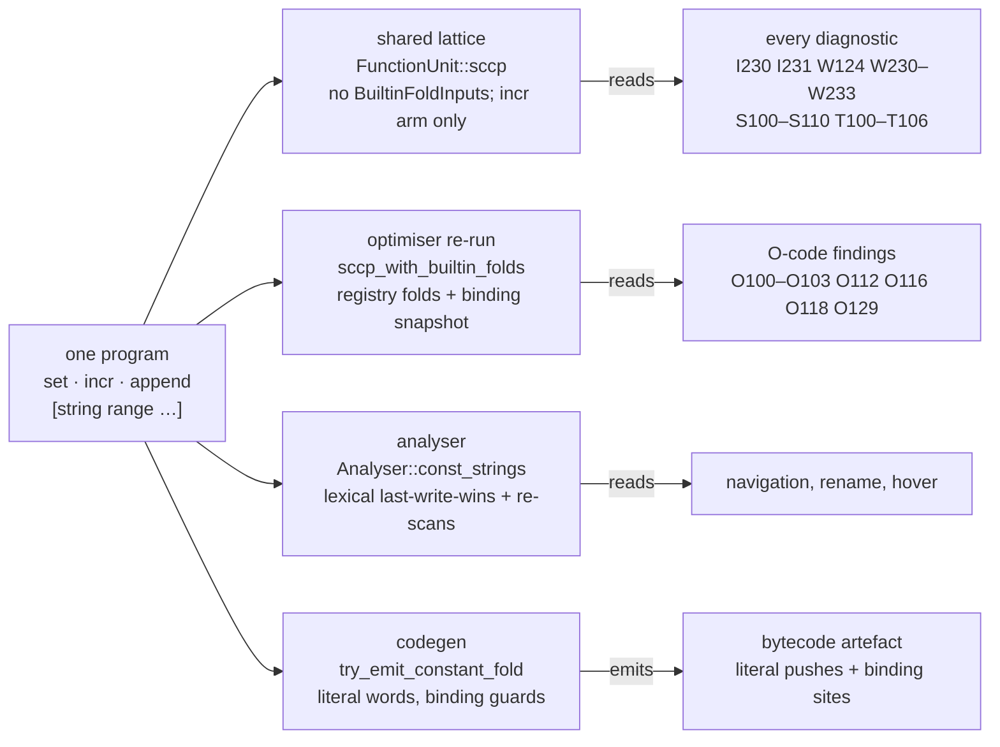

# Value transfers — the migration plan

How the consumer interface in [value-transfers.md](value-transfers.md) and
the evaluation contract in [value-evaluation.md](value-evaluation.md) reach
the tree: the inventory of hand-written command knowledge they replace, the
delivery slices with their exit criteria, what changes for every analysis,
optimisation, and diagnostic, the third-party tiers, the drift gate, and
the validation each slice owes. Read it before starting a slice, before
waiving a site in the gate, and before claiming a command is migrated.

> **Status — a proposal.** The inventories below are observations of the
> tree at one revision, not architectural invariants: a count changes when
> the tree does, and a renamed binding or a helper table can evade a
> name-based lint. Contract tests and ownership review remain necessary
> whatever the counts say.

## The inventory's revision and scope

The sweeps were read at `16ba98010505f67484a3f1c90e087539bf4919d8` and
every identifier cited on the six pages — this plan,
[value-transfers.md](value-transfers.md),
[value-evaluation.md](value-evaluation.md),
[value-transfers-examples.md](value-transfers-examples.md),
[registry-consumer-contracts.md](registry-consumer-contracts.md), and
[diagnostic-policy.md](diagnostic-policy.md) — was re-checked at the
branch's merge with `rust`
(`3b5eba8aed44b8faec026aa7fdbe79c266948711`), including the consumer
lists of the rungs in slices 8–13 and the sites those rungs retire; the counts themselves were not re-swept, so a row changes only
where a named site's owner changes. Four sweeps read each site in context
— the compiler's own passes; the analyser with lowering and CFG
construction; the diagnostic and analysis passes outside it; and every
language-server, tooling, and dialect crate — and classified
it as **dataflow** (this design owns it), **another axis** (migration debt
on a named existing registry field), **irreducible** (analyser-local
semantics documented at the call site, the sanctioned exception), or a
**shape heuristic** (a decision on source text rather than command
identity). Test modules, message text, and Tcl name grammar (`::`, `${…}`,
`{*}`) are excluded, as are sites that already dispatch through a typed
hook ID, a trait, a role, an intrinsic, a `StateTransition`, or a registry
query. Until `cargo xtask value-transfers` exists the reproduction is a
search over the listed crates for the recogniser shapes the gate names
below; the generated inventory then replaces the hand count.

## Where per-command knowledge lives today

The registry invariant ([command-registry.md](command-registry.md)) says
per-command knowledge is a `CommandSpec` fact and the compiler is a generic
consumer. On the value axis the compiler's passes are already close: a
sweep of `rust/tcl-compiler/src/` outside the analyser finds 26 live
name-keyed sites, and only the ones below touch constants, values, or
dataflow.

| Site | Shape | What it encodes |
|---|---|---|
| `sccp.rs` `try_fold_cmd_subst` | `trusted("list")`, `trusted("format")`, `cmd == "llength"`, `cmd == "string"` + `sub == "length"`, `cmd == "expr"` | each arm *is* that command's fold, run ahead of the registry engine "so single-hop results stay byte-identical" |
| `sccp.rs` `evaluate_def_with_folds` | `Statement::Incr { name, amount, .. }` | the `incr` lattice transfer: `Const(Int)` base, literal or lattice amount, `checked_add`, widen on overflow / wrong intrep / dynamic key |
| `sccp.rs` `evaluate_def_with_folds` | `matches!(command.as_str(), "foreach" \| "lmap")` | the loop-variable `ConstSet` transfer over a literal or folded list |
| `sccp.rs` `scan_defined_and_unset` | `command == "unset"` | the unbind fact the `info exists` post-pass needs |
| `optimiser/chain_fold.rs` | `"set"` / `"append"` / `"lappend"` | the O104 / O130 write-chain classifier ("the fold's per-command semantics … ARE the dispatch") |
| `optimiser/structure_elimination.rs` | `resolve_subject`, `pattern_matches` | O112's own subject resolution and arm matching for `switch` |
| `optimiser/propagation.rs` `fold_tail_statement_under_lattice` | `Statement::Incr` | "`incr` returns the value it assigned" for the implicit-return fold |
| `optimiser/elimination.rs` `assignment_safe_to_delete` | `Statement::Incr` | "the write is the whole observable effect" — `append` / `lappend` fall to `_ => false` |
| `optimiser/end_offset.rs` | `"lindex"`, `"lrange"`, `"lreplace"`, `"string index/range/replace"`, `"llength"`, `"string length"` | O128's length-position table |
| `static_loops.rs` `exec_statement` | `Statement::Incr` | a second, independent `incr` transfer for bounded `for` simulation |
| `intervals.rs` `transfer` | `Statement::Incr` | a third `incr` transfer, literal amounts only |
| `interval_bounds.rs` | `"lindex"`, `"lset"`, `"string index"`, `cmd.name() != "list"` | container-length recovery |
| `value_provenance.rs`, `script_arg.rs`, `auto_path_eval.rs` | `"list"`, `"info"`, `"file"` | three more private `[list …]` / path evaluators |
| `analyser/` | `const_strings`, `last_literal_set_value_for_var`, `infer_list_length_from_recent_set` | the analyser's own lexical constant store plus two backward source re-scans |

Three modules the same sweep found **clean** are the exemplars:
`rust/tcl-compiler/src/existence_query.rs` recognises `[info exists X]`
through `SemanticOperationId::Intrinsic(IntrinsicId::InfoExists)` and names
no command; `rust/tcl-compiler/src/const_subst.rs` folds any `[cmd …]`
through `CommandSpec::const_fold` and states "No command name is matched
here"; `rust/tcl-compiler/src/world_state_ssa.rs` renames mutable
interpreter state from registry `StateTransition` facts alone.

The three structural gaps the inventory reduces to:

1. `evaluate_def_with_folds` answers `Overdefined` for every `Statement::Call`
   that is not `foreach` / `lmap`, so no read-modify-write command other than
   `incr` has a lattice transfer.
2. The shared per-unit lattice is built without `BuiltinFoldInputs`, so every
   registry fold — 41 at the inventory revision — is invisible to every
   diagnostic.
3. The `switch` dispatch chain lowers a whole-variable subject to
   `ExprNode::Raw`, which cannot be evaluated, so a constant-subject switch
   never yields per-arm reachability.

## The slices

Each slice is independently shippable and lands with its tests, its KCS
notes for new or changed code, `make codegen` for regenerated catalogues,
and the design-doc updates it names — including the affected rows and
invariants of [pass-fact-ownership-matrix.md](pass-fact-ownership-matrix.md),
[downstream-pass-contracts.md](downstream-pass-contracts.md),
[diagnostics-integration.md](diagnostics-integration.md), and
[diagnostics-calculation.md](diagnostics-calculation.md): each new fact
gets one producer, an explicit consumer list, its context dependencies,
and what a consumer does when it is unavailable. Each slice demonstrates
the same behaviour through direct analysis, the incremental database, and
the command line; runtime parity work is a dependency only where the slice
executes that runtime.

1. **Contracts and corrections.** The two contract pages; the ledger of
   transitional compiler-owned handlers with an expiry each; the value
   ingress that preserves exact strings (no `trim`); the corrected
   derivation (`ElementsOf` and `LOOP_LIST_HEADER` derive nothing; the
   explicit abstention state exists at command, subcommand, and form
   scope); the analysis context in `FnLatticeKey`; and the SCCP dispatcher
   re-expressing the five fold arms, the `Incr` arm, the `foreach` / `lmap`
   arm, and the `unset` scan behind the interface, behaviour-preserving.
   *Exit:* every existing `evaluate_def_*` and `sccp_with_builtin_folds`
   test pins byte-identical results; `sccp.rs` matches no command name;
   the inventory shows `incr` with a derived cell-update descriptor and an
   enabled direct route, and `append` / `lappend` with the descriptor
   present and no route enabled — descriptor availability and enabled
   evaluation are separate columns.
2. **The direct vertical slice.** `string range` and `incr` over
   `ConstOps` and its admissibility adapters, preserving exact values and
   target semantics; then `append` / `lappend`. Standalone analysis and the
   memoised editor path run through the same immutable context. Stateful
   producers are kept when their results propagate; the `Statement::Incr`
   deletion predicate is not generalised; `fold_tail_statement_under_lattice`,
   `chain_fold`, `static_loops`, and `intervals` consume the resolved
   semantics. This is the first slice that evaluates over lattice inputs,
   so the correlated finite-set limit is in force from here: exactly one
   distinct SSA value among an invocation's inputs may be `Finite`, and two
   decline with `CorrelatedSets`. *Exit:* program (3) of the interface
   contract folds in every consumer; the three `incr` models agree on
   `incr x $n`, leading zeros, and overflow; `set result [incr n]` keeps
   its increment; O104 / O130 fold a non-consecutive chain; direct and
   memoised paths agree.
3. **The expression slice.** Registry-owned argument assembly over the
   shared expression engine with lazy input services and transitive binding
   evidence; the full value result; the nested-substitution policy at
   `EffectFreeOnly`; the `command` resolver in `evaluate_branch`;
   per-member evaluation of a finite-set condition. *Exit:* the `expr`
   acceptance list in the interface contract; `expr {"x"}` folds; `abs`
   rebinding declines; the finite-set condition tests pin the correlated
   limit, including the `{1 10 2 20}` and `{1 20 2 10}` mirror witnesses;
   the direct-expression and engine entry counts are reported separately.
4. **A private SpecTcl command through the same interface.** The loader,
   renderer, studio, cache inputs (target values), overlay invalidation
   (`spec_pack_key` reaching `compilation_unit`), per-evaluation state
   isolation in the host, `-native` resolution for every family, and
   `Engine::set_release`, delivered together on one small executable
   example before any catalogue migration; shipped builtins stay on the
   direct route. *Exit:* step 1 of the completion test — a rename and a
   subcommand form with different operand positions need no consumer
   edit; a workspace pack's evaluator reaches a diagnostic on the memoised
   path; a body with a global counter answers identically on every call.
5. **Destructuring and structured bodies.** Write, preserve, unbind, and
   may-write outcomes with heterogeneous per-target types and duplicate
   targets resolved to places; the regexp owner's typed precision result;
   `regexp`, `scan`, `lassign`, `binary scan`; `dict with` and `dict
   update` as structural plans with a key-binding projection; the
   template-word plan, with `subst`'s option rows declaring the kinds; W210
   consuming preserve outcomes; the existence branch fact stored once with
   its kind; O111 consuming the same fact as W100 or an explicit rule-group
   policy. *Exit:* program (2) folds and is typed as a byte array; the
   private regexp / scan prover in `dataflow.rs` is retired; the no-match
   preserve, partial `scan`, and `lassign … a a` witnesses pass; the four
   consumers read `TemplateWordPlan` and none walks a template word.
6. **Branch integration and optional rewrites.** The exact whole-variable
   `Raw` resolution; selection facts for opaque forms through
   `tcl_cmd_core::switch`; O112, the analyser's `switch_body_is_selected`,
   and `static_loops::exec_switch` consuming them; applied reachability only
   with real lowering or explicit arm blocks; arm-deletion edits only once
   their proof and source-edit contracts exist, with no code reserved
   until then. *Exit:* program (4) yields O112 and I231 on the dead arm for
   every form, and O107 on its body for the flattened form.
7. **Broader execution and runtime consumers.** The declared executable
   catalogue grows with independent oracle evidence — the iRules pure
   functions as shared cores registered into the simulator, the tcllib
   candidates as their specs move to SpecTcl; `summarise_returns` consults
   a seedless lattice so the argument-independent O103 sees computed
   returns; then package backing, intrinsic guards, the engine's WASM
   sibling, and extensions in their own changes under
   [registry-consumer-contracts.md](registry-consumer-contracts.md).
   *Exit:* every command that declares purity has a route or an explicit
   "none" with its reason in the inventory.
8. **The existence rung.** A flow-sensitive bound/unbound fact per place
   and per SSA version of the binding, owned by the solver and fed by
   storage outcomes: the entry states, the join, the absent-cell release
   rule (`safe_on_uninit`, the plan's `creates_absent`), `[info exists]`
   and `[array exists]` through the expression route's `nested` service,
   and the guard narrowing as an edge refinement in the existence domain.
   W210, W211, W213, W214, O108, O109, I230, O101, and S100 consume the
   one fact; a fast-tier request and a function over the complexity
   ceiling read `Unavailable`, which is neither bound nor unbound.
   *After:* slice 5, and before slice 6, whose branch work then has the
   existence branch fact to consume. *Exit:* `sccp.rs` recognises no
   command by spelling; `existence_constant_branches` and
   `scan_defined_and_unset` are deleted; `emit_provably_unset_w210` reads
   the fact; the release table for an absent cell, `set x 1; unset x; info
   exists x` deciding `0`, the definite W213 after a killed version, the
   two O109 refusals, and the S100 silence pass.
9. **Nested writes in expressions.** The ordered evaluation state at
   `LocalWrites`: a nested invocation whose ordered stores name only
   places the state can own is applied to the state in order, so the next
   `variable` read sees it, with its evidence merged and an error
   completion ending the evaluation with the writes so far. A nested
   outcome naming a place outside the admitted set is the `StatefulNested`
   decline. *After:* slices 3 and 5. *Exit:* the seven `expr` witnesses —
   `expr {$x + [incr x] + $x}`, `expr {0 && [incr x]}`,
   `expr {$x + [set x 10] + $x}`, the two `[incr x]` operands, the
   ternary, the quoted word, and the error path — through `tcl opt` and
   the memoised path, and `command_substitution_is_none` in
   `tcl_expr_eval.rs` flips.
10. **Completion paths.** Storage outcomes indexed by completion path:
    the prefix rule (`Error { written, … }`), the completion protocols of
    `catch` and `try`, the `Absorb` rule for loop bodies, the options
    dictionary's exact and `Unavailable` keys, and the per-path
    publication the solver already needs for the existence rung. *After:*
    slices 5, 8, and 9. *Exit:* the prefix rule holds in the default and
    the faithful-exceptions build; the nine witnesses and the `catch` code
    table pass; O109 refuses the store ahead of `catch {lassign {new
    second} a b} msg`.
11. **Predicate refinement.** `EdgeRefinement` as a fact on one CFG edge
    for one SSA version, with the block-qualified lookup `(BlockId,
    ValueKey)` consulted first by `env_from_uses`, `evaluate_branch`, and
    `evaluate_def_with_folds`, and by every other domain for the domains
    the refinement names; the per-shape table, including the numeric `==`
    rows that refine `Range` and `Type` and never `ExactValue`; no
    refinement of an externally mutable place. *After:* slices 6 and 8.
    *Exit:* the nested `if {$x eq "a"}` / `if {$x eq "b"}` program decides
    through `tcl diag` and `tcl opt`, `collect_existence_guards` is
    deleted, and the twelve witnesses, the merge that drops a refinement,
    and the traced variable that is never refined pass.
12. **Bounded-loop enumeration.** `LoopEnumeration`: ordered execution of
    an iteration plan over exact state at a loop's pre-header, with the
    iteration cap as a `Budget` decline, exact values and existence
    instead of `StaticValue`, and the exit state published on the exit
    edge only. `exec_statement` applies each statement's registry-owned
    `evaluate` and `exec_switch` consumes the `Selection` fact. *After:*
    slices 2, 3, and 6. *Exit:* `static_loops.rs` performs no arithmetic
    of its own — its `Incr` arm, `parse_literal_value`, and
    `resolve_switch_subject` are gone — the eleven witnesses fold under
    every release found on `PATH`, and `bounds_checks.rs` seeds W240–W242
    from the plan's bound and step rather than from `set v INT` text.
13. **Proc-level transfer summaries.** `TransferSummary` beside
    `ProcSummary`: parameter roles with a `Name` parameter's frame level
    and ordered outcomes, the global places a callee may write, the
    seedless `ReturnKind`, the completion domain, and the effect
    footprint, composed bottom-up with a cycle resolving to `MayBind`,
    `Any`, and a computed result. The caller's driver applies them at the
    call site, and the argument-sensitive re-run seeds `Name` parameters
    from the caller's places. *After:* slices 7 and 8. *Exit:* `bump n`
    decides through both O103 paths, `param_traits.rs` matches no command
    by name, the synthetic `<upvar-invalidate>` def is gone, and the seven
    witnesses pass.

Slices 1–7 land the two contracts' machinery, and every part of the
evaluation contract lands in one of them (§ *Where each part lands* on
that page). Slices 8–13 land the rungs the interface contract states, each
after the slices whose facts it consumes; nothing in either contract is
left unsliced. The numbering is delivery order only where the
dependencies say so — slice 8 precedes slice 6, because the existence
branch fact is what slice 6's branch integration stores once.

## Every analysis, and what changes for it

Paths are relative to `rust/tcl-compiler/src/`. "Reads the lattice" means
`SccpResult::values`; "reads reachability" means `executable_blocks` /
`executable_edges` only. `folded_types` is the proposed side map of
semantic type and shape per value, distinct from representation evidence.

| Module | Fact it produces | Constant relationship today | Under this design |
|---|---|---|---|
| `analyses.rs` | the lattice vocabulary | — | unchanged; `analyses::ConstantBranch`, `ReadBeforeSet`, `UnusedVariable` are dead duplicates and go |
| `sccp.rs` | the lattice, reachability, constant branches | the seven name-keyed sites | the transfer driver replaces `try_fold_cmd_subst`'s arms and the `Incr` / `foreach` / `unset` arms; exact ingress; `folded_types`; `evaluate_branch` gains the lazy command resolver and per-member finite-set evaluation; the branch fact records its kind; `scan_defined_and_unset` and `existence_constant_branches` are deleted for the existence rung (slice 8), `loop_summary_decision` reads the enumeration's exit state (slice 12), and the per-value map gains the `(BlockId, ValueKey)` lookup for edge refinements (slice 11) |
| `const_subst.rs` | `[cmd …]` folds through `const_fold` | the engine | becomes the driver's word-resolution, binding-validity, nesting, and escape layer for every specialisation; `ResolvedConstSubst::command_bindings` is the evidence shape the outcome carries |
| `type_infer.rs` | the type lattice | reads `values` for `lindex` indices and list literals; types `Statement::Incr` as `Int` | joins `folded_types`; stops re-splitting `Const(String)` lists; the math-function return-type table retires onto `tcl_syntax::expr::mathfunc` |
| `types.rs`, `value_shapes.rs`, `word_expr.rs` | vocabulary and word helpers | — | none |
| `intervals.rs` | per-value integer intervals | seeds from `Const(Int)` / `Const(Bool)`; its own `Incr` arm, literal amounts only | seeds from `ConstSet` too; the `Incr` arm becomes the interval domain's abstract model of the registry-described integer add (`RangeModel::IntegerAdd`); folded lengths seed tight intervals; operations with no abstract model answer top; an enumerated loop's exact exit state bypasses the loop-header widening at `MAX_ITERS` (slice 12) |
| `interval_bounds.rs` | W230–W233 findings | through `intervals`; its own container-length map and name table | container lengths come from computed `list` / `split` / `lrange` values; the name table goes |
| `native_integer_proof.rs` | native-add evidence | reads `values` directly; rejects `ConstSet` | more provable additions; accepts `ConstSet` ranges |
| `value_provenance.rs` | written constants reaching a use, with source spans | its own φ / copy walk and `[list …]` folder | reads the lattice; a computed value enters with `literal_span: None`; the `list` folder goes |
| `rendered_properties.rs` | may/must string-content flags | reads reachability | a computed constant gives exact flags; none required |
| `representation_plan.rs` | representation obligations | — | consumes representation evidence, never `TclType` alone, for byte-array values |
| `tcl_expr_eval.rs` | expression evaluation under `FoldPolicy` | the evaluator | full value result; lazy `var` / `command` / `call` services; `rand` / `srand` stay the one name check |
| `word_subst.rs` | nested `[cmd …]` lift | `"expr"` check for the lifted form | the lift feeds nested-word folding; the check moves to the `EXPR_CONCATENATES_ARGS` trait, as `optimiser/end_offset.rs` already resolves `expr` |
| `subst_nocommands.rs` | `[subst -nocommands]` evaluation | its own const map | reads the `const_map` its two callers pass — lowering's const map from `eval_subst_nocommands_body`, the factory bindings from `specialise_factories.rs` — and from slice 5 consumes the template-word plan's `reads` and `escapes` instead of scanning the template again; it is the materialisation for the commands-off case |
| `static_loops.rs` | post-loop environment for a bounded `for` | its own `StaticValue` lattice and `Incr` arm, `parse_literal_value`, and `resolve_switch_subject`; `exec_switch` ignores the mode | becomes `LoopEnumeration` (slice 12): `exec_statement` applies each statement's registry-owned `evaluate` over exact values with existence, `exec_switch` consumes the `Selection` fact, the three private helpers are gone, and the cap is a `Budget` decline that publishes nothing |
| `loops.rs` | the natural-loop forest | reads reachability | none |
| `dynamic_names.rs` | the name-blindness barrier | a gate; `template_word_is_substituted` reads only the trait, and a dynamic write or destroy blinds the whole function | every transfer still runs under it; from slice 5 it reads `dynamic && kinds.variables` and `script_regions` from the template-word plan, so `subst -novariables $t` stops blinding every read, and from slice 8 the barrier is flow-sensitive in the existence domain: a dynamic write turns every `Unbound` place `MayBound` from that statement on, a dynamic destroy every `Bound` place |
| `existence_query.rs` | `[info exists]` recognition through `IntrinsicId` | the exemplar | unchanged as a recogniser, and the existence domain's front: from slice 8 it answers through the expression route's `nested` service as a read of `FactDomain::Existence`, so the condition decides inside the fixed point and the post-pass — `existence_constant_branches`, its second run in `emit_existence_constant_branch_diagnostics`, the reachability gate in `emit_constant_branch_diagnostics`, and `drop_cross_event_existence_folds` — becomes one path |
| `var_observability.rs`, `var_refs.rs`, `var_resolve.rs`, `var_scoping.rs` | alias / trace lattice, reference scanning, place resolution | gates and helpers | unchanged; `var_scoping.rs`'s `upvar` / `namespace upvar` index refinement stays until `FrameArgLayout` carries it |
| `var_escape/` | local-versus-frame tagging for WASM | none | none; `info_subcommands.rs`'s audited allow-list is a `SubCommand` trait candidate on another axis |
| `place.rs`, `place_bridge.rs` | storage places and overlap | `Statement::Incr` read modelling | the bridge reads the resolved target places; `namespace upvar` / `trace add variable` literals move to `FrameArgLayout` / `ESTABLISHES_VARIABLE_TRACE` |
| `memory_ssa.rs`, `effect_ssa.rs`, `state_ssa.rs`, `world_state_ssa.rs` | versioned memory, effects, world state | none; already name-free | none |
| `def_use.rs` | def-use chains, `UseKind` | `VariableName` from #1934 | a cell update's read is a `VariableName` use by construction |
| `dead_stores.rs` | the Explorer's liveness view | reads reachability; excludes `Incr` | none, deliberately |
| `dataflow_graph.rs` | the Explorer's data-flow graph | renders `LatticeValue` | renders `folded_types`, decline reasons, and the loss-of-exactness evidence |
| `side_effects.rs` | effect classification | name-free | none |
| `taint.rs`, `taint_interproc.rs` | taint colours | reads reachability and φ edges; never `values`; `Incr` passthrough | a computed value is untainted only when every input was; colour flows through write outcomes as through the `Incr` arm today; a numeric type never erases taint |
| `interprocedural.rs` | `ProcSummary`, `MethodSummary` | syntactic `classify_return`; `global` / `variable` / `upvar` name sets; `upvar`'s level word parsed as `#0` / `0` | `summarise_returns` consults a seedless run under a staged fixed point; the alias name sets move to `Traits::CREATES_SCOPE_ALIAS` + `FrameArgLayout`; slice 13 adds `TransferSummary` beside `ProcSummary` — parameter roles with a `Name` parameter's `FrameLevel` and ordered outcomes, the global places a callee writes, the completion domain, and the effect footprint — composed bottom-up and invalidated with the module's bindings |
| `unit_scope.rs` | call-site seeding | literal-only, string-typed seeds | computed arguments seed under the same gates; seeds enter through the exact ingress |
| `command_binding.rs`, `alias.rs`, `realm.rs`, `registry_invocation.rs`, `dispatch_proof.rs` | binding validity, aliases, the realm, dispatch stability | name-free gates | unchanged; `realm.rs`'s `namespace import` scan is a `StateTransition::Namespace` consumer candidate |
| `object_types.rs` | object-handle provenance | reads the type lattice | benefits from `folded_types` on constructor results |
| `lambda_literal.rs`, `inline_uplevel.rs`, `inlining/` | lambda splitting, passthrough inlining, the unwired IR inliner | shape only | none, except `inlining/`'s `break` synthesis stays as is |
| `shimmer/` | S100–S103, S110 | reads `values` and reachability; `ArgTypeHint::transparent_from` | reads representation evidence so a computed `binary format` is never reported as a conversion; the `Incr` `Int` read comes from the outcome's type facts; from slice 8 S100 reads existence, so a phi merging a bound version with an unbound one is not a representation merge and `set x 1; if {$c} { unset x }; puts $x` loses its S100 and keeps its W210 |
| `path_concat.rs`, `uri_split.rs`, `regex_source.rs`, `scan_predicate.rs`, `script_arg.rs`, `auto_path_eval.rs` | W201, IRULE3103, regex source spans, `scan` no-match proof, list-built scripts, `auto_path` evaluation | four private evaluators and a `scan` conversion table | `uri_split` sees more; `script_arg` and `auto_path_eval`'s `[list]` / `file` / `info` arms become direct-route specialisations (`file join` / `dirname` / `tail` platform-conditional through the profile); `scan_predicate`'s table is `scan`'s own format grammar and stays |
| `common_aot_plan.rs`, `mixed_region_plan.rs`, `semantic_optimisation.rs` | AOT evidence and plans | reads `values` as evidence; refuses a constant without a singleton type | `folded_types` supplies the type; a computed value never authorises live intrinsic dispatch |
| `slot_allocation.rs`, `signature_scan/`, `lattice_rebase.rs`, `environment_ingress.rs` | slots, signature scan, span rebasing, dialect ingress | — | `lattice_rebase.rs` shifts any new span-carrying fact in the same change |
| `lowering/` const map | `proc $name` and body-word resolution before SSA | its own literal-only map, plus `eval_subst_nocommands_body`'s fold of a commands-off `subst` and its own template walk | the map itself is unchanged: it runs before SSA exists, records only `set var {literal}`, and nothing in the lattice replaces it; from slice 5 the `subst` fold reads the template-word plan rather than re-segmenting the `[subst …]` text and matching the head by spelling, and `specialise_factories.rs` extracts the factory template through the same plan |
| `cfg_builder/` | blocks, terminators, loop nodes | the `switch` dispatch chain and `Raw` subject; `emit_opaque_catch` and `lower_try_dispatch` make a body one call whose defs are the body's; the synthetic `<upvar-invalidate>` def | unchanged operand shape; explicit arm blocks or `while` `LoopNode`s only when a slice needs them; slice 10 gives both builds the same plan and completion protocol, with a handler's entry state the join of its throw sources' prefix states in the faithful build; slice 13 replaces `<upvar-invalidate>` with the callee's summary |

## Every optimisation, and what changes for it

Producers are under `rust/tcl-compiler/src/optimiser/` unless named. A
rewrite needs source-edit validity and behavioural equivalence — errors,
effects, binding, evaluation order, implicit results, target semantics —
and a diagnostic is never that proof.

| Code | Producer | Constants consumed today | Under this design |
|---|---|---|---|
| O100 | `propagation.rs` (five sites), `branch_folding.rs` | `sccp_constants_for`, `sccp_value_literal`, `command_mutations`, operand types; a single call site's argument is propagated into the callee's body, so `bump n` rewrites `upvar 1 $name v` to `upvar 1 n v` | fires on every new constant, per SSA version with binding validity and correct quoting; the computed-write fallback stays O100; the producer is preserved (permission 2); slice 13 makes the callee's effect a summary the caller applies instead of a body specialised to one call site |
| O101 | `branch_folding.rs`, `expr_simplify.rs`, `propagation.rs` | `constant_branches`, the constants projection, `trusts("expr")` | more branches decide; target-aware arithmetic, lazy operands, and exact transport; `is_switch_dispatch` suppression unchanged; the existence branch fact (slice 8), an enumerated loop's exit state (slice 12), and an edge refinement (slice 11) each decide more conditions, and I230 decides the same ones |
| O102 | `propagation.rs` `run_load_forwarding` | def-use chains, `UseKind::Operand`, `is_externally_mutable`, `TraceInputs`; never `values` | unchanged — a literal load is a literal load |
| O103 | `propagation.rs` two shapes | `ProcSummary`, `trusts_proc_binding`, `evaluate_proc_with_constants` | the argument-sensitive path folds string-building callees at once; the summary path after `summarise_returns` reads a lattice under the staged fixed point; slice 13's `TransferSummary` gives the re-run its `Name`-parameter seeds and the caller the callee's outcomes, so `[rec 4]` folds and `bump n` decides |
| O104, O130 | `chain_fold.rs` | none — textual and literal-only; an unrelated statement between the writes is tolerated, the chain must start at a literal `set`, and a propagated operand is not folded in the same pass | the classifier dispatches on the resolved cell update instead of three names; lattice-constant operands and a chain starting at an absent cell fold through the value at the last write; coercion, traces, errors, and the implicit result are preserved |
| O105, O106 | `rust/tcl-compiler/src/gvn.rs` | reachability | unchanged; same value is not same observable computation |
| O107 | `elimination.rs` | `executable_blocks` | more arms decide; applied reachability only, never a selection fact |
| O108 | `elimination.rs` ADCE | def-use, `assignment_safe_to_delete_with_effect`; an existence read is not a use, so the pair behind `[info exists b]` is deleted | a cell update in statement position is removable only under the totality proof of permission 3: old value proven well-formed, place proven bound, no trace; a direct-route pure command in statement position likewise; an unbind statement is never removed; from slice 8 an existence read of a version keeps its store |
| O109, O126 | `elimination.rs`, `manager.rs` coupling | def-use, twelve guards | guard 2 generalises; `collect_rmw_hidden_reads` shrinks because the read is an SSA use; slice 8 adds the existence read as a use, so the #2132 store and the `incr n` behind `[info exists n]` stay; slice 9 makes a read inside a braced `expr` a use of the version it reads; slice 10 makes a store ahead of a partial write dead only when the prefix rule proves it |
| O110 | `expr_simplify.rs` | operand types | reassociation consumes the type and target proofs; the floating-point counterexample is a fixed regression; residuals are typed, never rendered constants |
| O111 | `rust/tcl-lsp-server/src/lib.rs` `append_brace_expr_perf_hints` | none; it searches the already-lifted diagnostics for W100, so it fires only where a W100 survived presentation, and it reads `optimiser_enabled` itself | becomes a producer over the unbraced-expression fact, emitting a `Finding` at the same span for every unbraced expression, with policy deciding W100 and O111 independently — the rule [diagnostic-policy.md](diagnostic-policy.md) § *Producers that change* states, landing with slice 5 |
| O112 | `structure_elimination.rs` | its own `Env` projection; `resolve_subject`, `pattern_matches` | consumes the selection facts; the first-unfoldable-clause and `catch`-descent limits are removed |
| O113, O117, O120 | `branch_folding.rs`, `expr_simplify.rs` | operand types | benefit from `folded_types`; integer versus float and target rules stay explicit; W110 is not an edit certificate |
| O114, O119 | `pattern_recognition.rs` | all-versions `Int` typing | benefit from `folded_types`; none required |
| O115 | four sites | `trusts("expr")` | none |
| O116, O118, O129 | `propagation.rs` `try_o129_fold` | `ConstSubstCtx` over the re-run lattice | fire with lattice arguments through the declared routes; `binary format`, `regexp`, `lassign`, `scan`, `dict incr`, `lset` join O129 as results propagate, never as replacements of a writing producer; presentation gates decide what is spliced |
| O121–O123 | `tail_call.rs` | none | none |
| O124 | `unused_procs.rs` | `ProcSummary::calls`, `has_barrier` | none required; whether a call is reachable is the call-graph axis's question, answered where `ProcSummary::calls` is built and not by any value fact |
| O125 | `code_sinking.rs` | side-effect-free assignment shapes | a cell update is sinkable under the same rule as `Incr` today; optional |
| O127 | `propagation.rs` `run_store_to_load_forwarding` | def-use, memory SSA, "not SCCP-constant" | unchanged; a constant use now takes O100 |
| O128 | `end_offset.rs` | its own `lindex` / `lrange` / `lreplace` / `string …` / `llength` table | the length-position table becomes `ArgRole::Index` plus `ReturnElements` on the registry — another axis, listed as debt |
| switch-arm deletion | `structure_elimination.rs` | selection facts | no code reserved until the ordered-matching, completion, source-edit mapping, and proof contracts are implemented |

The `Optimisation` record (`code`, `message`, `span`, `replacement`,
`group`, `hint_only`) and the LSP surface — one `HINT` diagnostic per
finding with the replacement in `Diagnostic.data`, applied by
`apply_optimisations` through the `optimiseDocument` command — do not
change. The Explorer's `opt` view shows the new findings, and its `sccp`
view shows `folded_types`, decline reasons, and loss-of-exactness evidence.

## Every diagnostic, and what changes for it

The catalogue has 198 diagnostic codes (`docs/generated/diagnostic_codes.md`);
most are syntax, scope, version, dialect, or protocol facts with no
constant input. The rows below are the ones with a constant relationship;
[value-transfers-examples.md](value-transfers-examples.md) has a program
for each, with the tool's observed behaviour today.

### Codes that read the lattice today and see more

| Code | Producer | What it reads | Under this design |
|---|---|---|---|
| I230, I231 | `analyser/diagnostics/dataflow.rs` | `constant_branches` + `executable_blocks`; the existence fold re-run | every decided arm and every `switch` form through the stored branch fact and its kind; conditions with command substitutions; the existence fold runs once (slice 8); a refined edge and an enumerated loop's exit state decide more conditions (slices 11 and 12), and I230 then agrees with the optimiser on the programs where only `tcl opt` decides today |
| O100 (hint) | `compiler_checks.rs` `from_constant_branch` | every `ConstantBranch` | more branches |
| W124 | `dataflow.rs` `emit_invalid_ip_diagnostics` | every `Const(String)` in `values` | computed `format` / `string cat` / `append` results; the literal-substring anchoring with whole-statement fallback stays the model for a computed value |
| W233, W230–W232 (dynamic half) | `dataflow.rs` → `interval_bounds.rs` | `values` + reachability | tighter intervals from `incr` chains and computed lengths; the same "whole interval outside the range" rule |
| W210, W211, W213, W214, W220, H300 | `dataflow.rs` | reachability; `whole_unset_names`, `phi_can_undef`, `collect_existence_guards`, `existence_exempt`, and the private `regexp` / `scan` no-match prover | fewer false positives in dead arms; W210 consumes preserve outcomes and the existence fact instead of its private prover, and the five readings above become one `FactDomain::Existence` query (slice 8); W211 counts an existence read — `info exists`, `array exists`, an `unset`, a `DESTROYS_VARIABLE` command — as a use of the binding, which is #2132; W213 reads the same fact, so an `unset` of an `Unbound` place is definite and of a `MayBound` place is "may not exist", and the `-nocomplain` form never reports because its completion domain has no error; the guard narrowing becomes the existence domain's edge refinement and stays byte-identical in effect |
| W126 | `dataflow.rs` | the type lattice | `folded_types` |
| W123, W307, W308 | `var_command.rs`, `helpers.rs` | `Const` / `ConstSet` strings for `$cmd` dispatch and `dict with` | more resolvable dispatch heads; a computed head is `rename_safe: false` |
| S100, S101 | `shimmer/use_site.rs`, `shimmer/expr.rs`, `shimmer/commit.rs` | `values` + reachability; `is_valid_instance_of` suppresses on a known-valid constant; a phi merging a bound version with an unbound one reads as a type merge | representation evidence prevents a phantom conversion on a computed `binary format`; more suppressions on known-valid lists and dicts; from slice 8 an unbind is not a typed value, so `set x 1; if {$c} { unset x }; puts $x` loses its S100 and keeps its W210 |
| S102, S103, S110 | `shimmer/thunking.rs`, `sharing.rs`, `byte_array.rs` | reachability | S110 reads representation evidence for a byte-array value |
| T100–T106, IRULE3001–3004, W313 | `taint.rs` | reachability and φ edges; never `values` | unchanged; colour flows through write outcomes |
| IRULE3101 | `taint.rs` `find_setter_constraint_warnings` | reachability + a literal-only prefix check | a `Const(String)` subject is checked directly, removing the false positive on `set p /a; HTTP::path $p` |
| IRULE3103 | `uri_split.rs` | `values` (`Const(String)` only) | computed operands |
| IRULE1005–1008, 1201, 1202, 3102, 4002, 4004, 5002, 5004 | `irules_checks.rs` | two of the checks consult `executable_blocks`; the response-commit walk behind IRULE1201 does not, so a respond in a dead arm still commits | every check consumes applied reachability; fewer findings in dead arms |
| W201 | `path_concat.rs` via `compiler_checks.rs` | reachability, rendered properties, taints | exact flags on computed values |

### Codes that are literal-only today and would gain

| Code | Bail today | Gain |
|---|---|---|
| W121 | every `Const(String)` in the lattice, like W124 | `set m 255.0; append m .255.0; IP::addr $ip mask $m` |
| W127, W137, W141 | `value.contains('$') \|\| value.contains('[')` | a propagated or `[string tolower CONST]`-computed option value |
| W146 | `LiteralValidationDecline::NonLiteralArgument` | the decline reason is exactly "not a statically known value"; the exact value is fed through `LiteralArgumentValidator` with honest provenance, and the token is not relabelled a literal |
| W145, W147, W152 | literal option spellings | a computed option name |
| W303 | verbatim `args[idx]` in pattern collection | `set re {(a+)+$}; regexp $re $s` — the analyser already resolves that shape for highlighting and not for the ReDoS check |
| W230, W232 (syntactic half) | `has_subst` / `!is_literal_index` | `set l {a b c}; lindex $l 9` through a computed container length |
| W102 | a computed switch word makes the call unreadable, so `substitutions_performed` answers `SubstitutionKinds::ALL` and the narrowing advice names every kind | `set opt -novariables; subst $opt {hello $name}` narrows to `$var` exactly as the literal spelling does, from the template-word plan's `kinds` (slice 5) |
| W240–W242 | "intentionally shallow" literal condition text; `bounds_checks.rs` seeds from `set v INT` and `incr v ?INT?` read as text, so `set i $start` disables the check | `set n 0; while {$n} {…}` through the branch fact, and the iteration plan's bound and step in place of the text scan (slice 12) |
| W138, W200, W202 | literal format strings | a computed `format` / `binary format` template |
| IRULE4004 | `value.contains('$') \|\| value.contains('[')` | a `set x [string range CONST 0 3]` in a per-request event becomes hoistable |

### Blast radius, and what keeps each family sound

1. **O100 / O101 / O102 / O112 / O129** rewrite source; a wrong value is a
   miscompile of the suggestion. Permission 2 keeps the producer; the
   presentation gates (printable ASCII, size, `is_value_safe_bare_word`,
   `render_propagation_word`) decide what is spliced; binding evidence is
   re-proven before emission.
2. **I230 / I231 + O107 / O108:** a wrong branch decision marks live code
   unreachable, and `executable_blocks` gates taint, shimmer, W210 / W211 /
   W220, and the IRULE flow checks, so a spurious "unreachable" silently
   removes a whole family's findings for that block. Applied reachability
   requires a real CFG edge and a proven condition under binding validity;
   a declared fact that is false is the author's under ruling 3, and the
   fact's provenance stays attached so the Explorer shows which declaration
   a decision rests on.
3. **W124 / W233 / W230–W232:** a wrong `Const(String)` fabricates a finding
   at a span the user never wrote. Exact ingress and the no-fabricated-span
   rule apply.
4. **W123 / W307 / W308:** a wrong constant resolves a command to the wrong
   target, and rename keys off it. A computed head is never rename-safe.
5. **S100 / S101:** a wrong constant *suppresses* a real finding.
   Representation evidence is separate from the value.
6. **T100–T106:** taint never reads `values`, so a value cannot create a
   false negative; only an unsound `executable_edges` could drop a tainted
   φ incoming, and applied reachability is gated as in 2.

### Families with no constant input

The E-codes (syntax and recovery), W001–W004, the usage and style codes
W100–W120 not listed above, the version-gate codes W135, W136, W139, W144,
W149, and W150, the scope codes W215–W218, W250, the security codes
W300–W312 other than W303, H301, TK1001–TK1003, BIGIP6xxx, IAPP7xxx,
SSLIC1xxx, and the IRULE event and structure checks not listed above are
unaffected. They are listed so that "every diagnostic" is answered rather
than implied. The XC translation codes, the BPF frontend codes, and the
TLS report codes outside `DiagCode` have their own gate owners; a BPF
frontend rejection is never controlled by diagnostic enablement, and the
report-side TLS grade policy is a centralisation boundary of its own.

## Hand-written command knowledge across the tiers

| Tier | Dataflow | Another axis | Irreducible | Shape heuristic |
|---|---|---|---|---|
| `rust/tcl-compiler/src/sccp.rs`, `optimiser/` — the first nine rows of the table above, counted per name-keyed site; the typed `Statement::Incr` arms are not sites, and that table's `static_loops.rs`, `intervals.rs`, `interval_bounds.rs`, `[list …]`-evaluator, and `analyser/` rows count in the two rows below | 7 | 3 | — | — |
| `rust/tcl-compiler/src/analyser/`, `lowering/`, `cfg_builder/` | 28 | 151 | 24 | 41 |
| the other compiler passes (`taint.rs`, `irules_checks.rs`, `var_escape/`, `shimmer/`, `interval_bounds.rs`, …) | 17 | 107 | 20 | 19 |
| `tcl-lsp-core`, `tcl-mcp`, `tcl-cli`, `tcl-diagram`, `tcl-irules`, `tcl-irule-test`, `tcl-bigip`, `tcl-sslictcl`, `tcl-syntax` | 10 | 89 | 17 | 10 |

Four tiers are clean and serve as the reference: `tcl-lsp-db` keys its
projection and suppression policy on `DiagCode` alone; `tcl-lsp-server`'s
`lib.rs` names no Tcl command outside tests and documents that "which
commands are deprecated is registry data; there is no command-name list
here or anywhere else in the server"; `tcl-explorer` and `tcl-lexer` key on
IR node kinds and grammar bits. Inside the compiler,
`cfg_builder/global_write_info.rs`, `var_escape/walker.rs`,
`analyser/diagnostics/const_dispatch.rs`, and `analyser/dispatch.rs` are
the fully typed implementations the rest should copy.

### The dataflow sites this design owns

Sixty-two sites across the tiers evaluate a command's value by hand, and
each is a consumer of the interface once it exists:

- **Loop-bound readers.** `analyser/bounds_checks.rs` reads `set v INT`
  and `incr v ?INT?` to seed W240–W242, so `set i $start` silently
  disables the check, and slice 12's iteration plan supplies the bound and
  the step instead; `analyser/irules_event_checks.rs` decides
  `body_decrements` by substring-scanning the body for `incr`.
- **`[list …]` evaluators.** `analyser/handlers.rs` and
  `analyser/commands.rs` (body words and `[list namespace unknown …]`),
  `lowering/mod.rs` (`eval_list_literal_body`), `value_provenance.rs`,
  `interval_bounds.rs` (element count), `script_arg.rs`, and two copies in
  `taint.rs` (callback replay and command-prefix literality) each fold a
  literal `list` call independently.
- **Container harvesters.** `analyser/diagnostics/var_command.rs` harvests
  `set arr(k) …`, `array set arr {…}`, `dict set d k …`, and `dict with`
  into its own constant sets for W307 / W308; `analyser/diagnostics/helpers.rs`
  harvests `dict with` / `dict update` keys; `analyser/handlers.rs` folds a
  two-operand `dict merge` and evaluates `[interp create …]` behind a
  `set`; `interval_bounds.rs` knows `lset` preserves length.
- **Object bindings.** `analyser/commands.rs` recognises `set VAR [CLASS
  new|create …]` and factory returns by the `set` head, four times.
- **Value-copy tracking.** `analyser/param_traits.rs` tracks `set n $p` as a
  copy and invalidates it on `incr` / `append` / `lappend` — a two-command
  approximation of the transfer, which slice 13's summary `Name` outcomes
  replace.
- **Substitution folders.** `lowering/mod.rs` folds a `subst` call whose
  registry answer is exactly commands-off into the const map, beside
  `set var {literal}`; `specialise_factories.rs` extracts the same template
  through the same answer. Both read the kinds through
  `substitutions_performed` and take the final argument as the operand;
  what stays private is the template walk itself, which the template-word
  plan in the interface contract owns and slice 5 lands.
- **Path folders.** `auto_path_eval.rs` folds `file dirname` /
  `normalize` / `join` and `info script`; `tcl-lsp-core`'s
  `document_links.rs` and `package_resolver.rs` each carry a private
  `[file join …]` folder, the latter recognising only the literal
  spellings `$dir` / `${dir}`.
- **Match provers.** `analyser/diagnostics/dataflow.rs` proves a
  `regexp` / `scan` no-match statically from the exact positional form to
  drive W210, name-guarded on purpose because "the registry does not
  model" per-form value semantics — which is what preserve outcomes model.
- **Private constant environments in the tooling crates.**
  `tcl-diagram`'s `attach.rs` and `tcl-irules`'s `walker.rs` each carry a
  `set`-keyed environment to decide whether a `pool $x` argument is
  statically knowable; neither folds through `append`, `format`, `string
  map`, `lindex`, or `dict get`.
- **Literal-only editor features.** `tcl-lsp-core`'s hover
  (`literal_at_token`), inlay hints (`collect_format_string_hints`), and
  the regexp / format / clock / binary semantic-token families emit only
  over a literal word: `set fmt "%-20s %d"; format $fmt …` gets no hover,
  no `int:` label, and a flat `string` token. These are the first editor
  consumers of the lattice and `folded_types`; a computed pattern is
  explained as computed at its use, never painted at a token range it does
  not have.

### Debt on other axes, by the axis it belongs to

The other-axis rows are outside this design's scope but inside its gate,
because the same lint finds them. They are grouped by destination so the
migrations can be planned per axis rather than per file.

| Axis | Rows | Flagship sites |
|---|---|---|
| `options` (`OptionSpec::value_word_count`, `ResolvedTerminator`, `option_placement`) | ~72 | at least twenty private `--` / `-nocase` / `-encoding` / `-start` / `-nocomplain` scans; `analyser/handlers.rs`'s bare `o == "-command"` pre-scan thirty lines above the same file's correct `OptionSpec::matches` loop; `analyser/recovery.rs` knowing `-matchvar` / `-indexvar` but not `-exact` / `-glob` / `-regexp` / `-nocase` |
| `arg_roles` / `arg_role_resolver` / `assigns_variable_at` | ~55 | `rust/tcl-cli/src/commands/minimize.rs`'s `var_target_positions`, a verbatim reimplementation of the role axis for eight commands and wrong for `dict update`, `binary scan`, `regexp -inline`, `scan`, and `foreach`; the W230–W232 index family in `analyser/bounds_checks.rs`; `place_bridge.rs` and `var_scoping.rs` asking for `global` / `variable` / `trace` positions by name |
| `definition_body` / `MemberKind` | ~32 | `analyser/oo.rs`'s eleven-arm `apply_oo_subcommand` keyword switch and its snit / itcl member tables; `ir.rs`'s `MethodKind::from_str_lossy`; the `constructor` / `destructor` literals spread across ten `tcl-lsp-core` providers |
| `traits` | ~41 | `var_escape/info_subcommands.rs`'s hand-maintained `info` subcommand names, live through `var_escape/helpers.rs`, beside two consumers that already ask `INTROSPECTS_BY_NAME` / `CURRENT_FRAME_INTROSPECTION`; `unset` recognised by name in three diagnostics beside `irules_event_checks.rs`'s correct `DESTROYS_VARIABLE` query; `lowering/mod.rs`'s `WORD_DISQUALIFIERS` body-cache gate; `tcl-syntax`'s default `head == "when"` predicate |
| `substitution_resolver` / `substitutions_performed` | 3 | W102 (`analyser/diagnostics/security.rs`), the two template folders, and extract-proc's literal cut and same-frame regions (`rust/tcl-lsp-core/src/refactor/`) already ask the registry; what remains is the dynamic-name barrier in `dynamic_names.rs` and the `inner_head_performs_substitution` gate reading only the trait, and `push_substituted_commands` re-walking a braced template for the bracket regions the answer does not carry — all three are what `TemplateWordPlan`'s `dynamic`, `kinds`, and `script_regions` retire in slice 5 |
| `case_list` / clause grammar | ~30 | five independent `switch` parsers (`analyser/diagnostics/security.rs`, `analyser/recovery.rs`, `analyser/diagnostics/usage.rs`, `lowering/structured.rs`, `analyser/commands.rs`) where the segmenter's `flatten_case_list_clauses` and the registry's `CaseMatchMode` already exist; `then` / `elseif` / `else` and `on` / `trap` / `finally` walked by keyword in `lowering/structured.rs`, `signature_scan/walker.rs` (twice), `tcl-lsp-core`'s refactors, and `tcl-mcp`'s `datagroup.rs`; `TryHandler::kind` as a `String` re-matched in `executable_ir.rs` |
| `return_type` / `format_string_type` / `pattern_type` | ~12 | `type_infer.rs`'s math-function return-type table (`expr_call_type`), a duplicate of `tcl_syntax::expr::mathfunc`; `scan_predicate.rs`'s conversion classes as strings; `analyser/diagnostics/usage.rs` mapping `binary format` / `binary scan` to a format-string index by name |
| `special_vars` | ~15 | `static::` spelled in six places; `args` in fourteen; `auto_path`, `auto_index`, `$dir` |
| `events` / `profiles` / `lifecycle` | ~14 | `tcl-mcp`'s `irule_gen.rs` rebuilding `HTTP_EVENTS` / `SSL_EVENTS` / `HOT_EVENTS` and `infer_profiles` beside a `code_actions.rs` that already reads `EventRequires.implied_profiles`; `RULE_INIT` as the init phase in four diagnostics |
| `side_effects` / `world_effects` / `taint_*` | ~18 | `irules_checks.rs`'s `drop` / `reject` / `discard` and `DNS::return` sets; `tcl-mcp`'s `SECURITY_ACTIONS` / `ROUTING_ACTIONS` / `TAINTED_REFS` where every listed command already carries a `TaintColour`; `tcl-diagram`'s `is_terminal`; the sanitiser bodies `tcl-lsp-core`'s code actions inject by diagnostic code |
| `frame_effect` / `state_transitions` | ~14 | `interprocedural.rs` parsing `upvar`'s level word as `#0` / `0` where `FrameLevel` documents why that is wrong, which slice 13's `ParamRole::Name { level, … }` carries as a `FrameLevel`; `realm.rs`'s `namespace import` scan beside `alias.rs`'s typed transitions; `taint.rs` ordering `interp` before `proc` by name |
| `abbrev` / `subcommands` / `presentation` / `completion` | ~26 | `tcl-lsp-core`'s `minify.rs` carrying a second unique-prefix table for `string` / `info` / `clock` beside `formatting/keywords.rs`, which computes it from the registry; `snippets.rs`, a sixteen-template catalogue with no registry involvement; `analyser/diagnostics/widget_command.rs` treating `configure` / `cget` as universal because no widget spec models them |
| a parallel mini-registry | 1 | `rust/tcl-irules/data/irules_ref_specs.json`, the object-reference table `tcl-bigip` and `tcl-diagram` re-match by name |

### Irreducibles worth keeping

The sanctioned exception is real, and the surveys found it stated well at
about sixty sites. Three shapes recur: a *convention the script author
chooses* (`analyser/oo.rs`'s saved-`unknown` names — "the saved name is
chosen by the script author, so no registry can know it"; the tcllib
`X::import` wrapper suffix), a *question that is the consumer's own*
(`signature_scan/handlers.rs` on `auto_path`: the registry declares the
variable, but "is the package auto-load path the workspace indexer must
resolve" is the indexer's question), and *Tcl grammar* (`--`, the empty
interpreter path `{}` in `alias.rs`, the variadic `args`). Two sites are
documented as irreducible but are really dataflow — the `regexp` / `scan`
no-match proof above and `analyser/diagnostics/security.rs`'s
`switch`-specific ReDoS scan, which a `pattern_type` conditional on the
`-regexp` option absorbs — and the gate reclassifies them when the
interface lands.

### Heuristics that a constant would replace

A shape heuristic is not debt by itself, but each of these decides
something a computed value would decide exactly: `analyser/oo.rs` deciding
an unknown-handler dispatch is case-insensitive because the subject text
contains `string tolower`; `analyser/diagnostics/var_command.rs`
suppressing W307 when an array key is *spelled* like a callback slot, with
the comment that an SCCP-proven value already overrides it;
`analyser/diagnostics/dataflow.rs` choosing I230 versus I231 by sniffing
generated block-name prefixes; `compilation_unit.rs`'s `class` / `oo::` /
`snit::` substring probe, wrong once already (#797); `taint.rs` matching
the literal text `[file normalize ` on a def; `analyser/state.rs` mapping
lexer warning *English* to E-codes; `rust/tcl-lsp-server/src/lib.rs`
recovering a package name by stripping `package require ` from a quick-fix
string; and `tcl-irule-test` guessing a profile's type from its name.

### What the inventory changes in the plan

1. **The lint's scope is every analysis tier**, not `tcl-compiler` alone:
   `rust/tcl-compiler`, `rust/tcl-lsp-core`, `rust/tcl-mcp`,
   `rust/tcl-cli`, `rust/tcl-diagram`, `rust/tcl-irules`,
   `rust/tcl-irule-test`, `rust/tcl-bigip`, `rust/tcl-sslictcl`, and the
   command-shaped helpers in `rust/tcl-syntax`. The clean tiers stay clean
   by construction.
2. **A waiver names its owner and its tracked migration.**
   `// value-transfer-ok: <axis> — <reason>` distinguishes the sanctioned
   irreducible (`irreducible — the saved name is author-chosen`) from
   tracked debt (`options — pending value_word_count`), and the generated
   inventory gains a second table, *hand-written command knowledge outside
   the registry*, grouped by axis from the waivers. A waiver never makes an
   axis a permanent exception to the gate.
3. **The twelve dead sites go first.** `var_escape/handlers.rs` and the
   test-only half of `var_escape/cfg_propagation/handlers.rs` are already
   superseded by the typed path and are deleted, not migrated.
4. **The editor consumers land with slice 5**, with the analyser's
   literal-only diagnostics: hover, inlay hints, semantic tokens, and
   document links read `folded_types` and the lattice, which is what makes
   a workspace pack's evaluator *visible* rather than merely correct.

## Third-party commands

At the inventory revision the registry described about 2,200 commands
across its packs; 16 command modules carried a fold, all in the core
`tcl` pack. Counting
a module "pure-ish" when it declares `pure: true`, `Traits::PURE`,
`CSE_CANDIDATE`, or `ReferentiallyTransparent`:

| Pack | Modules | Pure-ish | With a fold |
|---|---|---|---|
| `tcl` | 164 | 52 | 16 |
| `tcllib` | 244 | 120 | 0 |
| `irules` | 1017 | 63 | 0 |
| `stdlib` | 247 | 23 | 0 |
| `tk` | 65 | 20 | 0 |
| `expect` | 36 | 1 | 0 |
| EDA (`specs/*.tclspec`) | 346 commands | — | 0 |
| `bpf`, `iapps`, `itcl`, `argparse`, `sslictcl`, `ticklecharts` | 97 | 0 | 0 |

Three tiers reach them, and a pack author picks by where the
implementation lives. None of them is selected by purity alone.

**Tier 1 — the direct route.** For a command whose runtime handler already
has a Rust core the registry can reach (`tcl-cmd-core`, `tcl-regex`,
`tcl-syntax`), the evaluator *is* the core over `ConstOps` and the
differential test proves it: the `binary` family, `regexp`, `lassign`,
`dict incr` / `append` / `lappend` / `set` / `unset`, `lset`, and
`file join` / `dirname` / `tail` / `extension` / `rootname` / `split`
(platform-conditional through the profile). For iRules the same tier
covers the pure functions, which have **no** runtime handler in
`runtime/rust` or `tcl-vm` — the only executable iRules surface is the test
harness's Tcl simulator (`rust/tcl-irule-test/tcl/`), whose
registry-generated stubs return the empty string for them and are not
evaluators — and which should be written once as cores under the Family-B
rule and registered into the simulator as host commands: `b64encode` /
`b64decode` (the base64 core in `tcl_cmd_core::binary` exists), `crc32`,
`md5`, `sha1`, `sha256`, `sha384`, `sha512` (a digest core shared with the
runtimes), `htonl` / `htons` / `ntohl` / `ntohs`, `findstr`, `getfield`,
`substr`, `domain`, `URI::basename` / `path` / `query` / `host` / `port` /
`protocol` / `decode` / `encode` / `escape` / `compare`, and `IP::addr A
equals B` with literal operands. These matter in `RULE_INIT` bodies and for
literal arguments; a `switch -glob [HTTP::uri]` never evaluates because
`HTTP::uri` reads versioned world state, and that is the correct answer.
`b64encode`'s spec today declares only a `Global`-side read effect and no
purity — the inventory makes such under-declared specs visible.

**Tier 2 — a declared implementation.** For a command implemented in Tcl,
or one whose pack is already SpecTcl, the author declares the
implementation route: a body that *calls the real command* inside the
bounded engine, with its inputs, dependencies, and budget; a pack the
project ships proves the body against the real command through the
`tclsh` differential, and a workspace author's declaration is
authoritative as loaded (ruling 3). The EDA packs are already
`.tclspec`, so a vendor helper that is pure (`get_property` is not; a
string-formatting utility is) is authorable; most of what EDA scripts gain is the transfer on `lappend
opts …` chains and `switch $tool {…}` on a constant, which needs no pack
change, and vendor iteration follows its own declared protocol. tcllib's
Rust specs are the biggest candidate set once they move to SpecTcl:
`base32`, `ip::normalize` / `prefix` / `mask` / `equal` / `version` /
`type` / `contract` / `collapse`, `uri::canonicalize` / `isrelative`,
`textutil::*`, `html::html_entities`, `json::json2dict` / `list2json`,
`csv::split` / `join`, `struct::list`, `struct::set`,
`math::statistics::{mean,median,min,max,…}`, `mime::*` decoders,
`fileutil::relative` / `lexnormalize` / `stripn`, `otp`, `ripemd`, `md4`,
`md5crypt`. Until a route is declared they are typed pure with no route,
and the inventory says so per command; the implementation reaches the
engine through the pinned provisioning path, never by loading a workspace
package because a file was opened.

**Tier 3 — a user proc, through the interprocedural path.** A private proc
needs no spec: the argument-sensitive O103 path re-runs SCCP on the callee
under the call's constants, so every specialisation the callee's body uses
evaluates through it (`proc pad {s} {append s "!!"; return $s}` folds
`[pad hi]` to `hi!!` once `append` has a route). The interface contract's
*transfer summary* (slice 13) — a `Name` parameter's ordered outcomes for
a proc whose body is `upvar 1 $name v; lappend v …` — lets callers apply
it without re-running the callee, and is what the `spec-author` inference
proposes as a declared implementation when the library is packaged.

What no tier reaches, by rule: anything reading versioned world state or
volatile sources (`clock`, `pid`, `RESOLV::lookup`, `class match` on a data
group, `table`, `winfo`, `font measure`, every `HTTP::` / `TCP::` / `SSL::`
reader, `AES::*` with generated keys), anything whose binding is suspect,
and anything a `Volatile` `result_stability` names. `static::` variables
are cross-event state and escape.

## The drift gate and the generated inventory

One `cargo xtask value-transfers` command, in the `make xtask-check`
family, with three parts in the shape of its neighbours:

1. **A source lint**, after `number-drift` and `segmentation-drift`: a Tcl
   command or subcommand name used to *recognise an invocation* — as the
   operand of `==` / `!=` / `matches!` on a `command`, `canonical_command`,
   `cmd`, `head`, or `sub` binding, as a `match` arm on such a binding, or
   as a `&str` constant compared against one — plus a `match` arm on a
   command-specific ID (`Native(…)`, a hook variant whose handler
   implements one command's binding rules), under `rust/tcl-compiler/src/`
   and the analysis and language-server crates named above, outside the
   registry-dispatch owners. A reviewed site carries
   `// value-transfer-ok: <axis> — <reason>`; the reason names the axis the
   fact belongs to, or states why it is irreducible. The `rand` / `srand`
   check in the expression evaluator, `scan_predicate.rs`'s conversion
   table, and the inliner's synthesised `break` are the expected waivers.
   The lint is a warning mechanism: a renamed local binding, a helper
   table, or a command-specific hook variant can evade it, so the
   contract tests and the ownership review are the gate's other half. It
   is also what measures four of the exit criteria above — `sccp.rs`
   recognising no command by spelling (slice 8), `static_loops.rs`
   performing no arithmetic of its own (slice 12), `param_traits.rs`
   matching no command by name (slice 13), and no consumer walking a
   template word (slice 5) — so each of those slices removes waivers
   rather than adding them.
2. **A registry enumeration**, after `callback-inventory`: every command,
   subcommand, and form is resolved through the invocation resolver with a
   representative argument shape, and the result is written to
   `docs/generated/value-transfers.md` — pack, command, the declared
   semantics (declared, derived, inherited, or declined), the evaluator
   route (direct, expression, declared implementation, or none) with its
   origin (native, `.tclspec` body), the target roles, and a *gap* column
   for a command that declares `VarWrite` roles, `READS_BEFORE_WRITE`,
   `pure`, or `ReferentiallyTransparent` and has no route. The `append`,
   `lappend`, `dict incr` gap the issue names is a row in that file until
   slice 2 closes it, and the pure-ish third-party commands are rows too.
   `--check` fails on drift, on an unclassified `VarWrite` command with no
   semantics and no waiver, and on a stale waiver.
3. **A pinned-set test**, after `rust/tcl-registry/tests/analyser_hooks.rs`:
   the set of specs carrying each route, swept over every loadable dialect
   and the shipped `.tclspec` packs, so a route cannot appear, vanish, or
   move without the test changing beside it.

The owner-resolution manifest in
[shared-utility-contracts-rust.md](../contracts/shared-utility-contracts-rust.md)
gains a row — surface *constant evaluation and value transfers*, owner
`tcl-registry` with `tcl-compiler`'s driver as the engine, gate
`xtask-value-transfers` — so `owner-resolution` proves the pages' claims
resolve to live code and a registered gate. The Explorer's `sccp` view and
`tcl explore --show sccp` render each statement's route and decline
reason, which keeps the generated inventory and what a contributor sees in
the tool the same artefact.

## Validation

Independent Tcl oracles establish semantics; repository contract tests
establish ownership, resolution, caching, and consumers. A
registry-as-oracle sweep cannot prove the registry's own evaluator correct,
and a direct-core versus runtime-core comparison cannot detect a shared
defect; shared-implementation tests still catch adapter, version, and
materialisation differences. Each test run records the oracle release and
platform; the oldest relevant release is tested for each supported
behaviour; seeded exploration stays in the manual exhaustive tier and
fixed witnesses run in ordinary CI.

| Area | Required fixed-input evidence |
|---|---|
| Ownership | a new spelling and a subcommand fit the existing interface without changing consumers; private SpecTcl and native declarations behave alike |
| Templates | the kinds a call runs from proven switch operands, including a `ConstSet` of switches and a computed switch answering every kind; a braced template's reads, script regions, and escapes against a dynamic one; the 9.1 positive family, the two families mixed, and a profile spanning 9.1 declining as `ReleaseAmbiguous`; the commands-off materialisation and the factory child it creates |
| Summaries | a `Name` parameter through `upvar` writing, unbinding, and composing through two callees; a global write; a recursive callee under the argument-sensitive re-run; a cycle that does not converge; a `rename` in the module invalidating every summary |
| Values | whitespace, NUL, and backslash preservation; noncanonical integer strings; Unicode target differences; binary round trips; bignum promotion and cancellation |
| Storage | missing, unknown, and existing cells; partial `scan`; `regexp` no-match; repeated targets; array and base overlap; traced and escaping variables |
| Existence | the absent-cell release table (`incr fresh` under 8.4 against 8.5 onwards, `append` and `lappend` in every release); `set x 1; unset x; info exists x`; a parameter and a never-assigned local; `unset -nocomplain`; the `unset p nosuch q` prefix; a scope alias and a cross-event variable entering `MayBound`; `Unavailable` at the fast tier, which is neither bound nor unbound; an existence read keeping its store |
| Completion paths | the prefix rule in both CFG builds (`lassign` with an array target, partial `scan`, `regexp` no-match, `unset` with a missing name, an error in an argument word); the `catch` code table and the options dictionary's exact and `Unavailable` keys; `try` handlers and `finally` on every path; `lassign` from 8.5 and `try` from 8.6 |
| Expressions | lazy branches; quoted versus braced arguments; multiple arguments; nested commands; rebound math functions; unknown external inputs; errors; the ordered evaluation state's nested writes (`expr {$x + [incr x] + $x}`, `expr {0 && [incr x]}`, `expr {$x + [set x 10] + $x}`), an error inside the expression keeping the writes so far, and a nested write to a place the state cannot own declining as `StatefulNested` |
| Regexp | our engine through the shared plumbing; capture and index semantics; no-match preservation; `-all` and zero-length progress; flags; malformed patterns; resource declines |
| Rewrites | stateful producer retained; failing dead write retained; implicit return retained; effect ordering and trace behaviour preserved |
| Analysis | solver join order; loop convergence; finite-set correlations, including the `{1 10 2 20}` and `{1 20 2 10}` mirror witnesses and `expr {$a * $a}` staying correlated; per-target types and provenance joins; summary recursion; a bounded loop's exit state against its in-loop widening, the iteration cap publishing nothing, `break`, `continue`, an error path, and a zero-iteration `foreach` leaving its binders unbound |
| Incrementality | overlay-only edit; body edit; rename in another proc; target change; trace installation; pack reload; shifted spans; worker migration |
| Execution | persistent-state attempts; undeclared inputs; absent implementations; budget and cancellation; expensive direct cores; host unavailable or quarantined |
| Branches | ordered patterns; final default; fall-through bodies; regexp captures and errors; finite subject sets; opaque versus lowered representations; predicate refinement per shape — `eq`, a non-numeric and a numeric `==`, `ne`, `in` and `ni` from 8.5, `string is`, `!`, `&&`, `\|\|`, a `switch` arm and a `-` chain, `-nocase` from 8.5, `-glob` prefixes — with a merge dropping the refinement and an externally mutable place never refined |
| Diagnostic separation | disable a rule or the optimiser presentation without changing semantic facts; W100 / O111 independence or explicit group policy; no private regexp or scan evaluator in W210 |
| Diagnostic integration | fast and deep availability; workspace refinement; intentional code overlap; suppression and severity parity; relative-span rebasing and stale-edit rejection |
| Consumer parity and cost | direct and memoised fact and finding equivalence under one context; lightweight tokens and symbols never trigger evaluation |
| Partial knowledge | per-version constant loss and recovery with reasons; bounded residuals and shape facts; closed-subtree folding; type- and target-guarded regrouping; the floating-point counterexample |
| Full fact integration | existing dynamic return hooks keep their intrep and unknown semantics; type, taint, and range facts survive an evaluation decline; graph changes rebuild SSA rather than mutate it inside a hook |
| Vendor iteration | a new pack loop spelling; an opaque list-looking handle; typed unknown yields; zero and multiple iterations; completion; vendor-world invalidation without consumer name cases |
| BPF | the Tcl / BPF division difference; the literal loop-bound contract; pointer and map provenance; dominating packet guards; stack and capability checks; source mapping after unrolling |
| Catalogue completeness | every diagnostic and optimisation code with a constant relationship has an owner and a positive, negative, and unknown case; independent display; the XC, BPF, and TLS families have explicit gate owners |

Performance acceptance compares the unchanged tree, direct-core
evaluation, expression evaluation, and declared execution on the same
workloads, per the evaluation contract's budget section.

## File-path anchors

- `rust/tcl-compiler/src/sccp.rs` — `try_fold_cmd_subst`, `evaluate_def_with_folds`, `scan_defined_and_unset`, `evaluate_branch`, `existence_constant_branches`
- `rust/tcl-compiler/src/optimiser/propagation.rs`, `branch_folding.rs`, `structure_elimination.rs`, `elimination.rs`, `chain_fold.rs`, `end_offset.rs`, `manager.rs` — the consumers
- `rust/tcl-compiler/src/static_loops.rs`, `intervals.rs`, `interval_bounds.rs`, `type_infer.rs`, `unit_scope.rs`, `interprocedural.rs` — the analyses with private `incr` or literal-only models
- `rust/tcl-compiler/src/analyser/handlers.rs`, `commands.rs`, `bounds_checks.rs`, `irules_event_checks.rs`, `param_traits.rs`, `diagnostics/dataflow.rs`, `diagnostics/var_command.rs`, `diagnostics/helpers.rs` — the analyser's dataflow sites
- `rust/tcl-compiler/src/existence_query.rs`, `const_subst.rs`, `world_state_ssa.rs` — the clean exemplars
- `rust/tcl-compiler/src/subst_nocommands.rs`, `specialise_factories.rs`, `dynamic_names.rs`, `lowering/mod.rs`, `rust/tcl-lsp-core/src/refactor/` (`extract_proc.rs`, `mod.rs`) — the template-word consumers
- `rust/tcl-compiler/src/cfg_builder/mod.rs` (`emit_opaque_catch`, `lower_try_dispatch`, the `<upvar-invalidate>` def) and `cfg_builder/cfg_lower.rs` (`push_try_handler_exception_edges`) — the default and the faithful-exceptions body builds
- `rust/tcl-lsp-core/src/` (`document_links.rs`, `package_resolver.rs`, hover, inlay hints, semantic tokens), `rust/tcl-diagram/src/attach.rs`, `rust/tcl-irules/src/walker.rs` — the tooling-tier dataflow sites
- `rust/xtask/src/callback_inventory.rs`, `number_drift.rs`, `owner_resolution.rs` — the gate shapes to copy
- `rust/tcl-irule-test/tcl/command_mocks.tcl`, `_mock_stubs.tcl`, `rust/xtask/src/gen_irule_test_data.rs` — the simulator's command backing
- `docs/generated/diagnostic_codes.md`, `docs/generated/optimisation_codes.md` — the catalogues the tables above index

## Test anchors

- `rust/tcl-compiler/src/sccp.rs` — the `evaluate_def_*` tests, slice 1's byte-identity gate
- `rust/tcl-compiler/src/optimiser/propagation.rs` — `o103_folds_implicit_return_proc_cmd_subst`, `o103_folds_arg_sensitive_passthrough_cmd_subst`
- `rust/tcl-compiler/src/optimiser/branch_folding.rs` — `switch_dispatch_branches_are_skipped`
- `rust/tcl-compiler/src/sccp.rs` — `sccp_folds_post_loop_branch_via_static_summary` and the `existence_fold_abstains_*` tests, the slice 8 and 12 baselines
- `rust/tcl-compiler/src/analyser/diagnostics/tests.rs` — the `info_exists_*`, `emit_cfg_ssa_diagnostics_w210_*`, `w213_*`, and `w102_*` tests
- `rust/tcl-registry/tests/differential_fold.rs`, `analyser_hooks.rs` — the oracle and the pinned-set shape
- `rust/tcl-spec-hooks/tests/const_fold_e2e.rs`, `rust/tcl-spectcl/tests/spec_corpus.rs` — O129 from a pack body; every shipped pack through the host
- `rust/tcl-spec-studio/tests/spectcl_roundtrip.rs` — the four-surface round trip

## Related docs

- [value-transfers.md](value-transfers.md), [value-evaluation.md](value-evaluation.md) — the two contracts this plan lands
- [value-transfers-examples.md](value-transfers-examples.md) — one program per code in the tables above, with today's observed behaviour and the declarations in Rust and `.tclspec`
- [registry-consumer-contracts.md](registry-consumer-contracts.md) — the other axes, and the runtime, package, and extension work they own
- [pass-fact-ownership-matrix.md](pass-fact-ownership-matrix.md), [downstream-pass-contracts.md](downstream-pass-contracts.md), [diagnostics-integration.md](diagnostics-integration.md), [diagnostics-calculation.md](diagnostics-calculation.md) — updated with each slice
- [sccp-core-analyses.md](sccp-core-analyses.md), [constant-folding-type-inference.md](constant-folding-type-inference.md), [optimisation-passes.md](optimisation-passes.md) — the passes the tables describe
- [command-registry.md](command-registry.md) — the registry invariant
- [../contracts/shared-utility-contracts-rust.md](../contracts/shared-utility-contracts-rust.md) — the owner manifest
- [../contracts/registry-contract-tests.md](../contracts/registry-contract-tests.md), [../contracts/differential-fuzzing.md](../contracts/differential-fuzzing.md), [../contracts/test-tiers-and-ci-gates.md](../contracts/test-tiers-and-ci-gates.md) — the test shapes and tiers
- [compiler design index](README.md), [design docs index](../README.md)
