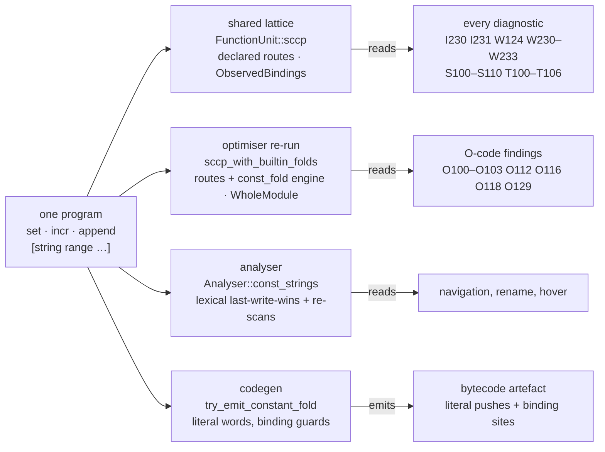

# Value transfers — the command-knowledge inventory

How the consumer interface in [value-transfers.md](value-transfers.md) and
the evaluation contract in [value-evaluation.md](value-evaluation.md) sit in
the tree: the inventory of command knowledge the registry owns and what
remains elsewhere, what each analysis, optimisation, and diagnostic reads,
the third-party tiers, the drift gate and its ledger, and the validation
matrix. Read it before waiving a site in the gate, and before claiming
that the registry owns a command's knowledge.

## How the inventory is read

A *site* is a place outside the registry that recognises a Tcl command or
subcommand by its spelling. Four sweeps read each site in context — the
compiler's own passes; the analyser with lowering and CFG construction; the
diagnostic and analysis passes outside it; and every language-server,
tooling, and dialect crate — and classify it as **dataflow** (the
value-transfer interface owns it), **another axis** (debt on a named
registry field), **irreducible** (analyser-local semantics documented at the
call site, the sanctioned exception), or a **shape heuristic** (a decision
on source text rather than command identity). Test modules, message text,
and Tcl name grammar (`::`, `${…}`, `{*}`) are excluded, as are sites that
dispatch through a typed hook ID, a trait, a role, an intrinsic, a
`StateTransition`, or a registry query.

Every count on this page is a sweep of this tree. The per-file site counts
are the gate's own (`RATCHET` in `rust/xtask/src/value_transfers.rs`,
§ *The ratchet over unreviewed files*); the per-command rows are
`docs/generated/value-transfers.md`, which `cargo xtask value-transfers`
writes; the pack and catalogue counts are the greps their tables state.
The classification is a reading, not a lint: a renamed binding or a helper
table can evade a name-based scan, so the contract tests and the ownership
review stay necessary whatever a count says.

## Where per-command knowledge lives

The registry invariant ([command-registry.md](command-registry.md)) says
per-command knowledge is a `CommandSpec` fact and the compiler is a generic
consumer. On the value axis the compiler's passes ask the registry; the
table lists every pass that touches constants, values, or dataflow and
what it reads.

| Site | What it reads |
|---|---|
| `sccp.rs` `evaluate_defs_under` | every `Statement::Call` through the driver's `evaluate_call`, an `ExprEval` through `evaluate_expr_eval`, and the typed `Incr` node through `evaluate_incr` — the registry's derived cell update over the invocation view the node projects to; no command is recognised by its spelling |
| `value_transfer.rs` `evaluate_call` | a `foreach` / `lmap` header's per-element `ConstSet` transfer from the iteration plan the explicit declaration answers (`PlanAnswer::Iterate`), one of the handlers § *Compiler-owned handlers* lists |
| `existence_query.rs`, `sccp.rs` | `[info exists X]` through `SemanticOperationId::Intrinsic(IntrinsicId::InfoExists)`, answered inside the fixed point as a read of `FactDomain::Existence` (`SccpResult::existence_at`) |
| `optimiser/chain_fold.rs` | the O104 / O130 write-chain classifier: the resolved cell update, gated on the observed binding of the statement's own head |
| `optimiser/structure_elimination.rs` | O112: the solver's selection facts; no private subject resolution or arm matching |
| `optimiser/elimination.rs` `assignment_safe_to_delete` | a dead `incr` is removable only when it cannot raise: a literal integer amount, a place that holds an integer wherever it is bound, and a place bound where the statement reads it unless every release the profile spans creates the absent cell |
| `optimiser/end_offset.rs` | O128's own length-position table for `lindex`, `lrange`, `lreplace`, `string index` / `range` / `replace`, `llength`, and `string length` — `arg_roles` debt, pinned in the ratchet |
| `static_loops.rs` | `LoopEnumeration` runs an `incr` and every command through the route its head resolves to (`exec_command`), with no arithmetic of its own |
| `intervals.rs` `transfer` | the `Incr` node as the registry-described integer add (`RangeModel::IntegerAdd`) |
| `interval_bounds.rs` | the dynamic halves of W230–W232: container lengths from its own map — a literal list, a `[list …]` element count, `lset` preserving length |
| `value_provenance.rs` | its own φ / copy walk and `[list …]` element count |
| `script_arg.rs` | a `[list …]` script through `Traits::BUILDS_COMMAND_PREFIX` |
| `auto_path_eval.rs` | `file` subcommands on the registry's path route where every platform reads the name alike; `info script`, and the host's `dirname`, `normalize`, and `join` readings the route declines, waived as irreducible |
| `analyser/` | `const_strings`, `last_literal_set_value_for_var`, `infer_list_length_from_recent_set`: the analyser's own lexical constant store and two backward source re-scans |

Three modules are the exemplars:
`rust/tcl-compiler/src/existence_query.rs` recognises `[info exists X]`
through `SemanticOperationId::Intrinsic(IntrinsicId::InfoExists)` and names
no command; `rust/tcl-compiler/src/const_subst.rs` folds any `[cmd …]`
through `CommandSpec::const_fold` and states "No command name is matched
here"; `rust/tcl-compiler/src/world_state_ssa.rs` renames mutable
interpreter state from registry `StateTransition` facts alone.

```mermaid
flowchart LR
    P["one program<br/>set · incr · append<br/>[string range …]"]
    P --> L["shared lattice<br/>FunctionUnit::sccp<br/>declared routes · ObservedBindings"]
    P --> O["optimiser re-run<br/>sccp_with_builtin_folds<br/>routes + const_fold engine · WholeModule"]
    P --> A["analyser<br/>Analyser::const_strings<br/>lexical last-write-wins + re-scans"]
    P --> C["codegen<br/>try_emit_constant_fold<br/>literal words, binding guards"]
    L -->|reads| D["every diagnostic<br/>I230 I231 W124 W230–W233<br/>S100–S110 T100–T106"]
    O -->|reads| F["O-code findings<br/>O100–O103 O112 O116 O118 O129"]
    A -->|reads| N["navigation, rename, hover"]
    C -->|emits| B["bytecode artefact<br/>literal pushes + binding sites"]
```

The shared per-unit lattice carries the command trust and no registry
engine (`BuiltinFoldInputs { registry_engine: false, trust:
ObservedBindings, .. }` in `compilation_unit.rs`): every declared route
folds there, so every diagnostic reads the routes' values, while the
registry's `const_fold` engine runs only in the optimiser's re-run
(`registry_engine: true` in `optimiser/propagation.rs`). Every call has a
transfer — the route its head resolves to, or a decline with its reason —
and the solver decides a flattened `switch`'s dispatch chain and states one
selection record per opaque `switch`, so a constant subject decides each
arm's reachability.

## What each analysis reads

Paths are relative to `rust/tcl-compiler/src/`. "Reads the lattice" means
`SccpResult::values`; "reads reachability" means `executable_blocks` /
`executable_edges` only. `folded_types` (`SccpResult::folded_types`) is the
side map of semantic type and shape per value, distinct from
representation evidence.

| Module | Fact it produces | What it reads |
|---|---|---|
| `analyses.rs` | the lattice vocabulary | — |
| `sccp.rs` | the lattice, reachability, constant branches | the value-transfer driver for every call, expression and `Incr` node, with exact ingress and `folded_types`; `evaluate_branch` resolves a nested command lazily, evaluates a finite set member by member, and reads a whole-variable `Raw` operand; each branch fact records its kind, and the solver states one selection record per opaque `switch`; the existence domain decides `info exists` and unbinds inside the fixed point; each loop whose start state the solver proves runs to its exit, and what the loop leaves is stated as exact-value edge refinements on its exit edges, which a second run reads (`enumerate_loops`, `SccpResult::loop_enumerations`); an opaque `catch` body's writes take what the body leaves (`catch_body_answer`); the per-value map answers per `(BlockId, ValueKey)` for an edge refinement — the existence domain's (`SccpResult::existence_at`) and the value domains' (the solver narrows a block's statements and terminator by the exact values and finite sets in force there, `RefinementFlow`, `SccpResult::value_at`); a statement's embedded writes are the definitions of its synthetic call, evaluated once with the host under `LocalWrites` (`LatticeDriver::evaluate_embedded`); values and existence are published per completion path — a statement that certainly raises where a handler is thrown to defines what its stores that ran left (`DefValues::Raised`, `BlockExit`), a region entry opens only where the body's first command can fail before it stores, and a flattened `catch` is evaluated where its region ends |
| `const_subst.rs` | `[cmd …]` folds through `const_fold` | the registry `const_fold` engine the optimiser's re-run turns on; `ResolvedConstSubst::command_bindings` is the evidence shape an outcome carries |
| `type_infer.rs` | the type lattice | `values` for `lindex` indices and list literals; types `Statement::Incr` as `Int`; joins `folded_types` rather than re-splitting a `Const(String)` list; `expr_call_type` reads a math function's type from `tcl_syntax`'s `MathFuncSpec::result_class`; a type refinement in force at a block types the version it names there (`type_refined_statements`: an integer in the arm of `string is integer -strict $x`, a number in that of `$x == 1`), and the shimmer use checks read it per block (`types_in_force`) |
| `types.rs`, `value_shapes.rs`, `word_expr.rs` | vocabulary and word helpers | — |
| `intervals.rs` | per-value integer intervals | seeds from `Const(Int)`, `Const(Bool)` and a `ConstSet`; the `Incr` transfer is the interval domain's model of the registry-described integer add (`RangeModel::IntegerAdd`), a `$var` amount contributing its interval; a use's guard narrowing is the range refinements in force at its block (`refine_interval`), the bound read by the condition's own transfer under the target's grammar, for a version the type lattice or a `string is integer -strict` refinement proves an integer; an integer an enumerated loop's exit state holds is the version's interval where it is in force, past the loop header's widening at `MAX_ITERS` |
| `interval_bounds.rs` | W233 and the dynamic halves of W230–W232 | `intervals`, and its own container-length map: a literal list, a `[list …]` element count, `lset` preserving length |
| `native_integer_proof.rs` | native-add evidence | `values` directly; rejects `ConstSet` |
| `value_provenance.rs` | written constants reaching a use, with source spans | its own φ / copy walk and `[list …]` element count |
| `rendered_properties.rs` | may/must string-content flags | reachability |
| `representation_plan.rs` | representation obligations | — |
| `tcl_expr_eval.rs` | expression evaluation under `FoldPolicy` | the evaluator: the full value result, lazy `var` / `command` / `call` services over the analysis inputs (`ExprServices`, `pub(crate)`), `rand` / `srand` the one name check; `var` reads the ordered state's writes before the inputs, and `command` ends the evaluation at a nested outcome that did not complete normally |
| `word_subst.rs` | nested `[cmd …]` lift | feeds nested-word folding; a lifted call is `expr` by the registry's `EXPR_CONCATENATES_ARGS` trait, not the spelling, as `optimiser/end_offset.rs` resolves it |
| `subst_nocommands.rs` | `[subst -nocommands]` evaluation | the `const_map` its two callers pass — lowering's const map from `eval_subst_nocommands_body`, the factory bindings from `specialise_factories.rs` — and the template-word plan's `reads` and `escapes`; it is the materialisation for the commands-off case |
| `static_loops.rs` | the state a bounded `for`, `while` or `foreach` leaves, and an opaque `catch` body's | `LoopEnumeration` (`enumerate_loop`, `enumerate_script`) runs each statement through the registry's routes over exact values and existence, a `switch` through its own `Selection` transfer, under the iteration plan's completion protocol, the cap a `Budget(Iterations)` decline that publishes nothing; `summarise_for_statement` and `summarise_static_for` answer a `for` loop's post-loop constants from the same run, a name the loop writes that their environment does not hold a scalar of unknown value |
| `loops.rs` | the natural-loop forest | reachability |
| `dynamic_names.rs` | the name-blindness barrier | the call's template-word plan for a template-expanding command, so `subst -novariables $t` does not blind every read; a dynamic write or destroy blinds the whole function, and in the existence domain a barrier leaves every place may-bound from that statement on |
| `existence_query.rs` | `[info exists]` recognition through `IntrinsicId` | the existence domain's front: it answers through the expression route's `nested` service as a read of `FactDomain::Existence`, so the condition decides inside the fixed point |
| `var_observability.rs`, `var_refs.rs`, `var_resolve.rs`, `var_scoping.rs` | alias / trace lattice, reference scanning, place resolution | gates and helpers; `var_scoping.rs` refines `upvar` / `namespace upvar` by argument index itself |
| `var_escape/` | local-versus-frame tagging for WASM | none; `info_subcommands.rs`'s audited allow-list is a `SubCommand` trait candidate on another axis |
| `place.rs`, `place_bridge.rs` | storage places and overlap | `Statement::Incr` read modelling; `place_bridge.rs` asks for `namespace upvar` positions by name (`arg_roles` debt) |
| `memory_ssa.rs`, `effect_ssa.rs`, `state_ssa.rs`, `world_state_ssa.rs` | versioned memory, effects, world state | none; name-free |
| `def_use.rs` | def-use chains, `UseKind` | `VariableName` (#1934) |
| `dead_stores.rs` | the Explorer's liveness view | reachability; excludes `Incr`, deliberately |
| `dataflow_graph.rs` | the Explorer's data-flow graph | renders `LatticeValue` |
| `side_effects.rs` | effect classification | name-free |
| `taint.rs`, `taint_interproc.rs` | taint colours | reachability and φ edges; never `values`; `Incr` passthrough |
| `interprocedural.rs`, `interprocedural/transfer.rs` | `ProcSummary`, `MethodSummary`, `TransferSummary` | each pure procedure's seedless lattice read at its exits (`exit_value`, the reading O103's re-run shares; `summarise_returns` consults it one stage after the purity fixpoint), `classify_return`'s exact shapes where no run is made; the alias names from the registry — a scope alias's `alias_frame` and `VarWrite` operands, an alias-pair call's level by argument-count parity as a `FrameLevel` — and a scope alias read as a link, not an instance-variable write; `TransferSummary` holds parameter roles with a `Name` parameter's `FrameLevel` and ordered outcomes, the global places a callee writes, the completion domain, and the effect footprint, composed bottom-up and invalidated with the module's bindings |
| `unit_scope.rs` | call-site seeding | literal-only, string-typed seeds |
| `command_binding.rs`, `alias.rs`, `realm.rs`, `registry_invocation.rs`, `dispatch_proof.rs` | binding validity, aliases, the realm, dispatch stability | name-free gates; `realm.rs`'s `namespace import` scan is a `StateTransition::Namespace` consumer candidate |
| `object_types.rs` | object-handle provenance | the type lattice |
| `lambda_literal.rs`, `inline_uplevel.rs`, `inlining/` | lambda splitting, passthrough inlining, the unwired IR inliner | shape only; `inlining/` synthesises its own `break` |
| `shimmer/` | S100–S103, S110 | `values` and reachability; `ArgTypeHint::transparent_from`; S100 reads existence, so a φ merging a bound version with an unbound one is no representation merge: `set x 1; if {$c} { unset x }; puts $x` reports W210 and no S100 |
| `path_concat.rs`, `uri_split.rs`, `regex_source.rs`, `scan_predicate.rs` | W201, IRULE3103, regex source spans, `scan` no-match proof | `uri_split` reads `Const(String)` values; `scan_predicate`'s table is `scan`'s own format grammar |
| `common_aot_plan.rs`, `mixed_region_plan.rs`, `semantic_optimisation.rs` | AOT evidence and plans | `values` as evidence; refuses a constant without a singleton type, and a computed value never authorises live intrinsic dispatch |
| `slot_allocation.rs`, `signature_scan/`, `lattice_rebase.rs`, `environment_ingress.rs` | slots, signature scan, span rebasing, dialect ingress | — ; `lattice_rebase.rs` shifts every span-carrying fact |
| `lowering/` const map | `proc $name` and body-word resolution before SSA | its own literal-only map — it runs before SSA exists and records only `set var {literal}` — and `eval_subst_nocommands_body`, which folds a `subst` whose template-word plan is exactly commands-off; `specialise_factories.rs` extracts the factory template through the same plan |
| `cfg_builder/` | blocks, terminators, loop nodes | the `switch` dispatch chain and `Raw` subject; `emit_opaque_catch` and `lower_try_dispatch` make a body one call whose defs are the body's; a statement's word effects (`<word-effects>`), a definition point paired with its host; both builds share one plan and completion protocol: a procedure's straight-line `catch` is lowered into a block per statement with its region entry and its `catch` end (`lower_catch`, `Function::region_entries`, `Function::catch_ends`), the faithful build's `try` body is a block per statement, and a handler's entry state is the join of its throw sources' prefix states |

## What each optimisation reads

Producers are under `rust/tcl-compiler/src/optimiser/` unless named. A
rewrite needs source-edit validity and behavioural equivalence — errors,
effects, binding, evaluation order, implicit results, target semantics —
and a diagnostic is never that proof.

| Code | Producer | What it reads |
|---|---|---|
| O100 | `propagation.rs`, `branch_folding.rs` | `sccp_constants_for`, `sccp_value_literal`, `command_mutations`, operand types — including the values the registry's routes give the lattice (`incr`, `append`, `lappend`, `[set x]`, the `dict` keyed updates, `string range`, `list`, `llength`, `string length`) and the values a statement's nested writes leave (`set r [expr {$x + [incr x] + $x}]` gives `r` 5 and `x` 2); a single call site's argument is propagated into the callee's body, so `bump n` rewrites `upvar 1 $name v` to `upvar 1 n v` |
| O101 | `branch_folding.rs`, `expr_simplify.rs`, `propagation.rs` | `constant_branches`, the constants projection, `trusts("expr")`; every fold re-asks the shared expression route (`evaluate_expression_detached`) under the rewrite's whole-module trust, so it folds only what the lattice proves; the existence branch fact, an enumerated loop's exit state and an edge refinement each decide a condition, and `is_switch_dispatch` keeps a flattened `switch`'s chain from folding |
| O102 | `propagation.rs` `run_load_forwarding` | def-use chains, `UseKind::Operand`, `is_externally_mutable`, `TraceInputs`; never `values`; no word of a statement that reads a place beside a write its own substitutions make is an operand |
| O103 | `propagation.rs` two shapes | `ProcSummary`, `trusts_proc_binding`, `evaluate_proc_with_constants`, whose re-run runs the callee's bounded loops under the call's seeds and reads each return's value at its block (`SccpResult::value_at`) |
| O104, O130 | `chain_fold.rs` | the classifier dispatches on the resolved cell update, gated on the observed binding of the statement's own head, and a `$var` piece folds through the lattice value it holds; a piece that needs backslash substitution ends the run; an unrelated statement between the writes is tolerated, and the chain must start at a literal `set` |
| O105, O106 | `rust/tcl-compiler/src/gvn.rs` | reachability; the same value is not the same observable computation |
| O107 | `elimination.rs` | `executable_blocks`: the blocks applied reachability drops, a flattened `switch`'s dead arms among them; a selection never drops a block, so an opaque form's arms are I231's alone; applied reachability only, never a selection fact |
| O108 | `elimination.rs` ADCE | def-use, `assignment_safe_to_delete_with_effect`; an existence read — `[info exists x]`, `[array exists x]`, an unbind — is an SSA use of the version it observes, so the pair behind `[info exists b]` (#2132) stays; a dead `incr` is removable only when it cannot raise — a literal integer amount, a place that holds an integer wherever it is bound, and a place bound where the statement reads it unless every release the profile spans creates the absent cell — so one that may find its place absent is retained under a profile spanning 8.4 and removed under one that does not |
| O109, O126 | `elimination.rs`, `manager.rs` coupling | def-use and the dead-store guards; a nested cell update's read is an SSA use (#2050), and a call records the names its callee's global-write summary holds as observed, so a store the callee may read stays (#2214); a read inside a braced `expr` is a use of the version it reads, and a statement's reads beside a write its own substitutions make are by name, so the store ahead of `puts [expr {$x + [set x 10] + $x}]` stays; a φ's read over the edge from the block before a `catch` or `try` body counts only where the solver opens it, a store a raise preserved is read where the preserving definition is, and a write in a `catch` or `try` body inside a substitution reads the version before it, so a store ahead of a write that may stop part-way is dead only where every path overwrites it |
| O110 | `expr_simplify.rs` | operand types; the regrouping is type-guarded, and a residual is typed, never a rendered constant |
| O111 | `rust/tcl-lsp-core/src/diagnostic_report.rs` `brace_expr_hints` | the analyser's W100 findings as the unbraced-expression fact — W100 is a fact code, computed whatever a layer says — and no policy: one `Finding` at the span of every unbraced expression, with policy deciding W100 and O111 independently, the rule [diagnostic-policy.md](diagnostic-policy.md) § *What the producers leave to the policy* states |
| O112 | `structure_elimination.rs` | its own `Env` projection for `if`, `while` and `for`, whose conditions are decided on the shared expression route (`decide_condition_detached`) under the rewrite's whole-module trust; a `switch` only from the solver's decision — the selection record at the statement for an opaque form, the applied branches of the dispatch chain for a flattened one — and only where every member of the subject runs one body, so a `switch` the solver never analysed, inside an opaque `catch` body, is left alone; no private subject resolution or arm matching remains |
| O113, O117, O120 | `branch_folding.rs`, `expr_simplify.rs` | operand types; integer versus float and target rules stay explicit, and W110 is not an edit certificate |
| O114, O119 | `pattern_recognition.rs` | all-versions `Int` typing |
| O115 | `branch_folding.rs`, `expr_simplify.rs`, `helpers/expr_simplify.rs`, `propagation.rs` | `trusts("expr")` |
| O116, O118, O129 | `propagation.rs` `try_o129_fold` | `ConstSubstCtx` over the re-run lattice; presentation gates decide what is spliced |
| O121–O123 | `tail_call.rs` | none |
| O124 | `unused_procs.rs` | `ProcSummary::calls`, `has_barrier`; whether a call is reachable is the call-graph axis's question, answered where `ProcSummary::calls` is built and not by any value fact |
| O125 | `code_sinking.rs` | side-effect-free assignment shapes, the `Incr` node among them |
| O127 | `propagation.rs` `run_store_to_load_forwarding` | def-use, memory SSA, "not SCCP-constant"; a constant use takes O100 |
| O128 | `end_offset.rs` | its own `lindex` / `lrange` / `lreplace` / `string …` / `llength` length-position table — the index-argument role the registry does not carry, `arg_roles` debt |
| switch-arm deletion | `structure_elimination.rs` | selection facts; no rewrite deletes a `switch` arm, and no code is reserved for one |

The `Optimisation` record (`code`, `message`, `span`, `replacement`,
`group`, `hint_only`) and the LSP surface — one `HINT` diagnostic per
finding with the replacement in `Diagnostic.data`, applied by
`apply_optimisations` through the `optimiseDocument` command — carry every
code alike. The Explorer's `opt` view shows the findings, and its `sccp`
view each statement's route and the reason an answer declined.

## What each diagnostic reads

The catalogue has 211 diagnostic codes (`docs/generated/diagnostic_codes.md`,
one row each); most are syntax, scope, version, dialect, or protocol facts
with no constant input. The rows below are the ones with a constant
relationship; [value-transfers-examples.md](value-transfers-examples.md)
has a program for each, with the tool's observed behaviour.

| Code | Producer | What it reads |
|---|---|---|
| I230, I231 | `analyser/diagnostics/dataflow.rs` | `constant_branches` by kind + `executable_blocks`: I230 and a flattened `switch`'s I231 from the `Applied` facts, an opaque form's I231 from the `Selected` facts (`emit_selected_arm_diagnostics`); the existence fold runs once; the existence branch fact, an enumerated loop's exit state and an edge refinement each decide a condition |
| O100 (hint) | `compiler_checks.rs` `from_constant_branch` | every `ConstantBranch` |
| W124 | `dataflow.rs` `emit_invalid_ip_diagnostics` | every `Const(String)` in `values`, a computed one included |
| W233, W230–W232 (dynamic half) | `dataflow.rs` → `interval_bounds.rs` | `values` + reachability, through `intervals`; a finding only when the whole interval lies outside the range |
| W210, W211, W213, W214, W220, H300 | `dataflow.rs` | reachability; `whole_unset_names`, `phi_can_undef`, the existence guards (`SccpResult::guarded`, `SccpResult::existence_guards`), and the preserved versions the declared preserve outcomes leave (`SccpResult::preserved`), which W210 and W213 read through, so a `regexp` or `scan` no-match needs no prover of its own; W211 counts an existence read — `info exists`, `array exists`, an `unset` — as a use of the binding (#2132) |
| W126 | `dataflow.rs` | the type lattice |
| W123, W307, W308 | `var_command.rs`, `helpers.rs` | `Const` / `ConstSet` strings for `$cmd` dispatch and `dict with` |
| S100, S101 | `shimmer/use_site.rs`, `shimmer/expr.rs`, `shimmer/commit.rs` | `values` + reachability; `is_valid_instance_of` suppresses on a known-valid constant; an unbind is no typed value, so `set x 1; if {$c} { unset x }; puts $x` reports W210 and no S100 |
| S102, S103, S110 | `shimmer/thunking.rs`, `sharing.rs`, `byte_array.rs` | reachability; S110 reads `folded_types` for a byte-array value |
| T100–T106, IRULE3001–3004, W313 | `taint.rs` | reachability and φ edges; never `values` |
| IRULE3101 | `taint.rs` `find_setter_constraint_warnings` | reachability and the subject's `Const(String)` value, so `set p /a; HTTP::path $p` reports nothing |
| IRULE3103 | `uri_split.rs` | `values` (`Const(String)` only) |
| IRULE1005–1008, 1201, 1202, 3102, 4002, 4004, 5002, 5004 | `irules_checks.rs` | every check consumes applied reachability: the walks over the flow graph skip a block outside `executable_blocks`, the two over the structured IR (IRULE1201 and 1202, IRULE5002 and 5004) skip a statement only unreachable blocks hold, IRULE4004's write counts count only writes that run, and a `clientside`, `serverside` or `peer` body gets a solver run of its own, so a respond in a dead arm commits nothing |
| W201 | `path_concat.rs` via `compiler_checks.rs` | reachability, rendered properties, taints |
| W121, W127, W137, W138, W141, W145, W146, W200, W202, W303 | the analyser's literal checks; `analyser/diagnostics/proven.rs` | the written words, then the proven-word re-run over the exact value the lattice proves for a word at its statement (`proven_word_value`), reported only at a proven word and without a fix: `set m 255.0; append m .255.0` before `IP::addr $ip mask $m` gives W121, `set re {(a+)+$}; regexp $re $s` W303, a computed `format` or `binary format` template W138, W200 or W202; a word a command with no route computes (`string tolower`, `none (unauthored)`) stays unchecked |
| W230, W232 (literal half) | `analyser/bounds_checks.rs`; `proven.rs` | the literal container and index, then the proven words: a container a route computes is checked (`set l [list a b c]` or `[split "a,b,c" ,]`, then `lindex $l 9`, gives W230), one no route computes is not (`lrange` has no value route, #2437) |
| W147, W152 | the analyser's option checks | the literal option spellings, and a proven option word where the call's option scan reads the lattice (`set o [string range -pathxx 0 4]; glob -directory root $o prefix *.tcl` gives W147); a pack command's declared relations read only the literal words, so `::bibtex::parse -command handle $o rec` with a proven `$o` gives neither (#2453) |
| W102 | `analyser/diagnostics/security.rs` | the template-word plan's `kinds`, re-read with the switch values the lattice proves (`emit_w102_template_plans`): `set opt -novariables; subst $opt $x` warns of `[cmd]` alone and advises `-nocommands`, as the literal spelling does; a `subst` inside a command substitution (`set r [subst $opt $x]`) keeps every kind (#2451) |
| W240–W242 | `analyser/bounds_checks.rs` | the loop header's branch fact decides a header the solver proves — `set n 0; while {$n} {…}` is W240, `set go 1; while {$go} {…}` is W241, neither W242 — and a header nothing decides keeps the condition text's verdict, its counter read from the iteration plan: the bound a literal in the condition and the step a literal amount of the registry's cell update, from the integer a `for`'s start script writes or the solver proves where the loop starts, so `set i $start` is checked; a bound or a step only the solver proves is not read (`set n 10; while {$i < $n} {incr i -1}` reports nothing, #2452) |
| IRULE4004 | `irules_checks.rs` | a `set` whose value the lattice proves, so `set x [string range abcdefgh 0 3]` in a per-request event is reported as hoistable |

### Blast radius, and what keeps each family sound

1. **O100 / O101 / O102 / O112 / O129** rewrite source; a wrong value is a
   miscompile of the suggestion. Permission 2 keeps the producer; the
   presentation gates (printable ASCII, size, `is_value_safe_bare_word`,
   `render_propagation_word`) decide what is spliced; binding evidence is
   re-proven before emission.
2. **I230 / I231 + O107 / O108:** a wrong branch decision marks live code
   unreachable, and `executable_blocks` gates taint, shimmer, W210 / W211 /
   W220, and the IRULE flow checks, so a spurious "unreachable" silently
   removes a whole family's findings for that block. Applied reachability
   requires a real CFG edge and a proven condition under binding validity;
   a declared fact that is false is the author's under ruling 3.
3. **W124 / W233 / W230–W232:** a wrong `Const(String)` fabricates a finding
   at a span the user never wrote. Exact ingress and the no-fabricated-span
   rule apply.
4. **W123 / W307 / W308:** a wrong constant resolves a command to the wrong
   target, and rename keys off it. A computed head is never rename-safe.
5. **S100 / S101:** a wrong constant *suppresses* a real finding.
   Representation evidence is separate from the value.
6. **T100–T106:** taint never reads `values`, so a value cannot create a
   false negative; only an unsound `executable_edges` could drop a tainted
   φ incoming, and applied reachability is gated as in 2.

### Families with no constant input

The E-codes (syntax and recovery), W001–W004, the usage and style codes
W100–W120 not listed above, the version-gate codes W135, W136, W139, W144,
W149, and W150, the scope codes W215–W218, W250, the security codes
W300–W312 other than W303, H301, TK1001–TK1003, BIGIP6xxx, IAPP7xxx,
SSLIC1xxx, and the IRULE event and structure checks not listed above are
unaffected. They are listed so that "every diagnostic" is answered rather
than implied. The XC translation codes, the BPF frontend codes, and the
TLS report codes outside `DiagCode` have their own gate owners; a BPF
frontend rejection is never controlled by diagnostic enablement, and the
report-side TLS grade policy is a centralisation boundary of its own.

## Hand-written command knowledge across the tiers

The gate scans every analysis tier (`ANALYSIS_TIER_ROOTS` in
`rust/xtask/src/util.rs`): `rust/tcl-compiler`, `rust/tcl-lsp-core`,
`rust/tcl-mcp`, `rust/tcl-cli`, `rust/tcl-diagram`, `rust/tcl-irules`,
`rust/tcl-irule-test`, `rust/tcl-bigip`, `rust/tcl-sslictcl`, and
`rust/tcl-syntax`. A reviewed site carries its waiver, and
`docs/generated/value-transfers.md` lists every one by axis (§ *Hand-written
command knowledge outside the registry*); an unreviewed site is counted per
file in § *The ratchet over unreviewed files*. On this tree `cargo xtask
value-transfers --check` holds 29 files clean, lists 22 waived sites, and
pins 57 unwaived sites across 28 files. The split of the unreviewed
sites between dataflow, another axis, irreducible, and shape heuristic is
the review's reading of each, which the sections below give by kind.

Three tiers are clean and serve as the reference: `tcl-lsp-db` keys its
diagnostic projection on `DiagCode` alone, and `tcl-explorer` and
`tcl-lexer` key on IR node kinds and grammar bits. Inside the compiler,
`cfg_builder/global_write_info.rs`, `var_escape/walker.rs`,
`analyser/diagnostics/const_dispatch.rs`, and `analyser/dispatch.rs` are
the fully typed implementations the rest copy.

### Dataflow sites

The sites that evaluate a command's value by hand, by kind:

- **Loop-bound readers.** `analyser/bounds_checks.rs` seeds W240–W242
  from the iteration plan's bound and step, each command read through the
  registry's cell update, and from the integer the solver proves the counter
  starts at, so `set i $start` is checked; `analyser/irules_event_checks.rs`
  takes IRULE5003's loop from its plan and a decrement from the registry's
  cell update.
- **`[list …]` evaluators.** `analyser/handlers.rs` and
  `analyser/commands.rs` (body words and `[list namespace unknown …]`),
  `lowering/mod.rs` (`eval_list_literal_body`), `value_provenance.rs`,
  `interval_bounds.rs` (element count), and two copies in `taint.rs`
  (callback replay and command-prefix literality) each fold a literal `list`
  call independently; `script_arg.rs` reads a `[list …]` script through
  `Traits::BUILDS_COMMAND_PREFIX`.
- **Container harvesters.** `analyser/diagnostics/var_command.rs` harvests
  `set arr(k) …`, `array set arr {…}`, `dict set d k …`, and `dict with`
  into its own constant sets for W307 / W308, where it needs each value's
  token span, which no outcome carries; `analyser/diagnostics/helpers.rs`
  harvests `dict with` / `dict update` keys; `analyser/handlers.rs` folds a
  two-operand `dict merge` and evaluates `[interp create …]` behind a
  `set`; `interval_bounds.rs` knows `lset` preserves length.
- **Object bindings.** `analyser/commands.rs` reads `set VAR [CLASS
  new|create …]` and factory returns through `set`'s handle-binding layout
  (`HandleClassSource::ConstructionValue`), not its spelling.
- **Value-copy tracking.** `analyser/param_traits.rs` tracks `set n $p` as a
  copy — a write of a `VarWrite` word by a call whose route stores its value
  word — and ends it at any other write of the local's `VarWrite` word; with
  no compilation unit in hand it reads these declarations, the ones a
  summary's `Name` role is derived from.
- **Substitution folders.** `lowering/mod.rs` folds a `subst` call whose
  registry answer is exactly commands-off into the const map, beside
  `set var {literal}`; `specialise_factories.rs` extracts the same template
  through the same answer. Both read the kinds through the template-word
  plan and take its operand as the template; what stays private is the
  template walk itself, which the plan owns.
- **Path folders.** `auto_path_eval.rs` folds the `file` subcommands every
  platform reads alike on the registry's route, and `info script` and the
  host's own `dirname` / `normalize` / `join` readings itself;
  `tcl-lsp-core`'s `document_links.rs` and `package_resolver.rs` each carry a
  private `[file join …]` folder.
- **Private constant environments in the tooling crates.**
  `tcl-diagram`'s `attach.rs` and `tcl-irules`'s `walker.rs` each carry a
  `set`-keyed environment to decide whether a `pool $x` argument is
  statically knowable; neither folds through `append`, `format`, `string
  map`, `lindex`, or `dict get`.
- **Literal-only editor features.** `tcl-lsp-core`'s hover
  (`literal_at_token`) and inlay hints (`collect_format_string_hints`) fall
  back to `proven_word_value` and `FunctionUnit::word_at` for the
  pattern/format family once the literal check fails, gated on the token's
  own kind so a computed word is never rescanned as if its text were the
  literal pattern: `set fmt "%-20s %d"; format $fmt …` shows the format table
  on hover, and the value it formats gets its `int:` label. The regexp /
  format / clock / binary semantic-token families stay literal-only — a
  computed word falls back to its plain classification rather than a wrong
  specific paint, which `a_computed_format_word_falls_back_to_its_plain_classification`
  pins — and a computed pattern outside the format family is explained as
  computed at its use, never painted at a token range it does not have.

### Debt on other axes, by the axis it belongs to

Other-axis sites are outside the value axis but inside its gate, because
the same lint finds them. They are grouped by the axis each belongs to.

| Axis | Flagship sites |
|---|---|
| `options` (`OptionSpec::value_word_count`, `ResolvedTerminator`, `option_placement`) | private `--` / `-nocase` / `-encoding` / `-start` / `-nocomplain` scans in the pinned files; `analyser/handlers.rs`'s bare `o == "-command"` pre-scan a few lines above the same file's `OptionSpec::matches` loop |
| `arg_roles` / `arg_role_resolver` / `assigns_variable_at` | `rust/tcl-cli/src/commands/minimize.rs`'s `var_target_positions`, a verbatim reimplementation of the role axis for eight commands and wrong for `dict update`, `binary scan`, `regexp -inline`, `scan`, and `foreach`; the W230–W232 index family in `analyser/bounds_checks.rs`; `place_bridge.rs` and `var_scoping.rs` asking for `global` / `variable` / `trace` positions by name |
| `definition_body` / `MemberKind` | the unwaived sites pinned in `analyser/oo.rs` and `analyser/class_lattice.rs`, beside the member walk's one `match` on the row's effect (`member_landing`); `property`'s `-get` / `-set` accessors, extracted by hand rather than read as `Callable` rows |
| `traits` | `var_escape/info_subcommands.rs`'s hand-maintained `info` subcommand names, live through `var_escape/helpers.rs`, beside two consumers that ask `INTROSPECTS_BY_NAME` / `CURRENT_FRAME_INTROSPECTION`; `unset` recognised by name in two diagnostics beside `irules_event_checks.rs`'s `DESTROYS_VARIABLE` query; `lowering/mod.rs`'s `WORD_DISQUALIFIERS` body-cache gate; `tcl-syntax`'s default `head == "when"` predicate |
| `substitutions_performed` / the template-word plan | the `inner_head_performs_substitution` gate in `analyser/diagnostics/security.rs`, which reads only `Traits::PERFORMS_SUBSTITUTION`; W102, the CFG builder and extract-proc ask `CommandRegistry::substitutions_performed`, and the two template folders and the dynamic-name barrier read `TemplateWordPlan` |
| `case_list` / clause grammar | `switch` option scans by spelling — `parse_switch_options` in `lowering/structured.rs` and the W102 regex walk in `analyser/diagnostics/security.rs` — beside `CaseListSpec::invocation`, which classifies each option by its effect; the clause-keyword consumers read the clause plan and are held clean by `cargo xtask registry-axes` |
| `return_type` / `format_string_type` / `pattern_type` | `type_infer.rs`'s math-function return-type table (`expr_call_type`), a duplicate of `tcl_syntax::expr::mathfunc`; `scan_predicate.rs`'s conversion classes as strings; `analyser/diagnostics/usage.rs` mapping `binary format` / `binary scan` to a format-string index by name |
| `special_vars` | `static::` spelled in six places; `args` in fourteen; `auto_path`, `auto_index`, `$dir` |
| `events` / `profiles` / `lifecycle` | `tcl-mcp`'s `irule_gen.rs` rebuilding `HTTP_EVENTS` / `SSL_EVENTS` / `HOT_EVENTS` and `infer_profiles` beside a `code_actions.rs` that reads `EventRequires.implied_profiles`; `RULE_INIT` as the init phase in four diagnostics |
| `side_effects` / `world_effects` / `taint_*` | `irules_checks.rs`'s `drop` / `reject` / `discard` and `DNS::return` sets; `tcl-mcp`'s `SECURITY_ACTIONS` / `ROUTING_ACTIONS` / `TAINTED_REFS` (`irule_test.rs`), where every listed command carries a `TaintColour`; `tcl-diagram`'s `is_terminal`; the sanitiser bodies `tcl-lsp-core`'s code actions inject by diagnostic code |
| `frame_effect` / `state_transitions` | `realm.rs`'s `namespace import` scan beside `alias.rs`'s typed transitions; `taint.rs` ordering `interp` before `proc` by name (`interprocedural.rs`'s `upvar` level, parsed as `#0` / `0`, reads the frame effect's `FrameLevel`) |
| `abbrev` / `subcommands` / `presentation` / `completion` | `snippets.rs`, a template catalogue with no registry involvement; `analyser/diagnostics/widget_command.rs` treating `configure` / `cget` as universal because no widget spec models them |
| a parallel mini-registry | `rust/tcl-irules/data/irules_ref_specs.json`, the object-reference table `tcl-bigip` and `tcl-diagram` re-match by name |

### Irreducibles worth keeping

The sanctioned exception is real, and the surveys found it stated well
across the tiers. Three shapes recur: a *convention the script author
chooses* (`analyser/oo.rs`'s saved-`unknown` names — "the saved name is
chosen by the script author, so no registry can know it"; the tcllib
`X::import` wrapper suffix), a *question that is the consumer's own*
(`signature_scan/handlers.rs` on `auto_path`: the registry declares the
variable, but "is the package auto-load path the workspace indexer must
resolve" is the indexer's question), and *Tcl grammar* (`--`, the empty
interpreter path `{}` in `alias.rs`, the variadic `args`). One site
documented as irreducible is dataflow: `analyser/diagnostics/security.rs`'s
`switch`-specific ReDoS scan, which a `pattern_type` conditional on the
`-regexp` option absorbs; the ratchet pins it under the `return_type` axis.

### Heuristics that a constant would replace

A shape heuristic is not debt by itself, but each of these decides
something a computed value would decide exactly: `analyser/oo.rs` deciding
an unknown-handler dispatch is case-insensitive because the subject text
contains `string tolower`; `analyser/diagnostics/var_command.rs`
suppressing W307 when an array key is *spelled* like a callback slot, with
the comment that an SCCP-proven value already overrides it;
`analyser/diagnostics/dataflow.rs` choosing I230 versus I231 by sniffing
generated block-name prefixes; `compilation_unit.rs`'s `class` / `oo::` /
`snit::` substring probe, wrong once already (#797); `taint.rs` matching
the literal text `[file normalize ` on a def; `analyser/state.rs` mapping
lexer warning *English* to E-codes; `rust/tcl-lsp-server/src/lib.rs`
recovering a package name by stripping `package require ` from a quick-fix
string; and `tcl-irule-test` guessing a profile's type from its name.

### What the inventory sets in the gate

1. **The lint's scope is every analysis tier**, not `tcl-compiler` alone
   (`ANALYSIS_TIER_ROOTS`, above). The clean tiers stay clean by
   construction.
2. **A waiver names its owner.** `// value-transfer-ok: <axis> — <reason>`
   distinguishes the sanctioned irreducible (`irreducible — the saved name
   is author-chosen`) from debt on another axis (`options — pending
   value_word_count`), and the generated inventory's second table,
   *hand-written command knowledge outside the registry*, lists the waived
   sites by axis. A waiver never makes an axis a permanent exception to the
   gate.
3. **Superseded code is reviewed, not assumed dead.**
   `var_escape/handlers.rs` and `var_escape/cfg_propagation/handlers.rs`
   are live — each walker imports its file — so `var_escape/handlers.rs` is
   pinned in the ratchet with its review owner rather than deleted.
4. **The editor consumers read the lattice** where a fact exists: hover and
   inlay hints read `proven_word_value`, with the analyser's literal-only
   diagnostics re-run over proven words, which is what makes a workspace
   pack's evaluator *visible* rather than merely correct.

## Third-party commands

The registry's command modules, by pack: a module is one `.rs` file under
`rust/tcl-registry/src/commands/<pack>/` other than `mod.rs`, *pure-ish*
when it declares `pure: true`, `Traits::PURE`, `CSE_CANDIDATE`, or
`ReferentiallyTransparent`, and *with a fold* when it carries
`const_fold: Some`.

| Pack | Modules | Pure-ish | With a fold |
|---|---|---|---|
| `tcl` | 164 | 53 | 15 |
| `tcllib` | 243 | 120 | 0 |
| `irules` | 1016 | 63 | 0 |
| `stdlib` | 246 | 23 | 0 |
| `tk` | 64 | 19 | 0 |
| `expect` | 35 | 1 | 0 |
| `iapps` | 49 | 0 | 0 |
| `bpf` | 26 | 0 | 0 |
| `itcl`, `argparse`, `sslictcl`, `spectcl` | 22 | 0 | 0 |

`ticklecharts` declares its commands in its `mod.rs`, and the EDA packs are
`.tclspec` (`specs/*.tclspec`), with no fold. The route each command
answers on is its row in `docs/generated/value-transfers.md`.

Three tiers reach them, and a pack author picks by where the
implementation lives. None of them is selected by purity alone.

**Tier 1 — the direct route.** For a command whose runtime handler already
has a Rust core the registry can reach (`tcl-cmd-core`, `tcl-regex`,
`tcl-syntax`), the evaluator *is* the core over `ConstOps` and the
differential test proves it: the `binary` family, `regexp`, `lassign`,
the keyed updates `dict set` / `unset` / `incr` / `append` / `lappend`
(`KeyedUpdateSemantics` over `tcl_cmd_core::dict`, one
declaration for the subcommand and its `::tcl::dict::` spelling, with
`set` itself the cell write beside them), `lset`, and
`file join` / `dirname` / `tail` / `extension` / `rootname` / `split`
(answering the names every platform and release reads alike). For iRules the same tier
covers the pure functions, which have **no** runtime handler in
`runtime/rust` or `tcl-vm` — the only executable iRules surface is the test
harness's Tcl simulator (`rust/tcl-irule-test/tcl/`), whose
registry-generated stubs return the empty string for them and are not
evaluators — written once as cores under the Family-B rule
(`rust/tcl-cmd-core/src/irules.rs`) and registered into the simulator as
host commands: `b64encode` / `b64decode` (over the base64 core in
`tcl_cmd_core::binary`), `crc32`, `md5`, `sha1`, `sha256`, `sha384`,
`sha512` (a digest core), `findstr`, `getfield`, `substr`, `domain`,
`URI::basename` / `path` / `query` / `host` / `port` / `protocol` /
`decode` / `encode` / `compare`, and `IP::addr A equals B` with literal
operands, each answering what F5's reference states and declining the rest.
`htonl` / `htons` / `ntohl` / `ntohs` declare `none (platform)`, the host's
byte order deciding them, and `URI::escape` has no route, its reference
stating no escaping set to answer against. These matter in
`RULE_INIT` bodies and for literal arguments; a `switch -glob [HTTP::uri]`
never evaluates because `HTTP::uri` reads versioned world state, and that is
the correct answer: every such reader declares `none (declared)`.

**Tier 2 — a declared implementation.** For a command implemented in Tcl,
or one whose pack is already SpecTcl, the author declares the
implementation route: a body that *calls the real command* inside the
bounded engine, with its inputs, dependencies, and budget; a pack the
project ships proves the body against the real command through the
`tclsh` differential, and a workspace author's declaration is
authoritative as loaded (ruling 3). The EDA packs are already
`.tclspec`, so a vendor helper that is pure (`get_property` is not; a
string-formatting utility is) is authorable; most of what EDA scripts
fold is the transfer on `lappend opts …` chains and `switch $tool {…}` on a
constant, which needs no pack change, and vendor iteration follows its own
declared protocol. tcllib's
specs are the biggest candidate set, and they are Rust spec modules, with
Tk and the standard library: a candidate takes a registry-owned
direct route over a shared core proven against tcllib 2.0 under tclsh 8.5.19
to 9.1.0, or a declared implementation the Rust spec module carries, its
body tcllib's own procedure pinned by content hash. The direct routes are
`base32::encode` / `decode` and `base32::hex::encode` / `decode` over
`tcl_cmd_core::base32` (`base32_routes_match_tcllib_on_every_release_on_path`).
The rest of the list — `ip::normalize` / `prefix` / `mask` / `equal` /
`version` / `type` / `contract` / `collapse`, `uri::canonicalize` /
`isrelative`, `textutil::*`, `html::html_entities`, `json::json2dict` /
`list2json`, `csv::split` / `join`, `struct::list`, `struct::set`,
`math::statistics::{mean,median,min,max,…}`, `mime::*` decoders,
`fileutil::relative` / `lexnormalize` / `stripn`, `otp`, `ripemd`, `md4`,
`md5crypt` — has no route: each of them the registry declares pure
declares `none (unauthored)` until its route is proven (`csv::split`,
`csv::join` and `json::json2dict` declare no purity, so the inventory does
not list them),
and the inventory says so per command; an implementation reaches the engine
through the pinned provisioning path, never by loading a workspace package
because a file was opened.

**Tier 3 — a user proc, through the interprocedural path.** A private proc
needs no spec: the argument-sensitive O103 path re-runs SCCP on the callee
under the call's constants, so every specialisation the callee's body uses
evaluates through it (`proc pad {s} {append s "!!"; return $s}` folds
`[pad hi]` to `hi!!` on `append`'s route). The interface contract's
*transfer summary* — a `Name` parameter's ordered outcomes for
a proc whose body is `upvar 1 $name v; lappend v …` — lets callers apply
it without re-running the callee, and is what the `spec-author` inference
proposes as a declared implementation when the library is packaged.

What no tier reaches, by rule: anything reading versioned world state or
volatile sources (`clock`, `pid`, `RESOLV::lookup`, `class match` on a data
group, `table`, `winfo`, `font measure`, every `HTTP::` / `TCP::` / `SSL::`
reader, `AES::*` with generated keys), anything whose binding is suspect,
and anything a `Volatile` `result_stability` names. `static::` variables
are cross-event state and escape.

## The drift gate and the generated inventory

One `cargo xtask value-transfers` command, in the `make xtask-check`
family, with three parts in the shape of its neighbours:

1. **A source lint**, after `number-drift` and `segmentation-drift`: a Tcl
   command or subcommand name used to *recognise an invocation* — as the
   operand of `==` / `!=` / `matches!` on a `command`, `canonical_command`,
   `cmd`, `head`, or `sub` binding, as a `match` arm on such a binding, or
   as a `&str` constant compared against one — plus a `match` arm on a
   command-specific ID (`Native(…)`, a hook variant whose handler
   implements one command's binding rules), under `rust/tcl-compiler/src/`
   and the analysis and language-server crates named above, outside the
   registry-dispatch owners. A reviewed site carries
   `// value-transfer-ok: <axis> — <reason>`; the reason names the axis the
   fact belongs to, or states why it is irreducible. The `rand` / `srand`
   check in the expression evaluator, `scan_predicate.rs`'s conversion
   table, and the inliner's synthesised `break` are the expected waivers.
   The lint is a warning mechanism: a renamed local binding, a helper
   table, or a command-specific hook variant can evade it, so the
   contract tests and the ownership review are the gate's other half. It
   is also what holds four invariants — `sccp.rs` recognises no command
   by spelling, `static_loops.rs` performs no arithmetic of its own,
   `param_traits.rs` matches no command by name, and no consumer walks a
   template word. Every scanned file is held to one of two rules: a file
   in `CLEAN_FILES` is *clean* — every
   site waived or gone — and every other file is *ratcheted* at its count
   of unwaived sites, which may only fall (§ *The ratchet over unreviewed
   files*).
2. **A registry enumeration**, after `callback-inventory`: every command,
   subcommand, and form is resolved through the invocation resolver with a
   representative argument shape, and the result is written to
   `docs/generated/value-transfers.md` — pack, command, the declared
   semantics (declared, derived, inherited, or declined), the evaluator
   route (direct, expression, declared implementation, or none) with its
   origin (native, `.tclspec` body), the target roles, and a *gap* column
   for a command that declares `VarWrite` roles, `READS_BEFORE_WRITE`,
   `pure`, or `ReferentiallyTransparent` and has no route. `append`,
   `lappend`, and `dict incr` have no gap: each declares its semantics. The
   pure-ish third-party commands are rows too.
   `--check` fails on drift, on an unclassified `VarWrite` command with no
   semantics and no waiver, and on a stale waiver.
3. **A pinned-set test**, after `rust/tcl-registry/tests/analyser_hooks.rs`:
   the set of specs carrying each route, swept over every loadable dialect
   and the shipped `.tclspec` packs, so a route cannot appear, vanish, or
   move without the test changing beside it.

The owner-resolution manifest in
[shared-utility-contracts-rust.md](../contracts/shared-utility-contracts-rust.md)
has a row — surface *constant evaluation and value transfers*, owner
`tcl-registry` with `tcl-compiler`'s driver as the engine, gate
`xtask-value-transfers` — so `owner-resolution` proves the pages' claims
resolve to live code and a registered gate. The Explorer's `sccp` view and
`tcl explore --show sccp` render each statement's route and decline
reason, which keeps the generated inventory and what a contributor sees in
the tool the same artefact.

## Compiler-owned handlers

Every declared direct route is implemented in the registry
([`NativeEvalId::owner`](../../../rust/tcl-registry/src/value_transfer/route.rs)).
This is the ledger of what stays inside the compiler: each row is a
handler keyed by a typed registry identity rather than a command name,
where it lives, what keys it, why it stays, and the waiver that marks its
site.

| Handler | Where | Keyed by | Why it stays | Waiver |
|---|---|---|---|---|
| the loop header's per-element `ConstSet` transfer over a literal, lattice, or folded list, one set per binder of the plan | `rust/tcl-compiler/src/value_transfer.rs`, `evaluate_call` | `PlanAnswer::Iterate` from the explicit `foreach` / `lmap` declaration | the bounded-loop enumeration states the exact exit state past the loop and keeps this transfer as the binders' value inside it, where the header still widens | none needed: generic over the plan |
| the `dict with` key binder: each key of a constant dict value defined as a variable of the body's frame, for the no-path form | `rust/tcl-compiler/src/analyser/handlers.rs`, `handle_dict_with_command` | `AnalyserHookId::DictWith`, stamped on `dict`'s `with` subcommand | the analyser's variable table is not a value-transfer answer: the handler reads the dict from the analyser's constant-string map, while `DICT_WITH` (`value_transfer/body.rs`) states the same keys to the lattice | none needed: keyed by the hook identity |
| the regex-pattern recorder: a `regexp` or `regsub` pattern word, literal or a constant variable's value, recorded for highlighting | `rust/tcl-compiler/src/analyser/handlers.rs`, `handle_regex_pattern_capture` | `AnalyserHookId::RegexPatternCapture`, stamped on `regexp` and `regsub` | a presentation record, not a value: it finds the pattern through `regex_source::regexp_pattern_index` and reads a variable through the analyser's constant-string map | none needed: keyed by the hook identity |

Every run consults the module's command trust, under one of two stances
(`FoldTrust` in `rust/tcl-compiler/src/sccp.rs`). The shared per-unit
lattice folds under `ObservedBindings`: a head folds while the module's own
observed bindings leave it denoting its builtin, so one unresolved head
elsewhere in a file does not cost it every constant. The optimiser's
re-run — the only run a rewrite lands from — folds under `WholeModule`,
which also declines once any binding transition in the module is
unbounded. Under either stance a route declines a head the module shadows,
renames or aliases with `RebindingSuspected`, the typed `incr` node
included, and a run with no trust fact in hand declines every route
(#2164). The memoised editor path and a whole-module build take the same
stance under the same key: the interned `ValueTransferContext` in
`rust/tcl-lsp-db/src/lib.rs` holds the command trust its
`CommandTrustSnapshot` stands for, rebuilt once per module, and a fresh
build folds under the scan that snapshot was taken from, which it
round-trips to.

### The ratchet over unreviewed files

The lint holds a *clean* file — every file in `CLEAN_FILES` — to zero unwaived sites, and pins every other
scanned file at its current count of unwaived recogniser-shaped sites in
`RATCHET` (`rust/xtask/src/value_transfers.rs`). `--check` fails when a
file's count rises above its pin. The scan of a file ends at its inline
`#[cfg(test)]` module; any other `#[cfg(test)]` item — a `mod name;`
declaration, a `use`, a braced item — is skipped alone. A pin is lowered
beside the review that removes or waives the file's sites, adding the `value-transfer-ok`
annotations for the sites it reviews; a pin is never raised, and never
added — a site that moves to a new file is reviewed there. The gate holds
this table equal to `RATCHET`: one row per pinned file, its count, and who
reviews it — the change that rewrites the file, or, where every site
belongs to another axis, the review of that axis (§ *Debt on other
axes*), which waives the sites by axis.

| File | Sites | Reviewed by |
|---|---|---|
| `rust/tcl-cli/src/commands/minimize.rs` | 1 | the `arg_roles` axis — `var_target_positions`, a reimplementation of the role axis for eight commands |
| `rust/tcl-compiler/src/analyser/class_lattice.rs` | 3 | the `definition_body` axis — `oo::objdefine`, `oo::copy`, and `info` by name |
| `rust/tcl-compiler/src/analyser/diagnostics/security.rs` | 2 | the `return_type` axis — a `pattern_type` conditional on `-regexp` absorbs the `switch`-specific ReDoS scan |
| `rust/tcl-compiler/src/analyser/diagnostics/validity.rs` | 2 | the `traits` axis — `unset` beside the `DESTROYS_VARIABLE` query, `matchclass` by its lifecycle field |
| `rust/tcl-compiler/src/analyser/irules_event_checks.rs` | 6 | the `special_vars` and `side_effects` axes — the `static::`, `log`, and `global` checks |
| `rust/tcl-compiler/src/codegen/cmd_subst.rs` | 3 | the `native_lowering` axis — instruction selection for `set` and the `array` intrinsics |
| `rust/tcl-compiler/src/codegen/emitter/bytecoded.rs` | 4 | the `native_lowering` axis — instruction selection for the `dict` and `array` ensembles |
| `rust/tcl-compiler/src/codegen/emitter/loop_blocks.rs` | 2 | the `native_lowering` axis — the loop emitter's `foreach` / `lmap` collect flag, which the declared iteration plan can carry |
| `rust/tcl-compiler/src/codegen/statements.rs` | 2 | the `native_lowering` axis — `break` / `continue` as loop exits |
| `rust/tcl-compiler/src/codegen/structured.rs` | 2 | the `native_lowering` axis — `break` / `continue` as loop exits |
| `rust/tcl-compiler/src/connection_scope.rs` | 1 | the `traits` axis — `unset` beside the `DESTROYS_VARIABLE` query |
| `rust/tcl-compiler/src/inline_uplevel.rs` | 1 | the `native_lowering` axis — the inliner's synthesised `break` / `continue`, the expected waiver |
| `rust/tcl-compiler/src/irules_checks.rs` | 3 | the `side_effects` axis — `drop` / `reject` / `discard`, `DNS::return`, `event disable all` |
| `rust/tcl-compiler/src/lowering/mod.rs` | 1 | the `frame_effect` axis — the `namespace` body |
| `rust/tcl-compiler/src/lowering/structured.rs` | 2 | the `native_lowering` axis — `dict for` / `dict map` lowering by subcommand |
| `rust/tcl-compiler/src/optimiser/end_offset.rs` | 1 | the `arg_roles` axis — O128's length-position table is the index-argument role the registry does not carry, the same debt as the W230–W232 family |
| `rust/tcl-compiler/src/place_bridge.rs` | 2 | the `arg_roles` axis — `namespace upvar` positions by name |
| `rust/tcl-compiler/src/shimmer/thunking.rs` | 1 | the `native_lowering` axis — a thunked `break` |
| `rust/tcl-compiler/src/ssa.rs` | 1 | the `arg_roles` axis — `trace add variable` positions by name |
| `rust/tcl-compiler/src/taint.rs` | 3 | the `side_effects` and `traits` axes — the `file` path-sink narrowing, the `string match` / `first` / `equal` guard parse, and the `interp` / `proc` rebinding order |
| `rust/tcl-compiler/src/var_escape/handlers.rs` | 2 | the `arg_roles` and `traits` axes — `namespace upvar`'s positions and `info exists` by name; the walker still calls the file, so it is reviewed, not deleted |
| `rust/tcl-compiler/src/var_escape/helpers.rs` | 1 | the `traits` axis — `info exists` beside `INTROSPECTS_BY_NAME` |
| `rust/tcl-compiler/src/var_scoping.rs` | 1 | the `arg_roles` axis — `namespace upvar` positions by name |
| `rust/tcl-irules/src/lib.rs` | 1 | the `options` axis — the `class match` / `class search` option scan ahead of the data-group reference |
| `rust/tcl-lsp-core/src/oo_body.rs` | 1 | the `definition_body` axis — `oo::define` / `oo::objdefine` by name |
| `rust/tcl-mcp/src/irule_gen.rs` | 2 | the `side_effects` axis — `table`'s shared-state subcommands and the terminal-action table; the `set` / `incr` recognisers read the resolved cell update |
| `rust/tcl-mcp/src/irule_test.rs` | 2 | the `side_effects` axis — the `pool` / `node` sinks and the terminal-action table, where every listed command carries a `TaintColour` |
| `rust/tcl-sslictcl/src/bin/sslictcl-data.rs` | 4 | irreducible — the tool's own CLI verbs (`testssl-to-dsl`, `check-trust`, `compile-trust`), not Tcl commands; a file waiver at review |

## Validation

Independent Tcl oracles establish semantics; repository contract tests
establish ownership, resolution, caching, and consumers. A
registry-as-oracle sweep cannot prove the registry's own evaluator correct,
and a direct-core versus runtime-core comparison cannot detect a shared
defect; shared-implementation tests still catch adapter, version, and
materialisation differences. Each test run records the oracle release and
platform; the oldest relevant release is tested for each supported
behaviour; seeded exploration is the manual exhaustive tier, and fixed
witnesses run in ordinary CI.

| Area | The fixed-input evidence it is held to |
|---|---|
| Ownership | a new spelling and a subcommand fit the existing interface without changing consumers; private SpecTcl and native declarations behave alike |
| Templates | the kinds a call runs from proven switch operands, including a `ConstSet` of switches and a computed switch answering every kind; a braced template's reads, script regions, and escapes against a dynamic one; the 9.1 positive family, the two families mixed, and a profile spanning 9.1 declining as `ReleaseAmbiguous`; the commands-off materialisation and the factory child it creates |
| Summaries | a `Name` parameter through `upvar` writing, unbinding, and composing through two callees; a global write; a recursive callee under the argument-sensitive re-run; a cycle that does not converge; a `rename` in the module invalidating every summary |
| Values | whitespace, NUL, and backslash preservation; noncanonical integer strings; Unicode target differences; binary round trips; bignum promotion and cancellation |
| Storage | missing, unknown, and existing cells; partial `scan`; `regexp` no-match; repeated targets; array and base overlap; traced and escaping variables |
| Existence | the absent-cell release table (`incr fresh` under 8.4 against 8.5 onwards, `append` and `lappend` in every release); `set x 1; unset x; info exists x`; a parameter and a never-assigned local; `unset -nocomplain`; the `unset p nosuch q` prefix; a scope alias and a cross-event variable entering `MayBound`; `Unavailable` at the fast tier, which is neither bound nor unbound; an existence read keeping its store |
| Completion paths | the prefix rule in both CFG builds (`lassign` with an array target, partial `scan`, `regexp` no-match, `unset` with a missing name, an error in an argument word); the `catch` code table and the options dictionary's exact and `Unavailable` keys; `try` handlers and `finally` on every path; `lassign` from 8.5 and `try` from 8.6 |
| Expressions | lazy branches; quoted versus braced arguments; multiple arguments; nested commands; rebound math functions; unknown external inputs; errors; the ordered evaluation state's nested writes (`expr {$x + [incr x] + $x}`, `expr {0 && [incr x]}`, `expr {$x + [set x 10] + $x}`), an error inside the expression keeping the writes so far, and a nested write to a place the state cannot own declining as `StatefulNested` |
| Regexp | our engine through the shared plumbing; capture and index semantics; no-match preservation; `-all` and zero-length progress; flags; malformed patterns; resource declines |
| Rewrites | stateful producer retained; failing dead write retained; implicit return retained; effect ordering and trace behaviour preserved |
| Analysis | solver join order; loop convergence; finite-set correlations, including the `{1 10 2 20}` and `{1 20 2 10}` mirror witnesses and `expr {$a * $a}` staying correlated; per-target types and provenance joins; summary recursion; a bounded loop's exit state against its in-loop widening, the iteration cap publishing nothing, `break`, `continue`, an error path, and a zero-iteration `foreach` leaving its binders unbound |
| Incrementality | overlay-only edit; body edit; rename in another proc; target change; trace installation; pack reload; shifted spans; worker migration |
| Execution | persistent-state attempts; undeclared inputs; absent implementations; budget and cancellation; expensive direct cores; host unavailable or quarantined |
| Branches | ordered patterns; final default; fall-through bodies; regexp captures and errors; finite subject sets; opaque versus lowered representations; predicate refinement per shape — `eq`, a non-numeric and a numeric `==`, `ne`, `in` and `ni` from 8.5, `string is`, `!`, `&&`, `\|\|`, a `switch` arm and a `-` chain, `-nocase` from 8.5, `-glob` prefixes — with a merge dropping the refinement and an externally mutable place never refined |
| Diagnostic separation | disable a rule or the optimiser presentation without changing semantic facts; W100 / O111 independence or explicit group policy; no private regexp or scan evaluator in W210 |
| Diagnostic integration | fast and deep availability; workspace refinement; intentional code overlap; suppression and severity parity; relative-span rebasing and stale-edit rejection |
| Consumer parity and cost | direct and memoised fact and finding equivalence under one context; lightweight tokens and symbols never trigger evaluation |
| Partial knowledge | per-version constant loss and recovery with reasons; bounded residuals and shape facts; closed-subtree folding; type- and target-guarded regrouping; the floating-point counterexample |
| Full fact integration | existing dynamic return hooks keep their intrep and unknown semantics; type, taint, and range facts survive an evaluation decline; graph changes rebuild SSA rather than mutate it inside a hook |
| Vendor iteration | a new pack loop spelling; an opaque list-looking handle; typed unknown yields; zero and multiple iterations; completion; vendor-world invalidation without consumer name cases |
| BPF | the Tcl / BPF division difference; the literal loop-bound contract; pointer and map provenance; dominating packet guards; stack and capability checks; source mapping after unrolling |
| Catalogue completeness | every diagnostic and optimisation code with a constant relationship has an owner and a positive, negative, and unknown case; independent display; the XC, BPF, and TLS families have explicit gate owners |

Performance is measured on the same workloads for direct-core evaluation,
expression evaluation, and declared execution, per the evaluation
contract's budget section.

## File-path anchors

- `rust/tcl-compiler/src/sccp.rs` — `evaluate_defs_under`, `evaluate_def_with_folds`, `evaluate_branch`, `enumerate_loops`, `catch_body_answer`
- `rust/tcl-compiler/src/optimiser/propagation.rs`, `branch_folding.rs`, `structure_elimination.rs`, `elimination.rs`, `chain_fold.rs`, `end_offset.rs`, `manager.rs` — the consumers
- `rust/tcl-compiler/src/static_loops.rs`, `intervals.rs`, `interval_bounds.rs`, `type_infer.rs`, `unit_scope.rs`, `interprocedural.rs` — the analyses § *What each analysis reads* describes
- `rust/tcl-compiler/src/analyser/handlers.rs`, `commands.rs`, `bounds_checks.rs`, `irules_event_checks.rs`, `param_traits.rs`, `diagnostics/dataflow.rs`, `diagnostics/var_command.rs`, `diagnostics/helpers.rs` — the analyser's dataflow sites
- `rust/tcl-compiler/src/irules_checks.rs` — the iRules flow checks, each reading applied reachability
- `rust/tcl-cmd-core/src/switch.rs`, `case.rs` — the selection cores `switch` and `case` declare
- `rust/tcl-compiler/src/existence_query.rs`, `const_subst.rs`, `world_state_ssa.rs` — the clean exemplars
- `rust/tcl-compiler/src/subst_nocommands.rs`, `specialise_factories.rs`, `dynamic_names.rs`, `lowering/mod.rs`, `rust/tcl-lsp-core/src/refactor/` (`extract_proc.rs`, `mod.rs`) — the template-word consumers
- `rust/tcl-compiler/src/cfg_builder/mod.rs` (`emit_opaque_catch`, `lower_try_dispatch`, `Statement::word_effects`) and `cfg_builder/cfg_lower.rs` (`push_try_handler_exception_edges`) — the default and the faithful-exceptions body builds
- `rust/tcl-lsp-core/src/` (`document_links.rs`, `package_resolver.rs`, hover, inlay hints, semantic tokens), `rust/tcl-diagram/src/attach.rs`, `rust/tcl-irules/src/walker.rs` — the tooling-tier dataflow sites
- `rust/xtask/src/callback_inventory.rs`, `number_drift.rs`, `owner_resolution.rs` — the neighbouring gates
- `rust/xtask/src/value_transfers.rs`, `docs/generated/value-transfers.md` — the gate and the inventory it writes
- `rust/tcl-registry/src/value_transfer/` — the interface: `CommandSemantics`, the declaration states and their resolution, the derived cell-update and unbind specialisations, the explicit iteration declaration, and the shipped value-position routes
- `rust/tcl-compiler/src/value_transfer.rs` — the driver: the lattice-backed `AnalysisInputs`, the expression route (`ExpressionRoute::assemble` over `tcl_expr_eval::ExprServices`), and `AnalysisContextKey`
- `rust/tcl-irule-test/tcl/command_mocks.tcl`, `_mock_stubs.tcl`, `rust/xtask/src/gen_irule_test_data.rs` — the simulator's command backing
- `docs/generated/diagnostic_codes.md`, `docs/generated/optimisation_codes.md` — the catalogues the tables above index

## Test anchors

- `rust/tcl-compiler/src/sccp.rs` — the `evaluate_def_*` tests
- `rust/tcl-compiler/src/optimiser/propagation.rs` — `o103_folds_implicit_return_proc_cmd_subst`, `o103_folds_arg_sensitive_passthrough_cmd_subst`
- `rust/tcl-compiler/src/optimiser/branch_folding.rs` — `switch_dispatch_branches_are_skipped`
- `rust/tcl-compiler/src/sccp.rs` — `sccp_folds_post_loop_branch_via_static_summary` and the `existence_fold_abstains_*` tests, the existence and enumeration baselines
- `rust/tcl-compiler/src/analyser/diagnostics/tests.rs` — the `info_exists_*`, `emit_cfg_ssa_diagnostics_w210_*`, `w213_*`, and `w102_*` tests
- `rust/tcl-compiler/tests/value_transfer_witnesses.rs` — `program_four_yields_o112_and_i231_for_every_form`, `the_flattened_form_yields_o107`, `a_selection_fact_folds_no_condition_beside_it` and `a_decided_loop_header_gives_w240_or_w241`
- `rust/tcl-cli/tests/value_transfers_cli.rs` — `program_four_reaches_diag_and_opt_in_every_form`, `explore_sccp_prints_the_selection` and `diag_reads_the_decided_loop_header_and_the_dead_respond`
- `rust/tcl-registry/tests/differential_fold.rs`, `analyser_hooks.rs` — the oracle and the pinned-set shape
- `rust/tcl-registry/tests/value_transfers.rs` — the derivation agreement, the three declaration states at every scope, the increment's arithmetic, and the pinned route set
- `rust/tcl-spec-hooks/tests/const_fold_e2e.rs`, `rust/tcl-spectcl/tests/spec_corpus.rs` — O129 from a pack body; every shipped pack through the host
- `rust/tcl-spec-studio/tests/spectcl_roundtrip.rs` — the four-surface round trip

## Related docs

- [value-transfers.md](value-transfers.md), [value-evaluation.md](value-evaluation.md) — the two contracts this page traces into the tree
- [value-transfers-examples.md](value-transfers-examples.md) — one program per code in the tables above, with the tool's observed behaviour and the declarations in Rust and `.tclspec`
- [registry-consumer-contracts.md](registry-consumer-contracts.md) — the other axes, and the runtime, package, and extension work they own
- [pass-fact-ownership-matrix.md](pass-fact-ownership-matrix.md), [downstream-pass-contracts.md](downstream-pass-contracts.md), [diagnostics-integration.md](diagnostics-integration.md), [diagnostics-calculation.md](diagnostics-calculation.md) — the contracts the interface feeds
- [sccp-core-analyses.md](sccp-core-analyses.md), [constant-folding-type-inference.md](constant-folding-type-inference.md), [optimisation-passes.md](optimisation-passes.md) — the passes the tables describe
- [command-registry.md](command-registry.md) — the registry invariant
- [../contracts/shared-utility-contracts-rust.md](../contracts/shared-utility-contracts-rust.md) — the owner manifest
- [../contracts/registry-contract-tests.md](../contracts/registry-contract-tests.md), [../contracts/differential-fuzzing.md](../contracts/differential-fuzzing.md), [../contracts/test-tiers-and-ci-gates.md](../contracts/test-tiers-and-ci-gates.md) — the test shapes and tiers
- [compiler design index](README.md), [design docs index](../README.md)
