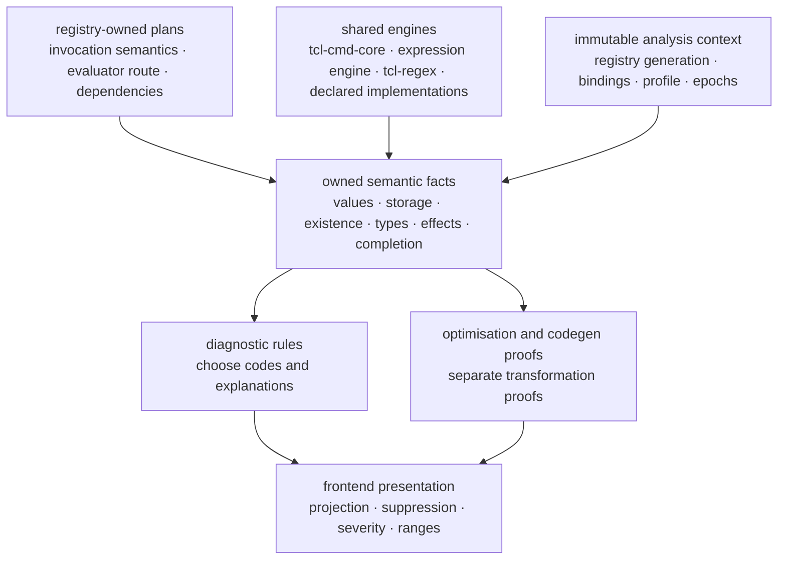
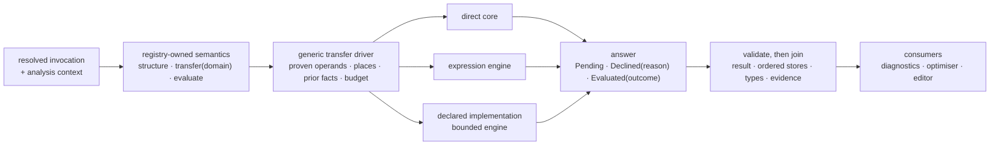
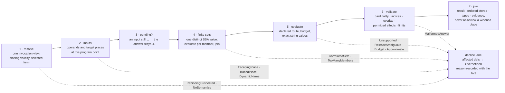
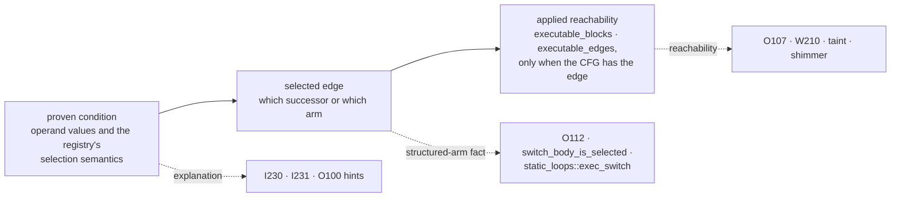
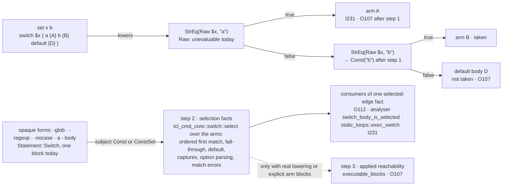

# Value transfers — the consumer interface contract

What the command registry tells the analyser about one command invocation,
and what the analyser does with the answer. The registry owns the
command-specific meaning: what an invocation computes, which storage it
writes, in what order, and which bindings and target semantics the answer
depends on. The analyser owns the generic operations: proving a word's
value, resolving a storage place, reading the fact that holds there,
running the solver, joining, validating, and publishing facts with
provenance for every consumer. This is the design for
[issue #1943](https://github.com/bitwisecook/tcl-lsp/issues/1943). Read it
before touching a fold, a lattice transfer, or a constant-condition rewrite,
and before adding compile-time knowledge about any command to a consumer.

It is one of three pages. [value-evaluation.md](value-evaluation.md) is the
evaluation contract: the routes an answer is computed by, the shared cores
and engines behind them, state isolation, budgets, and caches.
[value-transfers-migration.md](value-transfers-migration.md) is the
migration plan: the inventory of hand-written command knowledge, the
delivery slices, the gate, and what changes for every pass and diagnostic.
[registry-consumer-contracts.md](registry-consumer-contracts.md) places the
value axis among the other axes and holds the runtime, package, and
C-extension follow-ons, none of which this contract waits for.

> **Status — a proposal, not a description of what is built.** The
> `CommandSemantics` interface, `AnalysisInputs`, `EvalAnswer`,
> `InvocationOutcome`, `StoreOutcome`, `AnalysisContext`, and
> `DeclineReason` name nothing in the workspace today; every Rust shape on
> this page is a sketch of capabilities and answer shapes, not compilable
> signatures. Every *existing* identifier cited here was checked against
> the tree at the revision named in the migration plan. The observed Tcl
> behaviours quoted below were run under Tcl 9.0.4, 8.6.18, 8.5.19, and,
> where the feature exists, 8.4.20.

## Rulings

These are the owner's decisions, and every section below fits inside them.

1. **Ownership boundary.** Command-specific specialisation lives in
   registry-owned code and data. The analyser exposes generic operations
   and applies validated answers; it acquires no new command-name or
   command-ID arms. A compiler-owned handler kept during migration is a
   delivery choice, not a different destination: it carries a migration
   ledger entry and an expiry.
2. **Executable backing is declared, never inferred.** A command's
   evaluator route — a direct shared core, the shared expression engine,
   or a declared implementation in the bounded engine — is an explicit
   registry capability with an implementation identity, supported target
   semantics, declared dependencies, and budgets. Purity classifies a
   command; it does not supply an evaluator, a cost bound, or its
   dependencies.
3. **Workspace-authored facts are authoritative.** Once a pack is loaded,
   its well-formed semantic declarations are inputs to analysis and
   optimisation on the same footing as a shipped spec: they may narrow
   values, prune executable edges, suppress findings in the pruned region,
   and justify code elimination. There is no advisory-only tier, no
   widen-only rule, no provenance-based precision cap, no separate opt-in
   for narrowing, and no certification requirement. Authors own the
   consequences of a false fact in their environment. Binding validity,
   structural validation of an answer, cache invalidation, and evaluator
   resource limits remain in force — they are correctness and execution
   contracts, not a disguised trust gate. Provenance is kept for
   explanation, binding selection, dependencies, and invalidation, never
   for ranking authority.
4. **Regexp owner.** Concrete matching goes through our own `tcl-regex`
   engine behind the existing `tcl_cmd_core::regex` command plumbing. The
   analyser gains no second matcher.
5. **Shipped specialisations stay Rust** over the shared cores; a SpecTcl
   calculation reaches the analyser through the same interface where
   authoring one is useful.
6. **First delivery:** direct values, `expr`, one private pack command,
   and one shared analysis context. Runtime manifests, C hosting, the
   engine's WASM sibling, and new optimisation-code numbering wait for
   their own phases and gate nothing here.

## The four motivating programs

Each of these is legal, common Tcl. What the compiler knows about it today
depends on which of seven independent constant evaluators happens to be
asked, and the answer is different for each consumer.

```tcl
set s [string range foobarbaz 3 6]      ;# (1) a pure result: barb
set h [binary format H* 414243444546]   ;# (2) a pure result with no evaluator: ABCDEF
set n 1; incr n; incr n 2               ;# (3) a read-modify-write chain: 4
set acc ""; append acc foo; append acc bar
switch -- $acc {                        ;# (4) a switch whose subject is known
    baz     { puts never }
    default { puts always }
}
```

| Program | Optimiser (O-codes) | Shared lattice the diagnostics read | Why they differ |
|---|---|---|---|
| (1) `string range` | O129 fires: `string range` carries `const_fold: Some(fold_range)` (`rust/tcl-registry/src/commands/tcl/string_.rs`) and the propagation pass re-runs SCCP with `BuiltinFoldInputs` | `s` is `Overdefined` — `FunctionUnit::build` calls `sccp_with_extra_escaping` with `folds = None` (`rust/tcl-compiler/src/compilation_unit.rs`) | the shared lattice's memo key does not carry the command-binding fact (`rust/tcl-compiler/src/sccp.rs`, the `BuiltinFoldInputs` doc) |
| (2) `binary format` | nothing: `rust/tcl-registry/src/commands/tcl/binary_.rs` declares `pure: true` on the `format` subcommand and no evaluator | `Overdefined` | the registry can say *whether* a command is pure but not *what* it computes; `tcl_cmd_core::binary::format` exists and the registry already depends on `tcl-cmd-core` |
| (3) `incr` chain | O100 forwards `4` into a later `$n` (`sccp_value_literal`); the `Statement::Incr` arm of `evaluate_def_with_folds` does the arithmetic | `4` — the same arm runs in both lattices | `incr` is the one read-modify-write command with a typed IR node and a hand-written transfer; `append acc …` hits `_ => LatticeValue::Overdefined` and `acc` is unknown everywhere |
| (4) `switch -- $acc` | O112 would fire if `acc` were constant (`structure_elimination.rs` resolves `$acc` by name from its own `Env`); it is not, because of (3) | no `ConstantBranch`, no I231, no O107 — even with a constant subject, `switch_subject_operand` lowers a whole-variable subject to `ExprNode::Raw`, which the expression evaluator rejects before consulting the environment | three implementations of `switch` semantics (`cfg_lower.rs`, `structure_elimination.rs`, `analyser/handlers.rs`) with two notions of subject resolution |

The contract below makes one answer per program, computed once through the
registry's declaration, visible to every consumer, and reachable by a pack
for a command the registry has never heard of. The completion test is
stated at the end: a command that fits an existing analyser interface
changes only its registry declaration and, where needed, its registry-owned
evaluator or shared core, and never SCCP, the analyser walk, a diagnostic,
or the optimiser.

## Vocabulary

- **Invocation** — one resolved call: the binding the head resolves to, the
  selected subcommand and form, the source words with their expansion and
  substitution kinds, and the storage places its argument coordinates name.
- **Value transfer** — the registry-owned answer for one invocation on the
  value axis: the command's result, the ordered outcomes for each storage
  place it may affect, the semantic types of both, and the evidence the
  answer depends on. Its projection onto the lattice is what SCCP applies.
- **Place** — a Tcl storage location as the analyser resolves it: a scalar,
  an array element, or a whole array, in a frame or a namespace. Names are
  resolved to places before any outcome is composed, so two spellings of
  one cell are one target.
- **Storage outcome** — for one place, one of *write* a value, *preserve*
  the prior state, *unbind*, or *may write* with bounded facts. `None` is
  never an outcome; silence is a decline.
- **Pending** — an input the solver has not reached yet: `LatticeValue::Unknown`,
  the optimistic bottom. Pending is not "unbound", not "dynamic", and not a
  reason to erase a previously joined fact.
- **Decline** — the evaluator could not establish an answer, for a recorded
  reason: an input is not exact, the binding is suspect, a place escapes
  or is traced, the target semantics are ambiguous, a budget was exhausted,
  or the answer would be approximate. A decline widens the affected
  definitions and is never a Tcl error, a no-match, or an absent variable.
- **Exact value** — a Tcl string, preserved byte for byte: whitespace, NUL,
  backslashes, leading zeros, signed zero, and Unicode as computed. Its
  numeric classification is an additional fact, never a replacement
  spelling.
- **Evaluator route** — the declared way an exact answer is computed: a
  direct shared core, the shared expression engine, or a declared
  implementation run in the bounded engine ([value-evaluation.md](value-evaluation.md)).
- **Analysis context** — the immutable identity every query and evaluation
  runs under: registry and overlay generation, command bindings and
  namespace context, target profile and grammar, trace and escape facts,
  seeds, and evaluator revisions.
- **Branch fact** — one of three distinct things: a *proven condition*, a
  *selected edge*, or *applied reachability* in `executable_blocks`. They
  are recorded separately because the CFG does not always contain the edge
  a selection names.

The lattice itself is unchanged: `LatticeValue::{Unknown, Const, ConstSet,
Overdefined}` over `ConstValue::{Int, Float, Bool, String}`
(`rust/tcl-compiler/src/analyses.rs`), joined by `sccp::join`, with
`MAX_CONSTSET_SIZE = 32`. What changes is who computes the value at each
statement, and what travels with it.

## The ownership boundary

| Owner | Responsibility | Must not acquire |
|---|---|---|
| Registry | Invocation semantics; specialisation implementations; operand and target selection; the evaluator route; a stable semantic identity per specialisation | SSA internals, LSP ranges, mutable analyser access, command algorithms copied from the shared cores |
| Shared syntax, numeric, and command cores | Parsing and exact value algorithms under explicit semantic policy (release, character model, numeral grammar) | Registry lookup or analyser policy |
| Analyser and compiler fact producers | Scope and place resolution; input facts; the solver; effect and completion validation; joins; source provenance | Command-specific argument grammars or arithmetic selected by name or command ID; diagnostic enable flags |
| Diagnostic rules and edit planners | Interpret shared facts; select codes and explanations; validate and anchor suggested edits | Private command evaluation, duplicated semantic proofs, dependence on which other diagnostics were displayed |
| Frontend presentation | Projection, suppression, severity overrides, protocol ranges, edit serialisation | New command semantics, or facts inferred from diagnostic messages and codes |
| Engine adapter | Bounded execution of a declared implementation over structured values in a fixed context | Ambient workspace execution, or a guess for an unknown input |
| Composition root | Install evaluator services and the immutable registry context for native, browser, CLI, MCP, and worker entry points | Hidden per-thread changes to what a canonical query means |



The dependency direction already supports this: `tcl-registry` depends on
`tcl-syntax` and `tcl-cmd-core`, so a registry-owned specialisation can
call the cores directly. `tcl-engine-tclvm` depends on `tcl-compiler`, so
the concrete engine is injected by a composition root above the compiler;
the compiler and the registry see only the execution interface. Existing
hook installation (`pack_hooks::install_host`) shows the direction; its
thread-local, mutable availability is replaced by the context contract in
the evaluation page before it becomes a canonical lattice input.

## One invocation, one context

**Extend the resolver that exists.** `ResolvedInvocation` and
`InvocationSemantics` in `rust/tcl-registry/src/resolved_invocation.rs`
already select the subcommand and form, follow inheritance, keep the source
word kinds and argument offsets, and handle instance invocations. The
value axis is a projection of that resolution, not a second
command/subcommand/form resolver: a `value_transfer_for_call(&[&str])`
over bare strings would drop the evidence the resolver already retains.
There is one argument coordinate system — the resolved invocation's operand
indices — with an explicit mapping back to source words and to lowered
storage places. `Statement::Incr { name, amount, .. }` projects to the
invocation view `incr name ?amount?`; the synthetic loop header the CFG
builder emits for `foreach`, `lmap`, and `dict for` projects to its
declared iteration protocol, and its `container_arg: 0` refers to the
synthetic layout, never to the source var-list.

**Three declaration states.** For each specialisation on a spec, a
subcommand, or a form: *inherited* from the enclosing level, *declared*
explicitly, or *declined* explicitly — "no evaluator for this form". With
`Option<…>` meaning "derive when absent", a more specific form could not
suppress a parent's evaluator; the third state makes abstention a
declaration. Inheritance, declaration, and abstention are resolved once,
with the binding, argv shape, selected form, target profile, and overlay,
into one immutable identity that every axis query interprets.

**Derive only from a descriptor that states the same operation.**
`NativeLowering::CellReadModifyWrite(Increment)` states an operation;
deriving the value projection "read the cell, add, write it back, return
the new value" from it is sound, and a contract test pins the agreement
(`CellReadModifyWrite(u)` on a spec ⇒ the resolved value transfer is the
cell update `u` on the same target). `Traits::DESTROYS_VARIABLE` states
that the named places are unbound afterwards; an *unbind* outcome follows.
`VarWriteTyping::ElementsOf` states a type relationship and nothing about
ordering, padding, write conditions, or the result, so it derives nothing;
`foreach` and `lmap` carry that descriptor beside `LOOP_LIST_HEADER`, and
`HAS_LOOP_BODY` does not establish list iteration. Iteration, destructuring,
and dispatch semantics are explicit declarations.

**Cross-axis consistency is validated once.** A base declaration with a
pure evaluator, a selected form that writes a variable, a subcommand with a
different cell operation, and an overlay that changes argument roles can
each be individually legal and jointly impossible. A cell transfer needs a
matching read/write layout; a body plan must name real body operands; a
declared no-write effect cannot coexist with an applied write plan. An
inconsistent specialisation is quarantined with an author-facing reason and
the generic conservative behaviour is kept; the optimiser and the
diagnostics never pick different fallbacks. Structural validation catches
contradictory metadata; it does not certify that a consistent declaration
is true, and under ruling 3 it is not asked to.

**The analysis context is one value.** Its identity covers every fact that
can change an answer: the effective registry and overlay generation,
command bindings and namespace context, the target semantic profile and
grammar overrides, trace and escape facts, seeds, and any evaluator or
implementation revision not already fixed by the registry identity. It is
carried unchanged through lowering, unit construction, per-function
queries, optimiser consumers, and evaluator calls. Today `compilation_unit`
and `function_lattice` in `rust/tcl-lsp-db/src/lib.rs` resolve the
un-overlaid `db.registry` while the analyser receives `spec_pack_key` and an
overlay; adding the key at the outer query is insufficient if `FnLatticeKey`
or the registry lookup still drops it. The context is interned and carried
by the existing query infrastructure, not duplicated into uncoordinated
keys.

## The interface

The analyser owns seven generic operations, and every specialisation is
composed from them: obtain a proven word value; resolve a storage place;
query the fact that holds at a place before the invocation; enter a
described scope; register a described definition; apply a validated
transition; and emit a fact with provenance. The registry selects and
composes; it never receives `&mut Analyser`. Returned plans and facts are
preferred to callbacks because a plan can be validated, replayed, cached,
and consumed by more than one frontend; a restricted read-only input
interface is the one callback shape, for evaluators that need lazy access
to input facts.

```rust,ignore
// Rust-shaped pseudocode: capabilities and answer shapes, not signatures.

/// Read-only view of what the analyser has proven at this program point.
trait AnalysisInputs {
    fn invocation(&self) -> &ResolvedInvocationView;
    fn operand(&self, id: OperandId, domain: FactDomain) -> FactView;
    fn prior_store(&self, place: PlaceRef, domain: FactDomain) -> FactView;
    fn context(&self) -> &AnalysisContext;
}

/// What a registry-owned specialisation supplies.
trait CommandSemantics {
    /// Bodies, scopes, binders, control and completion protocol,
    /// declared structural effects — consumed at construction time.
    fn structure(&self, input: &dyn AnalysisInputs) -> PlanAnswer;
    /// The abstract transfer for one fact domain (type, existence, taint,
    /// range …): a delta the owning solver validates and applies.
    fn transfer(&self, domain: FactDomain, input: &dyn AnalysisInputs) -> TransferAnswer;
    /// The exact evaluation over the declared route, under a budget.
    fn evaluate(&self, input: &dyn AnalysisInputs, budget: &mut Budget) -> EvalAnswer;
}

enum EvalAnswer {
    /// An input has not reached a usable fact; the answer stays pending.
    Pending,
    /// No exact fact, for a recorded reason. Never a speculative value.
    Declined(DeclineReason),
    /// A normal-path result with ordered storage outcomes and evidence.
    Evaluated(InvocationOutcome),
}

struct InvocationOutcome {
    /// Normal completion only, in the first delivery; other completion
    /// kinds are designed separately (see § Storage-writing commands).
    completion: CompletionOutcome,
    result: ExactValueOrUnavailable,
    /// In execution order, over validated targets, aliases reconciled.
    ordered_stores: Vec<StoreOutcome>,
    /// Semantic type and shape facts for the result and each written place.
    types: TypeFacts,
    /// Every binding, math function, nested command, and context
    /// dependency the answer used.
    evidence: DependencyEvidence,
}

enum StoreOutcome {
    Write { target: TargetId, value: ExactValue },
    Preserve { target: TargetId },
    Unbind { target: TargetId },
    MayWrite { target: TargetId, facts: FactBounds },
}
```

`TargetId` is an invocation-scoped operand that the structural plan has
validated as a place-bearing target; it is never a hook-selected SSA id.
The `OperandId` and target index types are adequate for arbitrary-length
Tcl argv (`usize`, or a decline on overflow), never a truncating `u8`.

**Validation before publication.** A read-only input interface does not
make a returned plan trustworthy. Before any fact is published the driver
checks cardinality (one outcome per declared target, no more), indices,
overlap (duplicate names and aliases resolved to places, with an explicit
join rule for a repeated target), permitted effects against the declared
effect facts, dependency identity, and value limits. A malformed answer is
a pack or implementation failure — an actionable load or evaluation notice
plus a conservative result — and is never an apparently valid partial
lattice update. Slot exhaustion and hook reload are visible for the same
reason: the fixed-slot machinery must not silently become the definition of
the supported catalogue size.



Registry-owned plans, by example:

| Invocation | Plan | Route |
|---|---|---|
| `string range S I J` | resolve the value operands; apply the target-aware shared string and index owners; return the exact value | direct |
| `incr N A` | resolve the cell and the amount; read the proven old value and existence; apply the shared numeric owner; return the new value and one write | direct |
| `expr {E}` | assemble the expression arguments as the command specifies; invoke the shared expression evaluator with lazy, read-only input services | expression engine; a declared implementation only for execution the engine does not model |
| `scan S F A B` | parse the format through its owner; compute the partial conversions; return the count plus ordered write and preserve outcomes | direct, where the core supports the form |
| `regexp P S A B` | the shared regexp command core over our engine; return the count or captures and per-target write or preserve outcomes | direct engine call, no engine setup |
| a private Tcl helper | resolve its declared implementation and dependencies; invoke with structured arguments | bounded engine, when explicitly declared |
| `dict with D BODY` | describe the key binding and the reconciliation around a generic body-analysis operation | structural plan; concrete execution only for a fully supported closed case |

The API succeeds when a command spec chooses these plans while the consumer
stays unchanged. Descriptors stay small and declarative for the common
cases; registry-owned native functions carry irreducible algorithms; a
SpecTcl body is one more way to supply an evaluator through the same
interface, never a second programming language inside descriptors.

## Three permissions

A known result authorises less than it seems to. Knowing that
`[incr n]` is `2` permits propagating `2` into later uses; it does not
permit replacing the substitution with the literal, because the increment
is a required write:

```tcl
set n 1
set result [incr n]
puts $n                    ;# must still print 2
```

Nor does a dead target with pure argument words make a command removable:

```tcl
set unused "\{"
lappend unused value       ;# raises "unmatched open brace in list"
```

Purity and referential transparency do not imply totality. Malformed
arguments, absent variables, traces, and non-OK completion are observable.
The contract therefore names three permissions, each with its own proof:

1. **Record** a proven result or state fact on the normal path.
2. **Substitute** a later use of the value while preserving the producing
   operation and the binding and trace assumptions it was proven under.
3. **Remove or replace** the operation only after proving equivalent
   effects, completion, evaluation order, and result use, including
   implicit returns.

The current `Statement::Incr` deletion predicate in
`rust/tcl-compiler/src/optimiser/elimination.rs` is not generalised to
every transfer; removal of a read-modify-write needs the old value proven
well-formed for the operation, the place proven bound, and no trace — the
totality proof the third permission names.

A computed result carries the binding evidence that produced it.
`ResolvedConstSubst` already retains `command_bindings`; a side map of
types does not replace that. When a constant travels through SSA copies,
joins, calls, or branches and is then emitted into code or into a source
edit, its dependencies are retained and combined, or re-proven before
emission. Codegen's existing `require_command_binding` sites are the shape
of that re-proof for bytecode; a source edit has no accompanying runtime
guard, so a guardable runtime optimisation is not automatically a safe
code action.

## The lift over the lattice

The solver's vocabulary is preserved, and each state forbids a specific
inference:

| Knowledge | Meaning | What must not be inferred |
|---|---|---|
| `Unknown` (pending) | the solver has not obtained usable input evidence yet | runtime dependence, an absent variable, or a reason to erase a previously joined fact |
| `Const(v)` | one exact value under the recorded assumptions | permission to delete its producer, or immutability of the source variable |
| `ConstSet(S)` | a bounded collection of possible values | an arbitrary member, correlation with another independent set, or ordered loop iterations |
| `Overdefined` | this domain cannot represent a sufficiently precise value | proof that no later definition can be constant, or that other domains know nothing |
| decline | this route could not establish an answer, for a recorded reason | a Tcl error, a no-match, a missing cell, or inherently dynamic behaviour |

Determinism of an evaluator establishes repeatability for the same concrete
input; it is not a monotonicity proof. The lift is stated explicitly:

- A pending input keeps the answer pending, which is what optimistic
  iteration needs.
- Exact inputs evaluate through the declared route.
- A finite set is evaluated per member and the answers joined, when exactly
  one *distinct SSA value* is a set: two uses of the same SSA value are
  correlated, and a repeated target is correlated too. Multiple
  independently varying sets decline as a precision limit, not a soundness
  rule; total combinations and result bytes are bounded.
- An unsupported case is top.
- Storage outcomes and auxiliary facts join with their previous information;
  no consumer re-narrows a place already widened by aliases or traces.

An interval transfer cannot call a concrete evaluator on an interval. It
needs a sound abstraction of the operation: a generic interval domain can
interpret a registry-described integer add under the target's overflow
rules, and returns top for an operation with no abstract model even when
exact evaluation exists. Bounded loop simulation can reuse the concrete
evaluator while keeping termination, trip count, and side effects as
separate reasoning. A correlated loop shows why a per-variable set is not a
loop result:

```tcl
set x 0
foreach {a b} {1 10 2 20} {
    incr x [expr {$b / $a}]
}                          ;# x is 20 in every tested release
```

The pairs are `(1,10)` and `(2,20)`; the sets `{1,2}` and `{10,20}` have
lost that relationship, and pairing members arbitrarily would be unsound.
An exact loop result needs ordered iteration simulation or a relational
fact.



Acceptance for the lift: bottom → constant → set → top progressions, joins
in different predecessor orders, loop back edges, correlated operands,
budget declines, and consistency of value, type, and provenance facts, all
as deterministic fixed-input tests; generator-driven campaigns stay in the
manual tier.

## Exact values, types, and representation

**Ingress preserves the exact result.** `parse_literal_value` in
`rust/tcl-compiler/src/sccp.rs` begins with `text.trim()`, and the string
fallback trims too; `string range { a } 0 end` returns the three-character
string ` a `, and passing that through the helper would store `a`. A
computed value is a value, not a source token, so the value-ingress API
preserves leading and trailing whitespace, NUL, backslashes, leading-zero
numerals, signed zero, and Unicode exactly. Numeric classification adds a
fact; it never replaces the observable spelling without proof that the
value has that canonical spelling.

**Three separate facts, three joins.** The exact value, the semantic type
or shape, and the representation evidence are distinct, and `TclType` alone
cannot carry the second two:

- A list type does not give its elements; element facts still need the
  exact value.
- Per-target types differ (`scan %d %s`), so one written type cannot
  describe every destructured target.
- A runtime byte array, its Tcl string representation, and the UTF-8 bytes
  of that representation are three things; a computed `binary format` needs
  a lossless materialisation contract before it is emitted anywhere.
- After a join of identical strings produced with different internal
  representations the string stays exact while the representation is
  uncertain; "last written type wins" is not a sound join.
- Replacing a byte-array-producing call by a source literal can change
  representation costs even when the string is equal; the original return
  type does not prove the replacement has the runtime's representation.

The existing dynamic return-type hooks (`ReturnTypeHookId::{Regexp,
Lsearch, Regsub, Scan, Pid}` in `rust/tcl-registry/src/hooks.rs`, resolved
in `rust/tcl-registry/src/return_type.rs`) guarantee an *internal
representation*, and their `None` is authoritative rather than a fall-back
to the static type. They are adapters into the same form semantics, kept
with those guarantees, not superseded by a value table.

**Provenance is never fabricated.** A folded value enters
`value_provenance` with `literal_span: None`, rename abstains on it, and a
computed pattern is explained as computed rather than painted at a token
range it does not have. Existing literal mappings are retained; no rename
edit or token range is invented for computed characters.

## Decline conditions, stated once

The current `incr` arm re-derives its own widening rules; `append` would
re-derive them again; a pack would forget one. The driver states them once,
and every specialisation inherits them:

| Condition | Who decides | Answer |
|---|---|---|
| a required input is pending | the solver | pending |
| a word is not an exact value at this use (multi-token, `{*}`, unresolvable variable, JimTcl `$(…)`) | the driver | decline |
| the head's binding is suspect: renamed, aliased to an unknown target, redefined, or in an opaque namespace (`ModuleCommandMutations::trusts`, `trusts_proc_binding`, `redefined_procedures`, `opaque_namespaces`) | binding validity — not an author-trust check | decline; a consumer with no whole-module view uses `distrust_all()` |
| the place is `::`-qualified, escaping, or the function has a dynamic trace (`is_externally_mutable` over the `var_observability` escaping set) | the solver, before any transfer runs | the def is `Overdefined` and no transfer re-narrows it |
| the place is named in `Module::traced_variables` (`TraceInputs`) | the solver | same |
| the target is an array-element base write, or the targets overlap, or a target is trace-visible | the driver, in early phases | decline, stated as a precision limit |
| a dynamic key (`incr a($i)`) | `DynamicNameBarrier` | decline, not pending: the miss is permanent and `join(prev, Unknown) = prev` would launder a stale element constant |
| the prior value has the wrong intrep for the operation, or the place is unbound and the release's uninitialised behaviour is not proven | the evaluator | decline — the program errors at run time, and an error is never a value |
| the answer differs between target releases and the profile names none | the evaluator, comparing all relevant semantic cases | decline (`NumberSyntax::unanimous`, `StringCharacterModel`, the leading-zero numeral rule) |
| a nested substitution is stateful and could invalidate observed inputs | the expression route | decline in the first delivery |
| a resource cap is hit: output bytes, allocation before it happens, fuel, depth, request budget, cancellation | the route and the budget | decline, distinct from an unsupported case, and never an exact negative |
| a regexp search was cut short or a capture is approximate | the regexp owner | decline, never "no match" |
| the statement is a `Barrier` or `UpFrame` | the solver | every tracked value widens, as today |

`incr` of `010` is the release row in one line: it answers 11 under
Tcl 9.0 and 9 under 8.6 and 8.5, so a profile that names no release
declines.

## Storage-writing commands

A transfer is a result *and* a change to storage, and the two are
independent. The concrete shapes, observed under every tested release:

```tcl
set a before; set b before
regexp {(x)(y)} zz a b       ;# result 0; a and b remain before
scan {12 nope} {%d %d} a b   ;# result 1; a = 12, b remains before
lassign {first second extra} a a
                             ;# result extra; a = second
set d {a 1}
dict with d {incr a; set result done}
                             ;# result done; d = {a 2}
```

- **Preserve is a first-class outcome.** No match means *preserve*, and a
  partial `scan` writes some targets and preserves the rest. A vector of
  optional values cannot say "leave this alone", and cannot deliver the
  precision W210 needs for the no-match case. The shape to copy exists:
  `tcl_cmd_core::regex::RegexpResult::Count` carries an independent count
  and `assign: Option<Vec<…>>`, where `None` means the match variables are
  untouched.
- **Result and cell are separate values.** A single "new value" cannot
  describe a list pop that returns the removed element and writes the
  remainder, or a body command whose result is the body's and whose
  write-back is a reconciliation.
- **Duplicate targets resolve to places first.** `lassign … a a` writes
  `a` twice in order; the outcomes are composed after resolution, in
  execution order.
- **Body commands are structural plans.** `dict with` and `dict update`
  bind keys, run a body, and reconcile; their implementation in
  `rust/tcl-vm/src/cmd_dict.rs` is those three steps. Initial key binding
  is a useful projection of a constant dict; it never stands for the whole
  command.
- **Pending is not unbound.** `incr` on an absent variable behaves by
  release (8.4 raises, 8.5 and later create it), while `append` and
  `lappend` create it in every release. The uninitialised case therefore
  needs an existence proof and, for `incr`, the selected release; no old
  value is manufactured from bottom.
- **An interpreter error is not an atomic rollback.** With `a` a scalar
  and `b` an array, `catch {lassign {new second} a b}` fails with code 1
  and leaves `a` equal to `new`. A transfer that declines on error and
  preserves all incoming state would be wrong if that state reaches a
  handler; one that treats all writes as successful would be wrong too. The
  first delivery keeps `catch` opaque and invalidates affected facts
  conservatively; if structured exception analysis is added, storage
  outcomes are indexed by completion path and keep write order, and no
  exact fact escapes an unsupported path. Applying a *validated analysis
  result* atomically says nothing about the *analysed command* having
  transactional semantics.

## `expr`: the first demanding client

`expr` is the first client that cannot be reduced to a suffix of literal
operands, so it validates the interface early. There are three layers, and
the seam for the third already exists:

1. **Word evaluation** obtains the argument values under the source's
   braced, quoted, bare, or expanded substitution rules.
2. **The registry-owned `expr` specialisation** assembles those arguments
   into one expression as the command specifies: a braced argument is the
   expression text; a quoted argument has had substitutions performed
   before the engine sees it; several arguments concatenate.
3. **The shared expression engine** — `tcl_syntax::expr::eval` with its
   `ExprOps` (`var`, `command`, `call`) in `rust/tcl-syntax/src/expr/eval.rs`
   — evaluates lazily, using analysis services for proven variable values
   and supported nested calls.

The compiler's `FoldOps` in `rust/tcl-compiler/src/tcl_expr_eval.rs`
already adapts that engine: it supplies an environment, rejects command
substitutions, and calls the shared math-function dispatcher. Two limits
of the adapter are corrected rather than inherited. Its `eval_with_config`
ends in `to_number`, and its public `TclValue` has numeric variants only,
so it cannot fold `expr {"x"}` — which is the string `x` — or a
string-valued ternary; the analysis result boundary carries the engine's
full value. And it evaluates eagerly where the engine must not:

```tcl
expr {0 && [error never]}   ;# 0: the right operand is never reached
set a alpha; set b beta
expr {$a == $b}             ;# 0
expr "$a == $b"             ;# error: invalid bareword "alpha"
```

Resolving words as structured values avoids building a script by
interpolating values that contain Tcl syntax.

**Nested substitutions need a state model.** Under every tested release:

```tcl
set x 1
expr {$x + [incr x] + $x}    ;# 5, and x becomes 2
set x 1
expr {0 && [incr x]}         ;# 0, and x remains 1
set x 1
expr {$x + [set x 10] + $x}  ;# 21, and x becomes 10
```

A callback that reads every variable from one incoming map is wrong for
the first and third; one that evaluates all substitutions first is wrong
for the second. The first delivery accepts only nested operations whose
effects cannot invalidate the observed inputs and declines the rest. Later
support needs a generic ordered evaluation state — reads see prior
validated writes, nested outcomes carry their writes and binding effects,
expression control flow decides which callbacks run — and that state is
neither the mutable analyser nor the program's interpreter. Claiming general
expression evaluation while using read-only callbacks is not an option.

**Math functions are bindings.** Binding validity covers every command
implementation actually used, transitively:

```tcl
rename ::tcl::mathfunc::abs ::tcl::mathfunc::saved_abs
proc ::tcl::mathfunc::abs {x} {return 99}
expr {abs(-2)}             ;# 99 under 8.5 and later
```

Checking only `expr`, or retaining a builtin `abs` in a private engine,
does not prove what the analysed program calls. A successful answer carries
evidence for the math functions and nested commands it used, alongside
variable observability and the target's numeric and word rules; the first
delivery abstains on user-defined math functions and ambiguous bindings.

**Three operations, not one.** Exact evaluation, partial simplification,
and algebraic regrouping are different operations with different proofs:

| Input | Useful reduction | Required justification |
|---|---|---|
| `expr {2 + 3 + $x}` | `expr {5 + $x}` | fold the closed `2 + 3` subtree; keep the remaining operation |
| `expr {$x + 2 + 3}` | `expr {$x + 5}` only when proven safe | reassociation across an unknown term is not valid for arbitrary doubles |
| `expr {(2 + 3) * ($x + (4 + 5))}` | `expr {5 * ($x + 9)}` | fold two independent closed subtrees without regrouping the dynamic term |
| `expr {$x * 0}` | usually retain | dropping `$x` can remove errors and effects or change numeric semantics |
| `string cat {prefix:} {abc} $x {:} {suffix}` | merge the two constant runs around `$x` | registry-declared concatenation semantics; exact strings, word evaluation, quoting preserved |

```tcl
set x 10000000000000000.0
expr {$x + 1 + 2}  ;# 10000000000000002.0
expr {$x + 3}      ;# 10000000000000004.0
```

`instcombine_expr_typed` in
`rust/tcl-compiler/src/optimiser/helpers/expr_simplify.rs` rewrites
`$x + 1 + 2` to `$x + 3` even with a present, empty `OperandTypes` context,
because `reassociate_node` does not receive the numeric context; the
production expression pass calls it. Reassociation must consume the
relevant type and target proofs, and integer-only reasoning must still
account for overflow and bignum behaviour, errors, effects, and evaluation
order. The partial rewriter consumes the same semantic facts as the
evaluator and returns a typed residual with its dependencies and
transformation proof; `Residual(expr)` is not `Const(rendered_expr)`, and
the dynamic operand is never replaced by a dummy to run an engine — that
yields one sample, not a symbolic result. Partial simplification extends
`expr_simplify.rs` and `optimiser/propagation.rs`, which already substitute
known operands and simplify; it is not a second partial evaluator inside
the registry driver.

**Partial facts after the exact value is lost.** A non-constant integer can
still have an interval; a non-constant list a known length and element
type; a string assembled around an unknown segment an exact prefix, suffix,
or length bound. Those facts support diagnostics and further reduction
without pretending the whole value is known, and a constant textual result
does not prove a representation or the absence of effects. Existing
domains carry them where they suffice; bounded segment and residual facts
are added only for concrete consumers, with caps, joins, invalidation, and
loop widening specified, and on complexity exhaustion residual precision is
dropped without changing semantic truth.

**Constant → unknown → constant.** With no aliases, traces, or external
observability:

```tcl
set x 3
incr x 2
set x $request_value
set x 7
```

The definitions have exact values 3, then 5, then an unproven value, then
7. The unknown input does not retroactively invalidate the earlier
definitions, and the final assignment is a new constant definition, not a
violation of monotone convergence. An alias write, trace, callback,
namespace mutation, or opaque call may invalidate knowledge without an
explicit `set`; that loss uses the existing place, effect, and observability
owners, and with today's whole-function conservative barriers precision can
be lost earlier than the runtime mutation. A query over an SSA use or a
place *at the requested program point* returns the value-domain answer,
the relevant type, shape, and range facts, dependencies, and bounded
explanation evidence — why a fact ceased to be exact: dynamic input,
conflicting incoming values, alias write, trace, binding uncertainty,
unsupported semantics, release ambiguity, or resource decline — linked to
the responsible statement or edge where known. Explorer explanations and
rules consume that; they never reconstruct it from warning messages or by
comparing solver iterations, and no append-only log of solver events is
kept.

Acceptance for `expr`: multi-argument forms, braced versus quoted
arguments, short-circuit operators and ternaries, strings that look like
code, math-function rebinding, nested pure substitutions, errors, bignums,
and target release ambiguity, with direct-expression and engine entries
measured separately.

## Branch facts

Three things are recorded separately, because the CFG does not always
contain the edge a selection names:



Today `FunctionUnit::build` appends existence-derived constant branches to
`sccp.constant_branches`, but those post-pass facts do not update
`executable_blocks`, so `emit_existence_constant_branch_diagnostics` calls
the same semantic helper again to learn which kind it has. Sharing a helper
prevents algorithm drift; it does not give consumers one complete stored
fact. The stored fact says which of the three it is, and emission never
reruns the proof.

### `if`, `elseif`, `while`, `for`

Conditions are parsed expressions, so `evaluate_branch` already binds
`$var` operands from the lattice. Two gaps close through the same
interface:

- **Command substitutions inside a condition.** `ExprNode::Command` is
  rejected by the evaluator, so `if {[string length $acc] == 6}` never
  decides even when `acc` is constant. The engine's `command` service
  resolves a nested invocation through the registry's semantics, lazily,
  under the branch's use versions and the nested-substitution policy
  above; this reaches every pure specialisation at once — `info exists`,
  `string is integer`, `dict exists`, `lsearch`, `regexp` without match
  variables.
- **Finite-set operands.** `env_from_uses` binds only a single `Const`.
  When exactly one distinct SSA value is a `ConstSet`, the condition is
  evaluated per member: all true → taken, all false → not taken, mixed →
  open.

Loop-carried values still widen at the header phi. The three disagreeing
`incr` models — `static_loops::exec_statement`, `intervals::transfer`, and
the SCCP arm — become consumers of one registry-described integer add: the
simulator applies it concretely, the interval domain applies its abstract
model, and both answer the leading-zero and overflow questions through the
same target rules.

### `switch`

The CFG builder flattens only an exact, case-sensitive, no-fall-through
`switch` into a dispatch chain of `StrEq` branches; glob, regexp,
`-nocase`, and any fall-through arm stay one opaque `Statement::Switch`,
and `lower_opaque_switch` stores that structured statement in one block —
it creates no CFG block per arm. Even in the flattened form a
whole-variable subject lowers to `ExprNode::Raw`, deliberately, because
`Raw` is the only operand that preserves a backslash-bearing `${…}` name
under both 8.x and 9.x close rules, and `Raw` cannot be evaluated.

| Form | O112 (structured IR) | O107 / I231 (CFG) |
|---|---|---|
| exact, literal subject | fires | fires |
| exact, `$var` subject | fires when `var` is constant | never — `Raw` |
| exact + `-nocase`, or a fall-through arm | fires | never — opaque |
| `-glob` | fires (`pattern_matches` is glob-aware) | never — opaque |
| `-regexp` | never (bails) | never |



The order of delivery, each step with its own contract:

1. **The exact whole-variable case.** `evaluate_branch` resolves a `Raw`
   operand from the lattice only when the existing word and variable-name
   owners prove the operand is exactly one variable reference; arbitrary
   `Raw` text never becomes executable because one synthetic operand uses
   that variant. The flattened form then decides per arm for a constant
   subject, `executable_blocks` drops the dead arm bodies, O107 and I231
   fire, and O101 stays suppressed on the synthetic chain as today.
2. **Selection facts for opaque forms.** For a `Statement::Switch` whose
   subject is `Const` or a `ConstSet`, arm selection is computed by the
   existing owner — `tcl_cmd_core::switch::{parse_options, select}` in
   `rust/tcl-cmd-core/src/switch.rs`, which already implements exact, glob,
   and regexp selection and capture construction over `RegexEngine` — and
   recorded as a structured-arm fact against the arm's `pattern_span`. The
   registry-declared selection semantics include ordered first-match
   behaviour, the final-default rule, fall-through to a later body, regexp
   capture writes through the same storage outcomes, option parsing, and
   match errors. A pattern that never matches can still supply the body
   reached through a preceding `-` arm, so deleting an arm and body pair
   can change behaviour; a `ConstSet` subject joins selected bodies and
   writes across every member and retains error possibilities when a
   pattern cannot be evaluated. O112, the analyser's
   `switch_body_is_selected`, and `static_loops::exec_switch` consume that
   one fact instead of three private matchers; the runtime adapters'
   remaining steps — fall-through body resolution and body execution — are
   modelled by the analysis adapter too.
3. **CFG integration and edits.** Applied reachability for an opaque form
   needs either real lowering support or explicit arm blocks; a post-pass
   cannot remove blocks that do not exist. Source edits that delete an arm
   are optional presentation work after the semantics are established, and
   no optimisation code is reserved for them until the ordered-matching,
   completion, source-edit mapping, and proof contracts are implemented.

A `case_list` descriptor establishes locations and grammar. A private
dispatch-table command receives Tcl `switch` execution semantics only when
its registry declaration names that semantic contract explicitly;
structural similarity is not proof of first-match execution. With the
contract declared, an Expect-like `case` or a vendor `switch` wrapper gets
the same selection facts from its `.tclspec`, as data.

### `catch`, `try`, and completion

A `catch` body is one opaque `Call` in the default build (`emit_opaque_catch`),
so nothing inside it enters the lattice; a `try` body enters only when its
handler shape permits. Transfers do not change that and are not used to
reason across it: the exception edge is a completion fact, which the DSL
excludes for the reason the spec-pack rules give. `catch {expr {1/0}}`
stays undecided because integer division by zero declines. `error`,
`throw`, `exit`, and `tailcall` promote to `Return` terminators through
`TERMINATES_BLOCK`, and a decided `switch` arm that ends in one keeps that
promotion.

### Existence, later

Unbind outcomes make a flow-sensitive bound/unbound fact possible (`info
exists x` after `unset x` decides false; the `parameter is present` fold
survives an `unset` on another path), replacing the flow-insensitive
`scan_defined_and_unset` scan and its `command == "unset"` site. It is a
third lattice rung rather than a value, sequenced after the value slices,
with the same gates the existence post-pass applies today. There is no
universal meaning for an empty reachable-block set outside its producing
analysis: missing or deferred analysis, no normal successor, and a proved
unreachable branch are different, and availability and edge evidence are
typed across fast and deep tiers, exception paths, and summaries.

### Predicate refinement, later

Inside the taken arm of `if {$x eq "a"}` or the `a` arm of an exact
`switch $x`, `x` is `"a"` even when it was `Overdefined` before the test.
The existence-guard narrowing (`collect_existence_guards`, dominance-based)
is the precedent; a general edge refinement for equality with a literal,
`string is CLASS`, and `switch` arms would feed both the value and the type
lattices. It needs a block-qualified lookup the per-value map does not
have, so it is recorded as a follow-on.

## Diagnostics consume facts

`CompilationUnit` and the per-function lattice queries supply reusable
analyses; compiler checks emit a protocol-independent `Diagnostic`;
`CompilerDiagnostics` retains checks and optimisation findings
independently of display-time gates; the server's lifts convert spans and
severities and apply tags and overrides. Those boundaries are strengthened,
not replaced, under five rules:

1. **Display policy cannot change semantic truth.** Disabling W210, W100,
   I230, or the optimiser presentation must not change values, storage or
   existence facts, reachability, or summaries consumed elsewhere. A
   disabled expensive rule may skip its own private calculation; it cannot
   withhold a shared fact an enabled consumer needs. Semantic context
   inputs are separated from diagnostic and style settings even while one
   configuration object carries both.
2. **Facts carry evidence; findings carry policy.** A branch fact
   identifies the condition, the proof context, and its edge or
   reachability status. A rule chooses I230, I231, or an optimisation
   finding and an explanation. A value specialisation never chooses a
   severity, a message, or an editor range.
3. **A diagnostic is not a rewrite certificate.** An unreachable-arm
   observation can be useful without a safely editable region. Edit
   planning additionally checks original syntax, comments, substitutions,
   effects, source revision, and the exact replacement range, keeps the
   distinction between hints and actionable replacements, and never gives a
   fabricated span to a value to obtain a code action.
4. **Aggregation does not recover semantics.** Lifts filter, map ranges,
   attach tags, and serialise edits. Workspace refinement belongs to its
   semantic owner. The publication path never parses messages, evaluates
   expressions, or infers a fact from whether another diagnostic survived
   suppression; intentional overlap policy such as W110 / O120 precedence is
   explicit and separate from fact production.
5. **Availability and revision are part of the contract.** A fast-tier
   request can lack a deep fact without that fact being false; the
   workspace-refinable policy and the lightweight structure queries stay.
   `file_token_facts` in `rust/tcl-lsp-db/src/lib.rs` deliberately uses
   structure-only analysis, and its source records the reduction that
   choice bought on an 883-file workload; "every consumer shares the
   contracts" never becomes "every consumer eagerly computes every fact". A
   result or edit from an old source or context revision is not attached to
   the current document; canonical relative spans are rebased by the
   source-mapping owner, never guessed by consumers.

Three producers move onto the interface in the first slices:

- `emit_provably_unset_w210` in
  `rust/tcl-compiler/src/analyser/diagnostics/dataflow.rs` recognises
  `regexp` and `scan` by name, parses their forms, and computes no-match
  consequences inside a diagnostic producer, with a second traversal for
  embedded conditions; its own comment says the registry lacks these
  per-form semantics. The owner is the registry transfer's *preserve*
  outcome plus the generic existence analysis: no match preserves, so the
  prior cell fact is necessary, and W210 consumes the resulting proof. This
  is the end-to-end acceptance test for storage outcomes and the regexp
  owner, not a name-dispatch cleanup.
- The existence constant-branch fact is stored once with its kind
  (proven, selected, applied), as above.
- `append_brace_expr_perf_hints` in `rust/tcl-lsp-server/src/lib.rs`
  creates O111 by searching already-lifted diagnostics for W100, so O111's
  production depends on another diagnostic surviving presentation policy.
  Both rules consume the same unbraced-expression fact, or the product
  encodes a shared rule-group policy; the same file's encoding abstention,
  which uses byte-decode evidence rather than whether W109 is displayed, is
  the pattern to follow.

Not every predicate needs a globally stored lattice: a rule-specific
analysis may compute its finding from shared facts, as the interval
emitters delegate to the canonical interval-bounds owner. The boundary is
that rules do not reimplement command semantics, and reusable conclusions
are not available only as a side effect of emitting a warning.

Existing registry-owned validation stays, and is the model for
command-specific validity: `LiteralArgumentValidator` in
`rust/tcl-registry/src/literal_validation.rs` returns `Valid`, `Invalid`
with a typed issue, or `Abstain`, with an argument index and a semantic
reason independent of diagnostic types; `ConstraintReport` in
`rust/tcl-registry/src/spec.rs` lets a hook report a slot and an explanation
while the analyser owns code and span policy, and deliberately permits
authored message text. A value query never emits W146 as a side effect, and
disabling W146 never prevents another consumer from learning the operand's
value; when a constant-derived argument can be validated, its exact value
is fed through the validation interface with honest provenance, and its
source token is not relabelled as a literal. A newly declared
command-specific constraint must not require a new diagnostic
command-name arm; registry authorship of the constraint and consumer
ownership of policy are complementary.

## The other domains

"One semantic owner" means one resolved meaning and context with
composable queries and explicit dependencies, not one callback that must
compute every fact before answering any query. A known return type stays
available when the evaluator cannot run; a taint transfer stays available
when the value is unknown; a loop body stays analysable when the iteration
count is unknown.

| Interface | Registry-owned answer | Generic consumer owns | What invalidates it |
|---|---|---|---|
| Invocation and form resolution | argument roles, selected form, option semantics, expansion-sensitive uncertainty | source-to-operand mapping; the canonical resolved invocation | word and expansion facts, binding, overlay, dialect |
| Structural plan | bodies, scopes, binders, control and completion protocol, declared structural effects | AST and IR construction, CFG edges, SSA definitions, phi placement | grammar, binding, body text, alias structure |
| Exact evaluation | exact result and ordered store outcomes, or a typed decline | proven operand reads, budget, validation, materialisation | operand and storage versions; every declared environmental dependency |
| Type and shape transfer | semantic result possibilities, intrep guarantees, per-target and per-element relationships | the rich type lattice, joins, aggregate limits, consistency | operand types and shapes, selected form, target semantics |
| Existence and aliases | define, preserve, unbind, may-write; escape and alias descriptions | place identity, reaching definitions, exceptional state, joins | storage and alias epochs; trace, `uplevel`, and unknown effects |
| Range and partial value | bounds, lengths, prefixes, or typed residual operations with prerequisites | abstract interpretation, widening, bounded residual representation | operand range and shape facts, arithmetic profile, effects |
| Effects and completion | reads and writes, observable operations, possible error, return, break, continue, yield | control flow, sequencing, deletion and motion proofs | resolved implementation, callback and body summaries, traces, state |
| Taint and provenance | source, sink, and transform relationships; encoding and normalisation kind | the flow lattice, provenance paths, context-specific sink checks | operand flow, unknown effects, sanitiser identity, dialect |
| Intrep and sharing | guaranteed construction and conversion; alias and share relationships | shimmer, use-site, and mutation-copy analysis | value provenance, representation transitions, escape and share facts |
| Protocol and resource state | typed domain events (collect and release, HTTP commit, widget ownership) | the domain state machine and path joins | event and body flow, command meaning, the referenced resource world |
| Interprocedural summary | a declared external summary, or an analysable body with its contract | the call graph, recursive fixed point, context limits, dependencies | body, callee and binding set, captured and global state, pack revision |
| Backend capability and lowering | the target operation, permitted forms, required semantic and safety facts | backend IR construction, legality, allocation, verification | language profile, ABI, helper and map capabilities, proof-changing rewrites |
| Validation | a typed constraint verdict and the offending operand or member | rule code, severity, source range, suppression, presentation | the invocation and the relevant fact and context revisions |

An analyser-local fact not in this table is not exempt: its owner declares
its input dependencies, its monotone transfer and join or its non-dataflow
evaluation phase, its unknown policy, its cache key, and its consumers. The
migration plan's ledger is the checklist.

**Construction and solving are different phases.** First, resolve the
invocation and its structural semantics and build scopes, IR, CFG, and SSA
from validated plans, with conservative effects for unresolved calls and
dynamic bodies. Second, run the domains over that graph: a specialisation
queries immutable input facts and returns deltas; the owning solver
validates, applies, schedules dependent queries, joins, and widens. Third,
if improved binding, alias, or structural information changes the graph,
invalidate the affected construction query and rebuild its dependants — a
hook never inserts SSA definitions halfway through a worklist. Fourth,
publish an immutable, revision-labelled fact snapshot that rules,
optimisers, code generators, and editor queries consume at their precision
tier, with rewrites carrying their own proof obligation. These are logical
phases a demand-driven query graph can realise; a cycle such as type
inference asking for an exact result whose evaluator asks for the same type
gets an explicit fixed point or a conservative cycle result, never
recursive callback execution, and a callback reads the supplied current
state rather than demanding the completed query being computed. Summary
dependencies stay acyclic: `summarise_returns` consulting a lattice that
depends on those summaries needs a staged or explicit fixed-point protocol,
especially under recursion.

**Cross-domain reduction has rules.** An exact value may refine a semantic
type or a range; it does not prove a runtime representation the evaluator
fabricated while transporting the value. A numeric type does not erase
taint. A failed exact evaluation does not erase an independently
established length bound. Contradictory claims from two hooks are rejected
or quarantined with conservative fallback, never resolved by whichever ran
last.

**Dependency direction.** Registry-neutral fact views and typed answers sit
below the compiler; adapters, lattice order, joins, widening, and solver
state sit in the analysis owner. The registry does not depend on compiler
SSA types, and SpecTcl does not clone the compiler's `TypeLattice` and
`TypeShape` (`rust/tcl-compiler/src/types.rs`). If a shared protocol needs a
new crate, it is a small contract crate, not a second analysis engine. The
existing string-array return-type entry point cannot see expansion
provenance; it evolves towards the resolved invocation and typed operand
views with a compatibility adapter, and never rediscovers substitution by
scanning `$` and `[` in decoded values.

## Vendor loops and BPF

**A vendor collection is not a Tcl list.** The bundled SDC pack declares
`foreach_in_collection` (`specs/sdc_base.tclspec`) with `VarWrite` and
`Body` roles, `LOOP_LIST_HEADER`, and `analyser_hook -native Foreach`; the
native `Foreach` handler in `rust/tcl-compiler/src/analyser/handlers.rs`
can split a braced literal iterable as a Tcl list and simulate selected
definition effects per element. Reusing a loop hook imports more than body
walking. Vendor iteration is its own declared protocol — binder grammar,
iterable kind, yield type, cardinality source, completion contract,
zero-iteration behaviour — checked per vendor pack, and the analyser
applies it generically:

- A constant handle is not constant contents, membership, order, or
  length; the vendor object and collection types are modelled separately
  from Tcl list representation, and collection facts depend on the vendor
  design database revision and command side effects.
- The body is analysed with a typed unknown yielded object even with no
  vendor runtime; the zero-iteration edge, the back edge, and the binding
  definitions come from the declared protocol, and prior variables are
  preserved on the zero-iteration path where required.
- Known cardinality can help reachability and range analysis without
  exposing elements; known elements are used only with adequate identity
  and snapshot evidence; the printable handle is never split.
- Break, continue, return, error, nested loops, and implicit results follow
  the vendor's completion rules; termination is never inferred from a body
  argument or `CONTROL_FLOW`.
- Mutation of the vendor database invalidates affected collection
  summaries and object-property facts while Tcl-local propagation stays
  valid; an unknown external command needs a declared world-effect boundary
  or conservative invalidation.
- Vendor filter strings are their own language unless the pack declares
  Tcl expression semantics for them; they get a domain owner with a typed
  query contract, never a trip through our engine.
- Lowering may keep a generic runtime call even when analysis understands
  the loop: body analysis, exact enumeration, and executable backend
  support are three capabilities.

The acceptance fixture defines a new vendor loop spelling in a pack with no
consumer edits and exercises W210 and W211, type and taint flow, zero and
multiple iterations, break, continue, and error, collection invalidation,
and conservative lowering, including a handle whose printed text is a valid
multi-element Tcl list.

**BPF-Tcl is a different language.** [ebpf-backend.md](ebpf-backend.md)
defines it as a statically typed language using Tcl syntax with its own IR
and restricted operations, and the registry already carries `BpfOpSpec`
(`rust/tcl-registry/src/bpf_op.rs`; `commands/bpf/loop_.rs` declares
`BpfOpSpec::structural(BpfOpKind::LoopMacro)`). Signed division truncates
towards zero in BPF, so `-7 / 2` is `-3`, where Tcl floors to `-4`.
Constant evaluation therefore selects a *language-semantic profile* —
width, overflow, signedness, division and remainder, shifts — as a cache
dependency, and reuses the expression parser and engine only with the BPF
arithmetic adapter; a Tcl engine result is never a BPF constant. Packet and
map handles keep pointer kind, offset and range, nullability, map identity,
and lifetime as typed facts; a constant-looking address never erases
provenance or manufactures access permission. The existing
`loop N VAR {body}` unrolls a literal bound, at most `MAX_UNROLL = 64` in
`rust/bpf-tcl-ir/src/unroll.rs`, before CFG construction; accepting a
proven bound instead of a literal would be an explicit language change
with resource and verifier tests, not a consequence of better SCCP. Subset
acceptance, packet bounds, map access, scalar legality, bounded execution,
stack and calling convention, handler completion, and target capability
each remain a separate proof that a computable output does not supply, and
backend legality is never gated by diagnostic enablement.

## The completion test

Migrated command names are not the proof. The proof is the experiment:

1. Author one private command with a supported existing transfer,
   validation, and body pattern. Rename it, and add a subcommand form with
   different operand positions. The only semantic edits are in its
   registry-owned declarations and implementation. Exercise analysis, a
   relevant diagnostic, the optimiser, incremental overlay changes, export,
   renderer, and studio preservation, the CLI, and the applicable runtime
   fallback. No consumer changes.
2. Author a command that needs a genuinely new semantic capability.
   Extending the generic interface is legitimate; disguising a new command
   ID as a family-neutral operation is not, and the review rule for the
   distinction asks for two unrelated clients of the operation where
   practical.
3. Audit command-specific ID arms as well as string matches, and keep a
   ledger of the remaining command-specific consumer handlers rather than
   calling them irreducible by default.

"No analyser change ever" is neither achievable nor the goal; the goal is
that catalogue growth stops duplicating semantics the interface already
expresses. No finite review proves the architecture complete for arbitrary
Tcl extensions; it makes the supported boundary complete and falsifiable,
and "not supported yet" is never mistaken for "proved impossible".

## The issue's three questions

**Is the IR node one registry fact with the transfer, or two?** Two facts,
one operation. `LoweringHookId::Incr` describes IR *shape*, and the typed
`Statement::Incr` node is consumed for codegen, native lowering,
α-renaming, span rebasing, and liveness; it stays. The value projection is
derived from the same `CellUpdate` the native lowering declares, so a new
read-modify-write command adds one `CellUpdate` variant and gets both
consumers, the same relationship `SemanticOperationId::StructuredLowering`
has to `LoweringHookId`. The `Statement::Incr` sites that encode
*semantics* — the transfer in `sccp.rs`, the simulator arm in
`static_loops.rs`, the interval arm in `intervals.rs`, the removability and
hidden-read arms in `elimination.rs`, the tail fold in `propagation.rs`,
the global-write rule in `interprocedural.rs` — become consumers of the
resolved semantics; the sites that encode shape do not change.

**Is this a new hook or `const_fold` with an environment parameter?**
A new interface, of which today's `const_fold` is the result-only
projection and the compatibility baseline. Giving `const_fold` an extra
`old` parameter would silently change the contract of every existing
folder; the interface instead declares which operands and target values an
evaluator reads, and returns a result with storage outcomes rather than one
optional string.

**Do the analyser's `analyser_hook` handlers belong on this axis?** No.
`AnalyserHookId` is scope and definition structure — what a `proc`, a
`namespace eval`, or a `dict for` *declares* — and is the structural plan
in the table above. Its constant-string store (`Analyser::const_strings`)
is a consumer of constants, not a producer of transfers. `DictWith` is a
structural plan around a body plus a projection of a constant dict's keys;
keeping the axes apart is what lets the analyser's isolated per-item pass
stay sound with `ModuleCommandMutations::distrust_all()` while the
unit-level lattice evaluates.

## File-path anchors

- `rust/tcl-registry/src/resolved_invocation.rs` — `ResolvedInvocation`, `InvocationSemantics`, the resolver the value axis extends
- `rust/tcl-registry/src/spec.rs` — `CommandSpec`, `SubCommand`, `CommandForm`, `CaseMatchMode`, `case_list`, `ConstraintReport`, `run_const_fold`
- `rust/tcl-registry/src/native_lowering.rs` — `NativeLowering`, `CellUpdate`, the operation the value projection derives from
- `rust/tcl-registry/src/hooks.rs`, `return_type.rs` — `ReturnTypeHookId` and the intrep-guaranteeing return-type algorithms
- `rust/tcl-registry/src/literal_validation.rs` — `LiteralArgumentValidator`, the validation pattern
- `rust/tcl-registry/src/bpf_op.rs`, `commands/bpf/loop_.rs` — `BpfOpSpec`, the BPF descriptor
- `rust/tcl-compiler/src/sccp.rs` — the transfer function, `evaluate_def_with_folds`, `evaluate_branch`, `env_from_uses`, `existence_constant_branches`, `parse_literal_value`, `TraceInputs`
- `rust/tcl-compiler/src/const_subst.rs` — `ConstSubstCtx`, `ResolvedConstSubst` and its `command_bindings`
- `rust/tcl-compiler/src/analyses.rs` — `LatticeValue`, `ConstValue`, `MAX_CONSTSET_SIZE`
- `rust/tcl-compiler/src/command_binding.rs` — `ModuleCommandMutations`, `CommandTrustSnapshot`, binding validity
- `rust/tcl-compiler/src/var_observability.rs`, `dynamic_names.rs` — the escaping and dynamic-name gates
- `rust/tcl-compiler/src/tcl_expr_eval.rs`, `rust/tcl-syntax/src/expr/eval.rs` — `FoldOps`, `eval_with_config`, `ExprOps`
- `rust/tcl-compiler/src/optimiser/helpers/expr_simplify.rs`, `optimiser/propagation.rs` — `instcombine_expr_typed`, `reassociate_node`, the partial-simplification owners
- `rust/tcl-compiler/src/cfg_builder/cfg_lower.rs` — `lower_switch`, `switch_subject_operand`, `lower_opaque_switch`
- `rust/tcl-cmd-core/src/switch.rs`, `regex.rs` — `parse_options`, `select`, `RegexpResult::Count`
- `rust/tcl-compiler/src/analyser/diagnostics/dataflow.rs` — `emit_provably_unset_w210`, `emit_existence_constant_branch_diagnostics`
- `rust/tcl-compiler/src/compilation_unit.rs`, `compiler_checks.rs` — `FunctionUnit::build`, the diagnostic envelope
- `rust/tcl-lsp-db/src/lib.rs` — `FnLatticeKey`, `compilation_unit`, `file_token_facts`, `spec_pack_key`
- `rust/tcl-lsp-server/src/lib.rs` — `append_brace_expr_perf_hints`, the lifts
- `rust/tcl-compiler/src/analyser/handlers.rs` — the native `Foreach` handler, `switch_body_is_selected`
- `specs/sdc_base.tclspec` — `foreach_in_collection`
- `rust/bpf-tcl-ir/src/unroll.rs` — `MAX_UNROLL`

## Test anchors

- `rust/tcl-compiler/src/sccp.rs` — `evaluate_def_incr_*`, `evaluate_def_assign_value_folds_*`, `evaluate_def_foreach_*`: today's arms, and the byte-identity gate for the first slice
- `rust/tcl-compiler/src/optimiser/branch_folding.rs` — `switch_dispatch_branches_are_skipped`
- `rust/tcl-compiler/src/optimiser/propagation.rs` — `o103_folds_implicit_return_proc_cmd_subst`, `o103_folds_arg_sensitive_passthrough_cmd_subst`
- `rust/tcl-registry/tests/differential_fold.rs` — every fold against a real `tclsh`, the shape the storage-outcome witnesses extend
- `rust/tcl-registry/tests/analyser_hooks.rs` — the pinned-set shape
- fixed witnesses to add: `regexp` no-match preserve, partial `scan`, `lassign … a a`, `dict with` result versus write-back, `expr {0 && [error never]}`, quoted versus braced `expr`, `abs` rebinding, `string range { a } 0 end` exactness, the `$x + 1 + 2` floating-point regrouping refusal, `incr` of `010` per release, the failing dead `lappend`, the correlated `foreach` pairs

## Related docs

- [value-evaluation.md](value-evaluation.md) — the evaluation contract behind `evaluate`
- [value-transfers-migration.md](value-transfers-migration.md) — the inventory, slices, gate, and per-consumer changes
- [registry-consumer-contracts.md](registry-consumer-contracts.md) — the other axes and the runtime, package, and extension follow-ons
- [sccp-core-analyses.md](sccp-core-analyses.md) — the lattice, the drivers, and the existence post-pass
- [constant-folding-type-inference.md](constant-folding-type-inference.md) — the fold-versus-rewrite separation and the type lattice
- [command-registry.md](command-registry.md) — the `CommandSpec` field reference and the hook catalogues
- [lowering-dispatch.md](lowering-dispatch.md) — why `Statement::Incr` exists and stays
- [pass-fact-ownership-matrix.md](pass-fact-ownership-matrix.md), [downstream-pass-contracts.md](downstream-pass-contracts.md), [diagnostics-integration.md](diagnostics-integration.md), [diagnostics-calculation.md](diagnostics-calculation.md) — the ownership, consumer, and diagnostic contracts each implementing slice updates
- [ebpf-backend.md](ebpf-backend.md) — BPF-Tcl as a language
- [optimisation-passes.md](optimisation-passes.md), [precision-limitations.md](precision-limitations.md) — pass ownership and recorded imprecision
- [interprocedural-analysis.md](interprocedural-analysis.md), [interprocedural-call-site-seeding.md](interprocedural-call-site-seeding.md) — the summaries and the seeds
- [../registry/spec-packs.md](../registry/spec-packs.md) (including § *Authoring rules for SpecTcl 2.0 (design E)*), [../spec-dsl-examples/README.md](../spec-dsl-examples/README.md) — the DSL and its hook contract
- [../contracts/vm-compiled-artifact-provenance.md](../contracts/vm-compiled-artifact-provenance.md) — how a folded value in bytecode is admitted and invalidated
- [compiler design index](README.md), [design docs index](../README.md)
