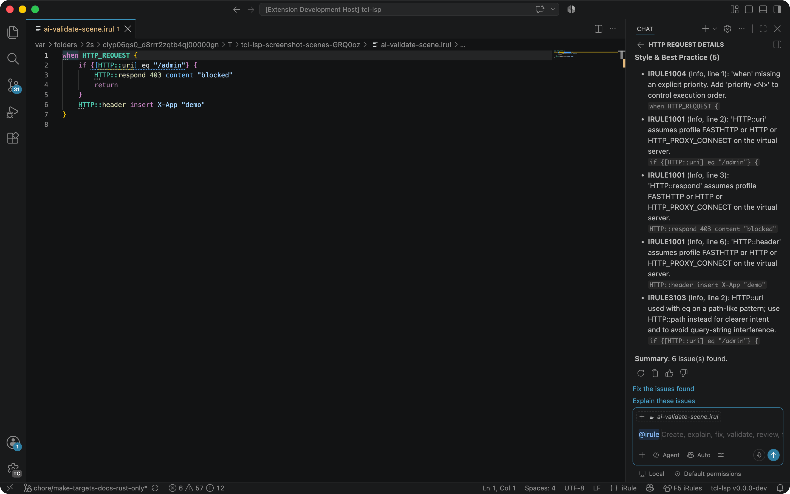
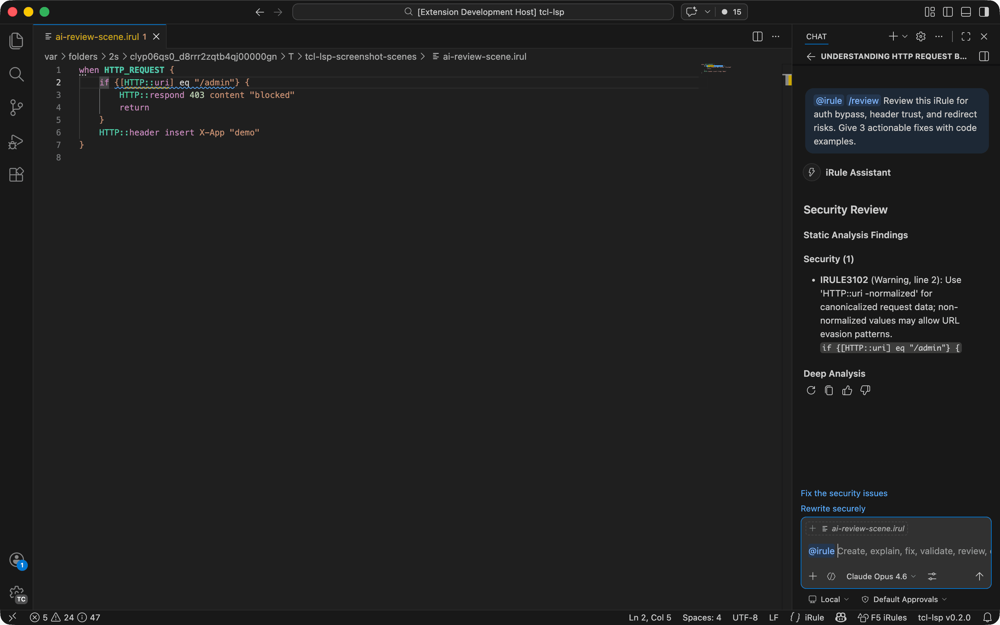
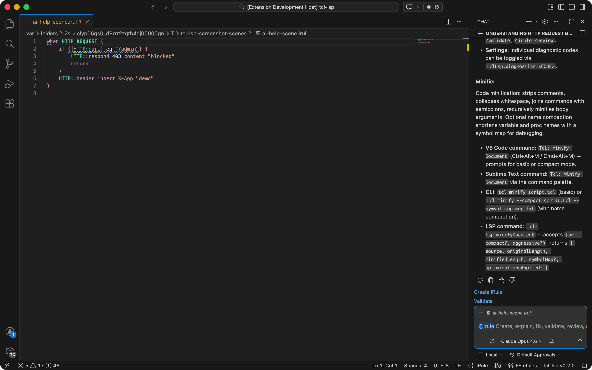

# KCS: feature — @irule Chat Participant

> **Audience:** User
> **Type:** Functionality

## Summary

VS Code Copilot Chat participant for creating, explaining, fixing, reviewing, and transforming F5 BIG-IP iRules.

## Applies to

Copilot Chat

## How to use

Type `@irule` in the Copilot Chat panel followed by a slash command:

| Command | Description |
|---------|-------------|
| `/create` | Create a new iRule from a description |
| `/explain` | Explain what an iRule does |
| `/fix` | Fix issues found by the LSP |
| `/validate` | Run LSP diagnostics |
| `/review` | Security and safety review |
| `/find-legacy` | Find and modernise legacy patterns (matchclass, unbraced expr) |
| `/optimise` | Apply LSP optimisations with explanations |
| `/scaffold` | Generate an iRule skeleton from events |
| `/datagroup` | Suggest data-group extraction for inline lookups |
| `/diff` | Compare two iRule versions |
| `/event` | Event and command reference |
| `/diagram` | Generate a Mermaid flowchart of the iRule logic |
| `/test` | Generate a test script with the Event Orchestrator framework |
| `/migrate` | Convert nginx/Apache/HAProxy config to an iRule |
| `/xc` | Translate to F5 XC routes and service policies |
| `/help` | Show available features and commands |

Or ask a free-form iRules question without a slash command.

## Operational context

The chat participant uses the LSP server for diagnostics, symbols, and optimisations, then sends the analysis context to the language model. The agentic loop can iteratively fix code until diagnostics are clean. Requires `tclLsp.ai.enabled` to be true.

## Failure modes

- AI features disabled (`tclLsp.ai.enabled` is false).
- Copilot extension not installed.

## Example

## Discoverability

- [KCS feature index](README.md)
- [VS Code extension contracts](../../../docs/design/contracts/vscode-extension.md)
