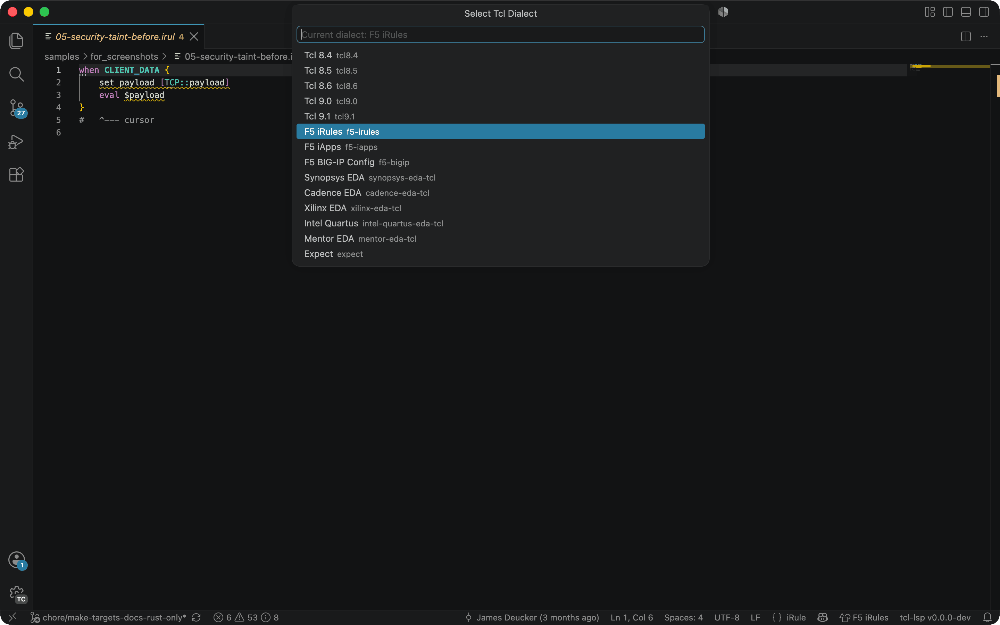

# KCS: feature — Dialect Selection

> **Audience:** User
> **Type:** Functionality

## Summary

Pick what a file is analysed as: a language (a Tcl release, F5 iRules/iApps/tmsh/BIG-IP, Jim Tcl, BPF-Tcl, Expect, or a SpecTcl/SslicTcl declaration) or a tool environment — a Tcl release plus its library packages, such as Tk or an EDA shell like Vivado. The choice decides which commands, diagnostics and event metadata apply.

## Applies to

MCP, all-editors

## How to use

- **VS Code**: Run **Tcl: Select Dialect** from the Command Palette and pick one. The picker has two groups:
  <!-- <generated: kcs-dialect-groups> -->
  - **Dialects**: `bpf`, `expect`, `f5-bigip`, `f5-iapps`, `f5-irules`, `f5-tmsh`, `jim`, `spectcl`, `sslictcl`, `tcl8.4`, `tcl8.5`, `tcl8.6`, `tcl9.0`, `tcl9.1`.
  - **Tcl + packages**: `cadence-eda-tcl`, `intel-quartus-eda-tcl`, `mentor-eda-tcl`, `microchip-libero-eda-tcl`, `synopsys-eda-tcl`, `tk`, `xilinx-eda-tcl`.
  <!-- </generated> -->
- **Other editors**: Set `tclLsp.dialect` in workspace settings.
- **MCP**: Call `set_dialect` with the dialect name.
- **CLI**: Pass `--dialect NAME` to the `tcl` binary.
- **Automatic**: each dialect owns its file extensions, and some own a shebang interpreter. A `# tcl-dialect: NAME` comment in the first five lines pins one file. It accepts any environment name or alias, such as `tk`, `wish`, or `irules`, and any name a loaded SpecTcl pack declares. A SpecTcl pack can also route further extensions with a `file_extension` row. The built-in routes are:
  <!-- <generated: kcs-dialect-detection> -->
  - **Extensions and file names**: `.exp`/`.expect` → expect; `.scf`/`bigip.conf`/`bigip_base.conf`/`bigip_gtm.conf`/`bigip_script.conf`/`bigip_user.conf` → f5-bigip; `.iapp`/`.iappimpl`/`.impl`/`.apl`/`presentation` → f5-iapps; `.irul`/`.irule`/`.irules` → f5-irules; `.tmsh` → f5-tmsh; `.tclspec` → spectcl; `.sslictcl` → sslictcl; `.globals` → cadence-eda-tcl; `.qsf`/`.qpf`/`.qip` → intel-quartus-eda-tcl; `.do` → mentor-eda-tcl; `.sdc`/`.upf` → synopsys-eda-tcl; `.xdc` → xilinx-eda-tcl.
  - **Shebang line**: `expect` → expect; `jimsh` → jim; `tclsh8.4`/`wish8.4` → tcl8.4; `tclsh8.5`/`wish8.5` → tcl8.5; `tclsh8.6`/`wish8.6` → tcl8.6; `tclsh9.0`/`wish9.0` → tcl9.0; `tclsh9.1`/`wish9.1` → tcl9.1; `wish` → tk.
  - **No automatic route**: `bpf` and `microchip-libero-eda-tcl` own no extension, file name, or shebang word. Pick them with the setting or a `# tcl-dialect:` comment.
  <!-- </generated> -->

## Operational context

A host can also pin **one document** to a dialect, without disturbing any other
buffer, by calling `tcl-lsp.setDocumentDialectOverride` with the document's URI
and a dialect name (a `null` or absent second argument releases it). That
override is the strongest tier — above the language id and the
`# tcl-dialect:` comment — because a host that names one exact URI has already
decided. The Spec Studio uses it so its sample buffer follows the studio's own
dialect selector; the two older commands (`tcl-lsp.setDialect`,
`tcl-lsp.setSessionDialectOverride`) are session-wide and would re-tag every
open buffer instead.

The dialect controls which commands are available in completions and hover, which diagnostic rules apply, and which event metadata is loaded. iRules dialects enable iRules-specific commands (HTTP::, IP::, etc.) and event handlers.

## Failure modes

- Wrong dialect produces false-positive diagnostics.
- Dialect not persisted across restarts.

## Example

## Discoverability

- [KCS feature index](README.md)
- [Command registry event model](../../../docs/design/contracts/command-registry-event-model.md)
