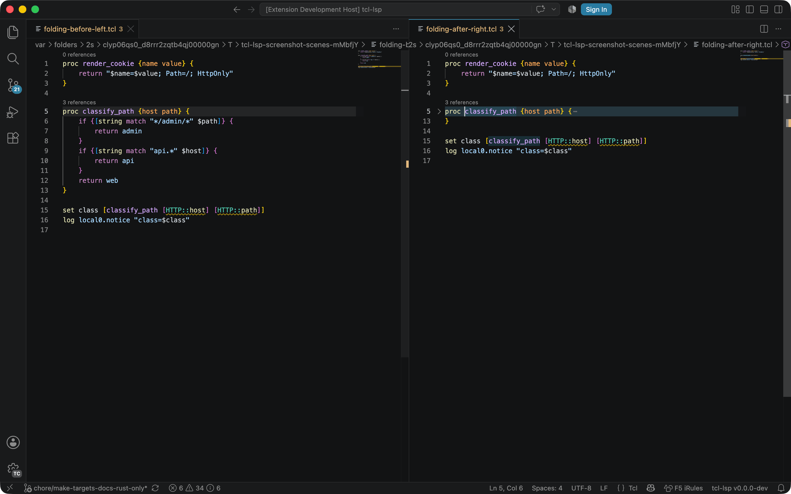

# KCS: feature — Folding

> **Audience:** User
> **Type:** Functionality

## Summary

Code folding for procs, namespaces, event handlers, and braced blocks.

## Applies to

all-editors, analyser

## How to use

- **Editor**: Click fold markers in the gutter or use Ctrl+Shift+[ to fold.
- **Settings**: Toggle with `tclLsp.features.folding`. Defaults to on and
  deliberately does not inherit `editor.folding` — sticky scroll consumes
  folding ranges even when the folding UI is off.

## Operational context

Folding ranges are computed from the parsed AST, identifying proc bodies, namespace blocks, `when` event handlers, and multi-line braced expressions.

BIG-IP configs (`bigip.conf` and friends) are not Tcl source, so they fold on
their own path: a brace-balanced scan of the stanza tree that folds every
multi-line `{ … }` region at any depth — `ltm virtual … { … }`, the
`profiles` / `records` / `members` blocks nested in it, and the Tcl inside an
`ltm rule` body — plus the same comment-block folds the Tcl provider emits.

In VS Code the folding ranges also drive **sticky scroll**. The extension
contributes `"editor.stickyScroll.defaultModel": "foldingProviderModel"` as a
language-scoped default for every Tcl language, because the outline model
pins nothing useful for a script whose top level is `if` / `for` / `foreach`,
and pins the wrong stanza for a BIG-IP config. A language-scoped user setting
(under `"[tcl]"`) overrides that default outright; if you set the option
globally, the extension asks once whether to honour your choice for Tcl too —
see [the sticky-scroll KCS note](../kcs-issue-sticky-scroll-shows-nothing.md).

The server never returns an empty folding list. When the feature is disabled,
the document is unknown, or there is nothing to fold, it answers `null`, so
the folding UI falls back to indentation folding and sticky scroll falls
through to its indentation model. It also sends
`workspace/foldingRange/refresh` once after the initial workspace scan, so a
sticky model computed before the provider registered is recomputed against
real data.

## Failure modes

- Folding ranges missing or incorrect after parser changes.
- Sticky scroll blank in VS Code when the folding provider ends up with
  no data — see
  [Sticky scroll shows nothing in VS Code](../kcs-issue-sticky-scroll-shows-nothing.md).

## Example

## Discoverability

- [KCS feature index](README.md)
- [LSP feature providers](../../../docs/design/contracts/lsp-feature-providers.md)
