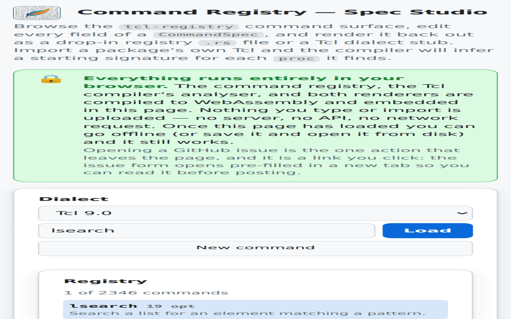
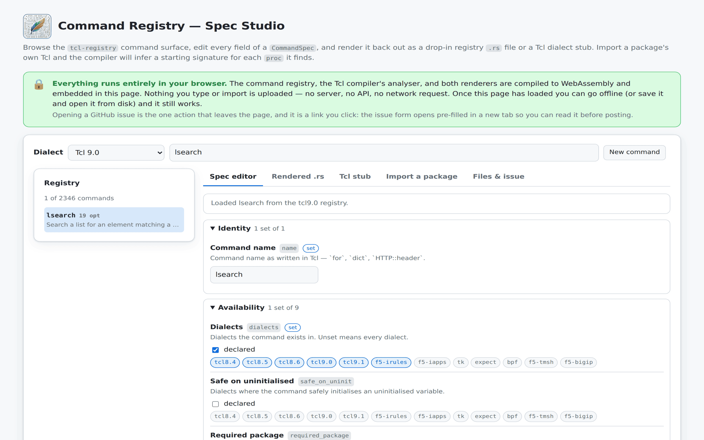
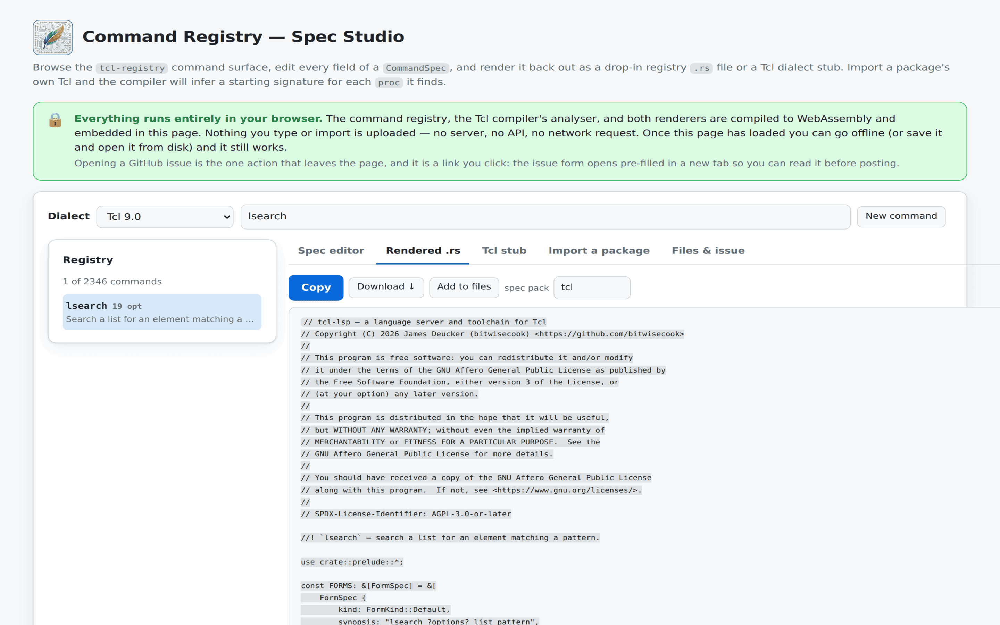
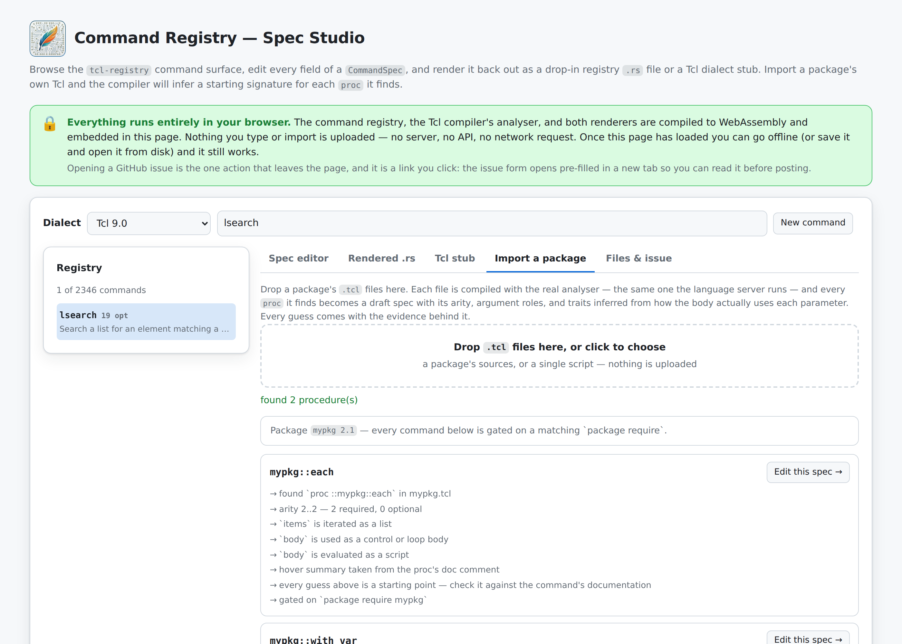

# KCS: feature — Command Registry Spec Studio

> **Audience:** User
> **Type:** Functionality

## Summary

A browser page for exploring the command registry: browse every command tcl-lsp knows, edit any field of its command specification, and render the result back out as a drop-in registry `.rs` file or a Tcl dialect stub.

## Applies to

tcl-lsp CLI

## Availability

| Context | How |
|---------|-----|
| Hosted | <https://bitwisecook.github.io/tcl-lsp/spec-studio/> |
| Local | `make spec-studio-wasm`, then serve `rust/tcl-spec-studio-wasm/dist/` (for example `cd rust/tcl-spec-studio-wasm/dist && python3 -m http.server`) and open it |

## How to use

The studio is a small directory of files: `index.html` (which carries the
registry, the analyser, and both renderers inside it), the code editor, and the
Tcl language server. Serve that directory and everything works — including
offline once the page has loaded.

Opening `index.html` straight off disk still works for browsing, editing,
rendering, and importing files: browsers block the editor and the language
server on `file://` URLs, so the page falls back to its plain text editor and
says so. Serve the directory to get the full editor.

1. **Pick a dialect** at the top left. The registry browser underneath is
   that dialect's real command surface, so Tcl 8.4 shows what Tcl 8.4 has. It
   is grouped by **pack** — the directory each command's specification is
   written in: Tcl core first, then the libraries that layer on it (the
   standard library, Tcllib, Tk, …), then the vendor and authoring surfaces.
   Only the packs the dialect actually reaches are listed, and the count line
   above says what you are looking at: `187 Tcl 9.0 commands in 4 packs`. A
   pack you are building yourself is the first section, not a separate panel.
2. **Open a pack and choose a command** to load its live specification into
   the form, or press **New command** to start from scratch. Sections start
   closed except the one holding the command you have open; a section you
   open or close yourself stays that way across dialect switches and reloads,
   as part of live save. Each section's **?** says what the pack holds and
   where it lives in the repository, which is the directory a rendered `.rs`
   file goes into. Typing in the filter box narrows the browser to the packs
   with a match — each header reads `12 of 96`, and the count line becomes
   `12 of 187 Tcl 9.0 commands, in 3 packs`. If you already know the name,
   type it into the same box and press **Load** (or Enter); the box also
   offers the matching names as you type. An ambiguous or unknown name is
   reported rather than guessed at, since loading the wrong command silently
   is worse than saying nothing matched.

   A few names are specified in more than one pack — `close` is one
   specification in Tcl core, another in Expect, a third in iRules — and the
   dialect decides which one you get. The line above the form names that pack
   as a chip and says which other packs declare the name, so you are editing
   the one you meant.
3. **Edit any field.** The form is grouped — Identity, Availability, Arity and
   arguments, Types, and so on. A field that differs from the default is
   marked **set**, and each group heading counts how many of its fields are
   set, so what a command actually declares is visible at a glance. Every
   group and every field carries a **?** button that opens a plain-language
   explanation, written for Tcl developers, with a short Tcl example of that
   setting rather than Rust.
4. **Read the output** on the **Rendered .rs** and **Tcl stub** tabs. Both
   update as you type.
5. **Copy** it, **Download** it, or **Add to files** to collect several
   artefacts together.
6. **Files & issue** downloads the collected files and opens a pre-filled
   GitHub issue so you can propose the spec.

### On a phone

The studio is usable on a phone, not merely reachable from one. Below 34rem
every toolbar control takes the full width, the tab strip scrolls sideways
instead of stacking, and touch targets meet the 44px minimum. The registry
browser sits below the editor rather than beside it — which is why typing a
name and pressing **Load** matters there: the browser is off-screen, so
filtering alone would look like nothing had happened.



### Looking things up: the Reference tab

The **Reference** tab holds the registry's whole vocabulary behind one
search box: every specification field, every behavioural trait, every
argument role, every taint colour, and the rest of the picker catalogues,
each with what it means and what it drives. Searching "taint" finds the
taint fields and every taint colour; searching "upvar" finds the traits
and fields about scope aliasing. The same text sits behind the form's
**?** buttons, so nothing has to be learned in two places.

Every entry comes with a worked example: a few lines of Tcl with an arrow
under each word that matters, numbered in the order Tcl runs them. The
example is of that setting, not of its group. `arity` shows `incr` taking
one word, then two, then one too many:

```text
incr count
     └────→ 1. Arity — one argument after the name meets the minimum of 1
incr count 5
           └─→ 2. Arity — a second reaches the maximum of 2
incr count 5 extra
             └────→ 3. Arity — a third draws the wrong # args diagnostic
```

Dropdown values get the same treatment. Each trait, argument role, taint
colour, side-effect target, and type shows its own Tcl program, so choosing
between two similar values is a matter of reading two examples rather than
two definitions. A few smaller
pickers — body kind, script timing, the compiler hook names — still share
their catalogue's one example.

### Nothing you type is uploaded

The command registry, the Tcl compiler's analyser, both renderers, and the Tcl
language server are compiled to WebAssembly and served from the page's own
directory. Its content security policy allows the page to reach exactly two
outside hosts — `api.github.com` and `codeload.github.com` — and only one
feature can use them: the **Fetch releases from GitHub** panel described below,
which acts only when you fill it in and press the button. Nothing else on the
page can make a network request, so an unreleased command or a proprietary
package you import stays on your machine.

If you would rather the page never reach the network at all, do not use that
panel: download the release archives yourself and upload them, which does
exactly the same thing offline.

Opening a GitHub issue is the other action that leaves the page, and it is a
link you click: the issue form opens pre-filled in a new tab so you can read it
before posting.

### Importing a package

The **Import a package** tab takes a package's own `.tcl` files. Each is
compiled with the real analyser — the same one the language server runs — and
every `proc` it finds becomes a draft specification:

- **Arity** comes from the parameter list. Parameters without a default are
  required, ones with a default are optional, and a trailing `args` makes the
  command variadic.
- **Argument roles** come from how each parameter is *used* in the body:
  evaluated as a script, `upvar`'d and written, iterated as a list, invoked as
  a command.
- **Traits** come from the same evidence — a parameter evaluated as a script
  makes the command a dynamic barrier, an `upvar`'d write makes it a
  scope-alias creator.
- **Hover text** comes from the `proc`'s doc comment, and **package gating**
  from `package provide`.

Every guess is listed with the evidence behind it, so you can accept it or
overrule it. They are a starting point, not an assertion.

### Importing several releases, to get version ranges

One snapshot can only say what a package looks like *now*. Switch the Import
tab to **Several releases → version ranges** and add one `.zip` per release —
GitHub's **Download ZIP** of a tag, a release asset, or any archive holding the
sources. Each archive gets a version label, guessed from its file name and
editable: the labels are what every range is derived from, so check them.

The studio then drafts each release independently and diffs them, so
`introduced_version` is the first release that actually *witnesses* the command
appearing, and `retired_version` the first release it is gone from. Each command
shows the bounds it ended up with and, underneath, the notes explaining how each
one was reached — a derived bound with no reasoning beside it would not be
checkable, so the reasoning is not hidden.

**These archives are every release this package ever had** is off by default,
and it changes one thing: with it off, a command present in your oldest archive
only proves it existed *as far back as you looked*, so no `introduced_version`
is recorded and a note says the introduction is unknown. Turn it on only when
the oldest archive really is the package's first release.

The same derivation is available outside the browser as `tcl spec import` — see
[how to derive version ranges from release
history](../kcs-howto-derive-version-ranges-from-releases.md).

### Fetching releases from GitHub

Beneath the archive list is the studio's one networked feature, walled off and
labelled as such. Give it `owner/repo` (or paste a GitHub URL), press **List the
tags**, pick the releases you want, and press **Download the selected
releases**: it fetches each tag's source archive straight from
`codeload.github.com` into your browser and stages it like an uploaded one.

It is unauthenticated, so GitHub's shared limit of 60 requests an hour applies;
when you hit it the panel says so and gives the time it resets. Any failure —
rate limit, a repository that does not exist, a network that is not there —
points you back at the upload path, which needs no network at all.

### The Pack DSL tab

Beside the form, `.rs` module, and stub, the **Pack DSL** tab holds the
[SpecTcl pack](../../design/spec-packs.md)'s `.tclspec` source directly —
the studio's one authoritative document for a pack you are building.
Edit a field in the form and the DSL text updates; edit the text and the
form, the pack's section of the browser, and the collision report all
follow. Open an existing `.tclspec` with **Open a .tclspec…**, or start one
from scratch
and **Download** or **Add to files** when you are done. **Re-render
canonically** rebuilds the whole document from its commands — useful
after a lot of form editing, at the cost of your own comments and layout.

The editing surface is Monaco — the same editor component VS Code is built
on — and behind it runs **the actual Tcl language server**, compiled to
WebAssembly and running in a Web Worker inside your browser. It is not a
lookalike: it is the same server binary your editor talks to, so the
colouring, hovers, completions, diagnostics, and formatting you get here
are exactly what you would get in VS Code, Neovim, or JetBrains. The
**Test** tab's Tcl sample gets the same treatment, opened under whichever
dialect the selector at the top of the page names.

The status line under the editor says what is running. If the language
server cannot start — an old browser, WebAssembly turned off, the page
opened from `file://` — the page says so and falls back to a plain text
editor with the pack's own highlighting and validation, so nothing is
silently missing.

### Tk input, callback, geometry, and method metadata

The studio preserves seven Tk-relevant registry facts added in SpecTcl 1.2:

- For a value-taking option, **external input link** sets
  `OptionArg.taints_var_write`. Use it only when the named variable can receive
  user input, such as an entry's `-textvariable`; leave it off for a label's
  display-only link.
- A variable-valued option's **variable scope** selects `CurrentFrame` or
  `Global`. Tk `-textvariable` and `-variable` links are global even when the
  constructor is called inside a procedure.
- **Advanced → Tk geometry manager** sets `CommandSpec.tk_geometry`. Use
  `PACK_GEOMETRY`, `GRID_GEOMETRY`, or `PLACE_GEOMETRY` for the built-ins. A
  custom descriptor records its container policy/option, whether the direct
  form places widgets, its placement subcommand, and every release subcommand.
- An executable option's **script timing** separates `SameInvocation` bodies
  and command prefixes from `Deferred` callbacks and `ReferenceOnly` text
  matched by removal forms without being run or stored. Scope remains a
  separate `body_kind` choice for Body values.
- A deferred executable option's **callback external inputs**, or the
  command/subcommand `callback_taint_inputs` table, lists only user-controlled
  substitutions such as `%P`, `%s`, `%S`, `%A`, and `%K`. Framework metadata
  such as `%W` and `%V` is rejected rather than promoted to a taint source.
- **Advanced → Script-timing resolver** handles positional forms whose timing
  depends on their arguments. In SpecTcl it is a `{words ctx}` hook that emits
  `timing IDX SameInvocation|Deferred|ReferenceOnly`; in Rust it is the
  corresponding function pointer. The index must already be classified as
  `Body`, `LambdaLiteral`, or `CommandPrefix`.
- An object's **method prefix matching** is `Strict` by default. Set it to
  `Enabled` only when the runtime accepts unambiguous method prefixes, as Tk's
  source-proven widget command tables do.

The equivalent SpecTcl is short:

```tcl
speclib tk-extra 1.2 {
    command entrylike {
        traits TAINTS_VAR_WRITES
        option -textvariable -takes variable -role VarWrite \
            -also-role VarRead -taints-var-write -variable-scope Global
        option -validatecommand -takes script -role Body \
            -body-kind Structural -script-timing Deferred \
            -callback-taint-inputs {%P %s %S}
    }
    command buttonlike {
        option -command -takes script -role Body -body-kind Structural \
            -script-timing Deferred
        object_class ::example::Button -method-prefix-matching Enabled {
            method activate { arity 0 }
        }
    }
    command layout {
        tk_geometry Exclusive -container-option {-in} -direct-form \
            -placement-subcommand configure -release-subcommands {forget}
    }
    command sendlike {
        arg 1 -role Body
        script_timing_resolver {words ctx} {
            if {[lindex $words 0] eq "later"} {
                timing 1 Deferred
            } else {
                timing 1 SameInvocation
            }
        }
    }
    command removelike {
        arg 1 -role CommandPrefix
        script_timing_resolver {words ctx} {
            timing 1 ReferenceOnly
        }
    }
    command bindlike {
        traits DEFERS_BODY
        arity 2
        arg 1 -role Body
        callback_taint_inputs {{1 {%A %K}}}
    }
}
```

The rendered Rust carries the same facts:

```rust
const VALIDATION_INPUTS: &[CallbackTaintInput] = &[
    CallbackTaintInput::TK_PROPOSED_VALUE,
    CallbackTaintInput::TK_CURRENT_VALUE,
    CallbackTaintInput::TK_EDIT_TEXT,
];
const EVENT_INPUTS: &[CallbackTaintInput] = &[
    CallbackTaintInput::TK_EVENT_CHAR,
    CallbackTaintInput::TK_EVENT_KEYSYM,
];
static ENTRYLIKE_OPTIONS: &[OptionSpec] = &[
    OptionSpec {
        name: "-textvariable",
        value: OptionValue::user_input_var(),
        ..OptionSpec::DEFAULT
    },
    OptionSpec {
        name: "-validatecommand",
        value: OptionValue::deferred_tainted_script(VALIDATION_INPUTS),
        ..OptionSpec::DEFAULT
    },
];
static BUTTONLIKE_OPTIONS: &[OptionSpec] = &[
    OptionSpec {
        name: "-command",
        value: OptionValue::deferred_script(),
        ..OptionSpec::DEFAULT
    },
];
static BUTTON_METHODS: &[SubCommand] = &[SubCommand {
    name: "activate",
    arity: Arity::exact(0),
    ..SubCommand::DEFAULT
}];
static CLASS: ObjectClassSpec = ObjectClassSpec {
    class_name: "::example::Button",
    instance_methods: BUTTON_METHODS,
    superclasses: &[],
    allow_unknown_methods: false,
    method_prefix_matching: PrefixMatching::Enabled,
};
let entrylike = CommandSpec {
    name: "entrylike",
    traits: Traits::TAINTS_VAR_WRITES,
    options: ENTRYLIKE_OPTIONS,
    ..CommandSpec::DEFAULT
};
let buttonlike = CommandSpec {
    name: "buttonlike",
    options: BUTTONLIKE_OPTIONS,
    object_class: Some(&CLASS),
    ..CommandSpec::DEFAULT
};
let layout = CommandSpec {
    name: "layout",
    tk_geometry: Some(crate::tk_geometry::PACK_GEOMETRY),
    ..CommandSpec::DEFAULT
};

fn sendlike_timing(args: &[&str]) -> Vec<(u8, ScriptTiming)> {
    vec![(1, if args.first() == Some(&"later") {
        ScriptTiming::Deferred
    } else {
        ScriptTiming::SameInvocation
    })]
}
let sendlike = CommandSpec {
    name: "sendlike",
    arg_roles: &[(1, ArgRole::Body)],
    script_timing_resolver: Some(sendlike_timing),
    ..CommandSpec::DEFAULT
};
fn removelike_timing(_args: &[&str]) -> Vec<(u8, ScriptTiming)> {
    vec![(1, ScriptTiming::ReferenceOnly)]
}
let removelike = CommandSpec {
    name: "removelike",
    arg_roles: &[(1, ArgRole::CommandPrefix)],
    script_timing_resolver: Some(removelike_timing),
    ..CommandSpec::DEFAULT
};
let bindlike = CommandSpec {
    name: "bindlike",
    traits: Traits::DEFERS_BODY,
    arity: Arity::exact(2),
    arg_roles: &[(1, ArgRole::Body)],
    callback_taint_inputs: &[(1, EVENT_INPUTS)],
    ..CommandSpec::DEFAULT
};
```

Editing either representation and re-rendering must retain the fact. The
registry-wide round-trip gate checks every shipped command, while the schema
coverage gate checks that every `CommandSpec` and nested option field has a
studio surface.

### What a stub cannot carry

The stub language is deliberately narrower than a command specification: it
has no subcommands, options, types, or hooks. Anything a stub cannot express
is written as a comment beside it rather than dropped silently, so what the
stub does *not* say stays visible.

### Fields the studio cannot read back

A few specification fields hold a function pointer or a reference to a static
descriptor. Rust can tell such a field is set but not recover the *expression*
that set it. Those are listed in a warning above the form and emitted as a
`TODO` in the rendered file, so behaviour the original command had is never
dropped without saying so. Fill the expression in under **Advanced** to emit
it.

## Example

Loading `lsearch` from the Tcl 9.0 registry shows its declared dialects,
19 options, and the rest of its specification in the generated form:



The **Rendered .rs** tab produces a complete registry module, copyright banner
included:



Importing a two-`proc` package infers a signature for each, with the evidence
behind every guess:



For a small package like:

```tcl
package provide mypkg 2.1
# Evaluate a script with a caller variable bound to a fresh value.
proc mypkg::with_var {varName script {mode fast}} {
    upvar 1 $varName v
    set v 1
    uplevel 1 $script
}
```

the studio infers arity `2..3`, an argument role of `VarWrite` on `varName`
and `Body` on `script`, the `EVALUATES_CODE` and `CREATES_SCOPE_ALIAS` traits,
and a `package require mypkg` gate — reporting, for each, the line of
reasoning that produced it.

## See also

- [How to create a command spec without knowing Rust](../kcs-howto-create-command-specs-without-rust.md)
  — the step-by-step path from "my command is unknown" to a proposed spec.
- [The command registry contract](../../design/compiler/command-registry.md) —
  the full field reference.
- [The spec studio design doc](../../design/contracts/command-spec-studio.md) —
  how the schema, draft model, and renderers fit together.
- [Dialect command stubs](../../design/contracts/dialect-stubs.md) — the stub
  language the studio emits.
- [SpecTcl pack design](../../design/spec-packs.md) — the `.tclspec`
  authoring format the studio's Pack DSL tab reads and writes.
- [How to write a SpecTcl pack](../kcs-howto-write-a-tclspec-pack.md) —
  write one by hand today.
