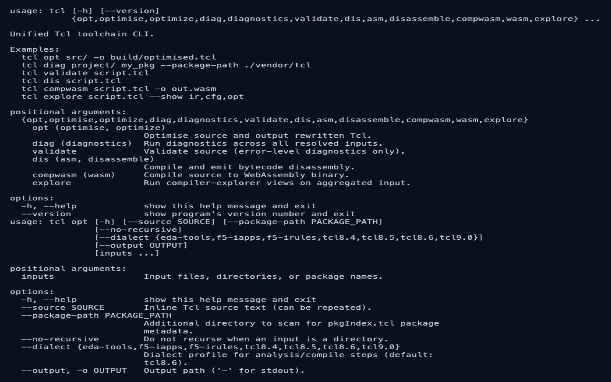

# KCS: feature — Unified Tcl Verb CLI

> **Audience:** User
> **Type:** Functionality

## Summary

The native `tcl` binary provides a single verb-based CLI for optimisation, diagnostics/linting, validation, formatting, symbol/graph extraction, iRules event metadata lookups, legacy-pattern conversion guidance, disassembly, syntax highlighting, WASM compilation, compiler exploration, and KCS help search.

## Applies to

tcl-lsp CLI, Claude skill, MCP

## How to use

```sh
tcl opt src/ -o build/optimised.tcl
tcl diag src/ mypkg --package-path ./vendor/tcl
tcl lint src/ mypkg --package-path ./vendor/tcl
tcl validate src/
tcl validate src/ --json
tcl format script.tcl -o formatted.tcl
tcl symbols script.tcl --json
tcl diagram script.tcl --json
tcl callgraph script.tcl --json
tcl symbolgraph script.tcl --json
tcl dataflow script.tcl --json
f5 irule event-order rule.irule --json
f5 irule event-info HTTP_REQUEST --json
tcl command-info HTTP::uri --dialect f5-irules --json
tcl find-legacy rule.irule --json
tcl dis script.tcl
tcl compwasm script.tcl -o out.wasm --wat-output out.wat
tcl compwasm script.tcl --codegen-passes native-tier -o out.wasm
tcl highlight script.tcl --colour
tcl highlight script.tcl --format html -o out.html
tcl diff old.irule new.irule --show ast,ir,cfg
tcl explore script.tcl --show ir,cfg,opt
tcl explore script.tcl --json --codegen-passes native-lowering,cell-demotion
tcl help taint analysis --dialect f5-irules
tcl help taint --json
tcl spec test pack.tclspec --package demo

# Package management and virtual environments (tclpkg)
tcl pkg init --name myapp --version 1.0.0
tcl pkg discover --add
tcl pkg install
tcl pkg list --json
tcl pkg tree
tcl pkg verify
tcl pkg info json
tcl pkg search json --json

tcl venv create .venv --tcl 8.6
tcl venv info .venv
tcl venv delete .venv
```

## Example

```
$ tcl validate good.tcl
validation ok

$ tcl validate broken.tcl
broken.tcl:1:1: error   E002     Too few arguments for 'proc': expected at least 3, got 1 — usage: proc name args body
broken.tcl:1:6: error   E203     missing close-brace
validation failed: 2 error(s)
```

`validate` reports error-severity diagnostics only and exits 1 when it finds
any, which is the shape a CI step wants.



## Operational context

- Crate: `rust/tcl-cli` (produces the `tcl` binary); the iRules `event-order` /
  `event-info` verbs live in `rust/f5-cli`, which builds as `f5-query` and
  installs as `f5`.
- Build command: `cargo build --release -p tcl-cli`
- Make target: `make rust-tcl` (`make rust-clis` builds `tcl` and `f5-query` together)
- The KCS help database is indexed into the binary at build time by
  `rust/tcl-cli/build.rs` (no separate `kcs-db` step).
- Shared metadata lookups for `event-info` / `command-info` are provided by the
  reconciled command registry (`tcl-registry` / `tcl-compiler`) and reused by
  CLI and AI consumers.
- Invocation name contract: when invoked as `irule` (symlink/rename), the CLI
  uses `irule` for usage/version text and defaults dialect to `f5-irules`.

## Input resolution contract

- Positional inputs may be:
  - source files (`.tcl`, `.tk`, `.itcl`, `.tm`, `.irul`, `.irule`, `.iapp`, `.iappimpl`, `.impl`, `pkgIndex.tcl`)
  - directories (recursively scanned by default)
  - package names (resolved via `pkgIndex.tcl` scanning)
- `--package-path` adds package search roots.
- `--source` can be repeated for inline source chunks.
- If no inputs are provided and stdin is piped, stdin is consumed as input.

## Verb contracts

- `opt`: applies the optimiser rewrites the inputs' policy shows and emits rewritten Tcl. `--profile` picks the profile, and it wins over every configuration file. Without `--profile`, the project file supplies the default: the `[optimiser] profile` in the input file's own `.tcl-lsp.ini`, then the one in the global `config.ini`, then `full`. The profile also sets the passes: `aggressive` repeats until nothing changes, and every other profile runs once. `--disable` and `--enable` are the invocation layer over the global `config.ini`, under each input file's own `.tcl-lsp.ini`; a `# noqa` on a command or a top-of-file `# tcl-lsp: disable=` keeps a rewrite off exactly as it keeps a squiggle off. Each input is optimised as its own program under its own policy and the outputs joined; the summary names each file's rewrites.
- `diag`: runs diagnostics over each resolved document and reports findings — the same producers and the same policy the editor publishes under. Each file resolves its own layers: the global `config.ini`, `--disable` / `--enable` in the editor layer's slot, and the nearest `.tcl-lsp.ini` above the file (an inline `--source` has no project layer). The catalogue's default-off codes (W242) are off until a layer turns them on. `--show-suppressed` also lists what the policy hides: every suppressed finding with its reason, every code a layer or a top-of-file directive turned off, and the optimiser `diag` never runs, as one row per reason — so a missing diagnostic has an answer.
- `lint`: runs the same diagnostics pass as `diag` with lint-oriented naming.
- `validate`: reports error-severity diagnostics only, from the same shown set as `diag` (non-zero on any error, `--json` supported).
- `format`: reformats resolved source using the shared Tcl formatter and emits rewritten Tcl.
- `symbols`: emits symbol definitions from analyser scope data (`--json` supported).
- `diagram`: emits diagram extraction data from compiler IR (`--json` supported).
- `callgraph`: emits procedure call graph data (`--json` supported).
- `symbolgraph`: emits symbol relationship graph data (`--json` supported).
- `dataflow`: emits taint/effect data-flow graph data (`--json` supported).
- `f5 irule event-order`: emits events found in source ordered by canonical iRules firing order (`--json` supported).
- `f5 irule event-info`: emits iRules event metadata and valid command counts for a named event (`--json` supported).
- `command-info`: emits command registry metadata for a named command and dialect (`--json` supported).
- `find-legacy`: emits diagnostics that map to known modernisation rewrites (`--json` supported, detection only — use `opt` to apply rewrites).
- `dis`: compiles resolved source and emits bytecode disassembly.
- `compwasm`: compiles resolved source to a WASM binary (`--wat-output` optional). `--codegen-passes` selects the semantic/AOT codegen optimisation passes the emitter may use — individual pass ids, or the `native-tier` / `all` groups; omitted, no pass runs and the emitter produces the generic lowering. It is distinct from `dis --optimise`, which runs the *source-rewrite* optimiser.
- `highlight`: emits syntax-highlighted output in ANSI or HTML (`--format`, `--colour`, `--no-colour`).
- `diff`: compares two inputs at parser AST, lowered IR, and CFG layers (`--show` and `--json` supported).
- `explore`: forwards combined source into compiler-explorer views. `--codegen-passes` applies to the `wasm` views, and the `semanticOptimisations` view lists every pass with the state the shown module was built with.
- `help`: searches the KCS help database embedded in the binary at build time and reports KCS feature matches (`--dialect` optionally narrows matches).
- `spec test`: holds a `.tclspec` pack's declared facts to the Tcl package they describe, in a real shell (`--tclsh`, else `TCL_VENV` or the newest `tclsh` on `PATH`; reach the package with `TCLLIBPATH`). It requires the package (`--package`, else the one every command's `required_package` names), then asks each command: its arity against the shell's `wrong # args` one word under the declared minimum, one over the declared maximum, and at the minimum and the maximum (the calls that must succeed pass the placeholder word `x`, so run it only for a package whose commands tolerate that); each `example` row against the answer and the declared `return_type` (checked for `Int`, `Double`, `Boolean`, `Numeric`, `List` and `Dict`, the types a shell can decide); a Tcl-body reference body against the command on the same examples, in a child interpreter; and a command declared `pure` against a write trace on every variable of every namespace (the globals and each namespace's own, such as a `variable cache` memo, but not the shell's own `::tcl`, where it keeps its history) during a second run of its examples, and against the variables it created or changed from its first question to its last. It prints one row per divergence (`COMMAND: KIND: what the pack said and what the shell did`), then a summary that counts the commands the shell actually asked. It exits 1 on any divergence, when the package cannot be required, and when the shell stopped before it had asked every command, whatever status the package left it with: the probe ends with a line that counts the commands asked, and a package that calls `exit 0` does not produce it. It exits 2, as every verb does for an error, when the pack is not a file, no `tclsh` can be found, or the shell does not finish within the timeout the policy allows. Requiring a package runs its Tcl, so the verb runs only for a package the package-manager policy opts in (`[build] allow-build-scripts = true` and `tcl pkg trust NAME`), through the same sandboxed chokepoint a build script uses (the environment scrubbed, a timeout, and the network denied where the host's confinement can enforce it). The policy is the operator's: the project's `tclpkg.toml`, where the project is the outermost directory at or above the working directory that holds a `tclpkg.tcl`, or the working directory itself, and never a directory the pack was found in, so a dependency vendored into the project cannot opt itself in, whether the verb is run from the project or from inside the dependency; a project nested inside another takes the outer project's policy. It is a CLI verb: nothing the editor runs ever executes the package a pack describes.

## Exit-code contract

- `0`: command succeeded.
- `1`: diagnostics found for `diag`/`lint`/`validate`, a divergence, a package that cannot be required or a shell that stopped before it had asked every command for `spec test`, semantic differences for `diff`, or unknown lookup target for `event-info`/`command-info`.
- `2`: input resolution failure or command execution error, including `spec test` finding no shell or a shell that outlives the policy's timeout.
