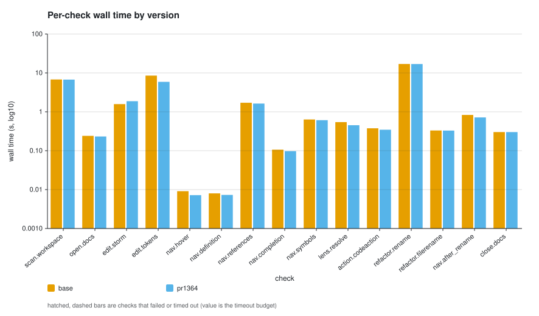
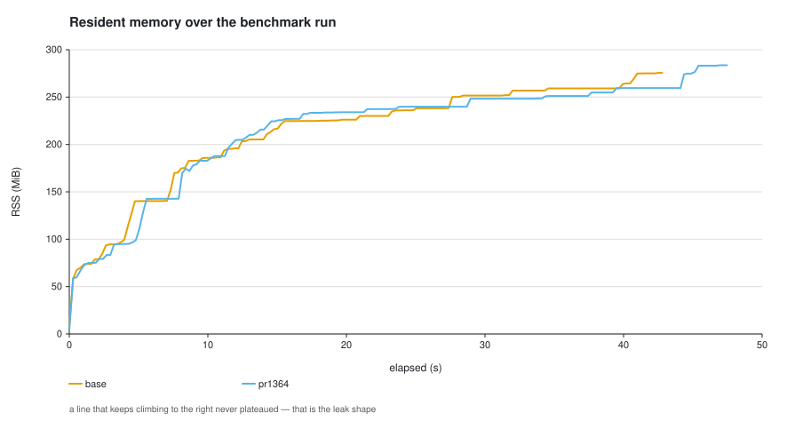
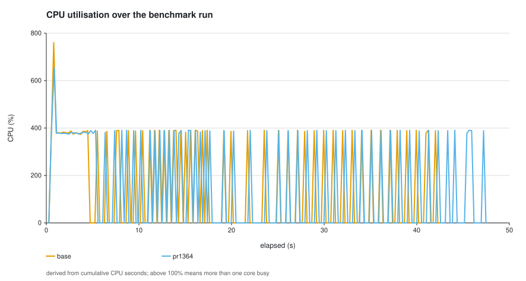

# Issue #1364 dispatch-stability proof — performance comparison

Base: `2e0d0d7` (`origin/rust` tip, including #1366). Candidate: `82002b9`.
Both built with the same Rust 1.97.1 toolchain and
`cargo build --locked --release -p tcl-lsp-server` in isolated worktrees with
separate target directories. The pinned #1181 `small` corpus contains 113 Tcl
files from 8 georgtree repositories (corpus revision 1).

Five measured pairs followed a discarded warm-up per build. Pair order
alternated base→candidate, then candidate→base, so monotonic drift in machine
state cannot systematically favour one build. Every run swept the machine for
competing `cargo test` processes first and recorded the load average it
started at. Values are median ± median absolute deviation (min–max). A
positive paired delta favours the base.

## Headline

| Metric | base | candidate | Median paired delta | Candidate wins |
|---|---:|---:|---:|---:|
| Total wall | 38.953 ± 0.770 s | 36.143 ± 0.128 s | **−7.2%** | 3/5 |
| Total CPU | 65.000 ± 3.000 s | 60.000 ± 1.000 s | **−7.7%** | 4/5 |
| Peak RSS | 290.520 ± 2.480 MiB | 284.809 ± 3.387 MiB | **−0.8%** | 4/5 |
| Failed checks | 0/15 | 0/15 | — | — |

## Per-check latency

| Check | base | candidate | Median paired delta | Candidate wins |
|---|---:|---:|---:|---:|
| `scan.workspace` | 6.831 ± 0.048 s | 6.684 ± 0.047 s | −2.1% | 4/5 |
| `open.docs` | 0.242 ± 0.008 s | 0.232 ± 0.012 s | −3.9% | 3/5 |
| `edit.storm` | 1.957 ± 0.378 s | 1.875 ± 0.105 s | −2.1% | 3/5 |
| `edit.tokens` | 8.531 ± 1.109 s | 6.151 ± 0.448 s | −20.6% | 4/5 |
| `nav.hover` | 0.009 ± 0.002 s | 0.007 ± 0.000 s | −26.4% | 4/5 |
| `nav.definition` | 0.009 ± 0.001 s | 0.009 ± 0.001 s | −3.7% | 3/5 |
| `nav.references` | 1.736 ± 0.067 s | 1.644 ± 0.014 s | −5.7% | 4/5 |
| `nav.completion` | 0.109 ± 0.003 s | 0.108 ± 0.011 s | −5.8% | 4/5 |
| `nav.symbols` | 0.650 ± 0.014 s | 0.612 ± 0.002 s | −4.2% | 5/5 |
| `lens.resolve` | 0.482 ± 0.011 s | 0.453 ± 0.005 s | −5.2% | 5/5 |
| `action.codeaction` | 0.377 ± 0.013 s | 0.346 ± 0.014 s | −8.5% | 4/5 |
| `refactor.rename` | 16.909 ± 0.133 s | 16.870 ± 0.045 s | +0.6% | 2/5 |
| `refactor.filerename` | 0.331 ± 0.002 s | 0.332 ± 0.003 s | +0.8% | 2/5 |
| `nav.after_rename` | 0.734 ± 0.027 s | 0.717 ± 0.023 s | −2.3% | 3/5 |
| `close.docs` | 0.301 ± 0.000 s | 0.301 ± 0.000 s | +0.0% | 2/5 |

## Reading

**The headline deltas above must not be attributed to the dispatch proof,
because the proof never runs on this corpus.** A census over the same 113
files, counting every function unit the compilation units expose, measured:

| Quantity | Count |
|---|---:|
| Function units analysed (`tcl9.0`) | 994 |
| World-state graphs built by the candidate | **0** |
| World-state graphs the base policy would build | 10 |
| O105 findings from the proof path | **0** |
| O105 findings from the legacy string classifier | 99 |

So the candidate performs no dispatch-stability analysis at all here, and
emits no O105 through the semantic path. The only work the change removes is
the base's ten world-graph constructions; the only work it adds is the entry
check that avoids them. A −7.7% CPU delta cannot be produced by that alone
without those ten units being unusually expensive, and this comparison does
not establish that they are. The honest conclusion is that the deltas are
dominated by run-to-run and environmental variation, and that **this corpus
cannot measure this feature**.

An earlier revision of this branch, before the entry-contract short-circuit,
measured **+12.8% wall and +11.5% CPU** against the *previous* base. That
figure is subject to the same caveat and was additionally taken on a machine
with intermittent competing load. Neither number is a trustworthy attribution.

### Why the proof never fires here

Real library Tcl puts almost nothing in a flat top-level statement sequence.
Top level holds `package require`, `namespace eval`, and `proc` definitions;
the `llength`/`format`/`lindex` calls that could be commoned live inside
procedure and method bodies, which carry the `UnknownWorld` entry contract and
therefore start at the lattice top, or inside `if`/`while`/`foreach`, which the
linear compatibility IR represents as opaque regions with no exact invocation
mapping. All ten units with a reusable-call candidate are of the first kind.

That is a statement about the feature's *reach*, not its correctness: every
abstention above is deliberate and tested. But it means the user-visible
benefit on library-style code is currently nil, and the work that would change
that is an entry contract for procedure bodies derived from file or workspace
facts, not further tuning of the lattice.

Two per-check figures are larger than the mechanism justifies and should be
read as noise, not as wins: `edit.tokens` (−20.6%) and `nav.hover` (−26.4%)
both have base ranges several times their own medians (6.394–9.976 s and
0.006–0.017 s). The stable signals are `nav.symbols` and `lens.resolve`, which
the candidate won 5/5 with tight dispersion.

## Method notes and caveats

- **One candidate run contains a 150 s outlier.** `pr1364-r1`'s
  `nav.after_rename` took 150.096 s where the other four runs of that check
  span 0.677–0.831 s, taking that run's total to 187.2 s against 36.0–38.3 s
  for its siblings. It is a partial manifestation of the harness hang below,
  and it is why the summary uses paired medians rather than means, and why
  total wall shows the candidate winning only 3 of 5 pairs while total CPU
  shows 4 of 5. The graphs are rendered from each build's median run, which
  excludes it.
- **The harness hangs intermittently on this platform**, on both builds,
  observed four times across this and earlier sessions: the client blocks on a
  response while the server sits idle at ~1% CPU, and `bench.py` has no outer
  deadline to break it. Runs here carry a 240 s ceiling and one retry; two
  runs needed a second attempt. This is pre-existing, unrelated to the change,
  and deserves its own issue plus a timeout inside the harness.
- **Linux, not macOS.** `scripts/perf/README.md` documents that the two
  platforms take materially different code paths — `nav.references` reads
  0.38 s on Linux against 9.97 s on macOS on the same corpus. These are a
  trend line for the checks this platform exercises, not release figures.
- Published release binaries could not be added for context: `get_server.py`
  requires the `gh` CLI, which this container does not provide.

`results/` holds all ten measured runs, including the outlier. The graphs are
rendered from the median run of each build by `scripts/perf/report.py`.
