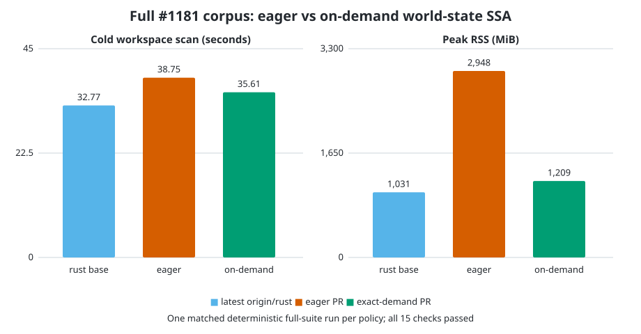

# PR #1360 full-corpus performance comparison

Base: `origin/rust` at `7c31a9d74` (including #1359). Candidate: `8246a30a0`. Both were built with the same Rust 1.97.0 toolchain and `cargo build --locked --release -p tcl-lsp-server` in isolated worktrees. The pinned #1181 `full` corpus contains 2,432 Tcl files from 21 repositories (corpus revision 1).

Six measured pairs followed discarded warm-ups. Pair order alternated base→candidate, then candidate→base. Every scenario used a fresh server and scratch corpus; no build, test, or other benchmark ran concurrently. Values are median ± median absolute deviation (min–max). Negative paired delta favours the candidate.

## Latency

| Scenario | rust base | PR candidate | Median paired delta | Candidate wins | Population |
|---|---:|---:|---:|---:|---|
| Cold workspace scan | 31.555 ± 0.524 s (30.994–34.277) | 36.068 ± 0.258 s (35.797–39.558) | +14.9% | 0/6 | all six pairs |
| Open 4 documents | 0.279 ± 0.019 s (0.252–0.326) | 0.307 ± 0.004 s (0.287–0.313) | +10.8% | 1/6 | all six pairs |
| Close 4 documents | 0.311 ± 0.005 s (0.305–0.320) | 0.316 ± 0.003 s (0.305–0.320) | +1.3% | 3/6 | all six pairs |
| 400-edit convergence | 0.731 ± 0.037 s (0.659–0.825) | 0.795 ± 0.040 s (0.748–1.021) | +7.2% | 2/5 | 5 successful pairs |

## Resident memory

| Metric | rust base | PR candidate | Median paired delta | Candidate wins |
|---|---:|---:|---:|---:|
| Peak RSS | 971.312 ± 16.336 MiB (948.406–991.938) | 2933.297 ± 18.086 MiB (2876.812–2964.641) | +200.9% | 0/6 |
| Final RSS | 971.312 ± 18.430 MiB (945.547–991.938) | 2933.297 ± 17.953 MiB (2870.031–2960.438) | +200.9% | 0/6 |
| Net RSS growth | 965.109 ± 19.570 MiB (939.391–986.750) | 2927.625 ± 17.945 MiB (2863.875–2954.781) | +202.3% | 0/6 |

## Reliability and complete deterministic suite

| Scenario | rust base | PR candidate | Interpretation |
|---|---:|---:|---|
| 100 light edits, semantic tokens after each | 0/6 | 1/6 | A failure is the first 30 s request timeout; both builds are unreliable at full-corpus scale. |
| 400-edit burst, then convergence request | 5/6 | 6/6 | Candidate completed every repetition; the base had one timeout. |
| Existing 15-check deterministic suite | 0/1 | 1/2 | Base was stopped after >690 s in `edit.tokens`. Candidate completed once in 49.2 s, then a measured repeat was stopped after >300 s at the same check. |

The complete successful candidate run peaked at 2,957.0 MiB RSS. Its check wall times were: scan 35.901 s; open 0.297 s; heavy edit dispatch 0.651 s; light tokenised edits 9.234 s; hover 0.001 s; definition 0.007 s; references 1.188 s; completion 0.294 s; symbols/folding 0.193 s; lens 0.215 s; code actions 0.348 s; symbol rename 0.056 s; file rename 0.348 s; references after rename 1.162 s; close 0.313 s.

## On-demand world-state follow-up

The first comparison identified eager semantic-sidecar construction as the merge blocker. A matched follow-up on the rebased tree (`origin/rust` at `dae8a6269`) separated executable invocation facts from world-state SSA and then changed interactive construction to request world-state SSA only when the exact common-GVN eligibility predicate found a reusable invocation. Full `SemanticAnalysisBundle::build` remains available for code generation, eBPF auditing, and future deep LSP queries.

The compiler-phase experiment built a `CompilationUnit` for every one of the same 2,432 files in a fresh process. Wall time is the median of three or four runs; RSS is a fresh representative run. The exact-demand policy found no closed reusable invocation in this corpus, so it built zero world-state graphs while retaining executable provenance for 27,443 of 28,314 functions.

| Compiler construction policy | Median wall | Peak RSS | Result |
|---|---:|---:|---|
| `origin/rust` (no common sidecar) | 16.145 s | 318.0 MiB | Baseline |
| Executable invocation facts, no world SSA | 17.691 s | 394.6 MiB | Measures the compact interactive layer |
| Exact-demand world SSA | 18.040 s | 387.3 MiB | Production policy; zero graphs required by this corpus |
| Eager executable + world SSA | 28.517 s | 2,119.2 MiB | Rejected policy |

The full deterministic LSP suite then compared fresh release servers over the full corpus. All 15 checks passed in every row below.

| Full LSP run | Cold scan | Peak RSS | Final RSS | Delta from eager candidate |
|---|---:|---:|---:|---:|
| Latest `origin/rust` | 32.771 s | 1,030.8 MiB | 1,000.5 MiB | — |
| Eager PR candidate | 38.745 s | 2,948.2 MiB | 1,400.4 MiB | Baseline for the fix |
| Exact-demand PR candidate | 35.605 s | 1,208.7 MiB | 1,192.2 MiB | −8.1% scan, −59.0% peak RSS |

Heap snapshots explain why the RSS delta is much larger than retained semantic data: the eager candidate had about 340 MiB of live allocations but a 2.8 GiB malloc zone with 79% fragmentation, versus 335.7 MiB live and a 916 MiB zone in the base. Building thousands of temporary world-state operations, versions, and phis drives small-allocation fragmentation; moving the same graph behind `Arc` or between Salsa caches did not reduce the peak. The exact-demand policy removes that temporary allocation wave from ordinary indexing without treating a missing graph as proof.

## Merge-strategy signal

The common semantic sidecar is not performance-neutral at full-corpus scale. The original eager policy raised median cold-scan time and roughly tripled resident memory while leaving document open/close latency unchanged. The exact-demand policy removes most of that cost and keeps the machinery available for code generation and future deep, revision-keyed LSP queries. A later optimisation can project the retained executable graph into a smaller GVN index, but it is not required to remove the allocator-fragmentation spike. The recommended merge strategy is therefore the exact-demand policy, with full world-state SSA remaining opt-in rather than an unconditional workspace-indexing side effect.

## Raw evidence

`results/` contains all 36 measured scenario JSON files (six repetitions × two builds × three scenarios), the original successful full-suite candidate JSON, and the matched `followup-{base,eager,on-demand}.json` full-suite runs. Each file includes per-check wall/CPU/RSS data, the 250 ms process timeline, host load, selected documents, corpus revision, and success/failure notes.
