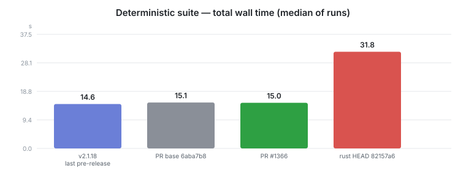
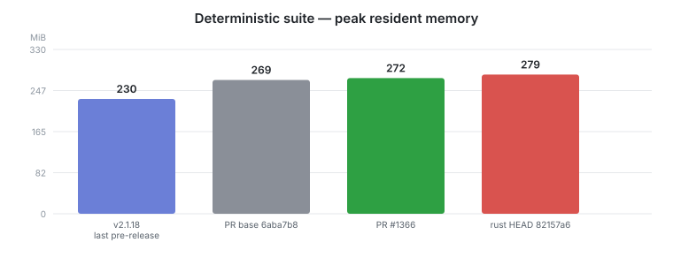
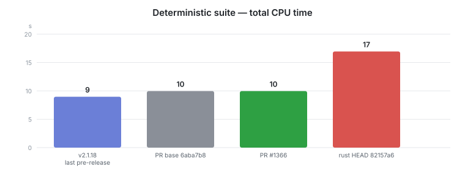
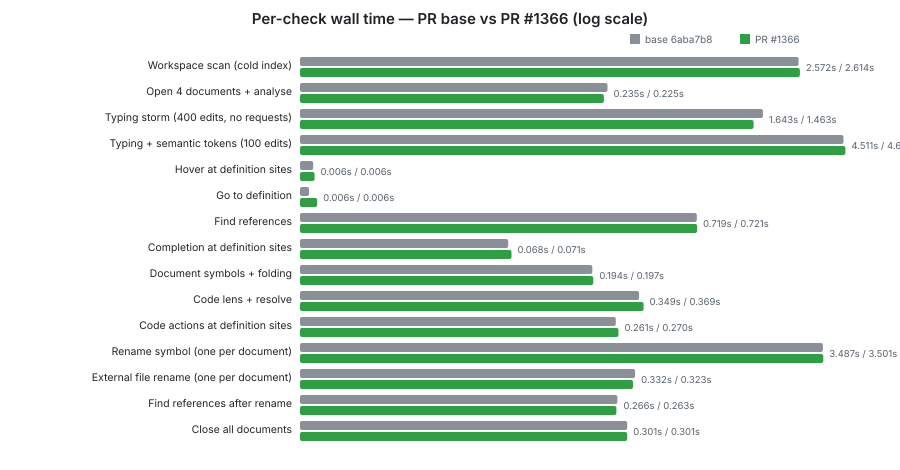

# PR #1366 deterministic-suite performance comparison

`bench.py --scope small` (the 15-check deterministic suite) against four server
builds, all measured on **one machine** in one sitting, because the harness's own
warning applies: run the sweep anywhere else and the graph compares hardware
rather than builds.

| Series | Build | Provenance |
|---|---|---|
| `v2.1.18` | last pre-release | published `x86_64-unknown-linux-gnu` release asset — the binary users actually ran |
| `PR base` | `6aba7b8` | this PR's merge base, built locally `--locked --release` |
| `PR #1366` | `ab9c6de` | this PR head, built locally `--locked --release` |
| `rust HEAD` | `82157a6` | `origin/rust` at time of writing, 38 commits ahead of this PR's base |

Corpus: the pinned #1181 `small` scope — 8 repositories, 113 Tcl files, corpus
revision 1 (includes georgtree/ruff, the project whose template-method pattern
this PR's #1367 half fixes). Host: 4-core Xeon @ 2.10 GHz, 16 GB.

Three measured repetitions per build after a discarded warm-up, alternating
base→candidate; the PR series pools nine runs because it was re-measured against
each baseline. Values are medians; the per-check table carries median absolute
deviation. Every check passed in every run (45/45 per build) — no timeouts, so
the wall times are complete rather than truncated.

## Headline





| Metric | v2.1.18 | PR base | PR #1366 | PR vs base | PR vs v2.1.18 |
|---|---:|---:|---:|---:|---:|
| Total wall | 14.61 s | 15.10 s | 15.00 s | **−0.6%** | +2.7% |
| Peak RSS | 230.3 MiB | 268.5 MiB | 272.2 MiB | **+1.4%** | +18.2% |
| Total CPU | 9 s | 10 s | 10 s | **0.0%** | +11.1% |

**This PR is performance-neutral.** Against its own merge base it is −0.6% wall,
+1.4% RSS, 0.0% CPU — inside run-to-run noise on every axis.

The larger deltas against v2.1.18 are **not** this PR: 14 upstream commits sit
between the tag and this PR's base, and they account for essentially all of it
(RSS 230.3 → 268.5 MiB before a line of this branch is applied). Attributing the
+18% memory to #1366 would be wrong, which is why the merge-base series exists.

## Per-check wall time, base vs PR



| Check | PR base `6aba7b8` | PR #1366 `ab9c6de` | Delta |
|---|---:|---:|---:|
| Workspace scan (cold index) | 2.572 ± 0.060 s | 2.614 ± 0.045 s | +1.6% |
| Open 4 documents + analyse | 0.235 ± 0.004 s | 0.225 ± 0.008 s | -4.4% |
| Typing storm (400 edits, no requests) | 1.643 ± 0.015 s | 1.463 ± 0.185 s | -11.0% |
| Typing + semantic tokens (100 edits) | 4.511 ± 0.215 s | 4.622 ± 0.062 s | +2.5% |
| Hover at definition sites | 0.006 ± 0.000 s | 0.006 ± 0.000 s | +1.7% |
| Go to definition | 0.006 ± 0.000 s | 0.006 ± 0.000 s | +10.7% |
| Find references | 0.719 ± 0.001 s | 0.721 ± 0.010 s | +0.3% |
| Completion at definition sites | 0.068 ± 0.001 s | 0.071 ± 0.002 s | +4.1% |
| Document symbols + folding | 0.194 ± 0.003 s | 0.197 ± 0.008 s | +1.3% |
| Code lens + resolve | 0.349 ± 0.006 s | 0.369 ± 0.004 s | +5.8% |
| Code actions at definition sites | 0.261 ± 0.004 s | 0.270 ± 0.009 s | +3.5% |
| Rename symbol (one per document) | 3.487 ± 0.008 s | 3.501 ± 0.033 s | +0.4% |
| External file rename (one per document) | 0.332 ± 0.005 s | 0.323 ± 0.004 s | -2.6% |
| Find references after rename | 0.266 ± 0.005 s | 0.263 ± 0.008 s | -1.2% |
| Close all documents | 0.301 ± 0.000 s | 0.301 ± 0.000 s | -0.0% |

Nothing moves outside noise. `Go to definition` shows +10.7% on a 6 ms check —
0.6 ms, at the sampler's resolution. The `Typing storm` −11.0% carries the
largest dispersion in the table (±0.185 s) and is not claimed as a win.

## Unrelated finding: `rust` HEAD is ~2× slower than this PR's base

The fourth series was measured to check whether this PR had drifted from
`origin/rust`. It had not — but `rust` HEAD itself is much slower than the base
this PR forked from, on the same corpus and machine:

| Check | PR base `6aba7b8` | rust HEAD `82157a6` | Delta |
|---|---:|---:|---:|
| Rename symbol | 3.487 s | 15.377 s | **+341%** |
| Document symbols + folding | 0.194 s | 0.571 s | **+194%** |
| Find references after rename | 0.266 s | 0.631 s | **+137%** |
| Workspace scan | 2.572 s | 5.971 s | **+132%** |
| Find references | 0.719 s | 1.406 s | **+96%** |
| **Total** | **15.10 s** | **31.79 s** | **+111%** |

Total CPU rises 10 s → 17 s. That regression entered in the 38 commits between
`6aba7b8` and `82157a6`; this PR does not contain it and is not affected by it.
Worth bisecting before the next pre-release — flagged here rather than fixed,
since it is outside this PR's scope.

## Reproducing

```
python3 scripts/perf/fetch_corpus.py --scope small
python3 scripts/perf/bench.py --server <binary> --version <label> \
        --scope small --out scripts/perf/comparisons/pr-1366/results
```

Raw per-run JSON for all 18 measured runs is in `results/`.

## Harness fix required to collect any of this

`bench.py` could not write a result file at all on Python 3.11: `Sampler`
subclasses `threading.Thread` and named its event `self._stop`, shadowing
`Thread._stop()`, which `join(timeout=...)` calls internally once the thread has
finished. Every run completed all 15 checks and then died with
`TypeError: 'Event' object is not callable` in the `finally` block — before the
JSON was written. Renamed to `_halt` in this branch.
