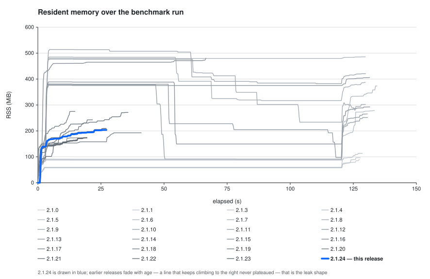
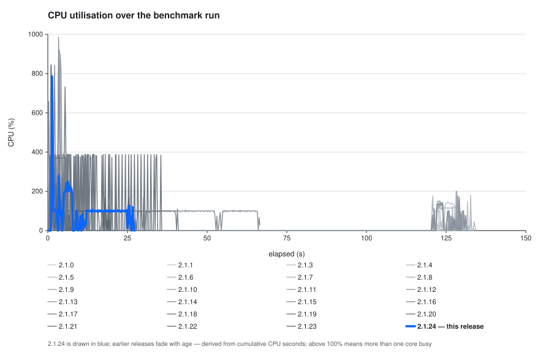
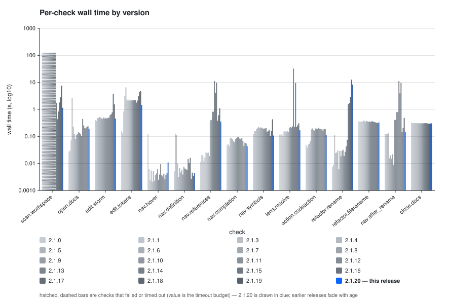

## Performance

| Version | Peak RSS (MiB) | Final RSS (MiB) | RSS growth (MiB) | Total CPU (s) | Total wall (s) | Failed checks |
| --- | ---: | ---: | ---: | ---: | ---: | ---: |
| 2.1.13 | 382.05 | 382.05 | 381.11 | 14.31 | 125.45 | 1 |
| 2.1.14 | 478.94 | 478.94 | 471.95 | 63.91 | 59.57 | 0 |
| 2.1.15 | 170.34 | 170.34 | 162.17 | 14.96 | 11.89 | 0 |

**Failed checks**

- `2.1.13` **scan.workspace** (Workspace scan (cold index)) failed or timed out at 120.01s — scan did not settle: TimeoutError

_Generated by `scripts/perf/report.py` from 3 result file(s) on Apple M1 Max (10 cores, 32 GiB, darwin-arm64) over a 113-file corpus, scope `small`, revision `1`. Wall-time axis: log10._
